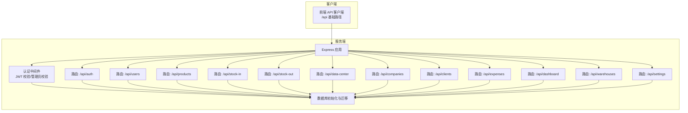
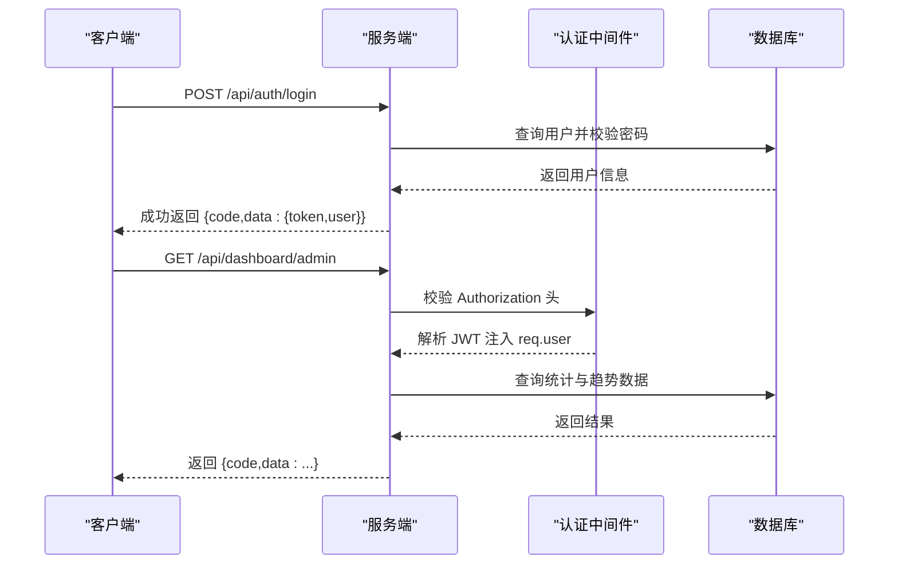
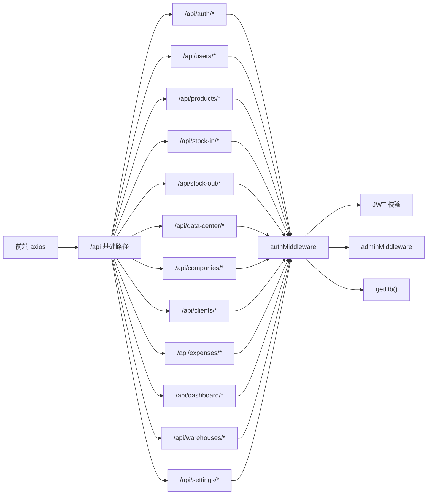

# API 接口文档

<cite>
**本文引用的文件**
- [server/index.js](file://server/index.js)
- [server/middleware/auth.js](file://server/middleware/auth.js)
- [server/db/init.js](file://server/db/init.js)
- [server/routes/auth.js](file://server/routes/auth.js)
- [server/routes/products.js](file://server/routes/products.js)
- [server/routes/stock-in.js](file://server/routes/stock-in.js)
- [server/routes/stock-out.js](file://server/routes/stock-out.js)
- [server/routes/users.js](file://server/routes/users.js)
- [server/routes/data-center.js](file://server/routes/data-center.js)
- [server/routes/companies.js](file://server/routes/companies.js)
- [server/routes/clients.js](file://server/routes/clients.js)
- [server/routes/expenses.js](file://server/routes/expenses.js)
- [server/routes/dashboard.js](file://server/routes/dashboard.js)
- [server/routes/warehouses.js](file://server/routes/warehouses.js)
- [server/routes/settings.js](file://server/routes/settings.js)
- [client/src/api/index.js](file://client/src/api/index.js)
</cite>

## 更新摘要
**变更内容**
- 更新了速率限制配置：全局API速率限制从每分钟120次增加到每分钟600次
- 保持登录接口速率限制为每分钟10次
- 添加了express-rate-limit依赖版本信息

## 目录
1. [简介](#简介)
2. [项目结构](#项目结构)
3. [核心组件](#核心组件)
4. [架构总览](#架构总览)
5. [详细组件分析](#详细组件分析)
6. [依赖关系分析](#依赖关系分析)
7. [性能与安全考量](#性能与安全考量)
8. [故障排查指南](#故障排查指南)
9. [版本管理与兼容性](#版本管理与兼容性)
10. [结论](#结论)

## 简介
本文件为 SY-Q 系统的完整 API 接口文档，覆盖认证、商品管理、库存管理、用户管理、数据中心等模块。文档提供每个接口的 HTTP 方法、URL 模式、请求参数、响应格式、状态码说明，并给出 JWT 认证使用方法、权限控制机制、错误处理与异常场景说明，以及 API 版本管理与向后兼容性建议。

## 项目结构
后端采用 Express + better-sqlite3 构建，路由按功能模块划分；前端通过 axios 统一发起请求，拦截器自动注入 Authorization 头并处理 401 重定向。

**图表来源**
- [server/index.js:68-95](file://server/index.js#L68-L95)
- [server/middleware/auth.js:1-29](file://server/middleware/auth.js#L1-L29)
- [server/db/init.js:18-214](file://server/db/init.js#L18-L214)

**章节来源**
- [server/index.js:68-95](file://server/index.js#L68-L95)
- [client/src/api/index.js:4-42](file://client/src/api/index.js#L4-L42)

## 核心组件
- 认证中间件：从 Authorization 头提取 Bearer Token，校验 JWT 并注入用户信息；提供管理员权限校验。
- 数据库初始化：自动创建表与外键约束，执行迁移逻辑，插入默认管理员与系统名称。
- 路由注册：统一挂载到 /api 前缀，部分接口（如登录）单独限流。

**章节来源**
- [server/middleware/auth.js:1-29](file://server/middleware/auth.js#L1-L29)
- [server/db/init.js:18-214](file://server/db/init.js#L18-L214)
- [server/index.js:68-95](file://server/index.js#L68-L95)

## 架构总览
- 基础路径：/api
- 认证方式：JWT（Authorization: Bearer <token>）
- 权限模型：普通用户与管理员；部分接口仅管理员可用
- 错误响应：统一返回 { code, message, data? } 结构，code=0 表示成功
- 速率限制：**更新** 全局每分钟 600 次；登录接口每分钟 10 次

**图表来源**
- [server/routes/auth.js:9-40](file://server/routes/auth.js#L9-L40)
- [server/middleware/auth.js:5-19](file://server/middleware/auth.js#L5-L19)
- [server/routes/dashboard.js:9-60](file://server/routes/dashboard.js#L9-L60)

## 详细组件分析

### 认证接口
- 登录
  - 方法与路径：POST /api/auth/login
  - 请求体参数：username, password
  - 成功响应：{ code: 0, data: { token, user: { id, username, real_name, phone, role } } }
  - 失败响应：{ code: 400, message }（账号或密码错误）
  - **更新** 速率限制：每分钟最多 10 次
- 修改密码
  - 方法与路径：POST /api/auth/change-password
  - 请求体参数：old_password, new_password（>=6 位）
  - 成功响应：{ code: 0, message: "密码修改成功" }
  - 失败响应：{ code: 400, message }（原密码错误/新密码过短）
- 获取当前用户信息
  - 方法与路径：GET /api/auth/me
  - 成功响应：{ code: 0, data: 用户基础信息 }
  - 失败响应：{ code: 401, message }（未登录）

**章节来源**
- [server/routes/auth.js:9-66](file://server/routes/auth.js#L9-L66)
- [server/index.js:46-63](file://server/index.js#L46-L63)

### 商品管理接口
- 获取商品列表
  - 方法与路径：GET /api/products
  - 查询参数：keyword（模糊搜索）、page、pageSize
  - 成功响应：{ code: 0, data: { list, total, page, pageSize } }
- 新增商品
  - 方法与路径：POST /api/products
  - 请求体参数：name, company_id?, spec, unit, quantity, price, remark
  - 成功响应：{ code: 0, message: "添加成功" }
  - 失败响应：{ code: 400, message }（名称为空/重复）
- 修改商品
  - 方法与路径：PUT /api/products/:id
  - 请求体参数：name, company_id?, spec, unit, price, remark
  - 成功响应：{ code: 0, message: "修改成功" }
  - 失败响应：{ code: 400, message }（不存在/重复）
- 删除商品（管理员）
  - 方法与路径：DELETE /api/products/:id
  - 成功响应：{ code: 0, message: "删除成功" }
  - 失败响应：{ code: 403, message }（权限不足）或 { code: 400, message }（存在出入库记录/不存在）

**章节来源**
- [server/routes/products.js:8-88](file://server/routes/products.js#L8-L88)

### 库存管理接口（入库）
- 生成入库单号
  - 方法与路径：GET /api/stock-in/generate-order-no
  - 成功响应：{ code: 0, data: { order_no } }
- 获取入库单列表（按单号分组）
  - 方法与路径：GET /api/stock-in
  - 查询参数：keyword、page、pageSize
  - 成功响应：{ code: 0, data: { list, total, page, pageSize } }
- 获取入库单明细
  - 方法与路径：GET /api/stock-in/order/:orderNo
  - 成功响应：{ code: 0, data: 明细数组 }
- 获取入库明细列表（兼容接口）
  - 方法与路径：GET /api/stock-in/items
  - 查询参数：keyword、page、pageSize
  - 成功响应：{ code: 0, data: { list, total, page, pageSize } }
- 批量入库
  - 方法与路径：POST /api/stock-in
  - 请求体参数：order_no, company_id, warehouse_id, items[]
  - items 子项：product_id, unit?, price?, quantity (>0), remark?
  - 成功响应：{ code: 0, message: "入库成功，共 N 条商品" }
  - 失败响应：{ code: 400, message }（必填缺失/库房不存在/商品不存在/事务异常）

**章节来源**
- [server/routes/stock-in.js:26-170](file://server/routes/stock-in.js#L26-L170)

### 库存管理接口（出库）
- 生成出库单号
  - 方法与路径：GET /api/stock-out/generate-order-no
  - 成功响应：{ code: 0, data: { order_no } }
- 获取出库单列表（按单号分组）
  - 方法与路径：GET /api/stock-out
  - 查询参数：keyword、page、pageSize
  - 成功响应：{ code: 0, data: { list, total, page, pageSize } }
- 获取出库单明细
  - 方法与路径：GET /api/stock-out/order/:orderNo
  - 成功响应：{ code: 0, data: 明细数组 }
- 获取出库明细列表（兼容接口）
  - 方法与路径：GET /api/stock-out/items
  - 查询参数：keyword、page、pageSize
  - 成功响应：{ code: 0, data: { list, total, page, pageSize } }
- 批量出库
  - 方法与路径：POST /api/stock-out
  - 请求体参数：order_no, client_id, warehouse_id, items[]
  - items 子项：product_id, unit?, price?, quantity (>0), remark?
  - 成功响应：{ code: 0, message: "出库成功，共 N 条商品" }
  - 失败响应：{ code: 400, message }（必填缺失/库房不存在/商品不存在/库存不足/事务异常）

**章节来源**
- [server/routes/stock-out.js:26-175](file://server/routes/stock-out.js#L26-L175)

### 用户管理接口（管理员）
- 获取用户列表
  - 方法与路径：GET /api/users
  - 查询参数：keyword、page、pageSize
  - 成功响应：{ code: 0, data: { list, total, page, pageSize } }
- 新增用户
  - 方法与路径：POST /api/users
  - 请求体参数：username, password, real_name, phone, role（默认 user）
  - 成功响应：{ code: 0, message: "添加成功" }
  - 失败响应：{ code: 400, message }（必填缺失/重复）
- 修改用户
  - 方法与路径：PUT /api/users/:id
  - 请求体参数：username, real_name, phone, role, password?
  - 成功响应：{ code: 0, message: "修改成功" }
  - 失败响应：{ code: 400, message }（不存在/重复）
- 删除用户（默认管理员不可删）
  - 方法与路径：DELETE /api/users/:id
  - 成功响应：{ code: 0, message: "删除成功" }
  - 失败响应：{ code: 400, message }（不存在/默认管理员）

**章节来源**
- [server/routes/users.js:9-84](file://server/routes/users.js#L9-L84)

### 数据中心接口（管理员）
- 导出 Excel
  - 方法与路径：GET /api/data-center/export/:type
  - 支持类型：products, stock-in, stock-out, expenses
  - 成功响应：二进制 Excel 文件
  - 失败响应：{ code: 400, message }（不支持的类型）
- 下载商品导入模板
  - 方法与路径：GET /api/data-center/import-template/products
  - 成功响应：二进制 Excel 文件
- 商品数据导入
  - 方法与路径：POST /api/data-center/import-products
  - 表单字段：file（.xlsx/.xls/.db）
  - 成功响应：{ code: 0, message: "导入完成：成功 X 条，跳过 Y 条" }
  - 失败响应：{ code: 400, message }（文件缺失/格式错误/列缺失）
- 数据库备份
  - 方法与路径：POST /api/data-center/backup
  - 成功响应：{ code: 0, message: "备份成功", data: { filename } }
- 获取备份列表
  - 方法与路径：GET /api/data-center/backups
  - 成功响应：{ code: 0, data: 文件名数组 }
- 数据库恢复
  - 方法与路径：POST /api/data-center/restore
  - 方式一：上传文件（file），方式二：指定备份文件名（filename）
  - 成功响应：{ code: 0, message: "恢复成功" }
  - 失败响应：{ code: 400/500, message }（非法文件名/文件不存在/恢复失败）
- 数据库重置
  - 方法与路径：POST /api/data-center/reset
  - 成功响应：{ code: 0, message: "数据库重置成功" }
  - 失败响应：{ code: 500, message }（重置失败）

**章节来源**
- [server/routes/data-center.js:29-257](file://server/routes/data-center.js#L29-L257)

### 公司管理接口（管理员）
- 获取公司列表
  - 方法与路径：GET /api/companies
  - 查询参数：keyword、page、pageSize
  - 成功响应：{ code: 0, data: { list, total, page, pageSize } }
- 获取全部公司（下拉）
  - 方法与路径：GET /api/companies/all
  - 成功响应：{ code: 0, data: [{ id, name }] }
- 查找或创建公司
  - 方法与路径：POST /api/companies/find-or-create
  - 请求体：name
  - 成功响应：{ code: 0, data: { id, name }, message: "已存在"/"已自动创建" }
- 新增公司
  - 方法与路径：POST /api/companies
  - 请求体：name, credit_code?, address?, contact?, phone?, remark?
  - 成功响应：{ code: 0, message: "添加成功" }
- 修改公司
  - 方法与路径：PUT /api/companies/:id
  - 请求体：name, credit_code?, address?, contact?, phone?, remark?
  - 成功响应：{ code: 0, message: "修改成功" }
- 删除公司（存在关联商品则禁止）
  - 方法与路径：DELETE /api/companies/:id
  - 成功响应：{ code: 0, message: "删除成功" }
  - 失败响应：{ code: 400, message }（不存在/存在关联商品）

**章节来源**
- [server/routes/companies.js:8-101](file://server/routes/companies.js#L8-L101)

### 客户管理接口（管理员）
- 获取客户列表
  - 方法与路径：GET /api/clients
  - 查询参数：keyword、page、pageSize
  - 成功响应：{ code: 0, data: { list, total, page, pageSize } }
- 获取全部客户（下拉）
  - 方法与路径：GET /api/clients/all
  - 成功响应：{ code: 0, data: [{ id, name }] }
- 新增客户
  - 方法与路径：POST /api/clients
  - 请求体：name, credit_code?, address?, contact?, phone?, remark?
  - 成功响应：{ code: 0, message: "添加成功" }
- 修改客户
  - 方法与路径：PUT /api/clients/:id
  - 请求体：name, credit_code?, address?, contact?, phone?, remark?
  - 成功响应：{ code: 0, message: "修改成功" }
- 删除客户（存在出库记录则禁止）
  - 方法与路径：DELETE /api/clients/:id
  - 成功响应：{ code: 0, message: "删除成功" }
  - 失败响应：{ code: 400, message }（不存在/存在出库记录）

**章节来源**
- [server/routes/clients.js:8-78](file://server/routes/clients.js#L8-L78)

### 开销管理接口
- 获取开销列表
  - 方法与路径：GET /api/expenses
  - 查询参数：keyword、page、pageSize
  - 成功响应：{ code: 0, data: { list, total, page, pageSize } }
- 新增开销
  - 方法与路径：POST /api/expenses
  - 请求体：name, category?, pay_method?, amount (>0), payer?, recipient?, remark?
  - 成功响应：{ code: 0, message: "添加成功" }
- 修改开销
  - 方法与路径：PUT /api/expenses/:id
  - 请求体：name, category?, pay_method?, amount (>0), payer?, recipient?, remark?
  - 成功响应：{ code: 0, message: "修改成功" }
- 删除开销
  - 方法与路径：DELETE /api/expenses/:id
  - 成功响应：{ code: 0, message: "删除成功" }

**章节来源**
- [server/routes/expenses.js:8-70](file://server/routes/expenses.js#L8-L70)

### 仪表盘接口
- 管理员仪表盘
  - 方法与路径：GET /api/dashboard/admin
  - 成功响应：{ code: 0, data: { productCount, stockValue, monthStockIn, monthStockInQty, monthStockOut, monthStockOutQty, monthExpense, trendData, recentOps } }
- 普通用户仪表盘
  - 方法与路径：GET /api/dashboard/user
  - 成功响应：{ code: 0, data: { myProducts, myStockIn, myStockOut, myExpense, recentOps } }

**章节来源**
- [server/routes/dashboard.js:9-89](file://server/routes/dashboard.js#L9-L89)

### 库房管理接口
- 获取全部库房（下拉）
  - 方法与路径：GET /api/warehouses/all
  - 成功响应：{ code: 0, data: [{ id, name, address }] }
- 查找或创建库房
  - 方法与路径：POST /api/warehouses/find-or-create
  - 请求体：name
  - 成功响应：{ code: 0, data: { id, name }, message: "已存在"/"已自动创建" }
- 获取某商品在各库房的库存分布
  - 方法与路径：GET /api/warehouses/stock/:productId
  - 成功响应：{ code: 0, data: [{ id, name, quantity }] }
- 获取库房列表
  - 方法与路径：GET /api/warehouses
  - 查询参数：keyword、page、pageSize
  - 成功响应：{ code: 0, data: { list, total, page, pageSize } }
- 新增库房
  - 方法与路径：POST /api/warehouses
  - 请求体：name, address?, remark?
  - 成功响应：{ code: 0, message: "添加成功" }
- 修改库房
  - 方法与路径：PUT /api/warehouses/:id
  - 请求体：name, address?, remark?
  - 成功响应：{ code: 0, message: "修改成功" }
- 删除库房（存在出入库记录则禁止）
  - 方法与路径：DELETE /api/warehouses/:id
  - 成功响应：{ code: 0, message: "删除成功" }
  - 失败响应：{ code: 400, message }（不存在/存在出入库记录）

**章节来源**
- [server/routes/warehouses.js:8-107](file://server/routes/warehouses.js#L8-L107)

### 系统设置接口（管理员）
- 获取系统名称（公开）
  - 方法与路径：GET /api/settings/system-name
  - 成功响应：{ code: 0, data: { system_name } }
- 获取系统设置
  - 方法与路径：GET /api/settings
  - 成功响应：{ code: 0, data: { key: value, ... } }
- 更新系统名称
  - 方法与路径：PUT /api/settings/system-name
  - 请求体：system_name
  - 成功响应：{ code: 0, message: "修改成功" }

**章节来源**
- [server/routes/settings.js:6-31](file://server/routes/settings.js#L6-L31)

## 依赖关系分析
- 路由对认证中间件的依赖：大多数路由使用 authMiddleware；部分管理员专属路由再叠加 adminMiddleware。
- 数据库依赖：所有业务路由均通过 getDb() 获取连接，依赖 init.js 中的表结构与迁移。
- 前端依赖：axios 实例统一设置 baseURL=/api，并在请求拦截器中注入 Authorization 头；响应拦截器处理 401 自动登出。

**图表来源**
- [server/index.js:68-95](file://server/index.js#L68-L95)
- [server/middleware/auth.js:5-26](file://server/middleware/auth.js#L5-L26)
- [client/src/api/index.js:9-39](file://client/src/api/index.js#L9-L39)

**章节来源**
- [server/index.js:68-95](file://server/index.js#L68-L95)
- [server/middleware/auth.js:5-26](file://server/middleware/auth.js#L5-L26)
- [client/src/api/index.js:9-39](file://client/src/api/index.js#L9-L39)

## 性能与安全考量
- **更新** 速率限制：全局每分钟 600 次；登录接口每分钟 10 次，避免暴力破解与滥用。
- 安全响应头：Helmet 关闭严格 CSP，适配同域前后端部署。
- CORS：允许本地与 Render 域名，支持 .onrender.com 子域名；生产环境可按需扩展。
- 请求体大小：限制为 2MB，避免过大负载。
- JWT：仅从 Authorization 头读取，禁止 URL 参数传递，降低泄露风险。
- 数据库：WAL 模式与外键开启，提升并发与一致性；迁移逻辑保证历史数据兼容。
- **新增** 速率限制依赖：使用 express-rate-limit@8.5.2 提供的速率限制功能。

**章节来源**
- [server/index.js:11-63](file://server/index.js#L11-L63)
- [server/middleware/auth.js:6-8](file://server/middleware/auth.js#L6-L8)
- [server/db/init.js:12-13](file://server/db/init.js#L12-L13)

## 故障排查指南
- 401 未登录/登录过期
  - 现象：前端收到 { code: 401 } 或 401 响应，自动清除本地 token 并跳转登录页
  - 排查：确认 Authorization 头是否正确携带 Bearer token；检查 JWT 是否过期
- 403 权限不足
  - 现象：访问管理员接口被拒绝
  - 排查：确认用户角色为 admin
- 400 参数错误/业务异常
  - 现象：返回具体错误消息（如必填缺失、重复、库存不足等）
  - 排查：核对请求体字段与业务规则
- **更新** 429 请求过于频繁
  - 现象：达到速率限制时返回 { code: 429, message: '请求过于频繁，请稍后再试' }
  - 排查：检查是否超过每分钟 600 次的全局限制；登录接口仍受每分钟 10 次限制
- 500 服务器内部错误
  - 现象：数据库事务或文件操作异常
  - 排查：查看服务端日志，确认数据库连接与文件权限

**章节来源**
- [client/src/api/index.js:21-35](file://client/src/api/index.js#L21-L35)
- [server/middleware/auth.js:10-18](file://server/middleware/auth.js#L10-L18)
- [server/routes/products.js:72-87](file://server/routes/products.js#L72-L87)
- [server/routes/stock-in.js:164-169](file://server/routes/stock-in.js#L164-L169)
- [server/routes/stock-out.js:169-174](file://server/routes/stock-out.js#L169-L174)
- [server/index.js:108-115](file://server/index.js#L108-L115)

## 版本管理与兼容性
- 版本策略：当前未实现基于 URL 的版本号（如 /api/v1），建议后续引入 /api/v1 以保障向后兼容
- 向后兼容性
  - 入库/出库明细接口保留 /items 兼容旧调用方
  - 数据中心导入支持 .xlsx/.xls/.db，模板与导入逻辑向前兼容
  - 数据库迁移逻辑自动补齐新增字段，避免破坏现有数据
- 建议
  - 引入 API 版本号与弃用策略
  - 对敏感接口增加幂等性与审计日志
  - 前后端约定统一的错误码与提示语，便于国际化与维护

**章节来源**
- [server/routes/stock-in.js:82-107](file://server/routes/stock-in.js#L82-L107)
- [server/routes/stock-out.js:82-107](file://server/routes/stock-out.js#L82-L107)
- [server/routes/data-center.js:113-171](file://server/routes/data-center.js#L113-L171)
- [server/db/init.js:133-195](file://server/db/init.js#L133-L195)

## 结论
本 API 文档覆盖了 SY-Q 系统的主要业务能力，提供了清晰的接口规范、认证与权限模型、错误处理与性能安全策略。**更新** 速率限制配置已从每分钟120次提高到每分钟600次，以适应批量库存操作期间的更高请求量需求。建议后续引入 API 版本化与更完善的监控与审计机制，持续提升系统的稳定性与可维护性。