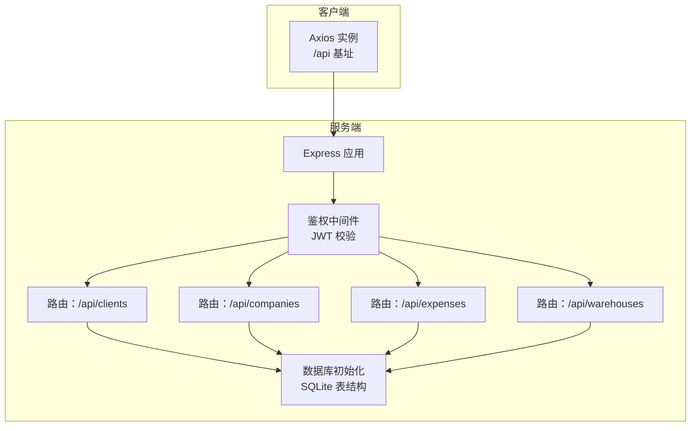
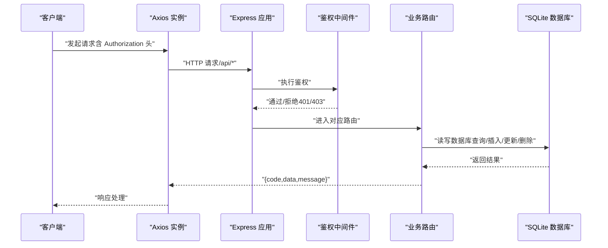
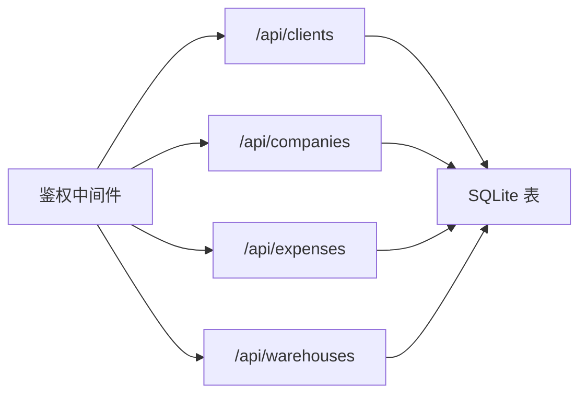

# 业务管理接口

<cite>
**本文引用的文件**
- [server/index.js](file://server/index.js)
- [server/middleware/auth.js](file://server/middleware/auth.js)
- [server/db/init.js](file://server/db/init.js)
- [server/routes/clients.js](file://server/routes/clients.js)
- [server/routes/companies.js](file://server/routes/companies.js)
- [server/routes/expenses.js](file://server/routes/expenses.js)
- [server/routes/warehouses.js](file://server/routes/warehouses.js)
- [client/src/api/index.js](file://client/src/api/index.js)
</cite>

## 目录
1. [简介](#简介)
2. [项目结构](#项目结构)
3. [核心组件](#核心组件)
4. [架构总览](#架构总览)
5. [详细组件分析](#详细组件分析)
6. [依赖关系分析](#依赖关系分析)
7. [性能考虑](#性能考虑)
8. [故障排除指南](#故障排除指南)
9. [结论](#结论)

## 简介
本文件为“业务管理接口”的综合 API 文档，覆盖以下业务实体与功能：
- 客户管理：客户信息维护、客户列表查询、客户分类（通过关联商品与交易）、交易记录（出库）校验
- 公司管理：企业信息管理、多公司支持、公司间交易处理（入库单据可选公司）
- 费用管理：费用类别设置、费用记录、统计检索
- 仓库管理：仓库信息、库存分配（商品在各仓库的库存）、多仓库支持

文档对每个接口给出 HTTP 方法、URL 路径、请求参数、响应数据结构与状态码，并说明业务逻辑验证与数据一致性保障机制。

## 项目结构
后端基于 Express，采用中间件鉴权与 JWT 校验；数据库为 SQLite（better-sqlite3），通过初始化脚本创建核心业务表及外键约束；前端通过统一 API 基地址访问后端接口。

图表来源
- [server/index.js:68-95](file://server/index.js#L68-L95)
- [server/middleware/auth.js:5-26](file://server/middleware/auth.js#L5-L26)
- [server/db/init.js:18-214](file://server/db/init.js#L18-L214)

章节来源
- [server/index.js:1-120](file://server/index.js#L1-L120)
- [client/src/api/index.js:1-42](file://client/src/api/index.js#L1-L42)

## 核心组件
- 鉴权中间件：从 Authorization 头解析 Bearer Token，校验失败返回 401；管理员接口额外校验角色
- 数据库初始化：创建用户、设置、仓库、商品、出入库、费用等表，并建立外键关系与必要字段迁移
- 路由模块：按业务划分，提供 CRUD 与特定查询接口，统一返回 { code, data?, message? }

章节来源
- [server/middleware/auth.js:1-29](file://server/middleware/auth.js#L1-L29)
- [server/db/init.js:18-214](file://server/db/init.js#L18-L214)

## 架构总览
接口统一前缀 /api，客户端通过 Axios 发起请求并在请求头携带 Authorization: Bearer token。后端进行鉴权与管理员权限校验，随后路由处理业务逻辑并访问 SQLite 数据库。

图表来源
- [client/src/api/index.js:9-39](file://client/src/api/index.js#L9-L39)
- [server/index.js:68-95](file://server/index.js#L68-L95)
- [server/middleware/auth.js:5-26](file://server/middleware/auth.js#L5-L26)

## 详细组件分析

### 客户管理接口
- 列表查询（分页）
  - 方法与路径：GET /api/clients
  - 权限：管理员
  - 查询参数：
    - keyword：关键词（模糊匹配 名称/联系人/电话）
    - page：页码（默认 1）
    - pageSize：每页条数（默认 20）
  - 响应数据：
    - code：0 成功，其他错误码
    - data.list：客户列表（按 id 倒序）
    - data.total：总数
    - data.page/pageSize：当前页与页大小
  - 状态码：200 成功；401 未登录；403 权限不足
  - 业务校验：
    - 关键词为空时仅按基础条件查询
    - 返回前计算总数与分页偏移
  - 一致性：
    - 删除前检查是否存在出库记录，避免破坏历史交易链路

- 获取全部客户（下拉选择）
  - 方法与路径：GET /api/clients/all
  - 响应数据：[{ id, name }, ...]
  - 状态码：200；401 未登录

- 新增客户
  - 方法与路径：POST /api/clients
  - 权限：管理员
  - 请求体字段：name, credit_code, address, contact, phone, remark
  - 校验：名称必填且去空格后非空；名称唯一
  - 状态码：200 成功；400 参数或业务错误；401/403 鉴权相关

- 修改客户
  - 方法与路径：PUT /api/clients/:id
  - 权限：管理员
  - 请求体字段：name, credit_code, address, contact, phone, remark
  - 校验：名称必填且唯一（排除自身）

- 删除客户
  - 方法与路径：DELETE /api/clients/:id
  - 权限：管理员
  - 校验：客户存在；若存在出库记录则禁止删除

章节来源
- [server/routes/clients.js:8-22](file://server/routes/clients.js#L8-L22)
- [server/routes/clients.js:24-28](file://server/routes/clients.js#L24-L28)
- [server/routes/clients.js:30-43](file://server/routes/clients.js#L30-L43)
- [server/routes/clients.js:45-63](file://server/routes/clients.js#L45-L63)
- [server/routes/clients.js:65-78](file://server/routes/clients.js#L65-L78)

### 公司管理接口
- 列表查询（分页）
  - 方法与路径：GET /api/companies
  - 权限：管理员
  - 查询参数：keyword, page, pageSize
  - 响应：分页数据（按 id 倒序）

- 获取全部公司
  - 方法与路径：GET /api/companies/all
  - 响应：[{ id, name }, ...]

- 查找或创建公司（入库时自动按名称创建）
  - 方法与路径：POST /api/companies/find-or-create
  - 请求体：{ name }
  - 若存在：返回 { code=0, data={id,name}, message="已存在" }
  - 若不存在：创建并返回 { code=0, data={id,name}, message="已自动创建" }

- 新增公司
  - 方法与路径：POST /api/companies
  - 权限：管理员
  - 请求体：name, credit_code, address, contact, phone, remark
  - 校验：名称必填且唯一

- 修改公司
  - 方法与路径：PUT /api/companies/:id
  - 权限：管理员
  - 校验：名称必填且唯一（排除自身）

- 删除公司
  - 方法与路径：DELETE /api/companies/:id
  - 权限：管理员
  - 校验：公司存在；若存在关联商品则禁止删除

章节来源
- [server/routes/companies.js:8-23](file://server/routes/companies.js#L8-L23)
- [server/routes/companies.js:25-30](file://server/routes/companies.js#L25-L30)
- [server/routes/companies.js:32-45](file://server/routes/companies.js#L32-L45)
- [server/routes/companies.js:47-62](file://server/routes/companies.js#L47-L62)
- [server/routes/companies.js:64-84](file://server/routes/companies.js#L64-L84)
- [server/routes/companies.js:86-101](file://server/routes/companies.js#L86-L101)

### 费用管理接口
- 列表查询（分页）
  - 方法与路径：GET /api/expenses
  - 查询参数：keyword, page, pageSize
  - 响应：分页数据（按 id 倒序）

- 新增费用
  - 方法与路径：POST /api/expenses
  - 请求体：name, category, pay_method, amount, payer, recipient, remark
  - 校验：name 必填且非空；amount 必须大于 0；自动记录创建人（来自 token 的用户）

- 修改费用
  - 方法与路径：PUT /api/expenses/:id
  - 请求体：name, category, pay_method, amount, payer, recipient, remark
  - 校验：name 必填且非空；amount 必须大于 0；记录存在性校验

- 删除费用
  - 方法与路径：DELETE /api/expenses/:id
  - 校验：记录存在性校验

章节来源
- [server/routes/expenses.js:8-23](file://server/routes/expenses.js#L8-L23)
- [server/routes/expenses.js:25-38](file://server/routes/expenses.js#L25-L38)
- [server/routes/expenses.js:40-58](file://server/routes/expenses.js#L40-L58)
- [server/routes/expenses.js:60-70](file://server/routes/expenses.js#L60-L70)

### 仓库管理接口
- 获取全部仓库（下拉选择）
  - 方法与路径：GET /api/warehouses/all
  - 响应：[{ id, name, address }, ...]

- 查找或创建仓库（入库时自动按名称创建）
  - 方法与路径：POST /api/warehouses/find-or-create
  - 请求体：{ name }
  - 若存在：返回 { code=0, data={id,name}, message="已存在" }
  - 若不存在：创建并返回 { code=0, data={id,name}, message="已自动创建" }

- 查询某商品在各仓库的库存分布
  - 方法与路径：GET /api/warehouses/stock/:productId
  - 响应：[{ id, name, quantity }, ...]（quantity 为 0 时表示无库存）

- 列表查询（分页）
  - 方法与路径：GET /api/warehouses
  - 查询参数：keyword, page, pageSize
  - 响应：分页数据（按 id 升序）

- 新增仓库
  - 方法与路径：POST /api/warehouses
  - 请求体：name, address, remark
  - 校验：name 必填且唯一

- 修改仓库
  - 方法与路径：PUT /api/warehouses/:id
  - 请求体：name, address, remark
  - 校验：name 必填且唯一（排除自身）

- 删除仓库
  - 方法与路径：DELETE /api/warehouses/:id
  - 校验：
    - 仓库存在
    - 该仓库库存总量为 0
    - 无入库/出库记录

章节来源
- [server/routes/warehouses.js:8-13](file://server/routes/warehouses.js#L8-L13)
- [server/routes/warehouses.js:15-28](file://server/routes/warehouses.js#L15-L28)
- [server/routes/warehouses.js:30-41](file://server/routes/warehouses.js#L30-L41)
- [server/routes/warehouses.js:43-58](file://server/routes/warehouses.js#L43-L58)
- [server/routes/warehouses.js:60-74](file://server/routes/warehouses.js#L60-L74)
- [server/routes/warehouses.js:76-91](file://server/routes/warehouses.js#L76-L91)
- [server/routes/warehouses.js:93-114](file://server/routes/warehouses.js#L93-L114)

## 依赖关系分析
- 客户、公司、费用、仓库路由均依赖鉴权中间件；其中客户与公司部分接口还依赖管理员中间件
- 所有路由最终访问 SQLite 数据库，数据库初始化时创建核心表并启用外键约束
- 前端通过统一基址 /api 访问，自动注入 Authorization 头；401 时自动跳转登录

图表来源
- [server/index.js:68-95](file://server/index.js#L68-L95)
- [server/middleware/auth.js:5-26](file://server/middleware/auth.js#L5-L26)
- [server/db/init.js:18-214](file://server/db/init.js#L18-L214)

章节来源
- [server/index.js:68-95](file://server/index.js#L68-L95)
- [server/middleware/auth.js:1-29](file://server/middleware/auth.js#L1-L29)
- [server/db/init.js:18-214](file://server/db/init.js#L18-L214)

## 性能考虑
- 分页查询：列表接口统一使用 LIMIT/OFFSET，避免一次性返回大量数据
- 索引建议：根据实际查询热点可在 name、created_at 等列上建立索引（当前实现未显式建索引）
- SQL 预处理：使用预编译语句减少注入风险并提升执行效率
- 数据库模式：WAL 模式与外键开启有助于并发与一致性

## 故障排除指南
- 401 未登录/登录过期：检查 Authorization 头是否正确携带 Bearer Token；确认 token 未过期
- 403 权限不足：确认当前用户角色为 admin；仅管理员接口会触发此错误
- 400 业务错误：常见于必填字段缺失、名称重复、关联数据存在等情况；根据具体接口提示修正
- 429 请求过于频繁：触发全局或登录接口限流，稍后再试
- 500 服务器内部错误：查看服务端日志定位异常

章节来源
- [server/middleware/auth.js:5-26](file://server/middleware/auth.js#L5-L26)
- [server/index.js:46-63](file://server/index.js#L46-L63)
- [client/src/api/index.js:17-39](file://client/src/api/index.js#L17-L39)

## 结论
本系统以简洁的路由设计覆盖客户、公司、费用与仓库四大业务域，配合鉴权与管理员权限控制，确保操作安全；数据库层通过外键与唯一约束保障数据一致性。接口返回统一结构，便于前端处理与扩展。