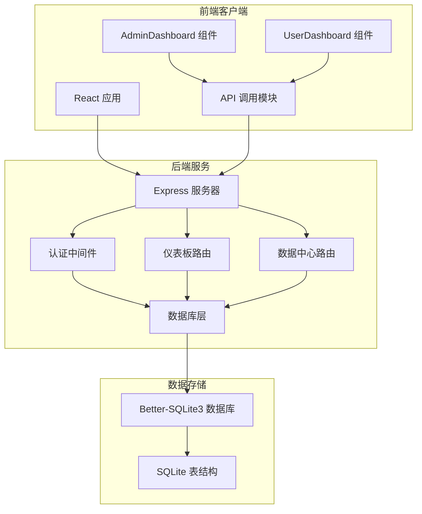
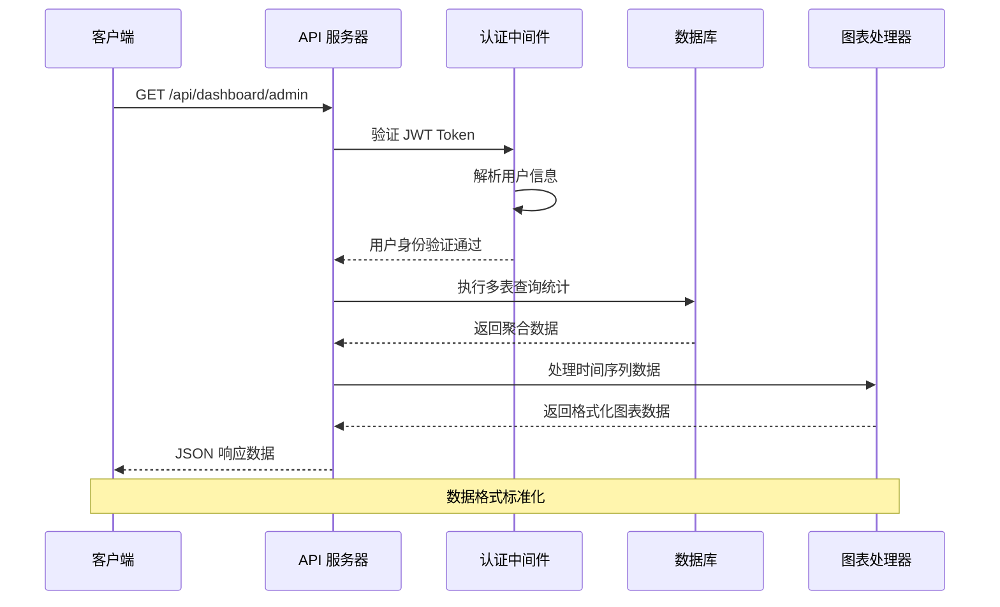
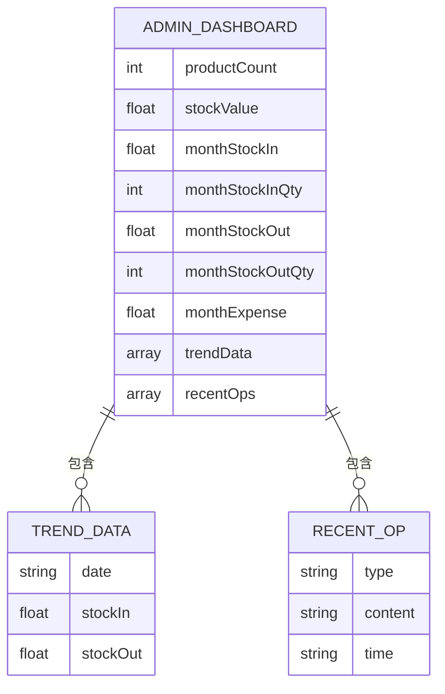
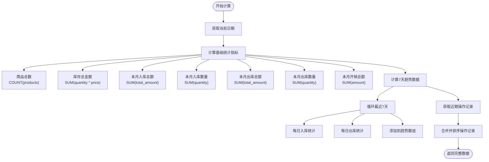
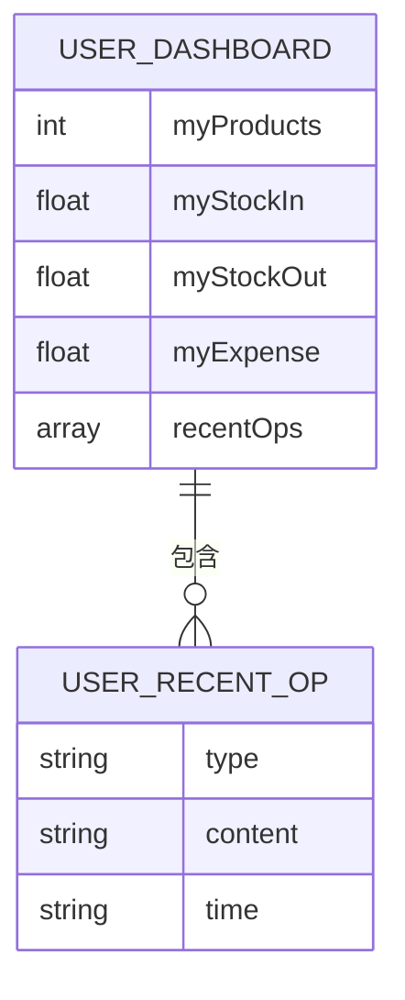
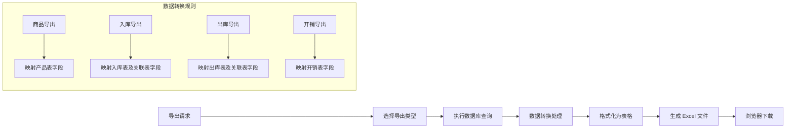
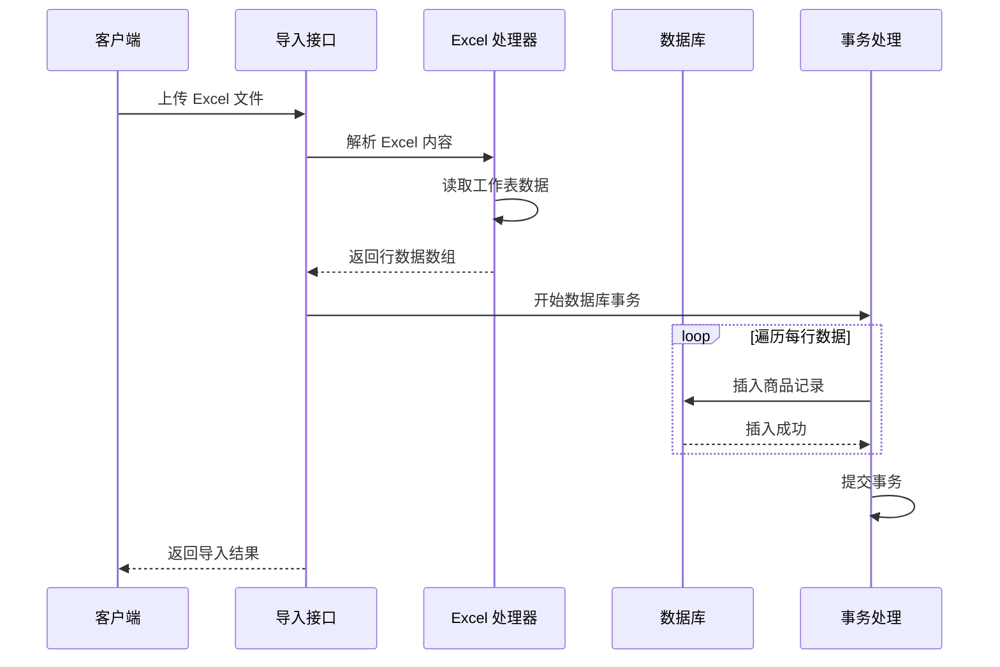
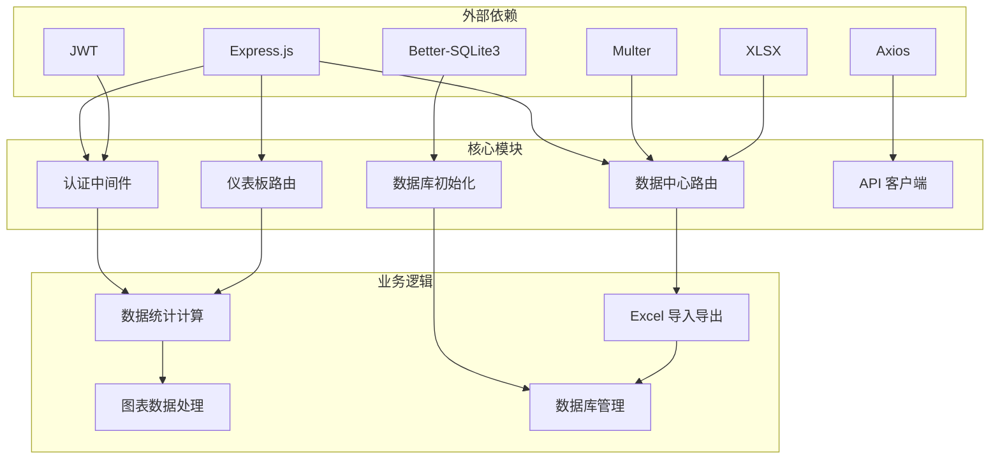

# 仪表板与分析接口

<cite>
**本文档引用的文件**
- [server/routes/dashboard.js](file://server/routes/dashboard.js)
- [server/routes/data-center.js](file://server/routes/data-center.js)
- [server/middleware/auth.js](file://server/middleware/auth.js)
- [server/db/init.js](file://server/db/init.js)
- [client/src/pages/admin/Dashboard.jsx](file://client/src/pages/admin/Dashboard.jsx)
- [client/src/pages/user/Dashboard.jsx](file://client/src/pages/user/Dashboard.jsx)
- [client/src/api/index.js](file://client/src/api/index.js)
- [server/index.js](file://server/index.js)
</cite>

## 目录
1. [简介](#简介)
2. [项目结构](#项目结构)
3. [核心组件](#核心组件)
4. [架构概览](#架构概览)
5. [详细组件分析](#详细组件分析)
6. [依赖关系分析](#依赖关系分析)
7. [性能考虑](#性能考虑)
8. [故障排除指南](#故障排除指南)
9. [结论](#结论)

## 简介

本项目是一个基于 Node.js 和 React 的库存管理系统，专注于提供全面的仪表板与分析功能。系统实现了管理员和普通用户的双层仪表板，提供实时的业务数据统计、图表数据生成和关键指标计算。本文档详细记录了仪表板数据聚合接口、图表数据接口规范、数据筛选和过滤机制，以及缓存策略和性能优化方案。

## 项目结构

系统采用前后端分离架构，主要分为以下模块：



**图表来源**
- [server/index.js:69-95](file://server/index.js#L69-L95)
- [server/routes/dashboard.js:1-92](file://server/routes/dashboard.js#L1-L92)
- [server/routes/data-center.js:1-260](file://server/routes/data-center.js#L1-L260)

**章节来源**
- [server/index.js:1-120](file://server/index.js#L1-L120)
- [server/db/init.js:1-217](file://server/db/init.js#L1-L217)

## 核心组件

### 仪表板数据聚合器

系统提供两个层级的仪表板数据聚合接口：

1. **管理员仪表板** (`/api/dashboard/admin`)
   - 商品总数统计
   - 库存总金额计算
   - 月度出入库统计
   - 近期操作记录
   - 时间序列趋势分析

2. **用户仪表板** (`/api/dashboard/user`)
   - 个人录入商品统计
   - 个人月度操作统计
   - 个人近期操作记录

### 数据中心分析器

提供数据导入导出、备份恢复和报表生成功能：

- Excel 数据导出（商品、入库、出库、开销）
- 商品数据导入模板下载
- 数据库备份与恢复
- 系统数据重置

**章节来源**
- [server/routes/dashboard.js:8-89](file://server/routes/dashboard.js#L8-L89)
- [server/routes/data-center.js:28-257](file://server/routes/data-center.js#L28-L257)

## 架构概览

系统采用模块化设计，通过中间件实现统一的认证授权机制：



**图表来源**
- [server/middleware/auth.js:5-19](file://server/middleware/auth.js#L5-L19)
- [server/routes/dashboard.js:9-60](file://server/routes/dashboard.js#L9-L60)

**章节来源**
- [server/middleware/auth.js:1-29](file://server/middleware/auth.js#L1-L29)
- [server/routes/dashboard.js:1-92](file://server/routes/dashboard.js#L1-L92)

## 详细组件分析

### 管理员仪表板接口

#### 接口规范

**HTTP 方法**: `GET`
**路径**: `/api/dashboard/admin`
**认证**: 需要有效 JWT Token
**角色要求**: 必须为管理员

#### 响应数据结构



**图表来源**
- [server/routes/dashboard.js:52-59](file://server/routes/dashboard.js#L52-L59)

#### 关键指标计算逻辑



**图表来源**
- [server/routes/dashboard.js:16-50](file://server/routes/dashboard.js#L16-L50)

**章节来源**
- [server/routes/dashboard.js:8-60](file://server/routes/dashboard.js#L8-L60)

### 用户仪表板接口

#### 接口规范

**HTTP 方法**: `GET`
**路径**: `/api/dashboard/user`
**认证**: 需要有效 JWT Token
**角色要求**: 任意用户

#### 响应数据结构



**图表来源**
- [server/routes/dashboard.js:85-88](file://server/routes/dashboard.js#L85-L88)

#### 个性化指标计算

用户仪表板根据当前登录用户的身份信息进行数据过滤：

- **myProducts**: 统计当前用户创建的商品数量
- **myStockIn**: 统计当前用户操作的本月入库总额
- **myStockOut**: 统计当前用户操作的本月出库总额
- **myExpense**: 统计当前用户记录的本月开销总额

**章节来源**
- [server/routes/dashboard.js:62-89](file://server/routes/dashboard.js#L62-L89)

### 数据导出接口

#### Excel 导出功能

系统支持多种数据类型的 Excel 导出：

| 导出类型 | 路径 | 导出内容 |
|---------|------|----------|
| 商品明细 | `/api/data-center/export/products` | 商品基本信息、规格、单位、数量、单价、备注 |
| 入库明细 | `/api/data-center/export/stock-in` | 入库单据、商品信息、供应商、库房、数量、金额 |
| 出库明细 | `/api/data-center/export/stock-out` | 出库单据、商品信息、客户单位、库房、数量、金额 |
| 开销明细 | `/api/data-center/export/expenses` | 开销记录、分类、支付方式、金额、相关人员 |

#### 导出数据格式规范



**图表来源**
- [server/routes/data-center.js:28-93](file://server/routes/data-center.js#L28-L93)

**章节来源**
- [server/routes/data-center.js:28-93](file://server/routes/data-center.js#L28-L93)

### 数据导入接口

#### 商品数据导入

**接口规范**
- **HTTP 方法**: `POST`
- **路径**: `/api/data-center/import-products`
- **认证**: 需要管理员权限
- **文件类型**: `.xlsx`, `.xls`
- **文件大小限制**: 50MB

#### 导入流程



**图表来源**
- [server/routes/data-center.js:113-171](file://server/routes/data-center.js#L113-L171)

#### 导入数据验证

系统对导入数据进行严格的验证：

1. **文件验证**: 检查文件扩展名和大小
2. **表头验证**: 自动识别关键列（商品名称、规格、单位、数量、单价、备注）
3. **数据验证**: 确保必填字段存在且格式正确
4. **事务处理**: 使用数据库事务确保数据一致性

**章节来源**
- [server/routes/data-center.js:113-171](file://server/routes/data-center.js#L113-L171)

### 数据库备份与恢复

#### 备份功能

**接口规范**
- **HTTP 方法**: `POST`
- **路径**: `/api/data-center/backup`
- **认证**: 需要管理员权限

备份过程：
1. 创建备份目录
2. 生成带时间戳的备份文件名
3. 复制当前数据库文件
4. 返回备份文件信息

#### 恢复功能

**接口规范**
- **HTTP 方法**: `POST`
- **路径**: `/api/data-center/restore`
- **认证**: 需要管理员权限

恢复过程包含安全验证：
1. 验证文件路径安全性（防止路径遍历攻击）
2. 确认备份文件存在性
3. 复制备份文件覆盖当前数据库
4. 重新初始化数据库连接

**章节来源**
- [server/routes/data-center.js:173-235](file://server/routes/data-center.js#L173-L235)

## 依赖关系分析

系统的核心依赖关系如下：



**图表来源**
- [server/index.js:1-120](file://server/index.js#L1-L120)
- [server/db/init.js:1-217](file://server/db/init.js#L1-L217)

**章节来源**
- [server/index.js:69-95](file://server/index.js#L69-L95)
- [server/db/init.js:1-217](file://server/db/init.js#L1-L217)

## 性能考虑

### 数据库优化策略

1. **连接池配置**
   - 使用 WAL 模式提高并发性能
   - 启用外键约束保证数据完整性
   - 实现懒加载数据库连接

2. **查询优化**
   - 使用参数化查询防止 SQL 注入
   - 实施适当的索引策略
   - 优化复杂统计查询

3. **内存管理**
   - 及时释放数据库连接
   - 控制查询结果集大小
   - 实施数据分页机制

### 缓存策略

系统目前采用以下缓存策略：

1. **JWT Token 缓存**
   - 客户端本地存储
   - 避免重复认证请求
   - 支持自动刷新机制

2. **图表数据缓存**
   - 前端组件级缓存
   - 避免重复的 API 调用
   - 支持手动刷新

3. **文件上传缓存**
   - 临时文件存储
   - 自动清理机制
   - 文件大小限制

### 安全防护

1. **认证安全**
   - JWT Token 安全存储
   - Token 过期自动处理
   - 角色权限控制

2. **API 安全**
   - 请求频率限制
   - CORS 白名单机制
   - 输入数据验证

3. **文件安全**
   - 文件类型白名单
   - 文件大小限制
   - 路径遍历攻击防护

**章节来源**
- [server/middleware/auth.js:1-29](file://server/middleware/auth.js#L1-L29)
- [server/index.js:46-63](file://server/index.js#L46-L63)

## 故障排除指南

### 常见问题诊断

#### 认证相关问题

**问题**: 401 未授权错误
**可能原因**:
- Token 已过期
- Token 格式不正确
- 用户权限不足

**解决方案**:
1. 检查本地存储中的 token 是否存在
2. 验证 token 格式是否为 `Bearer xxx`
3. 重新登录获取新 token

#### 数据库连接问题

**问题**: 数据库操作失败
**可能原因**:
- 数据库文件损坏
- 权限不足
- 连接池耗尽

**解决方案**:
1. 检查数据库文件是否存在
2. 验证文件权限设置
3. 重启应用服务

#### Excel 导入问题

**问题**: 导入失败或数据不完整
**可能原因**:
- Excel 文件格式不正确
- 表头字段不匹配
- 数据格式错误

**解决方案**:
1. 下载官方导入模板
2. 确保表头包含必需字段
3. 检查数据格式和类型

**章节来源**
- [client/src/api/index.js:17-39](file://client/src/api/index.js#L17-L39)
- [server/routes/data-center.js:167-171](file://server/routes/data-center.js#L167-L171)

### 错误响应格式

系统采用统一的错误响应格式：

```javascript
{
  "code": number,
  "message": string,
  "data": any
}
```

**标准状态码**:
- `0`: 成功
- `400`: 参数错误
- `401`: 未认证
- `403`: 权限不足
- `429`: 请求过于频繁
- `500`: 服务器内部错误

**章节来源**
- [client/src/api/index.js:17-39](file://client/src/api/index.js#L17-L39)

## 结论

本仪表板与分析接口系统提供了完整的业务数据分析能力，具有以下特点：

1. **功能完整性**: 覆盖管理员和用户双层仪表板，提供丰富的业务指标
2. **数据准确性**: 基于 SQLite 数据库的可靠统计计算
3. **用户体验**: 响应式的图表展示和直观的数据可视化
4. **安全性**: 完善的认证授权和数据保护机制
5. **可扩展性**: 模块化的架构设计便于功能扩展

系统通过合理的数据结构设计和优化的查询策略，能够高效地处理各种分析需求。建议在未来版本中进一步增强缓存机制、增加更灵活的数据筛选功能，并提供更丰富的图表类型支持。