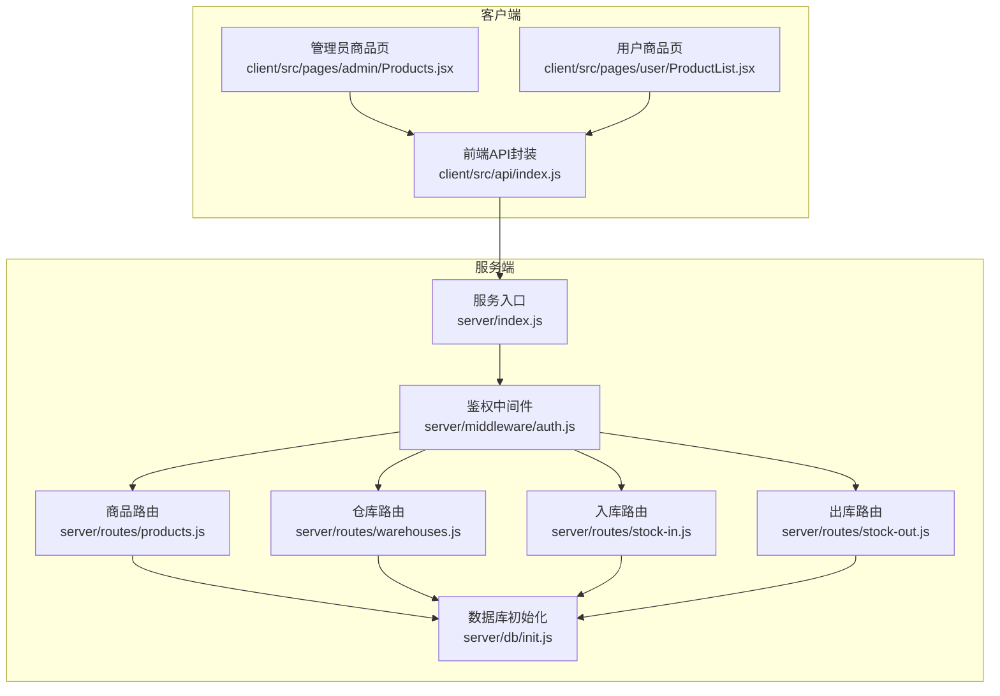
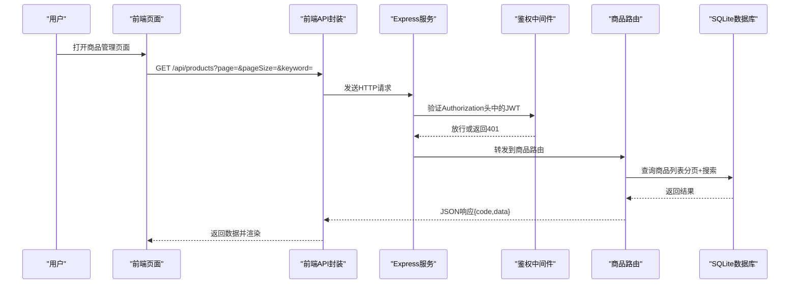
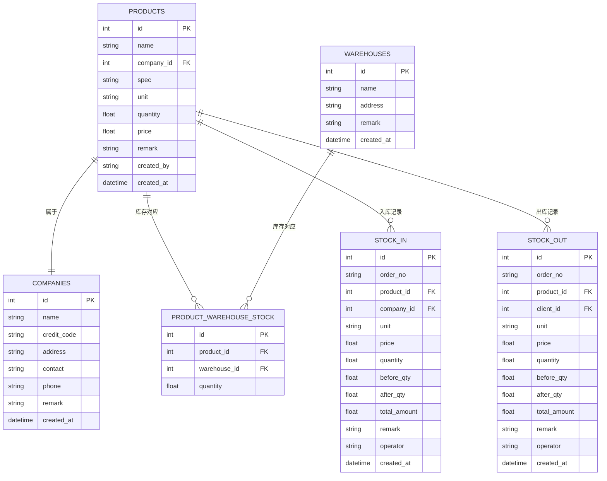
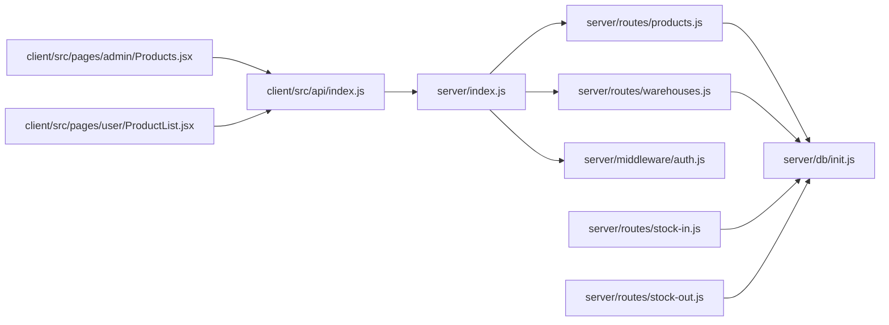

# 商品管理接口

<cite>
**本文引用的文件**
- [server/index.js](file://server/index.js)
- [server/routes/products.js](file://server/routes/products.js)
- [server/middleware/auth.js](file://server/middleware/auth.js)
- [server/db/init.js](file://server/db/init.js)
- [server/routes/warehouses.js](file://server/routes/warehouses.js)
- [server/routes/stock-in.js](file://server/routes/stock-in.js)
- [server/routes/stock-out.js](file://server/routes/stock-out.js)
- [client/src/api/index.js](file://client/src/api/index.js)
- [client/src/pages/admin/Products.jsx](file://client/src/pages/admin/Products.jsx)
- [client/src/pages/user/ProductList.jsx](file://client/src/pages/user/ProductList.jsx)
</cite>

## 更新摘要
**变更内容**
- 更新了商品删除接口的验证逻辑，增加了库存验证机制
- 新增了删除前的库存检查，防止删除仍有库存的商品
- 完善了删除接口的业务规则说明

## 目录
1. [简介](#简介)
2. [项目结构](#项目结构)
3. [核心组件](#核心组件)
4. [架构总览](#架构总览)
5. [详细组件分析](#详细组件分析)
6. [依赖关系分析](#依赖关系分析)
7. [性能考虑](#性能考虑)
8. [故障排除指南](#故障排除指南)
9. [结论](#结论)
10. [附录](#附录)

## 简介
本文件为"商品管理接口"的完整 API 文档，覆盖商品信息的增删改查、分页与搜索、以及商品详情与库存分布展示。系统采用前后端分离架构：前端使用 React + Ant Design，后端基于 Express + better-sqlite3；通过 JWT 中间件进行鉴权，提供统一的响应格式与错误处理。

## 项目结构
- 后端服务入口与路由注册位于 server/index.js
- 商品相关接口集中在 server/routes/products.js
- 鉴权中间件位于 server/middleware/auth.js
- 数据库初始化与表结构定义位于 server/db/init.js
- 仓库相关接口位于 server/routes/warehouses.js
- 入库出库相关接口位于 server/routes/stock-in.js 和 server/routes/stock-out.js
- 前端 API 封装与拦截器位于 client/src/api/index.js
- 商品管理页面（管理员）位于 client/src/pages/admin/Products.jsx
- 商品列表页面（普通用户）位于 client/src/pages/user/ProductList.jsx

**图表来源**
- [server/index.js:68-95](file://server/index.js#L68-L95)
- [server/middleware/auth.js:5-19](file://server/middleware/auth.js#L5-L19)
- [server/routes/products.js:1-98](file://server/routes/products.js#L1-L98)
- [server/routes/warehouses.js:1-117](file://server/routes/warehouses.js#L1-L117)
- [server/routes/stock-in.js:1-173](file://server/routes/stock-in.js#L1-L173)
- [server/routes/stock-out.js:1-178](file://server/routes/stock-out.js#L1-L178)
- [client/src/api/index.js:1-42](file://client/src/api/index.js#L1-L42)

**章节来源**
- [server/index.js:68-95](file://server/index.js#L68-L95)
- [client/src/api/index.js:1-42](file://client/src/api/index.js#L1-L42)

## 核心组件
- 服务入口与路由注册：负责初始化数据库、注册路由、CORS、限流与全局错误处理
- 鉴权中间件：从 Authorization 头解析 JWT，校验登录状态与角色
- 商品路由：提供商品列表、新增、修改、删除接口，含搜索关键词与分页
- 仓库路由：提供商品在各库房的库存分布查询
- 入库出库路由：提供商品的入库出库操作，维护库存数据一致性
- 前端 API 封装：统一 base URL、Token 注入、401 自动跳转登录、错误提示

**章节来源**
- [server/index.js:117-120](file://server/index.js#L117-L120)
- [server/middleware/auth.js:5-29](file://server/middleware/auth.js#L5-L29)
- [server/routes/products.js:8-98](file://server/routes/products.js#L8-L98)
- [server/routes/warehouses.js:30-41](file://server/routes/warehouses.js#L30-L41)
- [server/routes/stock-in.js:110-173](file://server/routes/stock-in.js#L110-L173)
- [server/routes/stock-out.js:110-178](file://server/routes/stock-out.js#L110-L178)
- [client/src/api/index.js:9-39](file://client/src/api/index.js#L9-L39)

## 架构总览
系统采用前后端分离模式：
- 前端通过 axios 发送请求到 /api 前缀下的后端接口
- 后端通过 auth 中间件校验 JWT，管理员可执行删除等敏感操作
- 数据库采用 SQLite（better-sqlite3），初始化时创建商品、仓库、出入库等表
- 入库出库操作实时维护商品总库存和各库房库存

**图表来源**
- [client/src/pages/admin/Products.jsx:20-25](file://client/src/pages/admin/Products.jsx#L20-L25)
- [client/src/api/index.js:4-7](file://client/src/api/index.js#L4-L7)
- [server/index.js:82-95](file://server/index.js#L82-L95)
- [server/middleware/auth.js:5-19](file://server/middleware/auth.js#L5-L19)
- [server/routes/products.js:9-28](file://server/routes/products.js#L9-L28)
- [server/db/init.js:95-110](file://server/db/init.js#L95-L110)

## 详细组件分析

### 商品管理接口规范

#### 通用约定
- 基础路径：/api/products
- 鉴权：所有接口均需携带 Authorization: Bearer <token>
- 响应格式：统一 { code, message?, data? }
  - code=0 表示成功，其他值表示错误
  - 成功时 data 包含业务数据
- 错误处理：401 未登录/过期，403 权限不足，400 参数错误/业务异常

**章节来源**
- [server/routes/products.js:6](file://server/routes/products.js#L6)
- [server/middleware/auth.js:5-19](file://server/middleware/auth.js#L5-L19)
- [client/src/api/index.js:17-39](file://client/src/api/index.js#L17-L39)

#### 1) 商品列表查询
- 方法与路径：GET /api/products
- 功能：分页查询商品列表，支持关键词搜索（商品名、规格、记录人、公司名）
- 请求参数
  - page: 数字，默认 1
  - pageSize: 数字，默认 20
  - keyword: 字符串，模糊匹配上述字段
- 响应数据
  - list: 商品数组（包含 name、spec、unit、quantity、price、created_by、created_at 等）
  - total: 总数
  - page/pageSize: 当前页与每页条数
- 状态码
  - 200 成功
  - 401 未登录/过期
  - 429 请求过于频繁（受全局限流）

**章节来源**
- [server/routes/products.js:9-28](file://server/routes/products.js#L9-L28)
- [client/src/pages/admin/Products.jsx:20-25](file://client/src/pages/admin/Products.jsx#L20-L25)
- [client/src/pages/user/ProductList.jsx:26-31](file://client/src/pages/user/ProductList.jsx#L26-L31)

#### 2) 商品详情获取
- 方法与路径：GET /api/warehouses/stock/:productId
- 功能：获取某商品在各库房的库存分布
- 请求参数
  - productId: 路径参数，商品ID
- 响应数据
  - data: 库房库存数组，元素包含 { id, name, quantity }
- 状态码
  - 200 成功
  - 401 未登录/过期

**章节来源**
- [server/routes/warehouses.js:30-41](file://server/routes/warehouses.js#L30-L41)
- [client/src/pages/admin/Products.jsx:40-46](file://client/src/pages/admin/Products.jsx#L40-L46)
- [client/src/pages/user/ProductList.jsx:82-88](file://client/src/pages/user/ProductList.jsx#L82-L88)

#### 3) 商品创建
- 方法与路径：POST /api/products
- 功能：新增商品，支持设置规格、单位、初始数量、单价、备注
- 请求体字段
  - name: 必填，非空字符串
  - company_id: 可选，公司ID
  - spec: 可选，规格
  - unit: 可选，单位
  - quantity: 可选，初始数量（默认0）
  - price: 可选，单价（默认0）
  - remark: 可选，备注
- 业务规则
  - 商品名称 + 公司ID 在同一公司下唯一
  - 创建人字段由登录用户的真实姓名填充
- 响应
  - code=0 表示成功
  - 其他值为失败，包含 message
- 状态码
  - 200 成功
  - 400 参数或业务错误
  - 401 未登录/过期

**章节来源**
- [server/routes/products.js:31-45](file://server/routes/products.js#L31-L45)
- [client/src/pages/admin/Products.jsx:27-38](file://client/src/pages/admin/Products.jsx#L27-L38)

#### 4) 商品更新
- 方法与路径：PUT /api/products/:id
- 功能：修改商品信息
- 路径参数
  - id: 商品ID
- 请求体字段
  - name: 必填，非空字符串
  - company_id: 可选
  - spec: 可选
  - unit: 可选
  - price: 可选
  - remark: 可选
- 业务规则
  - 商品不存在则拒绝
  - 商品名称 + 公司ID 在同一公司下唯一（排除自身）
- 响应
  - code=0 表示成功
  - 其他值为失败，包含 message
- 状态码
  - 200 成功
  - 400 参数或业务错误
  - 401 未登录/过期

**章节来源**
- [server/routes/products.js:47-68](file://server/routes/products.js#L47-L68)
- [client/src/pages/admin/Products.jsx:27-38](file://client/src/pages/admin/Products.jsx#L27-L38)

#### 5) 商品删除
- 方法与路径：DELETE /api/products/:id
- 功能：删除商品（管理员）
- 路径参数
  - id: 商品ID
- 业务规则
  - 仅管理员可执行
  - 商品不存在则拒绝
  - **新增**：检查商品在所有库房的总库存，若仍有库存（total > 0）则拒绝删除
  - **新增**：检查是否存在入库/出库记录，若存在则拒绝删除
- 验证逻辑
  - 库存检查：通过 `SUM(quantity) as total` 计算商品在所有库房的总库存
  - 历史记录检查：检查 stock_in 和 stock_out 表中是否存在相关记录
- 响应
  - code=0 表示成功
  - 其他值为失败，包含 message
- 状态码
  - 200 成功
  - 400 参数或业务错误
  - 401 未登录/过期
  - 403 权限不足

**更新** 增强了删除验证逻辑，增加了库存验证和历史记录验证

**章节来源**
- [server/routes/products.js:70-95](file://server/routes/products.js#L70-L95)
- [server/middleware/auth.js:21-26](file://server/middleware/auth.js#L21-L26)

#### 6) 商品搜索与过滤
- 支持方式
  - 关键词搜索：GET /api/products?keyword=...
  - 分页：GET /api/products?page=&pageSize=
- 搜索逻辑
  - 对商品名、规格、记录人、公司名进行 LIKE 模糊匹配
- 前端调用示例
  - 管理员商品页：GET /api/products?page=1&pageSize=20&keyword=xxx
  - 用户商品页：GET /api/products?page=1&pageSize=20&keyword=xxx

**章节来源**
- [server/routes/products.js:11-18](file://server/routes/products.js#L11-L18)
- [client/src/pages/admin/Products.jsx:20-25](file://client/src/pages/admin/Products.jsx#L20-L25)
- [client/src/pages/user/ProductList.jsx:26-31](file://client/src/pages/user/ProductList.jsx#L26-L31)

#### 7) 商品图片上传与文件管理
- 当前实现
  - 商品接口未提供图片上传能力
  - 仓库路由提供 Excel 导入导出（与商品数据相关），但非商品图片
- 建议扩展
  - 如需商品图片，可在商品表增加 image_url 或 file_id 字段，并新增上传接口（multipart/form-data）
  - 使用 multer 限制文件大小与类型，存储至本地或对象存储
  - 前端提供图片预览与删除功能

**章节来源**
- [server/routes/data-center.js:13-26](file://server/routes/data-center.js#L13-L26)
- [server/routes/data-center.js:112-156](file://server/routes/data-center.js#L112-L156)

### 数据模型与关系

**图表来源**
- [server/db/init.js:95-110](file://server/db/init.js#L95-L110)
- [server/db/init.js:43-65](file://server/db/init.js#L43-L65)
- [server/db/init.js:112-131](file://server/db/init.js#L112-L131)
- [server/db/init.js:142-161](file://server/db/init.js#L142-L161)

## 依赖关系分析

**图表来源**
- [server/index.js:68-95](file://server/index.js#L68-L95)
- [server/routes/products.js:1-98](file://server/routes/products.js#L1-L98)
- [server/routes/warehouses.js:1-117](file://server/routes/warehouses.js#L1-L117)
- [server/middleware/auth.js:1-29](file://server/middleware/auth.js#L1-L29)
- [server/db/init.js:1-217](file://server/db/init.js#L1-L217)
- [client/src/api/index.js:1-42](file://client/src/api/index.js#L1-L42)
- [client/src/pages/admin/Products.jsx:1-134](file://client/src/pages/admin/Products.jsx#L1-L134)
- [client/src/pages/user/ProductList.jsx:1-221](file://client/src/pages/user/ProductList.jsx#L1-L221)
- [server/routes/stock-in.js:1-173](file://server/routes/stock-in.js#L1-L173)
- [server/routes/stock-out.js:1-178](file://server/routes/stock-out.js#L1-L178)

## 性能考虑
- 分页与搜索
  - 列表查询使用 LIMIT/OFFSET，建议在商品表与公司表建立合适的索引以优化 LIKE 查询
- 数据库连接
  - 使用 WAL 模式与外键约束，保证并发一致性
- 限流
  - 全局 API 限流（每分钟 120 次），登录接口单独限流（每分钟 10 次）
- 前端交互
  - 列表加载使用 loading 状态，避免重复请求
  - 模态框销毁时清理表单，减少内存占用

**章节来源**
- [server/db/init.js:12-13](file://server/db/init.js#L12-L13)
- [server/index.js:46-63](file://server/index.js#L46-L63)
- [client/src/pages/admin/Products.jsx:10-25](file://client/src/pages/admin/Products.jsx#L10-L25)

## 故障排除指南
- 401 未登录/过期
  - 现象：返回 { code: 401, message }
  - 处理：前端拦截器会清除本地 token 并跳转登录页
- 403 权限不足
  - 现象：删除商品时非管理员返回 { code: 403 }
  - 处理：确认用户角色为 admin
- 400 参数或业务错误
  - 现象：新增/修改商品名称为空、重复、商品不存在；删除商品时仍有库存或历史记录
  - 处理：根据 message 提示修正输入或先清空库存/历史记录
  - **新增**：删除商品时若显示"库房中仍有库存 X"，需要先将库存清零后再删除
- 429 请求过于频繁
  - 现象：短时间内多次请求被限流
  - 处理：降低请求频率或等待冷却

**更新** 新增了库存相关错误处理说明

**章节来源**
- [client/src/api/index.js:21-26](file://client/src/api/index.js#L21-L26)
- [server/routes/products.js:33-35](file://server/routes/products.js#L33-L35)
- [server/routes/products.js:72-74](file://server/routes/products.js#L72-L74)
- [server/routes/products.js:78-80](file://server/routes/products.js#L78-L80)
- [server/routes/products.js:85-87](file://server/routes/products.js#L85-L87)
- [server/routes/products.js:92-94](file://server/routes/products.js#L92-L94)
- [server/index.js:46-63](file://server/index.js#L46-L63)

## 结论
本系统提供了完善的商品管理接口，涵盖增删改查、分页搜索与库存分布展示。通过鉴权中间件与严格的业务规则，保障了数据一致性与安全性。新增的库存验证逻辑进一步增强了数据完整性保护，防止误删仍有库存的商品。若需扩展商品图片上传，建议在现有商品表基础上增加字段并新增上传接口，同时完善前端图片管理功能。

## 附录

### 接口一览表
- GET /api/products —— 商品列表（分页+搜索）
- GET /api/warehouses/stock/:productId —— 商品库存分布
- POST /api/products —— 新增商品
- PUT /api/products/:id —— 更新商品
- DELETE /api/products/:id —— 删除商品（管理员，含库存验证）

**更新** 删除接口增加了更严格的验证逻辑

**章节来源**
- [server/routes/products.js:9-95](file://server/routes/products.js#L9-L95)
- [server/routes/warehouses.js:30-41](file://server/routes/warehouses.js#L30-L41)