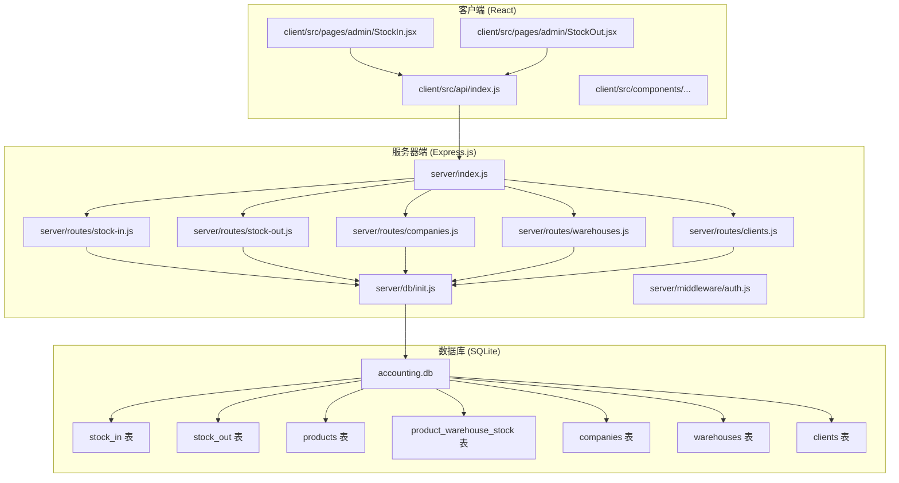
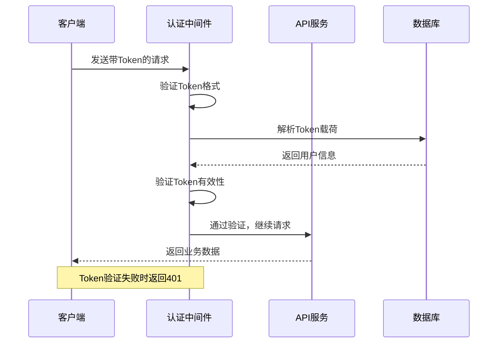
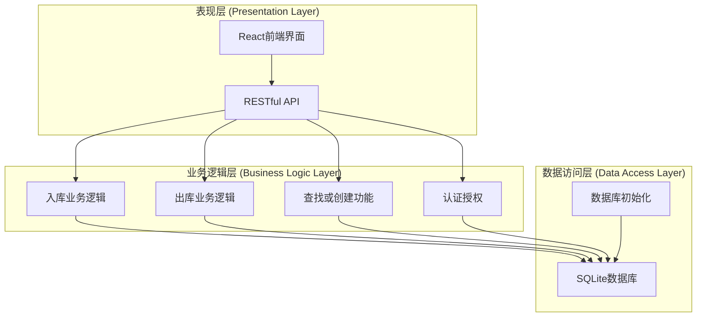
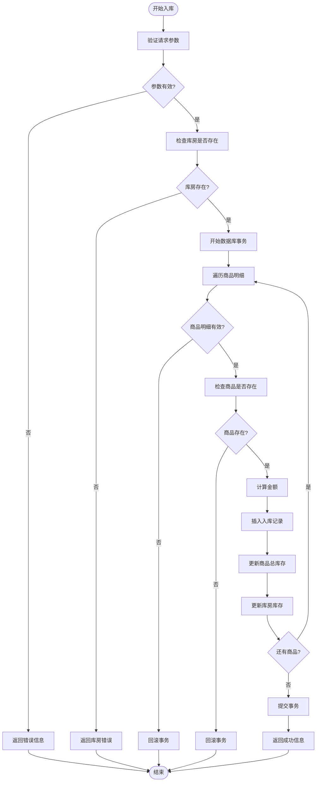
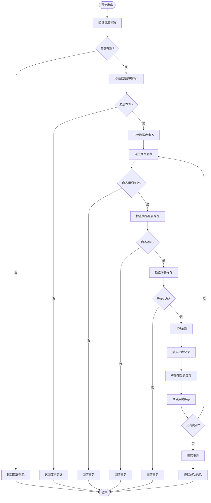
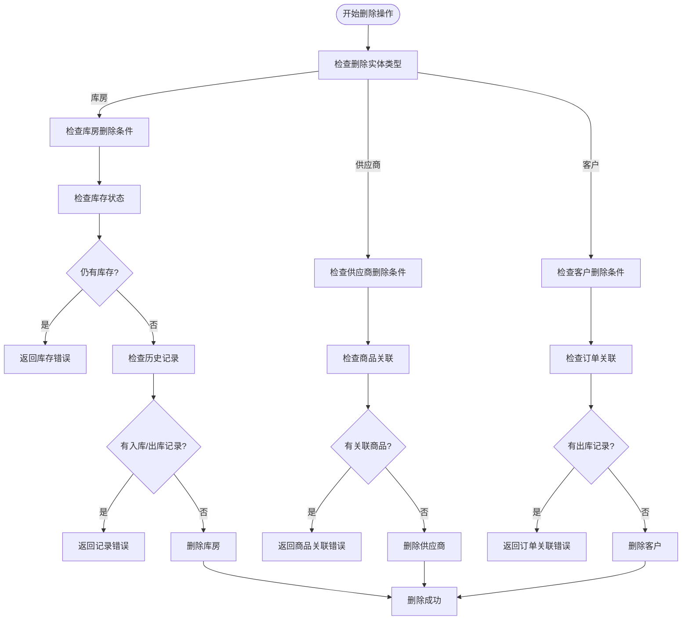
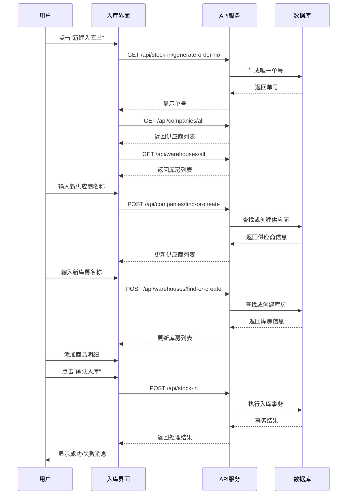
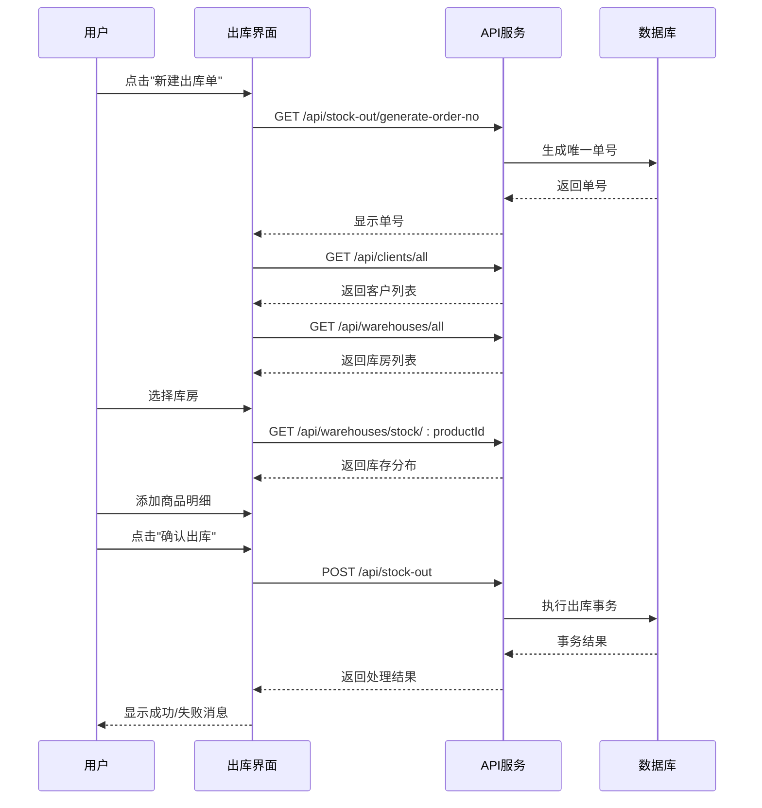
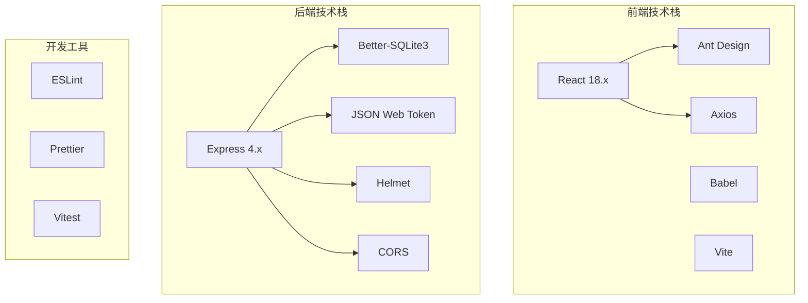

# 库存管理接口

<cite>
**本文档引用的文件**
- [server/routes/stock-in.js](file://server/routes/stock-in.js)
- [server/routes/stock-out.js](file://server/routes/stock-out.js)
- [server/routes/companies.js](file://server/routes/companies.js)
- [server/routes/warehouses.js](file://server/routes/warehouses.js)
- [server/routes/clients.js](file://server/routes/clients.js)
- [server/db/init.js](file://server/db/init.js)
- [server/middleware/auth.js](file://server/middleware/auth.js)
- [client/src/api/index.js](file://client/src/api/index.js)
- [client/src/pages/admin/StockIn.jsx](file://client/src/pages/admin/StockIn.jsx)
- [client/src/pages/admin/StockOut.jsx](file://client/src/pages/admin/StockOut.jsx)
- [server/index.js](file://server/index.js)
</cite>

## 目录
1. [简介](#简介)
2. [项目结构](#项目结构)
3. [核心组件](#核心组件)
4. [架构概览](#架构概览)
5. [详细组件分析](#详细组件分析)
6. [依赖关系分析](#依赖关系分析)
7. [性能考虑](#性能考虑)
8. [故障排除指南](#故障排除指南)
9. [结论](#结论)

## 简介

本系统是一个基于 Node.js 和 React 的库存管理系统，提供了完整的商品入库和出库管理功能。系统采用前后端分离架构，使用 Express.js 构建后端 API，React 构建前端界面，SQLite 数据库存储数据。

系统的核心功能包括：
- 商品入库登记和数量更新
- 商品出库登记和数量减少
- 供应商信息关联
- 客户信息关联
- 入库/出库时间记录
- 实时库存更新机制
- 并发控制和事务处理
- **新增**：自动查找或创建供应商、库房、客户功能

## 项目结构

系统采用模块化的项目结构，分为客户端和服务器端两大部分：



**图表来源**
- [server/index.js:1-120](file://server/index.js#L1-L120)
- [client/src/api/index.js:1-42](file://client/src/api/index.js#L1-L42)

**章节来源**
- [server/index.js:1-120](file://server/index.js#L1-L120)
- [client/src/pages/admin/StockIn.jsx:1-432](file://client/src/pages/admin/StockIn.jsx#L1-L432)
- [client/src/pages/admin/StockOut.jsx:1-390](file://client/src/pages/admin/StockOut.jsx#L1-L390)

## 核心组件

### 数据库设计

系统使用 SQLite 作为数据存储，采用关系型数据库设计，确保数据一致性和完整性：

```mermaid
erDiagram
PRODUCTS {
integer id PK
string name
integer company_id FK
string spec
string unit
float quantity
float price
string remark
string created_by
string created_at
}
COMPANIES {
integer id PK
string name
string credit_code
string address
string contact
string phone
string remark
string created_at
}
CLIENTS {
integer id PK
string name
string credit_code
string address
string contact
string phone
string remark
string created_at
}
WAREHOUSES {
integer id PK
string name
string address
string remark
string created_at
}
PRODUCT_WAREHOUSE_STOCK {
integer id PK
integer product_id FK
integer warehouse_id FK
float quantity
unique product_id, warehouse_id
}
STOCK_IN {
integer id PK
string order_no
integer product_id FK
integer company_id FK
integer warehouse_id FK
string unit
float price
float quantity
float before_qty
float after_qty
float total_amount
string remark
string operator
string created_at
}
STOCK_OUT {
integer id PK
string order_no
integer product_id FK
integer client_id FK
integer warehouse_id FK
string unit
float price
float quantity
float before_qty
float after_qty
float total_amount
string remark
string operator
string created_at
}
PRODUCTS ||--o{ STOCK_IN : "入库"
PRODUCTS ||--o{ STOCK_OUT : "出库"
COMPANIES ||--o{ STOCK_IN : "供应商"
CLIENTS ||--o{ STOCK_OUT : "客户"
WAREHOUSES ||--o{ STOCK_IN : "入库库房"
WAREHOUSES ||--o{ STOCK_OUT : "出库库房"
PRODUCTS ||--o{ PRODUCT_WAREHOUSE_STOCK : "库存分布"
WAREHOUSES ||--o{ PRODUCT_WAREHOUSE_STOCK : "库存分布"
```

**图表来源**
- [server/db/init.js:95-170](file://server/db/init.js#L95-L170)

### 授权认证中间件

系统使用 JWT 进行用户认证，确保 API 调用的安全性：



**图表来源**
- [server/middleware/auth.js:5-19](file://server/middleware/auth.js#L5-L19)

**章节来源**
- [server/db/init.js:18-216](file://server/db/init.js#L18-L216)
- [server/middleware/auth.js:1-29](file://server/middleware/auth.js#L1-L29)

## 架构概览

系统采用经典的三层架构模式：



**图表来源**
- [server/index.js:68-95](file://server/index.js#L68-L95)
- [client/src/api/index.js:4-7](file://client/src/api/index.js#L4-L7)

系统特点：
- **前后端分离**：React 前端与 Express 后端完全分离
- **RESTful API**：遵循 RESTful 设计原则
- **JWT 认证**：使用 JSON Web Token 进行用户身份验证
- **事务处理**：入库和出库操作使用数据库事务保证数据一致性
- **实时库存**：支持实时库存查询和更新
- **智能数据管理**：支持自动查找或创建实体功能

**章节来源**
- [server/index.js:1-120](file://server/index.js#L1-L120)
- [client/src/pages/admin/StockIn.jsx:1-432](file://client/src/pages/admin/StockIn.jsx#L1-L432)
- [client/src/pages/admin/StockOut.jsx:1-390](file://client/src/pages/admin/StockOut.jsx#L1-L390)

## 详细组件分析

### 入库管理接口

#### 接口规范

| 接口 | 方法 | URL路径 | 功能描述 |
|------|------|---------|----------|
| 生成入库单号 | GET | `/api/stock-in/generate-order-no` | 生成唯一的入库单号（RK + 8位随机数） |
| 入库单列表 | GET | `/api/stock-in` | 获取入库单列表（按单号分组） |
| 入库单详情 | GET | `/api/stock-in/order/:orderNo` | 获取指定入库单的所有商品明细 |
| 入库明细列表 | GET | `/api/stock-in/items` | 获取入库明细列表（兼容旧接口） |
| 批量入库 | POST | `/api/stock-in` | 执行批量入库操作 |

#### 请求参数详解

**批量入库请求体参数**：

| 参数名 | 类型 | 必填 | 描述 | 示例值 |
|--------|------|------|------|--------|
| order_no | string | 是 | 入库单号 | "RK12345678" |
| company_id | integer | 是 | 供应商ID | 1 |
| warehouse_id | integer | 是 | 入库库房ID | 1 |
| items | array | 是 | 商品明细数组 | [{...}] |

**商品明细项参数**：

| 参数名 | 类型 | 必填 | 描述 | 默认值 |
|--------|------|------|------|--------|
| product_id | integer | 是 | 商品ID | - |
| unit | string | 否 | 商品单位 | 商品默认单位 |
| price | float | 否 | 单价 | 商品默认价格 |
| quantity | float | 是 | 数量 | - |
| remark | string | 否 | 备注 | "" |

#### 响应数据结构

**通用响应格式**：
```javascript
{
  code: 0,           // 状态码，0表示成功
  message: "",       // 成功消息或错误信息
  data: {}           // 返回的数据对象
}
```

**入库单列表响应**：
```javascript
{
  code: 0,
  data: {
    list: [
      {
        order_no: "RK12345678",
        company_name: "供应商名称",
        warehouse_name: "库房名称",
        item_count: 3,
        total_qty: 150,
        total_amount: 15000.00,
        operator: "张三",
        created_at: "2024-01-15 14:30:00"
      }
    ],
    total: 10,
    page: 1,
    pageSize: 20
  }
}
```

**入库单详情响应**：
```javascript
[
  {
    id: 1,
    order_no: "RK12345678",
    product_id: 1,
    product_name: "商品名称",
    company_id: 1,
    company_name: "供应商名称",
    warehouse_id: 1,
    warehouse_name: "库房名称",
    unit: "件",
    price: 100.00,
    quantity: 50,
    total_amount: 5000.00,
    before_qty: 100,
    after_qty: 150,
    remark: "备注信息",
    operator: "张三",
    created_at: "2024-01-15 14:30:00"
  }
]
```

#### 处理流程图



**图表来源**
- [server/routes/stock-in.js:109-170](file://server/routes/stock-in.js#L109-L170)

#### 错误处理机制

系统实现了完善的错误处理机制：

| 错误类型 | 状态码 | 错误信息 | 处理方式 |
|----------|--------|----------|----------|
| 参数缺失 | 400 | "入库单号缺失" | 返回参数验证错误 |
| 库房不存在 | 400 | "选择的库房不存在" | 提示用户选择正确库房 |
| 商品不存在 | 400 | "商品ID X 不存在" | 提示用户选择正确商品 |
| 库存不足 | 500 | "库存不足" | 显示具体库存情况 |
| 事务失败 | 500 | "数据库操作失败" | 自动回滚并返回错误 |

**章节来源**
- [server/routes/stock-in.js:1-173](file://server/routes/stock-in.js#L1-L173)

### 出库管理接口

#### 接口规范

| 接口 | 方法 | URL路径 | 功能描述 |
|------|------|---------|----------|
| 生成出库单号 | GET | `/api/stock-out/generate-order-no` | 生成唯一的出库单号（CK + 8位随机数） |
| 出库单列表 | GET | `/api/stock-out` | 获取出库单列表（按单号分组） |
| 出库单详情 | GET | `/api/stock-out/order/:orderNo` | 获取指定出库单的所有商品明细 |
| 出库明细列表 | GET | `/api/stock-out/items` | 获取出库明细列表（兼容旧接口） |
| 批量出库 | POST | `/api/stock-out` | 执行批量出库操作 |

#### 请求参数详解

**批量出库请求体参数**：

| 参数名 | 类型 | 必填 | 描述 | 示例值 |
|--------|------|------|------|--------|
| order_no | string | 是 | 出库单号 | "CK12345678" |
| client_id | integer | 是 | 客户ID | 1 |
| warehouse_id | integer | 是 | 出库库房ID | 1 |
| items | array | 是 | 商品明细数组 | [{...}] |

**商品明细项参数**：

| 参数名 | 类型 | 必填 | 描述 | 默认值 |
|--------|------|------|------|--------|
| product_id | integer | 是 | 商品ID | - |
| unit | string | 否 | 商品单位 | 商品默认单位 |
| price | float | 否 | 单价 | 商品默认价格 |
| quantity | float | 是 | 数量 | - |
| remark | string | 否 | 备注 | "" |

#### 响应数据结构

**出库单列表响应**：
```javascript
{
  code: 0,
  data: {
    list: [
      {
        order_no: "CK12345678",
        client_name: "客户名称",
        warehouse_name: "库房名称",
        item_count: 2,
        total_qty: 80,
        total_amount: 8000.00,
        operator: "李四",
        created_at: "2024-01-15 15:45:00"
      }
    ],
    total: 8,
    page: 1,
    pageSize: 20
  }
}
```

**出库单详情响应**：
```javascript
[
  {
    id: 1,
    order_no: "CK12345678",
    product_id: 1,
    product_name: "商品名称",
    client_id: 1,
    client_name: "客户名称",
    warehouse_id: 1,
    warehouse_name: "库房名称",
    unit: "件",
    price: 100.00,
    quantity: 30,
    total_amount: 3000.00,
    before_qty: 150,
    after_qty: 120,
    remark: "备注信息",
    operator: "李四",
    created_at: "2024-01-15 15:45:00"
  }
]
```

#### 处理流程图



**图表来源**
- [server/routes/stock-out.js:109-175](file://server/routes/stock-out.js#L109-L175)

#### 错误处理机制

**出库专用错误**：
- 库房库存不足：显示具体商品名称和当前库存数量
- 出库数量超过可用库存：阻止出库操作
- 商品不存在：提示用户选择正确的商品

**章节来源**
- [server/routes/stock-out.js:1-178](file://server/routes/stock-out.js#L1-L178)

### 查找或创建功能

#### 新增功能概述

系统新增了智能的"查找或创建"功能，支持供应商、库房、客户三种实体的自动管理：

**功能特点**：
- 自动查重：检查名称是否已存在
- 智能创建：不存在时自动创建新实体
- 统一接口：相同的请求格式处理不同类型的实体
- 实时反馈：返回"已存在"或"已自动创建"的状态信息

#### 供应商查找或创建接口

**接口规范**

| 接口 | 方法 | URL路径 | 功能描述 |
|------|------|---------|----------|
| 查找或创建供应商 | POST | `/api/companies/find-or-create` | 按名称查找或自动创建供应商 |

**请求参数**：
```javascript
{
  name: "新供应商名称"  // 必填，供应商名称
}
```

**响应数据结构**：
```javascript
{
  code: 0,
  message: "已存在" | "已自动创建",  // 状态信息
  data: {
    id: 1,                           // 供应商ID
    name: "新供应商名称"             // 供应商名称
  }
}
```

#### 库房查找或创建接口

**接口规范**

| 接口 | 方法 | URL路径 | 功能描述 |
|------|------|---------|----------|
| 查找或创建库房 | POST | `/api/warehouses/find-or-create` | 按名称查找或自动创建库房 |

**请求参数**：
```javascript
{
  name: "新库房名称"  // 必填，库房名称
}
```

**响应数据结构**：
```javascript
{
  code: 0,
  message: "已存在" | "已自动创建",  // 状态信息
  data: {
    id: 1,                           // 库房ID
    name: "新库房名称"               // 库房名称
  }
}
```

#### 客户查找或创建接口

**接口规范**

| 接口 | 方法 | URL路径 | 功能描述 |
|------|------|---------|----------|
| 查找或创建客户 | POST | `/api/clients/find-or-create` | 按名称查找或自动创建客户 |

**请求参数**：
```javascript
{
  name: "新客户名称"  // 必填，客户名称
}
```

**响应数据结构**：
```javascript
{
  code: 0,
  message: "已存在" | "已自动创建",  // 状态信息
  data: {
    id: 1,                           // 客户ID
    name: "新客户名称"               // 客户名称
  }
}
```

#### 增强的删除验证逻辑

系统增强了实体删除时的验证逻辑，确保数据完整性：

**库房删除验证**：
- 检查是否有剩余库存
- 检查是否有入库记录
- 检查是否有出库记录

**供应商删除验证**：
- 检查是否有关联的商品
- 确保不会影响现有库存记录

**删除验证流程图**：



**图表来源**
- [server/routes/warehouses.js:99-114](file://server/routes/warehouses.js#L99-L114)
- [server/routes/companies.js:94-101](file://server/routes/companies.js#L94-L101)

**章节来源**
- [server/routes/companies.js:32-101](file://server/routes/companies.js#L32-L101)
- [server/routes/warehouses.js:15-114](file://server/routes/warehouses.js#L15-L114)
- [server/routes/clients.js:1-100](file://server/routes/clients.js#L1-L100)

### 前端集成

#### 入库界面交互

前端使用 React 组件实现完整的入库管理功能，集成了新的查找或创建功能：



**图表来源**
- [client/src/pages/admin/StockIn.jsx:46-126](file://client/src/pages/admin/StockIn.jsx#L46-L126)

#### 出库界面交互

前端使用 React 组件实现完整的出库管理功能：



**图表来源**
- [client/src/pages/admin/StockOut.jsx:45-109](file://client/src/pages/admin/StockOut.jsx#L45-L109)

**章节来源**
- [client/src/pages/admin/StockIn.jsx:1-432](file://client/src/pages/admin/StockIn.jsx#L1-L432)
- [client/src/pages/admin/StockOut.jsx:1-390](file://client/src/pages/admin/StockOut.jsx#L1-L390)

## 依赖关系分析

### 技术栈依赖



### 数据库依赖关系

```mermaid
erDiagram
AUTH_USERS {
integer id PK
string username UK
string password
string real_name
string phone
string role
integer is_default
string created_at
}
SETTINGS {
string key PK
string value
}
WAREHOUSES {
integer id PK
string name
string address
string remark
string created_at
}
COMPANIES {
integer id PK
string name
string credit_code
string address
string contact
string phone
string remark
string created_at
}
CLIENTS {
integer id PK
string name
string credit_code
string address
string contact
string phone
string remark
string created_at
}
PRODUCTS {
integer id PK
string name
integer company_id FK
string spec
string unit
float quantity
float price
string remark
string created_by
string created_at
}
PRODUCT_WAREHOUSE_STOCK {
integer id PK
integer product_id FK
integer warehouse_id FK
float quantity
unique product_id, warehouse_id
}
STOCK_IN {
integer id PK
string order_no
integer product_id FK
integer company_id FK
integer warehouse_id FK
string unit
float price
float quantity
float before_qty
float after_qty
float total_amount
string remark
string operator
string created_at
}
STOCK_OUT {
integer id PK
string order_no
integer product_id FK
integer client_id FK
integer warehouse_id FK
string unit
float price
float quantity
float before_qty
float after_qty
float total_amount
string remark
string operator
string created_at
}
AUTH_USERS ||--o{ STOCK_IN : "创建"
AUTH_USERS ||--o{ STOCK_OUT : "创建"
COMPANIES ||--o{ STOCK_IN : "供应商"
CLIENTS ||--o{ STOCK_OUT : "客户"
WAREHOUSES ||--o{ STOCK_IN : "入库库房"
WAREHOUSES ||--o{ STOCK_OUT : "出库库房"
PRODUCTS ||--o{ STOCK_IN : "入库商品"
PRODUCTS ||--o{ STOCK_OUT : "出库商品"
PRODUCTS ||--o{ PRODUCT_WAREHOUSE_STOCK : "库存分布"
WAREHOUSES ||--o{ PRODUCT_WAREHOUSE_STOCK : "库存分布"
```

**图表来源**
- [server/db/init.js:21-170](file://server/db/init.js#L21-L170)

### 外部依赖

系统的主要外部依赖包括：

| 依赖包 | 版本 | 用途 |
|--------|------|------|
| express | ^4.18.0 | Web应用框架 |
| better-sqlite3 | ^8.0.0 | SQLite数据库驱动 |
| jsonwebtoken | ^9.0.0 | JWT令牌处理 |
| axios | ^1.3.0 | HTTP客户端 |
| antd | ^5.0.0 | UI组件库 |
| @ant-design/icons | ^5.0.0 | 图标库 |

**章节来源**
- [server/db/init.js:1-217](file://server/db/init.js#L1-L217)
- [server/index.js:1-120](file://server/index.js#L1-L120)

## 性能考虑

### 数据库优化

1. **WAL模式**：启用写前日志(WAL)模式提高并发读取性能
2. **外键约束**：启用外键约束确保数据完整性
3. **索引优化**：为常用查询字段建立索引
4. **事务处理**：使用数据库事务保证操作原子性

### 缓存策略

1. **内存缓存**：缓存常用的配置和字典数据
2. **数据库连接池**：复用数据库连接减少开销
3. **响应缓存**：对静态数据进行缓存

### 并发控制

1. **数据库事务**：入库和出库操作使用事务确保数据一致性
2. **锁机制**：SQLite的行级锁防止并发冲突
3. **请求限流**：实施API调用频率限制防止滥用

### 前端性能优化

1. **虚拟滚动**：大数据表格使用虚拟滚动提升渲染性能
2. **懒加载**：图片和组件按需加载
3. **状态管理**：使用React状态管理减少不必要的重渲染

## 故障排除指南

### 常见问题及解决方案

#### 1. 认证失败

**症状**：返回401未授权错误
**原因**：
- Token过期或格式错误
- 用户权限不足
- Token被篡改

**解决方案**：
```javascript
// 检查Token状态
localStorage.removeItem('token');
localStorage.removeItem('user');
window.location.href = '/login';
```

#### 2. 库存不足

**症状**：出库操作失败，提示库存不足
**原因**：
- 商品在指定库房库存不足
- 库存数据异常

**解决方案**：
```javascript
// 检查商品库存
const stockMap = {};
await Promise.all(products.map(async p => {
  const res = await api.get(`/warehouses/stock/${p.id}`);
  if (res.code === 0) {
    const wh = res.data.find(w => w.id === wId);
    stockMap[p.id] = wh ? wh.quantity : 0;
  }
}));
```

#### 3. 数据库连接问题

**症状**：API调用超时或数据库连接失败
**原因**：
- 数据库文件损坏
- 文件权限问题
- 磁盘空间不足

**解决方案**：
```javascript
// 检查数据库状态
const db = getDb();
const health = db.prepare('PRAGMA integrity_check').get();
if (health.integrity_check !== 'ok') {
  // 重建数据库
  initDb();
}
```

#### 4. 前端API调用错误

**症状**：前端无法连接到API
**原因**：
- CORS配置问题
- 代理配置错误
- 网络连接问题

**解决方案**：
```javascript
// 检查API响应拦截器
api.interceptors.response.use(
  (response) => {
    const data = response.data;
    if (data.code !== 0) {
      message.error(data.message);
      return Promise.reject(data.message);
    }
    return data;
  },
  (error) => {
    message.error('网络错误，请稍后重试');
    return Promise.reject(error);
  }
);
```

#### 5. 查找或创建功能异常

**症状**：供应商、库房或客户无法自动创建
**原因**：
- 名称为空或只包含空白字符
- 数据库约束冲突
- 权限不足

**解决方案**：
```javascript
// 检查输入验证
if (!name || !name.trim()) {
  message.error('名称不能为空');
  return;
}

// 检查重复名称
const exists = await api.post('/api/companies/find-or-create', { name });
if (exists.data && exists.data.id) {
  message.info('供应商已存在');
}
```

### 调试技巧

1. **浏览器开发者工具**：检查网络请求和响应
2. **服务器日志**：查看API调用日志
3. **数据库监控**：监控SQL执行时间和查询计划
4. **性能分析**：使用性能分析工具识别瓶颈

**章节来源**
- [server/middleware/auth.js:5-19](file://server/middleware/auth.js#L5-L19)
- [client/src/api/index.js:17-39](file://client/src/api/index.js#L17-L39)

## 结论

本库存管理系统提供了完整的企业级库存管理解决方案，具有以下优势：

### 技术优势
- **架构清晰**：采用前后端分离架构，职责明确
- **数据安全**：使用JWT认证和HTTPS传输
- **数据一致性**：通过数据库事务保证操作原子性
- **扩展性强**：模块化设计便于功能扩展
- **智能化管理**：新增查找或创建功能，提升用户体验

### 功能特性
- **完整的库存管理**：支持入库、出库、库存查询等核心功能
- **实时更新**：数据库事务确保数据实时一致性
- **权限控制**：基于角色的访问控制
- **用户友好**：现代化的React界面，操作简便
- **数据完整性**：增强的删除验证逻辑保护数据安全

### 新增功能亮点
- **智能实体管理**：自动查找或创建供应商、库房、客户
- **无缝集成体验**：与现有入库出库流程完美结合
- **数据安全保障**：严格的删除验证防止误删重要数据
- **开发效率提升**：减少重复数据录入工作

### 改进建议
1. **增加库存预警**：当库存低于阈值时自动提醒
2. **报表统计**：提供更丰富的报表和数据分析功能
3. **移动端支持**：开发移动端应用或响应式设计
4. **备份恢复**：实现自动备份和数据恢复机制
5. **批量操作**：支持更多批量数据导入导出功能

系统整体设计合理，功能完善，能够满足中小型企业的库存管理需求。通过持续的优化和功能扩展，可以进一步提升用户体验和系统性能。