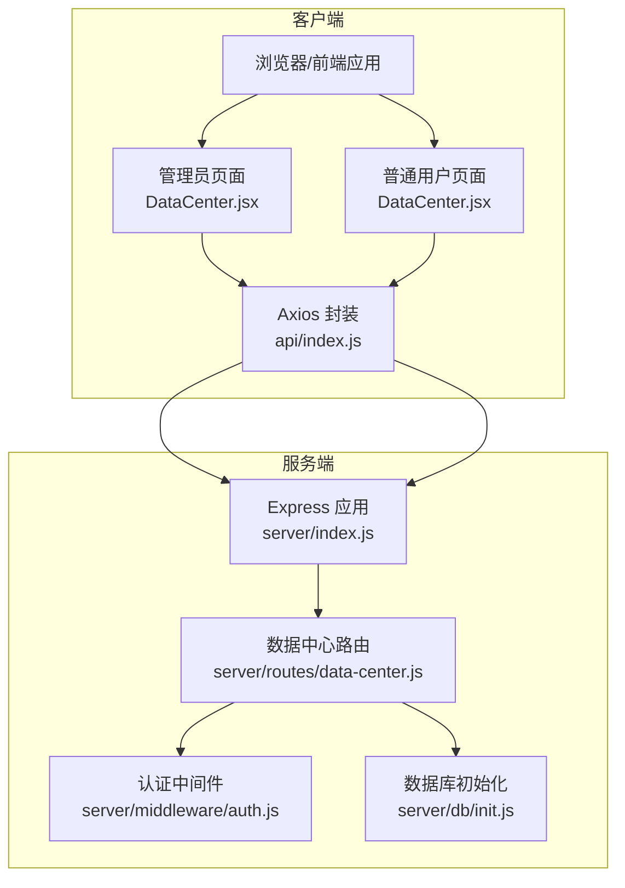
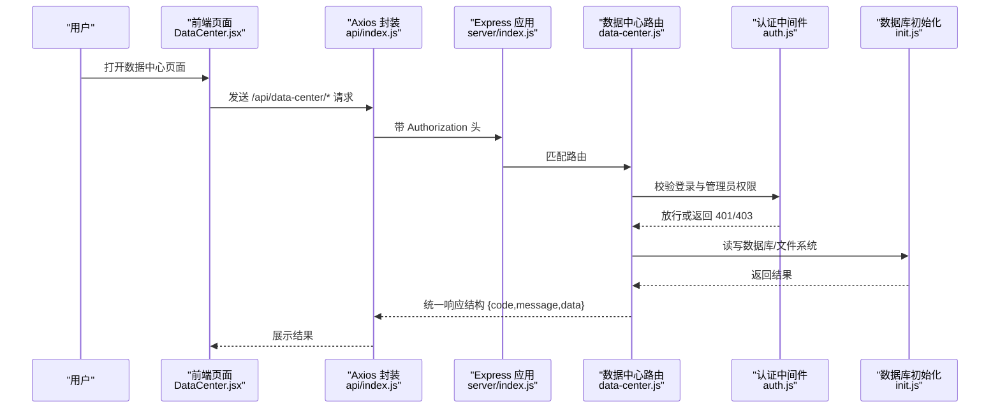
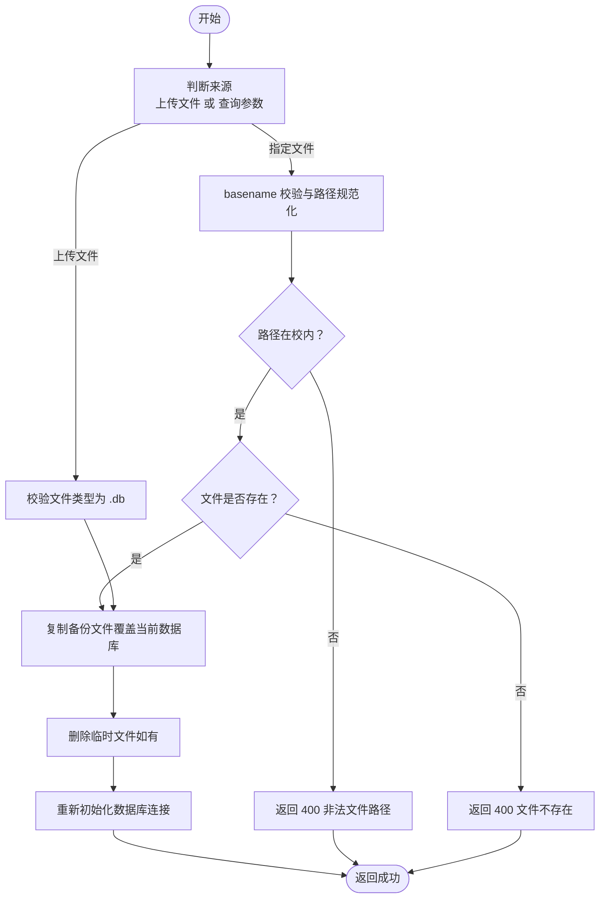
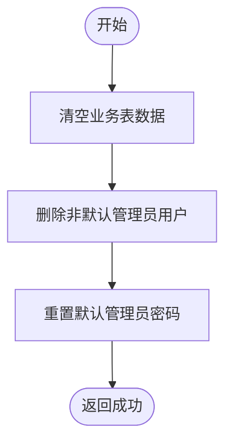
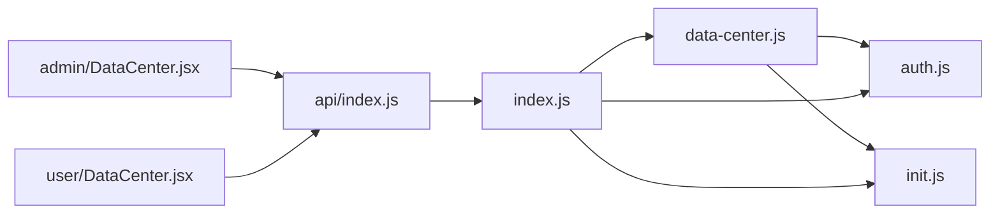

# 数据中心接口

<cite>
**本文引用的文件**
- [server/routes/data-center.js](file://server/routes/data-center.js)
- [server/db/init.js](file://server/db/init.js)
- [server/middleware/auth.js](file://server/middleware/auth.js)
- [server/index.js](file://server/index.js)
- [client/src/pages/admin/DataCenter.jsx](file://client/src/pages/admin/DataCenter.jsx)
- [client/src/pages/user/DataCenter.jsx](file://client/src/pages/user/DataCenter.jsx)
- [client/src/api/index.js](file://client/src/api/index.js)
</cite>

## 目录
1. [简介](#简介)
2. [项目结构](#项目结构)
3. [核心组件](#核心组件)
4. [架构总览](#架构总览)
5. [详细组件分析](#详细组件分析)
6. [依赖关系分析](#依赖关系分析)
7. [性能考虑](#性能考虑)
8. [故障排查指南](#故障排查指南)
9. [结论](#结论)
10. [附录](#附录)

## 简介
本文件面向数据中心接口的使用者与维护者，系统性梳理数据备份、数据恢复、系统重置、数据导入导出等数据管理相关接口的规范与实现细节。内容涵盖：
- 接口清单与调用方式（HTTP 方法、URL、请求参数、响应结构）
- 执行流程与时序图
- 备份文件格式、存储位置与命名规则
- 恢复流程、文件校验与回滚机制
- 系统重置的风险评估、数据清理流程与确认机制
- 数据导入导出的文件格式与列要求
- 数据完整性检查与错误处理策略

## 项目结构
后端采用 Express + better-sqlite3 的轻量架构，前端基于 React + Ant Design。数据中心接口位于独立路由模块中，并通过认证中间件保护。

图表来源
- [server/index.js:68-95](file://server/index.js#L68-L95)
- [server/routes/data-center.js:11](file://server/routes/data-center.js#L11)
- [server/middleware/auth.js:5-26](file://server/middleware/auth.js#L5-L26)
- [server/db/init.js:5](file://server/db/init.js#L5)

章节来源
- [server/index.js:68-95](file://server/index.js#L68-L95)
- [server/routes/data-center.js:11](file://server/routes/data-center.js#L11)
- [client/src/pages/admin/DataCenter.jsx:10-196](file://client/src/pages/admin/DataCenter.jsx#L10-L196)
- [client/src/pages/user/DataCenter.jsx:5-52](file://client/src/pages/user/DataCenter.jsx#L5-L52)
- [client/src/api/index.js:1-42](file://client/src/api/index.js#L1-L42)

## 核心组件
- 认证中间件：强制从 Authorization 头获取 Bearer Token，校验失败返回 401。
- 管理员中间件：校验用户角色是否为 admin，否则返回 403。
- 数据库初始化：集中创建/迁移表结构，插入默认管理员与系统设置。
- 数据中心路由：提供导出、导入模板、导入、备份、恢复、重置等接口。

章节来源
- [server/middleware/auth.js:5-26](file://server/middleware/auth.js#L5-L26)
- [server/db/init.js:18-214](file://server/db/init.js#L18-L214)
- [server/routes/data-center.js:28-257](file://server/routes/data-center.js#L28-L257)

## 架构总览
数据中心接口遵循“前端通过 Axios 发送 /api 前缀请求，后端统一鉴权与路由分发”的模式。管理员页面负责触发备份、恢复、重置；普通用户页面仅支持导出。

图表来源
- [client/src/pages/admin/DataCenter.jsx:15-57](file://client/src/pages/admin/DataCenter.jsx#L15-L57)
- [client/src/pages/user/DataCenter.jsx:6-29](file://client/src/pages/user/DataCenter.jsx#L6-L29)
- [client/src/api/index.js:9-39](file://client/src/api/index.js#L9-L39)
- [server/index.js:68-95](file://server/index.js#L68-L95)
- [server/routes/data-center.js:11](file://server/routes/data-center.js#L11)
- [server/middleware/auth.js:5-26](file://server/middleware/auth.js#L5-L26)
- [server/db/init.js:5](file://server/db/init.js#L5)

## 详细组件分析

### 数据导出接口
- 功能：按类型导出 Excel 文件（商品明细、入库明细、出库明细、开销明细）。
- 权限：登录即可导出（普通用户），但导出逻辑由管理员中间件保护。
- 文件格式：Excel (.xlsx)，包含表头与对应数据。
- 下载方式：前端通过 fetch 直接下载，或通过后端路由返回二进制流。

接口定义
- GET /api/data-center/export/:type
  - 路径参数
    - type: 导出类型，可选值：products、stock-in、stock-out、expenses
  - 响应
    - Content-Type: application/vnd.openxmlformats-officedocument.spreadsheetml.sheet
    - Content-Disposition: attachment; filename=...xlsx
    - 成功时返回 Excel 流
  - 状态码
    - 200: 成功
    - 400: 不支持的导出类型
    - 401: 未登录
    - 403: 权限不足

章节来源
- [server/routes/data-center.js:29-93](file://server/routes/data-center.js#L29-L93)
- [client/src/pages/admin/DataCenter.jsx:20-39](file://client/src/pages/admin/DataCenter.jsx#L20-L39)
- [client/src/pages/user/DataCenter.jsx:6-29](file://client/src/pages/user/DataCenter.jsx#L6-L29)

### 商品导入模板下载接口
- 功能：提供商品导入模板 Excel，包含示例数据。
- 权限：无需登录。
- 文件格式：Excel (.xlsx)，包含标准表头与示例行。

接口定义
- GET /api/data-center/import-template/products
  - 响应
    - Content-Type: application/vnd.openxmlformats-officedocument.spreadsheetml.sheet
    - Content-Disposition: attachment; filename=商品导入模板.xlsx
    - 成功时返回 Excel 流

章节来源
- [server/routes/data-center.js:96-110](file://server/routes/data-center.js#L96-L110)
- [client/src/pages/admin/DataCenter.jsx:84-103](file://client/src/pages/admin/DataCenter.jsx#L84-L103)

### 商品数据导入接口
- 功能：批量导入商品数据到数据库。
- 权限：管理员。
- 文件格式：Excel (.xlsx/.xls)，首行为表头，第二行起为数据。
- 列要求：必须包含“商品名称”；其他列可选（规格、单位、数量、单价、备注）。
- 执行流程：解析 Excel -> 校验表头 -> 逐行插入 -> 统计成功/跳过条数 -> 删除临时文件。
- 错误处理：文件缺失、格式错误、表头缺失、数据库异常均返回相应错误码。

接口定义
- POST /api/data-center/import-products
  - 请求体：multipart/form-data，字段 file 为 Excel 文件
  - 响应
    - JSON：{ code, message }，其中 code=0 表示成功
  - 状态码
    - 200: 成功
    - 400: 参数错误/文件格式错误/表头缺失
    - 401: 未登录
    - 403: 权限不足
    - 500: 导入失败

章节来源
- [server/routes/data-center.js:113-171](file://server/routes/data-center.js#L113-L171)
- [client/src/pages/admin/DataCenter.jsx:104-133](file://client/src/pages/admin/DataCenter.jsx#L104-L133)

### 数据库备份接口
- 功能：生成当前 SQLite 数据库的 .db 文件备份。
- 权限：管理员。
- 存储位置：服务器 backups 目录（相对路径为 server/backups）。
- 命名规则：backup_YYYY-MM-DD-HH-mm-ss-fff.db（ISO 时间戳替换冒号与小数点）。
- 执行流程：创建备份目录 -> 生成唯一文件名 -> 复制当前数据库文件 -> 返回文件名。

接口定义
- POST /api/data-center/backup
  - 响应
    - JSON：{ code, message, data:{ filename } }
  - 状态码
    - 200: 成功
    - 401: 未登录
    - 403: 权限不足

章节来源
- [server/routes/data-center.js:173-183](file://server/routes/data-center.js#L173-L183)
- [client/src/pages/admin/DataCenter.jsx:41-44](file://client/src/pages/admin/DataCenter.jsx#L41-L44)

### 获取备份列表接口
- 功能：列出 backups 目录下所有 .db 文件。
- 权限：管理员。
- 返回顺序：按文件名排序并逆序（最新在前）。

接口定义
- GET /api/data-center/backups
  - 响应
    - JSON：{ code, data:[ filenames ] }
  - 状态码
    - 200: 成功
    - 401: 未登录
    - 403: 权限不足

章节来源
- [server/routes/data-center.js:185-193](file://server/routes/data-center.js#L185-L193)
- [client/src/pages/admin/DataCenter.jsx:15-18](file://client/src/pages/admin/DataCenter.jsx#L15-L18)

### 数据库恢复接口
- 功能：从上传的 .db 文件或指定备份文件名恢复数据库。
- 权限：管理员。
- 文件来源：
  - 上传文件：multipart/form-data，字段 file
  - 指定文件：查询参数 filename
- 安全校验：
  - 仅允许 .db 文件
  - 路径穿越防护：basename 校验 + resolve 后路径归属校验
  - 文件存在性校验
- 执行流程：复制备份文件覆盖当前数据库 -> 删除临时文件 -> 重新初始化数据库连接 -> 返回成功。
- 回滚机制：恢复成功即覆盖当前数据库；若需回滚，建议再次执行备份或使用外部版本控制。

接口定义
- POST /api/data-center/restore
  - 请求体（二选一）
    - multipart/form-data：file 为 .db 文件
    - 查询参数：filename 为备份文件名（受安全校验）
  - 响应
    - JSON：{ code, message }
  - 状态码
    - 200: 成功
    - 400: 参数错误/非法文件名/文件不存在
    - 401: 未登录
    - 403: 权限不足
    - 500: 恢复失败

图表来源
- [server/routes/data-center.js:196-235](file://server/routes/data-center.js#L196-L235)

章节来源
- [server/routes/data-center.js:196-235](file://server/routes/data-center.js#L196-L235)
- [client/src/pages/admin/DataCenter.jsx:152-193](file://client/src/pages/admin/DataCenter.jsx#L152-L193)

### 系统重置接口
- 功能：清空业务数据并重置默认管理员密码。
- 权限：管理员。
- 数据清理范围：
  - 清空表：stock_in、stock_out、expenses、products、companies、clients
  - 删除非默认管理员用户
  - 重置默认管理员密码为 admin（加密存储）
- 确认机制：前端使用确认弹窗，避免误操作。

接口定义
- POST /api/data-center/reset
  - 响应
    - JSON：{ code, message }
  - 状态码
    - 200: 成功
    - 401: 未登录
    - 403: 权限不足
    - 500: 重置失败

图表来源
- [server/routes/data-center.js:237-257](file://server/routes/data-center.js#L237-L257)

章节来源
- [server/routes/data-center.js:237-257](file://server/routes/data-center.js#L237-L257)
- [client/src/pages/admin/DataCenter.jsx:141-143](file://client/src/pages/admin/DataCenter.jsx#L141-L143)

### 数据导入导出文件格式说明
- 导出格式：Excel (.xlsx)，包含标准表头与数据行。
- 导入格式：Excel (.xlsx/.xls)，首行为表头，第二行起为数据。
- 商品导入列要求：必须包含“商品名称”，其他列可选（规格、单位、数量、单价、备注）。
- 模板下载：包含标准表头与示例数据，便于用户填写。

章节来源
- [server/routes/data-center.js:36-82](file://server/routes/data-center.js#L36-L82)
- [server/routes/data-center.js:113-171](file://server/routes/data-center.js#L113-L171)
- [server/routes/data-center.js:96-110](file://server/routes/data-center.js#L96-L110)

## 依赖关系分析

图表来源
- [server/index.js:68-95](file://server/index.js#L68-L95)
- [server/routes/data-center.js:11](file://server/routes/data-center.js#L11)
- [server/middleware/auth.js:5-26](file://server/middleware/auth.js#L5-L26)
- [server/db/init.js:5](file://server/db/init.js#L5)
- [client/src/pages/admin/DataCenter.jsx:8](file://client/src/pages/admin/DataCenter.jsx#L8)
- [client/src/pages/user/DataCenter.jsx:3](file://client/src/pages/user/DataCenter.jsx#L3)
- [client/src/api/index.js:4](file://client/src/api/index.js#L4)

章节来源
- [server/index.js:68-95](file://server/index.js#L68-L95)
- [server/routes/data-center.js:11](file://server/routes/data-center.js#L11)
- [server/middleware/auth.js:5-26](file://server/middleware/auth.js#L5-L26)
- [server/db/init.js:5](file://server/db/init.js#L5)
- [client/src/pages/admin/DataCenter.jsx:8](file://client/src/pages/admin/DataCenter.jsx#L8)
- [client/src/pages/user/DataCenter.jsx:3](file://client/src/pages/user/DataCenter.jsx#L3)
- [client/src/api/index.js:4](file://client/src/api/index.js#L4)

## 性能考虑
- 导出性能：导出为 Excel 的数据量较大时，建议分页或限制导出范围，避免一次性生成超大文件导致内存压力。
- 导入性能：导入采用事务批量插入，减少多次提交开销；建议控制单次导入行数，避免长时间占用数据库。
- 备份/恢复：SQLite 文件复制为 O(n) 操作，建议在低峰时段执行；备份目录磁盘空间监控与定期清理策略。
- 并发控制：后端对登录与全局 API 设置了速率限制，避免滥用。

## 故障排查指南
- 401 未登录/登录过期
  - 现象：接口返回 401。
  - 排查：确认 Authorization 头是否携带 Bearer Token；Token 是否过期。
  - 参考
    - [server/middleware/auth.js:9-18](file://server/middleware/auth.js#L9-L18)
    - [client/src/api/index.js:21-25](file://client/src/api/index.js#L21-L25)
- 403 权限不足
  - 现象：返回 403。
  - 排查：确认用户角色是否为 admin。
  - 参考
    - [server/middleware/auth.js:21-26](file://server/middleware/auth.js#L21-L26)
- 400 参数错误/文件问题
  - 现象：导入/恢复返回 400。
  - 排查：检查上传文件类型是否为 .xlsx/.xls/.db；恢复时 filename 是否合法且存在于备份目录。
  - 参考
    - [server/routes/data-center.js:13-26](file://server/routes/data-center.js#L13-L26)
    - [server/routes/data-center.js:196-219](file://server/routes/data-center.js#L196-L219)
- 500 服务器内部错误
  - 现象：导入/恢复/重置失败。
  - 排查：查看服务器日志；确认数据库文件可读写；检查备份文件完整性。
  - 参考
    - [server/index.js:109-115](file://server/index.js#L109-L115)
    - [server/routes/data-center.js:167-170](file://server/routes/data-center.js#L167-L170)
    - [server/routes/data-center.js:232-234](file://server/routes/data-center.js#L232-L234)
    - [server/routes/data-center.js:254-256](file://server/routes/data-center.js#L254-L256)

## 结论
数据中心接口围绕“导出、导入、备份、恢复、重置”构建，具备完善的权限控制与安全校验。管理员可通过界面一键完成数据管理任务，普通用户仅能导出所需报表。建议在生产环境中配合定期备份、磁盘监控与最小权限原则，确保数据安全与系统稳定。

## 附录

### 接口一览表
- 导出 Excel
  - GET /api/data-center/export/:type
  - 权限：登录（普通用户）
  - 响应：application/vnd.openxmlformats-officedocument.spreadsheetml.sheet
- 下载导入模板
  - GET /api/data-center/import-template/products
  - 权限：无需登录
  - 响应：application/vnd.openxmlformats-officedocument.spreadsheetml.sheet
- 导入商品数据
  - POST /api/data-center/import-products
  - 权限：管理员
  - 请求体：multipart/form-data，file 为 Excel
  - 响应：JSON { code, message }
- 数据库备份
  - POST /api/data-center/backup
  - 权限：管理员
  - 响应：JSON { code, message, data:{ filename } }
- 获取备份列表
  - GET /api/data-center/backups
  - 权限：管理员
  - 响应：JSON { code, data:[ filenames ] }
- 数据库恢复
  - POST /api/data-center/restore
  - 权限：管理员
  - 请求体：multipart/form-data 或查询参数 filename
  - 响应：JSON { code, message }
- 系统重置
  - POST /api/data-center/reset
  - 权限：管理员
  - 响应：JSON { code, message }

章节来源
- [server/routes/data-center.js:29-257](file://server/routes/data-center.js#L29-L257)
- [client/src/pages/admin/DataCenter.jsx:15-57](file://client/src/pages/admin/DataCenter.jsx#L15-L57)
- [client/src/pages/user/DataCenter.jsx:6-29](file://client/src/pages/user/DataCenter.jsx#L6-L29)