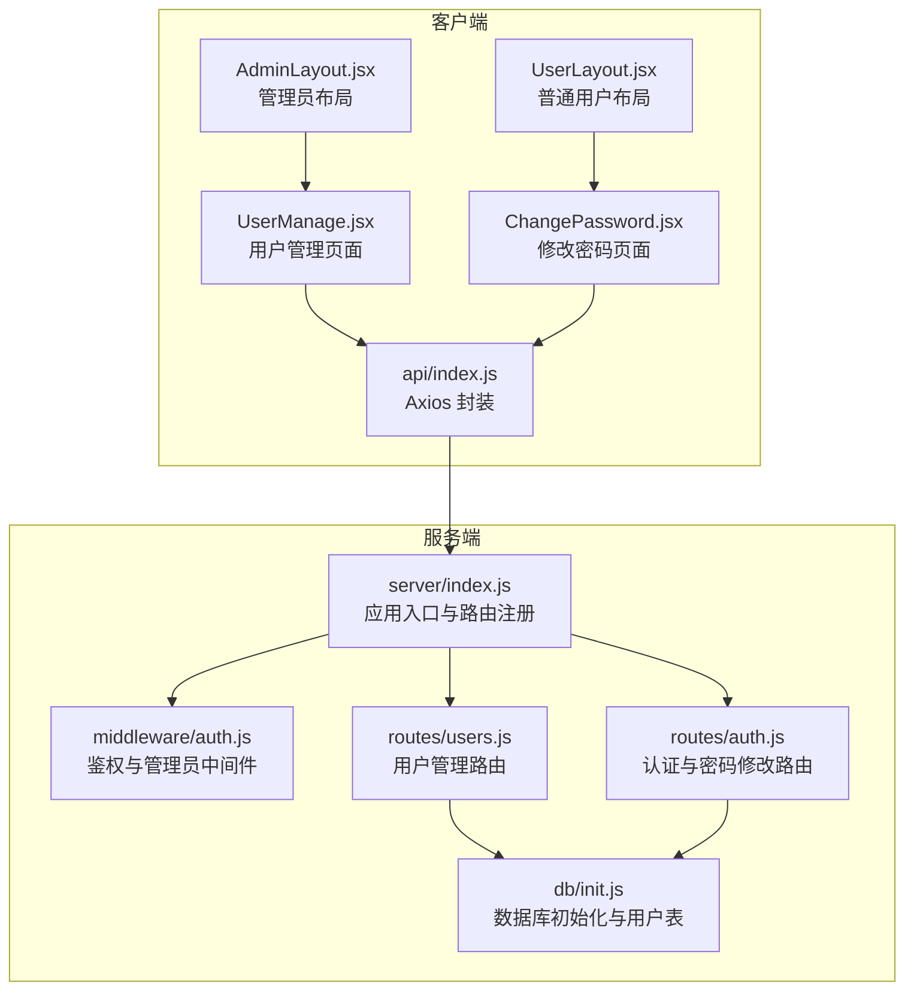
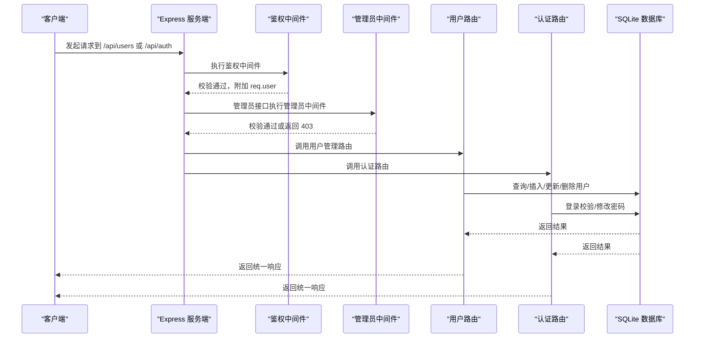
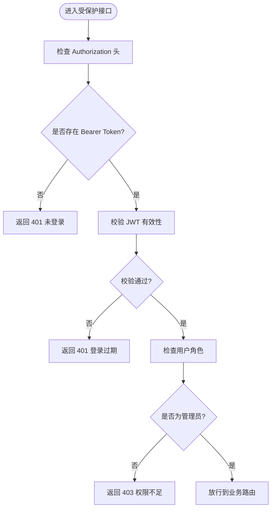
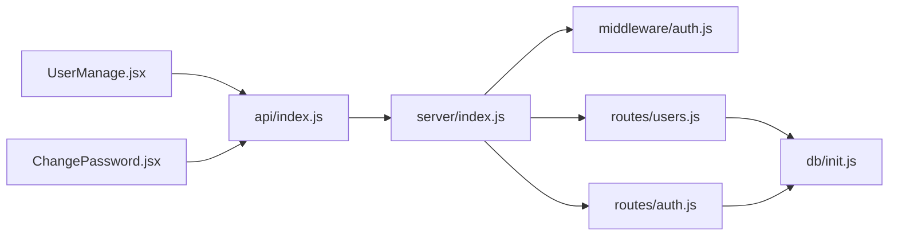

# 用户管理接口

<cite>
**本文引用的文件**
- [server/index.js](file://server/index.js)
- [server/middleware/auth.js](file://server/middleware/auth.js)
- [server/db/init.js](file://server/db/init.js)
- [server/routes/users.js](file://server/routes/users.js)
- [server/routes/auth.js](file://server/routes/auth.js)
- [client/src/api/index.js](file://client/src/api/index.js)
- [client/src/pages/admin/UserManage.jsx](file://client/src/pages/admin/UserManage.jsx)
- [client/src/pages/user/ChangePassword.jsx](file://client/src/pages/user/ChangePassword.jsx)
- [client/src/layouts/AdminLayout.jsx](file://client/src/layouts/AdminLayout.jsx)
- [client/src/layouts/UserLayout.jsx](file://client/src/layouts/UserLayout.jsx)
</cite>

## 目录
1. [简介](#简介)
2. [项目结构](#项目结构)
3. [核心组件](#核心组件)
4. [架构总览](#架构总览)
5. [详细组件分析](#详细组件分析)
6. [依赖关系分析](#依赖关系分析)
7. [性能考虑](#性能考虑)
8. [故障排除指南](#故障排除指南)
9. [结论](#结论)

## 简介
本文件为“用户管理接口”的完整 API 文档，覆盖用户信息管理相关接口，包括：
- 用户列表查询
- 用户详情获取（当前用户）
- 用户创建
- 用户更新
- 用户删除
- 用户状态管理（默认管理员不可删除）
- 密码修改与安全机制
- 管理员权限下的用户管理与普通用户的自我管理差异

文档同时说明权限验证机制、角色控制、请求与响应格式、状态码以及常见问题排查方法，并提供请求与响应示例路径。

## 项目结构
后端采用 Express + Better-SQLite3，前端采用 React + Ant Design，通过 Axios 统一发起 API 请求。用户管理相关模块如下：
- 服务端路由：/api/users（用户管理）、/api/auth（认证与密码修改）
- 中间件：鉴权与管理员校验
- 数据库：SQLite 初始化与用户表结构
- 客户端：管理员页面负责用户增删改查；普通用户页面支持修改密码

图表来源
- [server/index.js:1-120](file://server/index.js#L1-L120)
- [server/middleware/auth.js:1-29](file://server/middleware/auth.js#L1-L29)
- [server/routes/users.js:1-87](file://server/routes/users.js#L1-L87)
- [server/routes/auth.js:1-69](file://server/routes/auth.js#L1-L69)
- [server/db/init.js:1-217](file://server/db/init.js#L1-L217)
- [client/src/api/index.js:1-42](file://client/src/api/index.js#L1-L42)
- [client/src/pages/admin/UserManage.jsx:1-77](file://client/src/pages/admin/UserManage.jsx#L1-L77)
- [client/src/pages/user/ChangePassword.jsx:1-50](file://client/src/pages/user/ChangePassword.jsx#L1-L50)
- [client/src/layouts/AdminLayout.jsx:1-174](file://client/src/layouts/AdminLayout.jsx#L1-L174)
- [client/src/layouts/UserLayout.jsx:1-162](file://client/src/layouts/UserLayout.jsx#L1-L162)

章节来源
- [server/index.js:1-120](file://server/index.js#L1-L120)
- [client/src/api/index.js:1-42](file://client/src/api/index.js#L1-L42)

## 核心组件
- 服务端路由
  - 用户管理：/api/users（GET/POST/PUT/DELETE）
  - 认证与密码修改：/api/auth/login、/api/auth/change-password、/api/auth/me
- 中间件
  - 鉴权中间件：从 Authorization 头提取 Bearer Token，校验失败返回 401
  - 管理员中间件：校验用户角色是否为 admin，否则返回 403
- 数据库
  - 用户表 users：包含 id、username、password、real_name、phone、role、is_default、created_at
  - 默认管理员账号初始化逻辑
- 客户端
  - 管理员页面 UserManage.jsx：实现用户列表分页、搜索、新增/编辑弹窗、删除确认
  - 普通用户页面 ChangePassword.jsx：修改密码流程
  - Axios 封装：统一注入 Authorization 头，处理 401 自动登出

章节来源
- [server/routes/users.js:1-87](file://server/routes/users.js#L1-L87)
- [server/routes/auth.js:1-69](file://server/routes/auth.js#L1-L69)
- [server/middleware/auth.js:1-29](file://server/middleware/auth.js#L1-L29)
- [server/db/init.js:197-205](file://server/db/init.js#L197-L205)
- [client/src/pages/admin/UserManage.jsx:1-77](file://client/src/pages/admin/UserManage.jsx#L1-L77)
- [client/src/pages/user/ChangePassword.jsx:1-50](file://client/src/pages/user/ChangePassword.jsx#L1-L50)
- [client/src/api/index.js:1-42](file://client/src/api/index.js#L1-L42)

## 架构总览
用户管理接口遵循“鉴权 + 角色控制”的设计模式：
- 所有用户管理接口均需通过 authMiddleware 鉴权
- 管理员才能访问用户管理接口（adminMiddleware）
- 普通用户可通过 /api/auth/me 获取当前用户信息，通过 /api/auth/change-password 修改密码

图表来源
- [server/index.js:68-95](file://server/index.js#L68-L95)
- [server/middleware/auth.js:5-26](file://server/middleware/auth.js#L5-L26)
- [server/routes/users.js:7-86](file://server/routes/users.js#L7-L86)
- [server/routes/auth.js:8-66](file://server/routes/auth.js#L8-L66)
- [server/db/init.js:21-33](file://server/db/init.js#L21-L33)

## 详细组件分析

### 用户管理接口规范

- 接口前缀：/api/users
- 鉴权要求：所有接口均需携带 Authorization: Bearer <token>
- 角色要求：仅管理员可调用

1) 用户列表查询
- 方法与路径：GET /api/users
- 查询参数
  - keyword：关键词（模糊匹配 username、real_name、phone）
  - page：页码，默认 1
  - pageSize：每页条数，默认 20
- 成功响应字段
  - code：0 表示成功
  - data.list：用户数组（包含 id、username、real_name、phone、role、is_default、created_at）
  - data.total：总数
  - data.page：当前页
  - data.pageSize：每页数量
- 状态码
  - 200 成功
  - 401 未登录/过期
  - 403 权限不足（非管理员）

章节来源
- [server/routes/users.js:9-24](file://server/routes/users.js#L9-L24)
- [server/middleware/auth.js:5-26](file://server/middleware/auth.js#L5-L26)

2) 用户创建
- 方法与路径：POST /api/users
- 请求体字段
  - username：必填
  - password：必填
  - real_name：必填
  - phone：选填
  - role：选填，默认 user
- 成功响应
  - code：0
  - message：添加成功
- 状态码
  - 200 成功
  - 400 参数缺失或账号已存在
  - 401 未登录/过期
  - 403 权限不足

章节来源
- [server/routes/users.js:26-41](file://server/routes/users.js#L26-L41)
- [server/middleware/auth.js:5-26](file://server/middleware/auth.js#L5-L26)

3) 用户更新
- 方法与路径：PUT /api/users/:id
- 路径参数
  - id：用户 ID
- 请求体字段
  - username：必填
  - real_name：必填
  - phone：选填
  - role：选填
  - password：选填（留空则不修改密码）
- 成功响应
  - code：0
  - message：修改成功
- 状态码
  - 200 成功
  - 400 参数缺失、用户不存在或账号重复
  - 401 未登录/过期
  - 403 权限不足

章节来源
- [server/routes/users.js:43-69](file://server/routes/users.js#L43-L69)
- [server/middleware/auth.js:5-26](file://server/middleware/auth.js#L5-L26)

4) 用户删除
- 方法与路径：DELETE /api/users/:id
- 路径参数
  - id：用户 ID
- 成功响应
  - code：0
  - message：删除成功
- 状态码
  - 200 成功
  - 400 用户不存在或默认管理员不可删除
  - 401 未登录/过期
  - 403 权限不足

章节来源
- [server/routes/users.js:71-84](file://server/routes/users.js#L71-L84)
- [server/middleware/auth.js:5-26](file://server/middleware/auth.js#L5-L26)

5) 当前用户信息
- 方法与路径：GET /api/auth/me
- 成功响应字段
  - code：0
  - data：当前用户对象（id、username、real_name、phone、role）
- 状态码
  - 200 成功
  - 401 未登录/过期

章节来源
- [server/routes/auth.js:61-66](file://server/routes/auth.js#L61-L66)
- [server/middleware/auth.js:5-19](file://server/middleware/auth.js#L5-L19)

6) 密码修改
- 方法与路径：POST /api/auth/change-password
- 请求体字段
  - old_password：必填
  - new_password：必填，长度不少于 6 位
- 成功响应
  - code：0
  - message：密码修改成功
- 状态码
  - 200 成功
  - 400 参数缺失、原密码错误或新密码长度不足
  - 401 未登录/过期

章节来源
- [server/routes/auth.js:42-59](file://server/routes/auth.js#L42-L59)
- [server/middleware/auth.js:5-19](file://server/middleware/auth.js#L5-L19)

### 权限验证与角色控制

- 鉴权中间件
  - 从 Authorization 头读取 Bearer Token
  - 校验失败返回 401
- 管理员中间件
  - 仅当 req.user.role === 'admin' 时放行
  - 否则返回 403
- 客户端行为
  - Axios 在请求头注入 Authorization: Bearer <token>
  - 响应拦截器遇到 401 自动清除本地 token 并跳转登录页

图表来源
- [server/middleware/auth.js:5-26](file://server/middleware/auth.js#L5-L26)
- [client/src/api/index.js:9-39](file://client/src/api/index.js#L9-L39)

章节来源
- [server/middleware/auth.js:1-29](file://server/middleware/auth.js#L1-L29)
- [client/src/api/index.js:1-42](file://client/src/api/index.js#L1-L42)

### 客户端集成要点

- 管理员页面 UserManage.jsx
  - 列表加载：GET /api/users?page&pageSize&keyword
  - 新增/编辑：POST /api/users 或 PUT /api/users/:id
  - 删除：DELETE /api/users/:id
  - 删除按钮在 is_default !== 1 时显示
- 普通用户页面 ChangePassword.jsx
  - 提交：POST /api/auth/change-password
  - 前端校验新密码一致性
- 布局组件
  - AdminLayout.jsx：导航至 /admin/users
  - UserLayout.jsx：导航至 /user/password

章节来源
- [client/src/pages/admin/UserManage.jsx:18-36](file://client/src/pages/admin/UserManage.jsx#L18-L36)
- [client/src/pages/user/ChangePassword.jsx:9-26](file://client/src/pages/user/ChangePassword.jsx#L9-L26)
- [client/src/layouts/AdminLayout.jsx:57-70](file://client/src/layouts/AdminLayout.jsx#L57-L70)
- [client/src/layouts/UserLayout.jsx:55-64](file://client/src/layouts/UserLayout.jsx#L55-L64)

## 依赖关系分析

图表来源
- [client/src/pages/admin/UserManage.jsx:4](file://client/src/pages/admin/UserManage.jsx#L4)
- [client/src/pages/user/ChangePassword.jsx:3](file://client/src/pages/user/ChangePassword.jsx#L3)
- [client/src/api/index.js:1-42](file://client/src/api/index.js#L1-L42)
- [server/index.js:68-95](file://server/index.js#L68-L95)
- [server/middleware/auth.js:1-29](file://server/middleware/auth.js#L1-L29)
- [server/routes/users.js:1-87](file://server/routes/users.js#L1-L87)
- [server/routes/auth.js:1-69](file://server/routes/auth.js#L1-L69)
- [server/db/init.js:1-217](file://server/db/init.js#L1-L217)

章节来源
- [server/index.js:68-95](file://server/index.js#L68-L95)
- [client/src/api/index.js:1-42](file://client/src/api/index.js#L1-L42)

## 性能考虑
- 分页查询：列表接口支持 keyword、page、pageSize，避免一次性拉取大量数据
- 数据库索引：users 表包含 username 唯一索引，减少重复账号检查成本
- 密码哈希：使用 bcrypt，强度适中且安全
- 速率限制：全局 API 与登录接口分别配置速率限制，防止暴力破解与滥用

章节来源
- [server/routes/users.js:10-24](file://server/routes/users.js#L10-L24)
- [server/db/init.js:25](file://server/db/init.js#L25)
- [server/index.js:46-63](file://server/index.js#L46-L63)

## 故障排除指南
- 401 未登录/登录过期
  - 现象：接口返回 401 或自动跳转登录页
  - 处理：重新登录获取 token，确保 Authorization 头正确
- 403 权限不足
  - 现象：非管理员访问用户管理接口
  - 处理：使用管理员账号登录
- 400 参数错误/账号已存在
  - 现象：新增/编辑时缺少必填字段或账号冲突
  - 处理：补齐必填字段，更换唯一性字段值
- 默认管理员不可删除
  - 现象：删除 is_default=1 的用户失败
  - 处理：保留默认管理员账号或先修改其 is_default 再删除

章节来源
- [server/middleware/auth.js:9-18](file://server/middleware/auth.js#L9-L18)
- [server/routes/users.js:29-36](file://server/routes/users.js#L29-L36)
- [server/routes/users.js:56-59](file://server/routes/users.js#L56-L59)
- [server/routes/users.js:79-81](file://server/routes/users.js#L79-L81)

## 结论
本用户管理接口以“鉴权 + 角色控制”为核心，结合 SQLite 数据库存储与 React 前端交互，提供了管理员视角的用户全量管理能力与普通用户的自我管理能力。接口设计简洁、职责清晰，配合统一的响应格式与错误处理，便于前后端协作与扩展。