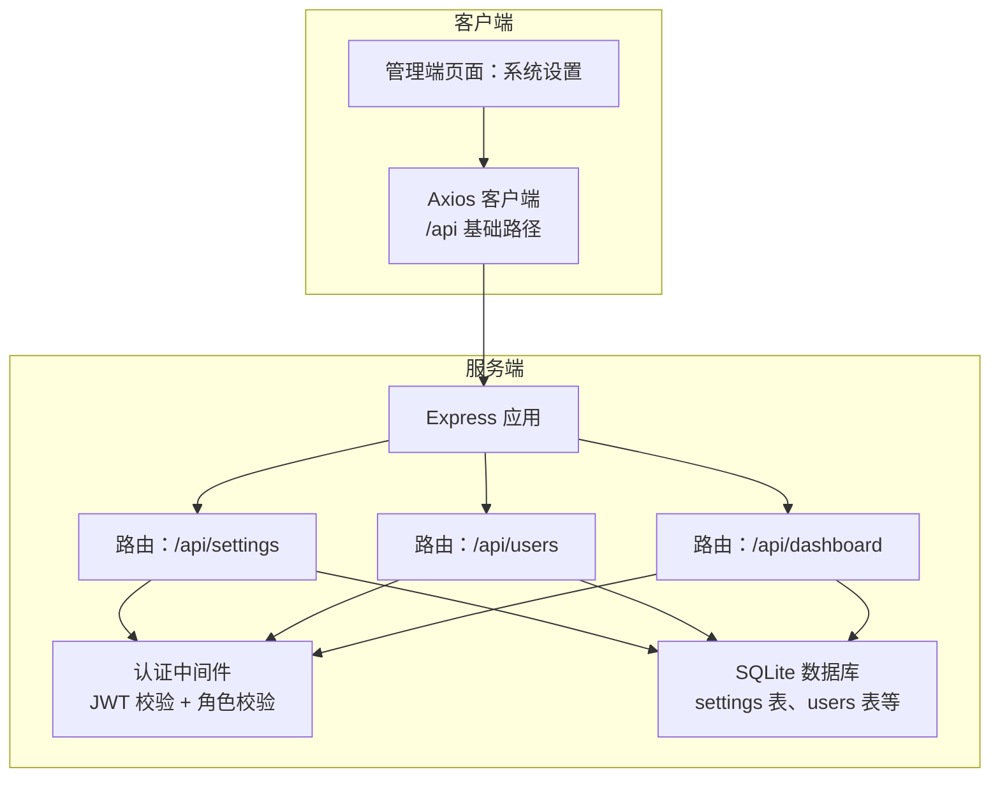
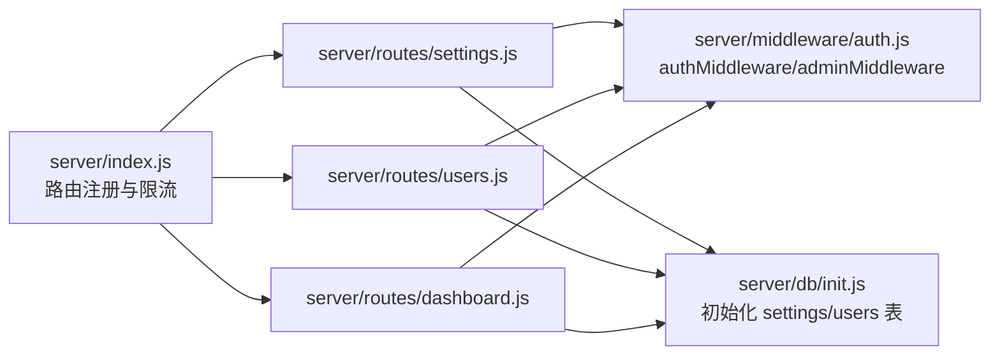

# 系统设置接口

<cite>
**本文引用的文件**
- [server/index.js](file://server/index.js)
- [server/routes/settings.js](file://server/routes/settings.js)
- [server/middleware/auth.js](file://server/middleware/auth.js)
- [server/db/init.js](file://server/db/init.js)
- [client/src/api/index.js](file://client/src/api/index.js)
- [client/src/pages/admin/Settings.jsx](file://client/src/pages/admin/Settings.jsx)
- [server/routes/users.js](file://server/routes/users.js)
- [server/routes/dashboard.js](file://server/routes/dashboard.js)
</cite>

## 目录
1. [简介](#简介)
2. [项目结构](#项目结构)
3. [核心组件](#核心组件)
4. [架构总览](#架构总览)
5. [详细组件分析](#详细组件分析)
6. [依赖关系分析](#依赖关系分析)
7. [性能考虑](#性能考虑)
8. [故障排查指南](#故障排查指南)
9. [结论](#结论)
10. [附录](#附录)

## 简介
本文件为“系统设置接口”的完整 API 文档，覆盖系统配置管理、权限与角色配置、系统监控与仪表盘等系统级能力。重点说明如下：
- 系统基本信息配置接口：系统名称、版本信息、默认设置等
- 权限与角色配置接口：权限分配、角色管理、访问控制等安全管理功能
- 系统日志与审计：基于现有业务数据的“近期操作”审计视图
- 系统监控接口：性能指标、资源使用情况、健康检查等

文档详细描述每个接口的 HTTP 方法、URL 路径、请求参数、响应数据结构和状态码，并提供最佳实践与安全建议。

## 项目结构
后端采用 Express + better-sqlite3 架构，前端使用 React + Ant Design + Axios。系统设置相关接口集中在 settings 路由模块，配合认证中间件实现权限控制；用户管理与仪表盘接口用于支撑权限与监控场景。



图表来源
- [server/index.js:68-95](file://server/index.js#L68-L95)
- [server/routes/settings.js:1-33](file://server/routes/settings.js#L1-L33)
- [server/routes/users.js:1-87](file://server/routes/users.js#L1-L87)
- [server/routes/dashboard.js:1-92](file://server/routes/dashboard.js#L1-L92)
- [server/middleware/auth.js:1-29](file://server/middleware/auth.js#L1-L29)
- [server/db/init.js:35-41](file://server/db/init.js#L35-L41)

章节来源
- [server/index.js:1-120](file://server/index.js#L1-L120)
- [server/routes/settings.js:1-33](file://server/routes/settings.js#L1-L33)
- [server/middleware/auth.js:1-29](file://server/middleware/auth.js#L1-L29)
- [server/db/init.js:18-214](file://server/db/init.js#L18-L214)

## 核心组件
- 认证中间件：提供登录态校验与角色校验，确保敏感接口仅管理员可访问
- 设置路由：提供系统名称读取与更新能力，支持公开读取与受控写入
- 用户路由：提供用户列表、新增、修改、删除等权限管理能力
- 仪表盘路由：提供管理员与普通用户的监控数据，作为系统监控入口
- 前端 API 客户端：统一拦截器注入 Token，处理 401 自动登出

章节来源
- [server/middleware/auth.js:5-26](file://server/middleware/auth.js#L5-L26)
- [server/routes/settings.js:6-31](file://server/routes/settings.js#L6-L31)
- [server/routes/users.js:9-84](file://server/routes/users.js#L9-L84)
- [server/routes/dashboard.js:8-89](file://server/routes/dashboard.js#L8-L89)
- [client/src/api/index.js:9-39](file://client/src/api/index.js#L9-L39)

## 架构总览
系统设置接口遵循“公开读取 + 受控写入”的设计原则：
- 公开接口：系统名称读取（无需登录）
- 受控接口：系统设置读取（需登录）、系统名称更新（需管理员）

```mermaid
sequenceDiagram
participant C as "客户端"
participant S as "设置路由"
participant M as "认证中间件"
participant D as "SQLite 数据库"
rect rgb(255,255,255)
Note over C,S : 公开接口：获取系统名称
C->>S : GET /api/settings/system-name
S->>D : 查询 settings.system_name
D-->>S : 返回值或默认值
S-->>C : {code : 0, data : {system_name}}
end
rect rgb(255,255,255)
Note over C,M,S : 受控接口：更新系统名称
C->>M : PUT /api/settings/system-name<br/>携带 Bearer Token
M-->>C : 放行或返回 401/403
M->>S : 继续处理
S->>D : INSERT OR REPLACE settings.system_name
S-->>C : {code : 0, message : "修改成功"}
end
```

图表来源
- [server/routes/settings.js:6-31](file://server/routes/settings.js#L6-L31)
- [server/middleware/auth.js:5-26](file://server/middleware/auth.js#L5-L26)
- [server/db/init.js:207-211](file://server/db/init.js#L207-L211)

## 详细组件分析

### 系统基本信息配置接口
- 接口目标：提供系统名称的读取与更新能力，支持公开读取与受控写入
- 数据模型：settings 表，键值对存储

接口清单
- 获取系统名称（公开）
  - 方法：GET
  - 路径：/api/settings/system-name
  - 认证：无需登录
  - 请求参数：无
  - 响应数据结构：{
      code: number,
      data: {
        system_name: string
      }
    }
  - 状态码：200 成功；若数据库无记录则返回默认值
  - 实现参考：[server/routes/settings.js:6-11](file://server/routes/settings.js#L6-L11)，[server/db/init.js:207-211](file://server/db/init.js#L207-L211)

- 获取系统设置（受控）
  - 方法：GET
  - 路径：/api/settings
  - 认证：需登录
  - 请求参数：无
  - 响应数据结构：{
      code: number,
      data: Record<string, string>
    }
  - 状态码：200 成功；401 未登录
  - 实现参考：[server/routes/settings.js:13-20](file://server/routes/settings.js#L13-L20)，[server/middleware/auth.js:5-19](file://server/middleware/auth.js#L5-L19)

- 更新系统名称（受控）
  - 方法：PUT
  - 路径：/api/settings/system-name
  - 认证：需登录 + 管理员角色
  - 请求体参数：{
      system_name: string
    }
  - 响应数据结构：{
      code: number,
      message: string
    }
  - 状态码：200 成功；400 参数非法；401 未登录；403 权限不足
  - 实现参考：[server/routes/settings.js:22-31](file://server/routes/settings.js#L22-L31)，[server/middleware/auth.js:21-26](file://server/middleware/auth.js#L21-L26)

前端调用示例
- 页面加载时读取系统设置：[client/src/pages/admin/Settings.jsx:15-20](file://client/src/pages/admin/Settings.jsx#L15-L20)
- 提交更新系统名称：[client/src/pages/admin/Settings.jsx:22-32](file://client/src/pages/admin/Settings.jsx#L22-L32)
- Axios 统一拦截器注入 Token：[client/src/api/index.js:9-15](file://client/src/api/index.js#L9-L15)

章节来源
- [server/routes/settings.js:6-31](file://server/routes/settings.js#L6-L31)
- [server/middleware/auth.js:5-26](file://server/middleware/auth.js#L5-L26)
- [server/db/init.js:207-211](file://server/db/init.js#L207-L211)
- [client/src/pages/admin/Settings.jsx:15-32](file://client/src/pages/admin/Settings.jsx#L15-L32)
- [client/src/api/index.js:9-15](file://client/src/api/index.js#L9-L15)

### 权限与角色配置接口
- 目标：提供用户管理能力，支撑权限分配与访问控制
- 数据模型：users 表，包含用户名、密码、真实姓名、电话、角色、是否默认管理员等字段

接口清单
- 获取用户列表（受控）
  - 方法：GET
  - 路径：/api/users
  - 认证：需登录 + 管理员
  - 查询参数：keyword（可选）、page（可选，默认1）、pageSize（可选，默认20）
  - 响应数据结构：{
      code: number,
      data: {
        list: Array,
        total: number,
        page: number,
        pageSize: number
      }
    }
  - 状态码：200 成功；401 未登录；403 权限不足
  - 实现参考：[server/routes/users.js:9-24](file://server/routes/users.js#L9-L24)，[server/middleware/auth.js:21-26](file://server/middleware/auth.js#L21-L26)

- 新增用户（受控）
  - 方法：POST
  - 路径：/api/users
  - 认证：需登录 + 管理员
  - 请求体参数：{
      username: string,
      password: string,
      real_name: string,
      phone: string,
      role: string
    }
  - 响应数据结构：{
      code: number,
      message: string
    }
  - 状态码：200 成功；400 参数缺失或重复
  - 实现参考：[server/routes/users.js:26-41](file://server/routes/users.js#L26-L41)

- 修改用户（受控）
  - 方法：PUT
  - 路径：/api/users/:id
  - 认证：需登录 + 管理员
  - 请求体参数：{
      username: string,
      real_name: string,
      phone: string,
      role: string,
      password: string（可选）
    }
  - 响应数据结构：{
      code: number,
      message: string
    }
  - 状态码：200 成功；400 参数缺失或重复；404 用户不存在
  - 实现参考：[server/routes/users.js:43-69](file://server/routes/users.js#L43-L69)

- 删除用户（受控）
  - 方法：DELETE
  - 路径：/api/users/:id
  - 认证：需登录 + 管理员
  - 请求参数：无
  - 响应数据结构：{
      code: number,
      message: string
    }
  - 状态码：200 成功；400 用户不存在；400 默认管理员不可删除
  - 实现参考：[server/routes/users.js:71-84](file://server/routes/users.js#L71-L84)

前端调用示例
- 用户管理页面提交新增/修改：[client/src/pages/admin/UserManage.jsx:31-36](file://client/src/pages/admin/UserManage.jsx#L31-L36)

章节来源
- [server/routes/users.js:9-84](file://server/routes/users.js#L9-L84)
- [server/middleware/auth.js:21-26](file://server/middleware/auth.js#L21-L26)
- [client/src/pages/admin/UserManage.jsx:31-36](file://client/src/pages/admin/UserManage.jsx#L31-L36)

### 系统日志与审计接口
- 当前实现：通过“仪表盘”接口聚合近期操作，形成审计视图
- 数据来源：入库、出库、日常开销三类业务记录，按时间倒序展示

接口清单
- 管理员仪表盘（含近期操作）
  - 方法：GET
  - 路径：/api/dashboard/admin
  - 认证：需登录
  - 响应数据结构：{
      code: number,
      data: {
        productCount: number,
        stockValue: number,
        monthStockIn: number,
        monthStockInQty: number,
        monthStockOut: number,
        monthStockOutQty: number,
        monthExpense: number,
        trendData: Array,
        recentOps: Array
      }
    }
  - 状态码：200 成功；401 未登录
  - 实现参考：[server/routes/dashboard.js:8-60](file://server/routes/dashboard.js#L8-L60)

- 普通用户仪表盘（含近期操作）
  - 方法：GET
  - 路径：/api/dashboard/user
  - 认证：需登录
  - 响应数据结构：{
      code: number,
      data: {
        myProducts: number,
        myStockIn: number,
        myStockOut: number,
        myExpense: number,
        recentOps: Array
      }
    }
  - 状态码：200 成功；401 未登录
  - 实现参考：[server/routes/dashboard.js:62-89](file://server/routes/dashboard.js#L62-L89)

前端调用示例
- 管理端仪表盘加载数据：[client/src/pages/admin/Dashboard.jsx:19-23](file://client/src/pages/admin/Dashboard.jsx#L19-L23)
- 用户端仪表盘加载数据：[client/src/pages/user/Dashboard.jsx:12-16](file://client/src/pages/user/Dashboard.jsx#L12-L16)

章节来源
- [server/routes/dashboard.js:8-89](file://server/routes/dashboard.js#L8-L89)
- [client/src/pages/admin/Dashboard.jsx:19-23](file://client/src/pages/admin/Dashboard.jsx#L19-L23)
- [client/src/pages/user/Dashboard.jsx:12-16](file://client/src/pages/user/Dashboard.jsx#L12-L16)

### 系统监控接口
- 当前实现：通过仪表盘接口提供关键指标与趋势，作为系统监控入口
- 指标说明：
  - 管理员：商品总数、库存总金额、本月入库/出库额与量、本月开销、近7天入库/出库趋势、近期操作
  - 普通用户：我录入的商品数、本月入库/出库/开销额、近期操作

接口清单
- 管理员监控指标
  - 方法：GET
  - 路径：/api/dashboard/admin
  - 认证：需登录
  - 响应数据结构：见上节
  - 状态码：200 成功；401 未登录
  - 实现参考：[server/routes/dashboard.js:8-60](file://server/routes/dashboard.js#L8-L60)

- 普通用户监控指标
  - 方法：GET
  - 路径：/api/dashboard/user
  - 认证：需登录
  - 响应数据结构：见上节
  - 状态码：200 成功；401 未登录
  - 实现参考：[server/routes/dashboard.js:62-89](file://server/routes/dashboard.js#L62-L89)

章节来源
- [server/routes/dashboard.js:8-89](file://server/routes/dashboard.js#L8-L89)

## 依赖关系分析
- 路由注册：应用启动时集中注册各路由模块，设置统一前缀与限流策略
- 中间件链路：认证中间件负责 Token 校验与角色校验，管理员中间件负责权限拦截
- 数据层：SQLite 初始化时创建 settings 与 users 等表，并插入默认系统名称与默认管理员



图表来源
- [server/index.js:68-95](file://server/index.js#L68-L95)
- [server/middleware/auth.js:5-26](file://server/middleware/auth.js#L5-L26)
- [server/routes/settings.js:1-33](file://server/routes/settings.js#L1-L33)
- [server/routes/users.js:1-87](file://server/routes/users.js#L1-L87)
- [server/routes/dashboard.js:1-92](file://server/routes/dashboard.js#L1-L92)
- [server/db/init.js:18-214](file://server/db/init.js#L18-L214)

章节来源
- [server/index.js:68-95](file://server/index.js#L68-L95)
- [server/middleware/auth.js:5-26](file://server/middleware/auth.js#L5-L26)
- [server/db/init.js:18-214](file://server/db/init.js#L18-L214)

## 性能考虑
- 数据库连接：使用单例连接池，避免重复打开连接
- 查询优化：当前接口多为轻量查询，建议后续对高频查询增加索引（如 settings.key、users.username 等）
- 前端缓存：前端可在页面切换时复用已拉取的系统设置，减少重复请求
- 限流策略：应用已对登录与全局 API 设置限流，建议根据实际流量调整阈值

## 故障排查指南
常见问题与定位
- 401 未登录
  - 现象：请求被拒绝，提示未登录
  - 排查：确认请求头是否携带正确的 Bearer Token；Token 是否过期
  - 参考：[server/middleware/auth.js:9-18](file://server/middleware/auth.js#L9-L18)，[client/src/api/index.js:21-25](file://client/src/api/index.js#L21-L25)

- 403 权限不足
  - 现象：提示需要管理员权限
  - 排查：确认当前用户角色是否为 admin
  - 参考：[server/middleware/auth.js:21-26](file://server/middleware/auth.js#L21-L26)

- 400 参数非法
  - 现象：系统名称为空或用户信息缺失
  - 排查：检查请求体字段是否符合要求
  - 参考：[server/routes/settings.js:24-27](file://server/routes/settings.js#L24-L27)，[server/routes/users.js:28-31](file://server/routes/users.js#L28-L31)

- 404 用户不存在
  - 现象：修改或删除用户时报错
  - 排查：确认用户 ID 是否正确
  - 参考：[server/routes/users.js:51-54](file://server/routes/users.js#L51-L54)

- 默认管理员不可删除
  - 现象：删除默认管理员失败
  - 排查：确认 is_default 字段是否为 1
  - 参考：[server/routes/users.js:79-81](file://server/routes/users.js#L79-L81)

章节来源
- [server/middleware/auth.js:9-26](file://server/middleware/auth.js#L9-L26)
- [client/src/api/index.js:21-25](file://client/src/api/index.js#L21-L25)
- [server/routes/settings.js:24-27](file://server/routes/settings.js#L24-L27)
- [server/routes/users.js:28-31](file://server/routes/users.js#L28-L31)
- [server/routes/users.js:51-54](file://server/routes/users.js#L51-L54)
- [server/routes/users.js:79-81](file://server/routes/users.js#L79-L81)

## 结论
本系统设置接口以“公开读取 + 受控写入”为核心设计，结合认证与角色中间件，实现了基础的系统配置管理与权限控制。当前版本通过仪表盘接口提供了系统监控与审计视图，满足日常运维与管理需求。建议后续扩展：
- 增加更细粒度的日志与审计接口
- 引入缓存与索引优化
- 扩展系统配置项（如版本信息、默认设置等）并提供批量更新能力

## 附录

### 最佳实践与安全建议
- Token 安全
  - 使用 HTTPS 传输，避免明文泄露
  - 合理设置 Token 过期时间，定期刷新
  - 防止通过 URL 参数传递 Token（已在中间件中强制从 Authorization 头获取）
- 权限最小化
  - 仅授予管理员必要的写入权限
  - 对敏感接口（如系统设置、用户管理）启用管理员校验
- 输入校验
  - 对必填字段进行非空校验，避免空值写入
  - 对系统名称等配置项进行长度与格式约束
- 错误处理
  - 明确区分业务错误与系统错误，返回一致的错误码与消息结构
  - 对 401 自动跳转登录页，提升用户体验

章节来源
- [server/middleware/auth.js:6-18](file://server/middleware/auth.js#L6-L18)
- [server/routes/settings.js:24-27](file://server/routes/settings.js#L24-L27)
- [client/src/api/index.js:21-25](file://client/src/api/index.js#L21-L25)