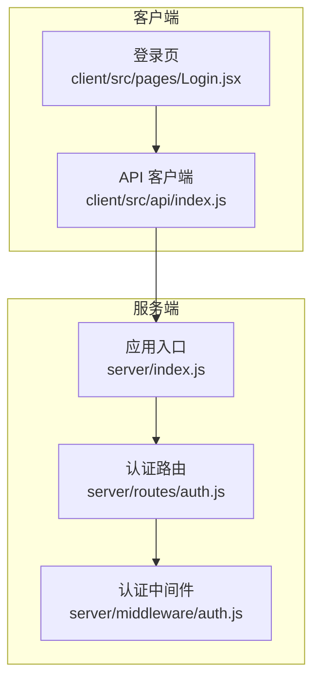
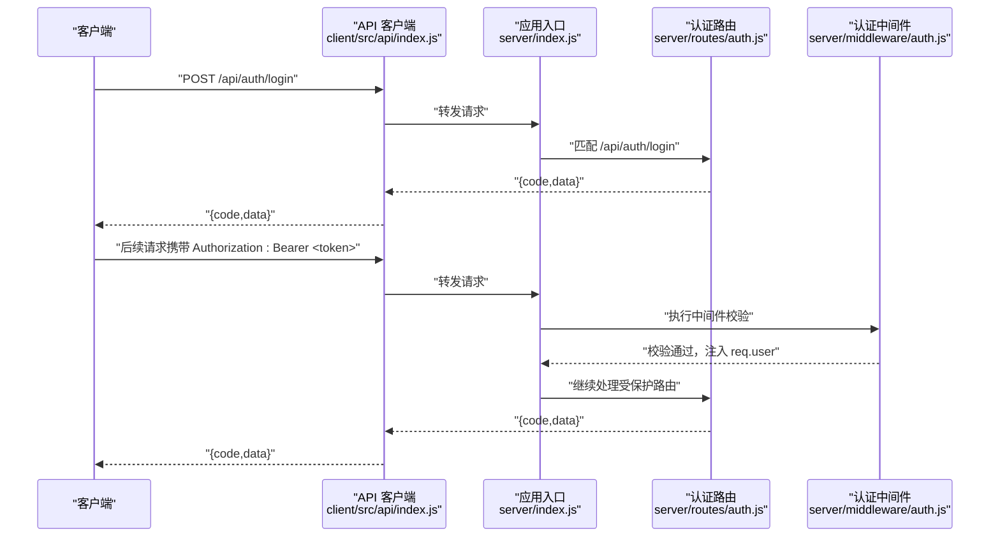
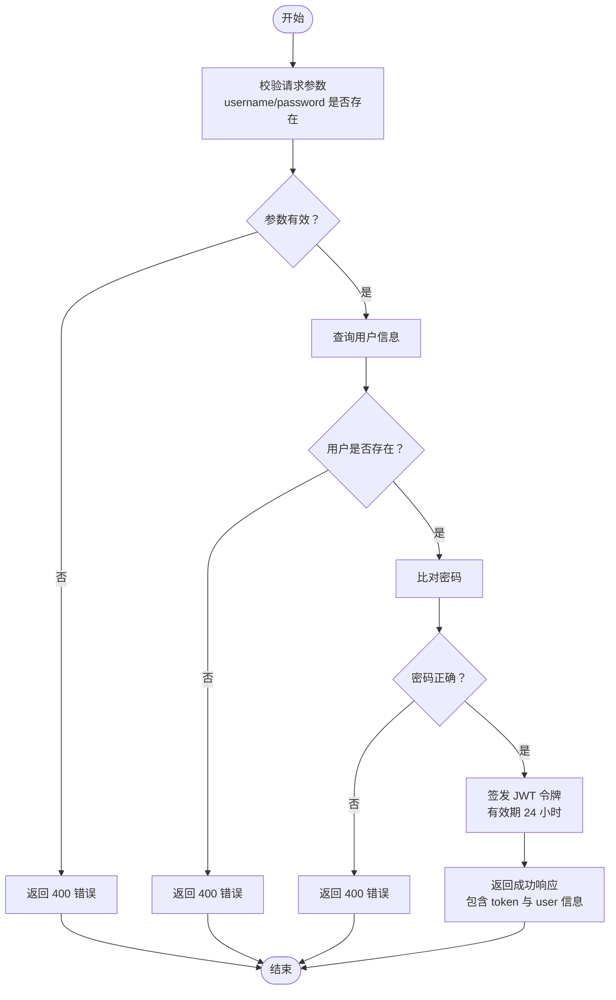
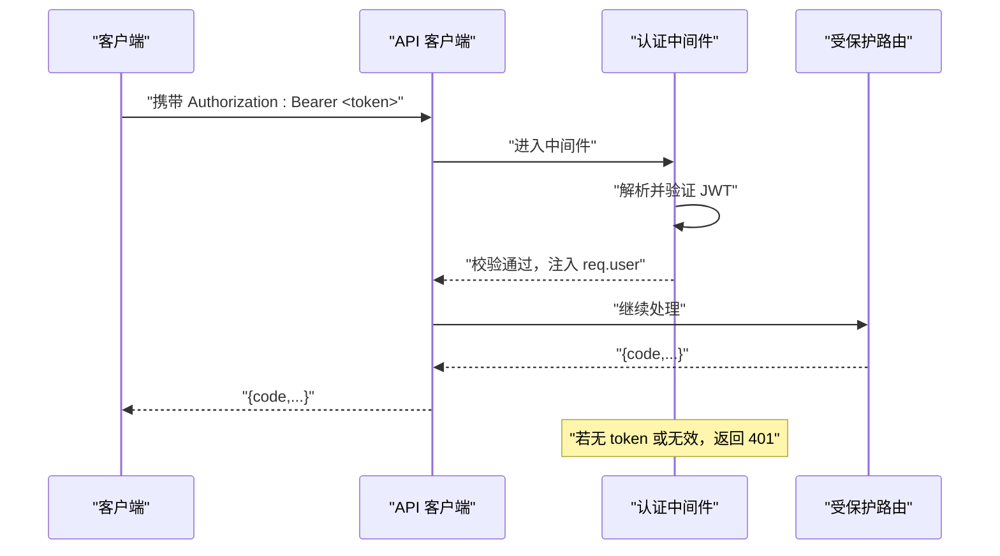
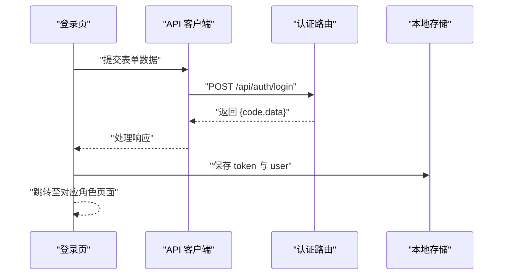
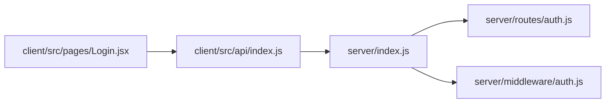

# 认证接口

<cite>
**本文引用的文件**
- [server/routes/auth.js](file://server/routes/auth.js)
- [server/middleware/auth.js](file://server/middleware/auth.js)
- [server/index.js](file://server/index.js)
- [client/src/pages/Login.jsx](file://client/src/pages/Login.jsx)
- [client/src/api/index.js](file://client/src/api/index.js)
</cite>

## 目录
1. [简介](#简介)
2. [项目结构](#项目结构)
3. [核心组件](#核心组件)
4. [架构总览](#架构总览)
5. [详细组件分析](#详细组件分析)
6. [依赖关系分析](#依赖关系分析)
7. [性能考虑](#性能考虑)
8. [故障排查指南](#故障排查指南)
9. [结论](#结论)
10. [附录](#附录)

## 简介
本文件为认证接口的完整 API 文档，覆盖用户登录、密码修改与当前用户信息查询三个核心接口。文档详细说明了各接口的 HTTP 方法、URL 路径、请求参数格式、响应数据结构、状态码含义，并提供请求与响应示例（以路径形式标注）。同时，文档解释了基于 JWT 的令牌生成与校验机制、令牌过期与刷新策略建议、以及认证中间件的使用方式与权限验证流程。

## 项目结构
认证相关的核心代码分布在服务端路由与中间件层，以及客户端请求拦截器中：
- 服务端
  - 认证路由：/api/auth/*
  - 认证中间件：鉴权与管理员权限校验
  - 应用入口：统一注册路由、CORS、限流与静态资源托管
- 客户端
  - 登录页面：发起登录请求、存储令牌与用户信息
  - API 封装：统一添加 Authorization 头、处理 401 统一跳转

**图表来源**
- [server/index.js:69-95](file://server/index.js#L69-L95)
- [server/routes/auth.js:1-69](file://server/routes/auth.js#L1-L69)
- [server/middleware/auth.js:1-29](file://server/middleware/auth.js#L1-L29)
- [client/src/pages/Login.jsx:1-68](file://client/src/pages/Login.jsx#L1-L68)
- [client/src/api/index.js:1-42](file://client/src/api/index.js#L1-L42)

**章节来源**
- [server/index.js:69-95](file://server/index.js#L69-L95)
- [server/routes/auth.js:1-69](file://server/routes/auth.js#L1-L69)
- [server/middleware/auth.js:1-29](file://server/middleware/auth.js#L1-L29)
- [client/src/pages/Login.jsx:1-68](file://client/src/pages/Login.jsx#L1-L68)
- [client/src/api/index.js:1-42](file://client/src/api/index.js#L1-L42)

## 核心组件
- 认证路由模块
  - 提供登录、修改密码、获取当前用户信息三个接口
  - 使用数据库查询用户、密码比对、JWT 签发与更新
- 认证中间件
  - 从请求头提取 Bearer 令牌并校验
  - 将解码后的用户信息注入到请求对象
  - 对未登录与过期令牌返回 401
- 应用入口
  - 注册认证路由与全局限流
  - 统一处理 CORS、安全头、静态资源与错误

**章节来源**
- [server/routes/auth.js:1-69](file://server/routes/auth.js#L1-L69)
- [server/middleware/auth.js:1-29](file://server/middleware/auth.js#L1-L29)
- [server/index.js:46-63](file://server/index.js#L46-L63)

## 架构总览
下图展示了从客户端到服务端的认证交互流程，包括登录、请求携带令牌、中间件校验与响应处理。

**图表来源**
- [client/src/api/index.js:9-15](file://client/src/api/index.js#L9-L15)
- [server/index.js:69-95](file://server/index.js#L69-L95)
- [server/routes/auth.js:8-40](file://server/routes/auth.js#L8-L40)
- [server/middleware/auth.js:5-19](file://server/middleware/auth.js#L5-L19)

## 详细组件分析

### 接口清单与规范

- 登录接口
  - 方法与路径
    - POST /api/auth/login
  - 请求参数
    - username: string，必填
    - password: string，必填
  - 成功响应
    - code: number，0 表示成功
    - data.token: string，JWT 令牌，有效期 24 小时
    - data.user: object
      - id: number|string
      - username: string
      - real_name: string
      - phone: string
      - role: string
  - 失败响应
    - code: number，400 表示参数缺失或凭据错误
  - 示例请求
    - POST /api/auth/login
    - Content-Type: application/json
    - Body: {"username":"...","password":"..."}
  - 示例响应（成功）
    - 200 OK
    - Body: {"code":0,"data":{"token":"...","user":{...}}}
  - 示例响应（失败）
    - 400 Bad Request
    - Body: {"code":400,"message":"账号或密码错误"}

- 修改密码接口
  - 方法与路径
    - POST /api/auth/change-password
  - 请求参数
    - old_password: string，必填
    - new_password: string，必填，长度不少于 6
  - 成功响应
    - code: number，0 表示成功
  - 失败响应
    - code: number，400 表示参数缺失或旧密码错误；401 表示未登录
  - 示例请求
    - POST /api/auth/change-password
    - Authorization: Bearer <token>
    - Content-Type: application/json
    - Body: {"old_password":"...","new_password":"..."}
  - 示例响应（成功）
    - 200 OK
    - Body: {"code":0,"message":"密码修改成功"}
  - 示例响应（失败）
    - 400 Bad Request
    - Body: {"code":400,"message":"原密码错误"}

- 获取当前用户信息接口
  - 方法与路径
    - GET /api/auth/me
  - 成功响应
    - code: number，0 表示成功
    - data: 当前用户信息对象
  - 失败响应
    - code: number，401 表示未登录
  - 示例请求
    - GET /api/auth/me
    - Authorization: Bearer <token>
  - 示例响应（成功）
    - 200 OK
    - Body: {"code":0,"data":{...}}
  - 示例响应（失败）
    - 401 Unauthorized
    - Body: {"code":401,"message":"未登录，请先登录"}

**章节来源**
- [server/routes/auth.js:8-40](file://server/routes/auth.js#L8-L40)
- [server/routes/auth.js:42-59](file://server/routes/auth.js#L42-L59)
- [server/routes/auth.js:61-66](file://server/routes/auth.js#L61-L66)

### 登录流程与令牌签发

**图表来源**
- [server/routes/auth.js:9-40](file://server/routes/auth.js#L9-L40)

**章节来源**
- [server/routes/auth.js:9-40](file://server/routes/auth.js#L9-L40)

### 令牌校验与权限控制

**图表来源**
- [client/src/api/index.js:9-15](file://client/src/api/index.js#L9-L15)
- [server/middleware/auth.js:5-19](file://server/middleware/auth.js#L5-L19)

**章节来源**
- [client/src/api/index.js:9-15](file://client/src/api/index.js#L9-L15)
- [server/middleware/auth.js:5-19](file://server/middleware/auth.js#L5-L19)

### 登录前端集成

**图表来源**
- [client/src/pages/Login.jsx:27-43](file://client/src/pages/Login.jsx#L27-L43)
- [client/src/api/index.js:9-15](file://client/src/api/index.js#L9-L15)
- [server/routes/auth.js:8-40](file://server/routes/auth.js#L8-L40)

**章节来源**
- [client/src/pages/Login.jsx:27-43](file://client/src/pages/Login.jsx#L27-L43)
- [client/src/api/index.js:9-15](file://client/src/api/index.js#L9-L15)
- [server/routes/auth.js:8-40](file://server/routes/auth.js#L8-L40)

## 依赖关系分析

**图表来源**
- [server/index.js:69-95](file://server/index.js#L69-L95)
- [server/routes/auth.js:1-69](file://server/routes/auth.js#L1-L69)
- [server/middleware/auth.js:1-29](file://server/middleware/auth.js#L1-L29)
- [client/src/api/index.js:1-42](file://client/src/api/index.js#L1-L42)
- [client/src/pages/Login.jsx:1-68](file://client/src/pages/Login.jsx#L1-L68)

**章节来源**
- [server/index.js:69-95](file://server/index.js#L69-L95)
- [server/routes/auth.js:1-69](file://server/routes/auth.js#L1-L69)
- [server/middleware/auth.js:1-29](file://server/middleware/auth.js#L1-L29)
- [client/src/api/index.js:1-42](file://client/src/api/index.js#L1-L42)
- [client/src/pages/Login.jsx:1-68](file://client/src/pages/Login.jsx#L1-L68)

## 性能考虑
- 登录频率限制
  - 登录接口每 IP 每分钟最多 10 次，避免暴力破解
- 全局 API 频率限制
  - 其他接口每 IP 每分钟最多 120 次，防止滥用
- 令牌有效期
  - 登录成功签发的令牌有效期为 24 小时，建议在前端实现“静默刷新”策略（见下一节）

**章节来源**
- [server/index.js:46-63](file://server/index.js#L46-L63)
- [server/routes/auth.js:22-26](file://server/routes/auth.js#L22-L26)

## 故障排查指南
- 400 错误（参数缺失或凭据错误）
  - 检查请求体是否包含 username 与 password，或修改密码时 old_password 与 new_password 是否满足要求
- 401 未登录/登录已过期
  - 确认请求头是否包含正确的 Authorization: Bearer <token>
  - 若提示“登录已过期”，需重新登录获取新令牌
- 429 请求过于频繁
  - 触发了登录或全局限流，等待冷却时间后重试
- 客户端自动处理
  - API 客户端在收到 401 时会清除本地 token 并跳转到登录页

**章节来源**
- [server/routes/auth.js:11-21](file://server/routes/auth.js#L11-L21)
- [server/routes/auth.js:45-55](file://server/routes/auth.js#L45-L55)
- [server/middleware/auth.js:9-18](file://server/middleware/auth.js#L9-L18)
- [server/index.js:46-63](file://server/index.js#L46-L63)
- [client/src/api/index.js:17-39](file://client/src/api/index.js#L17-L39)

## 结论
本认证体系采用 JWT 令牌进行无状态身份验证，结合服务端中间件与客户端请求拦截器实现统一的权限控制。登录接口提供基础凭据校验与令牌签发；修改密码与获取当前用户信息接口受中间件保护。建议在前端实现令牌过期前的静默刷新策略，以提升用户体验。

## 附录

### JWT 令牌使用方法与刷新策略
- 使用方法
  - 在每次请求头中添加 Authorization: Bearer <token>
  - 客户端已在请求拦截器中自动注入
- 过期时间
  - 登录成功签发的令牌有效期为 24 小时
- 刷新策略建议
  - 在令牌即将到期前（例如剩余 5 分钟）向服务端发起“刷新令牌”请求（当前仓库未实现专门的刷新接口），或在 401 时引导用户重新登录

**章节来源**
- [client/src/api/index.js:9-15](file://client/src/api/index.js#L9-L15)
- [server/routes/auth.js:22-26](file://server/routes/auth.js#L22-L26)