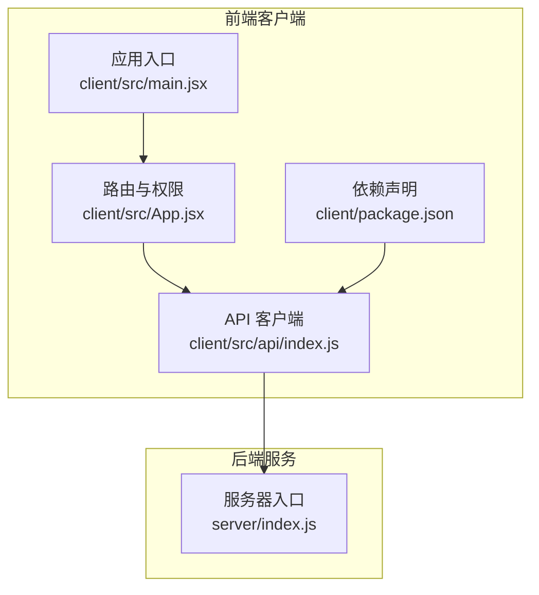
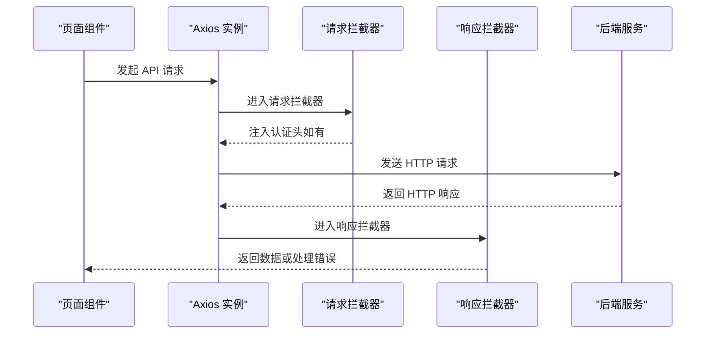
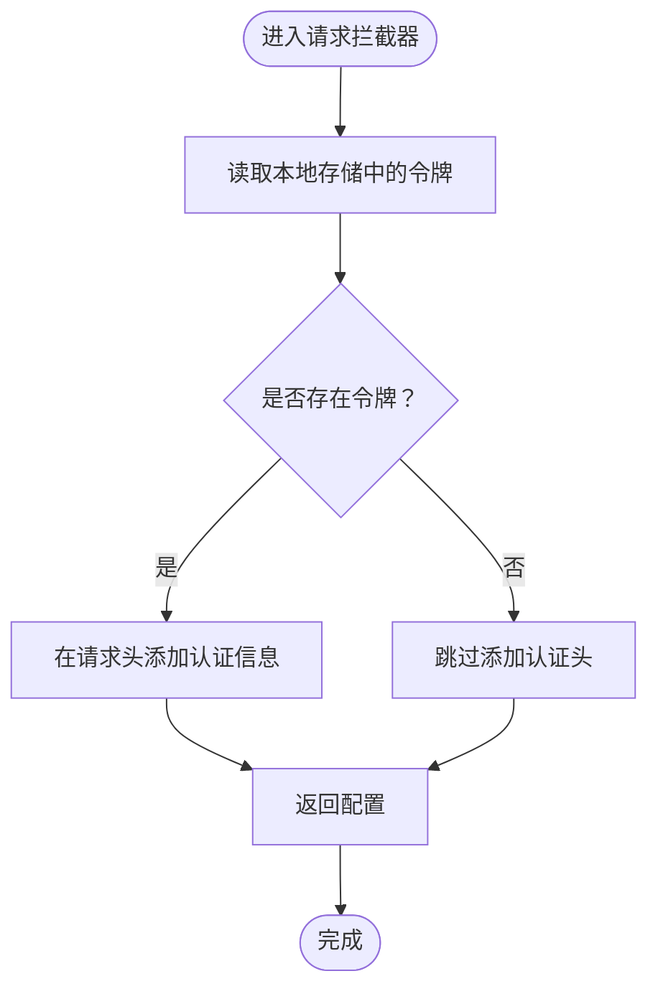
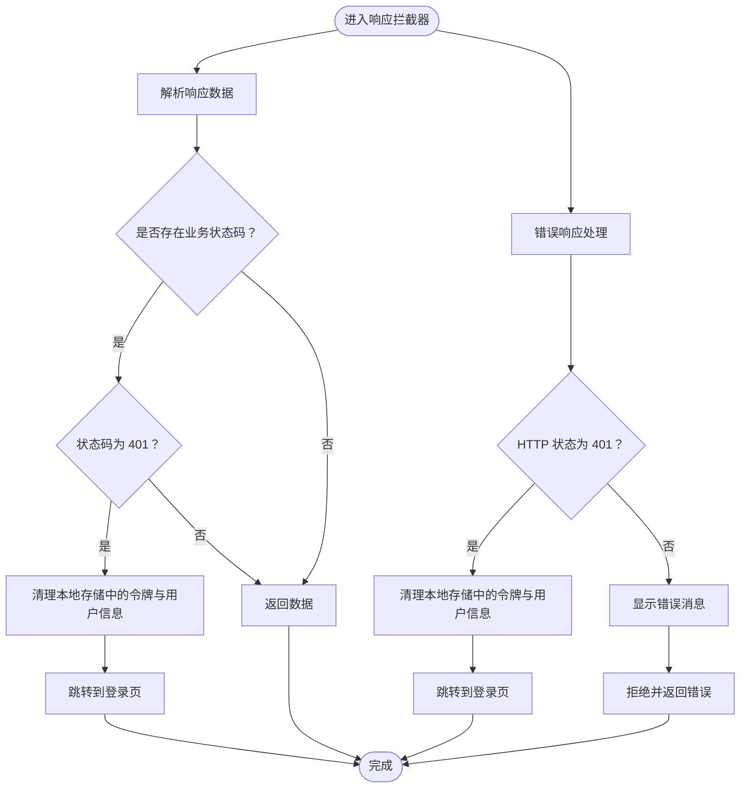
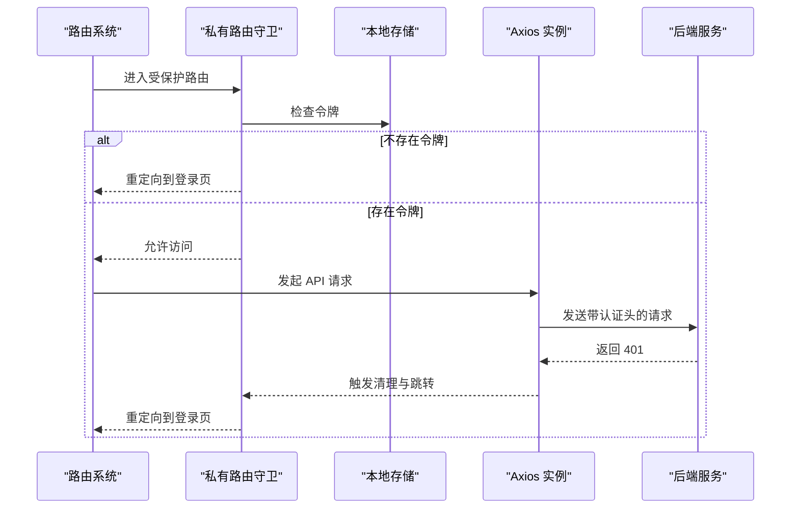
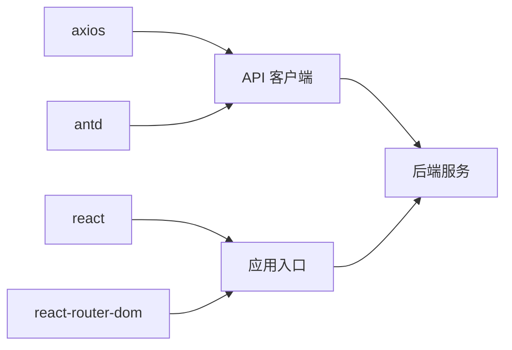

# API 客户端配置

<cite>
**本文档引用的文件**
- [client/src/api/index.js](file://client/src/api/index.js)
- [client/src/main.jsx](file://client/src/main.jsx)
- [client/src/App.jsx](file://client/src/App.jsx)
- [client/package.json](file://client/package.json)
- [server/index.js](file://server/index.js)
- [package.json](file://package.json)
</cite>

## 目录
1. [简介](#简介)
2. [项目结构](#项目结构)
3. [核心组件](#核心组件)
4. [架构概览](#架构概览)
5. [详细组件分析](#详细组件分析)
6. [依赖关系分析](#依赖关系分析)
7. [性能考虑](#性能考虑)
8. [故障排除指南](#故障排除指南)
9. [结论](#结论)

## 简介
本文件详细说明了前端 API 客户端的配置与实现，重点涵盖以下方面：
- Axios 实例的创建与基础配置（基础 URL、超时设置）
- 请求与响应拦截器的工作机制
- 错误处理策略与用户会话管理
- 认证令牌的自动注入流程
- API 调用最佳实践与常见问题排查

该客户端采用单实例 Axios 配置，并通过拦截器统一处理认证与错误，结合前端路由守卫实现会话控制。

## 项目结构
前端项目采用 Vite 构建工具，核心 API 客户端位于 client/src/api/index.js，全局应用入口在 client/src/main.jsx，路由与权限控制在 client/src/App.jsx 中实现。后端服务位于 server/index.js，提供统一的 API 路由与安全中间件。

**图表来源**
- [client/src/api/index.js:1-42](file://client/src/api/index.js#L1-L42)
- [client/src/main.jsx:1-14](file://client/src/main.jsx#L1-L14)
- [client/src/App.jsx:1-67](file://client/src/App.jsx#L1-L67)
- [client/package.json:1-27](file://client/package.json#L1-L27)
- [server/index.js:1-120](file://server/index.js#L1-L120)

**章节来源**
- [client/src/api/index.js:1-42](file://client/src/api/index.js#L1-L42)
- [client/src/main.jsx:1-14](file://client/src/main.jsx#L1-L14)
- [client/src/App.jsx:1-67](file://client/src/App.jsx#L1-L67)
- [client/package.json:1-27](file://client/package.json#L1-L27)
- [server/index.js:1-120](file://server/index.js#L1-L120)

## 核心组件
- Axios 实例与基础配置
  - 基础 URL：/api
  - 超时时间：30 秒
- 请求拦截器
  - 自动从本地存储读取认证令牌并在请求头中添加 Authorization 字段
- 响应拦截器
  - 统一处理业务状态码（如 401）与通用错误提示
  - 对 401 响应执行会话清理与跳转
- 错误处理
  - 使用 Ant Design 的消息组件展示错误信息
  - 将错误对象透传以便上层处理

**章节来源**
- [client/src/api/index.js:4-7](file://client/src/api/index.js#L4-L7)
- [client/src/api/index.js:9-15](file://client/src/api/index.js#L9-L15)
- [client/src/api/index.js:17-39](file://client/src/api/index.js#L17-L39)

## 架构概览
下图展示了从前端 API 客户端到后端服务的整体调用链路，以及拦截器在其中的作用位置。

**图表来源**
- [client/src/api/index.js:9-15](file://client/src/api/index.js#L9-L15)
- [client/src/api/index.js:17-39](file://client/src/api/index.js#L17-L39)
- [server/index.js:68-95](file://server/index.js#L68-L95)

## 详细组件分析

### Axios 实例与基础配置
- 基础 URL：/api
  - 所有 API 请求均以 /api 为前缀，便于与后端路由保持一致
- 超时设置：30000ms
  - 防止长时间挂起影响用户体验
- 默认请求头
  - 通过请求拦截器动态注入 Authorization 头部，避免在创建实例时硬编码

**章节来源**
- [client/src/api/index.js:4-7](file://client/src/api/index.js#L4-L7)

### 请求拦截器
- 功能
  - 从本地存储读取认证令牌
  - 若存在令牌，则在请求头中添加 Authorization: Bearer <token>
  - 返回修改后的配置以继续请求流程
- 设计要点
  - 令牌来源于本地存储，确保跨页面刷新仍可保持认证状态
  - 无令牌时不强制中断请求，交由后端路由决定是否需要认证

**图表来源**
- [client/src/api/index.js:9-15](file://client/src/api/index.js#L9-L15)

**章节来源**
- [client/src/api/index.js:9-15](file://client/src/api/index.js#L9-L15)

### 响应拦截器
- 成功响应处理
  - 解析响应数据
  - 若响应包含业务状态码且非成功值，进行相应处理（例如 401）
  - 返回数据供调用方使用
- 错误响应处理
  - 检测 401 状态码并执行会话清理与跳转
  - 使用消息组件显示错误信息
  - 将错误对象透传给调用方，便于上层捕获与处理

**图表来源**
- [client/src/api/index.js:17-39](file://client/src/api/index.js#L17-L39)

**章节来源**
- [client/src/api/index.js:17-39](file://client/src/api/index.js#L17-L39)

### 会话管理与路由守卫
- 路由守卫
  - 在应用层通过私有路由组件检查本地存储中的令牌
  - 无令牌时重定向至登录页
- 与 API 拦截器的配合
  - 当后端返回 401 或业务状态码为 401 时，API 拦截器会清理本地存储并跳转登录
  - 应用层的路由守卫作为第二道防线，确保未授权访问被阻止

**图表来源**
- [client/src/App.jsx:26-30](file://client/src/App.jsx#L26-L30)
- [client/src/api/index.js:21-25](file://client/src/api/index.js#L21-L25)

**章节来源**
- [client/src/App.jsx:26-30](file://client/src/App.jsx#L26-L30)
- [client/src/api/index.js:21-25](file://client/src/api/index.js#L21-L25)

### 认证令牌的自动注入机制
- 注入时机：每次发起请求前
- 注入方式：从本地存储读取令牌并写入 Authorization 头
- 适用范围：所有通过该 Axios 实例发起的请求
- 注意事项：若本地存储中没有令牌，请求将不携带认证头；具体是否需要认证由后端路由决定

**章节来源**
- [client/src/api/index.js:9-15](file://client/src/api/index.js#L9-L15)

### API 基础 URL、超时与默认请求头
- 基础 URL：/api
  - 与后端路由前缀保持一致，简化调用与维护
- 超时：30000ms
  - 平衡网络稳定性与用户体验
- 默认请求头
  - 通过拦截器动态注入，避免在实例创建时硬编码
  - 可根据需要扩展其他默认头部字段

**章节来源**
- [client/src/api/index.js:4-7](file://client/src/api/index.js#L4-L7)
- [client/src/api/index.js:9-15](file://client/src/api/index.js#L9-L15)

### 错误处理机制
- 业务错误处理
  - 检测响应中的业务状态码（如 401），执行清理与跳转
- 网络错误处理
  - 显示错误消息并拒绝 Promise，便于上层捕获
- 用户体验
  - 使用 Ant Design 的消息组件统一提示错误信息

**章节来源**
- [client/src/api/index.js:17-39](file://client/src/api/index.js#L17-L39)

## 依赖关系分析
- 前端依赖
  - axios：用于 HTTP 请求与拦截器
  - antd：提供消息组件用于错误提示
  - react/react-router-dom：路由与页面渲染
- 构建与运行
  - Vite：开发与构建工具
  - 项目根脚本负责安装前后端依赖并启动服务

**图表来源**
- [client/package.json:11-21](file://client/package.json#L11-L21)
- [client/src/api/index.js:1-2](file://client/src/api/index.js#L1-L2)
- [client/src/main.jsx:1-14](file://client/src/main.jsx#L1-L14)
- [client/src/App.jsx:1-67](file://client/src/App.jsx#L1-L67)

**章节来源**
- [client/package.json:11-21](file://client/package.json#L11-L21)
- [package.json:5-8](file://package.json#L5-L8)

## 性能考虑
- 超时设置
  - 30 秒的超时有助于及时发现网络异常，避免长时间等待
- 请求头注入
  - 仅在需要时添加认证头，减少不必要的头部开销
- 错误快速失败
  - 对 401 等明确错误立即处理，避免无效重试
- 建议优化
  - 对高频请求可考虑缓存策略（需结合业务场景）
  - 合理设置后端限流参数，避免前端频繁重试导致压力放大

## 故障排除指南
- 无法登录或频繁被重定向到登录页
  - 检查本地存储中是否存在有效的令牌
  - 确认后端返回的业务状态码是否正确处理
- 请求超时
  - 检查网络连接与后端服务状态
  - 调整超时阈值以适应网络环境
- 401 未被正确处理
  - 确认响应拦截器逻辑是否生效
  - 检查后端是否返回正确的状态码与消息
- 错误信息未显示
  - 确认 Ant Design 消息组件可用性
  - 检查错误对象结构是否符合预期

**章节来源**
- [client/src/api/index.js:17-39](file://client/src/api/index.js#L17-L39)
- [client/src/App.jsx:26-30](file://client/src/App.jsx#L26-L30)

## 结论
本 API 客户端通过统一的 Axios 实例与拦截器实现了认证令牌的自动注入、错误的集中处理与会话的统一管理。结合前端路由守卫，形成了完整的权限控制闭环。建议在后续迭代中进一步完善错误分类与提示策略，并根据业务需求扩展默认请求头与缓存机制。