# React 应用架构

<cite>
**本文档引用的文件**
- [main.jsx](file://client/src/main.jsx)
- [App.jsx](file://client/src/App.jsx)
- [index.css](file://client/src/index.css)
- [theme.js](file://client/src/theme.js)
- [AdminLayout.jsx](file://client/src/layouts/AdminLayout.jsx)
- [UserLayout.jsx](file://client/src/layouts/UserLayout.jsx)
- [Login.jsx](file://client/src/pages/Login.jsx)
- [api/index.js](file://client/src/api/index.js)
- [Dashboard.jsx (管理员)](file://client/src/pages/admin/Dashboard.jsx)
- [Dashboard.jsx (用户)](file://client/src/pages/user/Dashboard.jsx)
- [package.json](file://client/package.json)
- [vite.config.js](file://client/vite.config.js)
- [index.html](file://client/index.html)
</cite>

## 目录
1. [简介](#简介)
2. [项目结构](#项目结构)
3. [核心组件](#核心组件)
4. [架构概览](#架构概览)
5. [详细组件分析](#详细组件分析)
6. [依赖关系分析](#依赖关系分析)
7. [性能考虑](#性能考虑)
8. [故障排除指南](#故障排除指南)
9. [结论](#结论)
10. [附录](#附录)

## 简介

这是一个基于 React 19 和 Ant Design 的企业级会计管理系统前端应用。该应用采用现代化的前端技术栈，实现了完整的权限控制、响应式布局和数据可视化功能。系统支持管理员和普通用户两种角色，提供商品管理、库存管理、财务统计等核心业务功能。

## 项目结构

该项目采用模块化的目录结构，按照功能域进行组织：

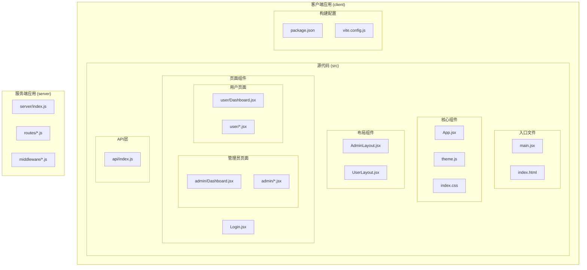

**图表来源**
- [main.jsx:1-14](file://client/src/main.jsx#L1-L14)
- [App.jsx:1-67](file://client/src/App.jsx#L1-L67)
- [AdminLayout.jsx:1-174](file://client/src/layouts/AdminLayout.jsx#L1-L174)
- [UserLayout.jsx:1-162](file://client/src/layouts/UserLayout.jsx#L1-L162)

**章节来源**
- [package.json:1-27](file://client/package.json#L1-L27)
- [vite.config.js:1-20](file://client/vite.config.js#L1-L20)

## 核心组件

### 应用入口与初始化

应用的启动流程从入口文件开始，经过多层组件包装最终渲染到 DOM 中：

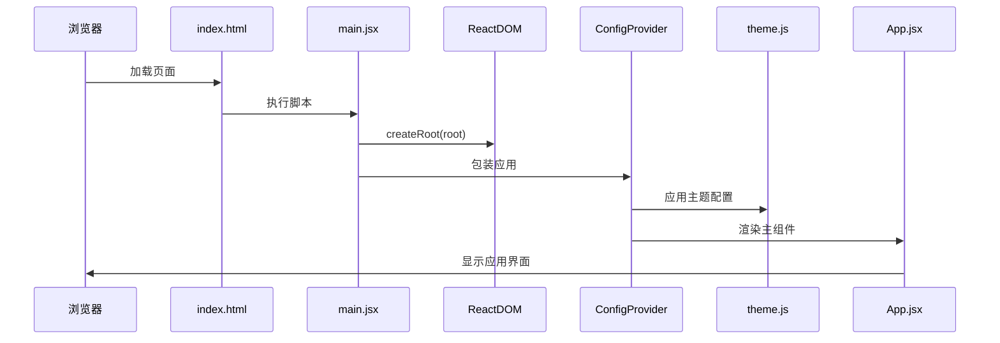

**图表来源**
- [main.jsx:9-13](file://client/src/main.jsx#L9-L13)
- [theme.js:1-61](file://client/src/theme.js#L1-L61)

### 路由系统设计

应用采用嵌套路由设计，支持两种不同的布局模式：

```mermaid
flowchart TD
Root[根路由] --> Login[/login]
Root --> AdminRoute[管理员路由 /admin]
Root --> UserRoute[用户路由 /user]
AdminRoute --> AdminLayout[AdminLayout]
AdminLayout --> AdminIndex[首页工作台]
AdminLayout --> AdminSettings[系统设置]
AdminLayout --> AdminUsers[账号管理]
AdminLayout --> AdminProducts[商品管理]
AdminLayout --> AdminStockIn[商品入库]
AdminLayout --> AdminStockOut[商品出库]
AdminLayout --> AdminWarehouses[库房管理]
AdminLayout --> AdminExpenses[日常开销]
AdminLayout --> AdminDataCenter[数据中心]
UserRoute --> UserLayout[UserLayout]
UserLayout --> UserIndex[首页工作台]
UserLayout --> UserPassword[修改密码]
UserLayout --> UserProducts[商品列表]
UserLayout --> UserStockIn[商品入库]
UserLayout --> UserStockOut[商品出库]
UserLayout --> UserWarehouses[库房列表]
UserLayout --> UserExpenses[开销列表]
UserLayout --> UserDataCenter[数据中心]
Root --> NotFound[* 未找到]
```

**图表来源**
- [App.jsx:32-64](file://client/src/App.jsx#L32-L64)

**章节来源**
- [App.jsx:1-67](file://client/src/App.jsx#L1-L67)

## 架构概览

### 技术栈架构

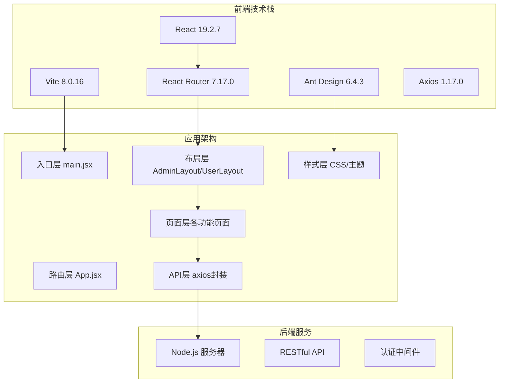

**图表来源**
- [package.json:11-21](file://client/package.json#L11-L21)
- [main.jsx:1-7](file://client/src/main.jsx#L1-L7)

### 数据流架构

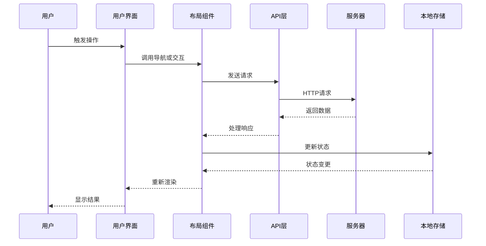

**图表来源**
- [api/index.js:4-39](file://client/src/api/index.js#L4-L39)
- [AdminLayout.jsx:49-55](file://client/src/layouts/AdminLayout.jsx#L49-L55)

## 详细组件分析

### 主应用组件 (App.jsx)

App.jsx 是整个应用的核心路由容器，实现了以下关键功能：

#### 路由配置模式

应用采用嵌套路由设计，通过 `PrivateRoute` 实现权限控制：

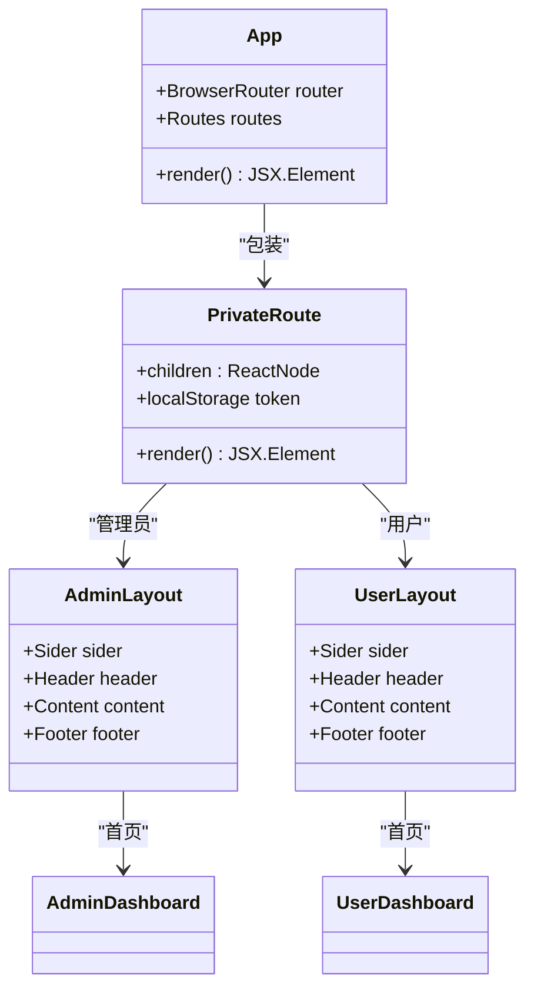

**图表来源**
- [App.jsx:26-30](file://client/src/App.jsx#L26-L30)
- [AdminLayout.jsx:16-173](file://client/src/layouts/AdminLayout.jsx#L16-L173)
- [UserLayout.jsx:16-161](file://client/src/layouts/UserLayout.jsx#L16-L161)

#### 权限控制机制

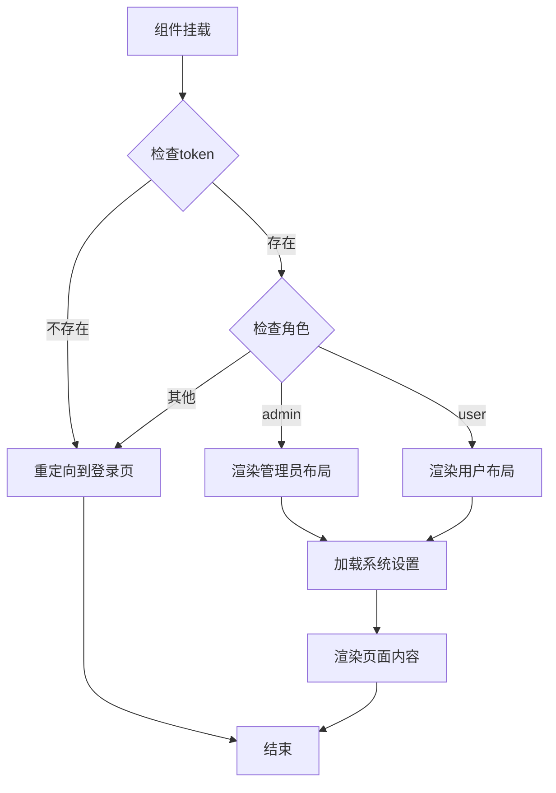

**图表来源**
- [App.jsx:26-30](file://client/src/App.jsx#L26-L30)
- [AdminLayout.jsx:35-42](file://client/src/layouts/AdminLayout.jsx#L35-L42)
- [UserLayout.jsx:34-41](file://client/src/layouts/UserLayout.jsx#L34-L41)

**章节来源**
- [App.jsx:26-64](file://client/src/App.jsx#L26-L64)

### 布局系统设计

#### 管理员布局 (AdminLayout.jsx)

管理员布局实现了复杂的响应式设计和权限控制：

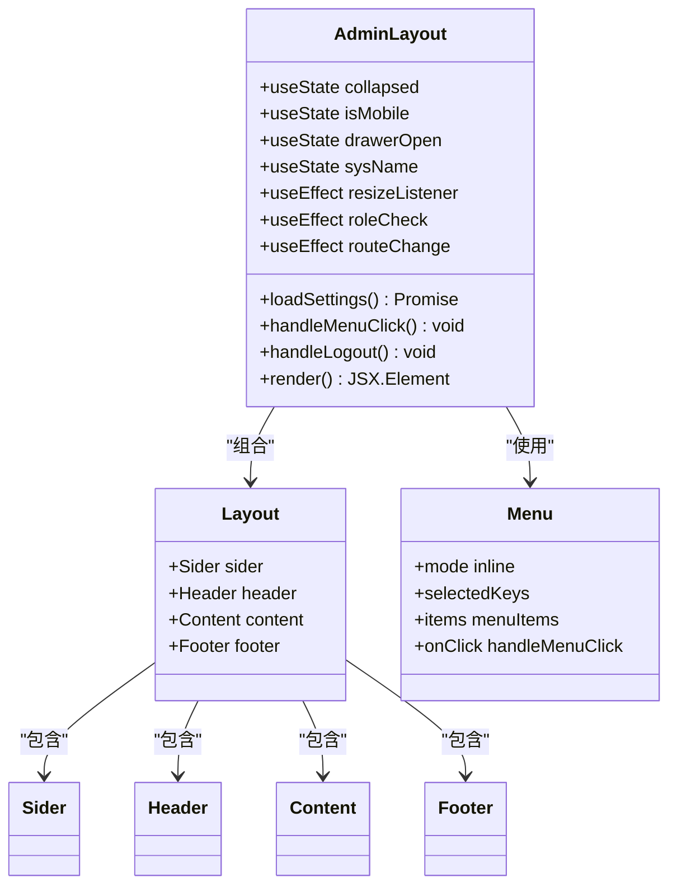

**图表来源**
- [AdminLayout.jsx:16-173](file://client/src/layouts/AdminLayout.jsx#L16-L173)

#### 用户布局 (UserLayout.jsx)

用户布局与管理员布局类似，但菜单项和功能权限不同：

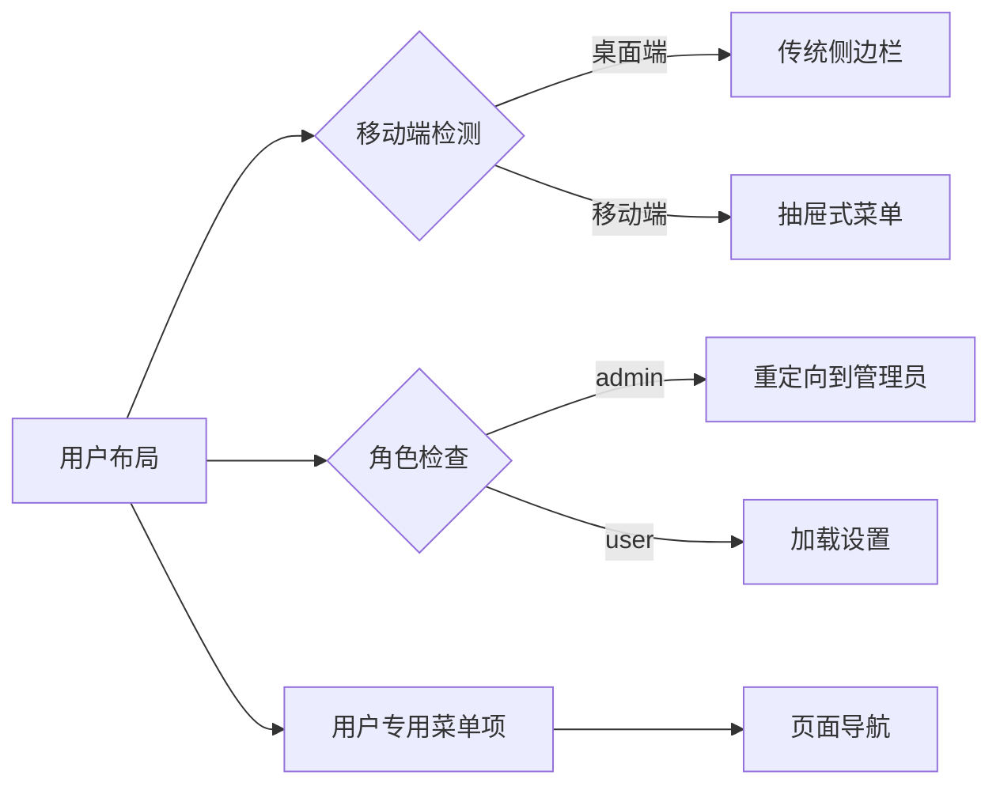

**图表来源**
- [UserLayout.jsx:16-76](file://client/src/layouts/UserLayout.jsx#L16-L76)

**章节来源**
- [AdminLayout.jsx:1-174](file://client/src/layouts/AdminLayout.jsx#L1-L174)
- [UserLayout.jsx:1-162](file://client/src/layouts/UserLayout.jsx#L1-L162)

### 登录认证系统

登录组件实现了完整的用户认证流程：

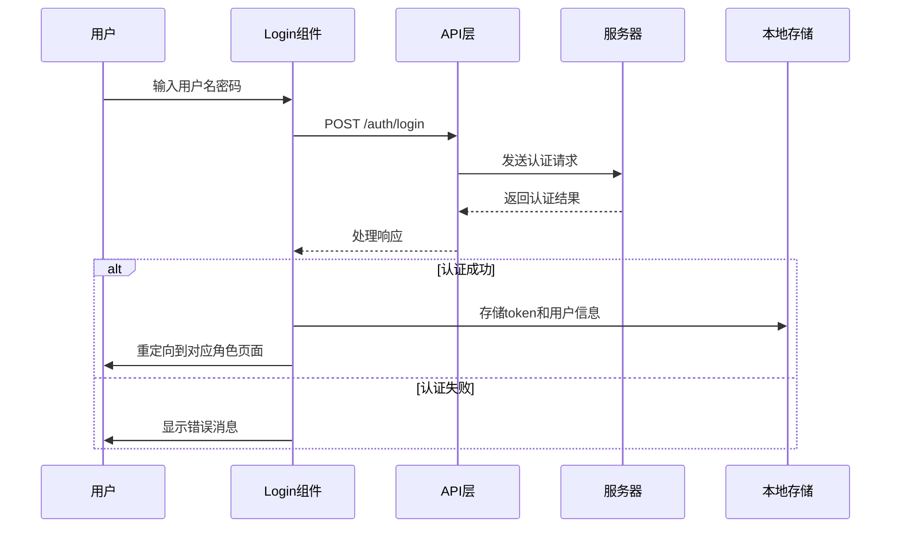

**图表来源**
- [Login.jsx:27-43](file://client/src/pages/Login.jsx#L27-L43)
- [api/index.js:17-39](file://client/src/api/index.js#L17-L39)

**章节来源**
- [Login.jsx:1-68](file://client/src/pages/Login.jsx#L1-L68)

### API 通信层

API 层提供了统一的 HTTP 通信接口和拦截器：

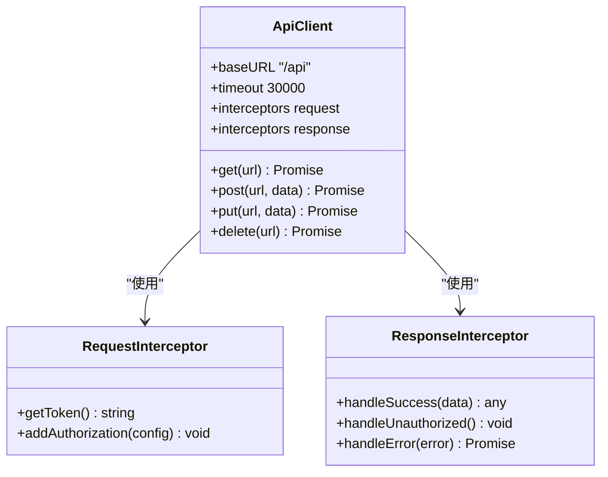

**图表来源**
- [api/index.js:4-39](file://client/src/api/index.js#L4-L39)

**章节来源**
- [api/index.js:1-42](file://client/src/api/index.js#L1-L42)

### 样式系统架构

#### 全局样式组织

应用采用了模块化的 CSS 架构：

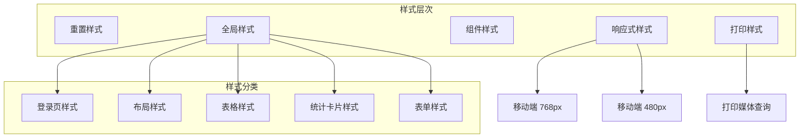

**图表来源**
- [index.css:1-447](file://client/src/index.css#L1-L447)

#### 主题系统设计

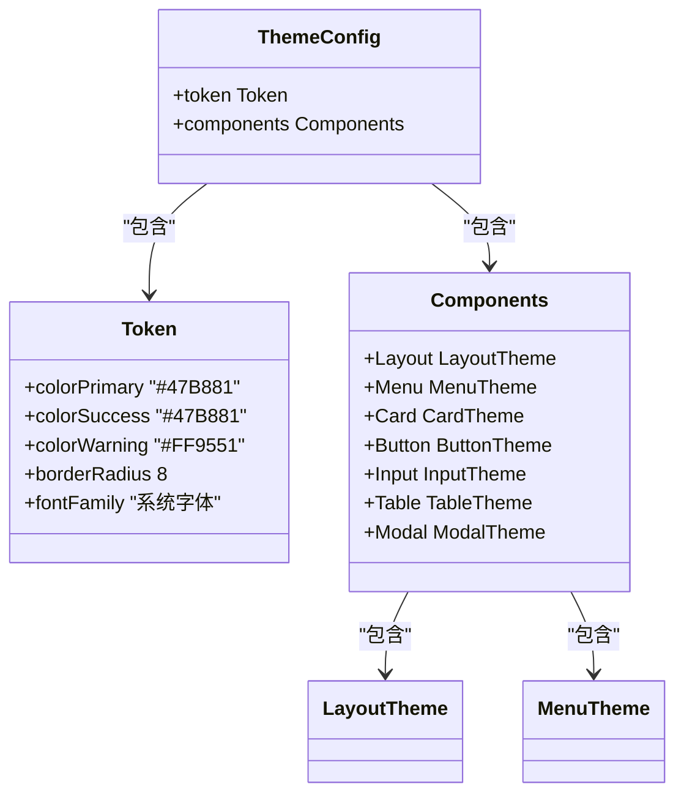

**图表来源**
- [theme.js:1-61](file://client/src/theme.js#L1-L61)

**章节来源**
- [index.css:1-447](file://client/src/index.css#L1-L447)
- [theme.js:1-61](file://client/src/theme.js#L1-L61)

## 依赖关系分析

### 外部依赖关系

```mermaid
graph TB
subgraph "核心依赖"
React[react@19.2.7]
ReactDOM[react-dom@19.2.7]
Router[react-router-dom@7.17.0]
Antd[antd@6.4.3]
Axios[axios@1.17.0]
end
subgraph "开发依赖"
Vite[vite@8.0.16]
ReactPlugin[@vitejs/plugin-react@6.0.2]
end
subgraph "工具依赖"
Dayjs[dayjs@1.11.21]
Recharts[recharts@3.8.1]
Icons[@ant-design/icons@6.2.5]
XLSX[xlsx@0.18.5]
end
React --> ReactDOM
React --> Router
Router --> Antd
Antd --> Axios
Vite --> ReactPlugin
```

**图表来源**
- [package.json:11-21](file://client/package.json#L11-L21)

### 内部模块依赖

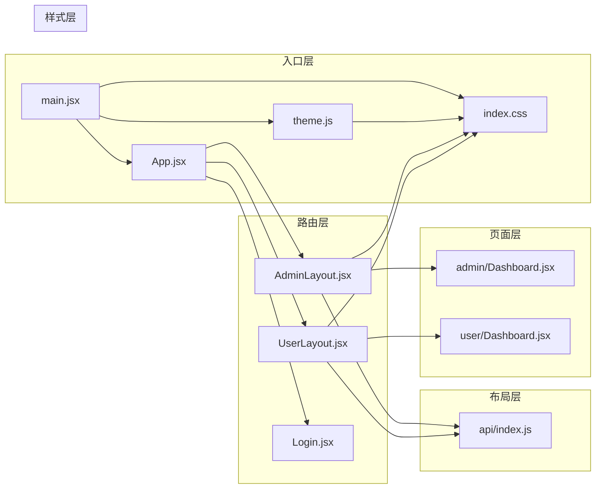

**图表来源**
- [main.jsx:1-7](file://client/src/main.jsx#L1-L7)
- [App.jsx:1-25](file://client/src/App.jsx#L1-L25)

**章节来源**
- [package.json:1-27](file://client/package.json#L1-L27)

## 性能考虑

### 渲染优化策略

1. **懒加载组件**: 将大型页面组件按需加载，减少初始包体积
2. **虚拟滚动**: 对大量数据列表使用虚拟滚动技术
3. **图片优化**: 使用现代格式和适当的尺寸
4. **缓存策略**: 合理使用浏览器缓存和内存缓存

### 网络性能优化

1. **请求合并**: 将多个小请求合并为批量请求
2. **防抖节流**: 对频繁触发的操作使用防抖节流
3. **增量更新**: 使用增量数据更新而非全量刷新
4. **CDN加速**: 静态资源使用 CDN 分发

### 内存管理

1. **事件监听器清理**: 在组件卸载时清理事件监听器
2. **定时器清理**: 及时清理定时器和动画帧
3. **大对象处理**: 对大数据对象使用分块处理
4. **垃圾回收**: 避免内存泄漏的常见模式

## 故障排除指南

### 常见问题诊断

#### 登录认证问题

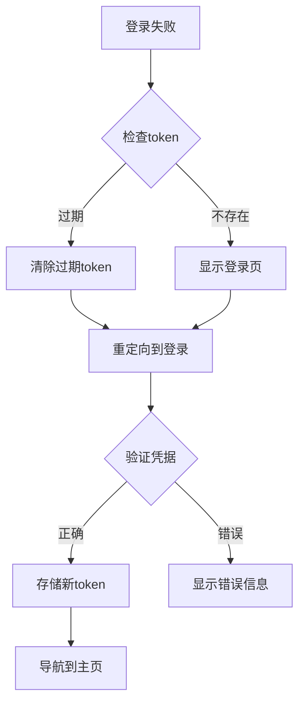

**图表来源**
- [api/index.js:21-25](file://client/src/api/index.js#L21-L25)
- [Login.jsx:36-38](file://client/src/pages/Login.jsx#L36-L38)

#### 响应式布局问题

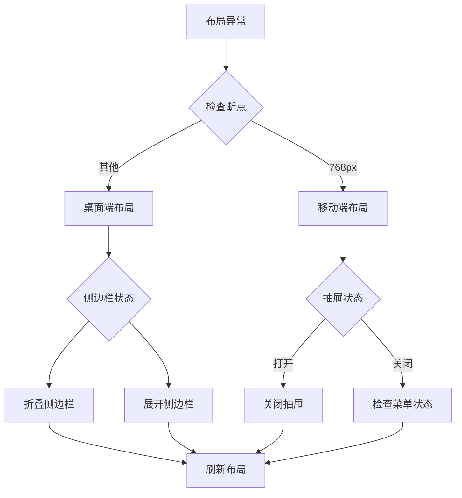

**图表来源**
- [AdminLayout.jsx:14-34](file://client/src/layouts/AdminLayout.jsx#L14-L34)
- [UserLayout.jsx:14-33](file://client/src/layouts/UserLayout.jsx#L14-L33)

**章节来源**
- [api/index.js:17-39](file://client/src/api/index.js#L17-L39)
- [AdminLayout.jsx:25-47](file://client/src/layouts/AdminLayout.jsx#L25-L47)

## 结论

该 React 应用展现了现代前端开发的最佳实践，具有以下特点：

1. **清晰的架构设计**: 采用模块化和组件化的设计原则
2. **完善的权限体系**: 支持多角色访问控制和路由保护
3. **优秀的用户体验**: 响应式设计和流畅的交互体验
4. **可维护性**: 良好的代码组织和文档化
5. **扩展性强**: 模块化架构便于功能扩展

建议在后续开发中重点关注：
- 性能监控和优化
- 单元测试覆盖率提升
- 错误边界和异常处理完善
- 开发工具链的持续改进

## 附录

### React 19 新特性使用指南

#### 并发特性
- 使用 `useId` 生成稳定的 ID
- 利用 `useTransition` 提升用户体验
- 优化长任务的执行策略

#### Hooks 最佳实践
- 合理使用 `useMemo` 和 `useCallback`
- 避免不必要的重新渲染
- 正确处理异步状态更新

#### 类组件迁移
- 逐步迁移到函数组件
- 使用现代 Hooks 替代生命周期方法
- 保持向后兼容性

### 样式组织最佳实践

#### CSS Modules
- 使用模块化 CSS 避免命名冲突
- 采用 BEM 命名约定
- 组件级别的样式隔离

#### 主题定制
- 使用 CSS 变量实现动态主题
- 支持深色模式切换
- 响应式字体和间距系统

### API 设计规范

#### 请求规范
- 统一的错误处理机制
- 请求超时和重试策略
- 缓存策略和数据同步

#### 安全考虑
- CSRF 保护和 XSS 防护
- 敏感数据加密传输
- 权限验证和授权控制