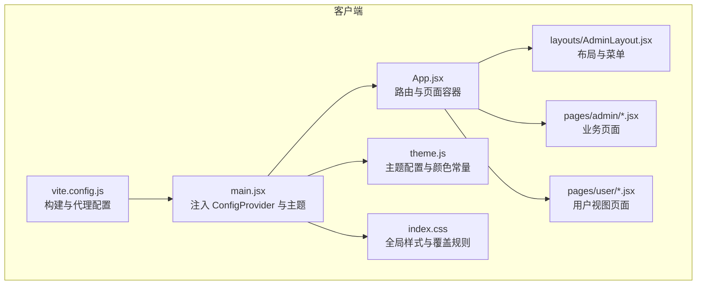
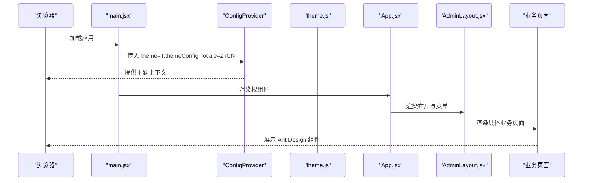
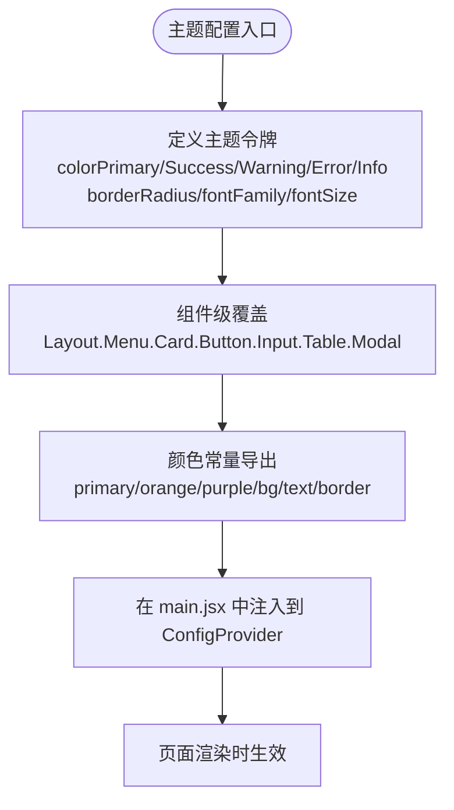
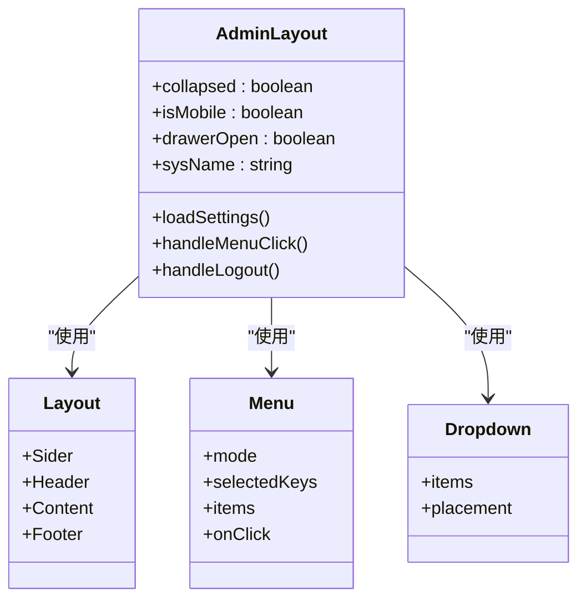
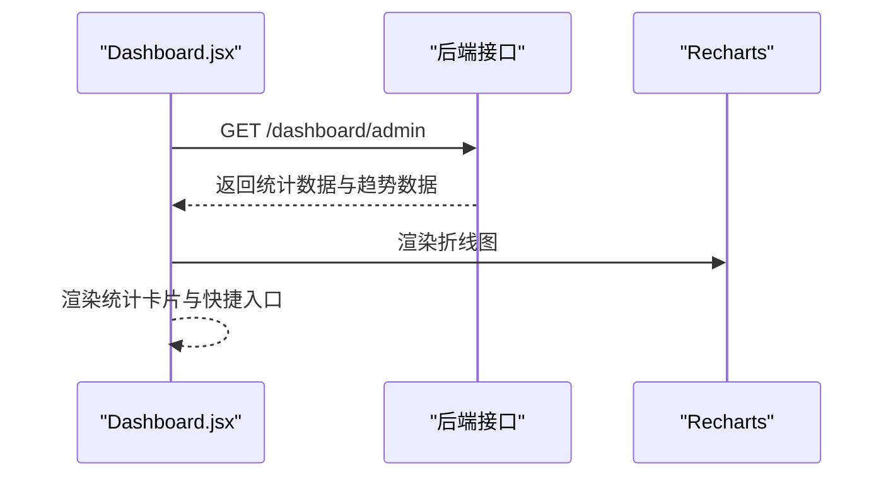
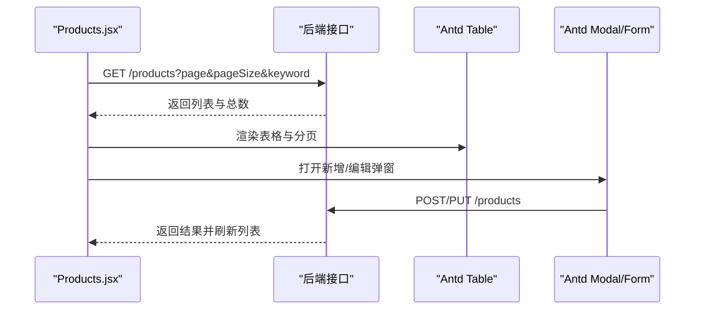
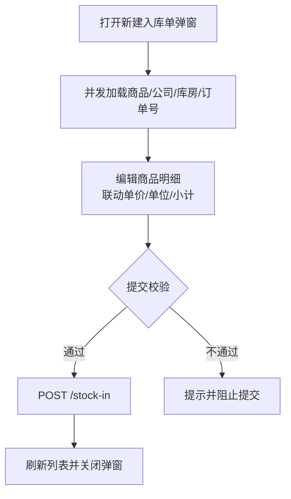
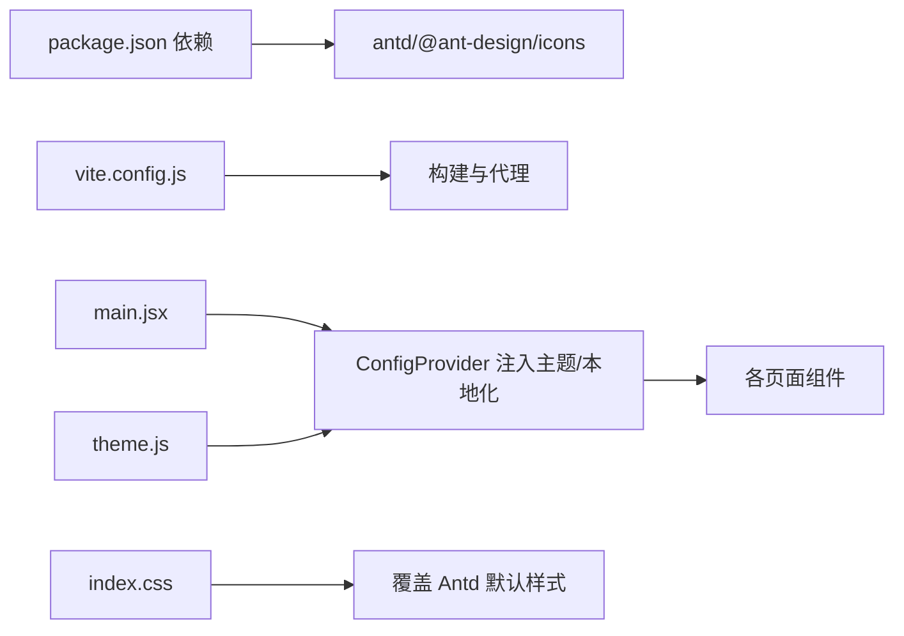

# UI 组件库集成

<cite>
**本文引用的文件**
- [package.json](file://client/package.json)
- [vite.config.js](file://client/vite.config.js)
- [main.jsx](file://client/src/main.jsx)
- [theme.js](file://client/src/theme.js)
- [index.css](file://client/src/index.css)
- [App.jsx](file://client/src/App.jsx)
- [AdminLayout.jsx](file://client/src/layouts/AdminLayout.jsx)
- [Dashboard.jsx](file://client/src/pages/admin/Dashboard.jsx)
- [Products.jsx](file://client/src/pages/admin/Products.jsx)
- [StockIn.jsx](file://client/src/pages/admin/StockIn.jsx)
- [StockOut.jsx](file://client/src/pages/admin/StockOut.jsx)
- [ProductList.jsx](file://client/src/pages/user/ProductList.jsx)
</cite>

## 目录
1. [简介](#简介)
2. [项目结构](#项目结构)
3. [核心组件](#核心组件)
4. [架构总览](#架构总览)
5. [详细组件分析](#详细组件分析)
6. [依赖关系分析](#依赖关系分析)
7. [性能考虑](#性能考虑)
8. [故障排查指南](#故障排查指南)
9. [结论](#结论)
10. [附录](#附录)

## 简介
本文件面向 UI 组件库集成，围绕 Ant Design 在本项目的配置与定制展开，重点包括：
- 主题变量的设置与应用
- 样式覆盖策略与 CSS 优先级管理
- 自定义主题的实现方法（颜色系统、字体配置、组件样式）
- 与 React 应用的集成方式与性能优化
- 组件使用示例与最佳实践

## 项目结构
客户端采用 Vite 构建，Ant Design 作为主要 UI 组件库，通过 ConfigProvider 注入全局主题与本地化；页面组件广泛使用 Ant Design 的布局、表单、表格、模态框等组件。

**图表来源**
- [main.jsx:1-14](file://client/src/main.jsx#L1-L14)
- [App.jsx:1-67](file://client/src/App.jsx#L1-L67)
- [AdminLayout.jsx:1-174](file://client/src/layouts/AdminLayout.jsx#L1-L174)
- [theme.js:1-61](file://client/src/theme.js#L1-L61)
- [index.css:1-447](file://client/src/index.css#L1-L447)
- [vite.config.js:1-20](file://client/vite.config.js#L1-L20)

**章节来源**
- [package.json:1-27](file://client/package.json#L1-L27)
- [vite.config.js:1-20](file://client/vite.config.js#L1-L20)
- [main.jsx:1-14](file://client/src/main.jsx#L1-L14)
- [App.jsx:1-67](file://client/src/App.jsx#L1-L67)

## 核心组件
- 主题配置与颜色系统
  - 使用主题令牌与组件级覆盖统一管理视觉风格，确保全局一致性与可维护性。
- 布局与导航
  - 基于 Layout、Menu、Dropdown、Button 等组件构建桌面端与移动端适配的侧边栏/抽屉导航。
- 数据展示与交互
  - Table、Modal、Form、Space、Tag 等组合实现数据列表、表单编辑、详情弹窗与批量操作。
- 全局样式与覆盖
  - 通过 index.css 对 Ant Design 组件默认样式进行补充与覆盖，保证品牌风格一致。

**章节来源**
- [theme.js:1-61](file://client/src/theme.js#L1-L61)
- [AdminLayout.jsx:1-174](file://client/src/layouts/AdminLayout.jsx#L1-L174)
- [Products.jsx:1-134](file://client/src/pages/admin/Products.jsx#L1-L134)
- [StockIn.jsx:1-432](file://client/src/pages/admin/StockIn.jsx#L1-L432)
- [StockOut.jsx:1-390](file://client/src/pages/admin/StockOut.jsx#L1-L390)
- [ProductList.jsx:1-221](file://client/src/pages/user/ProductList.jsx#L1-L221)
- [index.css:1-447](file://client/src/index.css#L1-L447)

## 架构总览
Ant Design 在本项目中的集成路径如下：
- 在入口文件中通过 ConfigProvider 注入主题与本地化
- 顶层 App 组织路由与页面容器
- 布局组件负责导航与内容区组织
- 各业务页面直接使用 Ant Design 组件完成数据处理与交互

**图表来源**
- [main.jsx:1-14](file://client/src/main.jsx#L1-L14)
- [theme.js:1-61](file://client/src/theme.js#L1-L61)
- [App.jsx:1-67](file://client/src/App.jsx#L1-L67)
- [AdminLayout.jsx:1-174](file://client/src/layouts/AdminLayout.jsx#L1-L174)

## 详细组件分析

### 主题配置与定制
- 主题令牌（token）
  - 定义主色、成功/警告/错误/信息色、圆角半径、背景色、字体与字号等基础视觉参数。
- 组件级覆盖（components.*）
  - 针对 Layout、Menu、Card、Button、Input、Table、Modal 等组件设置特定样式，如侧边栏背景、菜单选中/悬停态、卡片圆角、表格头部背景等。
- 颜色常量（colors）
  - 提供品牌色与辅助色的集中定义，便于在页面样式中复用，避免硬编码。

**图表来源**
- [theme.js:1-61](file://client/src/theme.js#L1-L61)
- [main.jsx:1-14](file://client/src/main.jsx#L1-L14)

**章节来源**
- [theme.js:1-61](file://client/src/theme.js#L1-L61)
- [main.jsx:1-14](file://client/src/main.jsx#L1-L14)

### 布局与导航（AdminLayout）
- 功能要点
  - 响应式设计：桌面端使用 Sider，移动端使用 Drawer；根据窗口宽度切换。
  - 导航菜单：基于 Ant Design Menu，支持选中态与点击跳转。
  - 用户信息：Dropdown 下拉菜单提供退出登录等操作。
  - 设置加载：从接口获取系统名称并更新页面标题。
- 样式覆盖
  - 通过 className 与内联样式配合 index.css 中的类选择器，控制边框、阴影、背景与层级。

**图表来源**
- [AdminLayout.jsx:1-174](file://client/src/layouts/AdminLayout.jsx#L1-L174)

**章节来源**
- [AdminLayout.jsx:1-174](file://client/src/layouts/AdminLayout.jsx#L1-L174)
- [index.css:78-118](file://client/src/index.css#L78-L118)

### 数据展示与交互（Dashboard）
- 统计卡片与快捷入口：使用 Card、Row、Col、Statistic、Space 等组合展示关键指标与快速跳转。
- 图表集成：结合 Recharts 实现趋势图，响应式容器适配不同屏幕尺寸。
- 操作记录：以气泡条目形式展示最近操作，支持标签分类与时间显示。

**图表来源**
- [Dashboard.jsx:1-123](file://client/src/pages/admin/Dashboard.jsx#L1-L123)

**章节来源**
- [Dashboard.jsx:1-123](file://client/src/pages/admin/Dashboard.jsx#L1-L123)

### 商品管理（Products）
- 列表与分页：Table 展示商品信息，支持关键词搜索与分页。
- 表单与弹窗：Modal 承载新增/编辑表单，Form.Item 定义字段校验与默认值。
- 详情弹窗：Modal 展示商品基础信息、当前库存、单价与库房分布。
- 操作：支持查看详情、修改、删除（带二次确认），并结合消息提示反馈结果。

**图表来源**
- [Products.jsx:1-134](file://client/src/pages/admin/Products.jsx#L1-L134)

**章节来源**
- [Products.jsx:1-134](file://client/src/pages/admin/Products.jsx#L1-L134)

### 入库流程（StockIn）
- 单据信息：订单号、建单时间、供货公司、目标库房。
- 商品明细：动态增删行，联动单价与单位，实时计算小计与合计。
- 详情与打印：订单详情弹窗展示明细与合计；打印预览通过克隆 DOM 区域实现。
- 自动创建：支持通过输入自动创建“公司/库房”，并即时更新下拉选项。

**图表来源**
- [StockIn.jsx:1-432](file://client/src/pages/admin/StockIn.jsx#L1-L432)

**章节来源**
- [StockIn.jsx:1-432](file://client/src/pages/admin/StockIn.jsx#L1-L432)

### 出库流程（StockOut）
- 单据信息：订单号、建单时间、客户单位、出货库房。
- 库存联动：选择库房后按商品维度加载库存，辅助出库决策。
- 商品明细：动态增删行，实时计算小计与合计。
- 详情与打印：订单详情弹窗与打印预览同入库流程。

**章节来源**
- [StockOut.jsx:1-390](file://client/src/pages/admin/StockOut.jsx#L1-L390)

### 用户视图（ProductList）
- 商品列表：支持搜索、分页与操作（查看详情、入库、出库）。
- 快捷操作：针对单个商品打开入库/出库弹窗，自动填充单位与单价。
- 详情弹窗：展示基础信息、当前库存、单价与库房分布。

**章节来源**
- [ProductList.jsx:1-221](file://client/src/pages/user/ProductList.jsx#L1-L221)

## 依赖关系分析
- 组件库与工具链
  - 依赖 antd 与 @ant-design/icons，构建工具为 Vite。
- 运行时注入
  - 在入口文件中通过 ConfigProvider 注入主题与本地化，影响全局组件渲染。
- 样式覆盖
  - index.css 通过类选择器覆盖 Antd 默认样式，注意 CSS 优先级与作用域。

**图表来源**
- [package.json:1-27](file://client/package.json#L1-L27)
- [vite.config.js:1-20](file://client/vite.config.js#L1-L20)
- [main.jsx:1-14](file://client/src/main.jsx#L1-L14)
- [theme.js:1-61](file://client/src/theme.js#L1-L61)
- [index.css:1-447](file://client/src/index.css#L1-L447)

**章节来源**
- [package.json:1-27](file://client/package.json#L1-L27)
- [vite.config.js:1-20](file://client/vite.config.js#L1-L20)
- [main.jsx:1-14](file://client/src/main.jsx#L1-L14)
- [index.css:1-447](file://client/src/index.css#L1-L447)

## 性能考虑
- 按需加载与懒加载
  - 页面组件按路由拆分，减少首屏体积；图标组件通过 @ant-design/icons 按需引入。
- 表格与弹窗
  - 大表格启用横向滚动与分页；弹窗按需打开，销毁时清理状态，避免内存泄漏。
- 主题与样式
  - 将主题集中配置，避免重复覆盖；合理使用 className 与内联样式，减少不必要的重排。
- 构建优化
  - Vite 默认开启压缩与模块预打包；代理仅在开发环境生效，生产环境通过服务端配置。

**章节来源**
- [package.json:11-21](file://client/package.json#L11-L21)
- [vite.config.js:1-20](file://client/vite.config.js#L1-L20)
- [Products.jsx:71-72](file://client/src/pages/admin/Products.jsx#L71-L72)
- [StockIn.jsx:210-211](file://client/src/pages/admin/StockIn.jsx#L210-L211)
- [StockOut.jsx:196-197](file://client/src/pages/admin/StockOut.jsx#L196-L197)

## 故障排查指南
- 主题不生效
  - 确认 ConfigProvider 已包裹根组件且 theme 与 locale 正确传入。
  - 检查主题配置是否包含 token 与 components 字段，组件级覆盖键名是否匹配。
- 样式被覆盖
  - 检查 index.css 中的选择器优先级，必要时使用更具体的选择器或 !important（谨慎使用）。
  - 避免在组件内使用内联样式覆盖全局主题，优先通过主题配置与 CSS 类管理。
- 响应式异常
  - 确认移动端断点逻辑与媒体查询生效；检查 Antd 组件在小屏下的行为（如 Modal 最大宽度、Table 横向滚动）。
- 表单与弹窗问题
  - 表单校验失败时检查 Form.Item 的 rules 与字段名；弹窗关闭后及时 resetFields 或 destroyOnClose。
- 打印功能
  - 确保打印预览区域的 DOM 结构完整，打印时仅显示指定区域。

**章节来源**
- [main.jsx:1-14](file://client/src/main.jsx#L1-L14)
- [theme.js:1-61](file://client/src/theme.js#L1-L61)
- [index.css:291-404](file://client/src/index.css#L291-L404)
- [Products.jsx:33-38](file://client/src/pages/admin/Products.jsx#L33-L38)
- [StockIn.jsx:138-149](file://client/src/pages/admin/StockIn.jsx#L138-L149)
- [StockOut.jsx:121-132](file://client/src/pages/admin/StockOut.jsx#L121-L132)

## 结论
本项目通过 ConfigProvider 将 Ant Design 主题与本地化统一注入至应用，结合集中式主题配置与 CSS 覆盖策略，实现了品牌风格的一致性与可维护性。页面层广泛使用 Antd 组件完成数据展示与交互，并通过响应式布局与打印能力提升用户体验。建议在后续迭代中持续沉淀主题变量与通用样式，完善组件封装与测试，进一步提升开发效率与稳定性。

## 附录
- 组件使用示例与最佳实践
  - 主题注入：在入口文件统一注入 ConfigProvider，避免分散配置。
  - 颜色复用：优先使用 theme.js 中的颜色常量，减少硬编码。
  - 表单设计：使用 Antd Form 与校验规则，结合 Modal 承载复杂表单。
  - 表格设计：启用分页与横向滚动，合理设置列宽与摘要行。
  - 响应式设计：利用媒体查询与 Antd 组件属性，适配移动端体验。
  - 打印设计：通过克隆 DOM 区域实现打印预览，确保打印内容清晰完整。