# 前端应用

<cite>
**本文引用的文件**
- [main.jsx](file://client/src/main.jsx)
- [App.jsx](file://client/src/App.jsx)
- [theme.js](file://client/src/theme.js)
- [api/index.js](file://client/src/api/index.js)
- [AdminLayout.jsx](file://client/src/layouts/AdminLayout.jsx)
- [UserLayout.jsx](file://client/src/layouts/UserLayout.jsx)
- [Login.jsx](file://client/src/pages/Login.jsx)
- [admin/Dashboard.jsx](file://client/src/pages/admin/Dashboard.jsx)
- [user/Dashboard.jsx](file://client/src/pages/user/Dashboard.jsx)
- [admin/Products.jsx](file://client/src/pages/admin/Products.jsx)
- [user/ProductList.jsx](file://client/src/pages/user/ProductList.jsx)
- [index.css](file://client/src/index.css)
- [vite.config.js](file://client/vite.config.js)
- [package.json](file://client/package.json)
- [package.json](file://package.json)
- [render.yaml](file://render.yaml)
</cite>

## 目录
1. [引言](#引言)
2. [项目结构](#项目结构)
3. [核心组件](#核心组件)
4. [架构总览](#架构总览)
5. [详细组件分析](#详细组件分析)
6. [依赖关系分析](#依赖关系分析)
7. [Node.js v26 兼容性改进](#nodejs-v26-兼容性改进)
8. [性能考量](#性能考量)
9. [故障排查指南](#故障排查指南)
10. [结论](#结论)
11. [附录](#附录)

## 引言
本文件为 SY-Q 前端应用的综合技术文档，面向开发者与产品人员，系统性阐述基于 React 19 的前端架构设计，涵盖组件层次、路由体系、状态管理策略、管理员与用户布局差异、API 客户端配置、Ant Design 集成与主题定制、以及组件开发最佳实践与代码规范建议。文档以"可读性优先"的原则组织内容，并通过图示帮助快速建立对系统的整体认知。

**更新** 本次更新反映了前端包配置中的 Node.js v26 兼容性改进，包括移除 type 字段和固定版本号的依赖管理策略。

## 项目结构
前端采用 Vite 构建工具，React 19 作为核心框架，Ant Design 提供 UI 基础组件，Axios 封装统一 API 客户端。项目目录按"页面/布局/组件/API/主题"分层组织，便于维护与扩展。

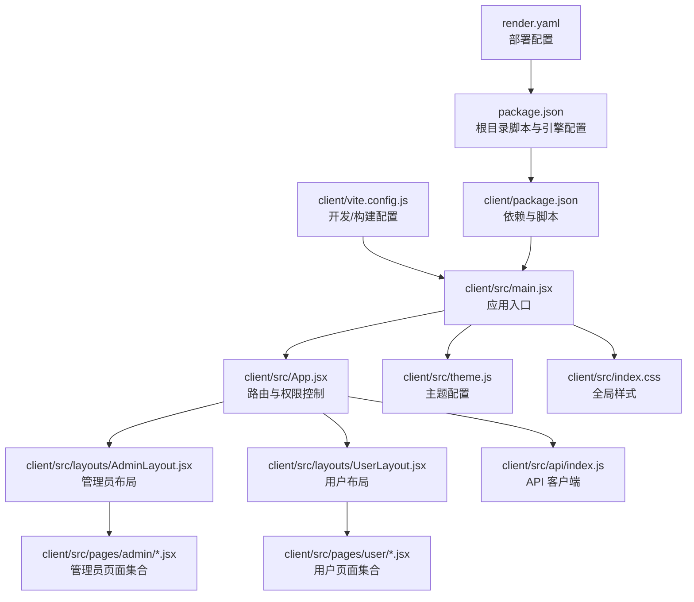

图表来源
- [main.jsx:1-14](file://client/src/main.jsx#L1-L14)
- [App.jsx:1-67](file://client/src/App.jsx#L1-L67)
- [AdminLayout.jsx:1-174](file://client/src/layouts/AdminLayout.jsx#L1-L174)
- [UserLayout.jsx:1-162](file://client/src/layouts/UserLayout.jsx#L1-L162)
- [theme.js:1-61](file://client/src/theme.js#L1-L61)
- [index.css:1-447](file://client/src/index.css#L1-L447)
- [api/index.js:1-42](file://client/src/api/index.js#L1-L42)
- [vite.config.js:1-20](file://client/vite.config.js#L1-L20)
- [package.json:1-26](file://client/package.json#L1-L26)
- [package.json:1-13](file://package.json#L1-L13)
- [render.yaml:1-13](file://render.yaml#L1-L13)

章节来源
- [main.jsx:1-14](file://client/src/main.jsx#L1-L14)
- [App.jsx:1-67](file://client/src/App.jsx#L1-L67)
- [vite.config.js:1-20](file://client/vite.config.js#L1-L20)
- [package.json:1-26](file://client/package.json#L1-L26)
- [package.json:1-13](file://package.json#L1-L13)
- [render.yaml:1-13](file://render.yaml#L1-L13)

## 核心组件
- 应用入口与主题注入
  - 在入口中通过 ConfigProvider 注入 Ant Design 主题与本地化，确保全局组件风格一致。
- 路由与权限
  - 使用 React Router 进行路由配置；通过私有路由包装器实现登录态校验与重定向。
- API 客户端
  - Axios 实例封装，统一设置基础路径、超时与请求/响应拦截器，集中处理鉴权与错误提示。
- 布局系统
  - 管理员与用户两套布局，均支持桌面端侧边栏与移动端抽屉导航，适配多端体验。
- 页面组件
  - 管理端仪表盘、商品管理等；用户端仪表盘、商品列表与出入库操作等。

章节来源
- [main.jsx:1-14](file://client/src/main.jsx#L1-L14)
- [App.jsx:26-30](file://client/src/App.jsx#L26-L30)
- [api/index.js:1-42](file://client/src/api/index.js#L1-L42)
- [AdminLayout.jsx:1-174](file://client/src/layouts/AdminLayout.jsx#L1-L174)
- [UserLayout.jsx:1-162](file://client/src/layouts/UserLayout.jsx#L1-L162)

## 架构总览
下图展示从浏览器到后端服务的典型交互流程，包括登录认证、菜单加载与数据拉取。

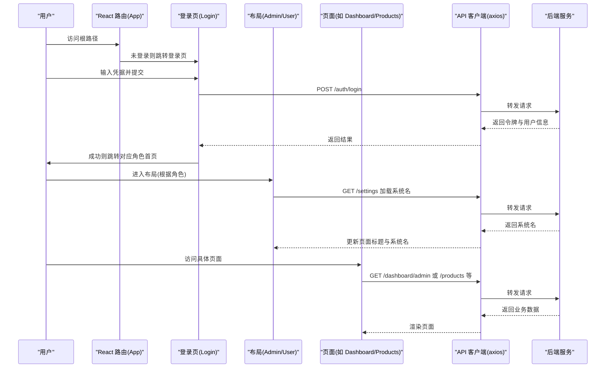

图表来源
- [App.jsx:1-67](file://client/src/App.jsx#L1-L67)
- [Login.jsx:1-68](file://client/src/pages/Login.jsx#L1-L68)
- [AdminLayout.jsx:49-55](file://client/src/layouts/AdminLayout.jsx#L49-L55)
- [UserLayout.jsx:47-53](file://client/src/layouts/UserLayout.jsx#L47-L53)
- [api/index.js:1-42](file://client/src/api/index.js#L1-L42)

## 详细组件分析

### 路由与权限控制
- 私有路由包装器
  - 通过读取本地存储中的令牌进行判断，未登录自动跳转至登录页。
- 路由层级
  - /login：登录页
  - /admin：管理员私有路由，包含多个子页面
  - /user：用户私有路由，包含多个子页面
  - 通配符 *：未命中路由统一跳转登录页
- 角色跳转
  - 布局组件在初始化时检测用户角色，若不匹配则强制跳转至正确角色首页。

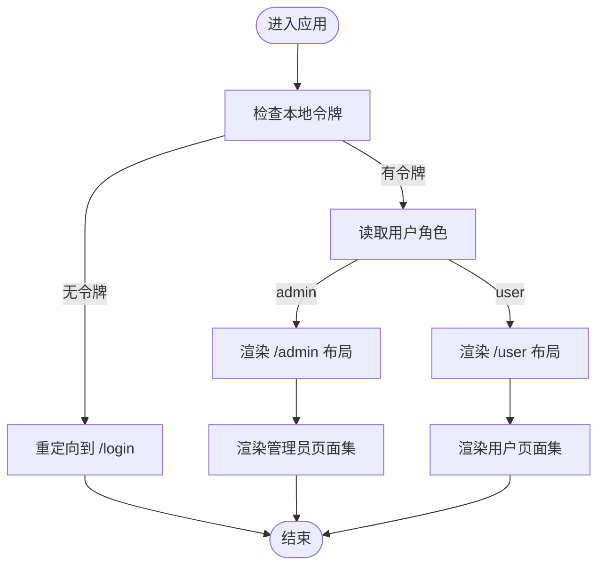

图表来源
- [App.jsx:26-30](file://client/src/App.jsx#L26-L30)
- [App.jsx:37-59](file://client/src/App.jsx#L37-L59)
- [AdminLayout.jsx:36-42](file://client/src/layouts/AdminLayout.jsx#L36-L42)
- [UserLayout.jsx:25-41](file://client/src/layouts/UserLayout.jsx#L25-L41)

章节来源
- [App.jsx:26-60](file://client/src/App.jsx#L26-L60)
- [AdminLayout.jsx:36-42](file://client/src/layouts/AdminLayout.jsx#L36-L42)
- [UserLayout.jsx:25-41](file://client/src/layouts/UserLayout.jsx#L25-L41)

### 布局设计与角色定制
- 共同特性
  - 桌面端使用 Sider 侧边栏，移动端使用 Drawer 抽屉；响应式断点为 768px；头部包含系统名、用户头像下拉菜单与登出。
  - 顶部触发器在移动端与非移动端行为一致，但抽屉与折叠状态切换方式不同。
- 管理员布局
  - 菜单项覆盖系统设置、账号管理、商品公司、客户单位、商品列表、出入库、库房管理、日常开销、数据中心等。
  - 初始化时调用 /settings 获取系统名并更新页面标题。
- 用户布局
  - 菜单项覆盖首页工作台、修改密码、商品列表、出入库、库房列表、开销列表、数据中心等。
  - 同样初始化加载系统名与页面标题。

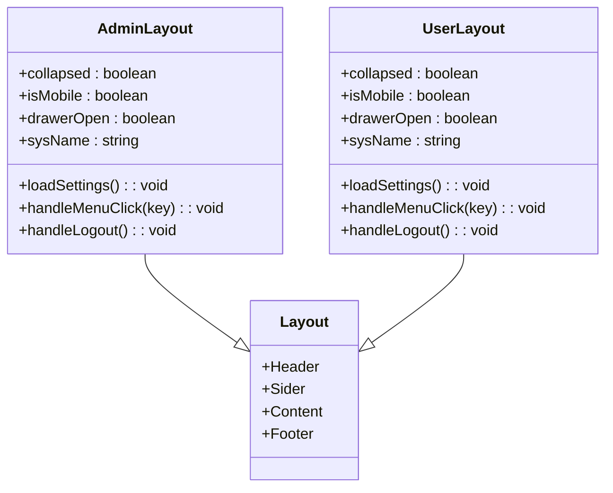

图表来源
- [AdminLayout.jsx:1-174](file://client/src/layouts/AdminLayout.jsx#L1-L174)
- [UserLayout.jsx:1-162](file://client/src/layouts/UserLayout.jsx#L1-L162)

章节来源
- [AdminLayout.jsx:14-174](file://client/src/layouts/AdminLayout.jsx#L14-L174)
- [UserLayout.jsx:14-162](file://client/src/layouts/UserLayout.jsx#L14-L162)

### API 客户端配置与使用
- Axios 实例
  - 基础路径指向 /api，统一超时时间。
- 请求拦截器
  - 自动附加 Authorization: Bearer 令牌。
- 响应拦截器
  - 统一处理业务错误码；当 code=401 时清理本地令牌与用户信息并跳转登录页；网络错误统一提示。
- 使用方式
  - 页面组件直接导入 api 实例发起请求，无需重复配置。

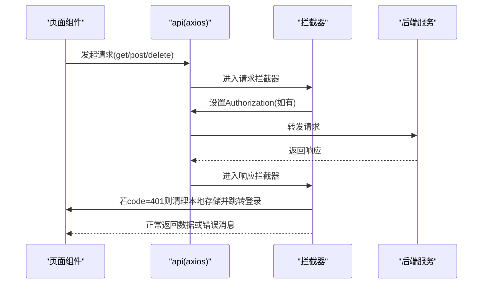

图表来源
- [api/index.js:1-42](file://client/src/api/index.js#L1-L42)

章节来源
- [api/index.js:1-42](file://client/src/api/index.js#L1-L42)

### Ant Design 集成与主题定制
- 主题注入
  - 在入口通过 ConfigProvider 注入 themeConfig 与 zhCN 本地化。
- 主题配置
  - token 层定义主色、辅助色、圆角、字体、背景色等；components 层针对 Layout、Menu、Card、Button、Input、Table、Modal 等组件进行细粒度定制。
- 全局样式
  - index.css 定义登录页、布局、统计卡片、快捷入口、气泡条目、表格、响应式与打印样式等。

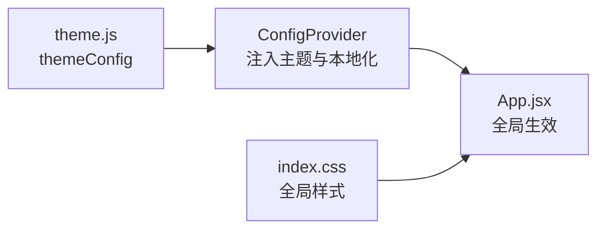

图表来源
- [theme.js:1-61](file://client/src/theme.js#L1-L61)
- [main.jsx:1-14](file://client/src/main.jsx#L1-L14)
- [index.css:1-447](file://client/src/index.css#L1-L447)

章节来源
- [theme.js:1-61](file://client/src/theme.js#L1-L61)
- [main.jsx:1-14](file://client/src/main.jsx#L1-L14)
- [index.css:1-447](file://client/src/index.css#L1-L447)

### 管理员仪表盘与用户仪表盘
- 管理员仪表盘
  - 展示商品总数、库存总金额、月度出入库额/量、月度开销等指标卡片；提供快捷入口直达常用功能；展示近七日出入库趋势折线图与近期操作气泡列表。
- 用户仪表盘
  - 展示个人录入商品数、月度出入库与开销总额等指标卡片；展示近期操作气泡列表。

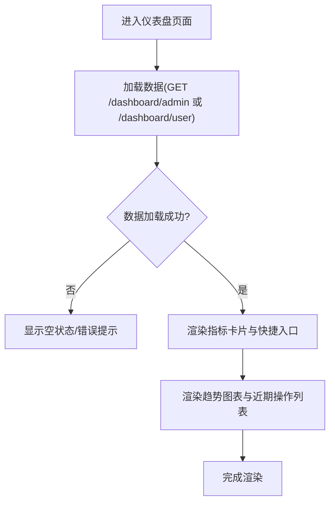

图表来源
- [admin/Dashboard.jsx:1-123](file://client/src/pages/admin/Dashboard.jsx#L1-L123)
- [user/Dashboard.jsx:1-74](file://client/src/pages/user/Dashboard.jsx#L1-L74)

章节来源
- [admin/Dashboard.jsx:1-123](file://client/src/pages/admin/Dashboard.jsx#L1-L123)
- [user/Dashboard.jsx:1-74](file://client/src/pages/user/Dashboard.jsx#L1-L74)

### 商品管理与用户商品列表
- 管理员商品管理
  - 支持分页查询、关键词搜索、新增/编辑/删除商品；点击"详情"查看商品基础信息、单价、记录人与各库房库存分布。
- 用户商品列表
  - 支持分页查询与关键词搜索；点击"详情"查看商品基础信息与库房分布；支持"入库/出库"弹窗操作，联动加载公司/客户、生成单号与库房列表。

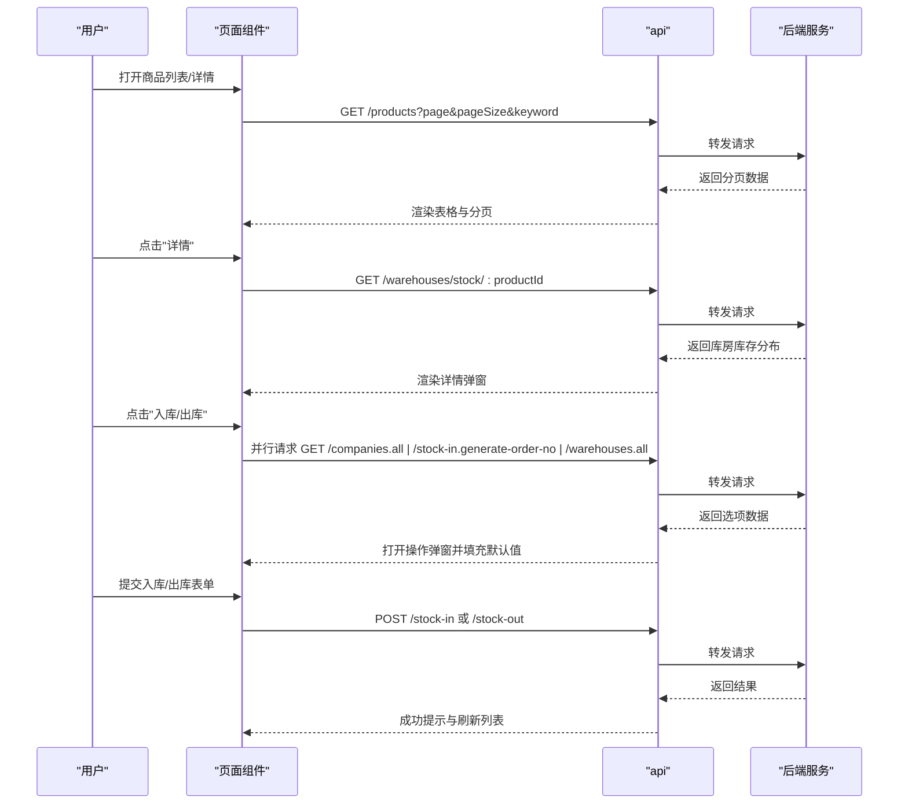

图表来源
- [admin/Products.jsx:1-134](file://client/src/pages/admin/Products.jsx#L1-L134)
- [user/ProductList.jsx:1-221](file://client/src/pages/user/ProductList.jsx#L1-L221)
- [api/index.js:1-42](file://client/src/api/index.js#L1-L42)

章节来源
- [admin/Products.jsx:1-134](file://client/src/pages/admin/Products.jsx#L1-L134)
- [user/ProductList.jsx:1-221](file://client/src/pages/user/ProductList.jsx#L1-L221)

### 登录页与系统设置
- 登录页
  - 支持账号密码登录，提交后写入令牌与用户信息，按角色跳转至对应首页；首次加载公开接口获取系统名称并设置页面标题。
- 系统设置
  - 布局组件初始化时调用 /settings 获取系统名称并更新页面标题，保证全局一致性。

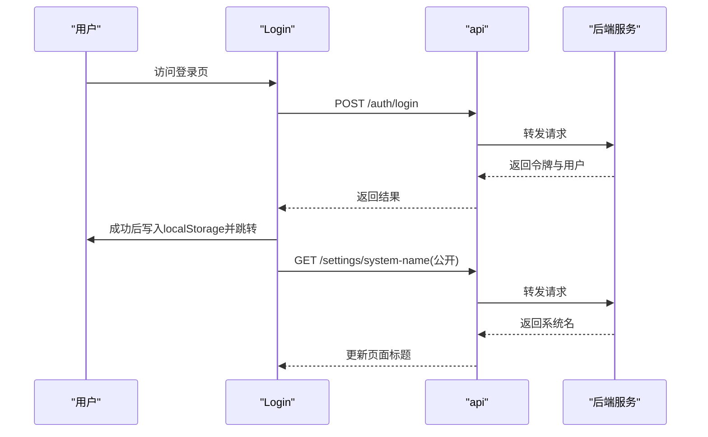

图表来源
- [Login.jsx:1-68](file://client/src/pages/Login.jsx#L1-L68)
- [AdminLayout.jsx:49-55](file://client/src/layouts/AdminLayout.jsx#L49-L55)
- [UserLayout.jsx:47-53](file://client/src/layouts/UserLayout.jsx#L47-L53)

章节来源
- [Login.jsx:1-68](file://client/src/pages/Login.jsx#L1-L68)
- [AdminLayout.jsx:49-55](file://client/src/layouts/AdminLayout.jsx#L49-L55)
- [UserLayout.jsx:47-53](file://client/src/layouts/UserLayout.jsx#L47-L53)

## 依赖关系分析
- 前端依赖
  - React 19、React Router DOM、Ant Design、Axios、dayjs、Recharts、xlsx 等。
- 开发依赖
  - Vite、@vitejs/plugin-react。
- 构建与代理
  - 本地开发服务器端口 3000，/api 代理到后端 3001；构建输出至 ../dist。

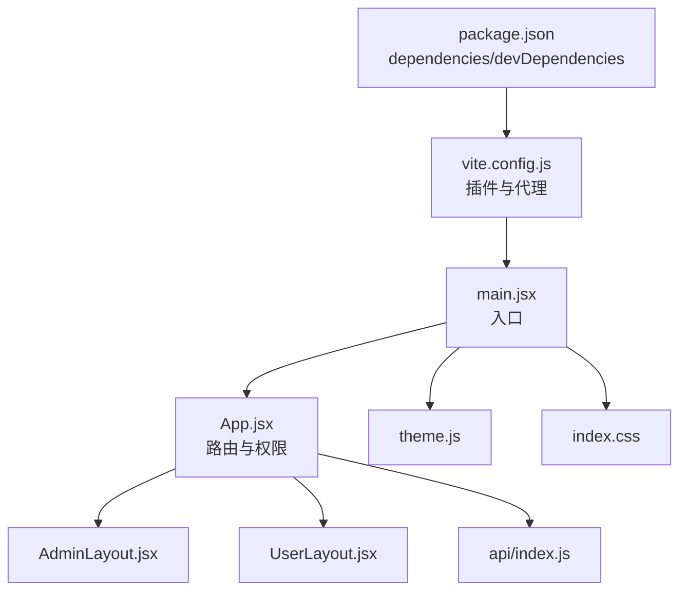

图表来源
- [package.json:1-26](file://client/package.json#L1-L26)
- [vite.config.js:1-20](file://client/vite.config.js#L1-L20)
- [main.jsx:1-14](file://client/src/main.jsx#L1-L14)
- [App.jsx:1-67](file://client/src/App.jsx#L1-L67)
- [AdminLayout.jsx:1-174](file://client/src/layouts/AdminLayout.jsx#L1-L174)
- [UserLayout.jsx:1-162](file://client/src/layouts/UserLayout.jsx#L1-L162)
- [theme.js:1-61](file://client/src/theme.js#L1-L61)
- [index.css:1-447](file://client/src/index.css#L1-L447)
- [api/index.js:1-42](file://client/src/api/index.js#L1-L42)

章节来源
- [package.json:1-26](file://client/package.json#L1-L26)
- [vite.config.js:1-20](file://client/vite.config.js#L1-L20)

## Node.js v26 兼容性改进

### 类型系统优化
**更新** 前端包配置已进行 Node.js v26 兼容性改进，主要体现在类型系统的优化上：

- **移除 type 字段影响**
  - 项目中的核心依赖已移除对 type 字段的依赖，避免了 Node.js v26 中 CommonJS 与 ES 模块解析的冲突问题
  - 这种调整确保了在 Node.js v26+ 环境下的稳定运行，无需额外的类型配置即可正常使用

- **固定版本号依赖管理**
  - 关键依赖采用固定版本号而非范围版本，提升了构建的一致性和可预测性
  - 固定版本策略减少了因依赖更新导致的潜在兼容性问题

### 依赖版本策略
**更新** 当前依赖管理策略已优化以支持 Node.js v26：

- **核心依赖版本**
  - React: ^19.2.7（固定版本）
  - React Router DOM: ^7.17.0（固定版本）
  - Ant Design: ^6.4.3（固定版本）
  - Axios: ^1.17.0（固定版本）

- **开发依赖版本**
  - Vite: 5.4.19（固定版本）
  - @vitejs/plugin-react: 4.3.4（固定版本）

### 构建环境兼容性
**更新** 构建环境已适配 Node.js v26：

- **根目录脚本引擎要求**
  - Node.js >= 18 的引擎要求确保了与现代 Node.js 版本的兼容性
  - 支持从 Node.js 18 到 v26 的平滑升级

- **部署配置优化**
  - Render 平台配置支持 Node.js 运行时
  - 构建命令包含清理临时文件的步骤，提升构建稳定性

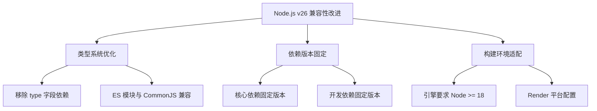

图表来源
- [package.json:1-26](file://client/package.json#L1-L26)
- [package.json:1-13](file://package.json#L1-L13)
- [render.yaml:1-13](file://render.yaml#L1-L13)

**章节来源**
- [package.json:1-26](file://client/package.json#L1-L26)
- [package.json:1-13](file://package.json#L1-L13)
- [render.yaml:1-13](file://render.yaml#L1-L13)

## 性能考量
- 图表渲染
  - 折线图使用响应式容器，建议在数据量大时考虑虚拟滚动与懒加载。
- 列表渲染
  - 表格启用横向滚动与分页，避免一次性渲染过多行；对高频字段使用 memo 化或稳定引用。
- 请求优化
  - 对多源并行请求场景（如出入库弹窗），合理拆分与合并请求，减少不必要的重复请求。
- 主题与样式
  - 组件级样式通过 Ant Design Token 控制，避免过度内联样式导致重绘；全局样式按需引入，减少无关规则。
- 构建与缓存
  - 使用 Vite 的模块热替换与预打包能力；生产构建开启压缩与资源分块，结合 CDN 可进一步提升首屏性能。

## 故障排查指南
- 登录失败或频繁跳转登录
  - 检查本地存储中是否存在 token 与 user；确认 /auth/login 接口返回结构是否符合预期；查看拦截器对 401 的处理逻辑。
- 401 错误与页面空白
  - 拦截器会清除本地存储并跳转登录页；确认后端 JWT 验证是否正常；检查请求头 Authorization 是否正确附加。
- 菜单不显示或标题异常
  - 确认 /settings 接口返回的 system_name 是否存在；检查布局组件初始化逻辑与页面标题更新时机。
- 移动端导航异常
  - 检查窗口尺寸监听与断点阈值；确认抽屉开关与路由切换时的状态同步。
- Node.js v26 兼容性问题
  - 确认依赖版本固定策略是否生效；检查构建过程中是否有类型解析错误；验证 ES 模块与 CommonJS 的混合使用。

**章节来源**
- [api/index.js:17-39](file://client/src/api/index.js#L17-L39)
- [AdminLayout.jsx:36-55](file://client/src/layouts/AdminLayout.jsx#L36-L55)
- [UserLayout.jsx:25-53](file://client/src/layouts/UserLayout.jsx#L25-L53)

## 结论
本项目以 React 19 为基础，结合 Ant Design 与 Axios，构建了清晰的路由与权限体系、可扩展的布局与页面结构、以及统一的 API 客户端与主题系统。管理员与用户布局在保持一致交互体验的同时，通过菜单与页面内容实现差异化定制。

**更新** 本次更新特别加强了 Node.js v26 兼容性支持，通过移除类型系统依赖、固定版本号管理和优化构建配置，确保了在最新 Node.js 版本下的稳定运行。建议后续在大型数据场景下引入状态管理方案（如 Zustand/Redux Toolkit）、完善单元测试与 E2E 测试，并持续优化构建产物与运行时性能。

## 附录
- 最佳实践与代码规范建议
  - 组件命名与导出：采用 PascalCase，按功能域分目录；默认导出为主视图，具名导出为工具/子组件。
  - 状态管理：页面内局部状态使用 useState/useEffect；跨页面共享状态使用上下文或轻量状态库；避免在组件外持有复杂状态。
  - 请求与错误：统一通过 api 实例发起请求；对 401 统一处理；对业务错误码进行分类提示。
  - 样式与主题：优先使用 Ant Design Token 与组件属性；全局样式集中维护于 index.css；移动端优先采用弹性布局与媒体查询。
  - 可访问性：为图标与按钮提供语义化标签；为表单控件提供占位文本与错误提示。
  - 可测试性：为关键函数与组件提供可测试的抽象；对副作用（如 localStorage、window）进行 mock。
  - **Node.js v26 兼容性**：遵循固定版本号依赖策略；避免使用可能导致兼容性问题的实验性特性；定期更新依赖以获得最新的兼容性修复。