# 布局系统

<cite>
**本文档引用的文件**
- [AdminLayout.jsx](file://client/src/layouts/AdminLayout.jsx)
- [UserLayout.jsx](file://client/src/layouts/UserLayout.jsx)
- [App.jsx](file://client/src/App.jsx)
- [main.jsx](file://client/src/main.jsx)
- [Dashboard.jsx（管理员）](file://client/src/pages/admin/Dashboard.jsx)
- [Dashboard.jsx（用户）](file://client/src/pages/user/Dashboard.jsx)
- [Settings.jsx](file://client/src/pages/admin/Settings.jsx)
- [ProductList.jsx](file://client/src/pages/user/ProductList.jsx)
- [theme.js](file://client/src/theme.js)
- [index.css](file://client/src/index.css)
- [api/index.js](file://client/src/api/index.js)
- [Login.jsx](file://client/src/pages/Login.jsx)
</cite>

## 目录
1. [简介](#简介)
2. [项目结构](#项目结构)
3. [核心组件](#核心组件)
4. [架构概览](#架构概览)
5. [详细组件分析](#详细组件分析)
6. [依赖关系分析](#依赖关系分析)
7. [性能考虑](#性能考虑)
8. [故障排除指南](#故障排除指南)
9. [结论](#结论)
10. [附录](#附录)

## 简介
本项目采用基于 Ant Design 的响应式布局系统，为管理员和普通用户提供差异化的工作界面。系统通过两个独立的布局组件实现不同的导航菜单配置、侧边栏结构和内容区域组织，同时支持移动端适配和屏幕尺寸兼容性。

## 项目结构
布局系统主要包含以下核心文件：
- 布局组件：AdminLayout.jsx、UserLayout.jsx
- 路由配置：App.jsx
- 样式系统：index.css、theme.js
- 页面组件：各功能页面的实现

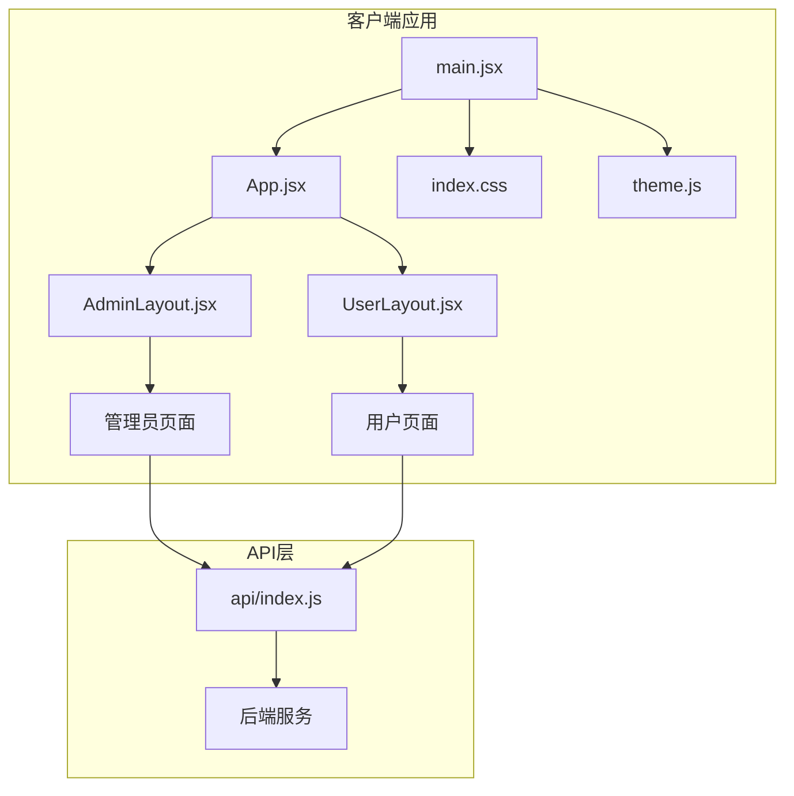

**图表来源**
- [main.jsx:1-14](file://client/src/main.jsx#L1-L14)
- [App.jsx:1-67](file://client/src/App.jsx#L1-L67)
- [AdminLayout.jsx:1-174](file://client/src/layouts/AdminLayout.jsx#L1-L174)
- [UserLayout.jsx:1-162](file://client/src/layouts/UserLayout.jsx#L1-L162)

**章节来源**
- [main.jsx:1-14](file://client/src/main.jsx#L1-L14)
- [App.jsx:1-67](file://client/src/App.jsx#L1-L67)

## 核心组件
布局系统的核心是两个专门的布局组件，它们共享相似的结构但服务于不同的用户角色。

### 布局组件架构
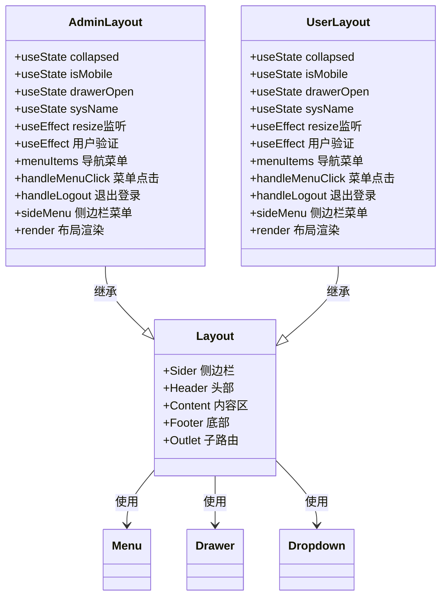

**图表来源**
- [AdminLayout.jsx:16-174](file://client/src/layouts/AdminLayout.jsx#L16-L174)
- [UserLayout.jsx:16-162](file://client/src/layouts/UserLayout.jsx#L16-L162)

### 响应式设计策略
系统采用统一的断点策略，使用 768px 作为移动设备识别标准：

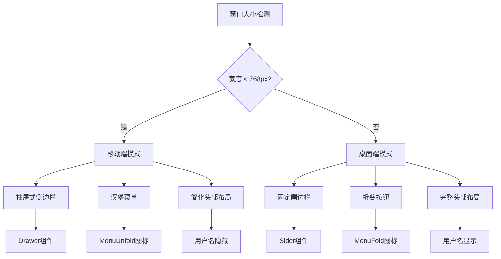

**图表来源**
- [AdminLayout.jsx:14](file://client/src/layouts/AdminLayout.jsx#L14)
- [UserLayout.jsx:14](file://client/src/layouts/UserLayout.jsx#L14)

**章节来源**
- [AdminLayout.jsx:14-34](file://client/src/layouts/AdminLayout.jsx#L14-L34)
- [UserLayout.jsx:14-33](file://client/src/layouts/UserLayout.jsx#L14-L33)

## 架构概览
布局系统采用分层架构设计，通过路由控制不同角色用户的访问权限和界面展示。

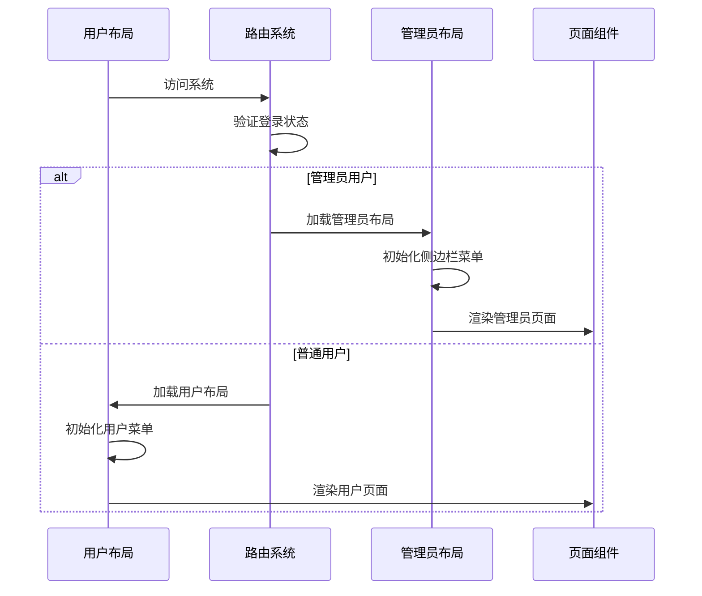

**图表来源**
- [App.jsx:26-60](file://client/src/App.jsx#L26-L60)
- [AdminLayout.jsx:36-42](file://client/src/layouts/AdminLayout.jsx#L36-L42)
- [UserLayout.jsx:25-41](file://client/src/layouts/UserLayout.jsx#L25-L41)

### 路由集成机制
系统通过 React Router 实现布局与页面的集成：

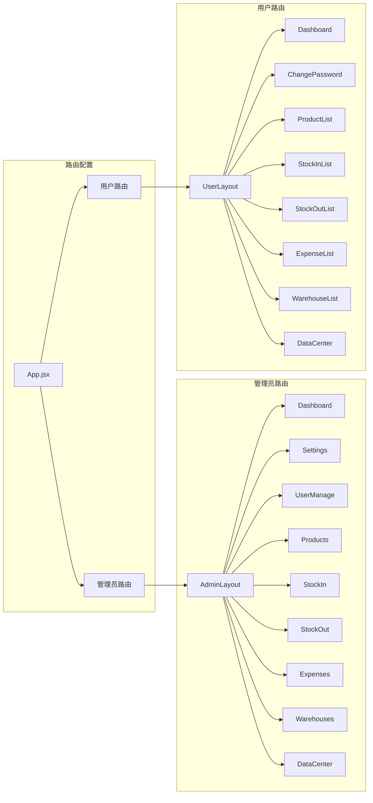

**图表来源**
- [App.jsx:32-60](file://client/src/App.jsx#L32-L60)

**章节来源**
- [App.jsx:32-60](file://client/src/App.jsx#L32-L60)

## 详细组件分析

### 管理员布局组件分析

#### 导航菜单配置
管理员布局提供完整的业务管理功能菜单：

| 菜单项 | 图标 | 路径 | 功能描述 |
|--------|------|------|----------|
| 首页工作台 | DashboardOutlined | /admin | 系统仪表板 |
| 系统设置 | SettingOutlined | /admin/settings | 系统参数配置 |
| 账号管理 | UserOutlined | /admin/users | 用户账户管理 |
| 商品公司 | ShopOutlined | /admin/companies | 供应商管理 |
| 客户单位 | TeamOutlined | /admin/clients | 客户管理 |
| 商品列表 | ShoppingOutlined | /admin/products | 商品信息管理 |
| 商品入库 | ImportOutlined | /admin/stock-in | 入库操作 |
| 商品出库 | ExportOutlined | /admin/stock-out | 出库操作 |
| 库房管理 | BankOutlined | /admin/warehouses | 仓库管理 |
| 日常开销 | DollarOutlined | /admin/expenses | 费用记录 |
| 数据中心 | DatabaseOutlined | /admin/data-center | 数据统计 |

#### 侧边栏结构设计
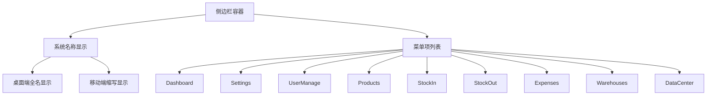

**图表来源**
- [AdminLayout.jsx:57-69](file://client/src/layouts/AdminLayout.jsx#L57-L69)
- [AdminLayout.jsx:88-114](file://client/src/layouts/AdminLayout.jsx#L88-L114)

#### 内容区域组织
管理员布局的内容区域通过 `Outlet` 组件接收子路由内容，并提供系统设置刷新功能：

**章节来源**
- [AdminLayout.jsx:57-114](file://client/src/layouts/AdminLayout.jsx#L57-L114)
- [AdminLayout.jsx:166-168](file://client/src/layouts/AdminLayout.jsx#L166-L168)

### 用户布局组件分析

#### 导航菜单配置
用户布局专注于日常业务操作：

| 菜单项 | 图标 | 路径 | 功能描述 |
|--------|------|------|----------|
| 首页工作台 | DashboardOutlined | /user | 个人仪表板 |
| 修改密码 | LockOutlined | /user/password | 密码安全设置 |
| 商品列表 | ShoppingOutlined | /user/products | 商品查询 |
| 商品入库 | ImportOutlined | /user/stock-in | 入库记录查看 |
| 商品出库 | ExportOutlined | /user/stock-out | 出库记录查看 |
| 库房列表 | BankOutlined | /user/warehouses | 仓库信息查看 |
| 开销列表 | DollarOutlined | /user/expenses | 费用记录查看 |
| 数据中心 | DatabaseOutlined | /user/data-center | 个人数据统计 |

#### 侧边栏交互逻辑
用户布局实现了与管理员布局相同的响应式交互模式，但菜单项更简洁：

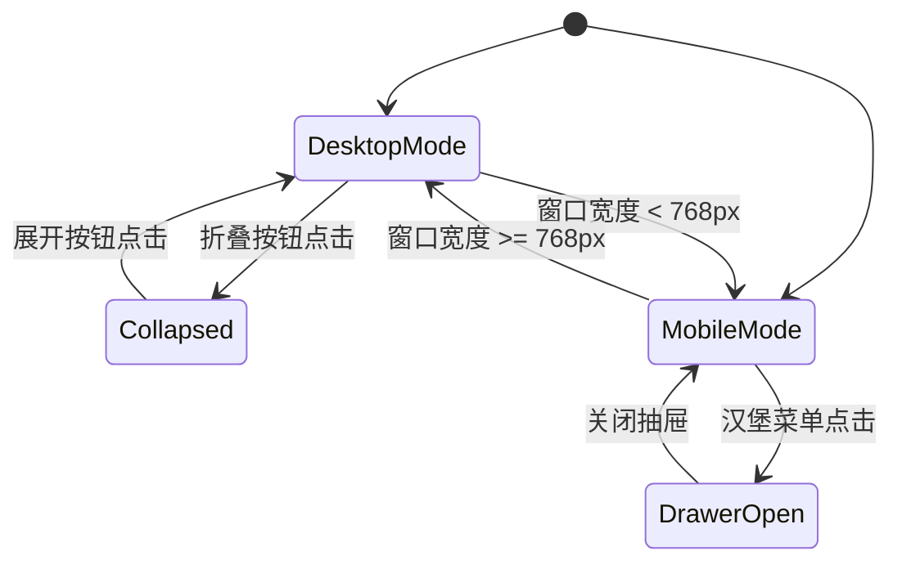

**图表来源**
- [UserLayout.jsx:108-133](file://client/src/layouts/UserLayout.jsx#L108-L133)

**章节来源**
- [UserLayout.jsx:55-104](file://client/src/layouts/UserLayout.jsx#L55-L104)
- [UserLayout.jsx:106-159](file://client/src/layouts/UserLayout.jsx#L106-L159)

### 响应式设计实现

#### 移动端适配策略
系统针对不同屏幕尺寸提供了优化的用户体验：

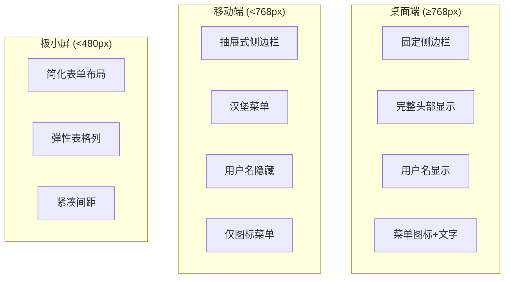

**图表来源**
- [index.css:291-404](file://client/src/index.css#L291-L404)

#### 样式系统架构
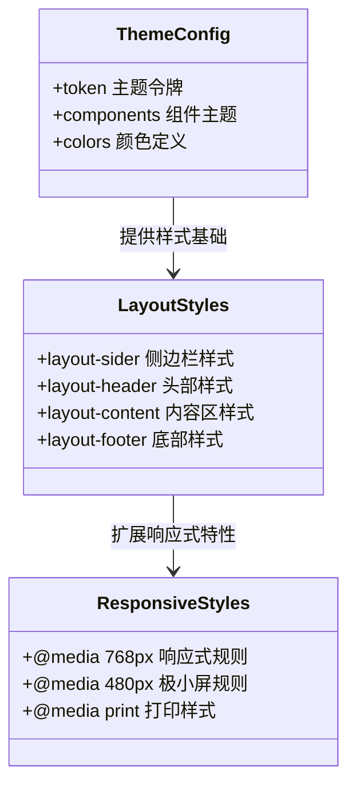

**图表来源**
- [theme.js:1-61](file://client/src/theme.js#L1-L61)
- [index.css:78-118](file://client/src/index.css#L78-L118)

**章节来源**
- [index.css:291-404](file://client/src/index.css#L291-L404)
- [theme.js:1-61](file://client/src/theme.js#L1-L61)

## 依赖关系分析

### 组件依赖图
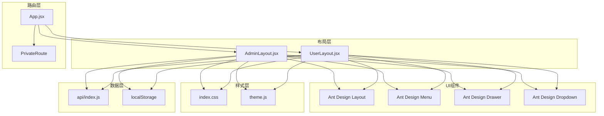

**图表来源**
- [AdminLayout.jsx:1-12](file://client/src/layouts/AdminLayout.jsx#L1-L12)
- [UserLayout.jsx:1-10](file://client/src/layouts/UserLayout.jsx#L1-L10)
- [App.jsx:1-6](file://client/src/App.jsx#L1-L6)

### Props 传递机制
布局组件通过多种方式传递 props 和上下文信息：

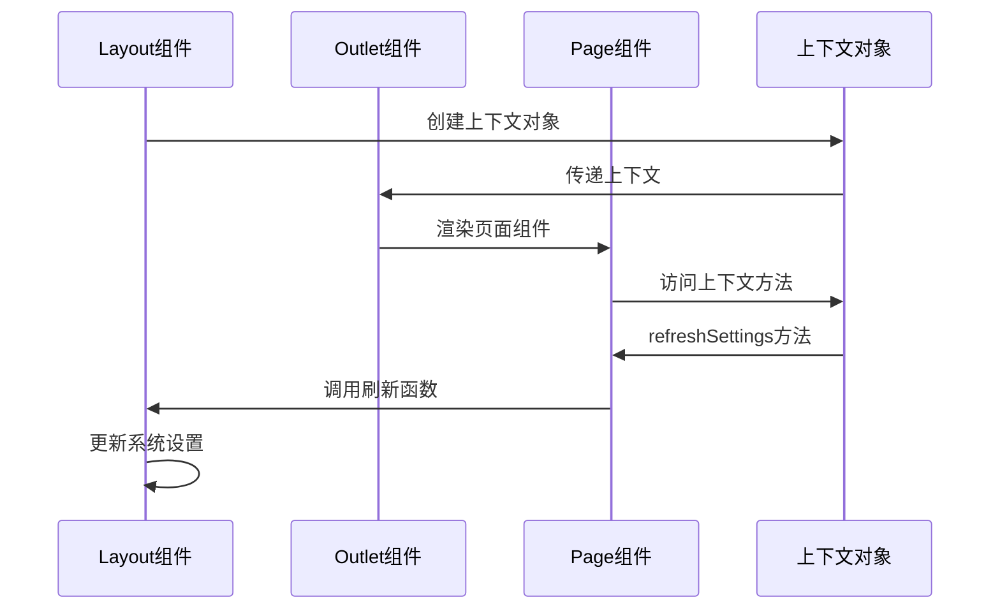

**图表来源**
- [AdminLayout.jsx:166-168](file://client/src/layouts/AdminLayout.jsx#L166-L168)
- [Settings.jsx:9](file://client/src/pages/admin/Settings.jsx#L9)

**章节来源**
- [AdminLayout.jsx:166-168](file://client/src/layouts/AdminLayout.jsx#L166-L168)
- [Settings.jsx:9](file://client/src/pages/admin/Settings.jsx#L9)

## 性能考虑
布局系统在性能方面采用了多项优化策略：

### 渲染优化
- 使用 `useMemo` 和 `useCallback` 优化菜单项和事件处理器
- 条件渲染减少不必要的 DOM 元素创建
- 抽屉组件按需加载，避免初始化时的性能开销

### 响应式性能
- 使用 CSS 媒体查询而非 JavaScript 动态计算
- 固定断点值减少计算复杂度
- 移动端简化菜单项数量

### 缓存策略
- 系统名称缓存在本地存储中
- 用户信息本地持久化
- API 请求结果缓存机制

## 故障排除指南

### 常见问题诊断
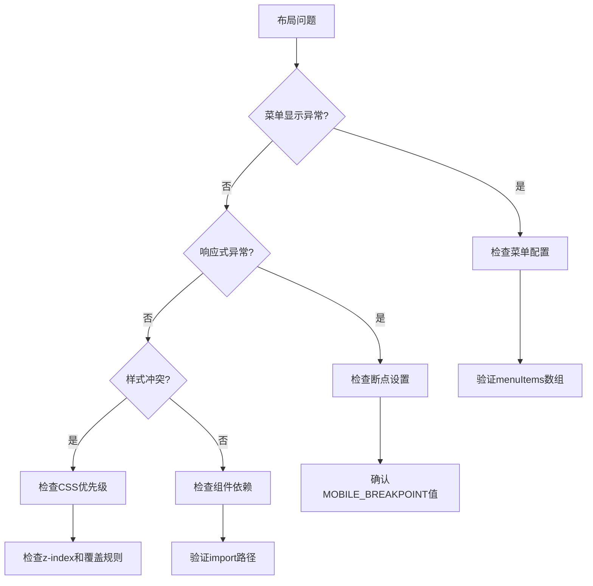

### 调试工具建议
- 使用浏览器开发者工具检查元素层级
- 利用 React DevTools 分析组件渲染
- 检查网络面板确认 API 请求状态
- 使用控制台输出调试信息

**章节来源**
- [AdminLayout.jsx:36-42](file://client/src/layouts/AdminLayout.jsx#L36-L42)
- [UserLayout.jsx:25-41](file://client/src/layouts/UserLayout.jsx#L25-L41)

## 结论
该布局系统通过精心设计的组件架构和响应式策略，为管理员和用户提供了清晰、高效的工作界面。系统的主要优势包括：

1. **角色分离明确**：管理员和用户拥有独立的导航菜单和功能权限
2. **响应式设计完善**：针对不同设备提供优化的用户体验
3. **组件复用性强**：共享的基础布局组件减少了代码重复
4. **扩展性良好**：模块化的架构便于功能扩展和维护

## 附录

### 开发指南

#### 布局定制步骤
1. **修改菜单配置**：编辑 `menuItems` 数组添加新菜单项
2. **更新路由配置**：在 `App.jsx` 中添加新的路由映射
3. **创建页面组件**：实现对应的页面功能组件
4. **调整样式**：根据需要修改 CSS 或主题配置
5. **测试响应式**：验证不同屏幕尺寸下的显示效果

#### 扩展开发最佳实践
- 保持组件职责单一，避免过度耦合
- 使用语义化命名提高代码可读性
- 添加适当的错误处理和边界条件检查
- 考虑国际化需求，提供多语言支持
- 实施性能监控和用户体验指标

#### 布局组件属性参考
| 属性名 | 类型 | 默认值 | 描述 |
|--------|------|--------|------|
| collapsed | boolean | false | 侧边栏折叠状态 |
| isMobile | boolean | false | 移动端模式标识 |
| drawerOpen | boolean | false | 抽屉打开状态 |
| sysName | string | '做账管理系统' | 系统名称 |
| user | object | {} | 当前用户信息 |