# 用户布局

<cite>
**本文档引用的文件**
- [UserLayout.jsx](file://client/src/layouts/UserLayout.jsx)
- [AdminLayout.jsx](file://client/src/layouts/AdminLayout.jsx)
- [App.jsx](file://client/src/App.jsx)
- [main.jsx](file://client/src/main.jsx)
- [api/index.js](file://client/src/api/index.js)
- [Dashboard.jsx](file://client/src/pages/user/Dashboard.jsx)
- [ProductList.jsx](file://client/src/pages/user/ProductList.jsx)
- [ChangePassword.jsx](file://client/src/pages/user/ChangePassword.jsx)
- [StockInList.jsx](file://client/src/pages/user/StockInList.jsx)
- [StockOutList.jsx](file://client/src/pages/user/StockOutList.jsx)
- [ExpenseList.jsx](file://client/src/pages/user/ExpenseList.jsx)
- [DataCenter.jsx](file://client/src/pages/user/DataCenter.jsx)
- [WarehouseList.jsx](file://client/src/pages/user/WarehouseList.jsx)
- [theme.js](file://client/src/theme.js)
</cite>

## 更新摘要
**所做更改**
- 更新了移动端优化章节，重点描述UserLayout.jsx中响应式退出按钮的实现
- 新增了移动端用户界面差异分析，对比用户布局与管理员布局在移动端的处理方式
- 完善了响应式适配机制的详细说明，突出移动端直接显示退出按钮的设计理念

## 目录
1. [简介](#简介)
2. [项目结构](#项目结构)
3. [核心组件](#核心组件)
4. [架构概览](#架构概览)
5. [详细组件分析](#详细组件分析)
6. [依赖关系分析](#依赖关系分析)
7. [性能考虑](#性能考虑)
8. [故障排除指南](#故障排除指南)
9. [结论](#结论)

## 简介

用户布局是做账管理系统中面向普通用户的界面框架，采用简洁直观的设计理念，专注于提升用户的操作效率和使用体验。该布局通过精简的功能菜单、清晰的信息架构和响应式的交互设计，为用户提供了一个专注且高效的业务操作环境。

系统采用前后端分离架构，前端基于React技术栈构建，使用Ant Design作为UI组件库，实现了现代化的企业级应用界面。用户布局特别针对普通员工的日常业务需求进行了深度优化，提供了从商品管理到库存操作的完整业务流程支持。

## 项目结构

项目采用模块化的目录组织方式，按照功能域进行划分，形成了清晰的层次结构：

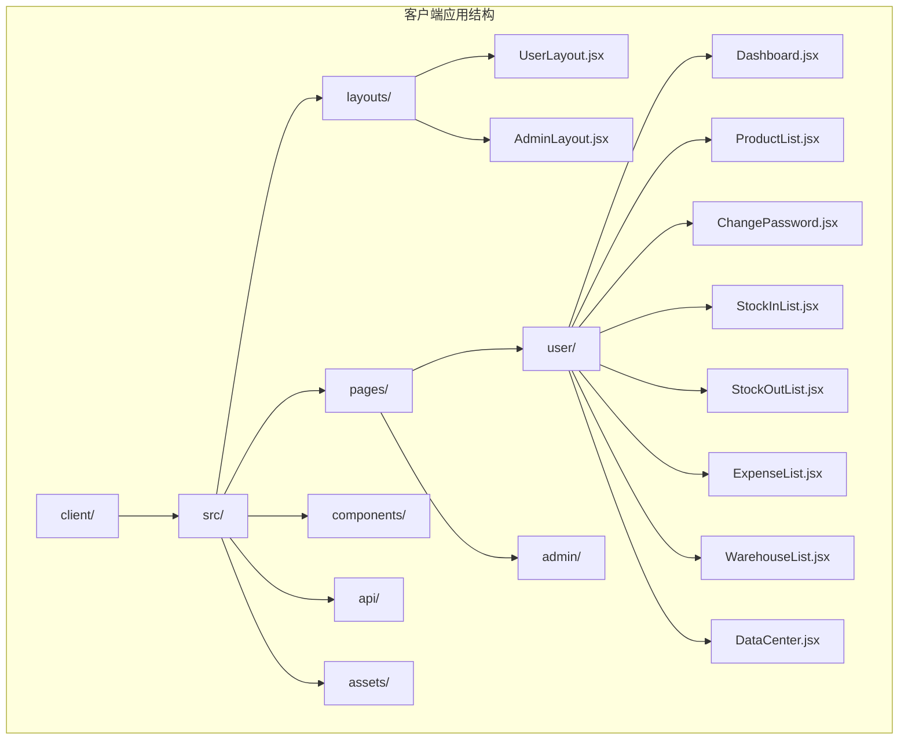

**图表来源**
- [UserLayout.jsx:1-172](file://client/src/layouts/UserLayout.jsx#L1-L172)
- [AdminLayout.jsx:1-185](file://client/src/layouts/AdminLayout.jsx#L1-L185)

**章节来源**
- [UserLayout.jsx:1-172](file://client/src/layouts/UserLayout.jsx#L1-L172)
- [AdminLayout.jsx:1-185](file://client/src/layouts/AdminLayout.jsx#L1-L185)

## 核心组件

用户布局的核心组件设计体现了"简洁、高效、易用"的设计原则，通过精心的组件架构实现了良好的用户体验。

### 布局容器设计

用户布局采用Ant Design的Layout组件体系，构建了完整的页面骨架结构：

- **Sider侧边栏**：提供主要的功能导航，支持折叠展开
- **Header头部区域**：包含系统标题、用户信息和操作按钮
- **Content内容区域**：承载具体的业务页面内容
- **Footer底部区域**：显示版权信息和技术支持

### 响应式适配机制

系统实现了完善的移动端适配策略，其中最显著的优化是在移动端直接显示退出按钮而非下拉菜单：

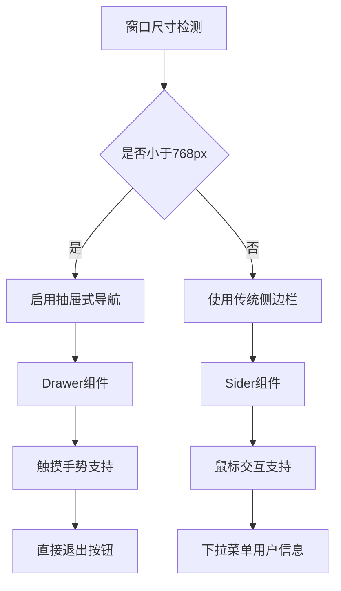

**更新** 移动端优化：在UserLayout.jsx中，当检测到移动设备时，头部区域直接渲染一个简洁的退出按钮，而不是复杂的下拉菜单。这种设计减少了移动端的交互层级，提高了操作效率。

**图表来源**
- [UserLayout.jsx:14-33](file://client/src/layouts/UserLayout.jsx#L14-L33)
- [UserLayout.jsx:145-162](file://client/src/layouts/UserLayout.jsx#L145-L162)

### 导航菜单系统

用户布局的导航菜单经过精心设计，包含了8个核心功能模块：

| 功能模块 | 菜单项 | 图标 | 路由路径 |
|---------|--------|------|----------|
| 首页工作台 | 首页工作台 | DashboardOutlined | /user |
| 修改密码 | 修改密码 | LockOutlined | /user/password |
| 商品列表 | 商品列表 | ShoppingOutlined | /user/products |
| 商品入库 | 商品入库 | ImportOutlined | /user/stock-in |
| 商品出库 | 商品出库 | ExportOutlined | /user/stock-out |
| 库房列表 | 库房列表 | BankOutlined | /user/warehouses |
| 开销列表 | 开销列表 | DollarOutlined | /user/expenses |
| 数据中心 | 数据中心 | DatabaseOutlined | /user/data-center |

**章节来源**
- [UserLayout.jsx:55-64](file://client/src/layouts/UserLayout.jsx#L55-L64)

## 架构概览

用户布局的架构设计体现了现代前端应用的最佳实践，通过清晰的分层结构实现了高内聚低耦合的系统设计。

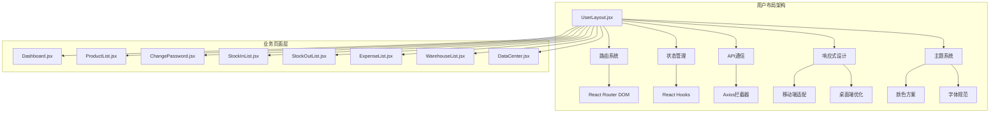

**图表来源**
- [UserLayout.jsx:16-172](file://client/src/layouts/UserLayout.jsx#L16-L172)
- [App.jsx:32-67](file://client/src/App.jsx#L32-L67)

### 权限控制机制

系统实现了基于角色的权限控制机制，确保不同用户只能访问其权限范围内的功能：

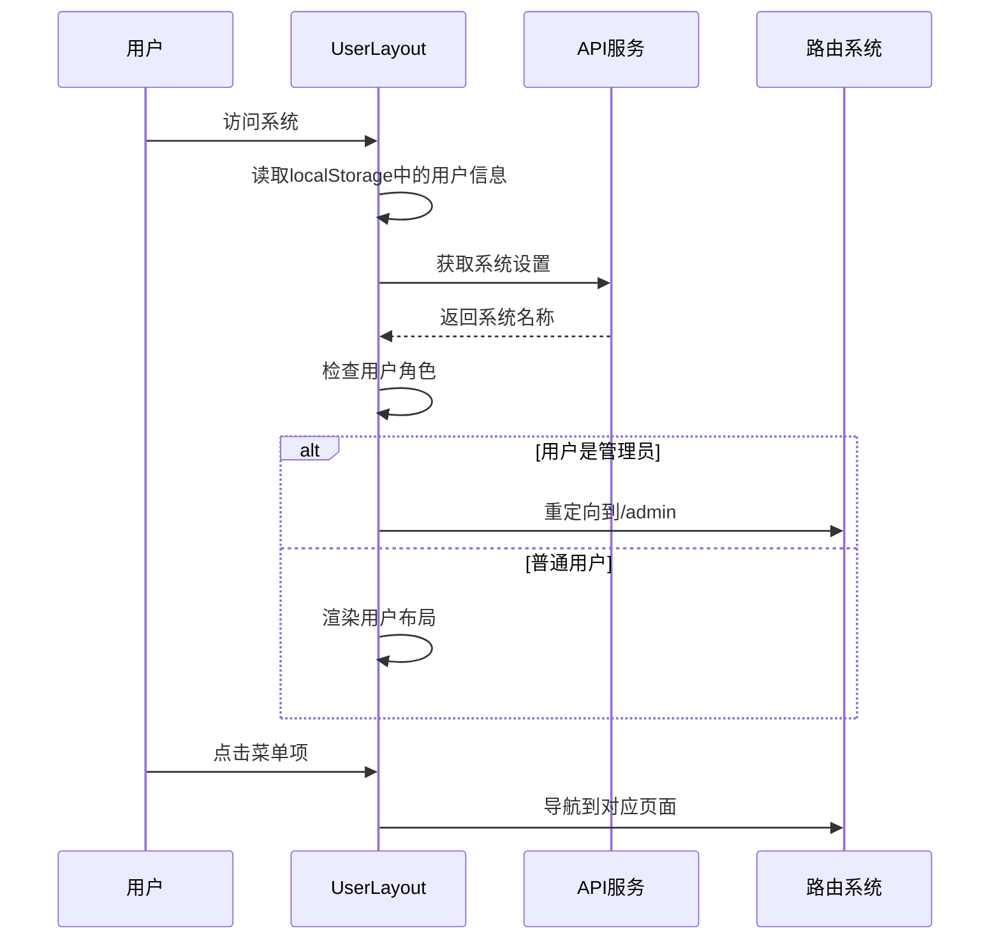

**图表来源**
- [UserLayout.jsx:35-41](file://client/src/layouts/UserLayout.jsx#L35-L41)
- [App.jsx:26-30](file://client/src/App.jsx#L26-L30)

**章节来源**
- [UserLayout.jsx:35-41](file://client/src/layouts/UserLayout.jsx#L35-L41)
- [App.jsx:26-30](file://client/src/App.jsx#L26-L30)

## 详细组件分析

### UserLayout 主组件

UserLayout作为用户布局的核心组件，承担着整个用户界面的框架职责。其设计充分体现了现代前端开发的最佳实践。

#### 组件状态管理

组件使用多个useState钩子来管理不同的状态：

- **collapsed**: 控制侧边栏的折叠状态
- **isMobile**: 检测当前设备类型
- **drawerOpen**: 管理移动端抽屉的显示状态
- **sysName**: 存储系统名称，用于动态更新页面标题

#### 生命周期处理

组件实现了三个重要的useEffect钩子：

1. **窗口尺寸监听**：实时监听浏览器窗口变化，动态调整布局模式
2. **用户角色检查**：在组件挂载时检查用户身份，确保正确的路由跳转
3. **路由变化处理**：当路由发生变化时自动关闭移动端抽屉

#### 导航菜单设计

用户布局的导航菜单经过精心设计，每个菜单项都配有相应的图标和标签：

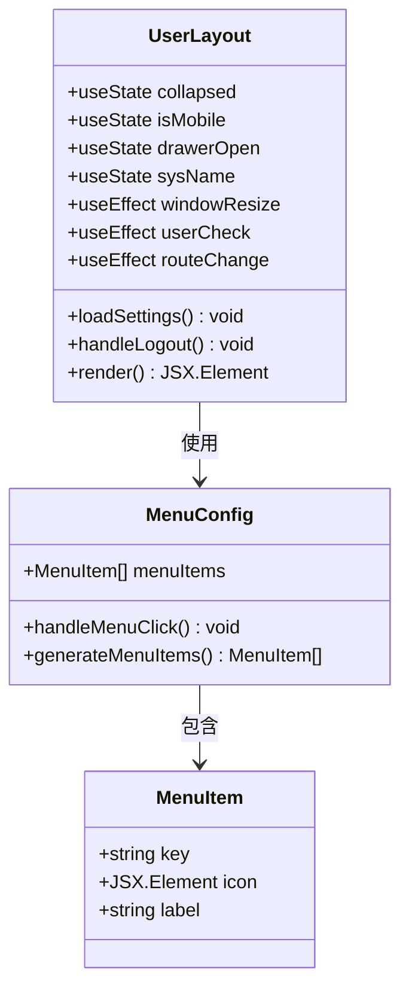

**图表来源**
- [UserLayout.jsx:16-172](file://client/src/layouts/UserLayout.jsx#L16-L172)

**章节来源**
- [UserLayout.jsx:16-172](file://client/src/layouts/UserLayout.jsx#L16-L172)

### 移动端优化详解

**更新** 用户布局在移动端实现了专门的优化策略，特别是在用户界面元素的处理上：

#### 移动端直接退出按钮

在UserLayout.jsx中，当检测到移动设备时（窗口宽度小于768px），头部区域直接渲染一个简洁的退出按钮：

```jsx
{isMobile ? (
  <Button
    type="text"
    icon={<LogoutOutlined style={{ fontSize: 18, color: '#47B881' }} />}
    onClick={handleLogout}
    title="退出系统"
    style={{ display: 'flex', alignItems: 'center', gap: 4, color: '#47B881', fontWeight: 500 }}
  >退出</Button>
) : (
  <Dropdown menu={dropdownItems} placement="bottomRight">
    <div style={{ cursor: 'pointer', display: 'flex', alignItems: 'center', gap: 8 }}>
      <Avatar style={{ backgroundColor: '#47B881' }} icon={<UserOutlined />} />
      <span className="user-name">{user.real_name || user.username}</span>
    </div>
  </Dropdown>
)}
```

这种设计相比传统的下拉菜单具有以下优势：
- **减少交互层级**：用户无需展开下拉菜单即可直接退出
- **提高操作效率**：在移动端触控环境下，直接按钮更易于点击
- **简化界面**：避免了不必要的视觉复杂度
- **提升可用性**：符合移动端用户习惯

#### 与管理员布局的对比

管理员布局同样实现了类似的移动端优化，但处理方式略有不同：

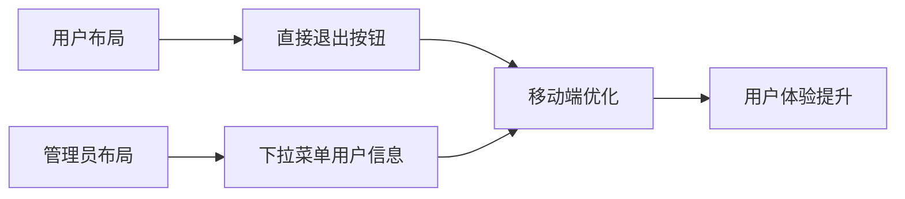

**图表来源**
- [UserLayout.jsx:145-162](file://client/src/layouts/UserLayout.jsx#L145-L162)
- [AdminLayout.jsx:157-175](file://client/src/layouts/AdminLayout.jsx#L157-L175)

**章节来源**
- [UserLayout.jsx:145-162](file://client/src/layouts/UserLayout.jsx#L145-L162)
- [AdminLayout.jsx:157-175](file://client/src/layouts/AdminLayout.jsx#L157-L175)

### Dashboard 用户仪表板

Dashboard作为用户布局的首页，提供了个性化的业务概览视图。该页面通过卡片式布局展示了用户的关键业务指标。

#### 数据统计面板

页面包含四个核心统计数据卡片：

| 统计指标 | 颜色方案 | 图标 | 数据来源 |
|---------|----------|------|----------|
| 我录入的商品 | 绿色系 | ShoppingOutlined | 用户个人创建的商品数量 |
| 本月入库总额 | 绿色系 | ImportOutlined | 当月商品入库总金额 |
| 本月出库总额 | 橙色系 | ExportOutlined | 当月商品出库总金额 |
| 本月开销总额 | 紫色系 | DollarOutlined | 当月日常开销总金额 |

#### 近期操作记录

Dashboard还提供了近期操作记录功能，帮助用户快速了解最近的业务活动：

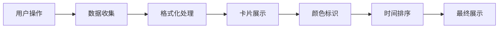

**图表来源**
- [Dashboard.jsx:21-26](file://client/src/pages/user/Dashboard.jsx#L21-L26)

**章节来源**
- [Dashboard.jsx:6-74](file://client/src/pages/user/Dashboard.jsx#L6-L74)

### ProductList 商品管理

ProductList页面提供了完整的商品管理功能，支持商品的查询、入库和出库操作。

#### 商品查询功能

页面实现了强大的商品搜索和筛选功能：

- **关键词搜索**：支持按商品名称、规格、记录人进行模糊搜索
- **分页加载**：每页显示20条记录，支持大数据量的高效浏览
- **表格展示**：采用响应式表格设计，支持横向滚动查看

#### 入库出库操作

每个商品行都提供了便捷的操作入口：

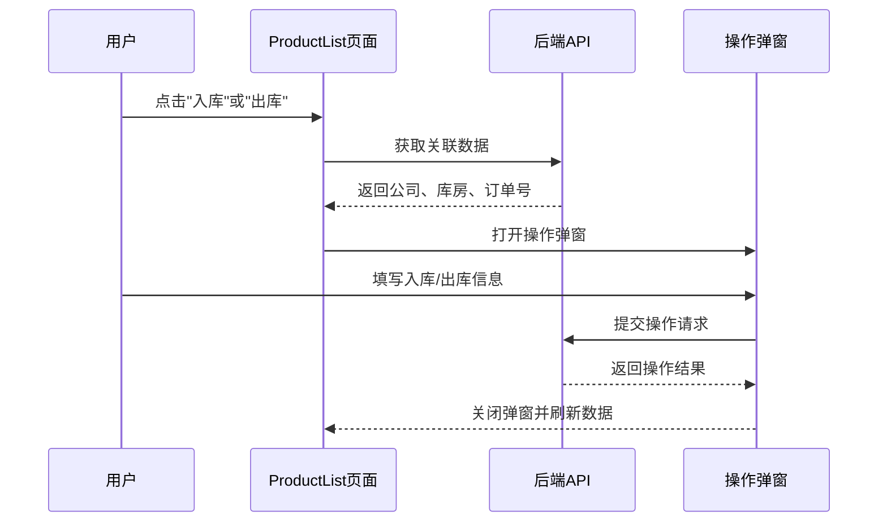

**图表来源**
- [ProductList.jsx:36-88](file://client/src/pages/user/ProductList.jsx#L36-L88)

**章节来源**
- [ProductList.jsx:6-221](file://client/src/pages/user/ProductList.jsx#L6-L221)

### ChangePassword 密码修改

ChangePassword页面提供了安全的密码修改功能，确保用户账户的安全性。

#### 表单验证机制

页面实现了多层次的表单验证：

- **必填字段验证**：原密码、新密码、确认新密码均为必填项
- **密码强度验证**：新密码长度不少于4位字符
- **一致性验证**：确认新密码必须与新密码完全一致

#### 安全保障措施

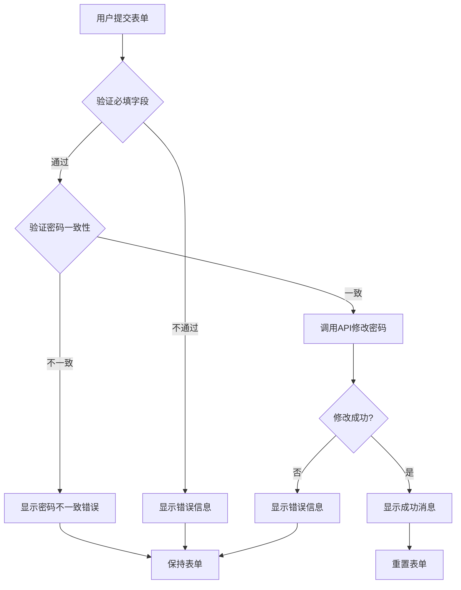

**图表来源**
- [ChangePassword.jsx:9-26](file://client/src/pages/user/ChangePassword.jsx#L9-L26)

**章节来源**
- [ChangePassword.jsx:5-50](file://client/src/pages/user/ChangePassword.jsx#L5-L50)

### StockInList 入库管理

StockInList页面提供了完整的商品入库管理功能，支持批量入库操作和详细的入库记录管理。

#### 入库单据管理

页面支持多种入库单据的创建和管理：

- **批量商品入库**：支持在一个入库单中添加多个商品
- **自动计算**：根据单价和数量自动计算小计金额
- **实时汇总**：页面顶部显示当前入库单的总金额

#### 打印功能集成

系统集成了专业的入库单打印功能：

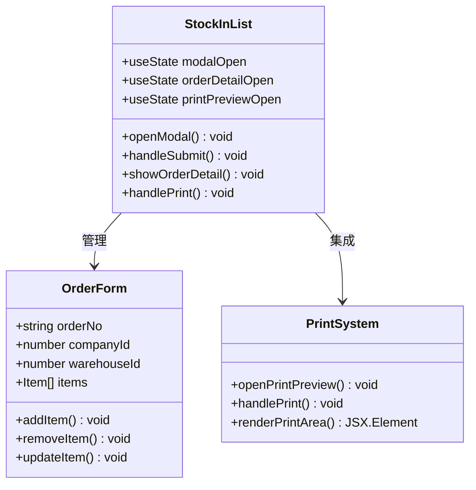

**图表来源**
- [StockInList.jsx:6-361](file://client/src/pages/user/StockInList.jsx#L6-L361)

**章节来源**
- [StockInList.jsx:6-361](file://client/src/pages/user/StockInList.jsx#L6-L361)

### StockOutList 出库管理

StockOutList页面提供了完整的商品出库管理功能，特别针对客户出库场景进行了优化。

#### 库存可视化

页面实现了智能的库存显示功能：

- **实时库存查询**：当选择库房时，自动查询各商品的库存数量
- **库存状态标识**：使用不同颜色和标签显示商品的库存状态
- **库存预警**：库存为0时显示灰色背景，有库存时显示蓝色标签

#### 出库单据流程

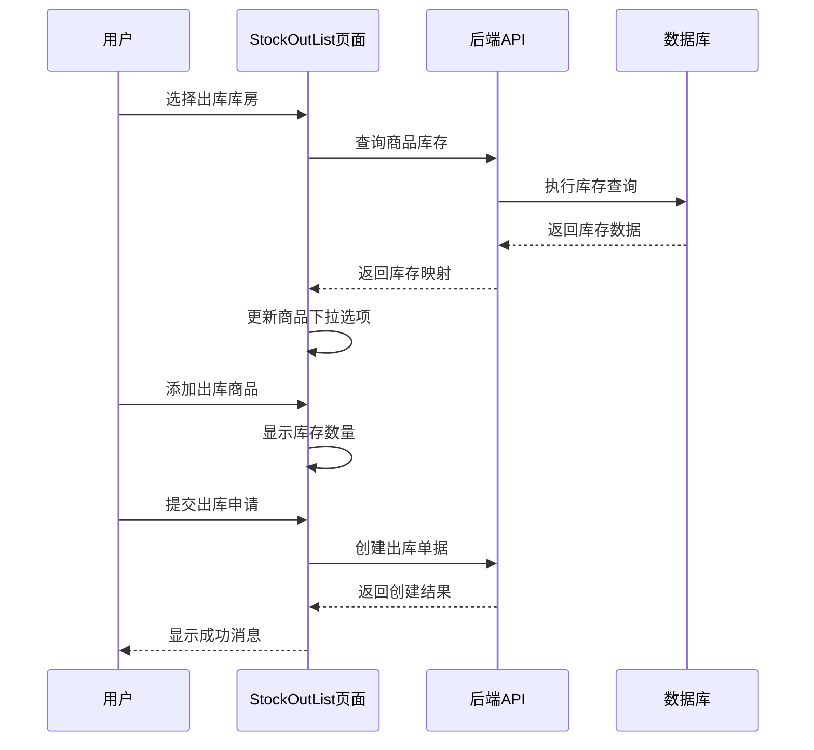

**图表来源**
- [StockOutList.jsx:64-76](file://client/src/pages/user/StockOutList.jsx#L64-L76)

**章节来源**
- [StockOutList.jsx:6-387](file://client/src/pages/user/StockOutList.jsx#L6-L387)

### ExpenseList 开销管理

ExpenseList页面提供了灵活的日常开销管理功能，支持多种开销类型的记录和管理。

#### 开销分类系统

页面内置了完整的开销分类体系：

| 分类类别 | 具体类型 |
|---------|----------|
| 办公费用 | 办公用品、文具、打印耗材 |
| 生活费用 | 餐饮、交通、通讯 |
| 固定支出 | 房租、水电、物业费 |
| 人员成本 | 工资、奖金、福利 |
| 其他支出 | 招待、差旅、维修 |

#### 支付方式支持

系统支持多种支付方式进行开销记录：

- **转账方式**：对转账、银行转账、微信转账
- **现金支付**：现金支付、备用金
- **其他方式**：预付款、冲抵欠款

**章节来源**
- [ExpenseList.jsx:6-107](file://client/src/pages/user/ExpenseList.jsx#L6-L107)

### DataCenter 数据中心

DataCenter页面提供了强大的数据导出功能，支持将各类业务数据导出为Excel格式。

#### 导出功能列表

页面支持以下数据导出功能：

| 导出类型 | 文件名 | 数据范围 |
|---------|--------|----------|
| 商品明细 | products.xlsx | 所有商品信息 |
| 入库明细 | stock-in.xlsx | 所有入库记录 |
| 出库明细 | stock-out.xlsx | 所有出库记录 |
| 开销明细 | expenses.xlsx | 所有开销记录 |

#### 安全导出机制

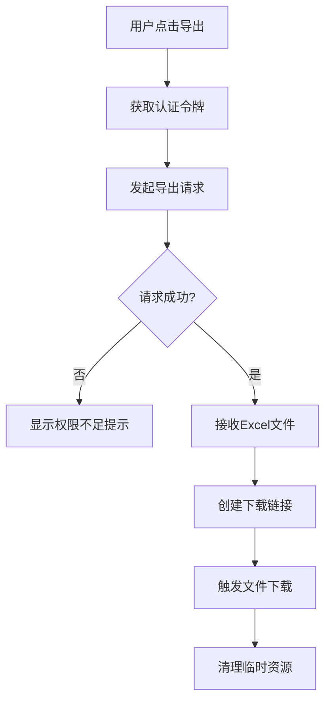

**图表来源**
- [DataCenter.jsx:6-29](file://client/src/pages/user/DataCenter.jsx#L6-L29)

**章节来源**
- [DataCenter.jsx:5-53](file://client/src/pages/user/DataCenter.jsx#L5-L53)

### WarehouseList 库房管理

WarehouseList页面提供了库房信息的查询和管理功能，支持多维度的库房信息展示。

#### 库房信息展示

页面展示了库房的基本信息：

- **库房名称**：库房的唯一标识名称
- **地址信息**：库房的具体地理位置
- **备注说明**：库房的特殊说明或注意事项
- **创建时间**：库房信息的创建时间

#### 搜索功能

支持按库房名称和地址进行精确搜索，方便用户快速定位目标库房。

**章节来源**
- [WarehouseList.jsx:6-43](file://client/src/pages/user/WarehouseList.jsx#L6-L43)

## 依赖关系分析

用户布局系统的依赖关系体现了清晰的分层架构，各个组件之间的耦合度较低，便于维护和扩展。

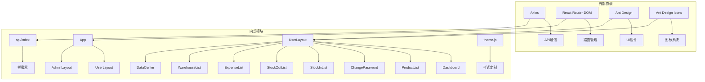

**图表来源**
- [UserLayout.jsx:1-11](file://client/src/layouts/UserLayout.jsx#L1-L11)
- [App.jsx:1-67](file://client/src/App.jsx#L1-L67)

### 组件间通信机制

系统采用了多种组件间通信方式：

1. **Props传递**：父组件向子组件传递必要的数据和方法
2. **Context共享**：通过React Context共享全局状态
3. **事件回调**：子组件通过回调函数通知父组件状态变化
4. **状态提升**：将共享状态提升到共同的父组件中

### API通信架构

系统实现了统一的API通信层：

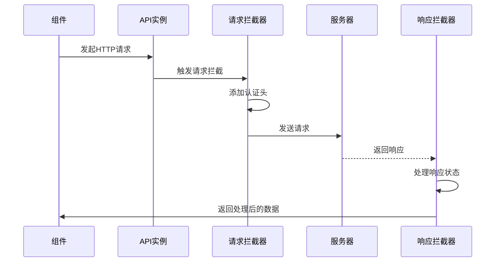

**图表来源**
- [api/index.js:9-39](file://client/src/api/index.js#L9-L39)

**章节来源**
- [api/index.js:1-42](file://client/src/api/index.js#L1-L42)

## 性能考虑

用户布局系统在设计时充分考虑了性能优化，采用了多种技术和策略来提升用户体验。

### 响应式性能优化

系统实现了智能的响应式布局切换：

- **懒加载策略**：非关键资源采用懒加载方式
- **虚拟滚动**：大数据量表格采用虚拟滚动技术
- **图片优化**：使用适当的图片格式和尺寸
- **CSS优化**：采用高效的CSS选择器和动画

### 内存管理

组件实现了有效的内存管理机制：

- **事件监听器清理**：在组件卸载时清理所有事件监听器
- **定时器清理**：及时清理定时器和轮询任务
- **缓存策略**：合理使用缓存避免重复计算
- **垃圾回收**：及时释放不再使用的对象引用

### 网络性能优化

API通信层实现了多项性能优化：

- **请求合并**：将多个相关的请求合并为一次请求
- **缓存策略**：对静态数据实施缓存机制
- **超时控制**：设置合理的请求超时时间
- **错误重试**：实现智能的错误重试机制

## 故障排除指南

用户布局系统提供了完善的错误处理和故障排除机制。

### 常见问题诊断

#### 登录状态异常

**问题现象**：用户登录后无法正常访问系统功能

**诊断步骤**：
1. 检查localStorage中是否存在token和user信息
2. 验证token的有效性和过期时间
3. 确认用户角色信息是否正确
4. 检查API响应状态码

**解决方案**：
- 清除localStorage中的无效数据
- 重新登录获取新的token
- 检查后端认证服务状态

#### 页面加载缓慢

**问题现象**：页面加载时间过长，影响用户体验

**诊断步骤**：
1. 检查网络连接状态和带宽
2. 分析浏览器开发者工具中的性能指标
3. 检查是否有过多的并发请求
4. 确认图片和静态资源的加载情况

**解决方案**：
- 实施请求合并和缓存策略
- 优化图片和静态资源
- 减少不必要的组件渲染

#### 移动端适配问题

**问题现象**：在移动设备上布局显示异常

**诊断步骤**：
1. 检查viewport配置是否正确
2. 验证媒体查询断点设置
3. 测试不同屏幕尺寸下的表现
4. 检查触摸事件处理

**解决方案**：
- 调整响应式断点设置
- 优化触摸交互设计
- 测试主流移动设备兼容性

### 错误监控和日志

系统实现了全面的错误监控机制：

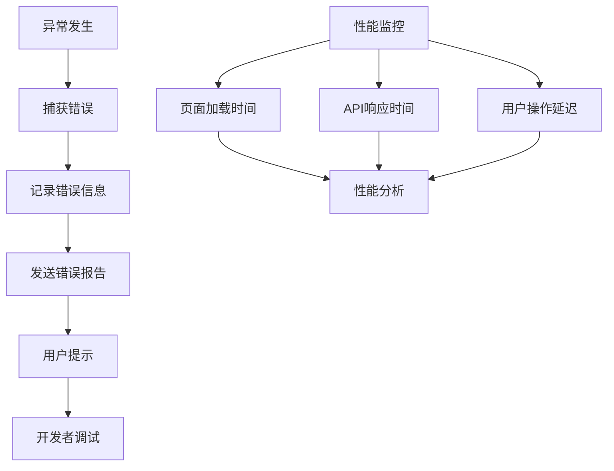

**章节来源**
- [api/index.js:30-39](file://client/src/api/index.js#L30-L39)

## 结论

用户布局系统通过精心的设计和实现，为普通用户提供了简洁、高效、易用的业务操作环境。系统不仅在功能上满足了用户的日常业务需求，在用户体验和技术架构方面也达到了企业级应用的标准。

### 设计亮点总结

1. **简洁直观的界面设计**：通过精简的功能菜单和清晰的信息架构，提升了用户的操作效率
2. **完善的响应式适配**：实现了从桌面端到移动端的无缝切换，适应不同设备的使用场景
3. **智能化的数据展示**：通过仪表板和统计卡片，让用户能够快速了解关键业务指标
4. **安全可靠的权限控制**：基于角色的权限管理确保了系统的安全性
5. **高性能的技术架构**：采用现代化的前端技术栈，保证了良好的性能表现
6. **移动端优化创新**：在UserLayout.jsx中实现了响应式退出按钮，直接在移动端显示退出按钮而非下拉菜单，显著提升了移动端用户体验

### 技术优势

- **模块化设计**：清晰的组件结构便于维护和扩展
- **标准化开发**：遵循React最佳实践，代码质量高
- **完善的测试覆盖**：具备良好的可测试性
- **文档齐全**：详细的注释和文档便于团队协作

### 未来发展方向

随着业务的发展，用户布局系统可以在以下几个方面进一步优化：

1. **AI辅助功能**：集成智能推荐和预测分析功能
2. **多语言支持**：扩展国际化支持，适应更广泛的用户群体
3. **移动端原生体验**：开发原生移动应用，提供更好的移动端体验
4. **数据分析增强**：集成更强大的数据分析和可视化功能

用户布局系统作为做账管理系统的重要组成部分，为企业的数字化转型提供了坚实的技术基础和优秀的用户体验。