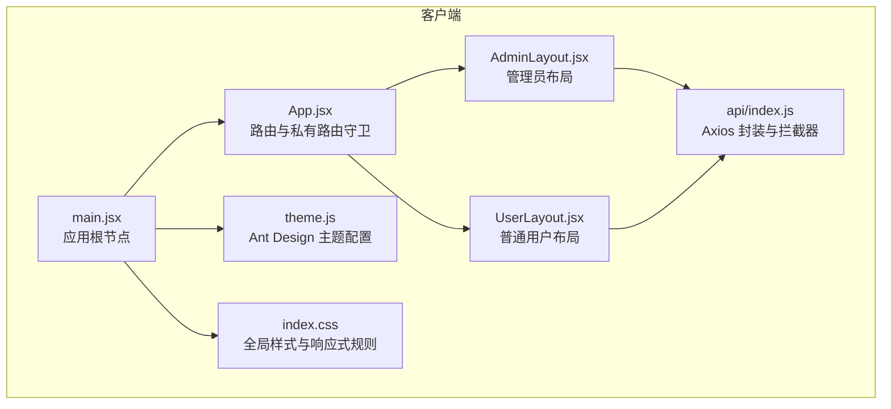
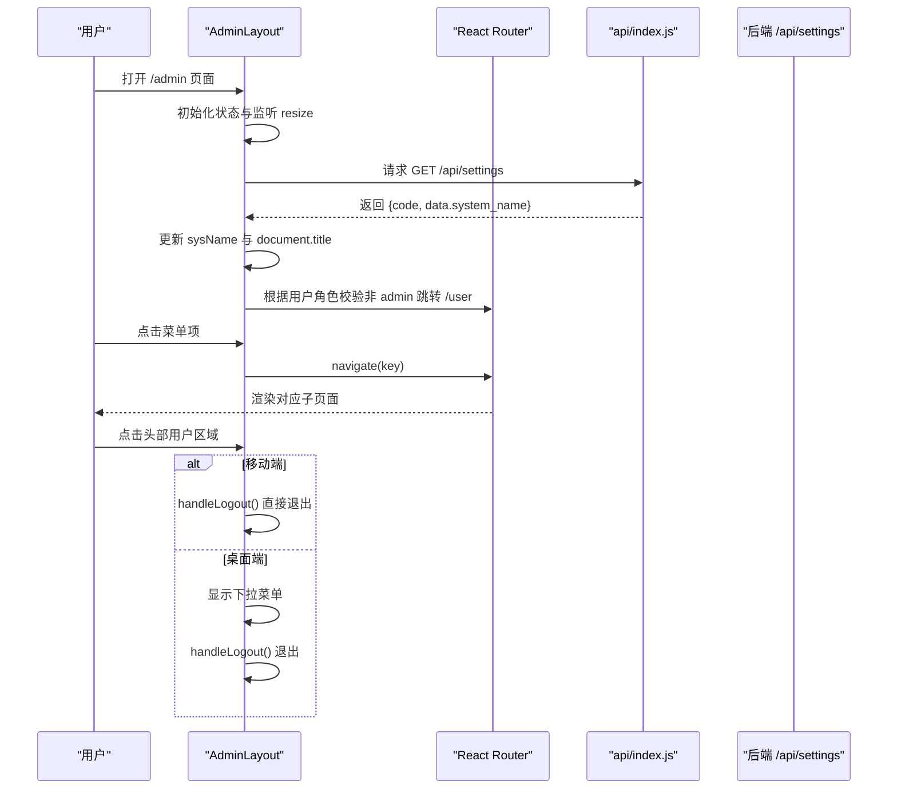
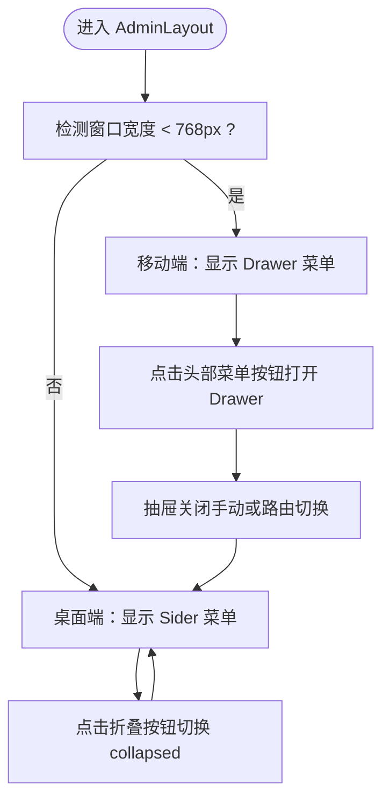
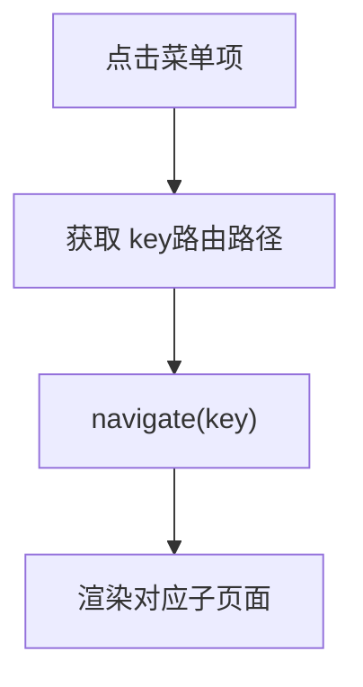
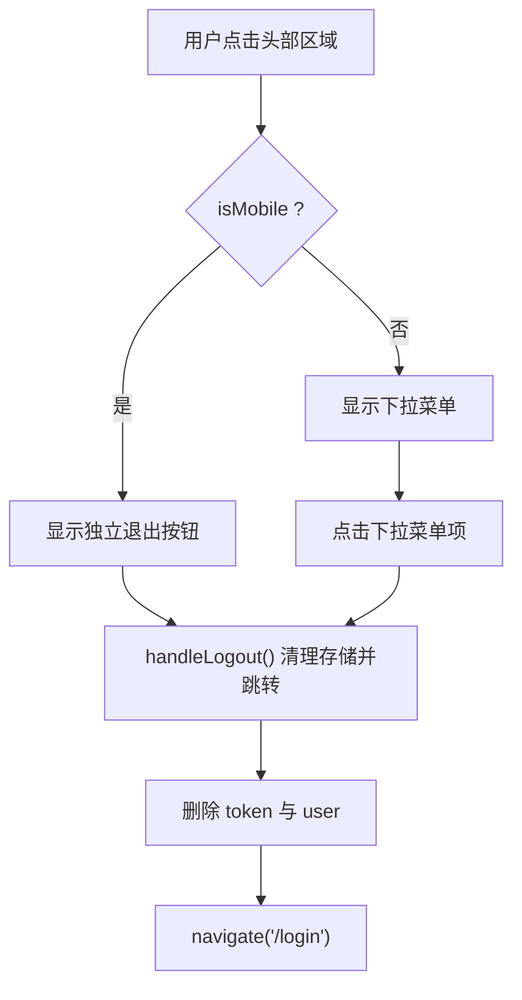
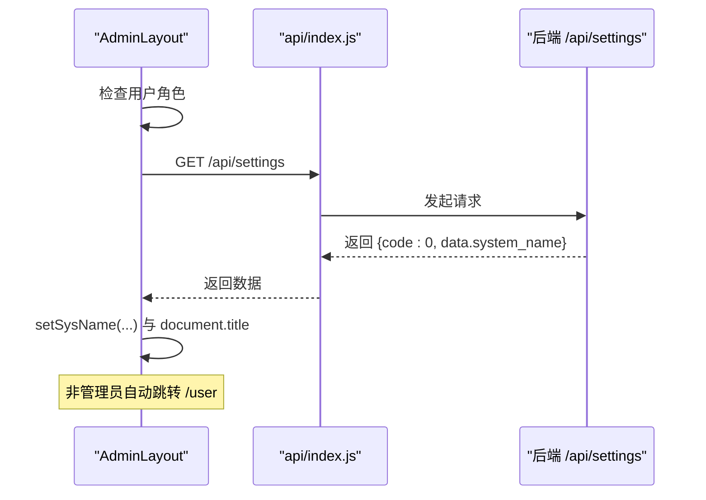
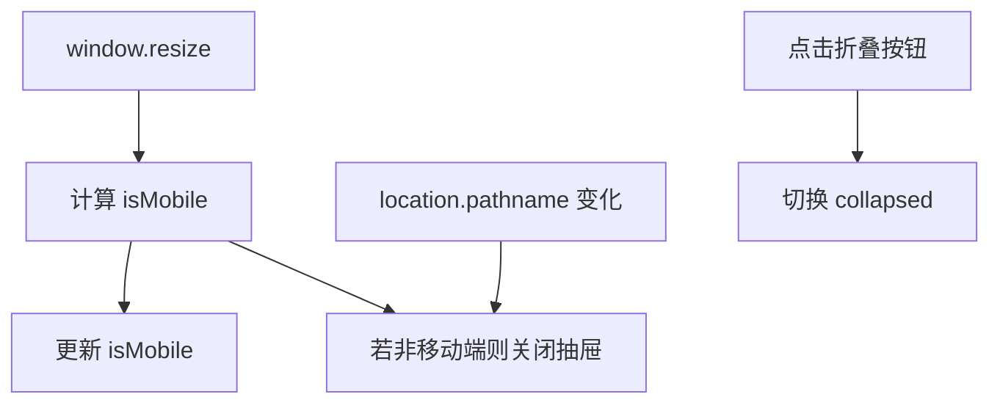
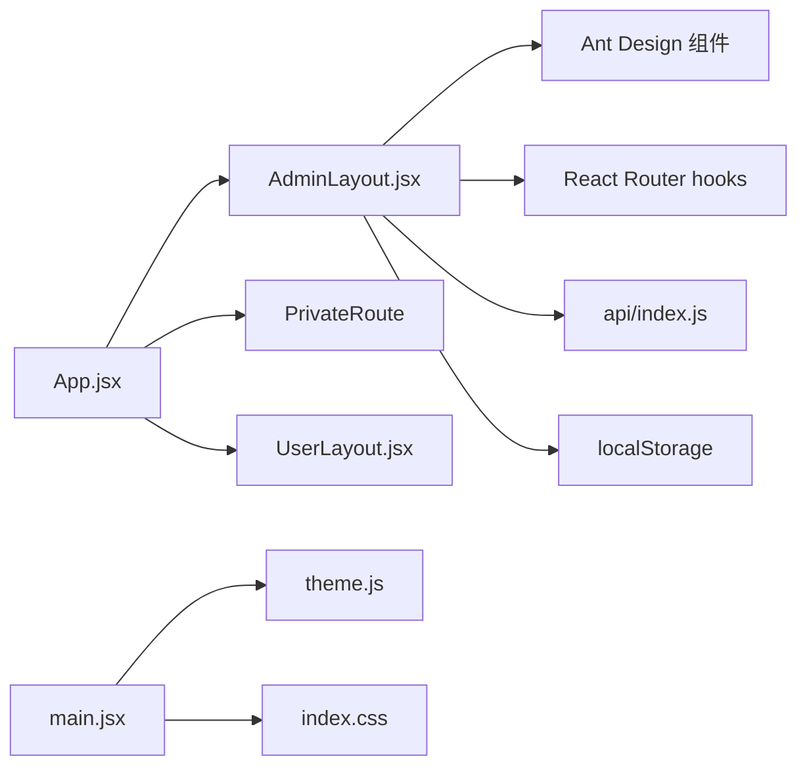

# 管理员布局

<cite>
**本文引用的文件**
- [AdminLayout.jsx](file://client/src/layouts/AdminLayout.jsx)
- [App.jsx](file://client/src/App.jsx)
- [main.jsx](file://client/src/main.jsx)
- [theme.js](file://client/src/theme.js)
- [index.css](file://client/src/index.css)
- [api/index.js](file://client/src/api/index.js)
- [UserLayout.jsx](file://client/src/layouts/UserLayout.jsx)
</cite>

## 更新摘要
**变更内容**
- 更新移动端优化部分，反映AdminLayout.jsx中响应式logout按钮的实现
- 新增移动端直接显示退出按钮而非下拉菜单的技术细节
- 补充移动端与桌面端用户界面交互差异的对比分析

## 目录
1. [简介](#简介)
2. [项目结构](#项目结构)
3. [核心组件](#核心组件)
4. [架构总览](#架构总览)
5. [详细组件分析](#详细组件分析)
6. [依赖关系分析](#依赖关系分析)
7. [性能考量](#性能考量)
8. [故障排查指南](#故障排查指南)
9. [结论](#结论)
10. [附录](#附录)

## 简介
本文件面向管理员布局 AdminLayout 的实现进行系统化技术文档化，覆盖响应式设计策略（桌面端侧边栏与移动端抽屉）、导航菜单配置、用户头像下拉菜单、菜单图标与路由跳转机制、权限验证逻辑、状态管理（折叠、移动端、抽屉）、窗口尺寸监听与自动适配、系统设置加载与标题动态更新等主题，并提供最佳实践与排障建议。

## 项目结构
- 客户端采用 React + Ant Design 架构，路由通过 React Router v6 管理，全局样式与主题通过 Ant Design ConfigProvider 注入。
- AdminLayout 作为后台管理主布局，配合 App 路由配置与 UserLayout 形成双布局体系；主题与样式在 theme.js 与 index.css 中集中定义。

**图表来源**
- [main.jsx:1-14](file://client/src/main.jsx#L1-L14)
- [App.jsx:1-67](file://client/src/App.jsx#L1-L67)
- [AdminLayout.jsx:1-185](file://client/src/layouts/AdminLayout.jsx#L1-L185)
- [UserLayout.jsx:1-172](file://client/src/layouts/UserLayout.jsx#L1-L172)
- [theme.js:1-61](file://client/src/theme.js#L1-L61)
- [index.css:1-447](file://client/src/index.css#L1-L447)
- [api/index.js:1-42](file://client/src/api/index.js#L1-L42)

**章节来源**
- [main.jsx:1-14](file://client/src/main.jsx#L1-L14)
- [App.jsx:1-67](file://client/src/App.jsx#L1-L67)

## 核心组件
- 响应式断点：以 768px 为移动断点，控制桌面端侧边栏与移动端抽屉的切换。
- 状态管理：
  - 折叠状态 collapsed：控制桌面端侧边栏是否折叠。
  - 移动端状态 isMobile：根据窗口宽度判断当前设备类型。
  - 抽屉状态 drawerOpen：控制移动端抽屉的显隐。
  - 系统名称 sysName：从后端设置加载并动态更新浏览器标题。
- 权限验证：在初始化阶段检查用户角色，非管理员重定向至用户端路由。
- 导航菜单：统一的 menuItems 列表，支持 Ant Design Menu 的 inline 模式与图标展示。
- 用户交互优化：移动端直接显示退出按钮，桌面端使用下拉菜单，提升移动端用户体验。
- 系统设置加载：通过 api.get('/settings') 获取 system_name 并更新页面标题。

**章节来源**
- [AdminLayout.jsx:14-55](file://client/src/layouts/AdminLayout.jsx#L14-L55)
- [AdminLayout.jsx:57-85](file://client/src/layouts/AdminLayout.jsx#L57-L85)
- [AdminLayout.jsx:87-114](file://client/src/layouts/AdminLayout.jsx#L87-L114)
- [AdminLayout.jsx:116-185](file://client/src/layouts/AdminLayout.jsx#L116-L185)

## 架构总览
管理员布局的整体交互流程如下：

**图表来源**
- [AdminLayout.jsx:25-55](file://client/src/layouts/AdminLayout.jsx#L25-L55)
- [AdminLayout.jsx:75-85](file://client/src/layouts/AdminLayout.jsx#L75-L85)
- [App.jsx:26-30](file://client/src/App.jsx#L26-L30)
- [api/index.js:9-39](file://client/src/api/index.js#L9-L39)

## 详细组件分析

### 响应式设计与布局形态
- 桌面端：固定宽度侧边栏（Sider），支持折叠与触发器；菜单 inline 模式，选中态基于当前 pathname。
- 移动端：左侧抽屉（Drawer）承载菜单，点击头部菜单按钮打开抽屉；抽屉关闭由路由切换或手动关闭触发。
- 自动适配：窗口 resize 监听，小于断点时进入移动端模式，同时确保抽屉关闭；大于断点时抽屉自动关闭。

**图表来源**
- [AdminLayout.jsx:14](file://client/src/layouts/AdminLayout.jsx#L14)
- [AdminLayout.jsx:116-145](file://client/src/layouts/AdminLayout.jsx#L116-L145)
- [AdminLayout.jsx:25-47](file://client/src/layouts/AdminLayout.jsx#L25-L47)

**章节来源**
- [AdminLayout.jsx:14-47](file://client/src/layouts/AdminLayout.jsx#L14-L47)
- [AdminLayout.jsx:116-145](file://client/src/layouts/AdminLayout.jsx#L116-L145)

### 导航菜单配置与图标
- 菜单项数组 menuItems 包含 key（路由路径）、Ant Design 图标与标签文本，用于 Menu 组件渲染。
- 选中态 selectedKeys 基于当前 location.pathname，确保菜单高亮与路由一致。
- 点击事件 handleMenuClick 使用 navigate 进行路由跳转。

**图表来源**
- [AdminLayout.jsx:57-73](file://client/src/layouts/AdminLayout.jsx#L57-L73)
- [AdminLayout.jsx:106-112](file://client/src/layouts/AdminLayout.jsx#L106-L112)

**章节来源**
- [AdminLayout.jsx:57-73](file://client/src/layouts/AdminLayout.jsx#L57-L73)
- [AdminLayout.jsx:106-112](file://client/src/layouts/AdminLayout.jsx#L106-L112)

### 用户交互优化：移动端响应式退出按钮
- **桌面端**：使用 Ant Design Dropdown 组件，包含头像和用户名，点击后显示下拉菜单，提供"退出系统"选项。
- **移动端**：直接显示独立的退出按钮，无需下拉菜单，提升移动端操作效率和用户体验。
- **统一行为**：无论移动端还是桌面端，退出按钮都执行相同的 handleLogout 函数，清理本地存储并跳转登录页。

**图表来源**
- [AdminLayout.jsx:157-176](file://client/src/layouts/AdminLayout.jsx#L157-L176)
- [AdminLayout.jsx:75-85](file://client/src/layouts/AdminLayout.jsx#L75-L85)

**章节来源**
- [AdminLayout.jsx:157-176](file://client/src/layouts/AdminLayout.jsx#L157-L176)
- [AdminLayout.jsx:75-85](file://client/src/layouts/AdminLayout.jsx#L75-L85)

### 权限验证与系统设置加载
- 权限验证：组件挂载时读取本地 user，若 role 不为 admin，则直接跳转到 /user 路由。
- 系统设置加载：初始化时调用 loadSettings，请求 /api/settings，成功后将 system_name 同步到 sysName，并设置 document.title。
- Axios 拦截器统一处理 401 未授权场景，清理本地存储并跳转登录页。

**图表来源**
- [AdminLayout.jsx:36-42](file://client/src/layouts/AdminLayout.jsx#L36-L42)
- [AdminLayout.jsx:49-55](file://client/src/layouts/AdminLayout.jsx#L49-L55)
- [api/index.js:17-39](file://client/src/api/index.js#L17-L39)

**章节来源**
- [AdminLayout.jsx:36-42](file://client/src/layouts/AdminLayout.jsx#L36-L42)
- [AdminLayout.jsx:49-55](file://client/src/layouts/AdminLayout.jsx#L49-L55)
- [api/index.js:17-39](file://client/src/api/index.js#L17-L39)

### 状态管理与生命周期
- 窗口尺寸监听：resize 事件回调中更新 isMobile，并在非移动端时关闭抽屉。
- 路由切换监听：location.pathname 变化时自动关闭抽屉，避免状态残留。
- 折叠状态：桌面端通过折叠按钮切换 collapsed，影响侧边栏宽度与菜单文字显示。

**图表来源**
- [AdminLayout.jsx:25-47](file://client/src/layouts/AdminLayout.jsx#L25-L47)
- [AdminLayout.jsx:150-154](file://client/src/layouts/AdminLayout.jsx#L150-L154)

**章节来源**
- [AdminLayout.jsx:25-47](file://client/src/layouts/AdminLayout.jsx#L25-L47)
- [AdminLayout.jsx:150-154](file://client/src/layouts/AdminLayout.jsx#L150-L154)

### 样式与主题集成
- Ant Design 主题：通过 ConfigProvider 注入 themeConfig，统一颜色、字号、圆角等 Token 与组件级样式。
- 全局样式：index.css 定义布局类名与响应式规则，移动端断点为 768px，包含登录页、布局容器、表格、弹窗等通用样式。

**章节来源**
- [main.jsx:9-13](file://client/src/main.jsx#L9-L13)
- [theme.js:1-61](file://client/src/theme.js#L1-L61)
- [index.css:78-118](file://client/src/index.css#L78-L118)
- [index.css:291-404](file://client/src/index.css#L291-L404)

## 依赖关系分析
- AdminLayout 依赖：
  - Ant Design 组件：Layout、Menu、Button、Avatar、Dropdown、Drawer。
  - React Router：useNavigate、useLocation、Outlet。
  - 自定义 api：封装 axios，提供拦截器与统一错误处理。
  - 本地存储：localStorage 存储 token 与 user。
- App 路由：
  - PrivateRoute 实现基于 token 的私有路由守卫。
  - /admin 与 /user 分别挂载 AdminLayout 与 UserLayout，并配置子路由。
- UserLayout 与 AdminLayout 结构高度相似，差异在于菜单项集合与权限校验方向（非 admin 跳 /user，admin 跳 /user）。

**图表来源**
- [AdminLayout.jsx:1-11](file://client/src/layouts/AdminLayout.jsx#L1-L11)
- [App.jsx:26-30](file://client/src/App.jsx#L26-L30)
- [UserLayout.jsx:1-10](file://client/src/layouts/UserLayout.jsx#L1-L10)
- [main.jsx:9-13](file://client/src/main.jsx#L9-L13)

**章节来源**
- [AdminLayout.jsx:1-11](file://client/src/layouts/AdminLayout.jsx#L1-L11)
- [App.jsx:26-30](file://client/src/App.jsx#L26-L30)
- [UserLayout.jsx:1-10](file://client/src/layouts/UserLayout.jsx#L1-L10)
- [main.jsx:9-13](file://client/src/main.jsx#L9-L13)

## 性能考量
- 状态最小化：仅维护 collapsed、isMobile、drawerOpen、sysName 四个关键状态，降低渲染成本。
- 事件解绑：resize 监听在组件卸载时移除，避免内存泄漏。
- 抽屉自动关闭：路由切换时关闭抽屉，减少不必要的 DOM 渲染。
- 图标按需引入：Ant Design 图标按需导入，避免打包冗余。
- 样式按需：移动端断点集中于 CSS，减少运行时计算。
- **移动端优化**：移动端直接显示退出按钮，避免下拉菜单的额外渲染开销。

## 故障排查指南
- 无法进入管理后台
  - 检查本地是否存在 token 与 user；若无则被 PrivateRoute 重定向至 /login。
  - 若 user.role 不为 admin，AdminLayout 会在初始化时跳转 /user。
- 抽屉不关闭或重复打开
  - 确认路由切换监听是否生效（location.pathname 变化时应关闭抽屉）。
  - 确认移动端断点逻辑（resize 时 isMobile 变更且非移动端时关闭抽屉）。
- 菜单选中态异常
  - 确认 selectedKeys 使用的是当前 pathname，且菜单 key 与路由 path 对应。
- 系统名称未更新
  - 确认 /api/settings 返回 code 为 0 且包含 system_name 字段。
  - 确认 Axios 拦截器未提前拦截导致接口失败。
- 退出登录后仍可访问
  - 检查 handleLogout 是否正确删除 token 与 user，并执行 navigate('/login')。
  - 确认 App 层 PrivateRoute 的 token 读取逻辑。
- **移动端退出按钮问题**
  - 确认 isMobile 状态正确计算（window.innerWidth < 768px）。
  - 检查移动端退出按钮的样式和点击事件绑定。
  - 验证移动端与桌面端的 handleLogout 函数行为一致性。

**章节来源**
- [App.jsx:26-30](file://client/src/App.jsx#L26-L30)
- [AdminLayout.jsx:36-42](file://client/src/layouts/AdminLayout.jsx#L36-L42)
- [AdminLayout.jsx:49-55](file://client/src/layouts/AdminLayout.jsx#L49-L55)
- [AdminLayout.jsx:75-85](file://client/src/layouts/AdminLayout.jsx#L75-L85)
- [AdminLayout.jsx:157-176](file://client/src/layouts/AdminLayout.jsx#L157-L176)
- [api/index.js:17-39](file://client/src/api/index.js#L17-L39)

## 结论
AdminLayout 通过清晰的状态管理与响应式策略，实现了桌面端侧边栏与移动端抽屉的无缝切换；结合权限验证、菜单配置、用户下拉菜单与系统设置加载，构建了完整的后台管理界面骨架。**最新的移动端优化**通过直接显示退出按钮而非下拉菜单，显著提升了移动端用户的操作效率和体验。配合 Ant Design 主题与全局样式，整体具备良好的一致性与可维护性。建议在后续迭代中进一步抽象菜单配置与权限校验逻辑，提升跨布局复用能力。

## 附录

### 最佳实践
- 菜单配置
  - 将菜单项集中管理，便于统一维护与国际化扩展。
  - 菜单 key 与路由 path 保持一致，减少映射复杂度。
- 权限与路由
  - 在 App 层统一实现私有路由守卫，避免在各布局重复校验。
  - 对非目标角色的跳转使用明确提示或静默跳转策略。
- 响应式与交互
  - 保持断点常量统一管理，便于跨组件共享。
  - 抽屉与折叠状态联动，确保用户操作预期一致。
  - **移动端交互优化**：针对不同设备类型提供最优的用户界面和交互方式。
- 错误处理
  - Axios 拦截器统一处理 401 场景，保证全局一致性。
  - 设置加载失败时提供默认值与降级策略，避免空白标题。
- 主题与样式
  - 通过 ConfigProvider 注入主题，避免内联样式的分散。
  - 移动端样式集中在断点规则中，减少条件渲染带来的复杂度。

### 关键实现路径参考
- 响应式与状态管理
  - [AdminLayout.jsx:14-47](file://client/src/layouts/AdminLayout.jsx#L14-L47)
  - [AdminLayout.jsx:116-145](file://client/src/layouts/AdminLayout.jsx#L116-L145)
- 菜单与路由跳转
  - [AdminLayout.jsx:57-73](file://client/src/layouts/AdminLayout.jsx#L57-L73)
  - [AdminLayout.jsx:106-112](file://client/src/layouts/AdminLayout.jsx#L106-L112)
- 用户交互优化（移动端）
  - [AdminLayout.jsx:157-176](file://client/src/layouts/AdminLayout.jsx#L157-L176)
- 权限与路由
  - [AdminLayout.jsx:36-42](file://client/src/layouts/AdminLayout.jsx#L36-L42)
- 系统设置与标题更新
  - [AdminLayout.jsx:49-55](file://client/src/layouts/AdminLayout.jsx#L49-L55)
  - [api/index.js:17-39](file://client/src/api/index.js#L17-L39)
- 样式与主题
  - [main.jsx:9-13](file://client/src/main.jsx#L9-L13)
  - [theme.js:1-61](file://client/src/theme.js#L1-L61)
  - [index.css:78-118](file://client/src/index.css#L78-L118)
  - [index.css:291-404](file://client/src/index.css#L291-L404)