# 用户页面

<cite>
**本文引用的文件**
- [client/src/pages/user/Dashboard.jsx](file://client/src/pages/user/Dashboard.jsx)
- [client/src/pages/user/ProductList.jsx](file://client/src/pages/user/ProductList.jsx)
- [client/src/pages/user/StockInList.jsx](file://client/src/pages/user/StockInList.jsx)
- [client/src/pages/user/StockOutList.jsx](file://client/src/pages/user/StockOutList.jsx)
- [client/src/pages/user/WarehouseList.jsx](file://client/src/pages/user/WarehouseList.jsx)
- [client/src/pages/user/ExpenseList.jsx](file://client/src/pages/user/ExpenseList.jsx)
- [client/src/pages/user/DataCenter.jsx](file://client/src/pages/user/DataCenter.jsx)
- [client/src/pages/user/ChangePassword.jsx](file://client/src/pages/user/ChangePassword.jsx)
- [client/src/layouts/UserLayout.jsx](file://client/src/layouts/UserLayout.jsx)
- [client/src/App.jsx](file://client/src/App.jsx)
- [client/src/api/index.js](file://client/src/api/index.js)
- [server/routes/dashboard.js](file://server/routes/dashboard.js)
- [server/routes/products.js](file://server/routes/products.js)
- [server/routes/warehouses.js](file://server/routes/warehouses.js)
- [server/middleware/auth.js](file://server/middleware/auth.js)
- [client/src/pages/admin/Dashboard.jsx](file://client/src/pages/admin/Dashboard.jsx)
- [client/src/pages/admin/DataCenter.jsx](file://client/src/pages/admin/DataCenter.jsx)
</cite>

## 目录
1. [简介](#简介)
2. [项目结构](#项目结构)
3. [核心组件](#核心组件)
4. [架构总览](#架构总览)
5. [详细组件分析](#详细组件分析)
6. [依赖关系分析](#依赖关系分析)
7. [性能考虑](#性能考虑)
8. [故障排查指南](#故障排查指南)
9. [结论](#结论)
10. [附录](#附录)

## 简介
本文件面向“用户页面”（普通员工视角）的前端组件与后端接口，系统性梳理以下能力：
- 个人仪表板：月度统计与近期操作概览
- 商品列表：商品查询、入库/出库操作入口、商品详情与库房分布
- 出入库记录：入库/出库单据列表、明细与打印
- 仓库列表：库房信息查询
- 费用列表：日常开销登记、编辑与删除
- 数据中心：数据导出（Excel）
- 安全功能：密码修改

同时，文档对比用户页面与管理员页面在功能范围与权限上的差异，并给出数据获取策略、权限验证机制与用户体验优化建议。

## 项目结构
用户页面位于客户端目录 client/src/pages/user 下，采用按功能模块划分的组织方式；路由由 App.jsx 统一注册，布局由 UserLayout.jsx 提供侧边栏与头部导航。

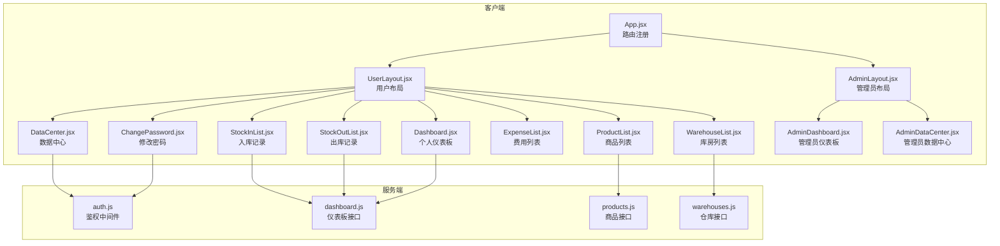

图表来源
- [client/src/App.jsx:32-64](file://client/src/App.jsx#L32-L64)
- [client/src/layouts/UserLayout.jsx:16-161](file://client/src/layouts/UserLayout.jsx#L16-L161)
- [server/middleware/auth.js:5-26](file://server/middleware/auth.js#L5-L26)
- [server/routes/dashboard.js:63-89](file://server/routes/dashboard.js#L63-L89)
- [server/routes/products.js:8-28](file://server/routes/products.js#L8-L28)
- [server/routes/warehouses.js:43-58](file://server/routes/warehouses.js#L43-L58)

章节来源
- [client/src/App.jsx:32-64](file://client/src/App.jsx#L32-L64)
- [client/src/layouts/UserLayout.jsx:55-64](file://client/src/layouts/UserLayout.jsx#L55-L64)

## 核心组件
- 个人仪表板：展示“我录入的商品数”“本月入库/出库/开销总额”及近期操作气泡。
- 商品列表：支持关键词检索、入库/出库快速入口、商品详情与库房分布。
- 入库记录：分页列表、新建入库单、订单详情、打印预览与单项详情。
- 出库记录：分页列表、新建出库单、订单详情、打印预览与单项详情。
- 仓库列表：库房名称/地址/备注/创建时间的分页查询。
- 费用列表：费用名称、分类、支付方式、金额、支付人/收款人、备注等字段维护。
- 数据中心：导出商品/入库/出库/开销明细为Excel。
- 修改密码：旧密码校验、新密码二次确认、提交修改。

章节来源
- [client/src/pages/user/Dashboard.jsx:6-74](file://client/src/pages/user/Dashboard.jsx#L6-L74)
- [client/src/pages/user/ProductList.jsx:6-221](file://client/src/pages/user/ProductList.jsx#L6-L221)
- [client/src/pages/user/StockInList.jsx:6-361](file://client/src/pages/user/StockInList.jsx#L6-L361)
- [client/src/pages/user/StockOutList.jsx:6-387](file://client/src/pages/user/StockOutList.jsx#L6-L387)
- [client/src/pages/user/WarehouseList.jsx:6-43](file://client/src/pages/user/WarehouseList.jsx#L6-L43)
- [client/src/pages/user/ExpenseList.jsx:26-107](file://client/src/pages/user/ExpenseList.jsx#L26-L107)
- [client/src/pages/user/DataCenter.jsx:5-53](file://client/src/pages/user/DataCenter.jsx#L5-L53)
- [client/src/pages/user/ChangePassword.jsx:5-50](file://client/src/pages/user/ChangePassword.jsx#L5-L50)

## 架构总览
用户页面与管理员页面共享鉴权中间件，但接口返回的数据维度不同：
- 用户仪表板接口返回以“当前用户”为维度的统计数据与近期操作。
- 管理员仪表板接口返回全局统计、趋势图与更广范围的操作流。

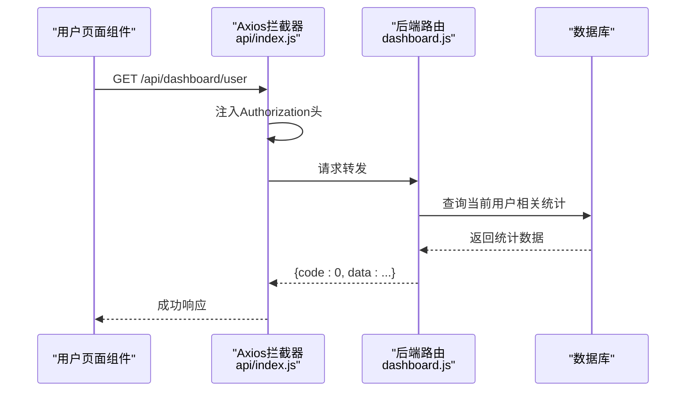

图表来源
- [client/src/api/index.js:9-15](file://client/src/api/index.js#L9-L15)
- [server/routes/dashboard.js:63-89](file://server/routes/dashboard.js#L63-L89)

章节来源
- [client/src/api/index.js:9-15](file://client/src/api/index.js#L9-L15)
- [server/routes/dashboard.js:63-89](file://server/routes/dashboard.js#L63-L89)

## 详细组件分析

### 个人仪表板（Dashboard）
- 数据来源：调用 /api/dashboard/user，返回“我录入的商品数”“本月入库/出库/开销总额”以及近期操作。
- 展示：卡片式统计与“近期操作”气泡列表。
- 体验：加载态、空状态提示、数值本地化显示。

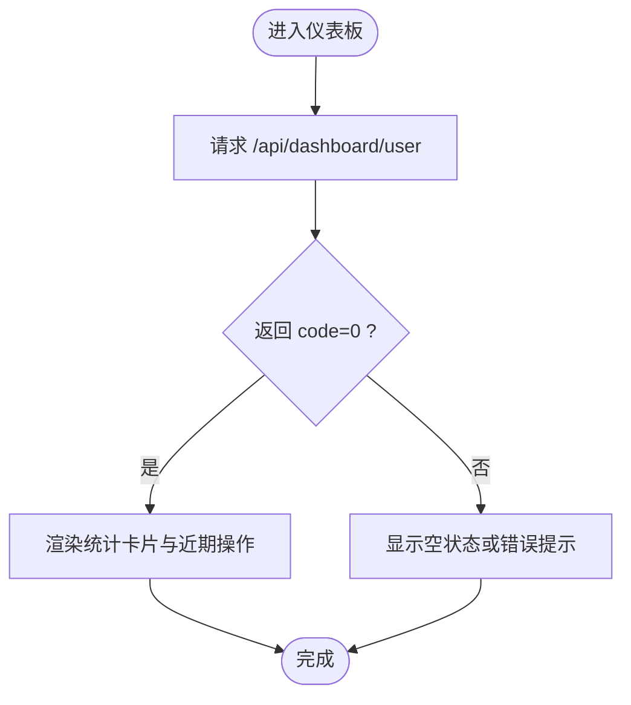

图表来源
- [client/src/pages/user/Dashboard.jsx:12-16](file://client/src/pages/user/Dashboard.jsx#L12-L16)
- [client/src/pages/user/Dashboard.jsx:34-71](file://client/src/pages/user/Dashboard.jsx#L34-L71)

章节来源
- [client/src/pages/user/Dashboard.jsx:6-74](file://client/src/pages/user/Dashboard.jsx#L6-L74)
- [server/routes/dashboard.js:63-89](file://server/routes/dashboard.js#L63-L89)

### 商品列表（ProductList）
- 功能点：分页查询、关键词检索、入库/出库弹窗、商品详情与库房分布。
- 数据流：加载商品列表、异步获取公司/客户/仓库/单号等联动数据、提交入库/出库。
- 交互：Modal 表单、Ant Design 表格、合计计算、详情弹窗。

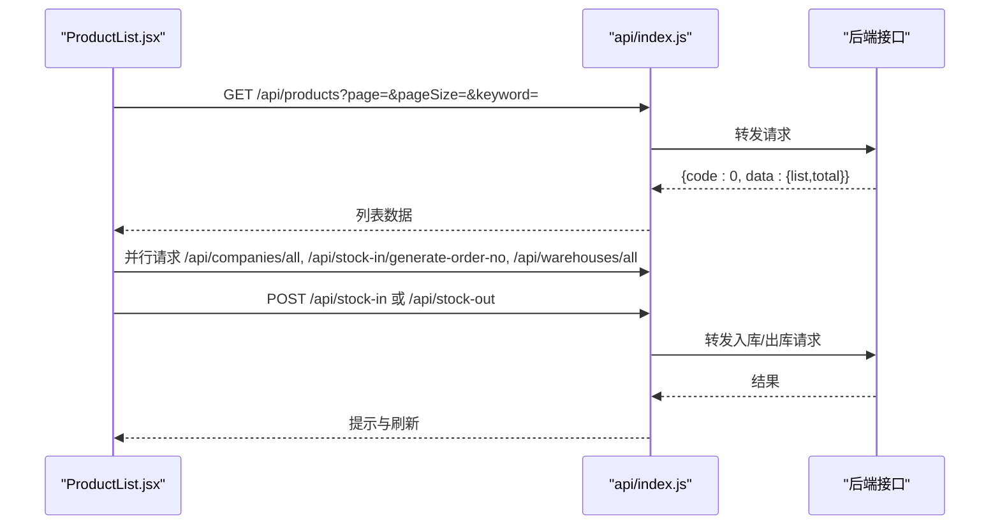

图表来源
- [client/src/pages/user/ProductList.jsx:26-31](file://client/src/pages/user/ProductList.jsx#L26-L31)
- [client/src/pages/user/ProductList.jsx:40-44](file://client/src/pages/user/ProductList.jsx#L40-L44)
- [client/src/pages/user/ProductList.jsx:58-80](file://client/src/pages/user/ProductList.jsx#L58-L80)

章节来源
- [client/src/pages/user/ProductList.jsx:6-221](file://client/src/pages/user/ProductList.jsx#L6-L221)
- [server/routes/products.js:8-28](file://server/routes/products.js#L8-L28)

### 入库记录（StockInList）
- 功能点：分页列表、新建入库单（含商品明细）、订单详情、打印预览、单项详情。
- 数据流：加载列表、打开新建弹窗时并行加载产品/公司/仓库/单号，提交后刷新列表。
- 交互：动态合计、打印区域克隆、预览与打印分离。

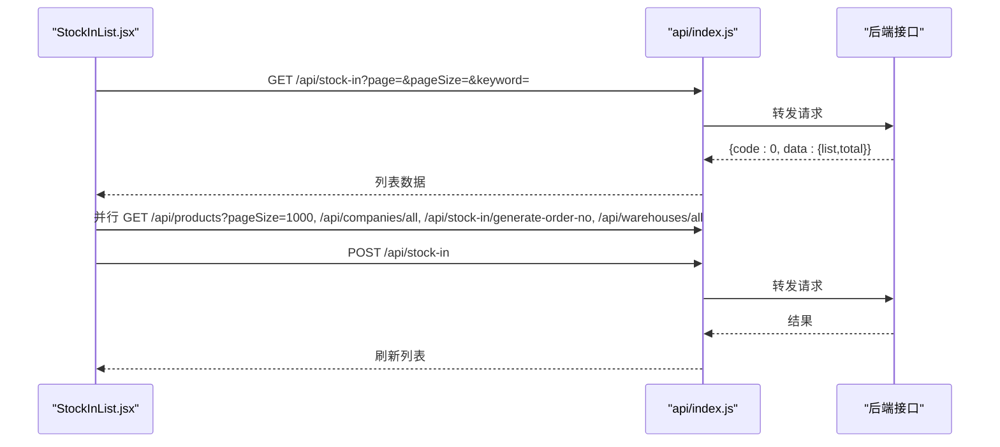

图表来源
- [client/src/pages/user/StockInList.jsx:37-42](file://client/src/pages/user/StockInList.jsx#L37-L42)
- [client/src/pages/user/StockInList.jsx:44-60](file://client/src/pages/user/StockInList.jsx#L44-L60)
- [client/src/pages/user/StockInList.jsx:78-91](file://client/src/pages/user/StockInList.jsx#L78-L91)

章节来源
- [client/src/pages/user/StockInList.jsx:6-361](file://client/src/pages/user/StockInList.jsx#L6-L361)

### 出库记录（StockOutList）
- 功能点：与入库类似，支持新建出库单、订单详情、打印预览、单项详情。
- 特色：根据所选库房动态计算商品可用库存，提升易用性。

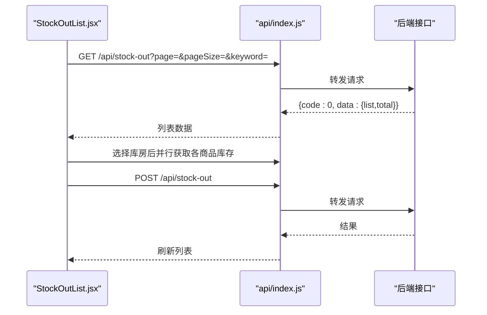

图表来源
- [client/src/pages/user/StockOutList.jsx:38-43](file://client/src/pages/user/StockOutList.jsx#L38-L43)
- [client/src/pages/user/StockOutList.jsx:45-62](file://client/src/pages/user/StockOutList.jsx#L45-L62)
- [client/src/pages/user/StockOutList.jsx:64-76](file://client/src/pages/user/StockOutList.jsx#L64-L76)

章节来源
- [client/src/pages/user/StockOutList.jsx:6-387](file://client/src/pages/user/StockOutList.jsx#L6-L387)

### 仓库列表（WarehouseList）
- 功能点：库房名称/地址/备注/创建时间的分页查询。
- 数据流：关键词检索 + 分页参数，返回列表与总数。

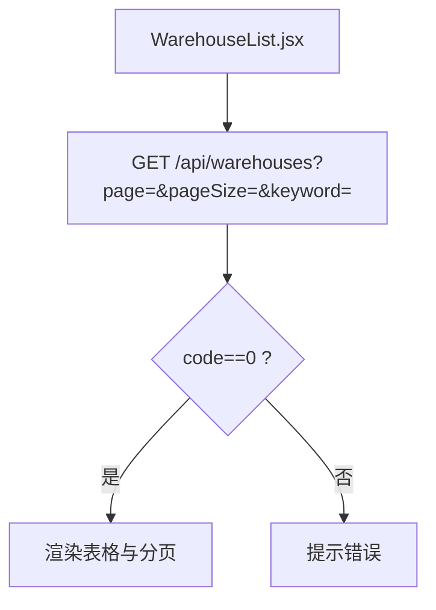

图表来源
- [client/src/pages/user/WarehouseList.jsx:15-20](file://client/src/pages/user/WarehouseList.jsx#L15-L20)
- [client/src/pages/user/WarehouseList.jsx:22-27](file://client/src/pages/user/WarehouseList.jsx#L22-L27)

章节来源
- [client/src/pages/user/WarehouseList.jsx:6-43](file://client/src/pages/user/WarehouseList.jsx#L6-L43)
- [server/routes/warehouses.js:43-58](file://server/routes/warehouses.js#L43-L58)

### 费用列表（ExpenseList）
- 功能点：费用名称、分类、支付方式、金额、支付人/收款人、备注等字段维护；支持新增/编辑/删除。
- 数据流：分页查询、弹窗表单、提交后刷新列表。

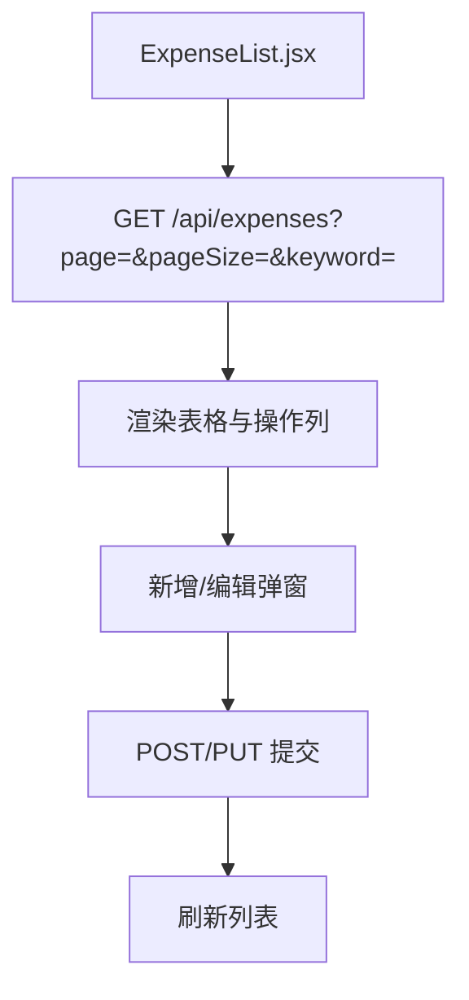

图表来源
- [client/src/pages/user/ExpenseList.jsx:38-43](file://client/src/pages/user/ExpenseList.jsx#L38-L43)
- [client/src/pages/user/ExpenseList.jsx:51-56](file://client/src/pages/user/ExpenseList.jsx#L51-L56)

章节来源
- [client/src/pages/user/ExpenseList.jsx:26-107](file://client/src/pages/user/ExpenseList.jsx#L26-L107)

### 数据中心（DataCenter）
- 功能点：导出商品/入库/出库/开销明细为Excel。
- 数据流：通过 fetch 带 Authorization 头访问 /api/data-center/export/{type}，下载二进制文件。

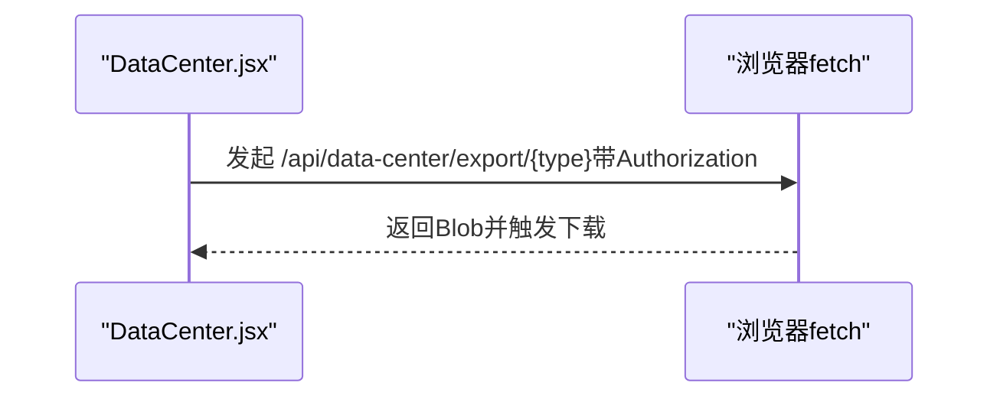

图表来源
- [client/src/pages/user/DataCenter.jsx:6-29](file://client/src/pages/user/DataCenter.jsx#L6-L29)

章节来源
- [client/src/pages/user/DataCenter.jsx:5-53](file://client/src/pages/user/DataCenter.jsx#L5-L53)

### 修改密码（ChangePassword）
- 功能点：旧密码校验、新密码二次确认、提交修改。
- 数据流：表单校验 -> POST /api/auth/change-password -> 成功提示与重置表单。

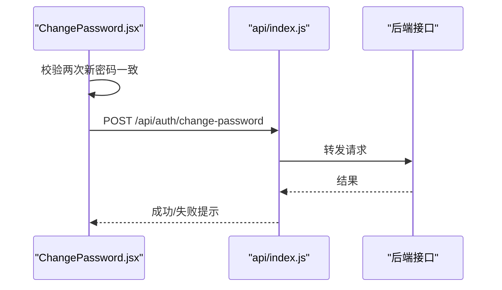

图表来源
- [client/src/pages/user/ChangePassword.jsx:9-26](file://client/src/pages/user/ChangePassword.jsx#L9-L26)

章节来源
- [client/src/pages/user/ChangePassword.jsx:5-50](file://client/src/pages/user/ChangePassword.jsx#L5-L50)

## 依赖关系分析
- 路由与布局：App.jsx 将用户页面挂载到 /user 路由组，UserLayout.jsx 提供菜单与头部。
- 鉴权：所有用户页面接口均受 auth.js 中间件保护，要求 Authorization 头。
- 接口映射：用户页面组件与后端路由一一对应，如 /api/dashboard/user、/api/products、/api/warehouses 等。
- 管理员对比：管理员页面（/admin）拥有更多全局能力（如趋势图、导入导出、备份/恢复），用户页面聚焦日常业务与安全。

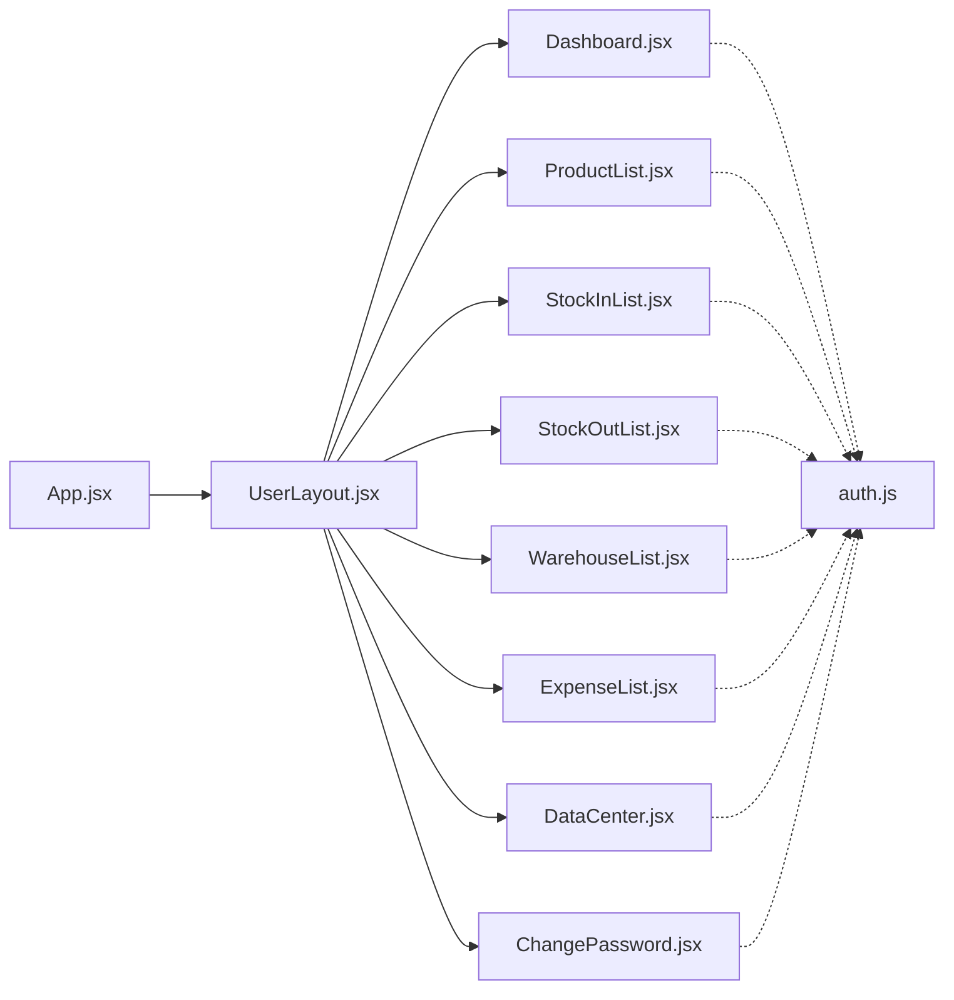

图表来源
- [client/src/App.jsx:50-59](file://client/src/App.jsx#L50-L59)
- [client/src/layouts/UserLayout.jsx:16-161](file://client/src/layouts/UserLayout.jsx#L16-L161)
- [server/middleware/auth.js:5-26](file://server/middleware/auth.js#L5-L26)

章节来源
- [client/src/App.jsx:32-64](file://client/src/App.jsx#L32-L64)
- [client/src/layouts/UserLayout.jsx:55-64](file://client/src/layouts/UserLayout.jsx#L55-L64)
- [server/middleware/auth.js:5-26](file://server/middleware/auth.js#L5-L26)

## 性能考虑
- 并行请求：商品列表在打开入库/出库弹窗时，使用 Promise.all 并行获取联动数据，减少等待时间。
- 分页与懒加载：列表采用分页加载，避免一次性传输大量数据。
- 表单与合计：新建单据时在前端计算小计与合计，降低后端压力。
- 图表与大列表：用户仪表板未包含趋势图，避免额外资源消耗；管理员仪表板包含趋势图，适合管理员使用。

## 故障排查指南
- 登录失效：当后端返回 401 或响应拦截器检测到非 0 code，会清理本地 token 并跳转登录页。
- 导出失败：检查 Authorization 头是否正确注入，确认后端接口可访问且返回二进制数据。
- 权限不足：管理员专属接口（如导入/备份/恢复）在用户页面不可用，若出现 403，属于预期行为。

章节来源
- [client/src/api/index.js:17-39](file://client/src/api/index.js#L17-L39)
- [client/src/pages/user/DataCenter.jsx:6-29](file://client/src/pages/user/DataCenter.jsx#L6-L29)

## 结论
用户页面围绕“日常业务+安全”两条主线构建：业务上覆盖商品、出入库、费用、仓库与数据导出；安全上提供密码修改与统一鉴权。与管理员页面相比，用户页面在功能范围上更为聚焦，强调易用性与效率；在权限控制上严格遵循后端中间件策略，确保数据安全。

## 附录

### 用户页面 vs 管理员页面 差异对照
- 仪表板：用户按“本人”统计，管理员按“全局”统计并提供趋势图。
- 数据中心：用户仅导出明细；管理员提供导入模板、备份/恢复、数据库重置等高级能力。
- 商品管理：用户页面商品接口未暴露删除逻辑（需管理员权限），避免误删风险。

章节来源
- [server/routes/dashboard.js:63-89](file://server/routes/dashboard.js#L63-L89)
- [client/src/pages/admin/Dashboard.jsx:10-122](file://client/src/pages/admin/Dashboard.jsx#L10-L122)
- [client/src/pages/admin/DataCenter.jsx:10-196](file://client/src/pages/admin/DataCenter.jsx#L10-L196)
- [server/routes/products.js:70-95](file://server/routes/products.js#L70-L95)

### 数据获取策略与权限验证机制
- 统一通过 api/index.js 的 axios 实例发起请求，自动注入 Authorization 头。
- 所有用户页面接口均受 auth.js 中间件保护，要求有效 JWT。
- 对外暴露的用户页面接口清单：
  - GET /api/dashboard/user
  - GET /api/products
  - GET /api/warehouses
  - GET /api/stock-in
  - GET /api/stock-out
  - GET /api/expenses
  - POST /api/auth/change-password
  - GET /api/data-center/export/{type}

章节来源
- [client/src/api/index.js:4-15](file://client/src/api/index.js#L4-L15)
- [server/middleware/auth.js:5-26](file://server/middleware/auth.js#L5-L26)
- [client/src/pages/user/DataCenter.jsx:6-29](file://client/src/pages/user/DataCenter.jsx#L6-L29)

### 用户页面开发标准化模板与交互设计规范
- 页面容器：统一使用 .page-container 与 Ant Design Card 包裹，保持视觉一致性。
- 表格与分页：固定列宽、滚动配置、总数展示，保证移动端可读性。
- 弹窗表单：Modal 销毁策略（destroyOnClose）、表单校验、提交状态反馈。
- 操作按钮：区分主次（Primary/Default/Danger），图标与文案结合。
- 加载与错误：统一使用 Spin 与 message 提示，避免白屏与静默失败。
- 菜单与路由：UserLayout 菜单项与路由路径一一对应，便于维护与扩展。