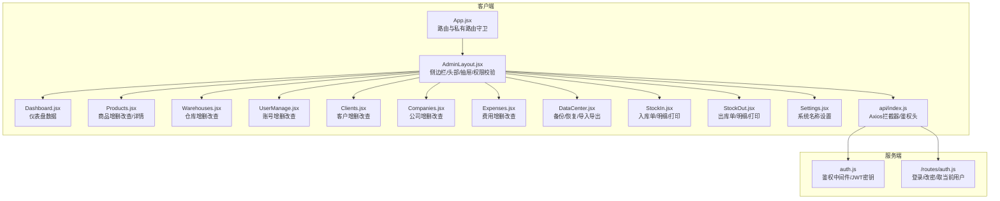
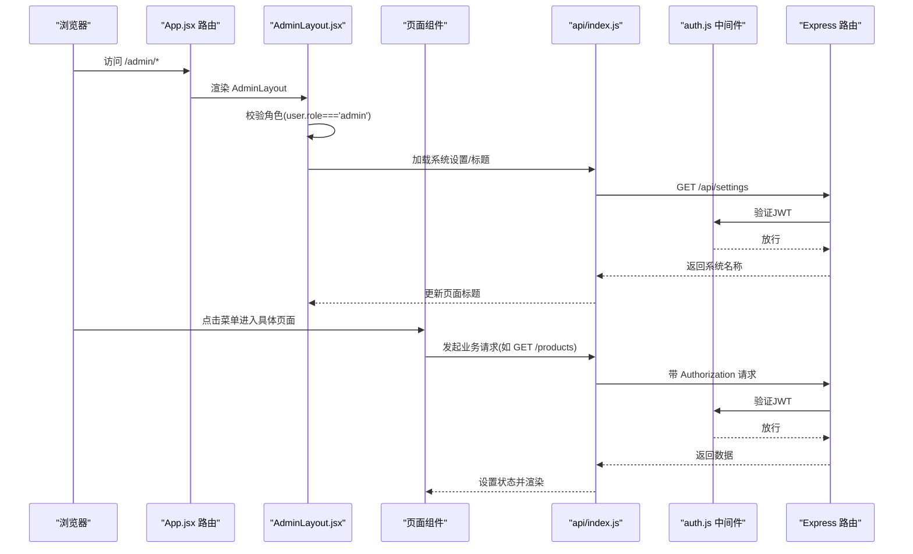
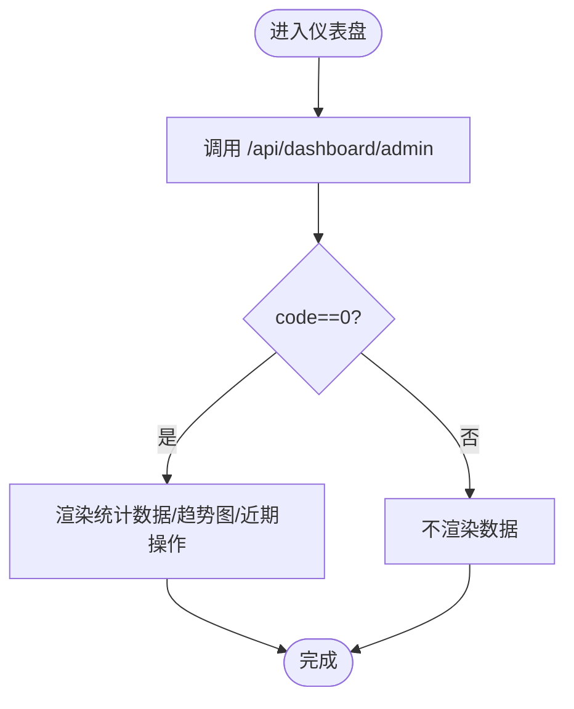
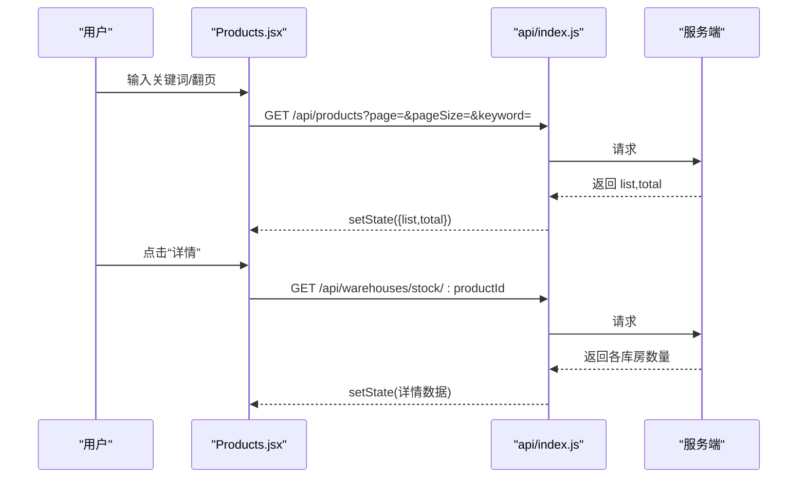
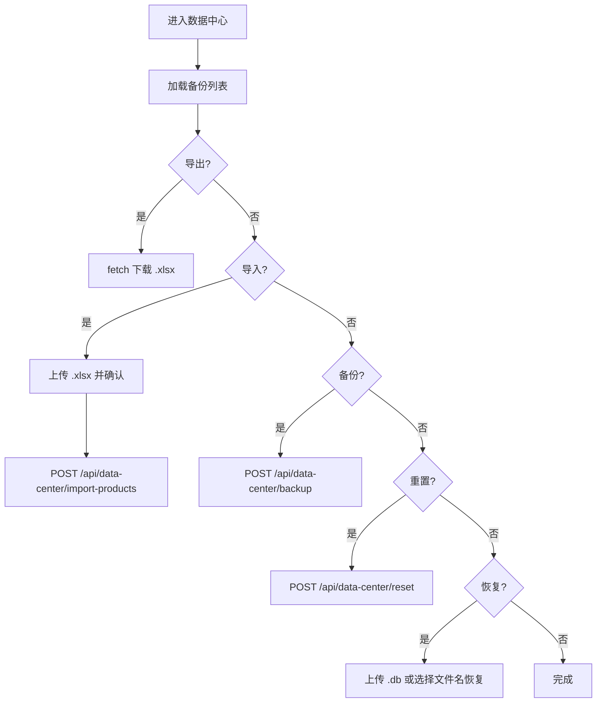
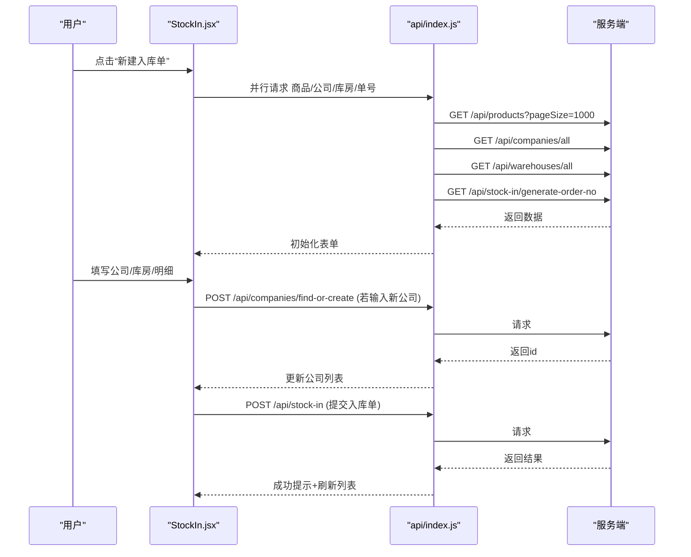
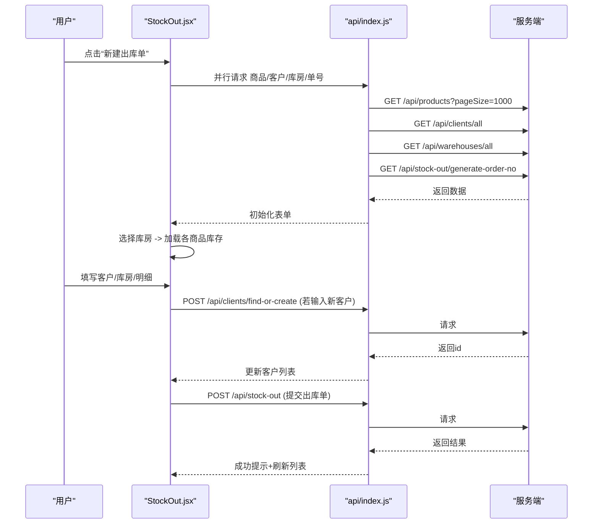
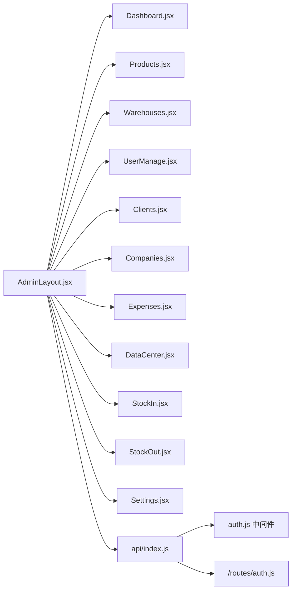

# 管理员页面

<cite>
**本文引用的文件**
- [App.jsx](file://client/src/App.jsx)
- [AdminLayout.jsx](file://client/src/layouts/AdminLayout.jsx)
- [Dashboard.jsx](file://client/src/pages/admin/Dashboard.jsx)
- [Products.jsx](file://client/src/pages/admin/Products.jsx)
- [Warehouses.jsx](file://client/src/pages/admin/Warehouses.jsx)
- [UserManage.jsx](file://client/src/pages/admin/UserManage.jsx)
- [Clients.jsx](file://client/src/pages/admin/Clients.jsx)
- [Companies.jsx](file://client/src/pages/admin/Companies.jsx)
- [Expenses.jsx](file://client/src/pages/admin/Expenses.jsx)
- [DataCenter.jsx](file://client/src/pages/admin/DataCenter.jsx)
- [StockIn.jsx](file://client/src/pages/admin/StockIn.jsx)
- [StockOut.jsx](file://client/src/pages/admin/StockOut.jsx)
- [Settings.jsx](file://client/src/pages/admin/Settings.jsx)
- [api/index.js](file://client/src/api/index.js)
- [auth.js](file://server/middleware/auth.js)
- [auth 路由](file://server/routes/auth.js)
</cite>

## 目录
1. [简介](#简介)
2. [项目结构](#项目结构)
3. [核心组件](#核心组件)
4. [架构总览](#架构总览)
5. [详细组件分析](#详细组件分析)
6. [依赖关系分析](#依赖关系分析)
7. [性能考虑](#性能考虑)
8. [故障排查指南](#故障排查指南)
9. [结论](#结论)
10. [附录](#附录)

## 简介
本文件面向管理员页面的功能与实现，系统性梳理仪表盘、商品管理、库存管理（入库/出库）、用户管理、客户管理、公司管理、费用管理、仓库管理、数据中心（备份/恢复/导入导出）、系统设置等模块。文档涵盖组件结构、数据流、表单验证、状态管理、页面导航与权限控制，并提供最佳实践与排障建议。

## 项目结构
前端采用 React + Ant Design + Recharts 构建，路由基于 react-router-dom；后端基于 Express + JWT 鉴权；前后端通过 /api 前缀通信。

图表来源
- [App.jsx:32-64](file://client/src/App.jsx#L32-L64)
- [AdminLayout.jsx:16-173](file://client/src/layouts/AdminLayout.jsx#L16-L173)
- [api/index.js:4-42](file://client/src/api/index.js#L4-L42)
- [auth.js:1-29](file://server/middleware/auth.js#L1-L29)
- [auth 路由:1-69](file://server/routes/auth.js#L1-L69)

章节来源
- [App.jsx:1-67](file://client/src/App.jsx#L1-L67)
- [AdminLayout.jsx:1-174](file://client/src/layouts/AdminLayout.jsx#L1-L174)
- [api/index.js:1-42](file://client/src/api/index.js#L1-L42)
- [auth.js:1-29](file://server/middleware/auth.js#L1-L29)
- [auth 路由:1-69](file://server/routes/auth.js#L1-L69)

## 核心组件
- 路由与权限
  - 私有路由守卫：检查本地 token，缺失则跳转登录。
  - 管理员布局：进入 /admin 时校验用户角色，非 admin 自动跳转 /user。
- Axios 拦截器：自动注入 Authorization: Bearer token；401 统一登出。
- 页面级状态：分页、搜索关键字、模态框开关、表单字段值、加载状态等。

章节来源
- [App.jsx:26-30](file://client/src/App.jsx#L26-L30)
- [AdminLayout.jsx:36-42](file://client/src/layouts/AdminLayout.jsx#L36-L42)
- [api/index.js:9-39](file://client/src/api/index.js#L9-L39)

## 架构总览
管理员页面整体采用“布局 + 多页面”的结构，页面间通过 AdminLayout 的菜单导航；数据请求统一经 api/index.js 发起，服务端通过 JWT 中间件鉴权，管理员专用接口由 adminMiddleware 保护。

图表来源
- [App.jsx:37-49](file://client/src/App.jsx#L37-L49)
- [AdminLayout.jsx:36-55](file://client/src/layouts/AdminLayout.jsx#L36-L55)
- [api/index.js:9-15](file://client/src/api/index.js#L9-L15)
- [auth.js:5-26](file://server/middleware/auth.js#L5-L26)

## 详细组件分析

### 仪表盘 Dashboard
- 数据来源：GET /api/dashboard/admin
- 展示内容：统计卡片、快捷入口、近7天入库/出库趋势图、近期操作气泡
- 交互：点击快捷入口跳转对应页面；加载中显示大尺寸旋转指示器

图表来源
- [Dashboard.jsx:15-26](file://client/src/pages/admin/Dashboard.jsx#L15-L26)

章节来源
- [Dashboard.jsx:1-123](file://client/src/pages/admin/Dashboard.jsx#L1-L123)

### 商品管理 Products
- 列表：分页、关键词搜索、表格列含名称/规格/单位/数量/单价/操作
- 表单：名称/规格/单位/初始数量/单价/备注；必填校验
- 详情：基础信息、当前库存/单价、记录人/时间、各库房库存分布
- 操作：新增/编辑/删除；删除二次确认；提交前表单校验

图表来源
- [Products.jsx:19-46](file://client/src/pages/admin/Products.jsx#L19-L46)

章节来源
- [Products.jsx:1-134](file://client/src/pages/admin/Products.jsx#L1-L134)

### 仓库管理 Warehouses
- 列表：名称/地址/备注/创建时间/操作
- 表单：名称/地址/备注；名称必填
- 操作：新增/编辑/删除；删除二次确认

章节来源
- [Warehouses.jsx:1-82](file://client/src/pages/admin/Warehouses.jsx#L1-L82)

### 用户管理 UserManage
- 列表：账号/使用人/电话/权限/创建时间/操作
- 表单：账号/密码(新增必填)/使用人/电话/权限(默认user)
- 操作：新增/编辑；默认账号不可删除；删除二次确认

章节来源
- [UserManage.jsx:1-77](file://client/src/pages/admin/UserManage.jsx#L1-L77)

### 客户管理 Clients
- 列表：客户单位/统一社会信用代码/地址/联系人/电话/备注/操作
- 表单：名称/信用代码/地址/联系人/电话/备注
- 操作：新增/编辑/删除；删除二次确认

章节来源
- [Clients.jsx:1-77](file://client/src/pages/admin/Clients.jsx#L1-L77)

### 公司管理 Companies
- 列表：公司名称/统一社会信用代码/地址/联系人/电话/备注/操作
- 表单：名称/信用代码/地址/联系人/电话/备注
- 操作：新增/编辑/删除；删除二次确认

章节来源
- [Companies.jsx:1-77](file://client/src/pages/admin/Companies.jsx#L1-L77)

### 费用管理 Expenses
- 列表：名称/分类/支付方式/金额/支付人/加给谁/备注/记录人/时间/操作
- 表单：名称/分类/支付方式/金额/支付人/加给谁/备注
- 操作：新增/编辑/删除；删除二次确认

章节来源
- [Expenses.jsx:1-107](file://client/src/pages/admin/Expenses.jsx#L1-L107)

### 仓库管理 Warehouses（管理员）
- 列表：名称/地址/备注/创建时间/操作
- 表单：名称/地址/备注；名称必填
- 操作：新增/编辑/删除；删除二次确认

章节来源
- [Warehouses.jsx:1-82](file://client/src/pages/admin/Warehouses.jsx#L1-L82)

### 数据中心 DataCenter
- 功能：导出商品/入库/出库/开销明细；导入商品模板下载与Excel导入；数据库备份/重置/按文件恢复；列出已有备份文件
- 导出：通过 fetch + Authorization Bearer 下载 .xlsx
- 导入：上传 .xlsx，确认后调用 /api/data-center/import-products
- 备份/恢复：POST /api/data-center/backup /api/data-center/restore
- 重置：POST /api/data-center/reset

图表来源
- [DataCenter.jsx:15-57](file://client/src/pages/admin/DataCenter.jsx#L15-L57)
- [DataCenter.jsx:104-132](file://client/src/pages/admin/DataCenter.jsx#L104-L132)
- [DataCenter.jsx:135-193](file://client/src/pages/admin/DataCenter.jsx#L135-L193)

章节来源
- [DataCenter.jsx:1-197](file://client/src/pages/admin/DataCenter.jsx#L1-L197)

### 入库管理 StockIn
- 单据：单号/公司/库房/种类/数量/金额/操作员/时间/详情
- 表单：供应商公司（可自动创建）/目标库房（可自动创建）/商品明细（商品/单位/单价/数量/小计/备注）
- 详情：订单明细/打印预览/商品入库详情（前后库存对比）
- 提交：校验明细有效性；异步解析公司/库房实体；POST /api/stock-in

图表来源
- [StockIn.jsx:45-61](file://client/src/pages/admin/StockIn.jsx#L45-L61)
- [StockIn.jsx:79-93](file://client/src/pages/admin/StockIn.jsx#L79-L93)
- [StockIn.jsx:95-112](file://client/src/pages/admin/StockIn.jsx#L95-L112)

章节来源
- [StockIn.jsx:1-418](file://client/src/pages/admin/StockIn.jsx#L1-L418)

### 出库管理 StockOut
- 单据：单号/客户/库房/种类/数量/金额/操作员/时间/详情
- 表单：客户单位（可自动创建）/出货库房/商品明细（带库存提示）
- 详情：订单明细/打印预览/商品出库详情（前后库存对比）
- 提交：校验库房与明细；解析客户；POST /api/stock-out

图表来源
- [StockOut.jsx:45-62](file://client/src/pages/admin/StockOut.jsx#L45-L62)
- [StockOut.jsx:64-78](file://client/src/pages/admin/StockOut.jsx#L64-L78)
- [StockOut.jsx:96-111](file://client/src/pages/admin/StockOut.jsx#L96-L111)
- [StockOut.jsx:113-127](file://client/src/pages/admin/StockOut.jsx#L113-L127)

章节来源
- [StockOut.jsx:1-422](file://client/src/pages/admin/StockOut.jsx#L1-L422)

### 系统设置 Settings
- 表单：系统名称（必填）
- 提交：PUT /api/settings/system-name
- 同步：更新成功后调用父布局上下文 refreshSettings，刷新页面标题

章节来源
- [Settings.jsx:1-52](file://client/src/pages/admin/Settings.jsx#L1-L52)
- [AdminLayout.jsx:49-55](file://client/src/layouts/AdminLayout.jsx#L49-L55)

## 依赖关系分析
- 组件耦合
  - AdminLayout 作为容器，向下透传系统名称与刷新函数，减少重复请求。
  - 各业务页面共享 api/index.js，统一处理鉴权头与401登出。
- 外部依赖
  - Ant Design：布局、菜单、表单、弹窗、标签、统计组件。
  - Recharts：趋势图展示。
  - Axios：HTTP 客户端与拦截器。
- 服务端依赖
  - JWT：登录签发与校验；管理员权限校验。
  - bcrypt：密码哈希存储与比对。

图表来源
- [AdminLayout.jsx:16-173](file://client/src/layouts/AdminLayout.jsx#L16-L173)
- [api/index.js:4-42](file://client/src/api/index.js#L4-L42)
- [auth.js:1-29](file://server/middleware/auth.js#L1-L29)
- [auth 路由:1-69](file://server/routes/auth.js#L1-L69)

章节来源
- [AdminLayout.jsx:1-174](file://client/src/layouts/AdminLayout.jsx#L1-L174)
- [api/index.js:1-42](file://client/src/api/index.js#L1-L42)
- [auth.js:1-29](file://server/middleware/auth.js#L1-L29)
- [auth 路由:1-69](file://server/routes/auth.js#L1-L69)

## 性能考虑
- 列表分页与搜索：每页固定条数，避免一次性拉取大量数据。
- 并行初始化：入库/出库在打开表单时并行加载商品、公司/客户、库房、单号，缩短首屏等待。
- 表单计算：明细小计在前端实时计算，减少服务器压力。
- 图表渲染：趋势图响应式容器，避免溢出与重绘抖动。
- 缓存策略：利用 Ant Design 表单与组件内部状态，减少无效渲染。

## 故障排查指南
- 登录失效/401
  - 现象：请求返回 401，自动清空 token 并跳转登录。
  - 排查：确认 Authorization 头是否正确携带；核对 JWT 是否过期。
- 权限不足
  - 现象：返回 403，提示需要管理员权限。
  - 排查：确认用户角色为 admin；检查中间件 adminMiddleware 生效。
- 请求失败
  - 现象：统一错误提示“网络错误”或后端 message。
  - 排查：查看网络面板与后端日志；确认 /api 前缀与跨域配置。
- 导入/导出异常
  - 现象：导入模板下载失败、导入确认后报错、导出失败。
  - 排查：确认 token 存在且有效；检查服务端路径与文件权限；确保 .xlsx 格式正确。
- 打印预览
  - 现象：打印区域为空或样式异常。
  - 排查：确认打印区域 DOM 已克隆；打印前确保数据已加载。

章节来源
- [api/index.js:17-39](file://client/src/api/index.js#L17-L39)
- [auth.js:21-26](file://server/middleware/auth.js#L21-L26)
- [DataCenter.jsx:20-39](file://client/src/pages/admin/DataCenter.jsx#L20-L39)

## 结论
管理员页面以 AdminLayout 为核心容器，围绕数据管理与业务流程构建了完整的后台体系。通过统一的鉴权与拦截器、清晰的页面职责划分以及良好的表单与状态管理，实现了高可用与易维护的后台体验。建议持续优化大数据量场景下的分页与搜索、增强导入导出的容错与进度反馈，并完善审计日志与权限最小化实践。

## 附录
- 最佳实践
  - 表单校验前置：在提交前 validateFields，减少无效请求。
  - 并行加载：初始化表单时并行请求多源数据，提升用户体验。
  - 错误提示：统一使用 message.error 与后端 message，保持一致性。
  - 权限控制：所有管理员敏感接口均通过 adminMiddleware 保护。
  - 数据一致性：入库/出库提交前解析实体（公司/客户/库房），必要时自动创建并缓存结果。