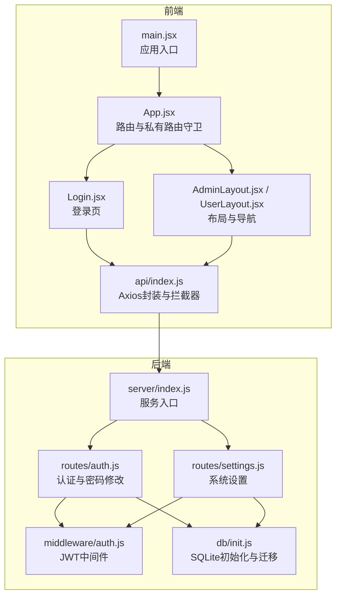
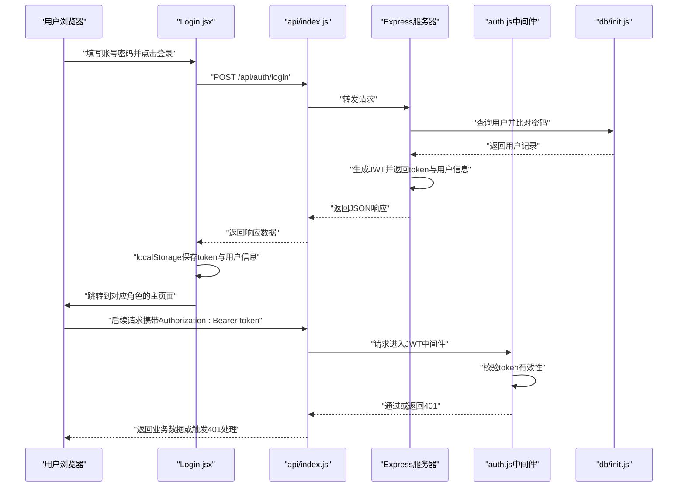
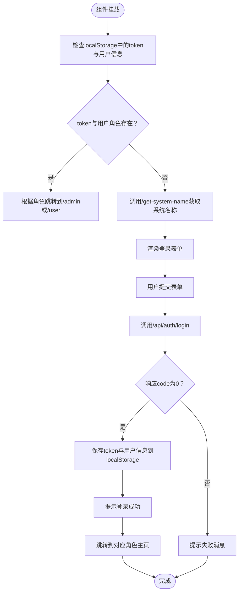
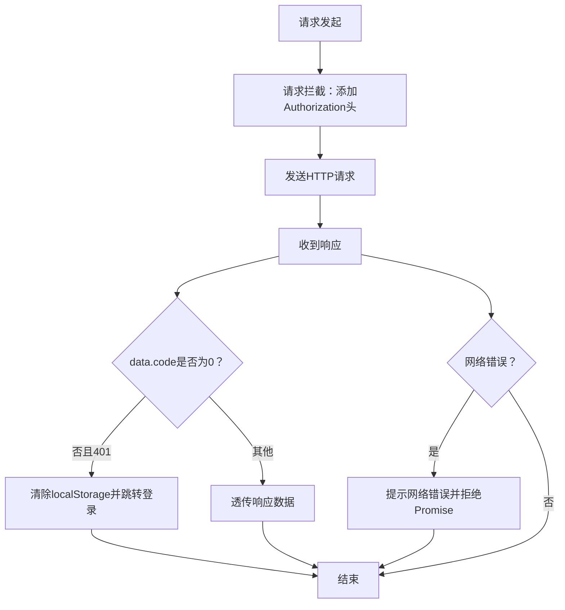
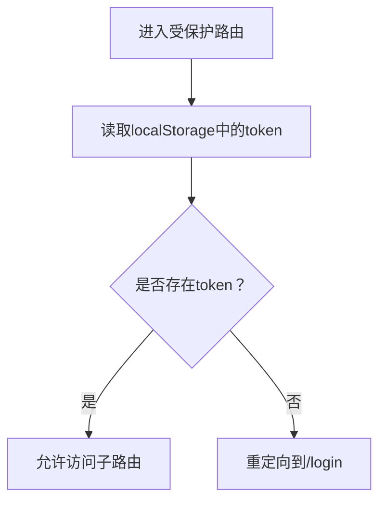
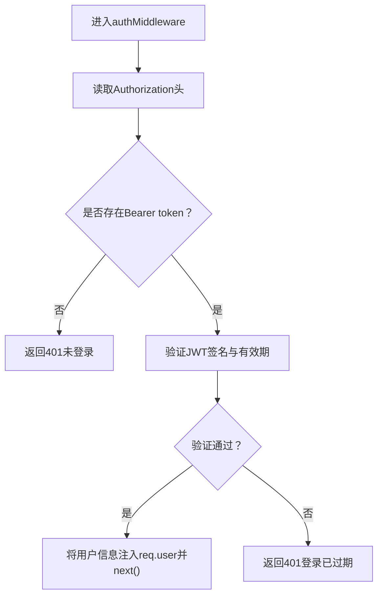
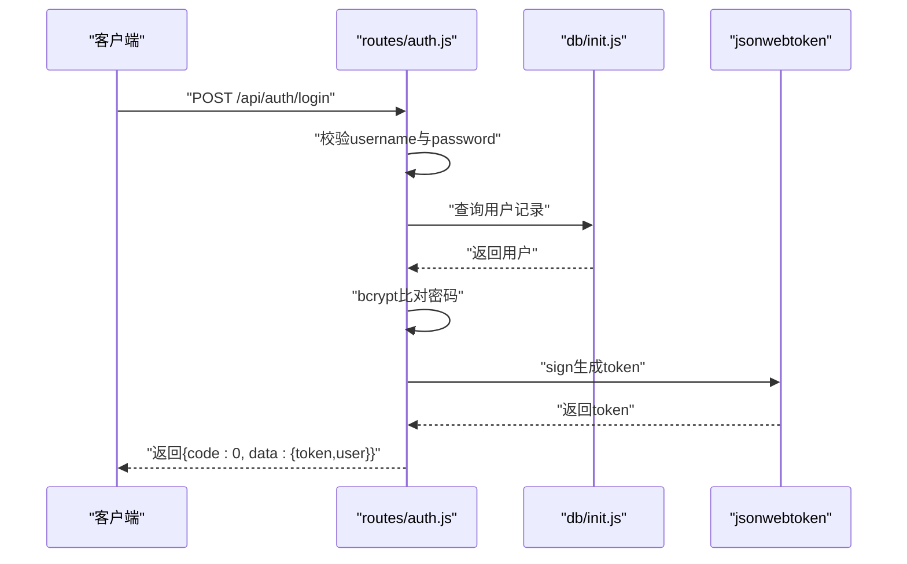
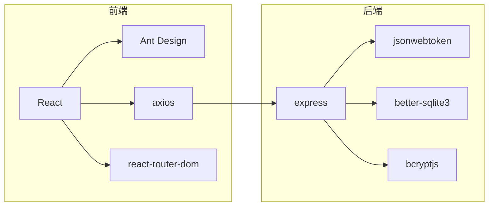

# 认证页面

<cite>
**本文档引用的文件**
- [client/src/pages/Login.jsx](file://client/src/pages/Login.jsx)
- [client/src/api/index.js](file://client/src/api/index.js)
- [client/src/App.jsx](file://client/src/App.jsx)
- [client/src/main.jsx](file://client/src/main.jsx)
- [client/src/layouts/AdminLayout.jsx](file://client/src/layouts/AdminLayout.jsx)
- [client/src/layouts/UserLayout.jsx](file://client/src/layouts/UserLayout.jsx)
- [server/routes/auth.js](file://server/routes/auth.js)
- [server/middleware/auth.js](file://server/middleware/auth.js)
- [server/db/init.js](file://server/db/init.js)
- [server/routes/settings.js](file://server/routes/settings.js)
</cite>

## 目录
1. [简介](#简介)
2. [项目结构](#项目结构)
3. [核心组件](#核心组件)
4. [架构总览](#架构总览)
5. [详细组件分析](#详细组件分析)
6. [依赖关系分析](#依赖关系分析)
7. [性能考量](#性能考量)
8. [故障排查指南](#故障排查指南)
9. [结论](#结论)

## 简介
本文件聚焦于认证页面组件的实现与最佳实践，涵盖登录表单设计、用户名密码验证逻辑、JWT 令牌处理机制、登录状态管理与错误处理策略。文档同时总结了认证流程中的安全考虑、输入验证规则以及用户体验优化建议，并给出组件结构、事件处理与状态管理的实施要点及失败处理与安全防护的实现细节。

## 项目结构
该系统采用前后端分离架构：
- 前端使用 React + Ant Design，路由基于 react-router-dom，API 通过 axios 封装并统一注入鉴权头。
- 后端使用 Express + better-sqlite3，提供认证、密码修改、用户信息查询与系统设置等接口，采用 JWT 中间件进行请求拦截与权限控制。

图表来源
- [client/src/main.jsx:1-14](file://client/src/main.jsx#L1-L14)
- [client/src/App.jsx:32-67](file://client/src/App.jsx#L32-L67)
- [client/src/pages/Login.jsx:1-68](file://client/src/pages/Login.jsx#L1-L68)
- [client/src/api/index.js:1-42](file://client/src/api/index.js#L1-L42)
- [client/src/layouts/AdminLayout.jsx:16-174](file://client/src/layouts/AdminLayout.jsx#L16-L174)
- [client/src/layouts/UserLayout.jsx:16-162](file://client/src/layouts/UserLayout.jsx#L16-L162)
- [server/routes/auth.js:1-69](file://server/routes/auth.js#L1-L69)
- [server/routes/settings.js:1-34](file://server/routes/settings.js#L1-L34)
- [server/middleware/auth.js:1-29](file://server/middleware/auth.js#L1-L29)
- [server/db/init.js:1-217](file://server/db/init.js#L1-L217)

章节来源
- [client/src/main.jsx:1-14](file://client/src/main.jsx#L1-L14)
- [client/src/App.jsx:32-67](file://client/src/App.jsx#L32-L67)
- [client/src/pages/Login.jsx:1-68](file://client/src/pages/Login.jsx#L1-L68)
- [client/src/api/index.js:1-42](file://client/src/api/index.js#L1-L42)
- [client/src/layouts/AdminLayout.jsx:16-174](file://client/src/layouts/AdminLayout.jsx#L16-L174)
- [client/src/layouts/UserLayout.jsx:16-162](file://client/src/layouts/UserLayout.jsx#L16-L162)
- [server/routes/auth.js:1-69](file://server/routes/auth.js#L1-L69)
- [server/routes/settings.js:1-34](file://server/routes/settings.js#L1-L34)
- [server/middleware/auth.js:1-29](file://server/middleware/auth.js#L1-L29)
- [server/db/init.js:1-217](file://server/db/init.js#L1-L217)

## 核心组件
- 登录页组件：负责表单渲染、输入校验、提交处理、本地存储与跳转。
- Axios 封装与拦截器：统一添加 Authorization 头、处理 401 重定向、全局错误提示。
- 路由守卫与私有路由：根据本地 token 决定是否放行到受保护页面。
- JWT 中间件：从请求头解析并验证 token，支持角色权限控制。
- 数据库初始化与迁移：创建用户表、系统设置表、默认管理员账号与系统名称。

章节来源
- [client/src/pages/Login.jsx:7-68](file://client/src/pages/Login.jsx#L7-L68)
- [client/src/api/index.js:4-42](file://client/src/api/index.js#L4-L42)
- [client/src/App.jsx:26-30](file://client/src/App.jsx#L26-L30)
- [server/middleware/auth.js:5-26](file://server/middleware/auth.js#L5-L26)
- [server/db/init.js:18-214](file://server/db/init.js#L18-L214)

## 架构总览
认证流程的关键交互如下：
- 前端登录页提交用户名与密码至后端认证接口。
- 后端验证用户凭据，签发 JWT 并返回 token 与用户信息。
- 前端将 token 存入 localStorage，并在后续请求中通过 axios 拦截器自动附加 Authorization 头。
- 后端 JWT 中间件验证 token，缺失或过期则返回 401。
- 前端拦截响应 401，清理本地存储并跳转登录页。

图表来源
- [client/src/pages/Login.jsx:27-43](file://client/src/pages/Login.jsx#L27-L43)
- [client/src/api/index.js:9-39](file://client/src/api/index.js#L9-L39)
- [server/routes/auth.js:9-40](file://server/routes/auth.js#L9-L40)
- [server/middleware/auth.js:5-19](file://server/middleware/auth.js#L5-L19)
- [server/db/init.js:197-205](file://server/db/init.js#L197-L205)

## 详细组件分析

### 登录页组件 Login.jsx
- 表单设计与输入验证
  - 使用 Ant Design 的 Form 组件，用户名与密码字段配置必填规则。
  - 密码输入使用 Input.Password，避免明文显示。
- 加载状态与用户体验
  - 提交过程中设置 loading，按钮禁用，提升反馈体验。
- 首次加载与自动跳转
  - 组件挂载时读取本地 token 与用户信息，若存在且角色有效则直接跳转到对应角色主页。
  - 通过公开接口获取系统名称并更新页面标题。
- 登录提交处理
  - 调用 api.post 提交登录请求，成功后写入 token 与用户信息，提示成功并跳转。
  - 失败时提示错误消息；异常捕获统一提示“登录失败”。

图表来源
- [client/src/pages/Login.jsx:12-25](file://client/src/pages/Login.jsx#L12-L25)
- [client/src/pages/Login.jsx:27-43](file://client/src/pages/Login.jsx#L27-L43)

章节来源
- [client/src/pages/Login.jsx:7-68](file://client/src/pages/Login.jsx#L7-L68)

### Axios 封装与拦截器 api/index.js
- 请求拦截
  - 若存在 token，则在请求头添加 Authorization: Bearer token。
- 响应拦截
  - 当响应 data.code 不为 0 时透传数据（便于业务层处理）。
  - 当响应状态为 401 或拦截器抛出 401 错误时，清除本地 token 与用户信息，并跳转到登录页。
  - 对网络错误进行统一提示并拒绝 Promise。

图表来源
- [client/src/api/index.js:9-39](file://client/src/api/index.js#L9-L39)

章节来源
- [client/src/api/index.js:1-42](file://client/src/api/index.js#L1-L42)

### 路由守卫与私有路由 App.jsx
- 私有路由组件
  - 读取 localStorage 中的 token，若不存在则重定向到登录页。
- 应用路由
  - 定义 /login、/admin、/user 等路径，结合私有路由守卫保证访问控制。

图表来源
- [client/src/App.jsx:26-30](file://client/src/App.jsx#L26-L30)
- [client/src/App.jsx:32-67](file://client/src/App.jsx#L32-L67)

章节来源
- [client/src/App.jsx:26-30](file://client/src/App.jsx#L26-L30)
- [client/src/App.jsx:32-67](file://client/src/App.jsx#L32-L67)

### JWT 中间件与权限控制 middleware/auth.js
- 令牌提取
  - 仅从 Authorization 头解析 Bearer token，避免通过 URL 参数传递导致日志泄露。
- 令牌验证
  - 使用密钥验证 token，成功则将用户信息注入 req.user，继续后续处理；失败返回 401。
- 角色控制
  - 提供 adminMiddleware，非管理员返回 403。

图表来源
- [server/middleware/auth.js:5-19](file://server/middleware/auth.js#L5-L19)

章节来源
- [server/middleware/auth.js:1-29](file://server/middleware/auth.js#L1-L29)

### 认证与密码修改接口 routes/auth.js
- 登录接口
  - 校验必填参数，查询用户并比对密码，成功后签发带过期时间的 JWT，返回 token 与用户信息。
- 修改密码接口
  - 需要登录态，校验原密码与新密码长度，成功后更新用户密码。
- 获取当前用户信息接口
  - 返回用户基本信息。

图表来源
- [server/routes/auth.js:9-40](file://server/routes/auth.js#L9-L40)
- [server/db/init.js:197-205](file://server/db/init.js#L197-L205)

章节来源
- [server/routes/auth.js:1-69](file://server/routes/auth.js#L1-L69)
- [server/db/init.js:197-205](file://server/db/init.js#L197-L205)

### 系统设置接口 routes/settings.js
- 公开接口：获取系统名称（无需登录）。
- 受保护接口：获取系统设置、更新系统名称（需登录且管理员）。

章节来源
- [server/routes/settings.js:1-34](file://server/routes/settings.js#L1-L34)

### 布局组件与登出行为 AdminLayout.jsx / UserLayout.jsx
- 布局组件负责移动端/桌面端侧边栏、头部用户信息展示与菜单导航。
- 登出操作：移除本地 token 与用户信息并跳转到登录页。

章节来源
- [client/src/layouts/AdminLayout.jsx:75-79](file://client/src/layouts/AdminLayout.jsx#L75-L79)
- [client/src/layouts/UserLayout.jsx:66-70](file://client/src/layouts/UserLayout.jsx#L66-L70)

## 依赖关系分析
- 前端依赖
  - React + Ant Design：提供 UI 组件与表单校验能力。
  - axios：封装 HTTP 请求，统一拦截器处理鉴权与错误。
  - react-router-dom：路由与私有路由守卫。
- 后端依赖
  - express：路由与中间件。
  - jsonwebtoken：JWT 签发与验证。
  - better-sqlite3：轻量级数据库，配合初始化脚本与迁移逻辑。
  - bcryptjs：密码哈希与比对。

图表来源
- [client/src/pages/Login.jsx:1-6](file://client/src/pages/Login.jsx#L1-L6)
- [client/src/api/index.js:1-7](file://client/src/api/index.js#L1-L7)
- [client/src/App.jsx:2-6](file://client/src/App.jsx#L2-L6)
- [server/routes/auth.js:1-6](file://server/routes/auth.js#L1-L6)
- [server/middleware/auth.js:1-3](file://server/middleware/auth.js#L1-L3)
- [server/db/init.js:1-4](file://server/db/init.js#L1-L4)

章节来源
- [client/src/pages/Login.jsx:1-6](file://client/src/pages/Login.jsx#L1-L6)
- [client/src/api/index.js:1-7](file://client/src/api/index.js#L1-L7)
- [client/src/App.jsx:2-6](file://client/src/App.jsx#L2-L6)
- [server/routes/auth.js:1-6](file://server/routes/auth.js#L1-L6)
- [server/middleware/auth.js:1-3](file://server/middleware/auth.js#L1-L3)
- [server/db/init.js:1-4](file://server/db/init.js#L1-L4)

## 性能考量
- 请求超时与并发
  - axios 设置了合理的超时时间，避免长时间阻塞。
- 本地存储与缓存
  - token 与用户信息存储在 localStorage，减少重复登录成本；注意跨标签页同步问题。
- 响应拦截与错误处理
  - 统一处理 401 与网络错误，避免重复弹窗与无意义的重试。
- 路由守卫与懒加载
  - 受保护路由在进入前检查 token，减少无效渲染。

## 故障排查指南
- 登录失败
  - 检查用户名与密码是否为空；确认后端接口返回的错误码与消息。
  - 查看前端控制台是否有网络错误或 CORS 问题。
- 401 未登录/登录已过期
  - 前端拦截器会自动清除本地 token 并跳转登录页；确认 Authorization 头是否正确附加。
  - 后端 JWT 密钥与签名算法一致，确保客户端与服务端配置相同。
- 页面无法访问受保护内容
  - 确认 localStorage 中 token 是否存在；检查路由守卫逻辑。
- 系统名称不显示
  - 检查 /api/settings/system-name 接口是否正常；确认数据库 settings 表中存在 system_name。

章节来源
- [client/src/api/index.js:17-39](file://client/src/api/index.js#L17-L39)
- [client/src/App.jsx:26-30](file://client/src/App.jsx#L26-L30)
- [server/routes/settings.js:7-11](file://server/routes/settings.js#L7-L11)
- [server/db/init.js:207-211](file://server/db/init.js#L207-L211)

## 结论
该认证页面组件以简洁清晰的方式实现了完整的登录流程：从前端表单校验、提交处理，到后端凭据验证与 JWT 签发，再到前端拦截器统一鉴权与错误处理。配合路由守卫与布局组件，形成了良好的用户体验与安全边界。建议在生产环境中进一步强化安全配置（如 HTTPS、CSRF 防护、更严格的密码策略与登录限制），并持续优化错误提示与日志记录以便快速定位问题。