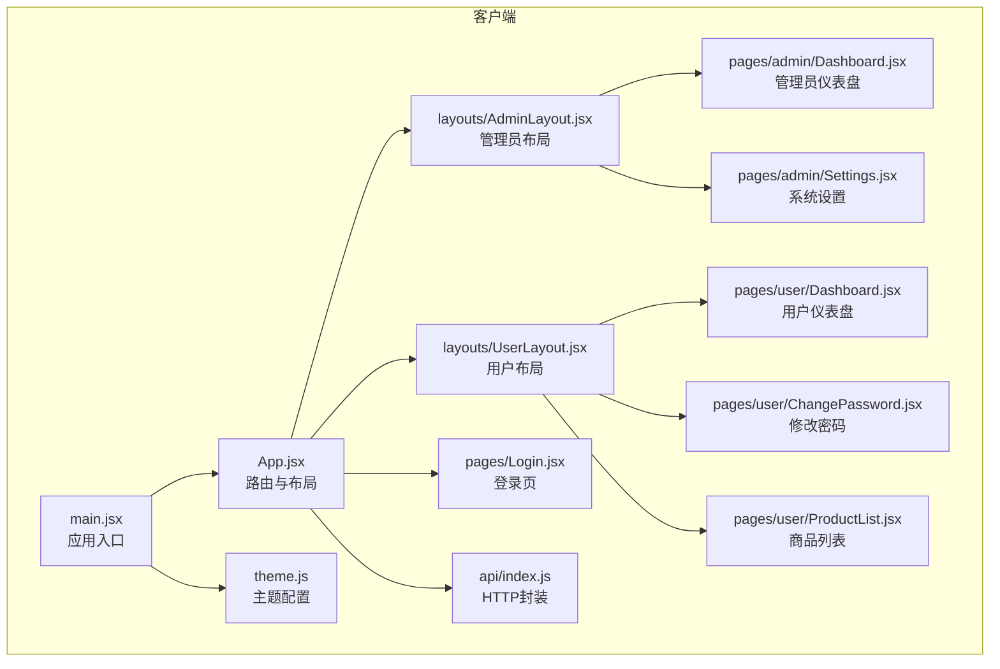
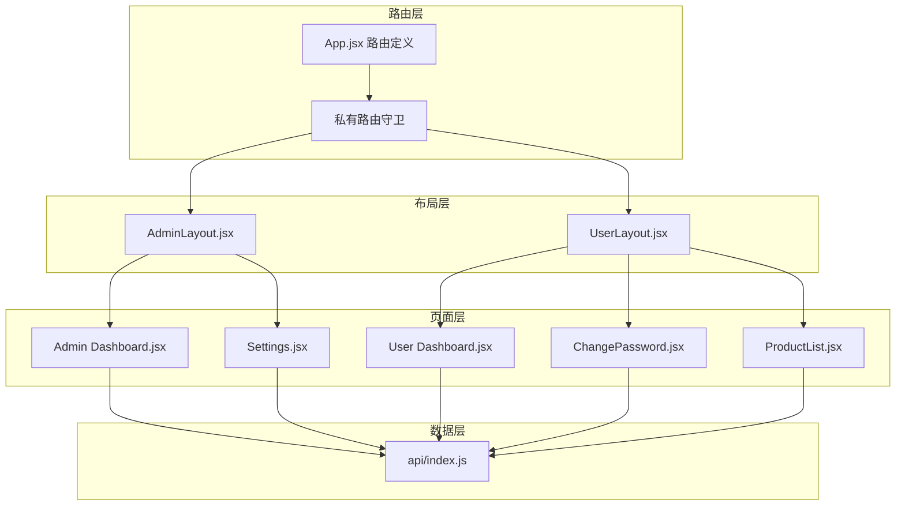
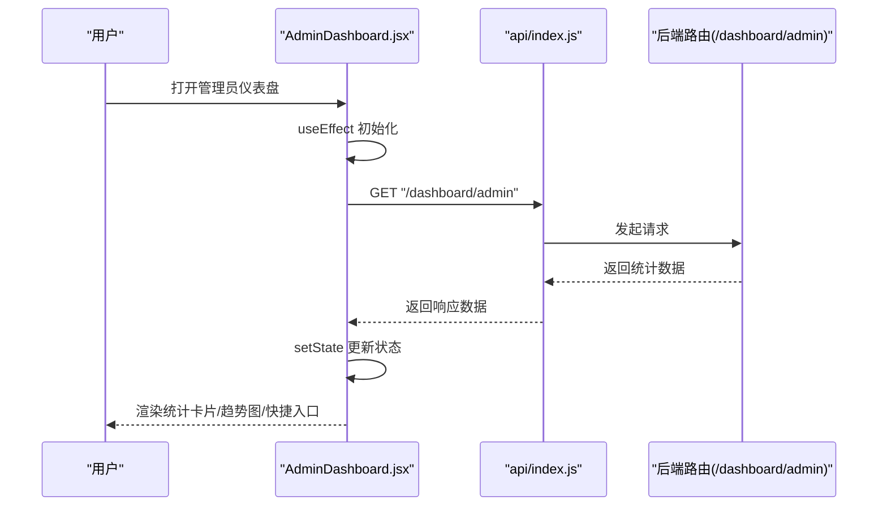
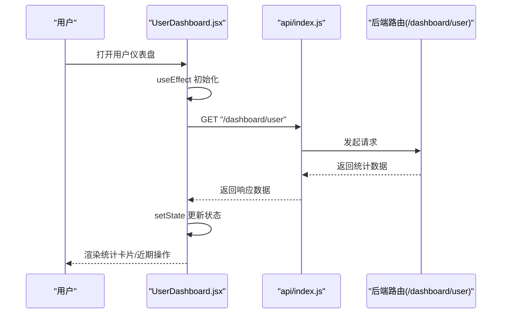
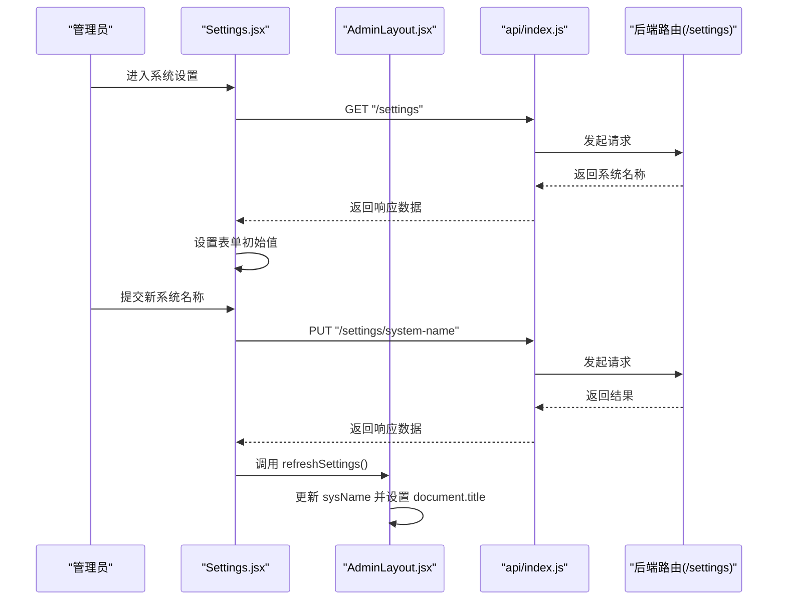
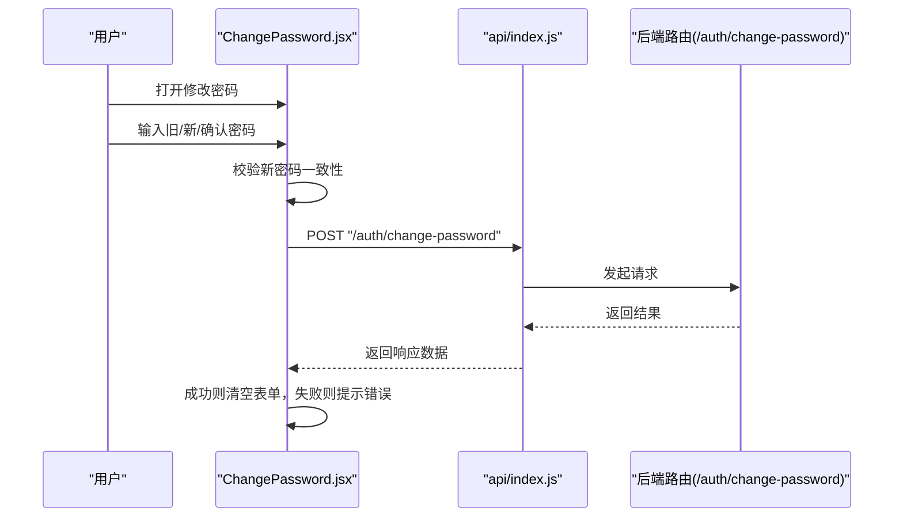
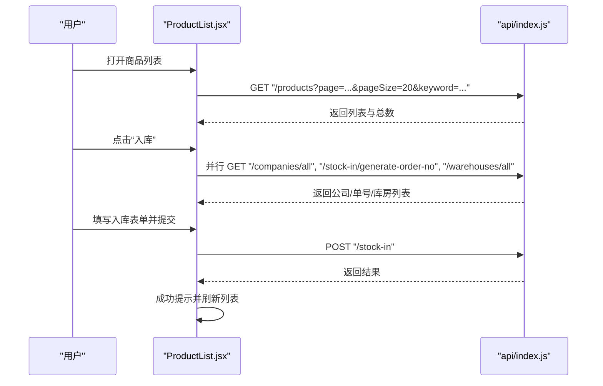
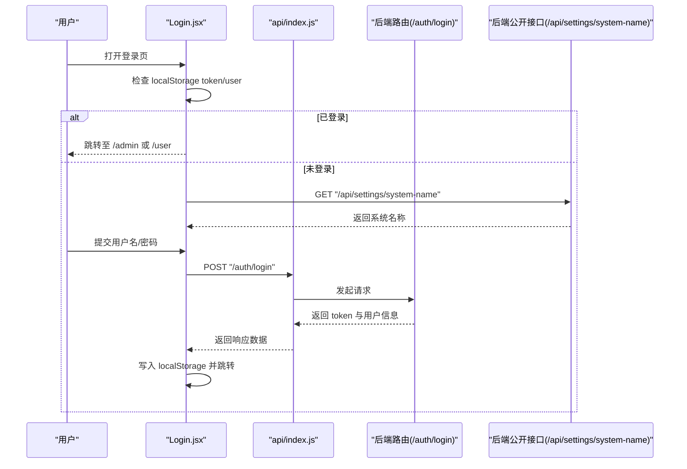
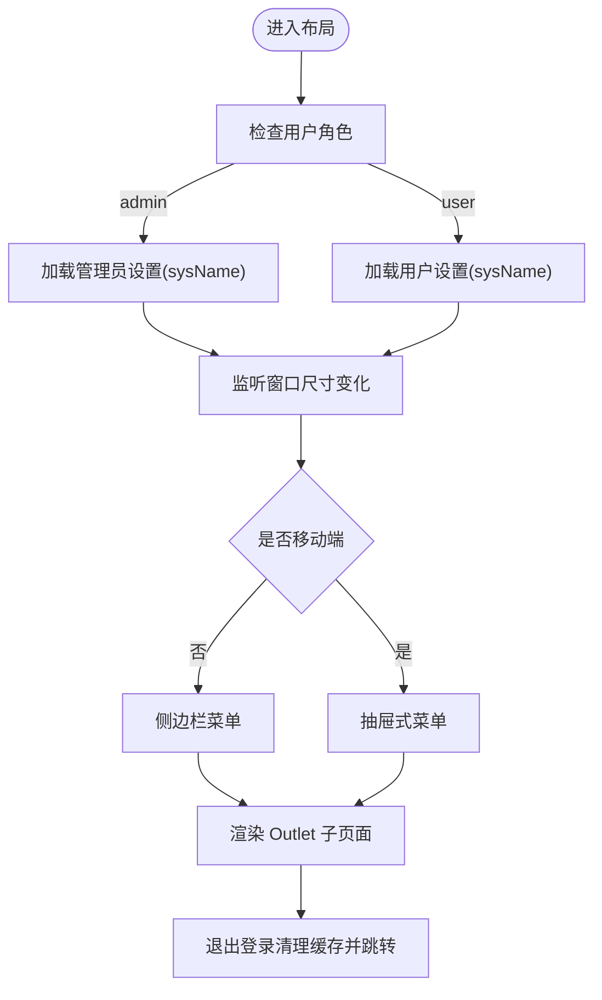
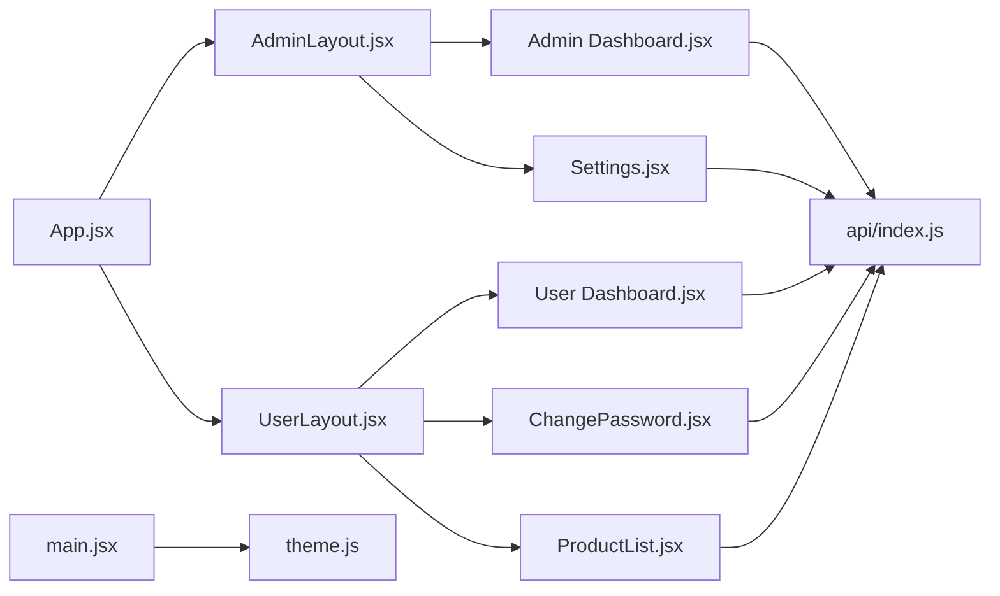

# 页面组件

<cite>
**本文引用的文件**
- [client/src/App.jsx](file://client/src/App.jsx)
- [client/src/main.jsx](file://client/src/main.jsx)
- [client/src/theme.js](file://client/src/theme.js)
- [client/src/api/index.js](file://client/src/api/index.js)
- [client/src/layouts/AdminLayout.jsx](file://client/src/layouts/AdminLayout.jsx)
- [client/src/layouts/UserLayout.jsx](file://client/src/layouts/UserLayout.jsx)
- [client/src/pages/Login.jsx](file://client/src/pages/Login.jsx)
- [client/src/pages/admin/Dashboard.jsx](file://client/src/pages/admin/Dashboard.jsx)
- [client/src/pages/user/Dashboard.jsx](file://client/src/pages/user/Dashboard.jsx)
- [client/src/pages/admin/Settings.jsx](file://client/src/pages/admin/Settings.jsx)
- [client/src/pages/user/ChangePassword.jsx](file://client/src/pages/user/ChangePassword.jsx)
- [client/src/pages/user/ProductList.jsx](file://client/src/pages/user/ProductList.jsx)
</cite>

## 目录
1. [引言](#引言)
2. [项目结构](#项目结构)
3. [核心组件](#核心组件)
4. [架构总览](#架构总览)
5. [详细组件分析](#详细组件分析)
6. [依赖关系分析](#依赖关系分析)
7. [性能考虑](#性能考虑)
8. [故障排查指南](#故障排查指南)
9. [结论](#结论)
10. [附录](#附录)

## 引言
本文件面向前端页面组件的综合文档，聚焦管理员仪表盘、用户仪表盘与个人页面的差异化设计与实现；系统性阐述页面组件的生命周期管理与数据获取策略、页面间导航与参数传递机制，并提供可复用的开发模板与代码规范建议，帮助开发者快速理解与扩展页面层。

## 项目结构
- 客户端采用按功能域分层组织：页面 pages、布局 layouts、API 封装 api、主题 theme、入口 main 等。
- 路由通过浏览器路由进行页面级导航，支持私有路由守卫与角色跳转。
- 主题统一通过 Ant Design 的 ConfigProvider 注入，确保全局样式一致性。

图表来源
- [client/src/main.jsx:1-14](file://client/src/main.jsx#L1-L14)
- [client/src/App.jsx:1-67](file://client/src/App.jsx#L1-L67)
- [client/src/theme.js:1-61](file://client/src/theme.js#L1-L61)
- [client/src/api/index.js:1-42](file://client/src/api/index.js#L1-L42)
- [client/src/layouts/AdminLayout.jsx:1-174](file://client/src/layouts/AdminLayout.jsx#L1-L174)
- [client/src/layouts/UserLayout.jsx:1-162](file://client/src/layouts/UserLayout.jsx#L1-L162)
- [client/src/pages/Login.jsx:1-68](file://client/src/pages/Login.jsx#L1-L68)
- [client/src/pages/admin/Dashboard.jsx:1-123](file://client/src/pages/admin/Dashboard.jsx#L1-L123)
- [client/src/pages/user/Dashboard.jsx:1-74](file://client/src/pages/user/Dashboard.jsx#L1-L74)
- [client/src/pages/admin/Settings.jsx:1-52](file://client/src/pages/admin/Settings.jsx#L1-L52)
- [client/src/pages/user/ChangePassword.jsx:1-50](file://client/src/pages/user/ChangePassword.jsx#L1-L50)
- [client/src/pages/user/ProductList.jsx:1-221](file://client/src/pages/user/ProductList.jsx#L1-L221)

章节来源
- [client/src/App.jsx:1-67](file://client/src/App.jsx#L1-L67)
- [client/src/main.jsx:1-14](file://client/src/main.jsx#L1-L14)

## 核心组件
- 应用入口与主题注入：在入口中通过 ConfigProvider 注入 Ant Design 主题与本地化，保证全局视觉一致。
- 路由与私有路由：使用路由守卫判断 token，未登录重定向至登录页；根据用户角色自动跳转到对应工作台。
- 布局组件：管理员与用户分别提供侧边栏/抽屉式菜单、头部用户信息与退出登录能力；支持响应式折叠与移动端抽屉。
- 页面组件：仪表盘负责统计与趋势展示；个人页面包含密码修改与商品相关列表等；系统设置支持刷新上下文标题。

章节来源
- [client/src/main.jsx:1-14](file://client/src/main.jsx#L1-L14)
- [client/src/App.jsx:26-64](file://client/src/App.jsx#L26-L64)
- [client/src/layouts/AdminLayout.jsx:16-174](file://client/src/layouts/AdminLayout.jsx#L16-L174)
- [client/src/layouts/UserLayout.jsx:16-162](file://client/src/layouts/UserLayout.jsx#L16-L162)
- [client/src/pages/admin/Dashboard.jsx:10-123](file://client/src/pages/admin/Dashboard.jsx#L10-L123)
- [client/src/pages/user/Dashboard.jsx:6-74](file://client/src/pages/user/Dashboard.jsx#L6-L74)
- [client/src/pages/admin/Settings.jsx:6-52](file://client/src/pages/admin/Settings.jsx#L6-L52)

## 架构总览
页面组件围绕“路由-布局-页面”三层结构展开，数据流通过统一的 API 封装完成请求拦截、鉴权与错误提示。

图表来源
- [client/src/App.jsx:32-64](file://client/src/App.jsx#L32-L64)
- [client/src/layouts/AdminLayout.jsx:16-174](file://client/src/layouts/AdminLayout.jsx#L16-L174)
- [client/src/layouts/UserLayout.jsx:16-162](file://client/src/layouts/UserLayout.jsx#L16-L162)
- [client/src/pages/admin/Dashboard.jsx:10-123](file://client/src/pages/admin/Dashboard.jsx#L10-L123)
- [client/src/pages/user/Dashboard.jsx:6-74](file://client/src/pages/user/Dashboard.jsx#L6-L74)
- [client/src/pages/admin/Settings.jsx:6-52](file://client/src/pages/admin/Settings.jsx#L6-L52)
- [client/src/pages/user/ChangePassword.jsx:5-50](file://client/src/pages/user/ChangePassword.jsx#L5-L50)
- [client/src/pages/user/ProductList.jsx:6-221](file://client/src/pages/user/ProductList.jsx#L6-L221)
- [client/src/api/index.js:4-42](file://client/src/api/index.js#L4-L42)

## 详细组件分析

### 管理员仪表盘（Admin Dashboard）
- 组件职责：展示管理员视角的关键指标、趋势图与近期操作；提供快捷入口跳转。
- 生命周期与数据获取：组件挂载后异步加载后台数据，成功后渲染卡片与图表；加载态显示骨架屏。
- 差异化设计：包含库存金额、入库/出库额与量、月度开销等指标；趋势图展示近七日入库/出库变化；快捷入口直达常用功能。
- 导航与交互：点击快捷入口触发路由跳转；近期操作项按类型打标签区分。

图表来源
- [client/src/pages/admin/Dashboard.jsx:15-23](file://client/src/pages/admin/Dashboard.jsx#L15-L23)
- [client/src/api/index.js:9-39](file://client/src/api/index.js#L9-L39)

章节来源
- [client/src/pages/admin/Dashboard.jsx:10-123](file://client/src/pages/admin/Dashboard.jsx#L10-L123)

### 用户仪表盘（User Dashboard）
- 组件职责：展示用户视角的关键指标与近期操作。
- 生命周期与数据获取：组件挂载后异步加载后台数据，成功后渲染卡片与操作列表。
- 差异化设计：聚焦用户自身录入的商品数与当月收支情况；近期操作按类型打标签。

图表来源
- [client/src/pages/user/Dashboard.jsx:10-16](file://client/src/pages/user/Dashboard.jsx#L10-L16)
- [client/src/api/index.js:9-39](file://client/src/api/index.js#L9-L39)

章节来源
- [client/src/pages/user/Dashboard.jsx:6-74](file://client/src/pages/user/Dashboard.jsx#L6-L74)

### 系统设置（Admin Settings）
- 组件职责：允许管理员修改系统名称，并通过上下文回调刷新布局标题。
- 生命周期与数据获取：首次加载时拉取当前系统名称；提交后调用更新接口并刷新上下文标题。
- 上下文通信：通过 Outlet 上下文将刷新函数传递给子页面，实现标题同步更新。

图表来源
- [client/src/pages/admin/Settings.jsx:11-32](file://client/src/pages/admin/Settings.jsx#L11-L32)
- [client/src/layouts/AdminLayout.jsx:49-55](file://client/src/layouts/AdminLayout.jsx#L49-L55)
- [client/src/api/index.js:9-39](file://client/src/api/index.js#L9-L39)

章节来源
- [client/src/pages/admin/Settings.jsx:6-52](file://client/src/pages/admin/Settings.jsx#L6-L52)
- [client/src/layouts/AdminLayout.jsx:16-174](file://client/src/layouts/AdminLayout.jsx#L16-L174)

### 修改密码（User ChangePassword）
- 组件职责：提供旧密码、新密码与确认密码校验，提交后返回消息提示。
- 表单校验：前后端结合，前端校验长度与一致性，后端校验旧密码正确性。
- 交互流程：提交成功清空表单，失败提示错误信息。

图表来源
- [client/src/pages/user/ChangePassword.jsx:9-26](file://client/src/pages/user/ChangePassword.jsx#L9-L26)
- [client/src/api/index.js:9-39](file://client/src/api/index.js#L9-L39)

章节来源
- [client/src/pages/user/ChangePassword.jsx:5-50](file://client/src/pages/user/ChangePassword.jsx#L5-L50)

### 商品列表（User ProductList）
- 组件职责：展示商品列表、搜索、分页；支持弹窗进行入库/出库登记与查看商品详情。
- 生命周期与数据获取：依赖分页与关键词参数，组合加载商品列表与生成单号；详情弹窗按商品查询库房库存分布。
- 并发优化：使用 Promise.all 并行加载公司/客户、单号与库房列表，提升交互速度。
- 交互流程：打开弹窗 -> 填写表单 -> 校验 -> 提交 -> 成功提示并刷新列表。

图表来源
- [client/src/pages/user/ProductList.jsx:24-31](file://client/src/pages/user/ProductList.jsx#L24-L31)
- [client/src/pages/user/ProductList.jsx:40-45](file://client/src/pages/user/ProductList.jsx#L40-L45)
- [client/src/pages/user/ProductList.jsx:58-80](file://client/src/pages/user/ProductList.jsx#L58-L80)
- [client/src/api/index.js:9-39](file://client/src/api/index.js#L9-L39)

章节来源
- [client/src/pages/user/ProductList.jsx:6-221](file://client/src/pages/user/ProductList.jsx#L6-L221)

### 登录页（Login）
- 组件职责：处理账号密码登录，持久化 token 与用户信息，按角色跳转至对应工作台。
- 生命周期与导航：进入时检查本地存储，若存在有效 token 则直接跳转；提交登录后根据角色跳转。
- 系统名称：通过公开接口获取系统名称并设置页面标题。

图表来源
- [client/src/pages/Login.jsx:12-25](file://client/src/pages/Login.jsx#L12-L25)
- [client/src/pages/Login.jsx:27-43](file://client/src/pages/Login.jsx#L27-L43)
- [client/src/api/index.js:9-39](file://client/src/api/index.js#L9-L39)

章节来源
- [client/src/pages/Login.jsx:7-68](file://client/src/pages/Login.jsx#L7-L68)

### 布局组件（AdminLayout 与 UserLayout）
- 组件职责：提供统一的头部、侧边栏/抽屉菜单、内容区与页脚；支持响应式折叠与移动端抽屉；提供退出登录能力。
- 角色校验：进入时根据用户角色强制跳转至对应工作台；窗口尺寸变化时自动切换布局模式。
- 菜单项：管理员与用户菜单项不同，覆盖各自的功能域。
- 上下文：管理员布局通过 Outlet 向子页面暴露刷新设置的能力。

图表来源
- [client/src/layouts/AdminLayout.jsx:16-174](file://client/src/layouts/AdminLayout.jsx#L16-L174)
- [client/src/layouts/UserLayout.jsx:16-162](file://client/src/layouts/UserLayout.jsx#L16-L162)

章节来源
- [client/src/layouts/AdminLayout.jsx:16-174](file://client/src/layouts/AdminLayout.jsx#L16-L174)
- [client/src/layouts/UserLayout.jsx:16-162](file://client/src/layouts/UserLayout.jsx#L16-L162)

## 依赖关系分析
- 路由与布局：App.jsx 定义路由与私有守卫，AdminLayout/UserLayout 分别承载管理员与用户域页面。
- 页面与 API：各页面通过统一的 api 封装发起请求，拦截器统一处理 Authorization 头与 401 重定向。
- 主题与样式：theme.js 配置 Ant Design 主题与组件样式，main.jsx 注入全局生效。
- 数据依赖：仪表盘依赖后台聚合数据；商品列表依赖分页与并发加载；设置页依赖上下文刷新标题。

图表来源
- [client/src/App.jsx:32-64](file://client/src/App.jsx#L32-L64)
- [client/src/layouts/AdminLayout.jsx:16-174](file://client/src/layouts/AdminLayout.jsx#L16-L174)
- [client/src/layouts/UserLayout.jsx:16-162](file://client/src/layouts/UserLayout.jsx#L16-L162)
- [client/src/pages/admin/Dashboard.jsx:10-123](file://client/src/pages/admin/Dashboard.jsx#L10-L123)
- [client/src/pages/user/Dashboard.jsx:6-74](file://client/src/pages/user/Dashboard.jsx#L6-L74)
- [client/src/pages/admin/Settings.jsx:6-52](file://client/src/pages/admin/Settings.jsx#L6-L52)
- [client/src/pages/user/ChangePassword.jsx:5-50](file://client/src/pages/user/ChangePassword.jsx#L5-L50)
- [client/src/pages/user/ProductList.jsx:6-221](file://client/src/pages/user/ProductList.jsx#L6-L221)
- [client/src/api/index.js:4-42](file://client/src/api/index.js#L4-L42)
- [client/src/main.jsx:1-14](file://client/src/main.jsx#L1-L14)
- [client/src/theme.js:1-61](file://client/src/theme.js#L1-L61)

章节来源
- [client/src/App.jsx:1-67](file://client/src/App.jsx#L1-L67)
- [client/src/api/index.js:1-42](file://client/src/api/index.js#L1-L42)
- [client/src/theme.js:1-61](file://client/src/theme.js#L1-L61)

## 性能考虑
- 请求拦截与缓存：统一在 api 封装中添加 Authorization 头，减少重复鉴权逻辑；对 401 统一处理避免重复登录。
- 并发加载：商品列表在打开入库/出库弹窗时，使用 Promise.all 并行获取公司/客户、单号与库房列表，缩短等待时间。
- 响应式布局：布局组件根据窗口宽度自动切换侧边栏与抽屉，减少移动端交互成本。
- 图表渲染：趋势图使用响应式容器，避免固定宽高导致的重排与闪烁。

## 故障排查指南
- 登录失败或跳转异常
  - 检查本地是否存在有效的 token 与 user 信息；确认登录接口返回的用户角色。
  - 参考路径：[client/src/pages/Login.jsx:12-25](file://client/src/pages/Login.jsx#L12-L25)，[client/src/pages/Login.jsx:27-43](file://client/src/pages/Login.jsx#L27-L43)
- 仪表盘数据为空或加载缓慢
  - 确认后台接口返回的数据结构与字段名一致；检查网络请求是否被拦截器拦截。
  - 参考路径：[client/src/pages/admin/Dashboard.jsx:19-23](file://client/src/pages/admin/Dashboard.jsx#L19-L23)，[client/src/pages/user/Dashboard.jsx:12-16](file://client/src/pages/user/Dashboard.jsx#L12-L16)，[client/src/api/index.js:9-39](file://client/src/api/index.js#L9-L39)
- 设置页标题未更新
  - 确认通过 Outlet 上下文传递了 refreshSettings，并在设置保存后调用该方法。
  - 参考路径：[client/src/pages/admin/Settings.jsx:27](file://client/src/pages/admin/Settings.jsx#L27)，[client/src/layouts/AdminLayout.jsx:49-55](file://client/src/layouts/AdminLayout.jsx#L49-L55)
- 商品列表无法打开弹窗或提交失败
  - 检查弹窗状态开关与表单校验；确认并发请求返回正常；提交后刷新列表。
  - 参考路径：[client/src/pages/user/ProductList.jsx:36-56](file://client/src/pages/user/ProductList.jsx#L36-L56)，[client/src/pages/user/ProductList.jsx:58-80](file://client/src/pages/user/ProductList.jsx#L58-L80)
- 修改密码不一致或失败
  - 前端校验新密码一致性；后端返回错误时提示具体信息。
  - 参考路径：[client/src/pages/user/ChangePassword.jsx:9-26](file://client/src/pages/user/ChangePassword.jsx#L9-L26)

章节来源
- [client/src/pages/Login.jsx:12-43](file://client/src/pages/Login.jsx#L12-L43)
- [client/src/pages/admin/Dashboard.jsx:19-23](file://client/src/pages/admin/Dashboard.jsx#L19-L23)
- [client/src/pages/user/Dashboard.jsx:12-16](file://client/src/pages/user/Dashboard.jsx#L12-L16)
- [client/src/pages/admin/Settings.jsx:27](file://client/src/pages/admin/Settings.jsx#L27)
- [client/src/layouts/AdminLayout.jsx:49-55](file://client/src/layouts/AdminLayout.jsx#L49-L55)
- [client/src/pages/user/ProductList.jsx:36-80](file://client/src/pages/user/ProductList.jsx#L36-L80)
- [client/src/pages/user/ChangePassword.jsx:9-26](file://client/src/pages/user/ChangePassword.jsx#L9-L26)

## 结论
本项目以清晰的“路由-布局-页面”分层组织页面组件，配合统一的 API 封装与主题配置，实现了管理员与用户两类工作台的差异化设计与一致的交互体验。通过生命周期与数据获取策略、导航与参数传递机制以及可复用的开发模板，为后续扩展与维护提供了良好的基础。

## 附录

### 页面组件开发标准模板与代码规范
- 组件命名与目录
  - 页面组件统一放置于 pages 下的 admin 或 user 子目录，按功能域划分。
  - 布局组件放置于 layouts，页面组件通过布局进行包裹。
- 生命周期与数据获取
  - 使用 useEffect 在组件挂载时发起数据请求；使用 loading 状态控制骨架屏。
  - 对需要并发加载的数据使用 Promise.all 并行请求，提升用户体验。
- 导航与参数传递
  - 使用 react-router 的 useNavigate 进行页面跳转；在布局中通过 Outlet 上下文向子页面传递刷新函数。
  - 登录页根据用户角色自动跳转至对应工作台。
- 错误处理与提示
  - 统一通过 api 封装处理 401 与错误消息；页面内使用消息组件进行友好提示。
- 样式与主题
  - 通过 theme.js 配置 Ant Design 主题与组件样式；在 main.jsx 中注入全局生效。
- 表单与校验
  - 使用 Ant Design Form 进行表单管理与校验；提交前进行必要校验（如密码一致性）。
- 可访问性与响应式
  - 布局组件支持移动端抽屉与侧边栏切换；图表与表格使用响应式容器。

章节来源
- [client/src/App.jsx:32-64](file://client/src/App.jsx#L32-L64)
- [client/src/layouts/AdminLayout.jsx:16-174](file://client/src/layouts/AdminLayout.jsx#L16-L174)
- [client/src/layouts/UserLayout.jsx:16-162](file://client/src/layouts/UserLayout.jsx#L16-L162)
- [client/src/pages/user/ProductList.jsx:36-80](file://client/src/pages/user/ProductList.jsx#L36-L80)
- [client/src/api/index.js:9-39](file://client/src/api/index.js#L9-L39)
- [client/src/main.jsx:1-14](file://client/src/main.jsx#L1-L14)
- [client/src/theme.js:1-61](file://client/src/theme.js#L1-L61)