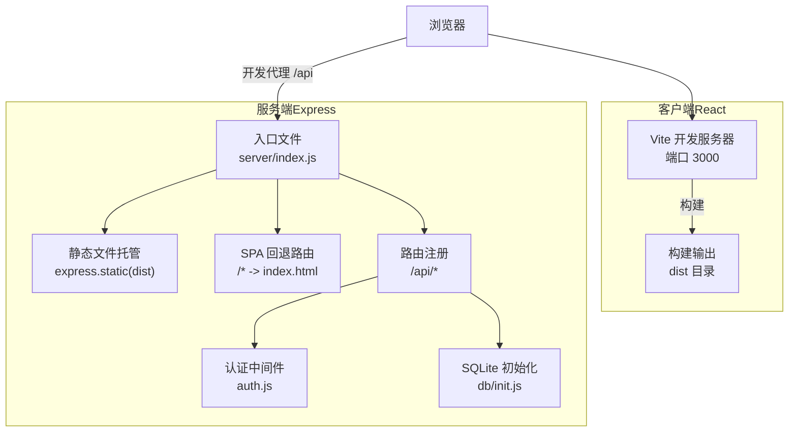
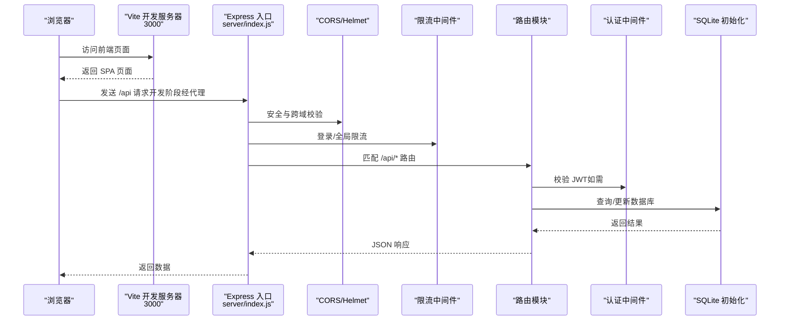
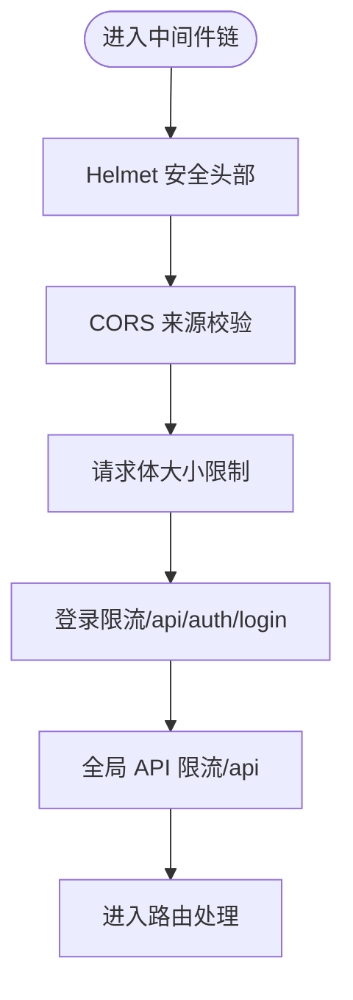
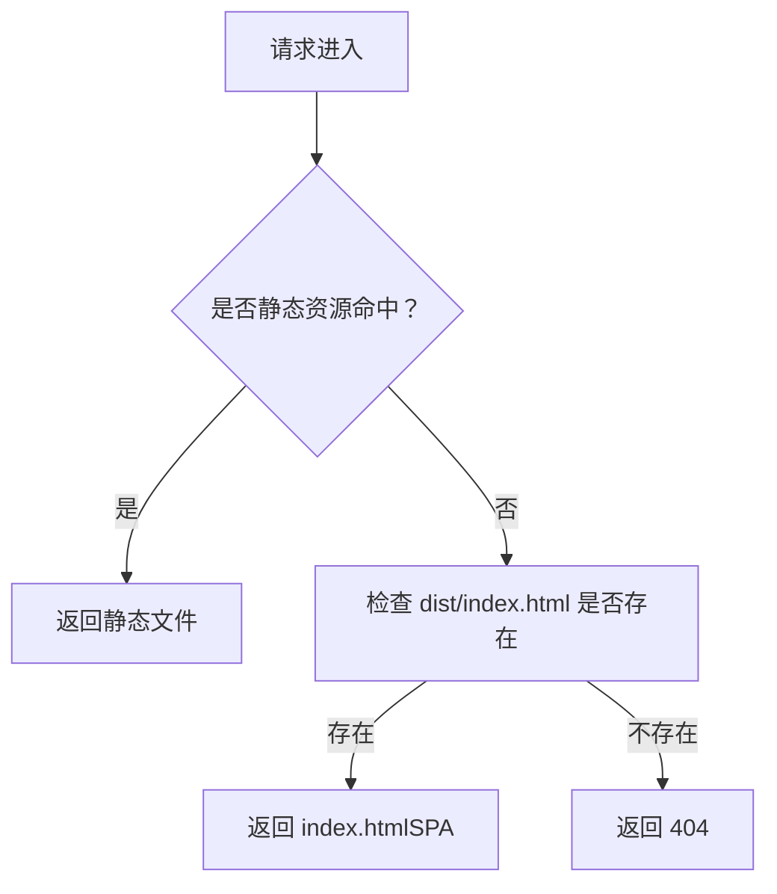
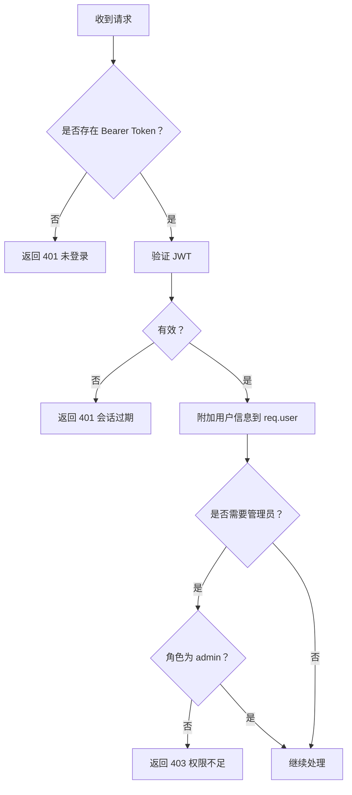
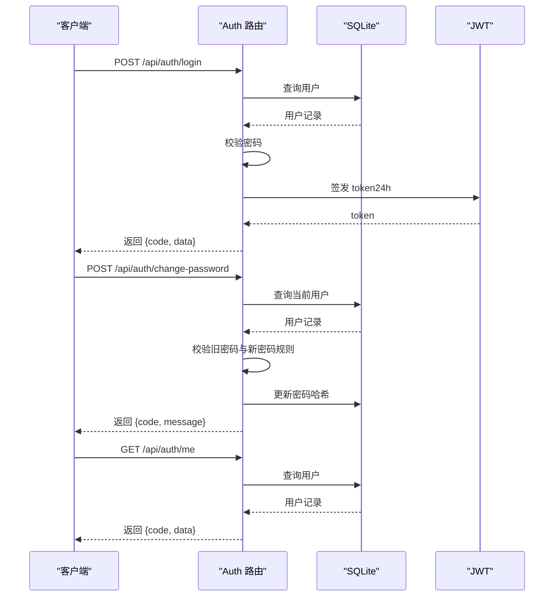
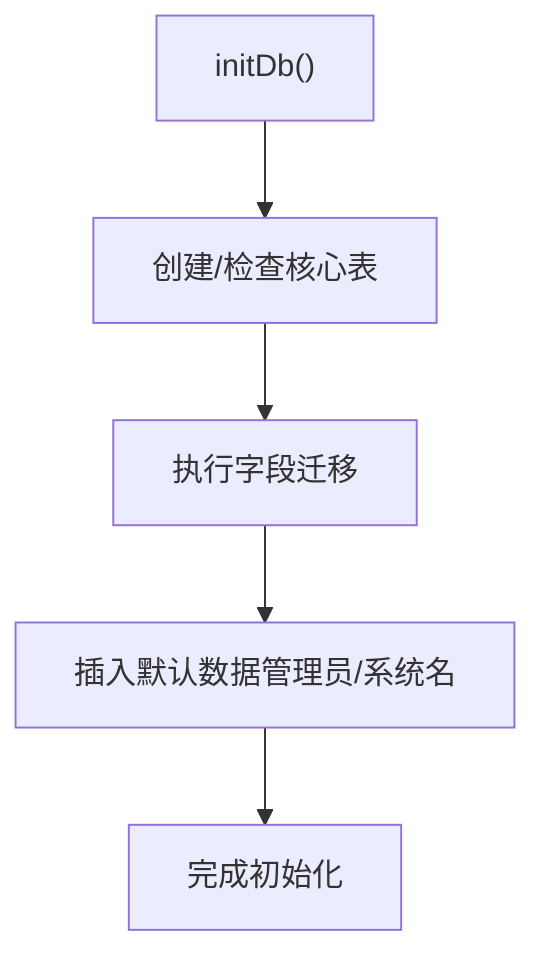
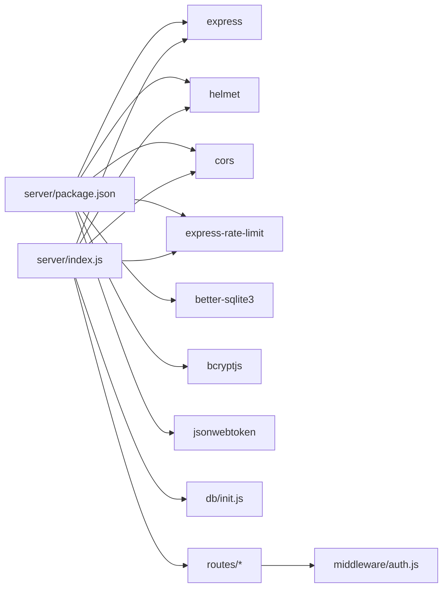

# Express 应用架构

<cite>
**本文引用的文件**
- [server/index.js](file://server/index.js)
- [server/middleware/auth.js](file://server/middleware/auth.js)
- [server/routes/auth.js](file://server/routes/auth.js)
- [server/db/init.js](file://server/db/init.js)
- [server/package.json](file://server/package.json)
- [client/vite.config.js](file://client/vite.config.js)
- [client/src/App.jsx](file://client/src/App.jsx)
- [client/src/main.jsx](file://client/src/main.jsx)
- [package.json](file://package.json)
- [render.yaml](file://render.yaml)
</cite>

## 目录
1. [简介](#简介)
2. [项目结构](#项目结构)
3. [核心组件](#核心组件)
4. [架构总览](#架构总览)
5. [详细组件分析](#详细组件分析)
6. [依赖关系分析](#依赖关系分析)
7. [性能考虑](#性能考虑)
8. [故障排查指南](#故障排查指南)
9. [结论](#结论)
10. [附录](#附录)

## 简介
本文件面向 SY-Q Express 应用，系统性梳理主应用文件的结构设计与运行机制，重点覆盖以下方面：
- 中间件配置顺序与职责边界
- 安全中间件 Helmet 的策略取舍
- CORS 设置与来源白名单管理
- 请求限制机制（登录与全局 API 限流）
- 静态文件托管与 SPA 路由回退策略
- 全局错误处理与开发/生产差异
- 应用启动流程、端口与环境变量规范
- 性能优化建议与安全最佳实践

## 项目结构
应用采用“前后端同域部署”的模式：前端构建产物输出到服务端的 dist 目录，服务端统一托管静态资源，并以 SPA 方式回退到 index.html；API 接口集中于 /api 路径前缀。

图表来源
- [server/index.js:97-106](file://server/index.js#L97-L106)
- [client/vite.config.js:6-18](file://client/vite.config.js#L6-L18)
- [server/db/init.js:18-214](file://server/db/init.js#L18-L214)

章节来源
- [server/index.js:1-120](file://server/index.js#L1-120)
- [client/vite.config.js:1-20](file://client/vite.config.js#L1-L20)
- [package.json:5-8](file://package.json#L5-L8)

## 核心组件
- 安全中间件（Helmet）：启用通用安全头部，关闭严格 CSP 与 EMBEDDER_POLICY 以适配同域前后端联调场景。
- CORS：基于来源白名单动态校验，支持本地开发与 Render 部署域名，允许自定义额外来源。
- 请求体与大小限制：JSON 请求体最大 2MB。
- 登录频率限制：每 IP 每分钟最多 10 次登录尝试。
- 全局 API 频率限制：每 IP 每分钟最多 120 次 API 请求。
- 数据库初始化：Better SQLite3，WAL 模式与外键约束开启，自动迁移与默认数据注入。
- 静态托管与 SPA 回退：生产环境托管 dist，所有未匹配路径回退至 index.html；若文件不存在返回 404。
- 全局错误处理：CORS 拒绝与未知错误分别返回 403 与 500。

章节来源
- [server/index.js:11-15](file://server/index.js#L11-L15)
- [server/index.js:17-41](file://server/index.js#L17-L41)
- [server/index.js:43-63](file://server/index.js#L43-L63)
- [server/index.js:65-66](file://server/index.js#L65-L66)
- [server/index.js:97-106](file://server/index.js#L97-L106)
- [server/index.js:108-115](file://server/index.js#L108-L115)
- [server/db/init.js:18-214](file://server/db/init.js#L18-L214)

## 架构总览
下图展示从浏览器到服务端的典型请求链路，包括开发代理、静态托管、路由分发与数据库访问。

图表来源
- [server/index.js:11-15](file://server/index.js#L11-L15)
- [server/index.js:17-41](file://server/index.js#L17-L41)
- [server/index.js:46-63](file://server/index.js#L46-L63)
- [server/index.js:68-95](file://server/index.js#L68-L95)
- [server/middleware/auth.js:5-19](file://server/middleware/auth.js#L5-L19)
- [server/db/init.js:9-16](file://server/db/init.js#L9-L16)

## 详细组件分析

### 中间件与安全层
- Helmet：启用基础安全头部，禁用严格 CSP 与 EMBEDDER_POLICY，适合同域联调与快速开发。
- CORS：允许无 Origin（curl/postman 等）与本地开发域名；支持 Render 主域名与子域名；可通过环境变量追加来源。
- 请求体大小限制：JSON 最大 2MB，避免过大负载。
- 登录限流：针对 /api/auth/login 单独限流，防止暴力破解。
- 全局 API 限流：对 /api 前缀统一限流，平衡业务吞吐与防护。

图表来源
- [server/index.js:11-15](file://server/index.js#L11-L15)
- [server/index.js:17-41](file://server/index.js#L17-L41)
- [server/index.js:43-63](file://server/index.js#L43-L63)

章节来源
- [server/index.js:11-63](file://server/index.js#L11-L63)

### 静态文件托管与 SPA 回退
- 生产环境：使用 express.static 托管 dist 目录。
- SPA 回退：所有未匹配路径回退到 index.html；若文件不存在返回 404。
- 前端构建：Vite 输出到 ../dist，开发阶段通过代理将 /api 转发到服务端。

图表来源
- [server/index.js:97-106](file://server/index.js#L97-L106)

章节来源
- [server/index.js:97-106](file://server/index.js#L97-L106)
- [client/vite.config.js:15-18](file://client/vite.config.js#L15-L18)

### 认证与授权中间件
- 令牌来源：仅从 Authorization 头读取，禁止 URL 参数，降低泄露风险。
- 校验失败：返回 401 未登录或会话过期。
- 管理员校验：adminMiddleware 对非管理员返回 403。
- JWT 密钥：硬编码于中间件文件中，建议迁移到环境变量。

图表来源
- [server/middleware/auth.js:5-26](file://server/middleware/auth.js#L5-L26)

章节来源
- [server/middleware/auth.js:1-29](file://server/middleware/auth.js#L1-L29)

### 登录与密码变更流程
- 登录：校验用户名与密码，生成 24 小时有效期 JWT。
- 修改密码：旧密码校验通过后进行哈希并更新。
- 当前用户信息：返回脱敏后的用户数据。

图表来源
- [server/routes/auth.js:8-66](file://server/routes/auth.js#L8-L66)
- [server/db/init.js:197-211](file://server/db/init.js#L197-L211)

章节来源
- [server/routes/auth.js:1-69](file://server/routes/auth.js#L1-L69)
- [server/db/init.js:197-211](file://server/db/init.js#L197-L211)

### 数据库初始化与迁移
- 初始化：WAL 模式、外键约束、表结构创建与迁移。
- 默认数据：首次启动插入默认管理员与系统名称。
- 并发：getDb 单例化连接，避免重复打开。

图表来源
- [server/db/init.js:18-214](file://server/db/init.js#L18-L214)

章节来源
- [server/db/init.js:1-217](file://server/db/init.js#L1-L217)

### 全局错误处理与开发/生产差异
- 错误处理：CORS 拒绝返回 403；其他错误打印日志并返回 500。
- 开发环境：Vite 代理 /api 到 3001，本地调试友好。
- 生产环境：Render 配置 NODE_ENV=production，端口 10000，构建命令与启动命令明确。

章节来源
- [server/index.js:108-115](file://server/index.js#L108-L115)
- [client/vite.config.js:6-14](file://client/vite.config.js#L6-L14)
- [render.yaml:7-12](file://render.yaml#L7-L12)

## 依赖关系分析
- Express 版本：服务端使用较新的 Express 版本，注意中间件与错误处理语义变化。
- 安全与限流：helmet、cors、express-rate-limit 组合提供基础防护。
- 数据访问：better-sqlite3 提供高性能本地数据库能力。
- 前端代理：Vite 代理 /api 到服务端，便于本地联调。

图表来源
- [server/package.json:14-24](file://server/package.json#L14-L24)
- [server/index.js:1-8](file://server/index.js#L1-L8)
- [server/db/init.js:1-5](file://server/db/init.js#L1-L5)
- [server/middleware/auth.js:1](file://server/middleware/auth.js#L1)

章节来源
- [server/package.json:1-26](file://server/package.json#L1-L26)
- [server/index.js:1-120](file://server/index.js#L1-L120)

## 性能考虑
- 数据库模式：WAL 模式提升并发写入性能；外键约束保证一致性但带来一定开销，建议在高并发场景评估索引与查询优化。
- 限流策略：登录限流与全局 API 限流可缓解暴力破解与滥用，建议结合 Nginx 或反向代理进一步削峰。
- 静态资源：生产环境启用缓存与压缩（建议在反向代理层配置），减少带宽与延迟。
- 前端构建：Vite 已内置优化，确保生产打包最小化与按需加载。
- 连接池：当前为单实例连接，若扩展为多进程或多实例，建议引入连接池与共享状态管理。

## 故障排查指南
- CORS 拒绝：检查 ALLOWED_ORIGINS 环境变量与本地端口是否在白名单内；确认浏览器是否携带 Origin。
- 登录失败：确认用户名密码正确、数据库中存在用户记录；检查 JWT 密钥一致性与过期时间。
- 静态文件 404：确认 dist 目录存在且 index.html 可访问；检查构建命令是否成功执行。
- 限流触发：登录过于频繁或 API 请求过于密集时会触发 429；适当放宽窗口或阈值。
- 开发代理不通：确认 Vite 代理目标与端口一致，服务端已启动。

章节来源
- [server/index.js:17-41](file://server/index.js#L17-L41)
- [server/index.js:46-63](file://server/index.js#L46-L63)
- [server/index.js:97-106](file://server/index.js#L97-L106)
- [client/vite.config.js:8-13](file://client/vite.config.js#L8-L13)

## 结论
本应用以 Express 为核心，结合 Helmet、CORS、限流与 SQLite 实现了轻量级、可维护的企业记账管理后端。通过 Vite 代理与 SPA 回退，实现了前后端一体化开发与部署。建议后续在生产环境中强化密钥管理、引入更完善的日志与监控、以及在反向代理层增加缓存与压缩策略，以进一步提升安全性与性能。

## 附录

### 端口与环境变量使用规范
- 端口：优先使用环境变量 PORT，否则默认 3001；Render 配置为 10000。
- 环境：NODE_ENV=production；ALLOWED_ORIGINS 支持追加来源，多个来源以逗号分隔。
- 构建与启动：根目录脚本负责前端构建与服务端安装；服务端独立启动命令见 server/package.json。

章节来源
- [server/index.js:8-9](file://server/index.js#L8-L9)
- [render.yaml:10-11](file://render.yaml#L10-L11)
- [package.json:5-8](file://package.json#L5-L8)
- [server/package.json:6-8](file://server/package.json#L6-L8)

### SPA 路由与前端入口
- 前端入口：Ant Design 全局主题与语言配置，根节点挂载 App。
- 路由：BrowserRouter + Routes，私有路由通过本地 token 校验；* 回退到登录页。

章节来源
- [client/src/main.jsx:1-14](file://client/src/main.jsx#L1-L14)
- [client/src/App.jsx:26-30](file://client/src/App.jsx#L26-L30)
- [client/src/App.jsx:32-64](file://client/src/App.jsx#L32-L64)