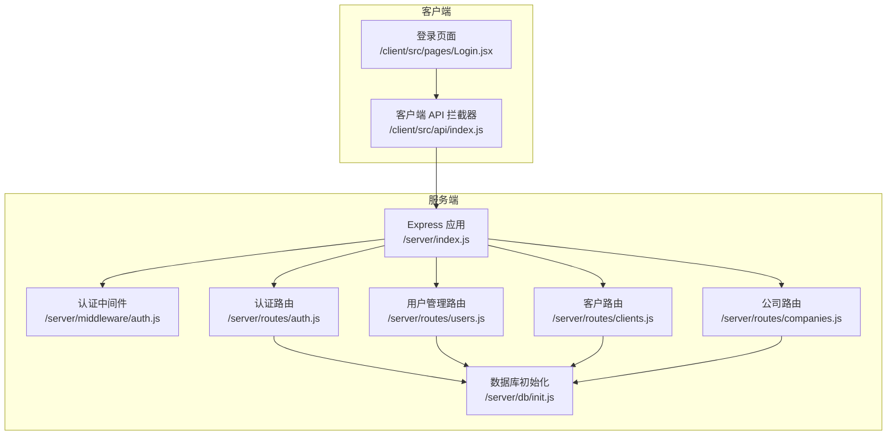
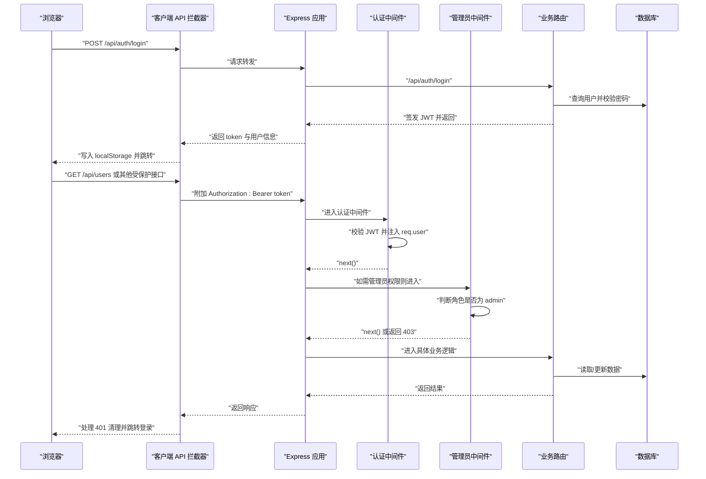
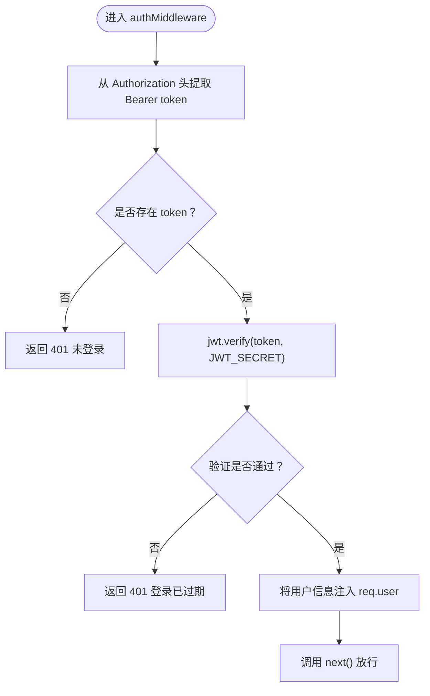
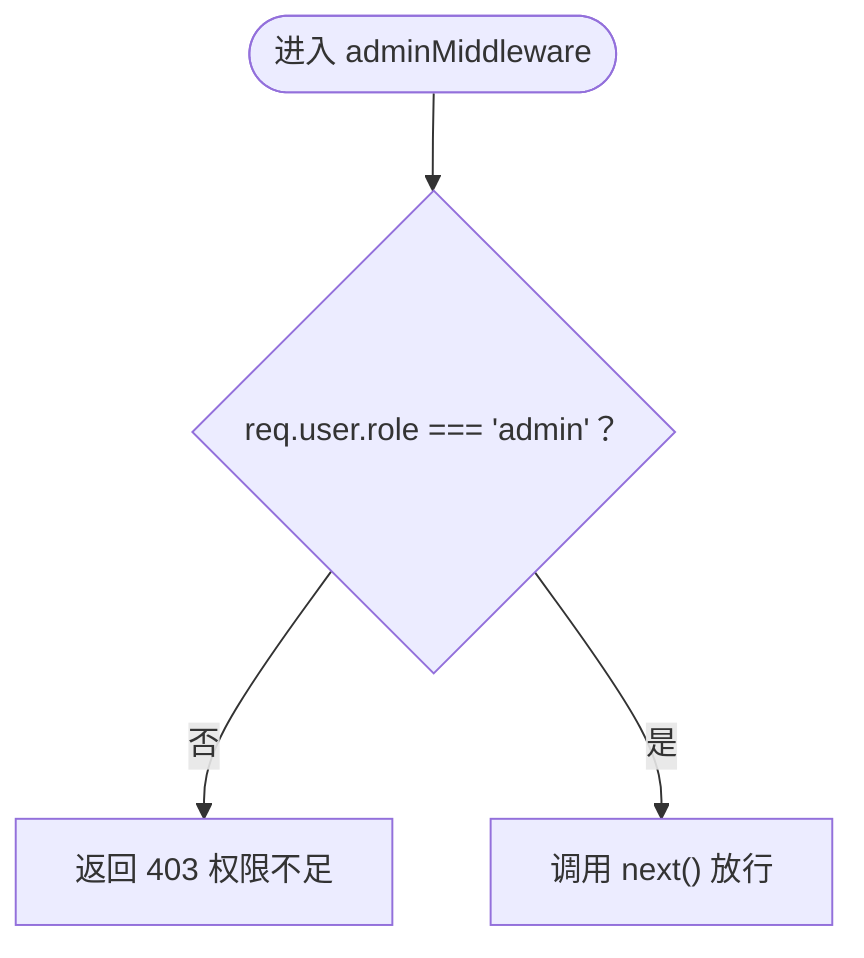
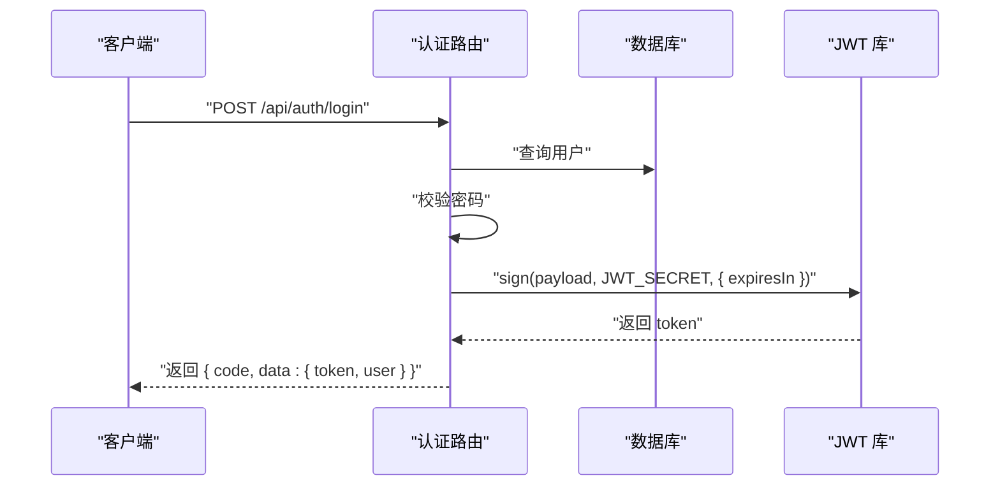
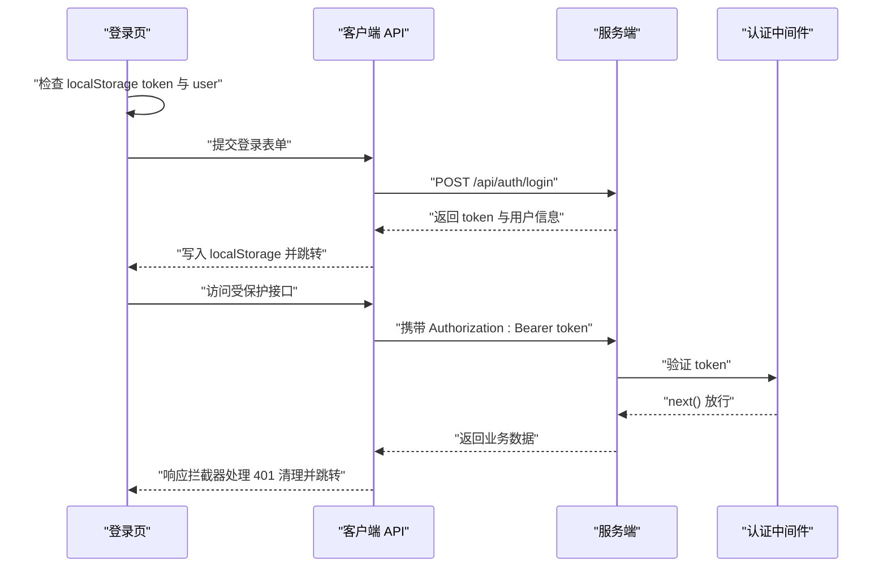
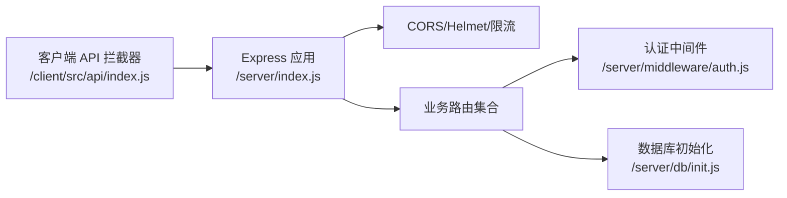

# 中间件系统

<cite>
**本文引用的文件**
- [server/middleware/auth.js](file://server/middleware/auth.js)
- [server/index.js](file://server/index.js)
- [server/routes/auth.js](file://server/routes/auth.js)
- [server/routes/users.js](file://server/routes/users.js)
- [server/routes/clients.js](file://server/routes/clients.js)
- [server/routes/companies.js](file://server/routes/companies.js)
- [server/db/init.js](file://server/db/init.js)
- [client/src/api/index.js](file://client/src/api/index.js)
- [client/src/pages/Login.jsx](file://client/src/pages/Login.jsx)
- [package.json](file://package.json)
</cite>

## 目录
1. [简介](#简介)
2. [项目结构](#项目结构)
3. [核心组件](#核心组件)
4. [架构总览](#架构总览)
5. [详细组件分析](#详细组件分析)
6. [依赖关系分析](#依赖关系分析)
7. [性能与安全考量](#性能与安全考量)
8. [故障排查指南](#故障排查指南)
9. [结论](#结论)
10. [附录](#附录)

## 简介
本文件面向 SY-Q 中间件系统，聚焦认证中间件的实现与使用，涵盖以下主题：
- 认证中间件的执行流程与链式调用模式
- JWT 令牌验证、权限检查与用户身份识别机制
- 中间件配置选项、错误处理策略与性能优化建议
- 自定义中间件的开发指南与最佳实践
- 与前端客户端、数据库模块的集成方式与调试技巧

## 项目结构
后端采用 Express 服务，中间件集中于 server/middleware，路由按功能模块划分在 server/routes 下；前端通过 axios 统一拦截器发送请求并处理鉴权状态。

图表来源
- [server/index.js:68-95](file://server/index.js#L68-L95)
- [server/middleware/auth.js:1-29](file://server/middleware/auth.js#L1-L29)
- [server/routes/auth.js:1-69](file://server/routes/auth.js#L1-L69)
- [server/routes/users.js:1-87](file://server/routes/users.js#L1-L87)
- [server/routes/clients.js:1-81](file://server/routes/clients.js#L1-L81)
- [server/routes/companies.js:1-104](file://server/routes/companies.js#L1-L104)
- [server/db/init.js:18-214](file://server/db/init.js#L18-L214)
- [client/src/api/index.js:1-42](file://client/src/api/index.js#L1-L42)
- [client/src/pages/Login.jsx:1-68](file://client/src/pages/Login.jsx#L1-L68)

章节来源
- [server/index.js:68-95](file://server/index.js#L68-L95)
- [server/middleware/auth.js:1-29](file://server/middleware/auth.js#L1-L29)
- [client/src/api/index.js:1-42](file://client/src/api/index.js#L1-L42)

## 核心组件
- 认证中间件 authMiddleware：从请求头提取 Bearer Token，校验 JWT 并将用户信息注入 req.user，支持 401 未登录与 401 登录过期两种错误返回。
- 管理员中间件 adminMiddleware：基于 req.user.role 判断是否为 admin，非管理员返回 403 权限不足。
- JWT 密钥：在中间件中以常量形式定义，用于签名与验证。
- 路由层使用：在需要鉴权的接口上挂载 authMiddleware；在需要管理员权限的接口上再叠加 adminMiddleware。
- 客户端拦截器：统一为请求头添加 Authorization: Bearer token，并在 401 时清理本地存储并跳转登录页。

章节来源
- [server/middleware/auth.js:5-26](file://server/middleware/auth.js#L5-L26)
- [server/routes/auth.js:6,43,62:6-6](file://server/routes/auth.js#L6-L6)
- [server/routes/users.js:7](file://server/routes/users.js#L7)
- [server/routes/clients.js:6](file://server/routes/clients.js#L6)
- [server/routes/companies.js:6](file://server/routes/companies.js#L6)
- [client/src/api/index.js:9-39](file://client/src/api/index.js#L9-L39)

## 架构总览
下图展示从客户端到服务端的典型认证链路，包括登录签发 JWT、后续请求携带令牌、中间件验证与权限检查。

图表来源
- [server/routes/auth.js:9-40](file://server/routes/auth.js#L9-L40)
- [server/middleware/auth.js:5-26](file://server/middleware/auth.js#L5-L26)
- [server/routes/users.js:7](file://server/routes/users.js#L7)
- [server/db/init.js:197-205](file://server/db/init.js#L197-L205)
- [client/src/api/index.js:9-39](file://client/src/api/index.js#L9-L39)

## 详细组件分析

### 认证中间件实现与执行顺序
- 执行入口：authMiddleware 在每个受保护路由前执行，负责从 Authorization 头提取 Bearer token。
- 令牌验证：使用 JWT_SECRET 对 token 进行 verify，成功则将解码后的用户信息写入 req.user，调用 next() 放行；失败返回 401。
- 链式调用：若同时挂载 adminMiddleware，则在 authMiddleware 之后执行，进一步校验角色。
- 错误处理：未携带 token 返回 401；token 过期或无效返回 401；非管理员访问管理员接口返回 403。

图表来源
- [server/middleware/auth.js:5-19](file://server/middleware/auth.js#L5-L19)

章节来源
- [server/middleware/auth.js:5-26](file://server/middleware/auth.js#L5-L26)

### 管理员中间件实现与权限检查
- 角色判定：adminMiddleware 仅检查 req.user.role 是否为 'admin'。
- 权限拒绝：非管理员返回 403 权限不足；否则继续执行后续中间件或业务逻辑。

图表来源
- [server/middleware/auth.js:21-26](file://server/middleware/auth.js#L21-L26)

章节来源
- [server/middleware/auth.js:21-26](file://server/middleware/auth.js#L21-L26)

### 登录流程与 JWT 签发
- 登录接口：接收用户名与密码，校验数据库中的用户与密码，使用 JWT_SECRET 签发 token，设置过期时间 24 小时。
- 响应结构：包含 code、data（token 与用户信息）。

图表来源
- [server/routes/auth.js:9-40](file://server/routes/auth.js#L9-L40)
- [server/db/init.js:197-205](file://server/db/init.js#L197-L205)

章节来源
- [server/routes/auth.js:9-40](file://server/routes/auth.js#L9-L40)
- [server/db/init.js:197-205](file://server/db/init.js#L197-L205)

### 客户端拦截器与会话生命周期
- 请求拦截：在请求头附加 Authorization: Bearer token（若存在）。
- 响应拦截：当响应 code 为 401 或响应状态为 401 时，清除本地 token 与用户信息，并跳转至登录页。
- 登录页：检测本地 token 与用户角色，若已登录则直接跳转到对应后台首页。

图表来源
- [client/src/api/index.js:9-39](file://client/src/api/index.js#L9-L39)
- [client/src/pages/Login.jsx:12-25](file://client/src/pages/Login.jsx#L12-L25)
- [server/middleware/auth.js:5-19](file://server/middleware/auth.js#L5-L19)

章节来源
- [client/src/api/index.js:9-39](file://client/src/api/index.js#L9-L39)
- [client/src/pages/Login.jsx:12-25](file://client/src/pages/Login.jsx#L12-L25)

### 数据库初始化与默认管理员
- 初始化：首次运行时创建多张业务表（用户、设置、库房、商品、出入库、开销等），启用 WAL 模式与外键约束。
- 默认管理员：若不存在名为 admin 的用户，自动创建默认管理员账号，密码经 bcrypt 加盐哈希存储。
- 系统名称：插入默认系统名称到 settings 表。

章节来源
- [server/db/init.js:18-214](file://server/db/init.js#L18-L214)

### 路由层中间件挂载模式
- 全局挂载：部分路由组（如用户管理）在路由对象上统一挂载 authMiddleware 与 adminMiddleware，确保组内所有接口均受保护。
- 局部挂载：部分接口仅需登录，仅挂载 authMiddleware；需要管理员权限的接口再叠加 adminMiddleware。
- 示例：
  - 用户管理路由组：router.use(authMiddleware, adminMiddleware)，随后在 GET/POST/PUT/DELETE 接口上按需叠加 adminMiddleware。
  - 客户与公司路由：router.use(authMiddleware) 后，在需要管理员权限的接口上叠加 adminMiddleware。

章节来源
- [server/routes/users.js:7](file://server/routes/users.js#L7)
- [server/routes/clients.js:6](file://server/routes/clients.js#L6)
- [server/routes/companies.js:6](file://server/routes/companies.js#L6)

## 依赖关系分析
- Express 应用在启动时注册全局安全中间件（CORS、Helmet、速率限制）、数据库初始化与各业务路由。
- 认证中间件被多个路由模块复用，形成统一的身份与权限控制入口。
- 客户端通过 axios 拦截器与服务端约定一致的鉴权协议（Authorization: Bearer token）。

图表来源
- [server/index.js:11-63](file://server/index.js#L11-L63)
- [server/index.js:68-95](file://server/index.js#L68-L95)
- [server/middleware/auth.js:1-29](file://server/middleware/auth.js#L1-L29)
- [server/db/init.js:18-214](file://server/db/init.js#L18-L214)
- [client/src/api/index.js:1-42](file://client/src/api/index.js#L1-L42)

章节来源
- [server/index.js:11-63](file://server/index.js#L11-L63)
- [server/index.js:68-95](file://server/index.js#L68-L95)
- [server/middleware/auth.js:1-29](file://server/middleware/auth.js#L1-L29)
- [client/src/api/index.js:1-42](file://client/src/api/index.js#L1-L42)

## 性能与安全考量
- 令牌有效期：登录接口签发的 token 设置 24 小时过期，建议结合刷新令牌策略或短令牌 + 刷新接口进一步增强安全性与用户体验。
- 速率限制：针对登录接口与全局 API 分别设置每分钟最大请求次数，缓解暴力破解与滥用风险。
- CORS 白名单：支持本地与 Render 域名，允许子域名通配，减少跨域错误。
- 安全响应头：启用 Helmet，默认关闭严格 CSP 与 COEP，适配同域前后端部署场景。
- 令牌来源：中间件仅从 Authorization 头读取 token，避免通过 URL 参数泄露，降低日志与中间人攻击风险。
- 密钥管理：JWT_SECRET 当前为常量，建议迁移到环境变量并在生产环境使用强密钥与轮换策略。

章节来源
- [server/routes/auth.js:22-26](file://server/routes/auth.js#L22-L26)
- [server/index.js:47-63](file://server/index.js#L47-L63)
- [server/index.js:18-41](file://server/index.js#L18-L41)
- [server/middleware/auth.js:6-8](file://server/middleware/auth.js#L6-L8)
- [server/middleware/auth.js:3](file://server/middleware/auth.js#L3)

## 故障排查指南
- 401 未登录
  - 现象：客户端收到 401，自动清理本地 token 并跳转登录页。
  - 可能原因：请求未携带 Authorization 头或 token 已过期。
  - 处理：重新登录获取新 token。
- 401 登录已过期
  - 现象：服务端返回“登录已过期，请重新登录”。
  - 可能原因：token 过期或被篡改。
  - 处理：重新登录。
- 403 权限不足
  - 现象：访问管理员接口返回“权限不足，需要管理员权限”。
  - 可能原因：当前用户角色不是 admin。
  - 处理：使用管理员账户登录或调整接口权限。
- 登录频繁被限流
  - 现象：登录接口返回“登录尝试过于频繁，请 1 分钟后再试”。
  - 处理：等待冷却时间或调整登录频率。
- CORS 拒绝
  - 现象：服务端全局错误处理器捕获 CORS 错误并返回 403。
  - 处理：确认请求来源在白名单内或允许子域名通配。

章节来源
- [client/src/api/index.js:21-35](file://client/src/api/index.js#L21-L35)
- [server/middleware/auth.js:9-18](file://server/middleware/auth.js#L9-L18)
- [server/middleware/auth.js:22-25](file://server/middleware/auth.js#L22-L25)
- [server/index.js:47-63](file://server/index.js#L47-L63)
- [server/index.js:109-115](file://server/index.js#L109-L115)

## 结论
SY-Q 的中间件系统以简洁的认证与管理员权限检查为核心，配合客户端统一的请求/响应拦截器，实现了端到端的鉴权闭环。通过在路由层灵活挂载中间件，既保证了安全，又保持了接口设计的清晰性。建议后续在密钥管理、令牌刷新与更细粒度的权限控制方面持续演进。

## 附录

### 配置选项与环境变量建议
- JWT_SECRET：建议从环境变量读取，避免硬编码。
- ALLOWED_ORIGINS：可扩展 CORS 白名单，支持多域名。
- 速率限制参数：根据部署规模调整窗口与上限。

章节来源
- [server/middleware/auth.js:3](file://server/middleware/auth.js#L3)
- [server/index.js:23-38](file://server/index.js#L23-L38)
- [server/index.js:47-63](file://server/index.js#L47-L63)

### 自定义中间件开发指南与最佳实践
- 设计原则
  - 单一职责：每个中间件只做一件事（例如仅鉴权或仅审计）。
  - 明确错误码：与前端约定统一的 code 字段与语义。
  - 无副作用：不要修改请求体或响应体结构，除非明确意图。
- 开发步骤
  - 定义函数签名：(req, res, next)。
  - 提取上下文：从 req 或环境变量读取所需信息。
  - 校验与注入：通过校验后将信息注入 req，调用 next()。
  - 异常处理：捕获异常并返回标准化错误响应。
- 最佳实践
  - 使用 next() 作为唯一出口，避免直接结束响应。
  - 对敏感操作增加审计日志。
  - 对外部依赖（如数据库、缓存）进行超时与重试策略。
  - 在路由层按需组合中间件，避免过度耦合。

[本节为通用指导，无需特定文件引用]

### 与其他模块的集成要点
- 与数据库：中间件不直接访问数据库，但业务路由在需要时通过 getDb() 获取连接。
- 与前端：统一通过 Authorization: Bearer token 传递令牌；响应拦截器负责 401 自动登出。
- 与部署：CORS 与 Helmet 配置适配同域部署与 Render 域名，便于上线。

章节来源
- [server/db/init.js:9-16](file://server/db/init.js#L9-L16)
- [client/src/api/index.js:9-39](file://client/src/api/index.js#L9-L39)
- [server/index.js:18-41](file://server/index.js#L18-L41)