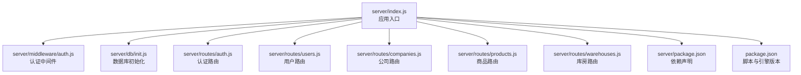
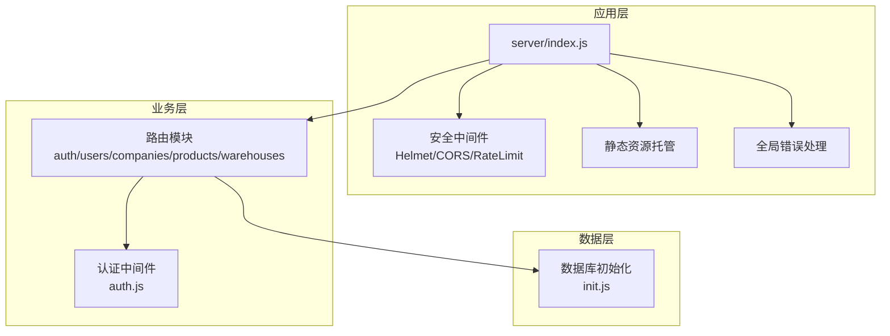
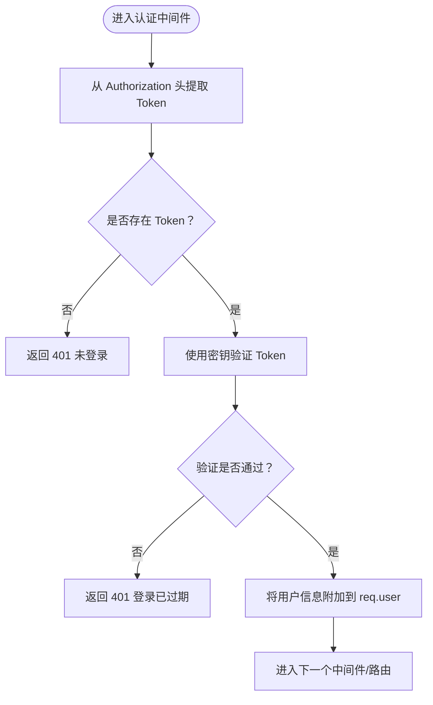
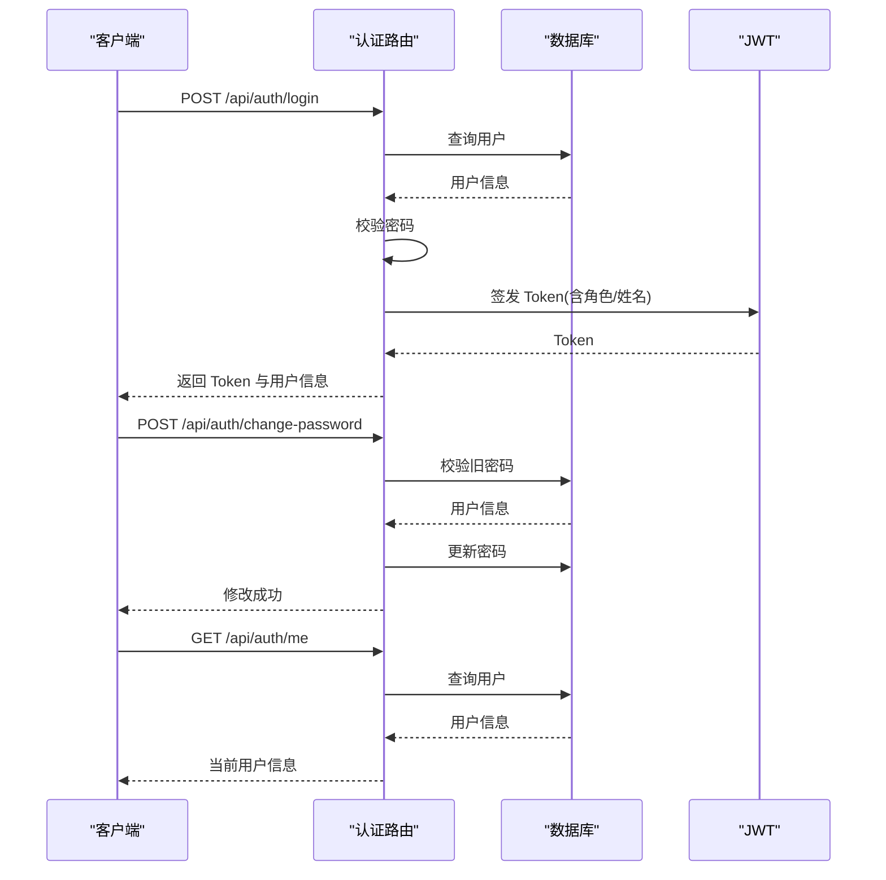
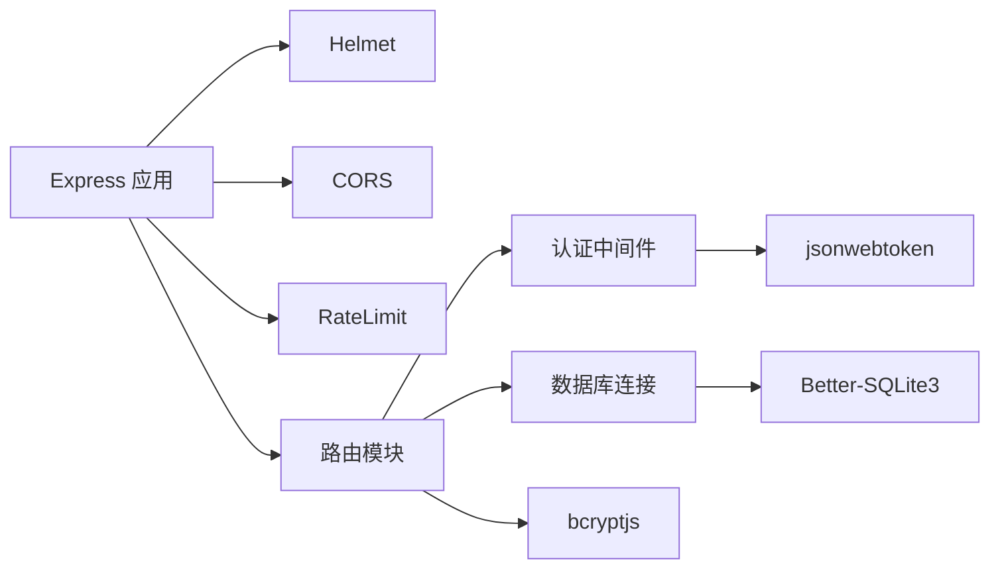

# 后端服务

<cite>
**本文引用的文件**
- [server/index.js](file://server/index.js)
- [server/db/init.js](file://server/db/init.js)
- [server/middleware/auth.js](file://server/middleware/auth.js)
- [server/routes/auth.js](file://server/routes/auth.js)
- [server/routes/users.js](file://server/routes/users.js)
- [server/routes/companies.js](file://server/routes/companies.js)
- [server/routes/products.js](file://server/routes/products.js)
- [server/routes/warehouses.js](file://server/routes/warehouses.js)
- [server/package.json](file://server/package.json)
- [package.json](file://package.json)
</cite>

## 目录
1. [简介](#简介)
2. [项目结构](#项目结构)
3. [核心组件](#核心组件)
4. [架构总览](#架构总览)
5. [详细组件分析](#详细组件分析)
6. [依赖关系分析](#依赖关系分析)
7. [性能考虑](#性能考虑)
8. [故障排查指南](#故障排查指南)
9. [结论](#结论)
10. [附录](#附录)

## 简介
本项目为 SY-Q 做账管理系统的后端服务，采用 Express 框架与 Better-SQLite3 数据库，提供认证授权、RESTful 路由模块化组织、数据库初始化与迁移、速率限制与安全中间件等能力。后端通过统一入口注册路由，并在生产环境提供静态资源托管与回退页面。

## 项目结构
后端目录 server 下按功能分层组织：
- 中间件：认证与权限控制
- 路由：按业务模块划分的 RESTful 接口
- 数据库：Better-SQLite3 初始化与表结构定义
- 入口：Express 应用启动、中间件与路由注册、全局错误处理



图表来源
- [server/index.js:1-120](file://server/index.js#L1-L120)
- [server/middleware/auth.js:1-29](file://server/middleware/auth.js#L1-L29)
- [server/db/init.js:1-217](file://server/db/init.js#L1-L217)
- [server/routes/auth.js:1-69](file://server/routes/auth.js#L1-L69)
- [server/routes/users.js:1-87](file://server/routes/users.js#L1-L87)
- [server/routes/companies.js:1-89](file://server/routes/companies.js#L1-L89)
- [server/routes/products.js:1-91](file://server/routes/products.js#L1-L91)
- [server/routes/warehouses.js:1-95](file://server/routes/warehouses.js#L1-L95)
- [server/package.json:1-26](file://server/package.json#L1-L26)
- [package.json:1-13](file://package.json#L1-L13)

章节来源
- [server/index.js:1-120](file://server/index.js#L1-L120)
- [server/package.json:1-26](file://server/package.json#L1-L26)
- [package.json:1-13](file://package.json#L1-L13)

## 核心组件
- 应用入口与中间件
  - 安全头、CORS、请求体大小限制、登录与全局 API 速率限制、静态资源托管与回退页面、全局错误处理
- 认证中间件
  - 从请求头提取 Bearer Token 并校验；提供管理员权限校验
- 数据库初始化
  - Better-SQLite3 连接、PRAGMA 设置、多表创建与迁移、默认数据插入
- 路由模块
  - 认证、用户、公司、商品、库房等模块化路由，统一返回结构

章节来源
- [server/index.js:1-120](file://server/index.js#L1-L120)
- [server/middleware/auth.js:1-29](file://server/middleware/auth.js#L1-L29)
- [server/db/init.js:1-217](file://server/db/init.js#L1-L217)
- [server/routes/auth.js:1-69](file://server/routes/auth.js#L1-L69)

## 架构总览
后端采用“入口应用 + 中间件 + 路由模块 + 数据库”的分层架构。入口负责安全与限流、注册路由；中间件负责认证与权限；路由模块处理业务逻辑；数据库模块负责初始化与迁移。



图表来源
- [server/index.js:1-120](file://server/index.js#L1-L120)
- [server/middleware/auth.js:1-29](file://server/middleware/auth.js#L1-L29)
- [server/db/init.js:1-217](file://server/db/init.js#L1-L217)
- [server/routes/auth.js:1-69](file://server/routes/auth.js#L1-L69)
- [server/routes/users.js:1-87](file://server/routes/users.js#L1-L87)
- [server/routes/companies.js:1-89](file://server/routes/companies.js#L1-L89)
- [server/routes/products.js:1-91](file://server/routes/products.js#L1-L91)
- [server/routes/warehouses.js:1-95](file://server/routes/warehouses.js#L1-L95)

## 详细组件分析

### 应用入口与中间件
- 安全响应头：禁用严格 CSP 与 EMBEDDER 策略以适配同域部署
- CORS：支持本地与 Render 域名白名单，允许 .onrender.com 子域
- 请求体限制：JSON 最大 2MB
- 登录频率限制：每 IP 每分钟最多 10 次
- 全局 API 速率限制：每 IP 每分钟最多 120 次
- 路由注册：按模块导入并挂载到 /api/* 前缀
- 静态资源：生产环境托管 dist 目录，回退到 index.html
- 全局错误处理：CORS 拦截与通用 500 返回

章节来源
- [server/index.js:1-120](file://server/index.js#L1-L120)

### 认证中间件
- 仅从 Authorization 头获取 Bearer Token，避免 URL 泄露
- 使用对称密钥进行签名与验证
- 提供管理员权限校验



图表来源
- [server/middleware/auth.js:1-29](file://server/middleware/auth.js#L1-L29)

章节来源
- [server/middleware/auth.js:1-29](file://server/middleware/auth.js#L1-L29)

### 数据库初始化与表结构
- 连接管理：单例连接，启用 WAL 模式与外键约束
- 表结构概览
  - 用户表：用户名唯一、角色、默认管理员标记
  - 系统设置表：键值配置
  - 库房表：名称、地址、备注
  - 商品库存表：商品与库房的多对多库存映射
  - 公司表：名称、信用代码、联系方式
  - 客户表：名称、联系方式
  - 商品表：公司关联、规格、单价、数量
  - 入库明细表：订单号、单价、数量、前后结存、操作人
  - 出库明细表：订单号、单价、数量、前后结存、操作人
  - 日常开销表：金额、支付方式、经手人等
- 迁移策略：动态检测列并增量添加
- 默认数据：首次初始化插入默认管理员与系统名称

```mermaid
erDiagram
USERS {
int id PK
text username UK
text password
text real_name
text phone
text role
int is_default
text created_at
}
SETTINGS {
text key PK
text value
}
WAREHOUSES {
int id PK
text name
text address
text remark
text created_at
}
PRODUCT_WAREHOUSE_STOCK {
int id PK
int product_id FK
int warehouse_id FK
real quantity
unique product_id, warehouse_id
}
COMPANIES {
int id PK
text name
text credit_code
text address
text contact
text phone
text remark
text created_at
}
CLIENTS {
int id PK
text name
text credit_code
text address
text contact
text phone
text remark
text created_at
}
PRODUCTS {
int id PK
text name
int company_id FK
text spec
text unit
real quantity
real price
text remark
text created_by
text created_at
}
STOCK_IN {
int id PK
text order_no
int product_id FK
int company_id FK
text unit
real price
real quantity
real before_qty
real after_qty
real total_amount
text remark
text operator
text created_at
}
STOCK_OUT {
int id PK
text order_no
int product_id FK
int client_id FK
text unit
real price
real quantity
real before_qty
real after_qty
real total_amount
text remark
text operator
text created_at
}
EXPENSES {
int id PK
text name
text category
text pay_method
real amount
text payer
text recipient
text remark
text created_by
text created_at
}
PRODUCTS ||--o{ PRODUCT_WAREHOUSE_STOCK : "库存"
COMPANIES ||--o{ PRODUCTS : "拥有"
PRODUCTS ||--o{ STOCK_IN : "入库"
PRODUCTS ||--o{ STOCK_OUT : "出库"
WAREHOUSES ||--o{ PRODUCT_WAREHOUSE_STOCK : "库存"
CLIENTS ||--o{ STOCK_OUT : "客户"
```

图表来源
- [server/db/init.js:18-214](file://server/db/init.js#L18-L214)

章节来源
- [server/db/init.js:1-217](file://server/db/init.js#L1-L217)

### 认证路由模块
- 登录：校验用户名与密码，签发含有效期的 JWT
- 修改密码：校验旧密码，更新为新密码
- 获取当前用户：返回用户基本信息



图表来源
- [server/routes/auth.js:1-69](file://server/routes/auth.js#L1-L69)
- [server/middleware/auth.js:1-29](file://server/middleware/auth.js#L1-L29)
- [server/db/init.js:1-217](file://server/db/init.js#L1-L217)

章节来源
- [server/routes/auth.js:1-69](file://server/routes/auth.js#L1-L69)

### 用户管理路由模块
- 列表查询：支持关键词、分页
- 新增用户：密码加密存储
- 修改用户：重复性检查、可选更新密码
- 删除用户：默认管理员不可删除

章节来源
- [server/routes/users.js:1-87](file://server/routes/users.js#L1-L87)

### 公司管理路由模块
- 列表查询：支持关键词、分页
- 获取全部公司：用于下拉选择
- 新增/修改：名称去空格与重复检查
- 删除：若存在关联商品则拒绝删除

章节来源
- [server/routes/companies.js:1-89](file://server/routes/companies.js#L1-L89)

### 商品管理路由模块
- 列表查询：支持多表联查与关键词
- 新增/修改：名称+公司维度去重
- 删除：若存在入库/出库记录则拒绝删除

章节来源
- [server/routes/products.js:1-91](file://server/routes/products.js#L1-L91)

### 库房管理路由模块
- 获取全部库房：用于下拉选择
- 查询商品在各库房的库存分布
- 列表查询、新增/修改、删除：删除前检查入库/出库记录

章节来源
- [server/routes/warehouses.js:1-95](file://server/routes/warehouses.js#L1-L95)

## 依赖关系分析
- Express 应用依赖安全与限流中间件、CORS、Better-SQLite3、JWT、bcryptjs
- 路由模块依赖数据库连接与认证中间件
- 数据库初始化独立于路由，但被所有业务模块共享



图表来源
- [server/index.js:1-120](file://server/index.js#L1-L120)
- [server/package.json:14-24](file://server/package.json#L14-L24)
- [server/middleware/auth.js:1-29](file://server/middleware/auth.js#L1-L29)
- [server/routes/auth.js:1-69](file://server/routes/auth.js#L1-L69)

章节来源
- [server/package.json:1-26](file://server/package.json#L1-L26)
- [package.json:1-13](file://package.json#L1-L13)

## 性能考虑
- 数据库连接：单实例连接，建议在高并发场景评估连接池与事务优化
- 查询分页：列表接口均支持分页参数，避免一次性加载大量数据
- 速率限制：登录与全局 API 限流降低暴力破解与滥用风险
- 静态资源：生产环境统一托管，减少不必要的后端请求

## 故障排查指南
- CORS 拒绝访问：检查 ALLOWED_ORIGINS 环境变量与请求来源域名
- 登录失败：确认用户名存在且密码正确，检查 bcrypt 加密一致性
- 权限不足：非管理员调用管理员接口会返回 403
- 数据库异常：确认数据库文件路径与 WAL/外键 PRAGMA 设置生效
- 全局错误：统一 500 返回，结合服务端日志定位问题

章节来源
- [server/index.js:108-115](file://server/index.js#L108-L115)
- [server/middleware/auth.js:21-26](file://server/middleware/auth.js#L21-L26)
- [server/db/init.js:9-16](file://server/db/init.js#L9-L16)

## 结论
本后端服务以 Express 为核心，配合 Better-SQLite3 实现轻量级持久化，通过模块化路由与认证中间件构建清晰的业务边界。安全中间件与速率限制保障运行稳定，数据库初始化与迁移确保结构演进的兼容性。建议后续引入更完善的日志体系与连接池配置以提升生产稳定性。

## 附录
- 端口与环境：默认监听端口由环境变量控制
- 构建与启动：根目录脚本负责前端构建与后端启动

章节来源
- [server/index.js:8-9](file://server/index.js#L8-L9)
- [package.json:5-7](file://package.json#L5-L7)