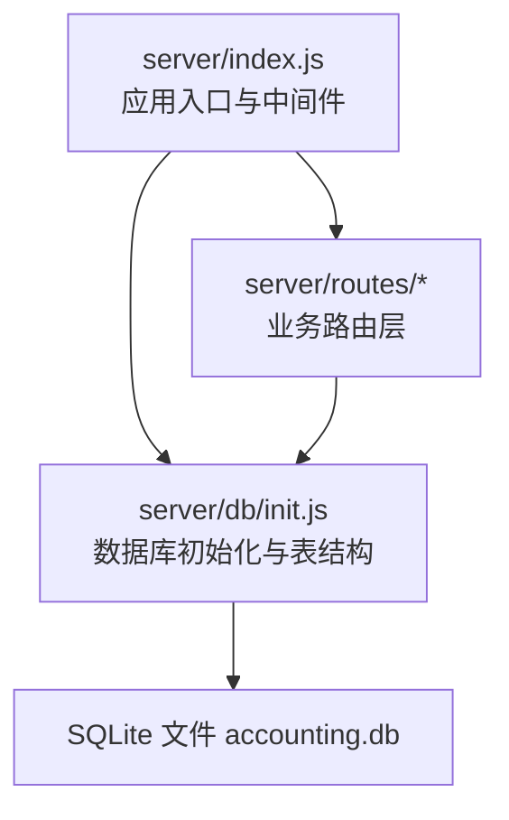
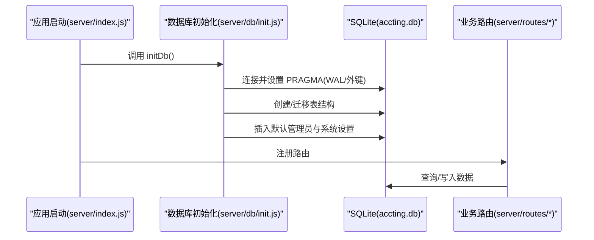
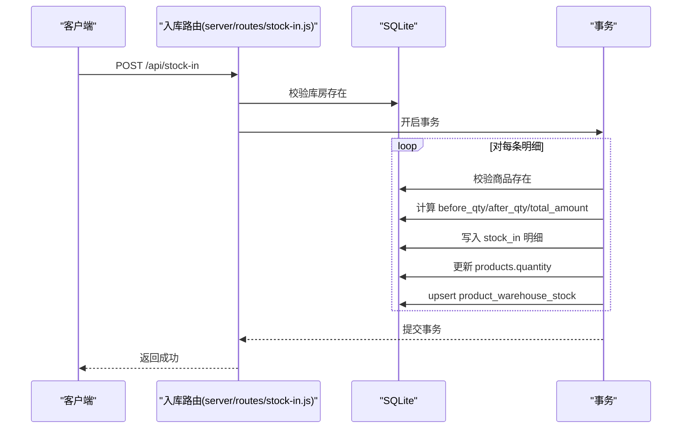
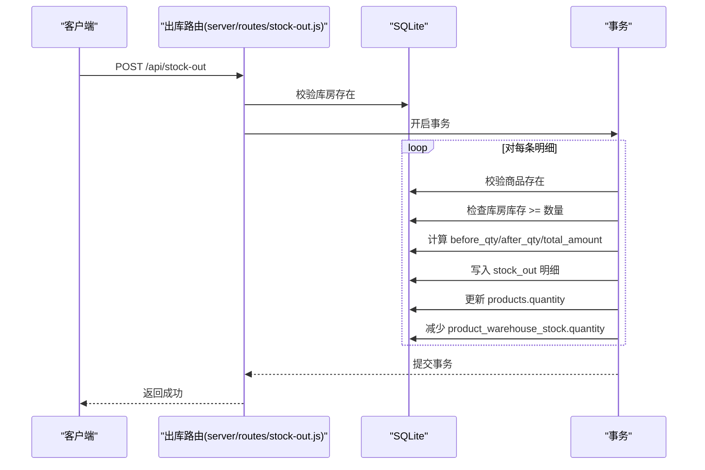
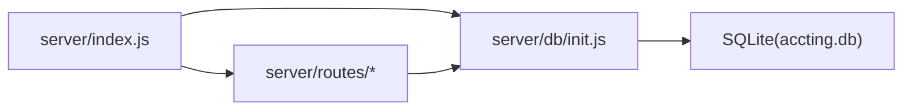
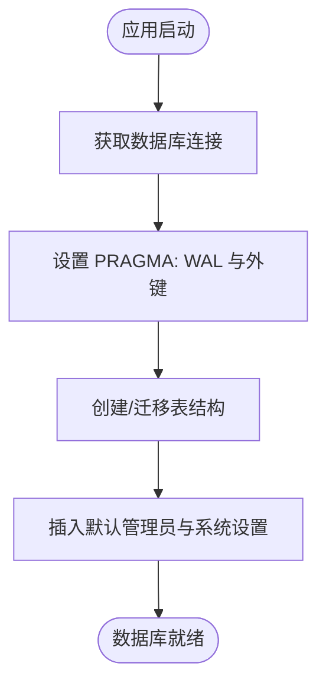

# 数据库设计

<cite>
**本文引用的文件**
- [server/db/init.js](file://server/db/init.js)
- [server/index.js](file://server/index.js)
- [server/routes/products.js](file://server/routes/products.js)
- [server/routes/stock-in.js](file://server/routes/stock-in.js)
- [server/routes/stock-out.js](file://server/routes/stock-out.js)
- [server/routes/companies.js](file://server/routes/companies.js)
- [server/routes/clients.js](file://server/routes/clients.js)
- [server/routes/warehouses.js](file://server/routes/warehouses.js)
- [server/routes/expenses.js](file://server/routes/expenses.js)
- [package.json](file://package.json)
</cite>

## 目录
1. [简介](#简介)
2. [项目结构](#项目结构)
3. [核心组件](#核心组件)
4. [架构总览](#架构总览)
5. [详细组件分析](#详细组件分析)
6. [依赖分析](#依赖分析)
7. [性能考虑](#性能考虑)
8. [故障排查指南](#故障排查指南)
9. [结论](#结论)
10. [附录](#附录)

## 简介
本文件面向 SY-Q 数据库设计，围绕 SQLite 在服务端的初始化流程、表结构与约束、数据模型关系、迁移与版本管理、数据完整性保障以及备份恢复流程进行系统化梳理，并结合 Better-SQLite3 的使用方式与性能优化建议，帮助开发者与运维人员快速理解并维护该数据库。

## 项目结构
后端通过 Express 提供 API，数据库初始化在应用启动阶段完成；路由层负责业务逻辑与参数校验，统一通过数据库模块访问 SQLite。整体采用“初始化数据库 → 注册路由 → 处理请求”的控制流。



图表来源
- [server/index.js:65-66](file://server/index.js#L65-L66)
- [server/db/init.js:18-214](file://server/db/init.js#L18-L214)

章节来源
- [server/index.js:1-120](file://server/index.js#L1-L120)
- [package.json:1-13](file://package.json#L1-L13)

## 核心组件
- 数据库初始化模块：负责连接 SQLite、启用 WAL 模式与外键约束、创建/迁移表结构、插入默认配置与管理员账户。
- 路由模块：封装 CRUD 与业务流程，如商品、入库、出库、公司、客户、库房、日常开销等。
- 应用入口：在启动时调用初始化，注册路由并对外提供服务。

章节来源
- [server/db/init.js:9-217](file://server/db/init.js#L9-L217)
- [server/index.js:65-95](file://server/index.js#L65-L95)

## 架构总览
数据库初始化与表结构创建在应用启动时执行，随后各路由根据业务需要查询或更新数据。事务用于保证入库/出库的原子性，外键约束确保参照完整性。



图表来源
- [server/index.js:65-66](file://server/index.js#L65-L66)
- [server/db/init.js:18-214](file://server/db/init.js#L18-L214)

## 详细组件分析

### 数据库初始化与迁移
- 连接与 PRAGMA 设置：使用 Better-SQLite3 连接本地数据库文件，开启 WAL 模式以提升并发读写能力，启用外键约束以保证参照完整性。
- 表结构创建：按需创建用户、系统设置、库房、商品、入库明细、出库明细、日常开销、商品-库房库存映射等表。
- 字段与约束：
  - 主键与自增：多数整型主键采用自增。
  - 唯一性：用户名唯一、商品与公司组合唯一、商品-库房组合唯一。
  - 外键：商品关联公司、出入库明细分别关联产品/公司/客户/库房。
  - 默认值：大量字段提供默认值，时间戳使用本地时间。
  - 枚举：角色字段限定取值范围。
- 迁移策略：通过查询表结构信息判断列是否存在，按需新增列，避免破坏既有数据。
- 默认数据：若无默认管理员账号则创建；若系统名称未设置则写入默认值。

章节来源
- [server/db/init.js:18-214](file://server/db/init.js#L18-L214)

### 数据模型与关系
以下 ER 关系图展示核心实体与外键约束：

```mermaid
erDiagram
USERS {
int id PK
text username UK
text password
text real_name
text phone
text role
int is_default
text created_at
}
SETTINGS {
text key PK
text value
}
COMPANIES {
int id PK
text name
text credit_code
text address
text contact
text phone
text remark
text created_at
}
CLIENTS {
int id PK
text name
text credit_code
text address
text contact
text phone
text remark
text created_at
}
WAREHOUSES {
int id PK
text name
text address
text remark
text created_at
}
PRODUCTS {
int id PK
text name
int company_id FK
text spec
text unit
real quantity
real price
text remark
text created_by
text created_at
}
PRODUCT_WAREHOUSE_STOCK {
int id PK
int product_id FK
int warehouse_id FK
real quantity
unique product_id warehouse_id
}
STOCK_IN {
int id PK
text order_no
int product_id FK
int company_id FK
text unit
real price
real quantity
real before_qty
real after_qty
real total_amount
text remark
text operator
text created_at
}
STOCK_OUT {
int id PK
text order_no
int product_id FK
int client_id FK
text unit
real price
real quantity
real before_qty
real after_qty
real total_amount
text remark
text operator
text created_at
}
EXPENSES {
int id PK
text name
text category
text pay_method
real amount
text payer
text recipient
text remark
text created_by
text created_at
}
PRODUCTS }o--|| COMPANIES : "company_id"
STOCK_IN }o--|| PRODUCTS : "product_id"
STOCK_IN }o--|| COMPANIES : "company_id"
STOCK_OUT }o--|| PRODUCTS : "product_id"
STOCK_OUT }o--|| CLIENTS : "client_id"
PRODUCT_WAREHOUSE_STOCK }o--|| PRODUCTS : "product_id"
PRODUCT_WAREHOUSE_STOCK }o--|| WAREHOUSES : "warehouse_id"
```

图表来源
- [server/db/init.js:21-186](file://server/db/init.js#L21-L186)

章节来源
- [server/db/init.js:21-186](file://server/db/init.js#L21-L186)

### 入库流程（事务与库存更新）
入库涉及多步写入与一致性要求，采用事务包裹，确保原子性；同时更新总库存与库房库存映射表。



图表来源
- [server/routes/stock-in.js:110-170](file://server/routes/stock-in.js#L110-L170)
- [server/db/init.js:54-65](file://server/db/init.js#L54-L65)

章节来源
- [server/routes/stock-in.js:110-170](file://server/routes/stock-in.js#L110-L170)

### 出库流程（事务与库存扣减）
出库同样使用事务，先检查库房库存是否充足，再写入明细并扣减总库存与库房库存。



图表来源
- [server/routes/stock-out.js:110-175](file://server/routes/stock-out.js#L110-L175)
- [server/db/init.js:142-161](file://server/db/init.js#L142-L161)

章节来源
- [server/routes/stock-out.js:110-175](file://server/routes/stock-out.js#L110-L175)

### 商品与公司/客户/库房管理
- 商品：支持按关键字、分页查询，插入时按“名称+公司”去重，删除前检查库存与出入库记录。
- 公司：支持查找或创建，插入/更新时去重，删除前检查关联商品。
- 客户：支持查找或创建，插入/更新时去重，删除前检查关联出库记录。
- 库房：支持按关键字查询与分页，删除前检查库存与出入库记录，并清理映射表。

章节来源
- [server/routes/products.js:8-98](file://server/routes/products.js#L8-L98)
- [server/routes/companies.js:32-101](file://server/routes/companies.js#L32-L101)
- [server/routes/clients.js:30-78](file://server/routes/clients.js#L30-L78)
- [server/routes/warehouses.js:30-114](file://server/routes/warehouses.js#L30-L114)

### 日常开销管理
- 支持按关键字搜索、分页查询、新增、修改、删除。
- 新增时记录经手人与创建人，便于审计。

章节来源
- [server/routes/expenses.js:8-72](file://server/routes/expenses.js#L8-L72)

## 依赖分析
- 应用入口依赖数据库初始化模块，后者负责创建/迁移表结构与默认数据。
- 各路由模块通过数据库初始化导出的连接句柄访问 SQLite。
- 外键约束与事务用于保证数据一致性，减少跨模块耦合带来的脏数据风险。



图表来源
- [server/index.js:65-95](file://server/index.js#L65-L95)
- [server/db/init.js:18-214](file://server/db/init.js#L18-L214)

章节来源
- [server/index.js:65-95](file://server/index.js#L65-L95)
- [server/db/init.js:18-214](file://server/db/init.js#L18-L214)

## 性能考虑
- WAL 模式：启用 WAL 提升并发读写吞吐，适合中小规模业务场景。
- 事务批处理：入库/出库使用事务，减少多次提交带来的锁竞争与日志开销。
- upsert 与冲突处理：使用 upsert 更新库房库存，避免重复查询与竞态。
- 索引建议（基于现有结构）：当前未显式创建索引。可考虑在高频过滤字段上建立索引（如 stock_in.order_no、stock_out.order_no、products.name/spec、clients.name、companies.name、warehouses.name），以降低查询成本。
- 参数化查询：所有写入均使用预编译语句，有效防止 SQL 注入。
- 事务粒度：出入库循环内逐条明细提交，建议在高并发场景下评估拆分批次或合并提交的收益。

章节来源
- [server/db/init.js:12-13](file://server/db/init.js#L12-L13)
- [server/routes/stock-in.js:133-162](file://server/routes/stock-in.js#L133-L162)
- [server/routes/stock-out.js:133-167](file://server/routes/stock-out.js#L133-L167)

## 故障排查指南
- 外键约束失败：当尝试删除仍有关联记录的实体（如商品、库房、客户）时会失败，需先清理关联数据或调整业务流程。
- 库房库存不足：出库时若指定库房库存不足，会抛出错误提示具体商品与当前库存。
- 单据号冲突：入库/出库单号生成采用随机策略并查询去重，若出现冲突请检查生成逻辑与并发情况。
- 默认数据缺失：若管理员或系统名称未初始化，可在数据库中手动确认或重启应用触发初始化逻辑。
- CORS/速率限制：应用侧已内置 CORS 与限流策略，若出现访问受限问题，请检查来源与频率阈值。

章节来源
- [server/routes/products.js:81-94](file://server/routes/products.js#L81-L94)
- [server/routes/stock-out.js:143-149](file://server/routes/stock-out.js#L143-L149)
- [server/index.js:17-63](file://server/index.js#L17-L63)

## 结论
本设计以 Better-SQLite3 为核心，通过 WAL 与外键约束保障一致性与并发性能；以事务包裹出入库流程，确保数据原子性；以迁移脚本兼容历史版本。建议在后续迭代中补充关键字段索引与更完善的监控告警，持续优化查询与写入性能。

## 附录

### 数据库初始化流程（流程图）


图表来源
- [server/db/init.js:9-214](file://server/db/init.js#L9-L214)

### 表结构与约束要点（摘要）
- users：用户名唯一、角色枚举、默认字段、时间戳。
- settings：键值对配置表。
- warehouses：库房基本信息。
- product_warehouse_stock：商品-库房库存映射，唯一约束。
- companies：供应商信息。
- clients：客户信息。
- products：商品信息，关联公司，含单价、数量等。
- stock_in：入库明细，关联产品/公司/库房，含单价、数量、金额、前后库存。
- stock_out：出库明细，关联产品/客户/库房。
- expenses：日常开销，含分类、付款方式、金额、经手人等。

章节来源
- [server/db/init.js:21-186](file://server/db/init.js#L21-L186)