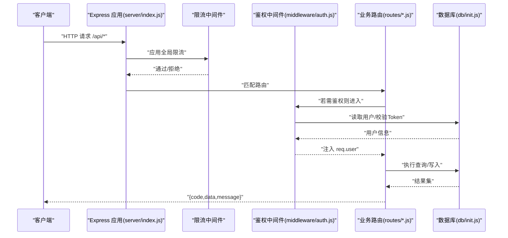
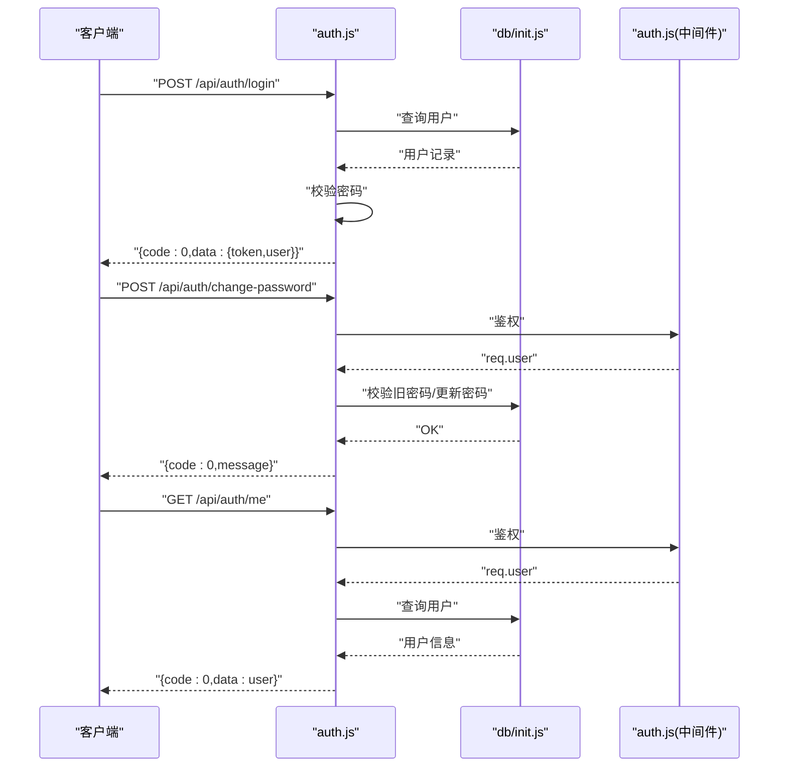
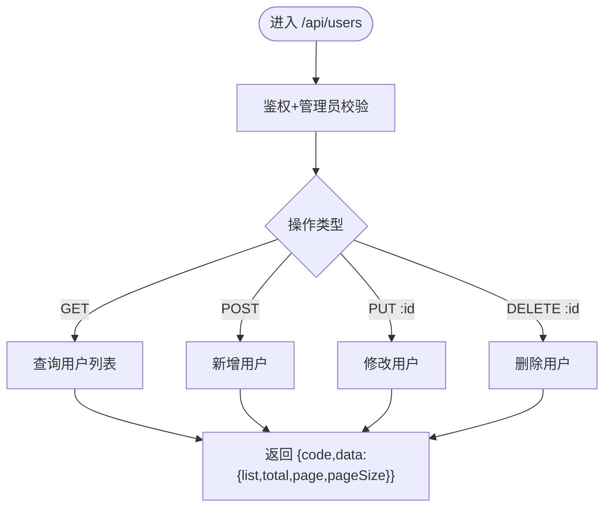
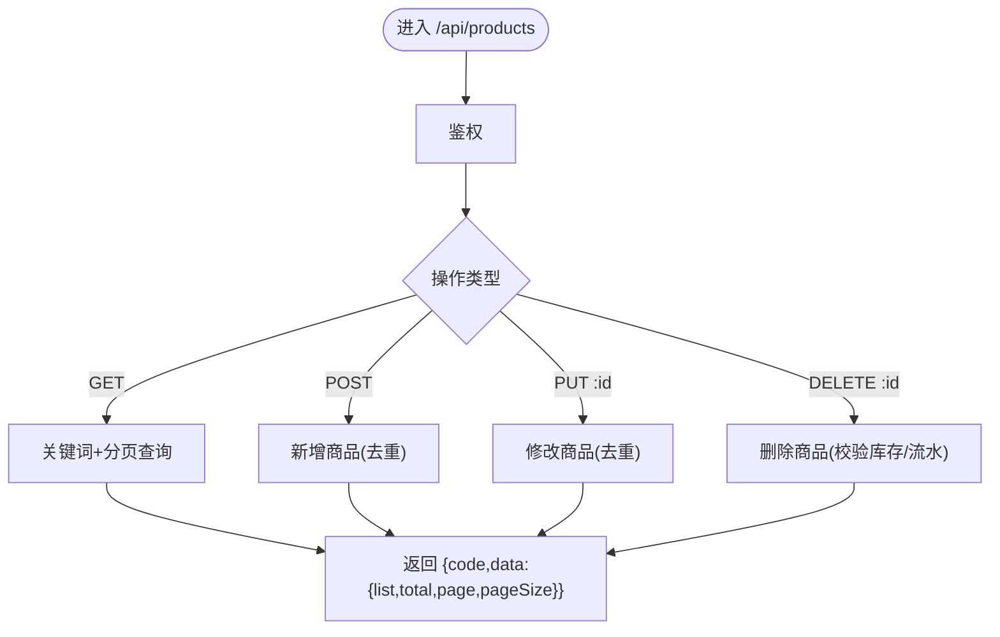
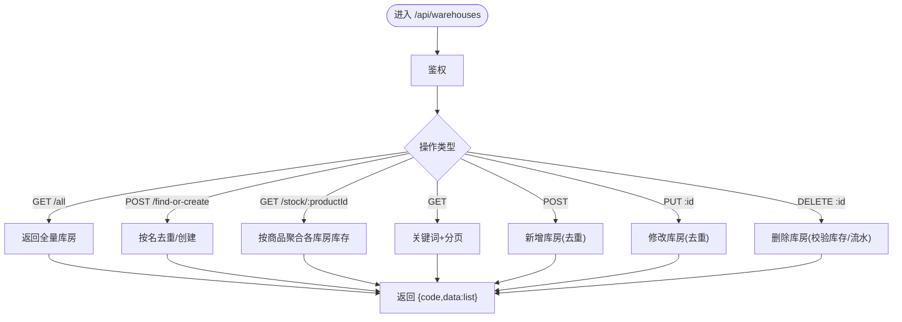
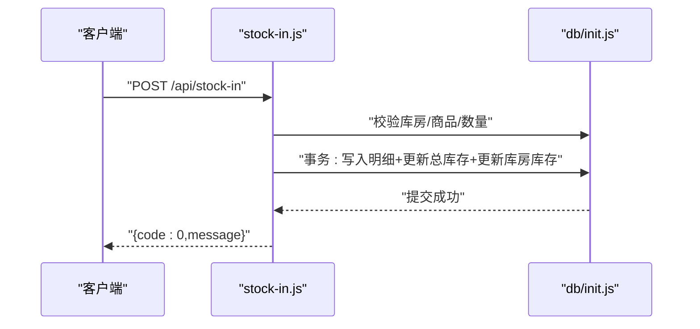
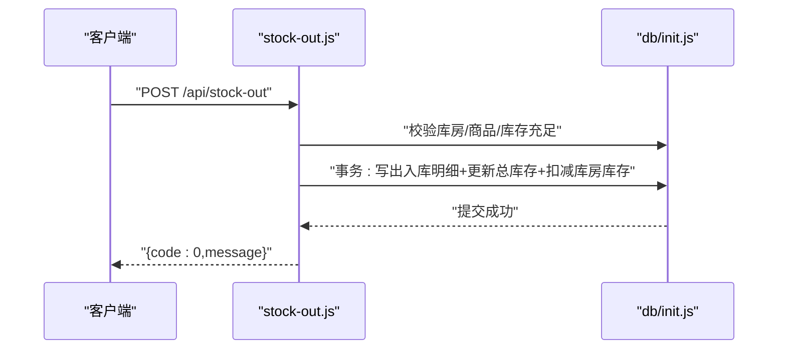
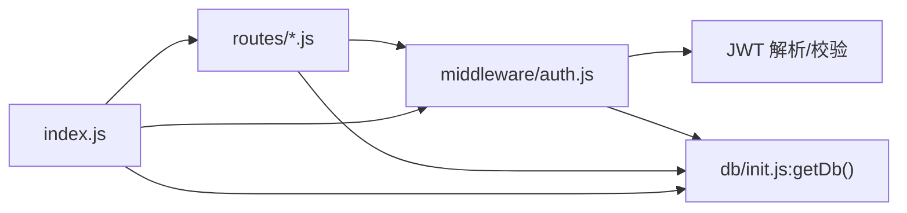

# 路由模块

<cite>
**本文引用的文件**
- [server/index.js](file://server/index.js)
- [server/middleware/auth.js](file://server/middleware/auth.js)
- [server/db/init.js](file://server/db/init.js)
- [server/routes/auth.js](file://server/routes/auth.js)
- [server/routes/users.js](file://server/routes/users.js)
- [server/routes/companies.js](file://server/routes/companies.js)
- [server/routes/clients.js](file://server/routes/clients.js)
- [server/routes/products.js](file://server/routes/products.js)
- [server/routes/warehouses.js](file://server/routes/warehouses.js)
- [server/routes/stock-in.js](file://server/routes/stock-in.js)
- [server/routes/stock-out.js](file://server/routes/stock-out.js)
- [server/routes/expenses.js](file://server/routes/expenses.js)
- [server/routes/dashboard.js](file://server/routes/dashboard.js)
- [server/routes/data-center.js](file://server/routes/data-center.js)
- [server/routes/settings.js](file://server/routes/settings.js)
</cite>

## 目录
1. [简介](#简介)
2. [项目结构](#项目结构)
3. [核心组件](#核心组件)
4. [架构总览](#架构总览)
5. [详细组件分析](#详细组件分析)
6. [依赖关系分析](#依赖关系分析)
7. [性能与安全考量](#性能与安全考量)
8. [故障排查指南](#故障排查指南)
9. [结论](#结论)
10. [附录](#附录)

## 简介
本文件为 SY-Q 路由模块的综合技术文档，面向前端与后端开发者及运维人员，系统性阐述后端路由层的设计与实现，包括 RESTful 接口设计原则、路由命名规范、参数校验与请求处理、响应格式标准化、中间件与权限控制、以及测试与调试策略。内容基于实际代码进行深入解析，并辅以可视化图示帮助理解。

## 项目结构
后端采用 Express 作为 Web 框架，路由集中在 server/routes 下，按业务域划分；认证与权限控制位于 server/middleware；数据库初始化与建表逻辑位于 server/db；服务启动入口为 server/index.js。

```mermaid
graph TB
A["server/index.js<br/>应用入口与全局中间件"] --> B["server/routes/auth.js<br/>认证相关"]
A --> C["server/routes/users.js<br/>用户管理"]
A --> D["server/routes/companies.js<br/>公司管理"]
A --> E["server/routes/clients.js<br/>客户管理"]
A --> F["server/routes/products.js<br/>商品管理"]
A --> G["server/routes/warehouses.js<br/>库房管理"]
A --> H["server/routes/stock-in.js<br/>入库流程"]
A --> I["server/routes/stock-out.js<br/>出库流程"]
A --> J["server/routes/expenses.js<br/>开销管理"]
A --> K["server/routes/dashboard.js<br/>仪表盘"]
A --> L["server/routes/data-center.js<br/>数据中心/导入导出/备份恢复"]
A --> M["server/routes/settings.js<br/>系统设置"]
N["server/middleware/auth.js<br/>鉴权中间件"] --> B
N --> C
N --> D
N --> E
N --> F
N --> G
N --> H
N --> I
N --> J
N --> K
N --> L
N --> M
O["server/db/init.js<br/>数据库初始化/建表/默认数据"] --> B
O --> C
O --> D
O --> E
O --> F
O --> G
O --> H
O --> I
O --> J
O --> K
O --> L
O --> M
```

图表来源
- [server/index.js:68-95](file://server/index.js#L68-L95)
- [server/middleware/auth.js:1-29](file://server/middleware/auth.js#L1-L29)
- [server/db/init.js:18-214](file://server/db/init.js#L18-L214)

章节来源
- [server/index.js:68-95](file://server/index.js#L68-L95)

## 核心组件
- 中间件层
  - 认证中间件：从 Authorization 头提取 Bearer Token，解码并注入用户信息到请求上下文。
  - 管理员中间件：校验用户角色是否为 admin。
- 数据访问层
  - 使用 better-sqlite3 连接本地 SQLite 数据库，统一通过 getDb 获取连接，启用 WAL 与外键约束。
  - 初始化脚本负责建表、迁移与默认数据插入。
- 路由层
  - 按业务域拆分路由文件，统一返回标准化响应结构 { code, data, message }。
  - 部分路由使用中间件进行鉴权与角色控制。

章节来源
- [server/middleware/auth.js:5-26](file://server/middleware/auth.js#L5-L26)
- [server/db/init.js:9-214](file://server/db/init.js#L9-L214)
- [server/routes/auth.js:1-69](file://server/routes/auth.js#L1-L69)

## 架构总览
后端服务启动时执行数据库初始化，随后加载各业务路由并通过 /api 前缀对外提供 RESTful 接口。登录接口单独限流，其余 /api 下接口统一限流。静态资源在生产环境由服务托管。

图表来源
- [server/index.js:46-63](file://server/index.js#L46-L63)
- [server/index.js:83-95](file://server/index.js#L83-L95)
- [server/middleware/auth.js:5-26](file://server/middleware/auth.js#L5-L26)
- [server/db/init.js:9-214](file://server/db/init.js#L9-L214)

## 详细组件分析

### 认证与用户中心
- 登录：校验必填字段，查询用户并比对密码，签发含用户信息与角色的 JWT，有效期 24 小时。
- 修改密码：鉴权后校验旧密码与新密码长度，更新加密后的密码。
- 当前用户：返回用户基本信息。
- 响应格式：统一 { code, data?, message? }，错误码遵循语义化约定。

图表来源
- [server/routes/auth.js:9-66](file://server/routes/auth.js#L9-L66)
- [server/middleware/auth.js:5-19](file://server/middleware/auth.js#L5-L19)
- [server/db/init.js:9-214](file://server/db/init.js#L9-L214)

章节来源
- [server/routes/auth.js:1-69](file://server/routes/auth.js#L1-L69)
- [server/middleware/auth.js:1-29](file://server/middleware/auth.js#L1-L29)

### 用户管理
- 列表：支持关键词、分页查询，返回 list、total、page、pageSize。
- 新增：校验必填项，用户名唯一，插入默认角色 user。
- 修改：支持密码可选更新，避免重复。
- 删除：默认管理员不可删除，防误删。

图表来源
- [server/routes/users.js:7-84](file://server/routes/users.js#L7-L84)

章节来源
- [server/routes/users.js:1-87](file://server/routes/users.js#L1-L87)

### 商品管理
- 列表：支持关键词（名称/规格/经办人/公司），分页查询。
- 新增：同公司下商品名称唯一，记录经办人。
- 修改：同公司下名称去重。
- 删除：仅管理员可删；需满足“无库存、无出入库记录”。

图表来源
- [server/routes/products.js:6-95](file://server/routes/products.js#L6-L95)

章节来源
- [server/routes/products.js:1-98](file://server/routes/products.js#L1-L98)

### 库房管理
- 下拉列表：全量库房供选择。
- 自动查找/创建：按名称去重，不存在则创建。
- 库存分布：按商品聚合各库房库存。
- 列表/新增/修改/删除：均做名称去重与关联校验。

图表来源
- [server/routes/warehouses.js:6-114](file://server/routes/warehouses.js#L6-L114)

章节来源
- [server/routes/warehouses.js:1-117](file://server/routes/warehouses.js#L1-L117)

### 入库流程
- 单号生成：RK + 8 位随机数，保证唯一。
- 列表：按单号分组统计数量/金额，兼容明细列表。
- 明细：按单号查询商品明细。
- 批量入库：事务内校验商品、库房、数量，更新总库存与库房库存（upsert）。

图表来源
- [server/routes/stock-in.js:110-170](file://server/routes/stock-in.js#L110-L170)
- [server/db/init.js:54-65](file://server/db/init.js#L54-L65)

章节来源
- [server/routes/stock-in.js:1-173](file://server/routes/stock-in.js#L1-L173)

### 出库流程
- 单号生成：CK + 8 位随机数，保证唯一。
- 列表：按单号分组统计数量/金额，兼容明细列表。
- 明细：按单号查询商品明细。
- 批量出库：事务内校验库存充足、库房存在，更新总库存与库房库存。

图表来源
- [server/routes/stock-out.js:110-175](file://server/routes/stock-out.js#L110-L175)
- [server/db/init.js:54-65](file://server/db/init.js#L54-L65)

章节来源
- [server/routes/stock-out.js:1-178](file://server/routes/stock-out.js#L1-L178)

### 公司与客户管理
- 公司：管理员可见列表/新增/修改/删除，支持名称去重与关联校验。
- 客户：管理员可见列表/新增/修改/删除，支持名称去重与关联校验。

章节来源
- [server/routes/companies.js:1-104](file://server/routes/companies.js#L1-L104)
- [server/routes/clients.js:1-81](file://server/routes/clients.js#L1-L81)

### 开销管理
- 列表：支持多字段关键词搜索，分页返回。
- 新增/修改/删除：基础 CRUD，参数校验金额有效性。

章节来源
- [server/routes/expenses.js:1-73](file://server/routes/expenses.js#L1-L73)

### 仪表盘
- 管理员仪表盘：商品总数、库存总值、月度入库/出库/开销、近7日趋势、近期操作。
- 普通用户仪表盘：个人相关指标与近期操作。

章节来源
- [server/routes/dashboard.js:1-92](file://server/routes/dashboard.js#L1-L92)

### 数据中心（导入导出/备份恢复）
- 导出 Excel：支持商品、入库、出库、开销四类数据。
- 商品导入模板下载与导入：校验表头、批量插入。
- 备份/恢复/重置：管理员专用，含路径安全校验与重初始化。

章节来源
- [server/routes/data-center.js:28-257](file://server/routes/data-center.js#L28-L257)

### 系统设置
- 获取系统名称（公开）、获取系统设置（登录）、更新系统名称（管理员）。

章节来源
- [server/routes/settings.js:1-34](file://server/routes/settings.js#L1-L34)

## 依赖关系分析
- 组件耦合
  - 路由文件强依赖中间件（鉴权/管理员）与数据库初始化。
  - 中间件依赖 JWT 密钥与数据库读取用户信息。
  - 数据库初始化集中管理建表、迁移与默认数据。
- 外部依赖
  - Express、helmet、cors、rate-limit、multer、xlsx、bcryptjs、better-sqlite3。

图表来源
- [server/index.js:68-95](file://server/index.js#L68-L95)
- [server/middleware/auth.js:1-29](file://server/middleware/auth.js#L1-L29)
- [server/db/init.js:9-214](file://server/db/init.js#L9-L214)

章节来源
- [server/index.js:68-95](file://server/index.js#L68-L95)
- [server/middleware/auth.js:1-29](file://server/middleware/auth.js#L1-L29)
- [server/db/init.js:9-214](file://server/db/init.js#L9-L214)

## 性能与安全考量
- 限流策略
  - 登录接口独立限流（每 IP 每分钟最多 10 次）。
  - 全局 API 限流（每 IP 每分钟最多 120 次）。
- 安全加固
  - Helmet 基础安全头配置。
  - CORS 白名单与子域名放宽策略。
  - 仅从 Authorization 头读取 Token，避免泄露。
  - 管理员敏感操作（导入/备份/恢复/重置/设置系统名）均受管理员中间件保护。
- 数据一致性
  - 入库/出库使用事务，失败回滚。
  - 库存更新采用 upsert，避免并发冲突。
- 响应标准化
  - 统一 { code, data?, message? } 结构，便于前端一致处理。

章节来源
- [server/index.js:46-63](file://server/index.js#L46-L63)
- [server/middleware/auth.js:5-19](file://server/middleware/auth.js#L5-L19)
- [server/routes/stock-in.js:133-162](file://server/routes/stock-in.js#L133-L162)
- [server/routes/stock-out.js:133-166](file://server/routes/stock-out.js#L133-L166)

## 故障排查指南
- 认证失败
  - 现象：返回 401 未登录或登录过期。
  - 排查：确认请求头携带 Bearer Token，且未被代理/网关篡改；核对密钥一致。
- 权限不足
  - 现象：返回 403 权限不足。
  - 排查：确认用户角色为 admin；检查中间件顺序与挂载路径。
- 参数校验失败
  - 现象：返回 400 错误与具体提示。
  - 排查：对照各路由的必填字段与长度/范围要求（如密码长度、金额>0、名称非空等）。
- 数据库异常
  - 现象：事务回滚或唯一约束冲突。
  - 排查：查看是否存在重复名称、库存不足、关联数据未清理等问题；关注 WAL/外键 pragma 设置。
- 导入/导出问题
  - 现象：导入失败或导出为空。
  - 排查：确认文件类型与表头列名；检查备份文件路径与权限。

章节来源
- [server/middleware/auth.js:9-18](file://server/middleware/auth.js#L9-L18)
- [server/routes/auth.js:11-21](file://server/routes/auth.js#L11-L21)
- [server/routes/products.js:33-41](file://server/routes/products.js#L33-L41)
- [server/routes/stock-out.js:143-149](file://server/routes/stock-out.js#L143-L149)
- [server/routes/data-center.js:113-171](file://server/routes/data-center.js#L113-L171)

## 结论
本路由模块遵循清晰的领域划分与 RESTful 设计，结合统一的鉴权与管理员中间件，实现了从认证、用户、商品、库房、出入库、开销到仪表盘与数据中心的完整供应链与财务闭环。通过事务、唯一性校验与限流策略，兼顾了数据一致性与系统稳定性。建议后续在以下方面持续优化：参数校验抽象化、统一错误码与国际化文案、完善单元测试与集成测试覆盖、引入日志审计与更细粒度的速率限制。

## 附录

### RESTful 设计与命名规范
- 资源命名
  - 使用名词复数形式，如 /users、/products、/warehouses、/stock-in、/stock-out、/expenses、/companies、/clients、/dashboard、/data-center、/settings。
- 动词映射
  - GET：查询列表或详情
  - POST：创建
  - PUT：更新
  - DELETE：删除
- 路径参数
  - 使用 :id 表示资源标识，如 /users/:id、/products/:id、/warehouses/:id。
- 查询参数
  - keyword、page、pageSize 用于分页与筛选。
- 单号生成
  - 入库单号前缀 RK，出库单号前缀 CK，8 位随机数字，保证唯一性。

章节来源
- [server/routes/stock-in.js:9-30](file://server/routes/stock-in.js#L9-L30)
- [server/routes/stock-out.js:9-30](file://server/routes/stock-out.js#L9-L30)

### 响应格式标准化
- 成功响应：{ code: 0, data: ... }
- 参数错误：{ code: 400, message: "..." }
- 未登录/过期：{ code: 401, message: "..." }
- 权限不足：{ code: 403, message: "..." }
- 服务器错误：{ code: 500, message: "..." }
- 频繁请求：{ code: 429, message: "..." }

章节来源
- [server/routes/auth.js:11-21](file://server/routes/auth.js#L11-L21)
- [server/routes/products.js:72-74](file://server/routes/products.js#L72-L74)
- [server/index.js:46-63](file://server/index.js#L46-L63)

### 路由中间件与权限控制
- authMiddleware
  - 从 Authorization 头提取 Bearer Token，校验失败返回 401。
  - 成功则将用户信息注入 req.user。
- adminMiddleware
  - 校验 req.user.role === 'admin，否则返回 403。

章节来源
- [server/middleware/auth.js:5-26](file://server/middleware/auth.js#L5-L26)

### 测试策略与调试技巧
- 单元测试
  - 针对路由参数校验、事务提交/回滚、权限拦截编写断言。
- 集成测试
  - 使用 supertest 或 curl 验证 /api/** 的端到端流程（登录、创建、查询、更新、删除）。
- 调试技巧
  - 使用浏览器/Postman 发送请求，观察统一响应结构。
  - 关注数据库状态变化（事务、唯一约束、外键关联）。
  - 对高频接口开启限流，模拟 429 场景。
  - 导入/导出场景准备样例文件，逐步定位表头与数据问题。

[本节为通用实践建议，不直接分析具体文件，故无章节来源]