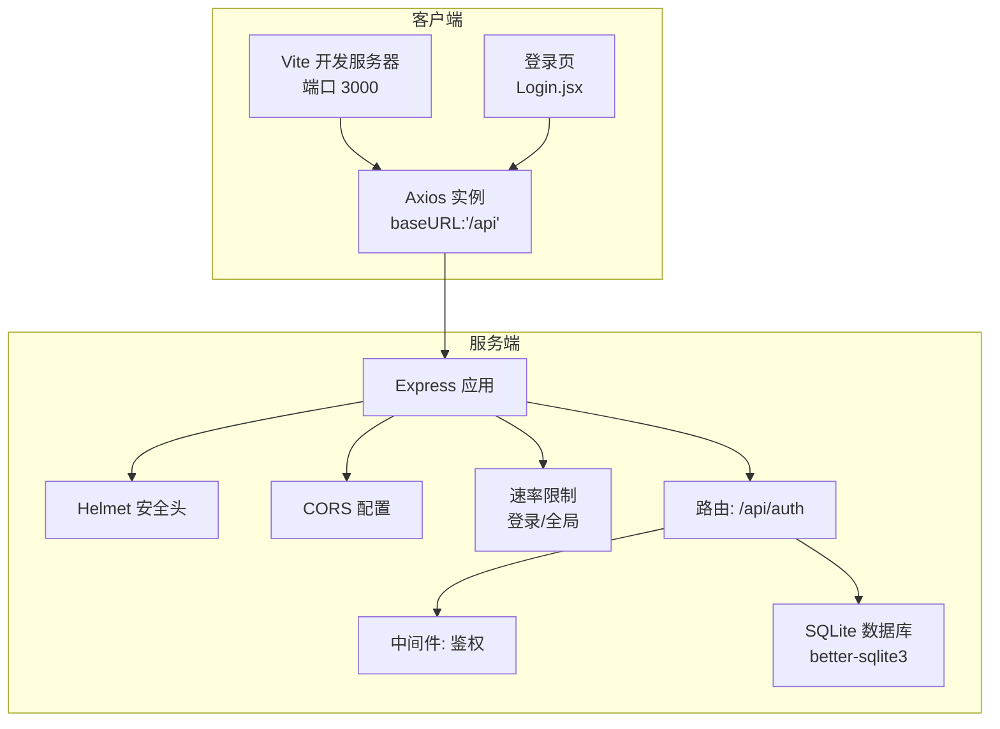
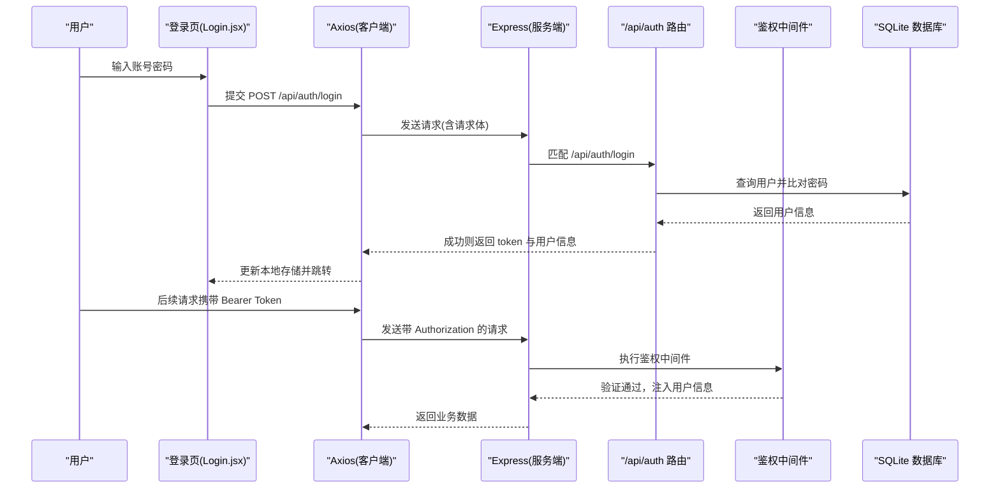
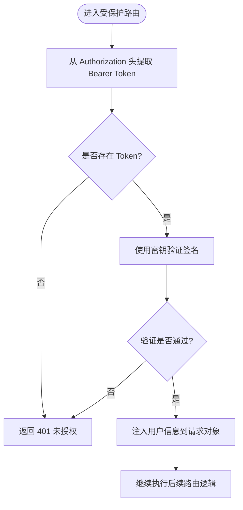
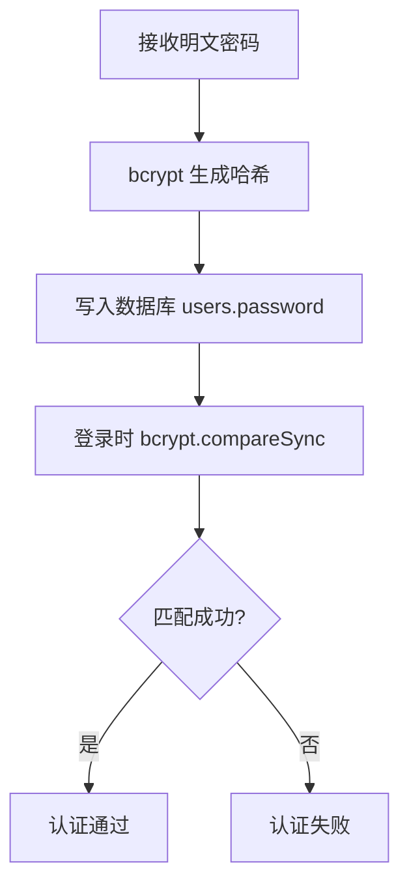
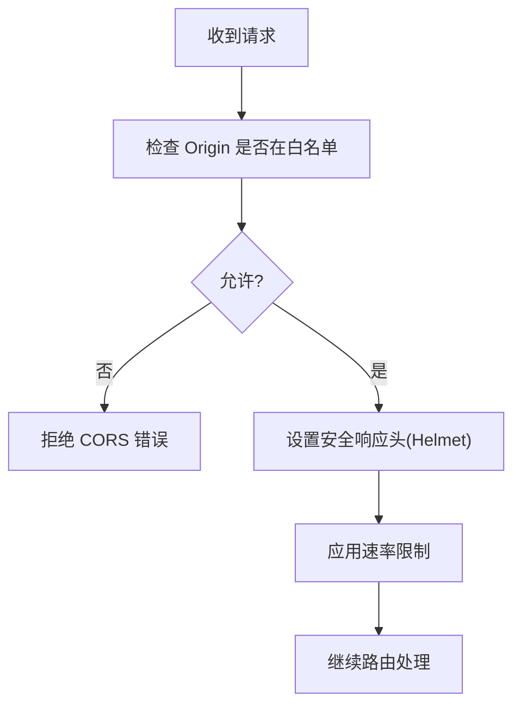
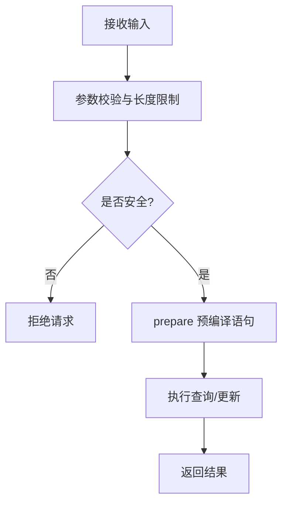
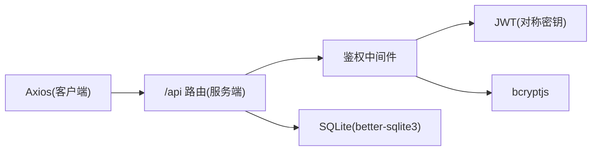

# 安全设计

<cite>
**本文引用的文件**
- [server/index.js](file://server/index.js)
- [server/middleware/auth.js](file://server/middleware/auth.js)
- [server/routes/auth.js](file://server/routes/auth.js)
- [server/db/init.js](file://server/db/init.js)
- [client/src/api/index.js](file://client/src/api/index.js)
- [client/src/pages/Login.jsx](file://client/src/pages/Login.jsx)
- [client/vite.config.js](file://client/vite.config.js)
- [package.json](file://package.json)
</cite>

## 目录
1. 引言
2. 项目结构
3. 核心组件
4. 架构总览
5. 详细组件分析
6. 依赖关系分析
7. 性能与安全考虑
8. 故障排查指南
9. 结论
10. 附录

## 引言
本文件面向 SY-Q 系统的安全设计，聚焦以下方面：
- JWT 令牌认证机制：生成、验证与失效处理流程
- 密码加密存储：bcrypt 使用与盐值管理
- 中间件安全机制：CORS 配置、Helmet 安全头、速率限制
- 攻击防护：XSS、CSRF、SQL 注入
- 审计与日志：最佳实践建议

本设计文档基于仓库中现有实现进行分析，并在必要处提出改进建议。

## 项目结构
后端采用 Express，前端使用 Vite + React；客户端通过 Axios 发起 /api 前缀请求，开发时经 Vite 代理到后端服务。

图示来源
- [client/vite.config.js:1-20](file://client/vite.config.js#L1-L20)
- [client/src/api/index.js:1-42](file://client/src/api/index.js#L1-L42)
- [server/index.js:1-120](file://server/index.js#L1-L120)
- [server/routes/auth.js:1-69](file://server/routes/auth.js#L1-L69)
- [server/middleware/auth.js:1-29](file://server/middleware/auth.js#L1-L29)
- [server/db/init.js:1-217](file://server/db/init.js#L1-L217)

章节来源
- [client/vite.config.js:1-20](file://client/vite.config.js#L1-L20)
- [client/src/api/index.js:1-42](file://client/src/api/index.js#L1-L42)
- [server/index.js:1-120](file://server/index.js#L1-L120)
- [server/routes/auth.js:1-69](file://server/routes/auth.js#L1-L69)
- [server/middleware/auth.js:1-29](file://server/middleware/auth.js#L1-L29)
- [server/db/init.js:1-217](file://server/db/init.js#L1-L217)
- [package.json:1-13](file://package.json#L1-L13)

## 核心组件
- 安全响应头与中间件
  - Helmet：统一设置安全响应头，关闭严格 CSP 以适配同域前后端场景
  - CORS：白名单控制来源，支持本地与 Render 域名，允许凭据
  - 速率限制：登录接口每 IP 每分钟最多 10 次；通用 API 每 IP 每分钟最多 120 次
- 鉴权中间件
  - 仅从 Authorization 头解析 Bearer Token，缺失或无效时返回 401
  - 解析成功后注入用户信息到请求对象，供后续路由使用
  - 提供管理员鉴权中间件
- 认证路由
  - 登录：校验用户名与密码，bcrypt 对比，签发 JWT（有效期 24 小时）
  - 修改密码：旧密码校验通过后，使用 bcrypt 重新加密并更新
  - 查询当前用户：基于已鉴权用户 ID 查询
- 客户端集成
  - Axios 请求拦截器自动附加 Bearer Token
  - 响应拦截器统一处理 401 并跳转登录

章节来源
- [server/index.js:11-63](file://server/index.js#L11-L63)
- [server/middleware/auth.js:1-29](file://server/middleware/auth.js#L1-L29)
- [server/routes/auth.js:1-69](file://server/routes/auth.js#L1-L69)
- [client/src/api/index.js:1-42](file://client/src/api/index.js#L1-L42)

## 架构总览
下图展示登录与请求流程中的安全关键点。

图示来源
- [client/src/pages/Login.jsx:1-68](file://client/src/pages/Login.jsx#L1-L68)
- [client/src/api/index.js:1-42](file://client/src/api/index.js#L1-L42)
- [server/index.js:68-95](file://server/index.js#L68-L95)
- [server/routes/auth.js:1-69](file://server/routes/auth.js#L1-L69)
- [server/middleware/auth.js:1-29](file://server/middleware/auth.js#L1-L29)
- [server/db/init.js:197-205](file://server/db/init.js#L197-L205)

## 详细组件分析

### JWT 令牌认证机制
- 生成
  - 登录成功后，使用对称密钥签发 JWT，声明包含用户标识与角色等，有效期 24 小时
- 验证
  - 中间件从 Authorization 头提取 Bearer Token，使用相同密钥验证签名
  - 未提供或无效时返回 401
- 失效处理
  - 客户端在收到 401 时清除本地 token 与用户信息，并跳转登录页
  - 服务端未实现刷新令牌流程，建议引入刷新令牌与黑名单机制

图示来源
- [server/middleware/auth.js:5-19](file://server/middleware/auth.js#L5-L19)
- [client/src/api/index.js:17-39](file://client/src/api/index.js#L17-L39)

章节来源
- [server/routes/auth.js:22-26](file://server/routes/auth.js#L22-L26)
- [server/middleware/auth.js:3-19](file://server/middleware/auth.js#L3-L19)
- [client/src/api/index.js:9-15](file://client/src/api/index.js#L9-L15)

### 密码加密存储方案
- bcrypt 使用
  - 登录时使用 bcrypt.compareSync 对比明文与存储的哈希
  - 修改密码时使用 bcrypt.hashSync 生成新哈希并更新
  - 初始化数据库时为默认管理员生成哈希密码
- 盐值管理
  - 使用 bcrypt 默认盐轮数（如 10），无需手动管理盐值
- 建议
  - 生产环境将密钥与盐轮数放入环境变量，避免硬编码

图示来源
- [server/routes/auth.js:19-21](file://server/routes/auth.js#L19-L21)
- [server/routes/auth.js:56-57](file://server/routes/auth.js#L56-L57)
- [server/db/init.js:199-204](file://server/db/init.js#L199-L204)

章节来源
- [server/routes/auth.js:19-21](file://server/routes/auth.js#L19-L21)
- [server/routes/auth.js:56-57](file://server/routes/auth.js#L56-L57)
- [server/db/init.js:197-205](file://server/db/init.js#L197-L205)

### 中间件安全机制
- CORS
  - 放行无 Origin（如 curl、Postman）请求
  - 白名单包含本地与 Render 域名，支持子域名通配
  - 允许凭据，便于跨域携带 Cookie 或自定义凭据
- Helmet
  - 设置通用安全头，关闭严格 CSP 以适配同域前后端
- 速率限制
  - 登录接口：每 IP 每分钟最多 10 次
  - 全局 API：每 IP 每分钟最多 120 次
- 建议
  - 在生产环境启用更严格的 CSP
  - 将白名单来源与端口从环境变量读取

图示来源
- [server/index.js:17-41](file://server/index.js#L17-L41)
- [server/index.js:11-15](file://server/index.js#L11-L15)
- [server/index.js:46-63](file://server/index.js#L46-L63)

章节来源
- [server/index.js:11-63](file://server/index.js#L11-L63)

### XSS 防护
- 当前实现
  - 服务端未对输出内容进行额外转义或上下文感知编码
  - 客户端使用 React 渲染，遵循其默认转义机制
- 建议
  - 对动态输出进行上下文敏感的转义
  - 启用 Content-Security-Policy，限制脚本执行来源

章节来源
- [server/index.js:12-15](file://server/index.js#L12-L15)

### CSRF 防护
- 当前实现
  - 未检测或校验 CSRF Token
  - 仅依赖 Authorization 头传输令牌，降低 CSRF 风险
- 建议
  - 对有状态变更的请求（POST/PUT/DELETE）引入同步器 Token（SameSite Cookie + CSRF Token）

章节来源
- [server/middleware/auth.js:7-8](file://server/middleware/auth.js#L7-L8)

### SQL 注入防护
- 当前实现
  - 使用预编译语句（prepare/run）查询与更新，有效防止 SQL 注入
- 建议
  - 对外部输入进行最小化白名单校验与长度限制
  - 对路径参数与动态表名进行严格白名单控制

图示来源
- [server/routes/auth.js:14-18](file://server/routes/auth.js#L14-L18)
- [server/routes/auth.js:51-57](file://server/routes/auth.js#L51-L57)

章节来源
- [server/routes/auth.js:14-18](file://server/routes/auth.js#L14-L18)
- [server/routes/auth.js:51-57](file://server/routes/auth.js#L51-L57)
- [server/db/init.js:21-33](file://server/db/init.js#L21-L33)

### 审计与日志
- 现状
  - 全局错误处理器记录服务器错误并返回统一格式
  - CORS 拒绝来源时返回明确错误
- 建议
  - 统一接入结构化日志（如 Winston/Pino），记录时间戳、IP、方法、路径、状态码、耗时
  - 对敏感操作（登录、修改密码、删除）记录审计事件
  - 将日志输出到标准输出或文件，便于容器化采集

章节来源
- [server/index.js:108-115](file://server/index.js#L108-L115)

## 依赖关系分析
- 客户端
  - Axios 作为 HTTP 客户端，统一拦截请求与响应
  - Vite 开发服务器代理 /api 到后端
- 服务端
  - Express 应用注册安全中间件与路由
  - better-sqlite3 提供数据库访问
  - bcryptjs 用于密码哈希与对比

图示来源
- [client/src/api/index.js:1-42](file://client/src/api/index.js#L1-L42)
- [server/index.js:68-95](file://server/index.js#L68-L95)
- [server/middleware/auth.js:1-29](file://server/middleware/auth.js#L1-L29)
- [server/db/init.js:1-3](file://server/db/init.js#L1-L3)

章节来源
- [client/src/api/index.js:1-42](file://client/src/api/index.js#L1-L42)
- [server/index.js:68-95](file://server/index.js#L68-L95)
- [server/middleware/auth.js:1-29](file://server/middleware/auth.js#L1-L29)
- [server/db/init.js:1-3](file://server/db/init.js#L1-L3)

## 性能与安全考虑
- 性能
  - 速率限制可缓解暴力破解与滥用
  - 预编译语句提升查询性能与安全性
- 安全
  - 建议引入刷新令牌与黑名单，避免长期有效令牌带来的风险
  - 生产环境启用更严格的 CSP 与安全头
  - 将密钥与白名单来源从代码迁移到环境变量

## 故障排查指南
- 登录频繁被限流
  - 检查是否命中登录速率限制（每 IP 每分钟 10 次）
  - 参考：[server/index.js:46-53](file://server/index.js#L46-L53)
- 跨域请求被拒绝
  - 检查请求 Origin 是否在白名单内
  - 参考：[server/index.js:18-41](file://server/index.js#L18-L41)
- 401 未授权
  - 检查客户端是否正确携带 Bearer Token
  - 参考：[client/src/api/index.js:9-15](file://client/src/api/index.js#L9-L15)，[server/middleware/auth.js:7-11](file://server/middleware/auth.js#L7-L11)
- 密码修改失败
  - 检查旧密码是否正确，新密码长度是否满足要求
  - 参考：[server/routes/auth.js:43-59](file://server/routes/auth.js#L43-L59)

章节来源
- [server/index.js:46-53](file://server/index.js#L46-L53)
- [server/index.js:18-41](file://server/index.js#L18-L41)
- [client/src/api/index.js:9-15](file://client/src/api/index.js#L9-L15)
- [server/middleware/auth.js:7-11](file://server/middleware/auth.js#L7-L11)
- [server/routes/auth.js:43-59](file://server/routes/auth.js#L43-L59)

## 结论
SY-Q 系统在安全方面具备基础能力：bcrypt 密码保护、CORS 白名单、Helmet 安全头与速率限制。JWT 认证流程清晰，但缺少刷新令牌与黑名单机制。建议在生产环境中增强 CSP、引入 CSRF Token、完善审计日志与环境变量配置，并补充刷新令牌与黑名单策略以进一步提升安全性。

## 附录
- 开发与构建
  - 客户端通过 Vite 代理 /api 到后端
  - 构建产物输出至 dist，服务端静态托管
  - 参考：[client/vite.config.js:1-20](file://client/vite.config.js#L1-L20)，[server/index.js:97-106](file://server/index.js#L97-L106)，[package.json:5-8](file://package.json#L5-L8)