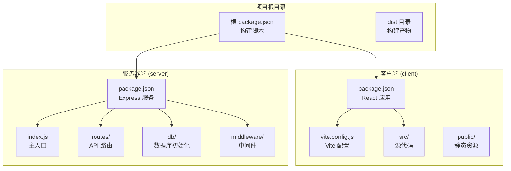
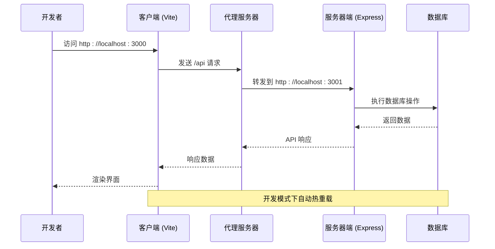
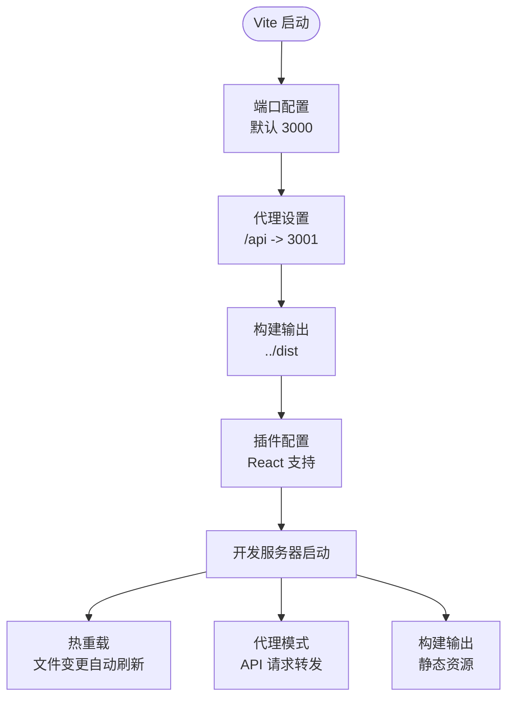
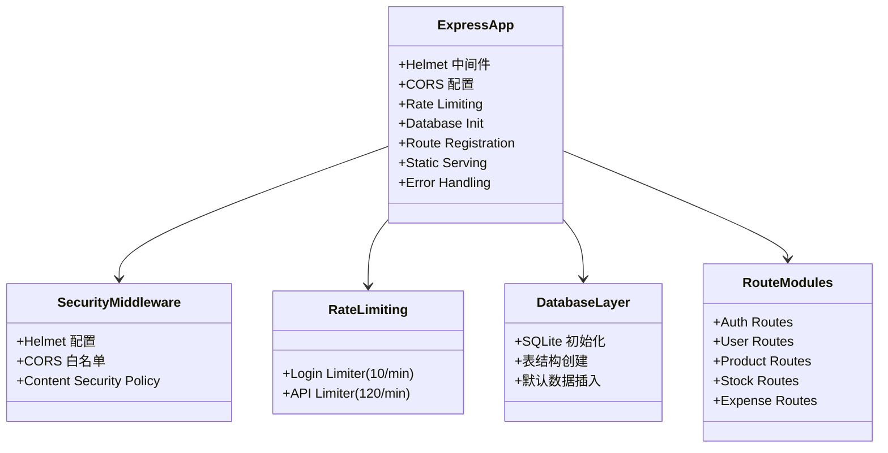
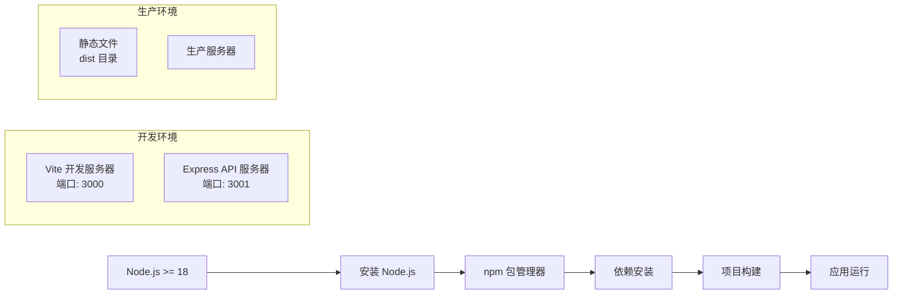
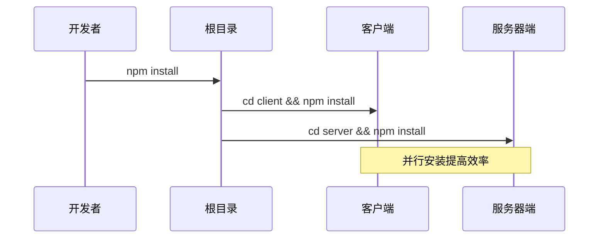

# 快速开始

<cite>
**本文引用的文件**
- [client/package.json](file://client/package.json)
- [server/package.json](file://server/package.json)
- [client/vite.config.js](file://client/vite.config.js)
- [server/index.js](file://server/index.js)
- [package.json](file://package.json)
- [client/src/api/index.js](file://client/src/api/index.js)
- [client/src/main.jsx](file://client/src/main.jsx)
- [client/src/App.jsx](file://client/src/App.jsx)
- [client/src/pages/admin/Dashboard.jsx](file://client/src/pages/admin/Dashboard.jsx)
- [client/src/layouts/AdminLayout.jsx](file://client/src/layouts/AdminLayout.jsx)
- [server/db/init.js](file://server/db/init.js)
- [server/routes/auth.js](file://server/routes/auth.js)
</cite>

## 目录
1. [简介](#简介)
2. [项目结构](#项目结构)
3. [核心组件](#核心组件)
4. [架构概览](#架构概览)
5. [详细组件分析](#详细组件分析)
6. [依赖关系分析](#依赖关系分析)
7. [性能考虑](#性能考虑)
8. [故障排除指南](#故障排除指南)
9. [结论](#结论)
10. [附录](#附录)

## 简介
SY-Q 做账管理系统是一个基于 React + Express 的现代化财务管理应用，采用前后端分离架构。本指南旨在帮助新开发者在最短时间内搭建并运行完整的开发环境，涵盖环境要求、项目克隆、依赖安装、启动步骤以及常见问题排查。

## 项目结构
该项目采用典型的前后端分离架构，包含独立的客户端和服务器端代码库：

**图表来源**
- [client/package.json:1-27](file://client/package.json#L1-L27)
- [server/package.json:1-26](file://server/package.json#L1-L26)
- [package.json:1-13](file://package.json#L1-L13)

**章节来源**
- [client/package.json:1-27](file://client/package.json#L1-L27)
- [server/package.json:1-26](file://server/package.json#L1-L26)
- [package.json:1-13](file://package.json#L1-L13)

## 核心组件
系统的核心组件包括：

### 前端技术栈
- **React 19.2.7**: 现代化的前端框架
- **Ant Design 6.4.3**: 企业级 UI 组件库
- **Vite 8.0.16**: 高性能构建工具和开发服务器
- **Axios**: HTTP 客户端库
- **React Router DOM**: 前端路由管理

### 后端技术栈
- **Express 5.2.1**: Web 应用框架
- **Better SQLite3**: 轻量级数据库驱动
- **bcryptjs**: 密码加密库
- **Helmet**: 安全响应头中间件
- **CORS**: 跨域资源共享支持

**章节来源**
- [client/package.json:11-25](file://client/package.json#L11-L25)
- [server/package.json:14-24](file://server/package.json#L14-L24)

## 架构概览
系统采用前后端分离架构，通过 Vite 开发服务器实现热重载和代理功能：

**图表来源**
- [client/vite.config.js:6-14](file://client/vite.config.js#L6-L14)
- [server/index.js:8-120](file://server/index.js#L8-L120)

## 详细组件分析

### Vite 开发服务器配置
Vite 作为开发服务器提供了以下关键配置：

**图表来源**
- [client/vite.config.js:4-19](file://client/vite.config.js#L4-L19)

**章节来源**
- [client/vite.config.js:1-20](file://client/vite.config.js#L1-L20)

### Express 服务器架构
服务器端采用模块化设计，包含安全中间件、路由管理和数据库初始化：

**图表来源**
- [server/index.js:11-115](file://server/index.js#L11-L115)
- [server/db/init.js:18-214](file://server/db/init.js#L18-L214)

**章节来源**
- [server/index.js:1-120](file://server/index.js#L1-L120)
- [server/db/init.js:1-217](file://server/db/init.js#L1-L217)

### 前端路由系统
前端采用 React Router 实现多层级路由管理：

```mermaid
graph TD
RootRoute["根路由 (/)"] --> LoginRoute["登录页 (/login)"]
RootRoute --> AdminRoute["管理员路由 (/admin)"]
RootRoute --> UserRoute["用户路由 (/user)"]
AdminRoute --> AdminDashboard["工作台 (/admin)"]
AdminRoute --> SettingsRoute["系统设置 (/admin/settings)"]
AdminRoute --> UserManage["账号管理 (/admin/users)"]
AdminRoute --> CompaniesRoute["商品公司 (/admin/companies)"]
AdminRoute --> ClientsRoute["客户单位 (/admin/clients)"]
AdminRoute --> ProductsRoute["商品列表 (/admin/products)"]
AdminRoute --> StockInRoute["商品入库 (/admin/stock-in)"]
AdminRoute --> StockOutRoute["商品出库 (/admin/stock-out)"]
AdminRoute --> ExpensesRoute["日常开销 (/admin/expenses)"]
AdminRoute --> DataCenterRoute["数据中心 (/admin/data-center)"]
AdminRoute --> WarehousesRoute["库房管理 (/admin/warehouses)"]
UserRoute --> UserDashboard["用户工作台 (/user)"]
UserRoute --> PasswordRoute["修改密码 (/user/password)"]
UserRoute --> ProductList["商品列表 (/user/products)"]
UserRoute --> StockInList["入库记录 (/user/stock-in)"]
UserRoute --> StockOutList["出库记录 (/user/stock-out)"]
UserRoute --> ExpenseList["开销记录 (/user/expenses)"]
UserRoute --> DataCenterUser["数据中心 (/user/data-center)"]
UserRoute --> WarehouseList["库房列表 (/user/warehouses)"]
```

**图表来源**
- [client/src/App.jsx:32-64](file://client/src/App.jsx#L32-L64)

**章节来源**
- [client/src/App.jsx:1-67](file://client/src/App.jsx#L1-L67)

## 依赖关系分析

### 环境要求
系统对 Node.js 版本有明确要求：

**图表来源**
- [package.json:9-11](file://package.json#L9-L11)

**章节来源**
- [package.json:9-11](file://package.json#L9-L11)

### 依赖安装流程
系统采用分层依赖管理策略：

**图表来源**
- [package.json:6](file://package.json#L6)

**章节来源**
- [package.json:6](file://package.json#L6)

## 性能考虑
系统在多个层面进行了性能优化：

### 前端性能优化
- **按需加载**: React Router 实现路由级别的懒加载
- **组件优化**: Ant Design 组件按需引入，减少包体积
- **缓存策略**: 浏览器缓存静态资源
- **构建优化**: Vite 提供快速的热重载和打包

### 后端性能优化
- **数据库连接池**: Better SQLite3 提供 WAL 模式优化
- **请求限制**: 速率限制防止滥用
- **CORS 优化**: 精确的跨域白名单配置
- **安全中间件**: Helmet 提供安全响应头

## 故障排除指南

### 端口冲突问题
**问题症状**: 启动时出现端口占用错误
**解决方案**:
1. 检查端口占用情况
2. 修改 Vite 配置中的开发端口
3. 修改 Express 服务器端口配置

**章节来源**
- [client/vite.config.js:7](file://client/vite.config.js#L7)
- [server/index.js:9](file://server/index.js#L9)

### 依赖安装失败
**常见原因及解决方法**:
1. **网络问题**: 使用国内镜像源或代理
2. **权限问题**: 使用管理员权限或修复 npm 权限
3. **版本冲突**: 清理 node_modules 和 package-lock.json 重新安装
4. **磁盘空间不足**: 清理缓存和临时文件

**章节来源**
- [client/package.json:11-25](file://client/package.json#L11-L25)
- [server/package.json:14-24](file://server/package.json#L14-L24)

### 数据库初始化失败
**问题症状**: 应用启动时报数据库相关错误
**解决方案**:
1. 检查 SQLite 文件权限
2. 确认数据库路径正确性
3. 验证数据库文件完整性
4. 重新初始化数据库

**章节来源**
- [server/db/init.js:5](file://server/db/init.js#L5)
- [server/db/init.js:18-214](file://server/db/init.js#L18-L214)

### 跨域请求问题
**问题症状**: 前端无法访问后端 API
**解决方案**:
1. 检查 Vite 代理配置
2. 验证 CORS 白名单设置
3. 确认请求头格式正确
4. 检查代理目标地址

**章节来源**
- [client/vite.config.js:8-13](file://client/vite.config.js#L8-L13)
- [server/index.js:18-41](file://server/index.js#L18-L41)

### 认证和授权问题
**问题症状**: 登录失败或权限验证错误
**解决方案**:
1. 检查 JWT 密钥配置
2. 验证用户凭据
3. 确认密码哈希算法
4. 检查用户角色权限

**章节来源**
- [server/routes/auth.js:22-26](file://server/routes/auth.js#L22-L26)
- [server/middleware/auth.js](file://server/middleware/auth.js)

## 结论
SY-Q 做账管理系统提供了完整的开发环境搭建指南。通过遵循本指南，开发者可以快速建立本地开发环境，理解系统的架构设计，并有效解决常见的开发问题。系统采用现代化的技术栈和最佳实践，为后续的功能扩展和维护奠定了良好的基础。

## 附录

### 开发环境要求
- **Node.js**: 版本 >= 18
- **npm**: 最新稳定版本
- **操作系统**: Windows/Linux/macOS
- **内存**: 建议 4GB+ RAM

### 项目启动步骤
1. **克隆项目**: `git clone <repository-url>`
2. **安装依赖**: `npm install`
3. **启动开发环境**: 
   - 客户端: `npm run dev` (端口 3000)
   - 服务器端: `npm start` (端口 3001)

### 生产环境部署
1. **构建项目**: `npm run build`
2. **启动服务器**: `npm start`
3. **静态文件**: 位于 dist 目录

### 常用命令参考
- `npm run dev`: 启动 Vite 开发服务器
- `npm run build`: 构建生产版本
- `npm run preview`: 预览生产构建
- `npm start`: 启动 Express 服务器