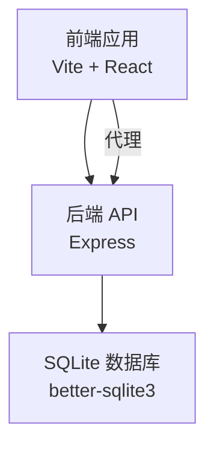
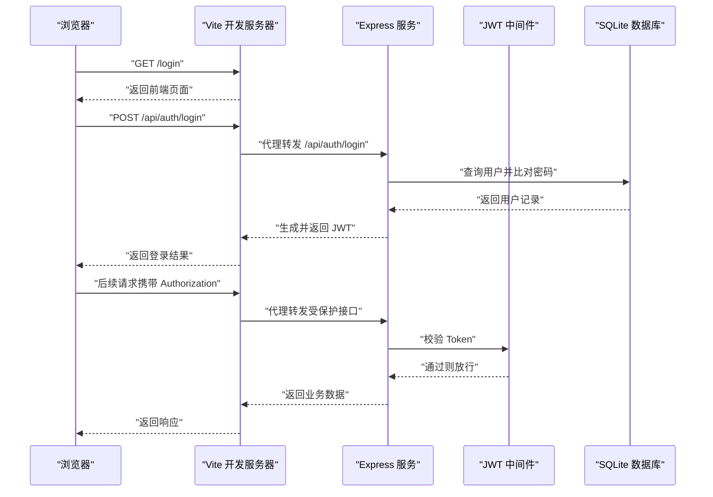
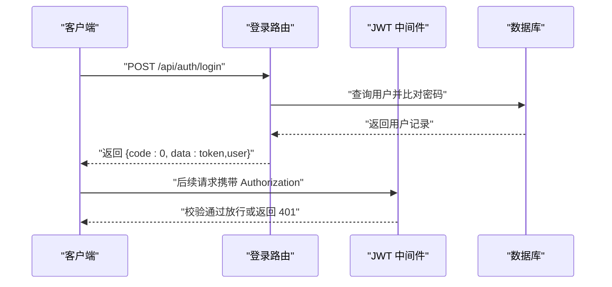
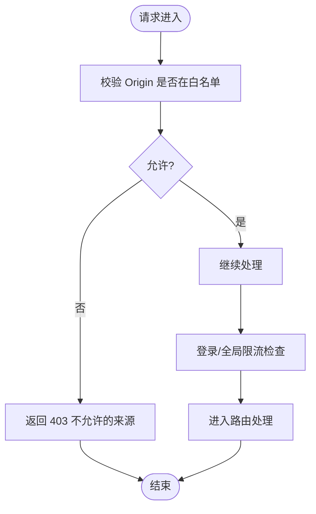
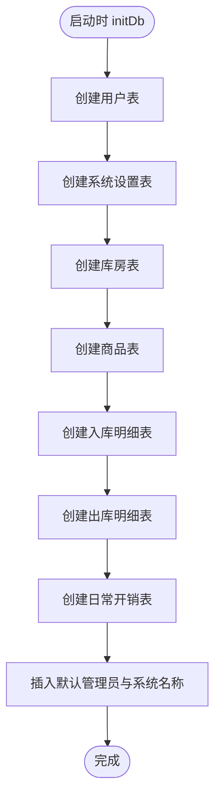
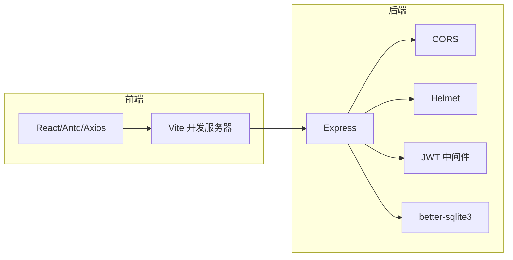

# 故障排除

<cite>
**本文引用的文件**
- [client/package.json](file://client/package.json)
- [server/package.json](file://server/package.json)
- [client/vite.config.js](file://client/vite.config.js)
- [client/src/api/index.js](file://client/src/api/index.js)
- [client/src/pages/Login.jsx](file://client/src/pages/Login.jsx)
- [client/src/App.jsx](file://client/src/App.jsx)
- [server/index.js](file://server/index.js)
- [server/middleware/auth.js](file://server/middleware/auth.js)
- [server/routes/auth.js](file://server/routes/auth.js)
- [server/db/init.js](file://server/db/init.js)
</cite>

## 目录
1. [简介](#简介)
2. [项目结构](#项目结构)
3. [核心组件](#核心组件)
4. [架构总览](#架构总览)
5. [详细组件分析](#详细组件分析)
6. [依赖关系分析](#依赖关系分析)
7. [性能考虑](#性能考虑)
8. [故障排除指南](#故障排除指南)
9. [结论](#结论)
10. [附录](#附录)

## 简介
本指南面向 SY-Q 系统的开发者与运维人员，聚焦开发与运行中的常见问题，提供可操作的排查步骤与解决方案。内容涵盖依赖安装失败、端口占用、CORS 跨域、JWT 认证失败、数据库连接与查询性能等问题，并给出调试技巧、日志分析方法、错误追踪策略及性能优化建议。

## 项目结构
SY-Q 采用前后端分离架构：
- 前端基于 Vite + React，通过代理访问后端 API。
- 后端基于 Express，提供 REST 接口，内置安全中间件与限流策略，使用 better-sqlite3 作为本地数据库。

**图表来源**
- [client/vite.config.js:6-14](file://client/vite.config.js#L6-L14)
- [server/index.js:65-66](file://server/index.js#L65-L66)

**章节来源**
- [client/package.json:1-27](file://client/package.json#L1-L27)
- [server/package.json:1-26](file://server/package.json#L1-L26)
- [client/vite.config.js:1-19](file://client/vite.config.js#L1-L19)
- [server/index.js:1-120](file://server/index.js#L1-L120)

## 核心组件
- 前端代理与请求封装
  - Vite 开发服务器代理到后端端口，避免跨域。
  - Axios 实例统一设置基础路径与超时；自动注入 Authorization 头；统一处理 401 与业务错误码。
- 后端安全与路由
  - Helmet 设置安全响应头；CORS 白名单控制；速率限制保护登录与全局 API。
  - 中间件校验 JWT，区分普通用户与管理员。
  - 路由实现登录、改密、当前用户信息等接口。
- 数据库初始化
  - better-sqlite3 连接 WAL 模式与外键约束；首次运行创建表与默认数据。

**章节来源**
- [client/vite.config.js:6-14](file://client/vite.config.js#L6-L14)
- [client/src/api/index.js:4-39](file://client/src/api/index.js#L4-L39)
- [server/index.js:11-63](file://server/index.js#L11-L63)
- [server/middleware/auth.js:3-28](file://server/middleware/auth.js#L3-L28)
- [server/routes/auth.js:8-66](file://server/routes/auth.js#L8-L66)
- [server/db/init.js:5-214](file://server/db/init.js#L5-L214)

## 架构总览
前后端交互流程概览如下：

**图表来源**
- [client/src/pages/Login.jsx:27-43](file://client/src/pages/Login.jsx#L27-L43)
- [client/src/api/index.js:9-39](file://client/src/api/index.js#L9-L39)
- [server/routes/auth.js:8-40](file://server/routes/auth.js#L8-L40)
- [server/middleware/auth.js:5-18](file://server/middleware/auth.js#L5-L18)
- [server/index.js:68-95](file://server/index.js#L68-L95)
- [server/db/init.js:18-214](file://server/db/init.js#L18-L214)

## 详细组件分析

### 组件 A：认证与授权流程
- 登录接口负责校验用户名与密码，成功后签发 JWT 并返回用户信息。
- 中间件从请求头提取 Bearer Token，验证失败返回 401。
- 前端拦截器在请求头注入 Authorization，并在 401 时清理本地存储并跳转登录页。

**图表来源**
- [server/routes/auth.js:8-40](file://server/routes/auth.js#L8-L40)
- [server/middleware/auth.js:5-18](file://server/middleware/auth.js#L5-L18)
- [client/src/api/index.js:9-15](file://client/src/api/index.js#L9-L15)

**章节来源**
- [server/routes/auth.js:8-66](file://server/routes/auth.js#L8-L66)
- [server/middleware/auth.js:3-28](file://server/middleware/auth.js#L3-L28)
- [client/src/api/index.js:9-39](file://client/src/api/index.js#L9-L39)

### 组件 B：CORS 与安全策略
- CORS 允许本地开发环境与 Render 部署域名；支持子域名通配。
- Helmet 关闭严格 CSP 以适配同源开发场景；全局错误处理拦截 CORS 错误并返回统一格式。

**图表来源**
- [server/index.js:17-41](file://server/index.js#L17-L41)
- [server/index.js:108-115](file://server/index.js#L108-L115)

**章节来源**
- [server/index.js:17-41](file://server/index.js#L17-L41)
- [server/index.js:108-115](file://server/index.js#L108-L115)

### 组件 C：数据库初始化与迁移
- 首次运行创建多张业务表与索引相关迁移逻辑；启用 WAL 与外键约束提升并发与一致性。
- 默认插入管理员账户与系统名称设置，便于快速上线。

**图表来源**
- [server/db/init.js:18-214](file://server/db/init.js#L18-L214)

**章节来源**
- [server/db/init.js:5-214](file://server/db/init.js#L5-L214)

## 依赖关系分析
- 前端依赖
  - React 生态、Ant Design、Axios、路由与构建工具。
- 后端依赖
  - Express、CORS、Helmet、速率限制、JWT、better-sqlite3、文件上传等。

**图表来源**
- [client/package.json:11-25](file://client/package.json#L11-L25)
- [server/package.json:14-24](file://server/package.json#L14-L24)
- [client/vite.config.js:4-14](file://client/vite.config.js#L4-L14)
- [server/index.js:1-15](file://server/index.js#L1-L15)

**章节来源**
- [client/package.json:1-27](file://client/package.json#L1-L27)
- [server/package.json:1-26](file://server/package.json#L1-L26)

## 性能考虑
- 限流策略
  - 登录接口每 IP 每分钟最多 10 次；全局 API 每 IP 每分钟最多 120 次，避免暴力破解与滥用。
- 数据库模式
  - WAL 模式提升并发写入性能；外键约束保证数据一致性。
- 前端代理
  - Vite 本地开发代理减少跨域带来的额外握手成本。

**章节来源**
- [server/index.js:46-63](file://server/index.js#L46-L63)
- [server/db/init.js:11-13](file://server/db/init.js#L11-L13)
- [client/vite.config.js:6-14](file://client/vite.config.js#L6-L14)

## 故障排除指南

### 一、依赖安装失败
- 症状
  - npm install 报错，提示缺失二进制包或 Node 版本不匹配。
- 可能原因
  - better-sqlite3 需要预编译二进制，不同平台/Node 版本需匹配。
  - Vite 或 React 对 Node 版本有要求。
- 解决方案
  - 使用与 better-sqlite3 兼容的 Node 主版本（参考依赖声明）。
  - 清理缓存后重装：删除 node_modules 与锁定文件，重新安装。
  - 若为 Windows 环境，确保可用的构建工具链与 Python 环境。
- 验证
  - 成功安装后，确认本地开发服务器可正常启动。

**章节来源**
- [server/package.json:80-93](file://server/package.json#L80-L93)
- [client/package.json:22-25](file://client/package.json#L22-L25)

### 二、端口占用
- 症状
  - 启动前端或后端时报端口被占用。
- 可能原因
  - 默认端口 3000（前端）、3001（后端）已被占用。
- 解决方案
  - 前端：在 Vite 配置中修改 port 字段或关闭占用进程。
  - 后端：设置环境变量 PORT 或停止占用进程。
- 验证
  - 更换端口后再次启动，确认无冲突。

**章节来源**
- [client/vite.config.js:6-8](file://client/vite.config.js#L6-L8)
- [server/index.js:8-9](file://server/index.js#L8-L9)

### 三、CORS 跨域问题
- 症状
  - 浏览器控制台出现 CORS 错误，请求被阻止。
- 可能原因
  - 请求来源不在白名单内；开发环境未走代理导致跨域。
- 解决方案
  - 确保前端通过 Vite 代理访问后端（/api 前缀）。
  - 如需扩展白名单，可在环境变量中添加 ALLOWED_ORIGINS。
- 验证
  - 使用浏览器开发者工具 Network 标签查看响应头是否包含允许的来源。

**章节来源**
- [client/vite.config.js:8-12](file://client/vite.config.js#L8-L12)
- [server/index.js:17-41](file://server/index.js#L17-L41)
- [server/index.js:108-115](file://server/index.js#L108-L115)

### 四、JWT 认证失败
- 症状
  - 登录成功但后续接口返回 401；或登录即 401。
- 可能原因
  - Token 缺失或格式不正确；Token 已过期；后端密钥不一致。
- 解决方案
  - 确认前端请求头携带 Authorization: Bearer <token>。
  - 检查本地存储中是否存在 token 与 user；必要时清除后重新登录。
  - 核对后端 JWT_SECRET 是否一致且未被意外修改。
- 验证
  - 在浏览器开发者工具 Network 中查看请求头 Authorization 内容。

**章节来源**
- [client/src/api/index.js:9-15](file://client/src/api/index.js#L9-L15)
- [client/src/api/index.js:30-38](file://client/src/api/index.js#L30-L38)
- [server/middleware/auth.js:5-18](file://server/middleware/auth.js#L5-L18)

### 五、登录与改密接口异常
- 症状
  - 登录报“账号或密码错误”；改密报“原密码错误”或“新密码长度不够”。
- 可能原因
  - 用户名为空；密码为空；旧密码不匹配；新密码长度小于 6。
- 解决方案
  - 确保表单必填项完整；新密码至少 6 位；确认数据库中存在对应用户。
- 验证
  - 查看后端返回的业务错误码与消息，定位具体校验失败点。

**章节来源**
- [server/routes/auth.js:9-21](file://server/routes/auth.js#L9-L21)
- [server/routes/auth.js:42-58](file://server/routes/auth.js#L42-L58)

### 六、数据库连接与查询性能
- 症状
  - 首次启动卡顿；某些查询耗时较长。
- 可能原因
  - 表量增长导致查询慢；缺少索引；WAL 模式切换影响。
- 解决方案
  - 使用 WAL 模式与外键约束已提升并发与一致性；如需进一步优化，可在高频查询列建立索引。
  - 避免一次性大事务；拆分批量写入。
- 验证
  - 使用 SQLite 工具查看表结构与索引；对比执行计划评估性能。

**章节来源**
- [server/db/init.js:11-13](file://server/db/init.js#L11-L13)
- [server/db/init.js:18-214](file://server/db/init.js#L18-L214)

### 七、调试技巧与工具使用
- 浏览器开发者工具
  - Network：观察请求/响应、CORS 头、状态码与错误信息。
  - Console：查看前端错误与警告；检查本地存储 token 与 user。
  - Application：查看 LocalStorage/SessionStorage 的 token 与用户信息。
- Node.js 调试器
  - 使用 --inspect 启动后端，配合 Chrome DevTools 远程调试。
  - 在关键中间件与路由处设置断点，逐步跟踪请求生命周期。
- 日志分析
  - 后端统一错误处理会输出服务器错误日志；关注 CORS 拦截与 429 限流日志。
  - 前端拦截器会在 401 时清理本地存储并跳转登录页，便于定位认证问题。

**章节来源**
- [server/index.js:108-115](file://server/index.js#L108-L115)
- [client/src/api/index.js:30-38](file://client/src/api/index.js#L30-L38)
- [client/src/App.jsx:26-30](file://client/src/App.jsx#L26-L30)

### 八、常见错误码与处理
- 业务错误码
  - 400：参数缺失或不符合规则（如登录/改密）。
  - 401：未登录或 Token 过期，前端会清理本地存储并跳转登录。
  - 403：权限不足（管理员接口）。
  - 429：请求过于频繁，触发限流。
- 统一处理
  - 前端拦截器根据 code 与状态码进行提示与跳转。
  - 后端全局错误处理器统一返回 500 与 CORS 拦截信息。

**章节来源**
- [server/routes/auth.js:11-21](file://server/routes/auth.js#L11-L21)
- [client/src/api/index.js:17-39](file://client/src/api/index.js#L17-L39)
- [server/index.js:108-115](file://server/index.js#L108-L115)

## 结论
通过理解 SY-Q 的前后端交互、安全与限流策略、JWT 认证机制与数据库初始化流程，可以高效定位并解决开发与运行中的常见问题。建议在开发阶段充分利用浏览器与 Node.js 调试工具，在生产环境关注 CORS 白名单与限流策略，结合日志与错误码进行快速排障。

## 附录
- 快速检查清单
  - 端口：确认 3000/3001 未被占用。
  - 代理：确认前端已配置 /api 代理至后端地址。
  - CORS：确认来源在白名单内或使用代理。
  - 认证：确认 Authorization 头存在且格式正确。
  - 数据库：确认 initDb 已执行，表结构与默认数据存在。
  - 限流：避免短时间内大量重复请求导致 429。