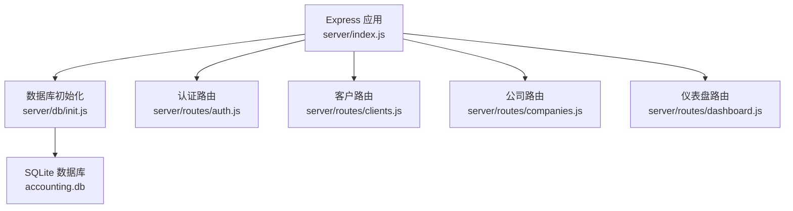
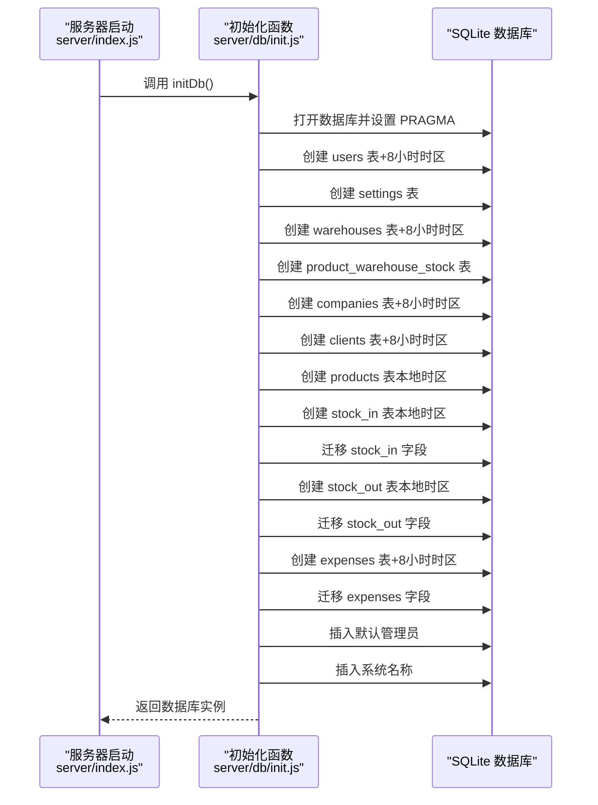
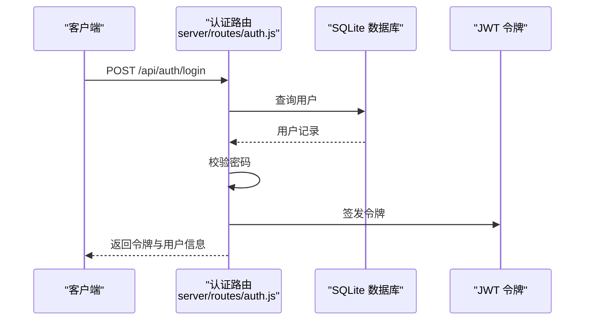
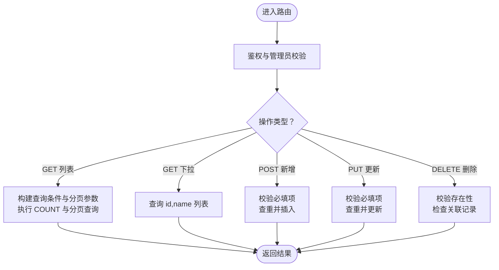
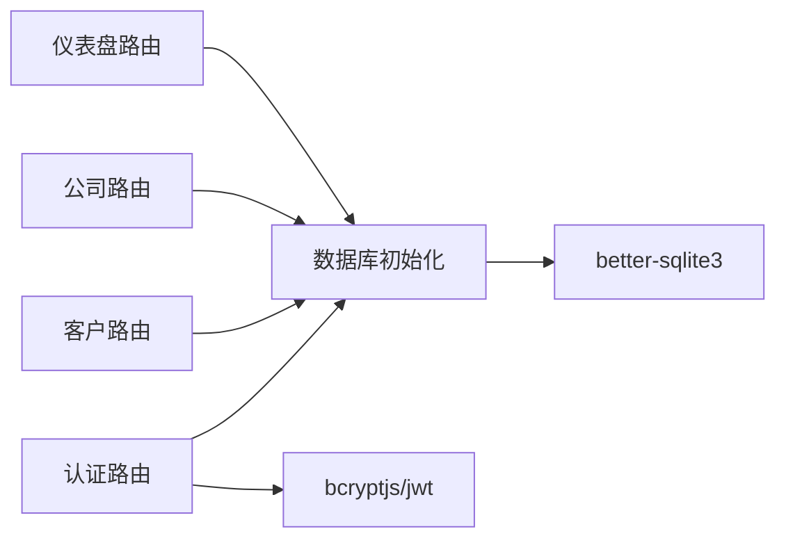

# 数据库设计

<cite>
**本文档引用的文件**
- [server/db/init.js](file://server/db/init.js)
- [server/index.js](file://server/index.js)
- [server/routes/auth.js](file://server/routes/auth.js)
- [server/routes/clients.js](file://server/routes/clients.js)
- [server/routes/companies.js](file://server/routes/companies.js)
- [server/routes/dashboard.js](file://server/routes/dashboard.js)
</cite>

## 更新摘要
**变更内容**
- 更新时间戳标准化策略说明，反映所有timestamp字段现在使用'+8 hours'确保北京时间显示
- 修正部分表的created_at字段时区设置，确保一致性
- 更新实体关系图中时间戳字段的时区标注

## 目录
1. [简介](#简介)
2. [项目结构](#项目结构)
3. [核心组件](#核心组件)
4. [架构总览](#架构总览)
5. [详细组件分析](#详细组件分析)
6. [依赖分析](#依赖分析)
7. [性能考虑](#性能考虑)
8. [故障排除指南](#故障排除指南)
9. [结论](#结论)
10. [附录](#附录)

## 简介
本文件为 SY-Q 系统的数据库设计文档，基于后端采用 SQLite 的实现进行整理与说明。内容涵盖数据库架构、表结构定义、字段类型与约束、实体关系、初始化流程、索引与查询优化策略，以及数据迁移与版本管理方法。文档面向开发与运维人员，帮助快速理解与维护数据库层。

## 项目结构
后端通过 Express 提供 REST 接口，数据库初始化在服务启动时完成，并由各业务路由模块共享连接实例。数据库文件位于 server/db/accounting.db，使用 better-sqlite3 驱动。



图表来源
- [server/index.js:65-66](file://server/index.js#L65-L66)
- [server/db/init.js:18-214](file://server/db/init.js#L18-L214)

章节来源
- [server/index.js:1-120](file://server/index.js#L1-L120)
- [server/db/init.js:1-217](file://server/db/init.js#L1-L217)

## 核心组件
- 数据库连接与初始化：通过单例模式获取数据库连接，启用 WAL 模式与外键约束；创建核心表并执行迁移逻辑；插入默认管理员与系统名称。
- 路由模块：围绕用户、客户、公司等实体提供增删改查与分页检索接口，统一通过中间件鉴权与权限控制。
- 表结构：users、settings、warehouses、product_warehouse_stock、companies、clients、products、stock_in、stock_out、expenses。

章节来源
- [server/db/init.js:9-16](file://server/db/init.js#L9-L16)
- [server/db/init.js:18-214](file://server/db/init.js#L18-L214)
- [server/routes/auth.js:1-69](file://server/routes/auth.js#L1-L69)
- [server/routes/clients.js:1-81](file://server/routes/clients.js#L1-L81)
- [server/routes/companies.js:1-104](file://server/routes/companies.js#L1-L104)

## 架构总览
数据库初始化流程与表创建顺序如下：



图表来源
- [server/index.js:65-66](file://server/index.js#L65-L66)
- [server/db/init.js:18-214](file://server/db/init.js#L18-L214)

## 详细组件分析

### 数据库初始化与表创建
- 连接与配置
  - 使用单例函数获取数据库连接，首次调用时创建连接并设置 PRAGMA：journal_mode=WAL、foreign_keys=ON。
  - 数据库路径为 server/db/accounting.db。
- 表创建顺序与目的
  - users：系统用户表，支持角色与默认账户初始化，时间戳使用北京时间（+8小时）。
  - settings：系统配置键值表。
  - warehouses：仓库信息表，时间戳使用北京时间（+8小时）。
  - product_warehouse_stock：商品在各仓库的库存快照表，唯一性约束保证每商品每仓唯一。
  - companies：供应商/公司信息表，时间戳使用北京时间（+8小时）。
  - clients：客户单位信息表，时间戳使用北京时间（+8小时）。
  - products：商品信息表，关联公司，时间戳使用本地时区。
  - stock_in：入库明细表，可选关联公司与仓库，时间戳使用本地时区。
  - stock_out：出库明细表，可选关联客户与仓库，时间戳使用本地时区。
  - expenses：日常费用表，时间戳使用北京时间（+8小时）。
- 迁移策略
  - 对 stock_in、stock_out、expenses 表动态检查列是否存在，若缺失则执行 ALTER TABLE 添加字段，确保向后兼容。
- 默认数据
  - 若无管理员账户则创建默认管理员，密码经 bcrypt 加密存储。
  - 若系统名称未设置则写入默认值。

章节来源
- [server/db/init.js:9-16](file://server/db/init.js#L9-L16)
- [server/db/init.js:21-214](file://server/db/init.js#L21-L214)

### 实体关系与约束
- 外键关系
  - products.company_id → companies.id
  - stock_in.product_id → products.id，stock_in.company_id → companies.id
  - stock_out.product_id → products.id，stock_out.client_id → clients.id
  - product_warehouse_stock.product_id → products.id，product_warehouse_stock.warehouse_id → warehouses.id
- 唯一性
  - product_warehouse_stock(product_id, warehouse_id) 唯一
- 约束与默认值
  - users.role 限定为 'admin' 或 'user'
  - 多数数值型字段默认 0，字符串型字段默认空字符串
  - 时间戳字段使用 datetime('now','+8 hours') 确保北京时间显示

**更新** 时间戳标准化策略已实施，确保所有时间显示为北京时间（UTC+8）。除产品、入库和出库记录外，其他表的created_at字段均使用'+8 hours'时区偏移。

```mermaid
erDiagram
USERS {
integer id PK
text username UK
text password
text real_name
text phone
text role
integer is_default
text created_at "+8小时时区"
}
SETTINGS {
text key PK
text value
}
WAREHOUSES {
integer id PK
text name
text address
text remark
text created_at "+8小时时区"
}
COMPANIES {
integer id PK
text name
text credit_code
text address
text contact
text phone
text remark
text created_at "+8小时时区"
}
CLIENTS {
integer id PK
text name
text credit_code
text address
text contact
text phone
text remark
text created_at "+8小时时区"
}
PRODUCTS {
integer id PK
text name
integer company_id FK
text spec
text unit
real quantity
real price
text remark
text created_by
text created_at "本地时区"
}
PRODUCT_WAREHOUSE_STOCK {
integer id PK
integer product_id FK
integer warehouse_id FK
real quantity
unique product_id warehouse_id
}
STOCK_IN {
integer id PK
text order_no
integer product_id FK
integer company_id FK
text unit
real price
real quantity
real before_qty
real after_qty
real total_amount
text remark
text operator
text created_at "本地时区"
}
STOCK_OUT {
integer id PK
text order_no
integer product_id FK
integer client_id FK
text unit
real price
real quantity
real before_qty
real after_qty
real total_amount
text remark
text operator
text created_at "本地时区"
}
EXPENSES {
integer id PK
text name
text category
text pay_method
real amount
text payer
text recipient
text remark
text created_by
text created_at "+8小时时区"
}
PRODUCTS }o--|| COMPANIES : "属于"
PRODUCT_WAREHOUSE_STOCK }o--|| PRODUCTS : "对应"
PRODUCT_WAREHOUSE_STOCK }o--|| WAREHOUSES : "对应"
STOCK_IN }o--|| PRODUCTS : "涉及"
STOCK_IN }o--|| COMPANIES : "来源"
STOCK_OUT }o--|| PRODUCTS : "涉及"
STOCK_OUT }o--|| CLIENTS : "去向"
```

图表来源
- [server/db/init.js:21-186](file://server/db/init.js#L21-L186)

章节来源
- [server/db/init.js:21-186](file://server/db/init.js#L21-L186)

### 认证与用户管理
- 登录流程
  - 校验用户名与密码，使用 bcrypt 验证；通过后签发 JWT。
- 修改密码
  - 需要旧密码正确，新密码长度不少于 6 位，更新后返回成功。
- 当前用户信息
  - 通过鉴权中间件获取用户信息。



图表来源
- [server/routes/auth.js:9-40](file://server/routes/auth.js#L9-L40)
- [server/db/init.js:197-205](file://server/db/init.js#L197-L205)

章节来源
- [server/routes/auth.js:1-69](file://server/routes/auth.js#L1-L69)
- [server/db/init.js:197-205](file://server/db/init.js#L197-L205)

### 客户与公司管理
- 客户管理
  - 支持关键词搜索、分页查询、全量下拉、新增、编辑、删除。
  - 删除前检查是否存在出库记录，避免破坏数据完整性。
- 公司管理
  - 支持关键词搜索、分页查询、全量下拉、查找或创建、新增、编辑、删除。
  - 删除前检查是否存在关联商品，避免破坏数据完整性。



图表来源
- [server/routes/clients.js:8-78](file://server/routes/clients.js#L8-L78)
- [server/routes/companies.js:9-101](file://server/routes/companies.js#L9-L101)

章节来源
- [server/routes/clients.js:1-81](file://server/routes/clients.js#L1-L81)
- [server/routes/companies.js:1-104](file://server/routes/companies.js#L1-L104)

### 时间戳标准化与查询处理
- 时间戳标准化策略
  - **统一北京时间显示**：users、warehouses、companies、clients、expenses 表的 created_at 字段使用 `datetime('now','+8 hours')` 确保所有时间显示为北京时间。
  - **本地时区保留**：products、stock_in、stock_out 表的 created_at 字段仍使用 `datetime('now','localtime')`，保持原有的本地时区特性。
- 查询处理差异
  - 仪表盘路由在服务端进行时区转换，使用 `Date.now() + 8 * 3600 * 1000` 确保统计计算基于北京时间。
  - 不同表的时间戳时区差异可能导致跨表查询时的时区不一致问题。

章节来源
- [server/db/init.js:31](file://server/db/init.js#L31)
- [server/db/init.js:50](file://server/db/init.js#L50)
- [server/db/init.js:77](file://server/db/init.js#L77)
- [server/db/init.js:91](file://server/db/init.js#L91)
- [server/db/init.js:107](file://server/db/init.js#L107)
- [server/db/init.js:127](file://server/db/init.js#L127)
- [server/db/init.js:157](file://server/db/init.js#L157)
- [server/db/init.js:184](file://server/db/init.js#L184)
- [server/routes/dashboard.js:11-12](file://server/routes/dashboard.js#L11-L12)

## 依赖分析
- 组件耦合
  - 路由模块依赖数据库初始化模块提供的连接实例，形成集中式数据库访问。
  - 认证中间件贯穿多个路由，统一鉴权与权限控制。
- 外部依赖
  - better-sqlite3：SQLite 驱动，提供高性能本地数据库能力。
  - bcryptjs：密码加密与验证。
  - jsonwebtoken：JWT 令牌签发与解析。



图表来源
- [server/routes/auth.js:5-6](file://server/routes/auth.js#L5-L6)
- [server/routes/clients.js:3](file://server/routes/clients.js#L3)
- [server/routes/companies.js:3](file://server/routes/companies.js#L3)
- [server/db/init.js:1-3](file://server/db/init.js#L1-L3)

章节来源
- [server/routes/auth.js:1-69](file://server/routes/auth.js#L1-L69)
- [server/routes/clients.js:1-81](file://server/routes/clients.js#L1-L81)
- [server/routes/companies.js:1-104](file://server/routes/companies.js#L1-L104)
- [server/db/init.js:1-4](file://server/db/init.js#L1-L4)

## 性能考虑
- 索引策略建议
  - 在高频过滤字段上建立索引以提升查询效率，如 clients.name、clients.contact、clients.phone；companies.name、companies.contact、companies.phone；products.name、products.spec、products.unit；stock_in.order_no、stock_out.order_no。
  - 对时间范围查询字段（created_at）建立复合索引，例如 (created_at, id)。
  - **注意**：由于不同表使用不同的时区设置，跨表查询时需要考虑时区转换的性能影响。
- 查询优化
  - 使用 LIMIT/OFFSET 实现分页，避免一次性加载大量数据。
  - 对关联查询使用 JOIN 并限定必要字段，减少冗余数据传输。
  - 将高成本聚合查询（如统计）缓存至内存或定期任务生成报表。
  - **时间戳查询优化**：对于使用本地时区的表，查询时应考虑时区转换，避免不必要的性能损失。
- 存储与事务
  - WAL 模式提升并发读写性能，适合多用户场景。
  - 外键约束保障一致性，但会带来一定写入开销，建议在批量导入时临时关闭外键检查（谨慎使用）。

## 故障排除指南
- 登录失败
  - 检查用户名是否存在、密码是否匹配；确认 bcrypt 加密流程与盐值一致。
- 权限不足
  - 确认请求是否携带有效 JWT；管理员接口需具备 admin 角色。
- 删除失败
  - 客户删除前检查是否存在出库记录；公司删除前检查是否存在关联商品。
- 数据迁移异常
  - 确认迁移脚本已执行且字段存在；如重复执行可忽略；若字段缺失则重新运行初始化。
- **时间戳显示异常**
  - 检查表的 created_at 字段时区设置是否正确：+8小时时区用于用户、仓库、公司、客户、费用表；本地时区用于产品、入库、出库表。
  - 仪表盘查询时确保使用正确的时区转换逻辑。

章节来源
- [server/routes/auth.js:14-21](file://server/routes/auth.js#L14-L21)
- [server/routes/clients.js:65-77](file://server/routes/clients.js#L65-L77)
- [server/routes/companies.js:86-101](file://server/routes/companies.js#L86-L101)
- [server/db/init.js:133-195](file://server/db/init.js#L133-L195)

## 结论
本数据库设计以 SQLite 为核心，结合 better-sqlite3 的高性能特性，满足中小规模业务的数据存储需求。通过明确的实体关系、外键约束与迁移机制，确保数据一致性与演进能力。配合路由层的鉴权与权限控制，形成从接口到数据层的完整安全体系。

**重要更新**：时间戳标准化策略已实施，确保系统主要实体的时间显示统一为北京时间（UTC+8）。这一变更提升了用户体验的一致性，但需要注意不同表之间时区设置的差异可能带来的查询复杂性。后续可在高频查询字段上补充索引，并对批量导入场景优化事务与外键检查策略，进一步提升性能与稳定性。

## 附录

### 数据库初始化流程（步骤化）
- 启动应用 → 调用 initDb() → 打开数据库并设置 PRAGMA → 依次创建表 → 执行迁移 → 写入默认数据 → 返回连接实例

### 时间戳时区对照表
- **+8小时时区**：users、warehouses、companies、clients、expenses 表的 created_at 字段
- **本地时区**：products、stock_in、stock_out 表的 created_at 字段

章节来源
- [server/index.js:65-66](file://server/index.js#L65-L66)
- [server/db/init.js:18-214](file://server/db/init.js#L18-L214)