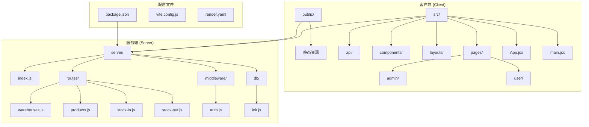
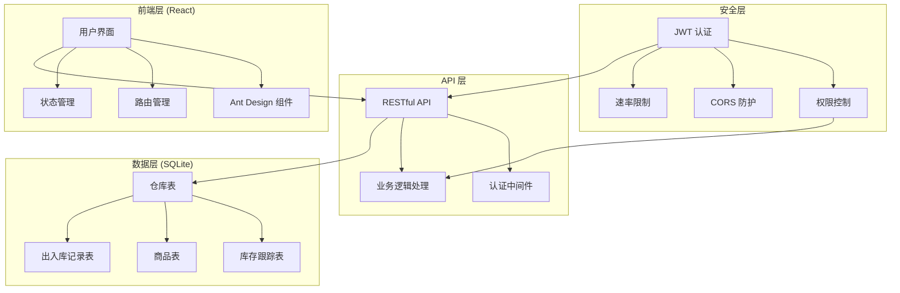
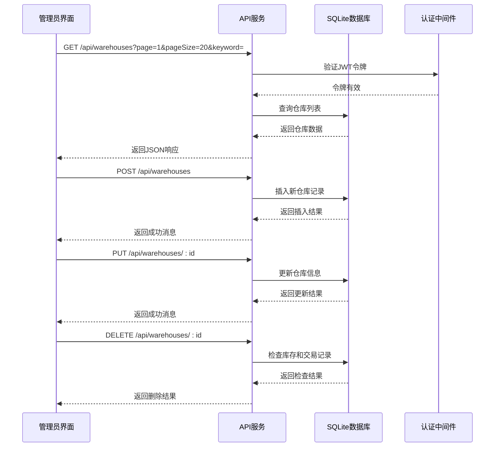
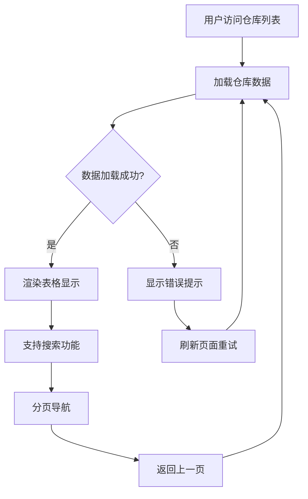
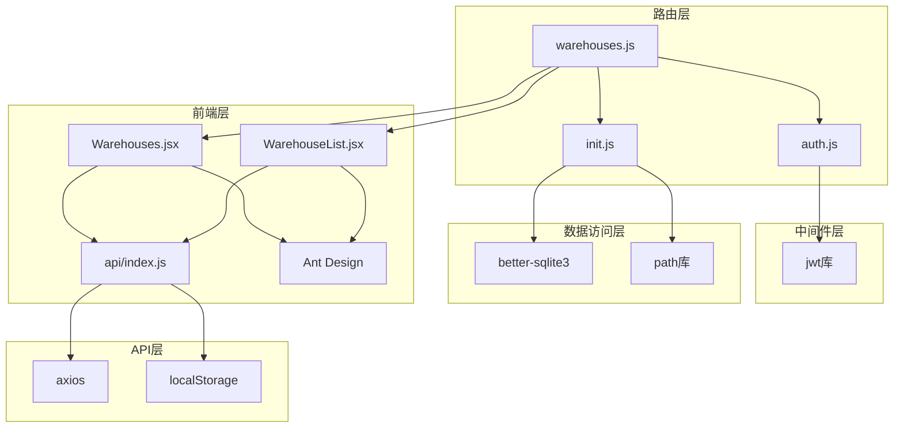

# 仓库管理系统

<cite>
**本文档引用的文件**
- [client/src/pages/admin/Warehouses.jsx](file://client/src/pages/admin/Warehouses.jsx)
- [client/src/pages/user/WarehouseList.jsx](file://client/src/pages/user/WarehouseList.jsx)
- [server/routes/warehouses.js](file://server/routes/warehouses.js)
- [client/src/api/index.js](file://client/src/api/index.js)
- [server/db/init.js](file://server/db/init.js)
- [server/middleware/auth.js](file://server/middleware/auth.js)
- [client/src/App.jsx](file://client/src/App.jsx)
- [server/index.js](file://server/index.js)
- [client/src/layouts/AdminLayout.jsx](file://client/src/layouts/AdminLayout.jsx)
- [client/src/layouts/UserLayout.jsx](file://client/src/layouts/UserLayout.jsx)
- [server/routes/products.js](file://server/routes/products.js)
</cite>

## 目录
1. [简介](#简介)
2. [项目结构](#项目结构)
3. [核心组件](#核心组件)
4. [架构概览](#架构概览)
5. [详细组件分析](#详细组件分析)
6. [依赖关系分析](#依赖关系分析)
7. [性能考虑](#性能考虑)
8. [故障排除指南](#故障排除指南)
9. [结论](#结论)
10. [附录](#附录)

## 简介

仓库管理系统是一个基于现代Web技术栈构建的企业级库存管理解决方案。该系统采用前后端分离架构，使用React作为前端框架，Express.js作为后端服务，SQLite数据库存储数据。系统提供了完整的仓库信息维护和管理功能，包括仓库位置管理、容量限制、负责人管理等操作。

系统支持多角色用户管理，包括管理员和普通用户，分别提供不同的功能权限。管理员可以进行所有仓库操作，而普通用户只能查看仓库信息。系统还集成了库存分布查询、物流优化建议等功能，为企业提供全面的仓储管理解决方案。

## 项目结构

该项目采用前后端分离的架构设计，具有清晰的模块化组织结构：



**图表来源**
- [client/src/App.jsx:1-67](file://client/src/App.jsx#L1-L67)
- [server/index.js:1-120](file://server/index.js#L1-L120)

**章节来源**
- [client/src/App.jsx:1-67](file://client/src/App.jsx#L1-L67)
- [server/index.js:1-120](file://server/index.js#L1-L120)

## 核心组件

### 数据模型设计

系统的核心数据模型围绕仓库管理进行了精心设计，主要包含以下实体：

```mermaid
erDiagram
WAREHOUSE {
integer id PK
string name
string address
string remark
datetime created_at
}
PRODUCT_WAREHOUSE_STOCK {
integer id PK
integer product_id FK
integer warehouse_id FK
float quantity
unique(product_id, warehouse_id)
}
PRODUCT {
integer id PK
string name
integer company_id FK
string spec
string unit
float quantity
float price
string remark
string created_by
datetime created_at
}
STOCK_IN {
integer id PK
string order_no
integer product_id FK
integer company_id FK
string unit
float price
float quantity
float before_qty
float after_qty
float total_amount
string remark
string operator
datetime created_at
}
STOCK_OUT {
integer id PK
string order_no
integer product_id FK
integer client_id FK
string unit
float price
float quantity
float before_qty
float after_qty
float total_amount
string remark
string operator
datetime created_at
}
WAREHOUSE ||--o{ PRODUCT_WAREHOUSE_STOCK : contains
PRODUCT ||--o{ PRODUCT_WAREHOUSE_STOCK : tracked_in
PRODUCT ||--o{ STOCK_IN : received
PRODUCT ||--o{ STOCK_OUT : shipped
WAREHOUSE ||--o{ STOCK_IN : receives
WAREHOUSE ||--o{ STOCK_OUT : ships
```

**图表来源**
- [server/db/init.js:43-131](file://server/db/init.js#L43-L131)

### 字段定义详解

#### 仓库表 (warehouses)
- **id**: 自增主键，唯一标识每个仓库
- **name**: 仓库名称，必填字段，用于标识仓库
- **address**: 仓库地址，可选字段，存储仓库物理位置
- **remark**: 备注信息，可选字段，存储额外说明
- **created_at**: 创建时间，默认值为当前时间

#### 库存跟踪表 (product_warehouse_stock)
- **id**: 自增主键，唯一标识每条库存记录
- **product_id**: 商品ID，外键关联商品表
- **warehouse_id**: 仓库ID，外键关联仓库表
- **quantity**: 库存数量，使用浮点数支持小数库存
- **唯一约束**: (product_id, warehouse_id)，确保每个商品在每个仓库的库存记录唯一

**章节来源**
- [server/db/init.js:43-65](file://server/db/init.js#L43-L65)

## 架构概览

系统采用现代化的前后端分离架构，实现了清晰的职责分离和良好的扩展性：



**图表来源**
- [server/index.js:65-95](file://server/index.js#L65-L95)
- [server/middleware/auth.js:1-29](file://server/middleware/auth.js#L1-L29)

### 技术栈特点

- **前端**: React + Ant Design + Axios，提供响应式用户界面
- **后端**: Express.js + better-sqlite3，轻量级高性能数据库
- **安全**: JWT令牌认证 + CORS防护 + 速率限制
- **部署**: 支持Render平台部署，包含环境配置文件

**章节来源**
- [server/index.js:1-120](file://server/index.js#L1-L120)
- [client/src/api/index.js:1-42](file://client/src/api/index.js#L1-L42)

## 详细组件分析

### 仓库管理页面 (管理员)

管理员端的仓库管理页面提供了完整的CRUD操作功能：



**图表来源**
- [client/src/pages/admin/Warehouses.jsx:18-36](file://client/src/pages/admin/Warehouses.jsx#L18-L36)
- [server/routes/warehouses.js:44-114](file://server/routes/warehouses.js#L44-L114)

#### 功能特性

1. **分页列表**: 支持按页码和页面大小查询仓库列表
2. **搜索功能**: 支持按仓库名称和地址模糊搜索
3. **CRUD操作**: 完整的增删改查功能
4. **表单验证**: 前端和后端双重验证机制
5. **批量操作**: 支持批量删除和编辑

**章节来源**
- [client/src/pages/admin/Warehouses.jsx:1-82](file://client/src/pages/admin/Warehouses.jsx#L1-L82)
- [server/routes/warehouses.js:1-117](file://server/routes/warehouses.js#L1-L117)

### 仓库列表页面 (普通用户)

普通用户的仓库列表页面提供了只读的仓库信息展示：



**图表来源**
- [client/src/pages/user/WarehouseList.jsx:15-20](file://client/src/pages/user/WarehouseList.jsx#L15-L20)

#### 用户体验设计

- **简洁界面**: 移除了编辑和删除按钮，专注于信息展示
- **响应式设计**: 支持移动端和桌面端访问
- **实时搜索**: 支持关键词实时过滤
- **加载状态**: 提供友好的加载指示器

**章节来源**
- [client/src/pages/user/WarehouseList.jsx:1-43](file://client/src/pages/user/WarehouseList.jsx#L1-L43)

### API 接口设计

系统提供了完整的RESTful API接口，支持仓库管理的所有功能：

| 方法 | 路径 | 功能描述 | 权限要求 |
|------|------|----------|----------|
| GET | `/api/warehouses` | 获取仓库分页列表 | 所有用户 |
| POST | `/api/warehouses` | 创建新仓库 | 管理员 |
| PUT | `/api/warehouses/:id` | 更新仓库信息 | 管理员 |
| DELETE | `/api/warehouses/:id` | 删除仓库 | 管理员 |
| GET | `/api/warehouses/all` | 获取所有仓库（下拉选择） | 所有用户 |
| POST | `/api/warehouses/find-or-create` | 查找或创建仓库 | 管理员 |
| GET | `/api/warehouses/stock/:productId` | 获取商品在各仓库的库存分布 | 所有用户 |

**章节来源**
- [server/routes/warehouses.js:8-117](file://server/routes/warehouses.js#L8-L117)

### 数据库初始化流程

系统启动时会自动初始化数据库结构，确保所有必要的表都已创建：

```mermaid
flowchart TD
A[应用启动] --> B[调用 initDb()]
B --> C[连接SQLite数据库]
C --> D[创建用户表]
D --> E[创建系统设置表]
E --> F[创建仓库表]
F --> G[创建库存跟踪表]
G --> H[创建商品表]
H --> I[创建出入库记录表]
I --> J[执行数据库迁移]
J --> K[插入默认管理员]
K --> L[设置系统名称]
L --> M[初始化完成]
```

**图表来源**
- [server/db/init.js:18-214](file://server/db/init.js#L18-L214)

**章节来源**
- [server/db/init.js:1-217](file://server/db/init.js#L1-L217)

## 依赖关系分析

系统各组件之间的依赖关系体现了清晰的层次结构：



**图表来源**
- [server/routes/warehouses.js:1-6](file://server/routes/warehouses.js#L1-L6)
- [client/src/api/index.js:1-7](file://client/src/api/index.js#L1-L7)

### 关键依赖关系

1. **认证依赖**: 所有仓库相关路由都依赖于JWT认证中间件
2. **数据库依赖**: 路由层依赖数据库初始化模块
3. **前端依赖**: 页面组件依赖API模块进行数据交互
4. **UI依赖**: 使用Ant Design组件库提供一致的用户体验

**章节来源**
- [server/middleware/auth.js:1-29](file://server/middleware/auth.js#L1-L29)
- [client/src/api/index.js:1-42](file://client/src/api/index.js#L1-L42)

## 性能考虑

### 数据库优化策略

1. **索引设计**: 为常用查询字段建立适当的索引
2. **查询优化**: 使用参数化查询防止SQL注入
3. **连接池**: 使用WAL模式提高并发性能
4. **事务管理**: 合理使用事务保证数据一致性

### 前端性能优化

1. **懒加载**: 路由级别的代码分割
2. **缓存策略**: 利用浏览器缓存减少重复请求
3. **虚拟滚动**: 大数据量时使用虚拟滚动提升渲染性能
4. **防抖处理**: 搜索功能使用防抖避免频繁请求

### 安全性能措施

1. **速率限制**: 防止API滥用和DDoS攻击
2. **CORS配置**: 严格的跨域访问控制
3. **输入验证**: 双重验证确保数据安全
4. **JWT安全**: 安全的令牌管理和过期处理

## 故障排除指南

### 常见问题及解决方案

#### 认证失败
**症状**: 登录后立即被重定向到登录页面
**原因**: JWT令牌过期或无效
**解决**: 清除浏览器本地存储的token，重新登录

#### 数据库连接问题
**症状**: 页面加载缓慢或出现数据库错误
**原因**: 数据库文件损坏或权限不足
**解决**: 检查数据库文件权限，重启应用服务

#### API请求失败
**症状**: CRUD操作无响应或报错
**原因**: 网络连接问题或API服务异常
**解决**: 检查网络连接，确认服务端正常运行

#### 权限不足
**症状**: 无法访问某些功能或看到错误提示
**原因**: 用户角色权限不足
**解决**: 使用管理员账户登录或联系系统管理员

**章节来源**
- [client/src/api/index.js:17-39](file://client/src/api/index.js#L17-L39)
- [server/middleware/auth.js:5-19](file://server/middleware/auth.js#L5-L19)

## 结论

仓库管理系统是一个功能完整、架构清晰的企业级应用。系统通过合理的数据模型设计、完善的权限控制和优秀的用户体验，为企业提供了高效的仓储管理解决方案。

### 主要优势

1. **功能完整性**: 覆盖了仓库管理的核心需求
2. **安全性强**: 多层安全防护确保系统稳定运行
3. **扩展性强**: 模块化设计便于功能扩展
4. **用户体验好**: 响应式设计支持多终端访问
5. **部署简单**: 支持云平台一键部署

### 发展建议

1. **功能扩展**: 可以增加仓库容量监控、预警功能
2. **报表分析**: 添加更丰富的统计报表功能
3. **移动端优化**: 进一步优化移动端用户体验
4. **集成能力**: 增强与其他系统的集成能力

## 附录

### 部署配置

系统支持多种部署方式，包括本地开发和云端部署：

- **开发环境**: 使用Vite进行热重载开发
- **生产环境**: 支持Render平台一键部署
- **数据库**: SQLite轻量级数据库，无需额外安装
- **环境变量**: 支持通过环境变量配置CORS白名单

### 开发规范

- **代码风格**: 使用ESLint统一代码风格
- **命名规范**: 统一的变量和函数命名约定
- **注释规范**: 重要函数和复杂逻辑添加注释
- **版本控制**: Git分支管理，支持多人协作