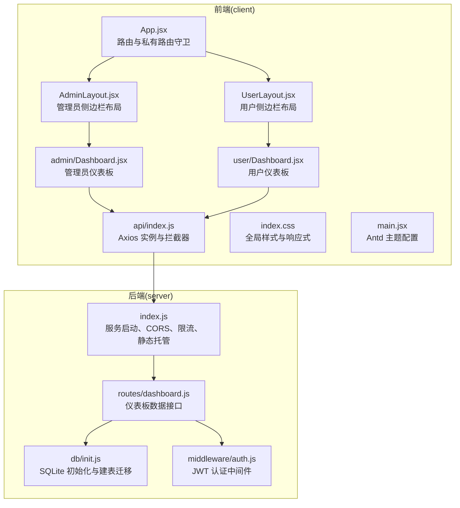
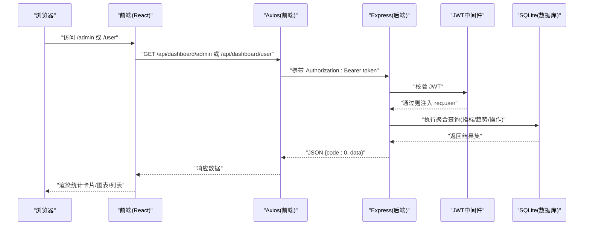
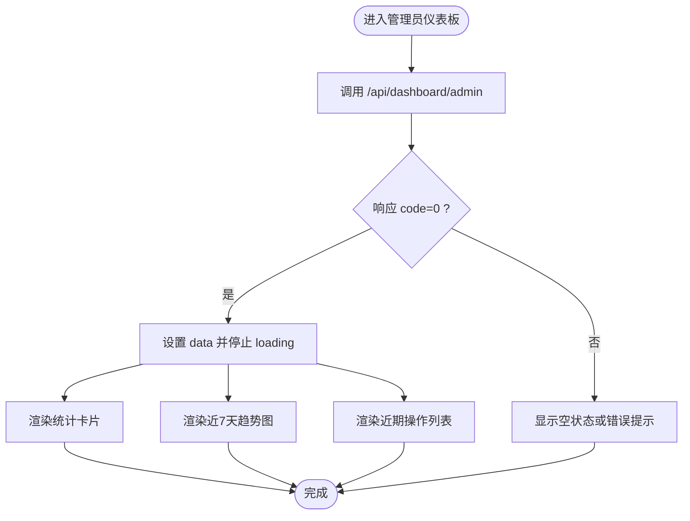
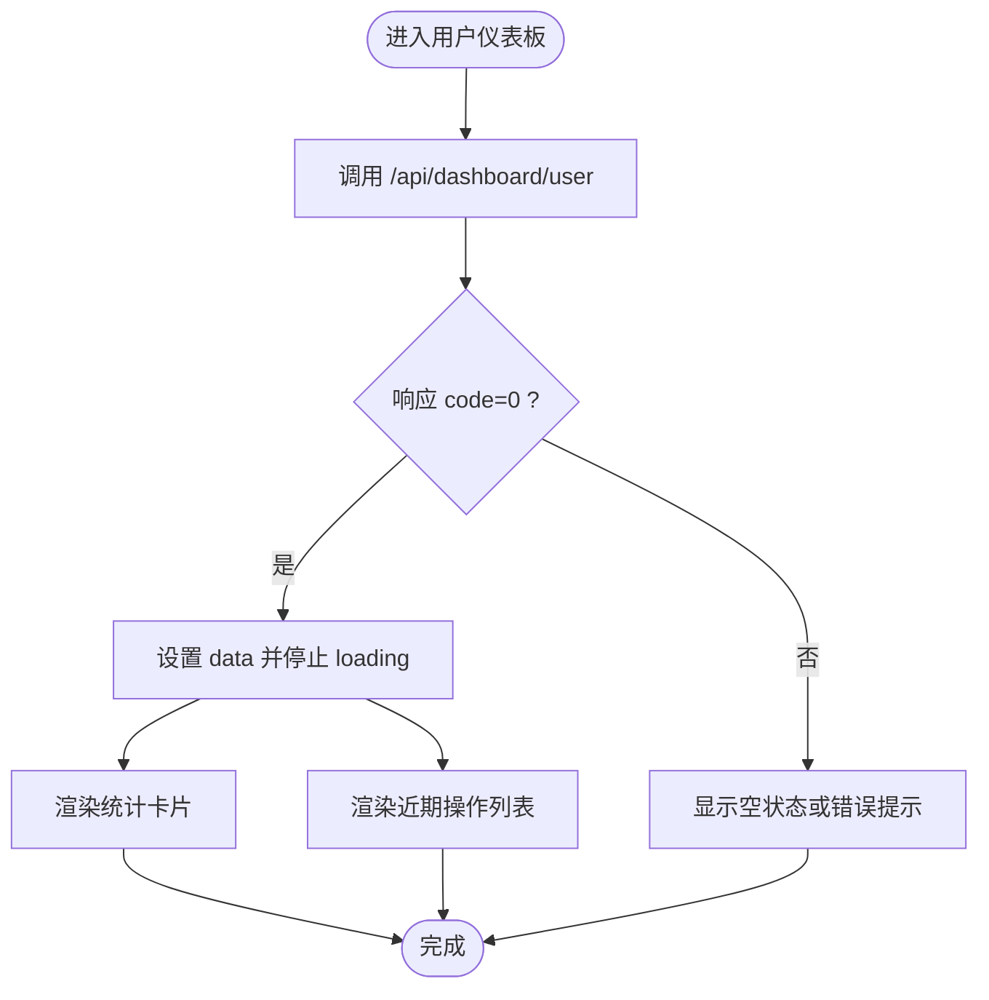
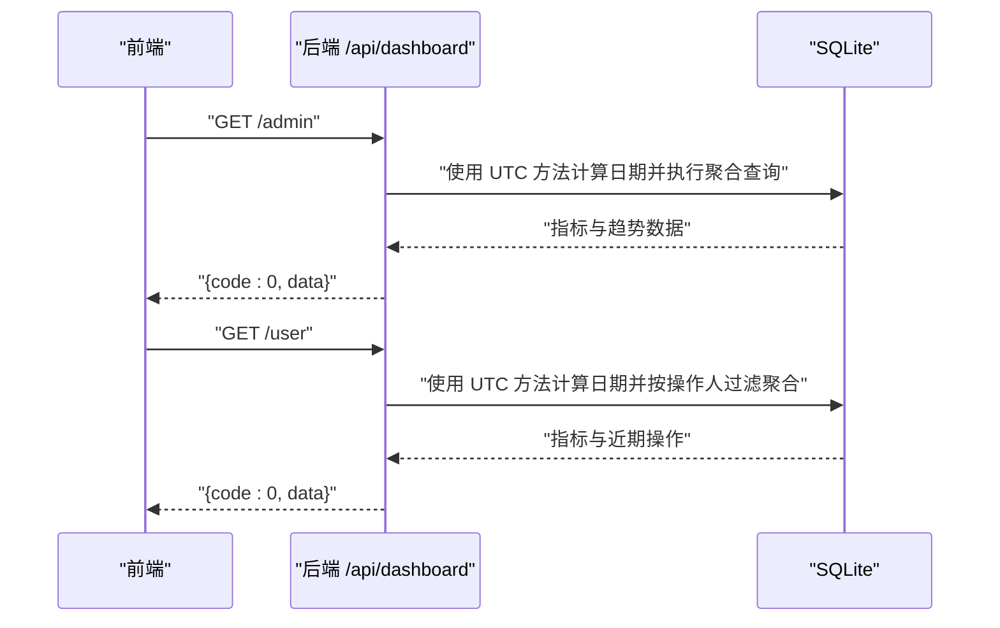
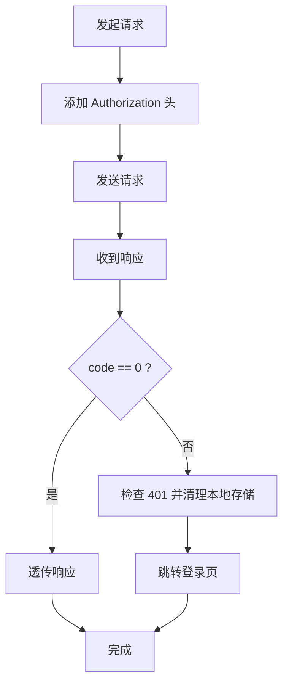
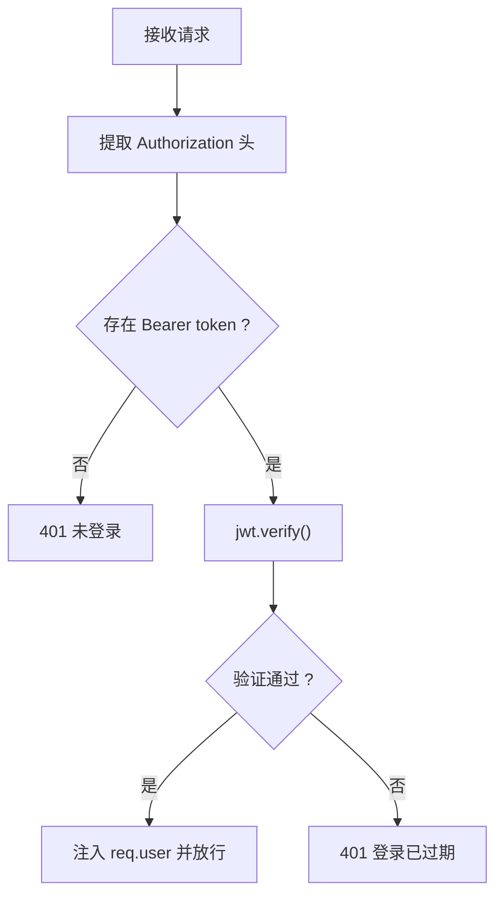
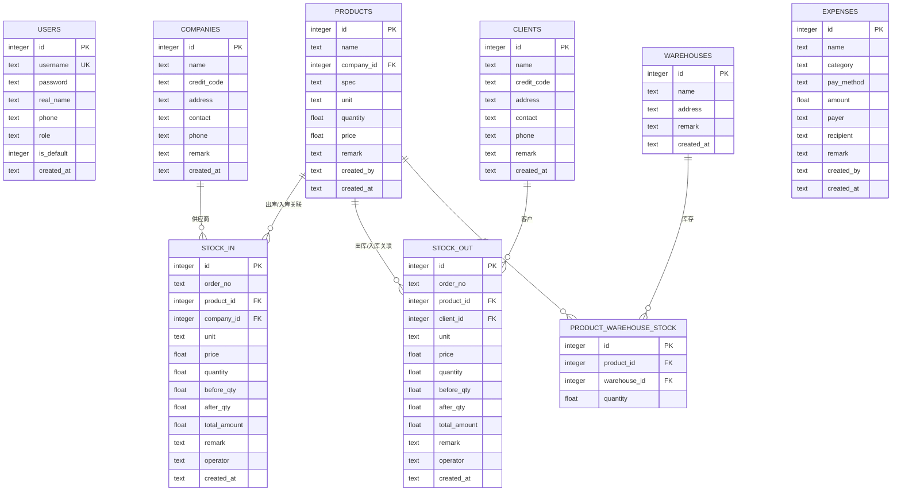
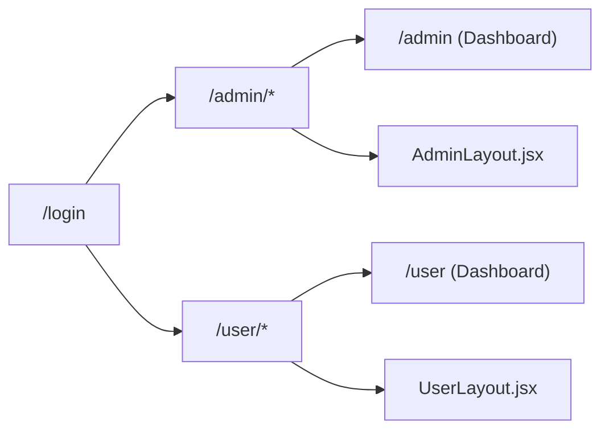
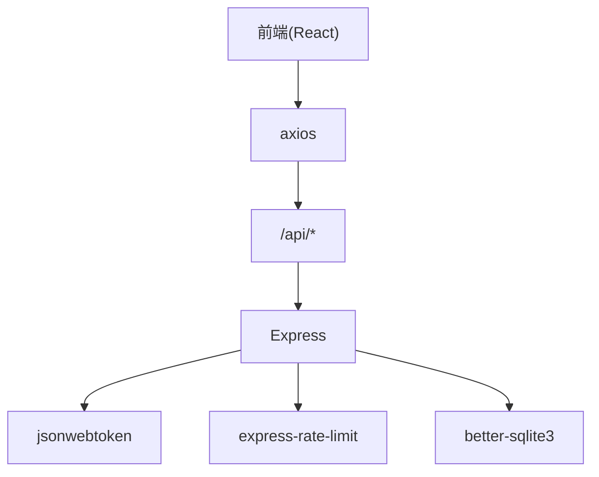

# 仪表板系统

<cite>
**本文档引用的文件**
- [client/src/pages/admin/Dashboard.jsx](file://client/src/pages/admin/Dashboard.jsx)
- [client/src/pages/user/Dashboard.jsx](file://client/src/pages/user/Dashboard.jsx)
- [server/routes/dashboard.js](file://server/routes/dashboard.js)
- [client/src/api/index.js](file://client/src/api/index.js)
- [server/index.js](file://server/index.js)
- [server/db/init.js](file://server/db/init.js)
- [server/middleware/auth.js](file://server/middleware/auth.js)
- [client/src/App.jsx](file://client/src/App.jsx)
- [client/src/index.css](file://client/src/index.css)
- [client/src/layouts/AdminLayout.jsx](file://client/src/layouts/AdminLayout.jsx)
- [client/src/layouts/UserLayout.jsx](file://client/src/layouts/UserLayout.jsx)
- [client/src/main.jsx](file://client/src/main.jsx)
</cite>

## 目录
1. [简介](#简介)
2. [项目结构](#项目结构)
3. [核心组件](#核心组件)
4. [架构总览](#架构总览)
5. [详细组件分析](#详细组件分析)
6. [依赖关系分析](#依赖关系分析)
7. [性能考虑](#性能考虑)
8. [故障排除指南](#故障排除指南)
9. [结论](#结论)
10. [附录](#附录)

## 简介
本项目是一个基于前端 React 与后端 Express 的轻量级仪表板系统，专注于业务数据的可视化展示与统计分析。系统提供两类仪表板：管理员仪表板与普通用户仪表板，分别展示全局运营概览与个人操作汇总；支持关键指标展示、趋势折线图、近期操作气泡列表，并通过后端接口进行数据查询与聚合。

**更新** 仪表板路由现已使用 UTC 方法进行日期计算，确保跨时区场景下的日期准确性与一致性。

## 项目结构
项目采用前后端分离架构，前端使用 React + Ant Design，后端使用 Node.js + Express + better-sqlite3，数据库为本地 SQLite 文件。路由按功能模块划分，仪表板数据由专用路由统一提供。

**图表来源**
- [client/src/App.jsx:32-64](file://client/src/App.jsx#L32-L64)
- [client/src/layouts/AdminLayout.jsx:116-172](file://client/src/layouts/AdminLayout.jsx#L116-L172)
- [client/src/layouts/UserLayout.jsx:106-158](file://client/src/layouts/UserLayout.jsx#L106-L158)
- [client/src/pages/admin/Dashboard.jsx:10-23](file://client/src/pages/admin/Dashboard.jsx#L10-L23)
- [client/src/pages/user/Dashboard.jsx:6-16](file://client/src/pages/user/Dashboard.jsx#L6-L16)
- [client/src/api/index.js:4-39](file://client/src/api/index.js#L4-L39)
- [server/index.js:65-95](file://server/index.js#L65-L95)
- [server/db/init.js:18-214](file://server/db/init.js#L18-L214)
- [server/middleware/auth.js:5-19](file://server/middleware/auth.js#L5-L19)
- [server/routes/dashboard.js:9-89](file://server/routes/dashboard.js#L9-L89)

**章节来源**
- [client/src/App.jsx:32-64](file://client/src/App.jsx#L32-L64)
- [server/index.js:65-95](file://server/index.js#L65-L95)

## 核心组件
- 前端仪表板页面
  - 管理员仪表板：加载管理员专属指标、近7天入库/出库趋势图、近期操作列表。
  - 用户仪表板：加载个人相关指标与近期操作列表。
- 数据接口
  - 管理员仪表板接口：返回商品总数、库存总金额、月度入库/出库金额与数量、月度开销、趋势数据、近期操作。
  - 用户仪表板接口：返回个人录入商品数、个人月度入库/出库/开销总额与近期操作。
- 前端 API 封装
  - Axios 实例配置 baseURL、超时、请求/响应拦截器，统一处理 401 重定向与错误提示。
- 安全与认证
  - JWT 中间件校验 Token，管理员接口额外校验角色。
- 数据库初始化
  - 创建用户、公司、客户、商品、出入库、开销、库房等表，支持字段迁移与默认数据插入。

**更新** 时间处理改进：仪表板路由现使用 UTC 方法进行日期计算，确保跨时区场景下日期计算的准确性。

**章节来源**
- [client/src/pages/admin/Dashboard.jsx:10-122](file://client/src/pages/admin/Dashboard.jsx#L10-L122)
- [client/src/pages/user/Dashboard.jsx:6-73](file://client/src/pages/user/Dashboard.jsx#L6-L73)
- [server/routes/dashboard.js:9-89](file://server/routes/dashboard.js#L9-L89)
- [client/src/api/index.js:4-39](file://client/src/api/index.js#L4-L39)
- [server/middleware/auth.js:5-26](file://server/middleware/auth.js#L5-L26)
- [server/db/init.js:18-214](file://server/db/init.js#L18-L214)

## 架构总览
系统采用前后端同域部署模式，前端通过 /api 前缀调用后端接口。后端启用 Helmet、CORS、速率限制等安全措施；数据库采用 WAL 模式与外键约束提升并发与一致性。

**图表来源**
- [client/src/api/index.js:9-39](file://client/src/api/index.js#L9-L39)
- [server/middleware/auth.js:5-19](file://server/middleware/auth.js#L5-L19)
- [server/routes/dashboard.js:9-89](file://server/routes/dashboard.js#L9-L89)
- [server/index.js:65-95](file://server/index.js#L65-L95)

## 详细组件分析

### 管理员仪表板页面
- 数据加载：组件挂载时调用 /api/dashboard/admin，成功后将数据写入状态并停止加载动画。
- 关键指标：商品总数、库存总金额、本月入库/出库金额与数量、本月开销。
- 图表：近7天入库/出库趋势折线图，X 轴为日期，Y 轴为金额。
- 近期操作：合并入库、出库、开销记录，按时间倒序显示，支持点击跳转到对应页面。

**图表来源**
- [client/src/pages/admin/Dashboard.jsx:15-23](file://client/src/pages/admin/Dashboard.jsx#L15-L23)
- [client/src/pages/admin/Dashboard.jsx:28-36](file://client/src/pages/admin/Dashboard.jsx#L28-L36)
- [client/src/pages/admin/Dashboard.jsx:86-119](file://client/src/pages/admin/Dashboard.jsx#L86-L119)

**章节来源**
- [client/src/pages/admin/Dashboard.jsx:10-122](file://client/src/pages/admin/Dashboard.jsx#L10-L122)

### 用户仪表板页面
- 数据加载：组件挂载时调用 /api/dashboard/user。
- 关键指标：我录入的商品数、我的月度入库/出库/开销总额。
- 近期操作：按类型与时间排序显示，支持点击跳转。

**图表来源**
- [client/src/pages/user/Dashboard.jsx:10-16](file://client/src/pages/user/Dashboard.jsx#L10-L16)
- [client/src/pages/user/Dashboard.jsx:21-26](file://client/src/pages/user/Dashboard.jsx#L21-L26)
- [client/src/pages/user/Dashboard.jsx:58-70](file://client/src/pages/user/Dashboard.jsx#L58-L70)

**章节来源**
- [client/src/pages/user/Dashboard.jsx:6-73](file://client/src/pages/user/Dashboard.jsx#L6-L73)

### 仪表板数据接口
- 管理员接口
  - 指标：商品总数、库存总金额、本月入库/出库金额与数量、本月开销。
  - 趋势：近7天每日入库/出库金额，按日期字符串切片展示。
  - 近期操作：合并最近入库、出库、开销记录，按时间倒序，截取前若干条。
- 用户接口
  - 指标：个人录入商品数、个人月度入库/出库/开销总额。
  - 近期操作：按操作人过滤，合并最近记录并排序。

**更新** 时间处理改进：管理员与用户仪表板接口均使用 UTC 方法进行日期计算，确保跨时区场景下的日期准确性。

**图表来源**
- [server/routes/dashboard.js:9-60](file://server/routes/dashboard.js#L9-L60)
- [server/routes/dashboard.js:63-89](file://server/routes/dashboard.js#L63-L89)

**章节来源**
- [server/routes/dashboard.js:9-89](file://server/routes/dashboard.js#L9-L89)

### 前端 API 封装与拦截器
- 请求拦截：自动附加 Authorization: Bearer token。
- 响应拦截：统一处理非 0 code 与 401 未授权，清理本地 token 并跳转登录页；其他错误弹出消息提示。

**图表来源**
- [client/src/api/index.js:9-39](file://client/src/api/index.js#L9-L39)

**章节来源**
- [client/src/api/index.js:4-42](file://client/src/api/index.js#L4-L42)

### 安全与认证中间件
- 从 Authorization 头解析 Bearer Token，验证失败返回 401。
- 管理员接口可额外校验角色为 admin。

**图表来源**
- [server/middleware/auth.js:5-19](file://server/middleware/auth.js#L5-L19)

**章节来源**
- [server/middleware/auth.js:5-26](file://server/middleware/auth.js#L5-L26)

### 数据库模型与初始化
- 核心表：users、companies、clients、products、product_warehouse_stock、stock_in、stock_out、expenses、warehouses。
- 初始化流程：创建表、外键开启、WAL 模式、字段迁移、默认管理员与系统名称插入。

**图表来源**
- [server/db/init.js:21-186](file://server/db/init.js#L21-L186)

**章节来源**
- [server/db/init.js:18-214](file://server/db/init.js#L18-L214)

### 前端路由与布局
- 路由：登录页、管理员与用户两条主路径，均通过私有路由守卫校验 token。
- 布局：管理员与用户分别拥有独立侧边栏布局，支持移动端抽屉式导航与系统名称动态加载。

**图表来源**
- [client/src/App.jsx:32-64](file://client/src/App.jsx#L32-L64)
- [client/src/layouts/AdminLayout.jsx:116-172](file://client/src/layouts/AdminLayout.jsx#L116-L172)
- [client/src/layouts/UserLayout.jsx:106-158](file://client/src/layouts/UserLayout.jsx#L106-L158)

**章节来源**
- [client/src/App.jsx:26-30](file://client/src/App.jsx#L26-L30)
- [client/src/layouts/AdminLayout.jsx:16-42](file://client/src/layouts/AdminLayout.jsx#L16-L42)
- [client/src/layouts/UserLayout.jsx:16-41](file://client/src/layouts/UserLayout.jsx#L16-L41)

## 依赖关系分析
- 前端依赖
  - React 生态：React、React Router、Ant Design UI、Recharts 图表。
  - 网络：axios。
- 后端依赖
  - Web：express、cors、helmet。
  - 安全：jsonwebtoken、express-rate-limit。
  - 数据库：better-sqlite3。
- 前后端耦合点
  - 接口约定：/api/dashboard/admin 与 /api/dashboard/user 返回结构一致，便于前端统一处理。
  - 认证：Authorization 头 Bearer Token，后端中间件统一校验。

**图表来源**
- [client/src/api/index.js:1-42](file://client/src/api/index.js#L1-L42)
- [server/index.js:1-120](file://server/index.js#L1-L120)
- [server/middleware/auth.js:1-29](file://server/middleware/auth.js#L1-L29)
- [server/db/init.js:1-217](file://server/db/init.js#L1-L217)

**章节来源**
- [client/src/api/index.js:1-42](file://client/src/api/index.js#L1-L42)
- [server/index.js:1-120](file://server/index.js#L1-L120)

## 性能考虑
- 数据库层
  - WAL 模式提升并发读写性能；外键约束保证数据一致性。
  - 聚合查询使用 COALESCE 与 SUM，避免空值导致的异常。
- 接口层
  - 全局与登录接口分别设置速率限制，防止滥用。
  - 仪表板接口按需返回必要字段，减少传输体积。
- 前端层
  - 折线图使用 ResponsiveContainer 适配不同屏幕尺寸。
  - 列表滚动区域限定高度，避免长列表造成卡顿。
- 可扩展建议
  - 对高频查询增加索引（如 stock_in/stock_out 的 created_at、operator、product_id）。
  - 前端缓存短期指标，结合轮询或 SSE 实现实时更新。
  - 对趋势数据进行分页或按周聚合，降低渲染压力。

**更新** 时间处理优化：通过使用 UTC 方法进行日期计算，避免了本地时间转换带来的时区偏差，提升了跨时区部署的一致性和准确性。

## 故障排除指南
- 401 未登录/登录过期
  - 现象：接口返回 401，前端清除本地 token 并跳转登录页。
  - 排查：确认 Authorization 头是否正确携带；检查 JWT 是否过期。
- CORS 跨域问题
  - 现象：浏览器控制台报跨域错误。
  - 排查：核对 ALLOWED_ORIGINS 环境变量与部署域名；确认请求来源是否在允许列表。
- 仪表板数据为空
  - 现象：统计卡片显示 0 或空白。
  - 排查：确认数据库中是否存在相关记录；检查 created_at 字段格式与 LIKE 查询匹配。
- 响应拦截器错误提示
  - 现象：网络错误或业务错误弹窗。
  - 排查：查看后端返回的 code 与 message；检查接口路径与参数。
- 日期显示异常
  - 现象：跨时区环境下日期显示不正确。
  - 排查：确认后端使用 UTC 方法进行日期计算；检查客户端时区设置。

**章节来源**
- [client/src/api/index.js:17-39](file://client/src/api/index.js#L17-L39)
- [server/index.js:18-41](file://server/index.js#L18-L41)
- [server/routes/dashboard.js:21-29](file://server/routes/dashboard.js#L21-L29)

## 结论
本仪表板系统以简洁的前后端分离架构实现了关键指标与趋势数据的可视化展示。通过 JWT 认证与速率限制保障安全性，SQLite 初始化与迁移确保数据结构稳定。当前实现覆盖了管理员与用户的两类仪表板，具备良好的可扩展性，可在现有基础上引入缓存、索引与实时更新机制，进一步提升性能与用户体验。

**更新** 时间处理改进显著提升了系统的跨时区兼容性，通过统一的 UTC 方法确保了日期计算的准确性，为国际化部署提供了可靠基础。

## 附录
- 最佳实践
  - 指标体系：围绕"总量、金额、数量、趋势、近期操作"构建 KPI，确保口径一致。
  - 图表设计：优先使用折线图展示趋势，柱状图对比分类指标；注意颜色与标签可读性。
  - 数据筛选：在后端按日期范围、产品、仓库、人员等维度聚合，前端提供多条件筛选。
  - 导出能力：将趋势与列表数据导出为 CSV/Excel，支持打印样式优化。
  - 用户体验：移动端优先，侧边栏抽屉化，图标与颜色语义明确，加载状态与错误提示清晰。
  - 跨时区处理：统一使用 UTC 方法进行日期计算，确保全球部署的一致性。