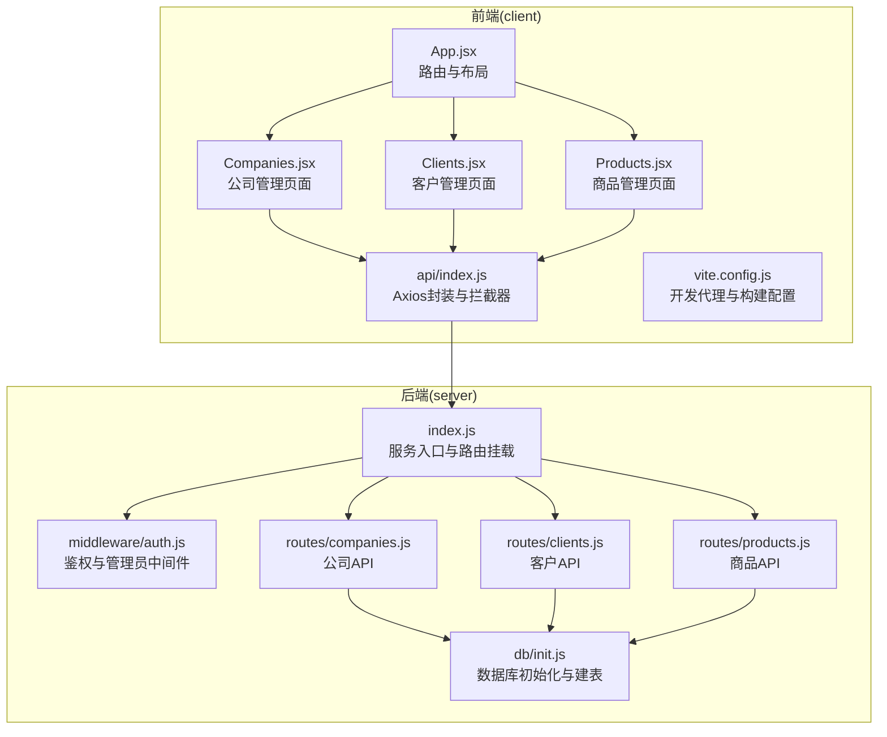
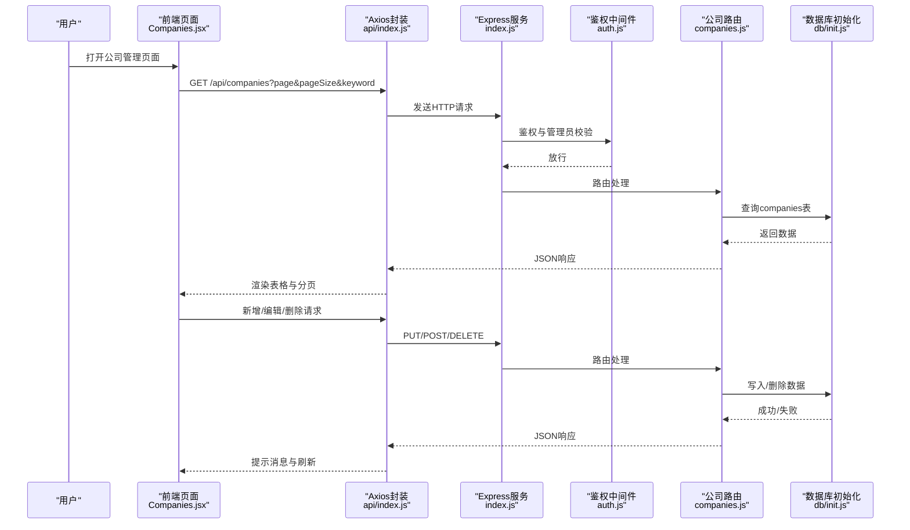
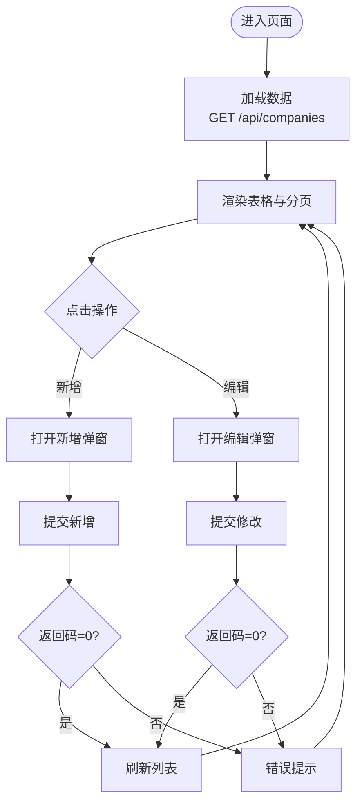
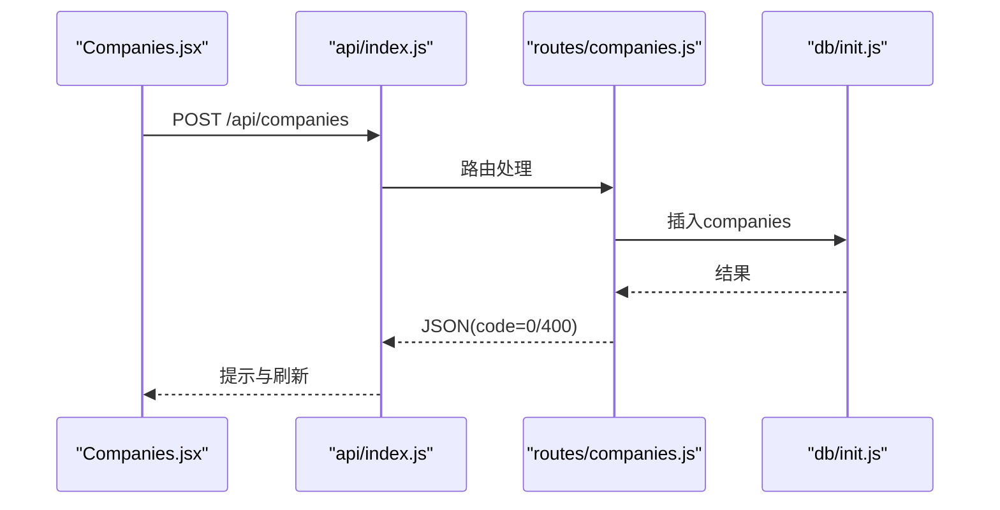
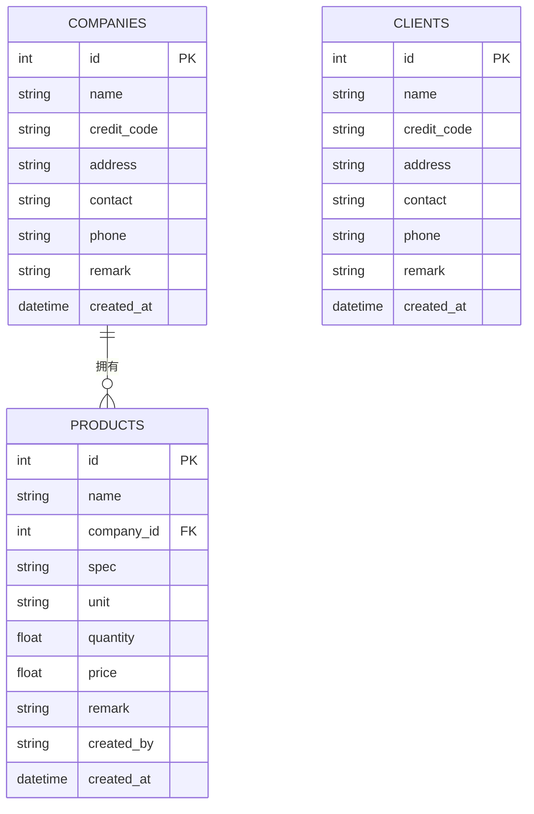
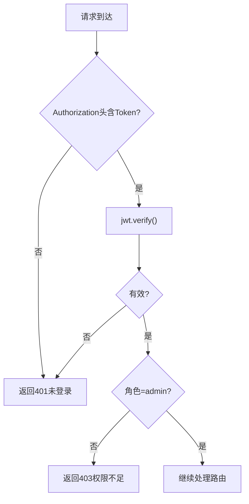
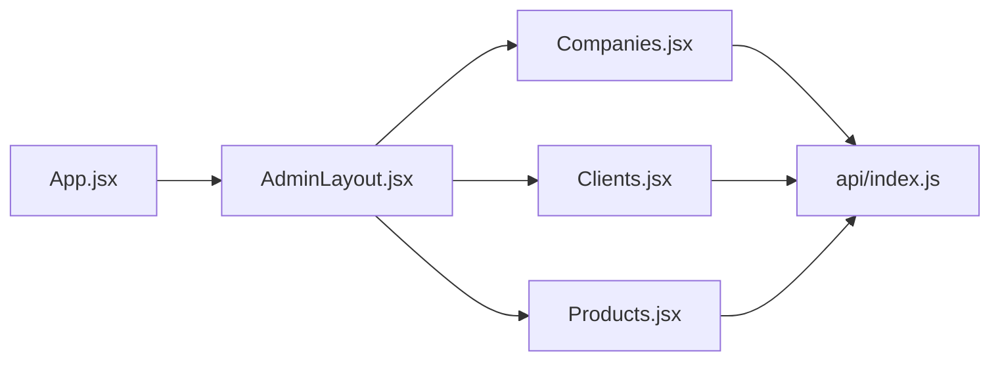
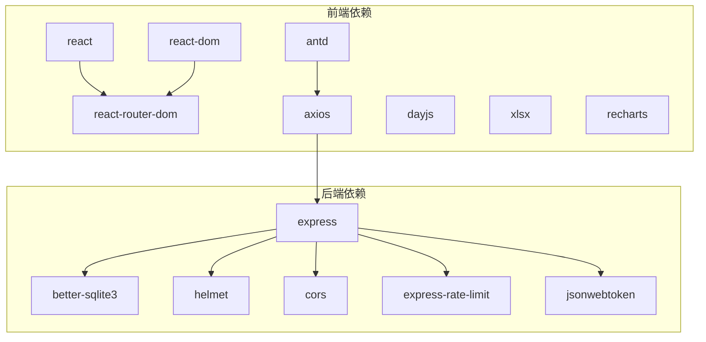

# 公司管理系统

<cite>
**本文档引用的文件**
- [client/src/pages/admin/Companies.jsx](file://client/src/pages/admin/Companies.jsx)
- [server/routes/companies.js](file://server/routes/companies.js)
- [client/src/api/index.js](file://client/src/api/index.js)
- [server/db/init.js](file://server/db/init.js)
- [client/src/layouts/AdminLayout.jsx](file://client/src/layouts/AdminLayout.jsx)
- [server/middleware/auth.js](file://server/middleware/auth.js)
- [server/index.js](file://server/index.js)
- [client/src/App.jsx](file://client/src/App.jsx)
- [client/package.json](file://client/package.json)
- [server/routes/clients.js](file://server/routes/clients.js)
- [server/routes/products.js](file://server/routes/products.js)
- [client/src/pages/admin/Clients.jsx](file://client/src/pages/admin/Clients.jsx)
- [client/src/pages/admin/Products.jsx](file://client/src/pages/admin/Products.jsx)
- [client/vite.config.js](file://client/vite.config.js)
</cite>

## 目录
1. [简介](#简介)
2. [项目结构](#项目结构)
3. [核心组件](#核心组件)
4. [架构总览](#架构总览)
5. [详细组件分析](#详细组件分析)
6. [依赖关系分析](#依赖关系分析)
7. [性能考虑](#性能考虑)
8. [故障排除指南](#故障排除指南)
9. [结论](#结论)
10. [附录](#附录)

## 简介
本系统是一个基于前后端分离架构的企业管理系统，重点围绕“公司管理”能力展开，提供公司信息维护与管理、组织架构关联、分支机构支持、数据隔离与扩展等能力。系统采用 React 前端 + Express 后端 + SQLite 数据存储，支持管理员权限控制、JWT 授权、CORS 安全策略与限流保护。

## 项目结构
- 前端(client): 使用 React + Ant Design + Axios，负责页面渲染、用户交互、API 调用与状态管理。
- 后端(server): 使用 Express + better-sqlite3，提供 RESTful API、中间件鉴权与数据库初始化。
- 数据库(db): 使用 SQLite 文件型数据库，初始化时创建公司、客户、商品、出入库等核心表及外键约束。

**图表来源**
- [client/src/App.jsx:1-67](file://client/src/App.jsx#L1-L67)
- [client/src/pages/admin/Companies.jsx:1-77](file://client/src/pages/admin/Companies.jsx#L1-L77)
- [client/src/pages/admin/Clients.jsx:1-77](file://client/src/pages/admin/Clients.jsx#L1-L77)
- [client/src/pages/admin/Products.jsx:1-134](file://client/src/pages/admin/Products.jsx#L1-L134)
- [client/src/api/index.js:1-42](file://client/src/api/index.js#L1-L42)
- [client/vite.config.js:1-20](file://client/vite.config.js#L1-L20)
- [server/index.js:1-120](file://server/index.js#L1-L120)
- [server/middleware/auth.js:1-29](file://server/middleware/auth.js#L1-L29)
- [server/db/init.js:1-217](file://server/db/init.js#L1-L217)
- [server/routes/companies.js:1-104](file://server/routes/companies.js#L1-L104)
- [server/routes/clients.js:1-81](file://server/routes/clients.js#L1-L81)
- [server/routes/products.js:1-98](file://server/routes/products.js#L1-L98)

**章节来源**
- [client/src/App.jsx:1-67](file://client/src/App.jsx#L1-L67)
- [server/index.js:1-120](file://server/index.js#L1-L120)

## 核心组件
- 公司管理页面：提供公司信息的增删改查、分页检索、弹窗表单、关键字搜索。
- 公司 API：提供列表查询、全量查询、查找或创建、新增、更新、删除等接口。
- 数据模型：SQLite 表 companies 字段包含名称、统一社会信用代码、地址、联系人、电话、备注等。
- 鉴权与权限：JWT 验证、管理员权限校验、CORS 与限流保护。
- 前端交互：Ant Design 组件、Axios 封装、路由守卫与私有路由。

**章节来源**
- [client/src/pages/admin/Companies.jsx:1-77](file://client/src/pages/admin/Companies.jsx#L1-L77)
- [server/routes/companies.js:1-104](file://server/routes/companies.js#L1-L104)
- [server/db/init.js:67-79](file://server/db/init.js#L67-L79)
- [server/middleware/auth.js:1-29](file://server/middleware/auth.js#L1-L29)
- [client/src/api/index.js:1-42](file://client/src/api/index.js#L1-L42)

## 架构总览
系统采用前后端分离模式，前端通过 Axios 发起 /api 前缀的请求，后端 Express 提供路由与中间件，数据库为本地 SQLite 文件。管理员角色可进行公司信息的维护；普通用户可访问受限功能。

**图表来源**
- [client/src/pages/admin/Companies.jsx:18-36](file://client/src/pages/admin/Companies.jsx#L18-L36)
- [client/src/api/index.js:4-42](file://client/src/api/index.js#L4-L42)
- [server/index.js:68-95](file://server/index.js#L68-L95)
- [server/middleware/auth.js:5-26](file://server/middleware/auth.js#L5-L26)
- [server/routes/companies.js:9-101](file://server/routes/companies.js#L9-L101)
- [server/db/init.js:67-79](file://server/db/init.js#L67-L79)

## 详细组件分析

### 公司管理页面（Companies.jsx）
- 功能点
  - 列表加载：分页参数 page/pageSize 与 keyword 关键字检索。
  - 弹窗表单：新增/编辑公司，必填项校验。
  - 操作列：修改与删除，删除前检查是否存在关联商品。
- 数据字段
  - 公司名称、统一社会信用代码、地址、联系人、电话、备注。
- 交互流程
  - 加载数据 -> 表格渲染 -> 弹窗提交 -> 成功提示 -> 刷新列表。

**图表来源**
- [client/src/pages/admin/Companies.jsx:18-36](file://client/src/pages/admin/Companies.jsx#L18-L36)

**章节来源**
- [client/src/pages/admin/Companies.jsx:1-77](file://client/src/pages/admin/Companies.jsx#L1-L77)

### 公司 API（routes/companies.js）
- 接口概览
  - GET /api/companies：分页与关键字检索。
  - GET /api/companies/all：全量公司列表（用于下拉）。
  - POST /api/companies/find-or-create：按名称查找或自动创建。
  - POST /api/companies：新增公司（名称唯一）。
  - PUT /api/companies/:id：更新公司（名称唯一）。
  - DELETE /api/companies/:id：删除公司（需无关联商品）。
- 业务规则
  - 名称非空校验与去空白。
  - 新增/更新均进行名称重复检查。
  - 删除前检查商品关联，避免破坏数据完整性。

**图表来源**
- [server/routes/companies.js:47-62](file://server/routes/companies.js#L47-L62)
- [server/db/init.js:67-79](file://server/db/init.js#L67-L79)

**章节来源**
- [server/routes/companies.js:1-104](file://server/routes/companies.js#L1-L104)

### 数据模型设计（SQLite）
- companies 表字段
  - id、name、credit_code、address、contact、phone、remark、created_at。
- 外键与关联
  - products.company_id 外键指向 companies.id。
- 迁移与兼容
  - 对 stock_in/stock_out/expense 表进行字段迁移以支持新功能。

**图表来源**
- [server/db/init.js:67-79](file://server/db/init.js#L67-L79)
- [server/db/init.js:81-93](file://server/db/init.js#L81-L93)
- [server/db/init.js:95-110](file://server/db/init.js#L95-L110)

**章节来源**
- [server/db/init.js:67-110](file://server/db/init.js#L67-L110)

### 鉴权与权限控制
- 中间件
  - authMiddleware：从 Authorization 头解析 Bearer Token，验证失败返回 401。
  - adminMiddleware：校验用户角色为 admin，否则返回 403。
- 安全策略
  - Helmet 安全头、CORS 白名单、登录与全局 API 限流。
- 前端拦截
  - 401 自动清除本地 token 并跳转登录。

**图表来源**
- [server/middleware/auth.js:5-26](file://server/middleware/auth.js#L5-L26)
- [client/src/api/index.js:17-39](file://client/src/api/index.js#L17-L39)

**章节来源**
- [server/middleware/auth.js:1-29](file://server/middleware/auth.js#L1-L29)
- [server/index.js:11-63](file://server/index.js#L11-L63)
- [client/src/api/index.js:1-42](file://client/src/api/index.js#L1-L42)

### 前端交互与路由
- 路由与布局
  - App.jsx 定义 /admin 与 /user 两条私有路由，AdminLayout 提供侧边栏与头部。
  - Companies/Clients/Products 页面分别对应公司、客户、商品管理。
- 开发代理
  - Vite 代理 /api 到后端 3001 端口，便于本地联调。

**图表来源**
- [client/src/App.jsx:32-64](file://client/src/App.jsx#L32-L64)
- [client/src/layouts/AdminLayout.jsx:57-86](file://client/src/layouts/AdminLayout.jsx#L57-L86)
- [client/src/pages/admin/Companies.jsx:53-76](file://client/src/pages/admin/Companies.jsx#L53-L76)
- [client/src/pages/admin/Clients.jsx:53-76](file://client/src/pages/admin/Clients.jsx#L53-L76)
- [client/src/pages/admin/Products.jsx:63-133](file://client/src/pages/admin/Products.jsx#L63-L133)
- [client/vite.config.js:8-13](file://client/vite.config.js#L8-L13)

**章节来源**
- [client/src/App.jsx:1-67](file://client/src/App.jsx#L1-L67)
- [client/src/layouts/AdminLayout.jsx:1-174](file://client/src/layouts/AdminLayout.jsx#L1-L174)
- [client/vite.config.js:1-20](file://client/vite.config.js#L1-L20)

### 客户与商品模块（对比参考）
- 客户管理（Clients.jsx 与 routes/clients.js）
  - 类似公司管理的 CRUD 流程，支持全量查询与删除前关联检查。
- 商品管理（Products.jsx 与 routes/products.js）
  - 商品与公司存在外键关联，删除前检查库存与出入库记录。

**章节来源**
- [client/src/pages/admin/Clients.jsx:1-77](file://client/src/pages/admin/Clients.jsx#L1-L77)
- [server/routes/clients.js:1-81](file://server/routes/clients.js#L1-L81)
- [client/src/pages/admin/Products.jsx:1-134](file://client/src/pages/admin/Products.jsx#L1-L134)
- [server/routes/products.js:1-98](file://server/routes/products.js#L1-L98)

## 依赖关系分析
- 前端依赖
  - React、React Router DOM、Ant Design、Axios、dayjs、xlsx、recharts。
- 后端依赖
  - Express、better-sqlite3、helmet、cors、express-rate-limit、jsonwebtoken。
- 前后端通信
  - 前端通过 /api 前缀调用后端接口，Vite 开发时使用代理。

**图表来源**
- [client/package.json:11-21](file://client/package.json#L11-L21)
- [server/index.js:1-10](file://server/index.js#L1-L10)

**章节来源**
- [client/package.json:1-27](file://client/package.json#L1-L27)
- [server/index.js:1-120](file://server/index.js#L1-L120)

## 性能考虑
- 数据库
  - WAL 模式提升并发读写性能；开启外键约束保证一致性。
- 接口
  - 分页查询与 LIKE 模糊匹配，建议对常用检索字段建立索引（如 name、contact、phone）。
- 前端
  - 表格横向滚动与分页，减少一次性渲染压力；表单校验在提交时进行，避免频繁请求。
- 安全与稳定性
  - 登录与全局 API 限流，CORS 白名单，Helmet 安全头，降低攻击面与滥用风险。

## 故障排除指南
- 401 未登录/登录过期
  - 前端拦截器会清除本地 token 并跳转登录页；确认 Authorization 头是否携带 Bearer Token。
- 403 权限不足
  - 当前用户非管理员角色；请使用管理员账户登录。
- 400 业务错误
  - 如“公司名称已存在”、“公司不存在”、“该公司下有关联商品，无法删除”等；根据提示修正输入或清理关联数据。
- CORS 跨域问题
  - 确认请求来源在白名单内；开发环境通过 Vite 代理 /api。
- 数据库初始化
  - 首次运行会自动创建表与默认管理员；若异常，检查数据库文件路径与权限。

**章节来源**
- [client/src/api/index.js:17-39](file://client/src/api/index.js#L17-L39)
- [server/middleware/auth.js:5-26](file://server/middleware/auth.js#L5-L26)
- [server/routes/companies.js:49-101](file://server/routes/companies.js#L49-L101)
- [server/index.js:18-41](file://server/index.js#L18-L41)
- [server/db/init.js:197-211](file://server/db/init.js#L197-L211)

## 结论
本系统围绕“公司管理”提供了完整的前端页面与后端 API，具备完善的鉴权与权限控制、基础的数据模型与外键约束、以及良好的扩展性。通过分页检索、弹窗表单与删除前关联检查，保障了数据的一致性与可用性。后续可在搜索性能、索引优化、国际化与审计日志等方面进一步增强。

## 附录
- 快速开始
  - 前端：安装依赖后运行 dev，访问 http://localhost:3000。
  - 后端：安装依赖后运行，监听 3001 端口。
- 开发代理
  - Vite 将 /api 代理到 http://localhost:3001，确保前后端联调顺畅。

**章节来源**
- [client/vite.config.js:6-18](file://client/vite.config.js#L6-L18)
- [server/index.js:117-119](file://server/index.js#L117-L119)