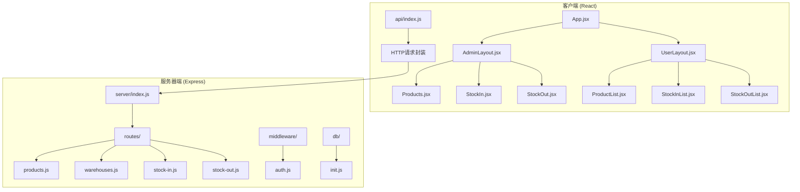
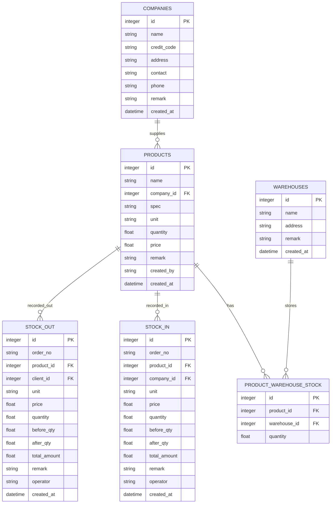
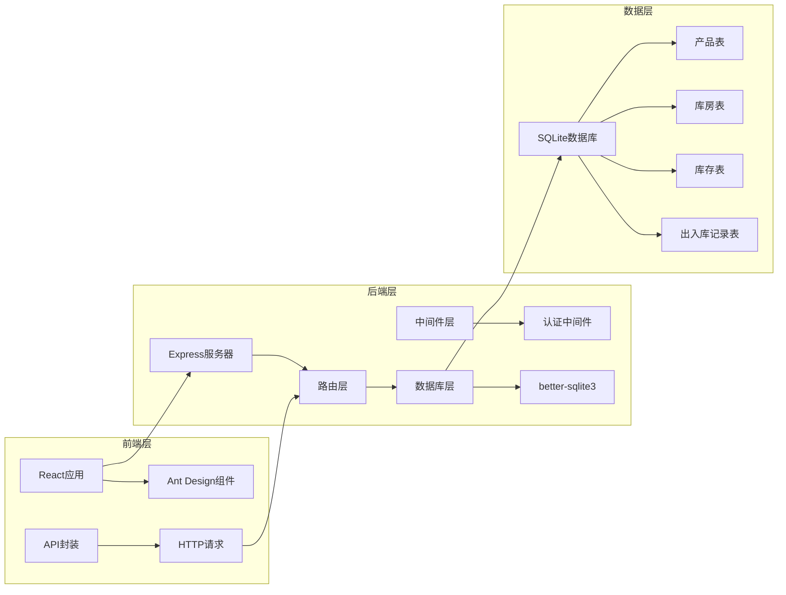
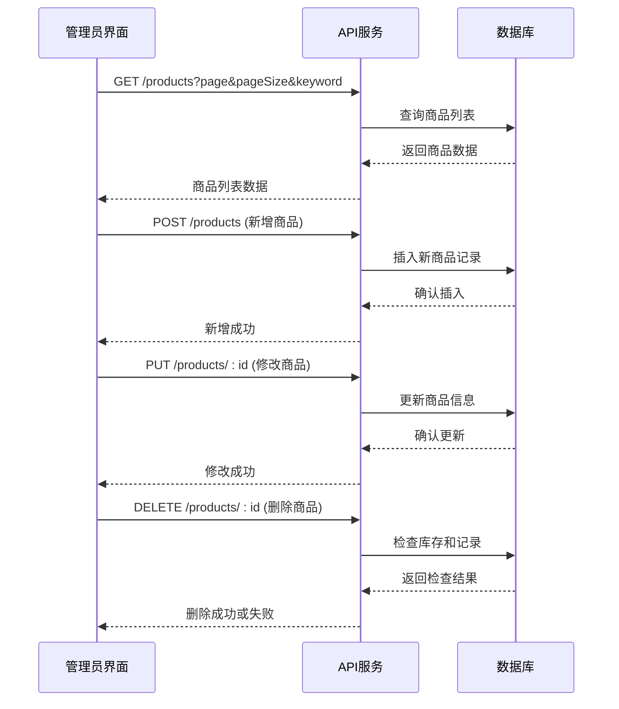
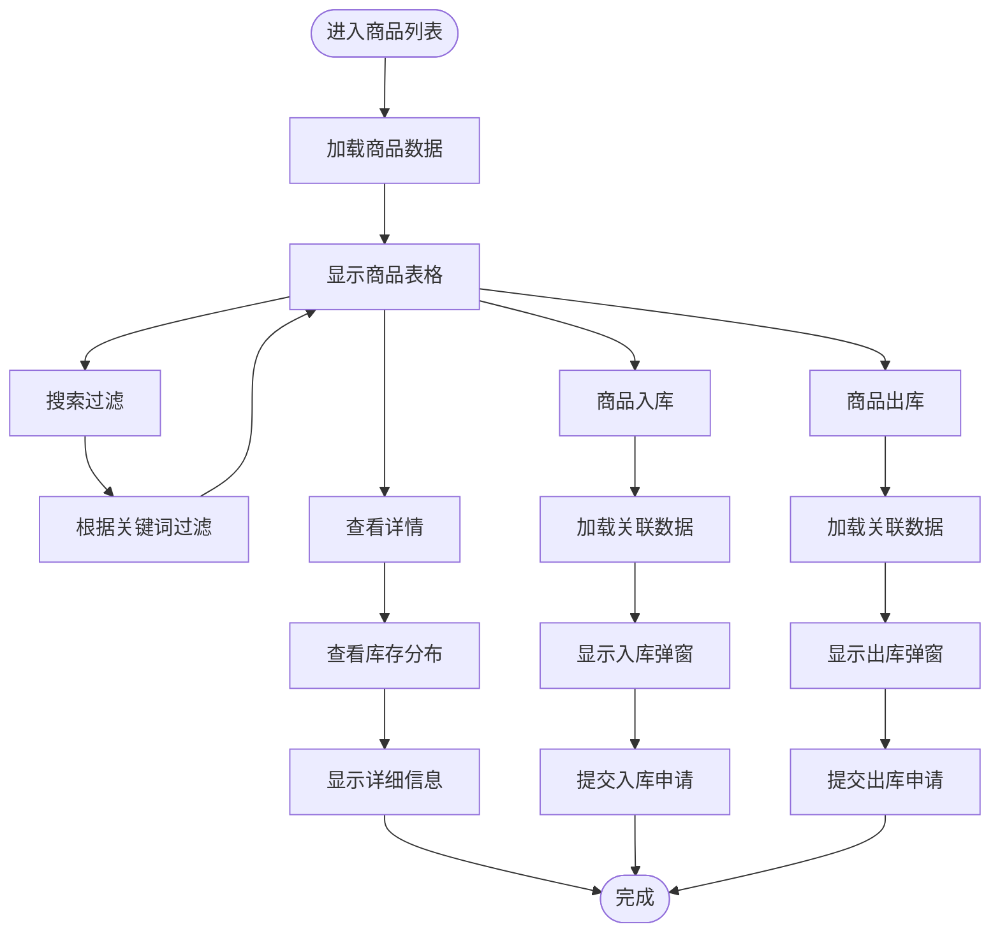
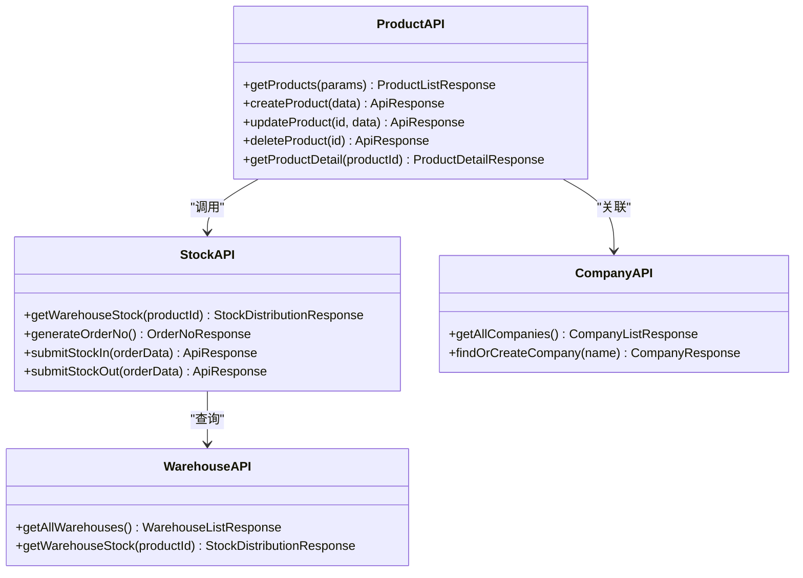
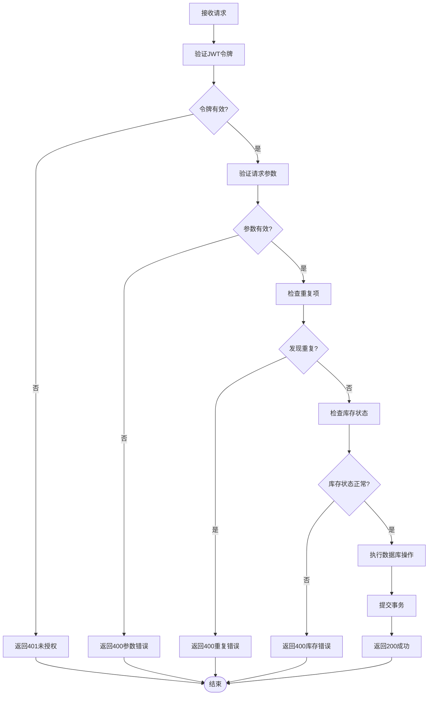
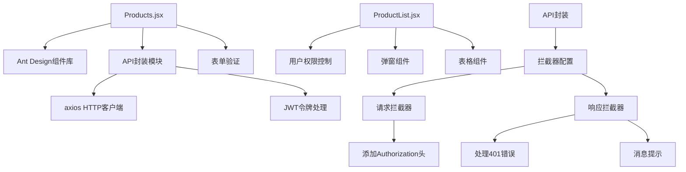
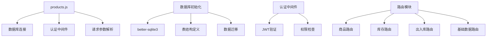
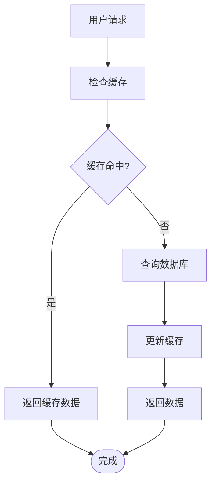

# 商品管理系统

<cite>
**本文档引用的文件**
- [Products.jsx](file://client/src/pages/admin/Products.jsx)
- [ProductList.jsx](file://client/src/pages/user/ProductList.jsx)
- [products.js](file://server/routes/products.js)
- [index.js](file://client/src/api/index.js)
- [init.js](file://server/db/init.js)
- [auth.js](file://server/middleware/auth.js)
- [warehouses.js](file://server/routes/warehouses.js)
- [stock-in.js](file://server/routes/stock-in.js)
- [stock-out.js](file://server/routes/stock-out.js)
- [App.jsx](file://client/src/App.jsx)
- [AdminLayout.jsx](file://client/src/layouts/AdminLayout.jsx)
- [UserLayout.jsx](file://client/src/layouts/UserLayout.jsx)
- [companies.js](file://server/routes/companies.js)
- [clients.js](file://server/routes/clients.js)
</cite>

## 目录
1. [简介](#简介)
2. [项目结构](#项目结构)
3. [核心组件](#核心组件)
4. [架构概览](#架构概览)
5. [详细组件分析](#详细组件分析)
6. [依赖关系分析](#依赖关系分析)
7. [性能考虑](#性能考虑)
8. [故障排除指南](#故障排除指南)
9. [结论](#结论)

## 简介

商品管理系统是一个基于React + Express + SQLite的完整库存管理解决方案。系统提供了完整的商品信息管理功能，包括商品基本信息维护、价格设置、库存关联、入库出库操作等核心业务功能。系统采用前后端分离架构，使用JWT进行身份认证，支持管理员和普通用户的差异化权限控制。

## 项目结构

系统采用典型的前后端分离架构，分为客户端（React）和服务器端（Express）两大部分：

**图表来源**
- [App.jsx:1-67](file://client/src/App.jsx#L1-L67)
- [AdminLayout.jsx:1-174](file://client/src/layouts/AdminLayout.jsx#L1-L174)
- [UserLayout.jsx:1-162](file://client/src/layouts/UserLayout.jsx#L1-L162)

**章节来源**
- [App.jsx:1-67](file://client/src/App.jsx#L1-L67)
- [AdminLayout.jsx:1-174](file://client/src/layouts/AdminLayout.jsx#L1-L174)
- [UserLayout.jsx:1-162](file://client/src/layouts/UserLayout.jsx#L1-L162)

## 核心组件

### 数据模型设计

系统采用SQLite作为数据存储，核心数据模型包括商品、库房、库存、出入库记录等实体：

**图表来源**
- [init.js:95-170](file://server/db/init.js#L95-L170)

### 关键字段定义

| 字段名 | 类型 | 必填 | 默认值 | 说明 |
|--------|------|------|--------|------|
| id | 整数 | 是 | 自增 | 主键标识 |
| name | 字符串 | 是 | 空 | 商品名称 |
| company_id | 整数 | 否 | 空 | 供应商ID |
| spec | 字符串 | 否 | 空 | 规格描述 |
| unit | 字符串 | 否 | 空 | 单位 |
| quantity | 浮点数 | 否 | 0 | 当前库存数量 |
| price | 浮点数 | 否 | 0 | 单价 |
| remark | 字符串 | 否 | 空 | 备注说明 |
| created_by | 字符串 | 否 | 空 | 创建人 |
| created_at | 日期时间 | 否 | 当前时间 | 创建时间 |

**章节来源**
- [init.js:95-110](file://server/db/init.js#L95-L110)

## 架构概览

系统采用MVC架构模式，前后端分离，使用RESTful API进行通信：

**图表来源**
- [products.js:1-98](file://server/routes/products.js#L1-L98)
- [auth.js:1-29](file://server/middleware/auth.js#L1-L29)
- [init.js:1-217](file://server/db/init.js#L1-L217)

## 详细组件分析

### 商品管理页面

#### 管理员商品管理界面

管理员界面提供了完整的商品管理功能，包括增删改查、搜索过滤、批量操作等：

**图表来源**
- [Products.jsx:19-46](file://client/src/pages/admin/Products.jsx#L19-L46)
- [products.js:8-95](file://server/routes/products.js#L8-L95)

#### 用户商品查询界面

用户界面专注于商品查询和基础操作，提供简洁的操作流程：

**图表来源**
- [ProductList.jsx:24-88](file://client/src/pages/user/ProductList.jsx#L24-L88)
- [stock-in.js:110-170](file://server/routes/stock-in.js#L110-L170)
- [stock-out.js:110-175](file://server/routes/stock-out.js#L110-L175)

**章节来源**
- [Products.jsx:1-134](file://client/src/pages/admin/Products.jsx#L1-L134)
- [ProductList.jsx:1-221](file://client/src/pages/user/ProductList.jsx#L1-L221)

### API接口规范

#### 商品管理API

系统提供RESTful风格的商品管理接口：

| 方法 | 路径 | 权限 | 功能 | 请求参数 | 响应数据 |
|------|------|------|------|----------|----------|
| GET | /api/products | 所有用户 | 获取商品列表 | keyword, page, pageSize | 商品列表和总数 |
| POST | /api/products | 管理员 | 新增商品 | name, company_id, spec, unit, quantity, price, remark | 操作结果 |
| PUT | /api/products/:id | 管理员 | 修改商品 | 同上 | 操作结果 |
| DELETE | /api/products/:id | 管理员 | 删除商品 | 无 | 操作结果 |

#### 库存查询API

**图表来源**
- [products.js:8-95](file://server/routes/products.js#L8-L95)
- [warehouses.js:30-41](file://server/routes/warehouses.js#L30-L41)
- [stock-in.js:25-30](file://server/routes/stock-in.js#L25-L30)
- [stock-out.js:25-30](file://server/routes/stock-out.js#L25-L30)

**章节来源**
- [products.js:1-98](file://server/routes/products.js#L1-L98)
- [warehouses.js:1-117](file://server/routes/warehouses.js#L1-L117)
- [stock-in.js:1-173](file://server/routes/stock-in.js#L1-L173)
- [stock-out.js:1-178](file://server/routes/stock-out.js#L1-L178)

### 数据验证规则

系统实现了多层次的数据验证机制：

**图表来源**
- [auth.js:5-19](file://server/middleware/auth.js#L5-L19)
- [products.js:32-44](file://server/routes/products.js#L32-L44)
- [stock-in.js:133-162](file://server/routes/stock-in.js#L133-L162)
- [stock-out.js:133-167](file://server/routes/stock-out.js#L133-L167)

**章节来源**
- [auth.js:1-29](file://server/middleware/auth.js#L1-L29)
- [products.js:32-95](file://server/routes/products.js#L32-L95)

## 依赖关系分析

### 前端依赖关系

**图表来源**
- [Products.jsx:1-5](file://client/src/pages/admin/Products.jsx#L1-L5)
- [ProductList.jsx:1-4](file://client/src/pages/user/ProductList.jsx#L1-L4)
- [index.js:1-42](file://client/src/api/index.js#L1-L42)

### 后端依赖关系

**图表来源**
- [products.js:1-6](file://server/routes/products.js#L1-L6)
- [init.js:1-16](file://server/db/init.js#L1-L16)
- [auth.js:1-4](file://server/middleware/auth.js#L1-L4)

**章节来源**
- [Products.jsx:1-134](file://client/src/pages/admin/Products.jsx#L1-L134)
- [ProductList.jsx:1-221](file://client/src/pages/user/ProductList.jsx#L1-L221)
- [products.js:1-98](file://server/routes/products.js#L1-L98)
- [init.js:1-217](file://server/db/init.js#L1-L217)
- [auth.js:1-29](file://server/middleware/auth.js#L1-L29)

## 性能考虑

### 数据库优化策略

1. **索引优化**: 在常用查询字段上建立索引，如商品名称、公司ID、创建时间等
2. **查询优化**: 使用LIMIT和OFFSET实现分页，避免全表扫描
3. **连接池**: 使用better-sqlite3的连接池机制提高并发性能
4. **事务处理**: 对批量操作使用事务确保数据一致性

### 前端性能优化

1. **虚拟滚动**: 对于大量数据的表格使用虚拟滚动技术
2. **懒加载**: 图片和大内容采用懒加载策略
3. **缓存机制**: 利用浏览器缓存减少重复请求
4. **防抖处理**: 搜索框输入采用防抖技术减少请求频率

### 缓存策略

## 故障排除指南

### 常见问题及解决方案

#### 登录认证问题
- **问题**: 401未授权错误
- **原因**: 令牌过期或无效
- **解决**: 重新登录获取新令牌，检查本地存储中的token状态

#### 数据重复问题
- **问题**: 商品名称重复错误
- **原因**: 同一公司下商品名称重复
- **解决**: 修改商品名称或选择不同的公司

#### 库存操作失败
- **问题**: 入库/出库操作失败
- **原因**: 库存不足或商品不存在
- **解决**: 检查商品库存状态，确认库房选择正确

#### 数据库连接问题
- **问题**: 数据库连接失败
- **原因**: 数据库文件损坏或权限不足
- **解决**: 检查数据库文件完整性，确保文件权限正确

**章节来源**
- [index.js:17-39](file://client/src/api/index.js#L17-L39)
- [auth.js:9-18](file://server/middleware/auth.js#L9-L18)
- [products.js:32-44](file://server/routes/products.js#L32-L44)

## 结论

商品管理系统是一个功能完整、架构清晰的库存管理解决方案。系统采用了现代化的技术栈，提供了良好的用户体验和可靠的数据安全保障。通过合理的数据模型设计和完善的API接口规范，系统能够满足中小型企业的商品管理需求。

### 系统优势

1. **完整的功能覆盖**: 从商品管理到库存控制的全流程支持
2. **良好的用户体验**: 响应式设计，支持移动端访问
3. **安全可靠**: JWT认证和权限控制机制
4. **易于扩展**: 模块化设计便于功能扩展

### 改进建议

1. **增加数据备份机制**: 实现定期自动备份功能
2. **增强报表功能**: 提供更丰富的统计报表
3. **移动端APP**: 开发原生移动应用提升用户体验
4. **多语言支持**: 增加国际化支持