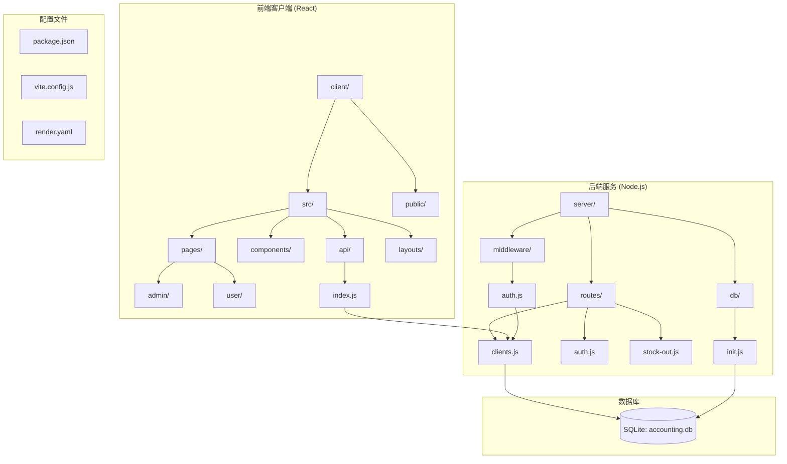
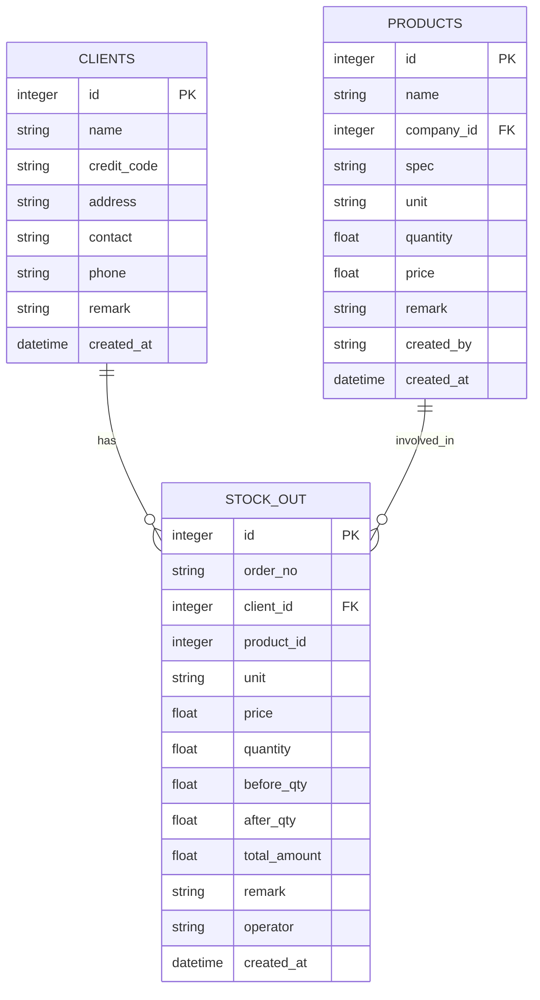
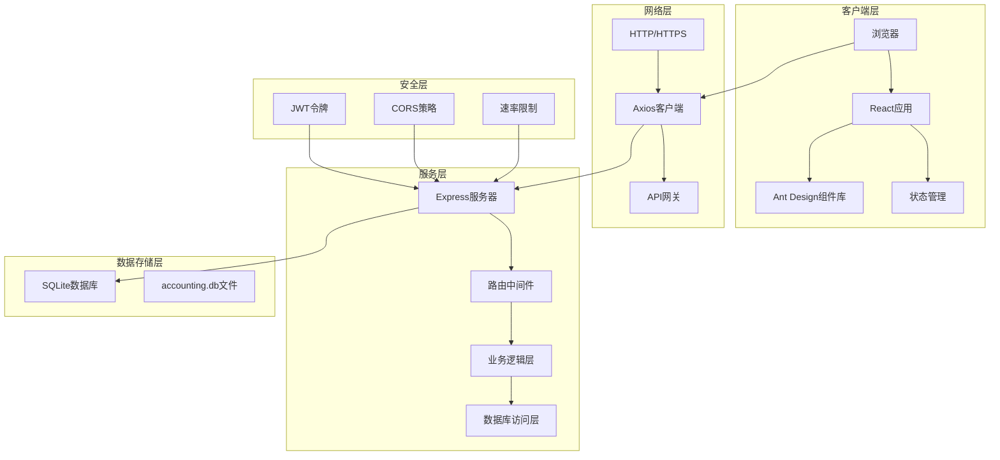
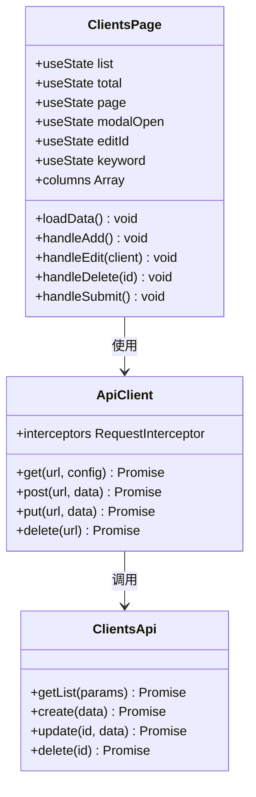
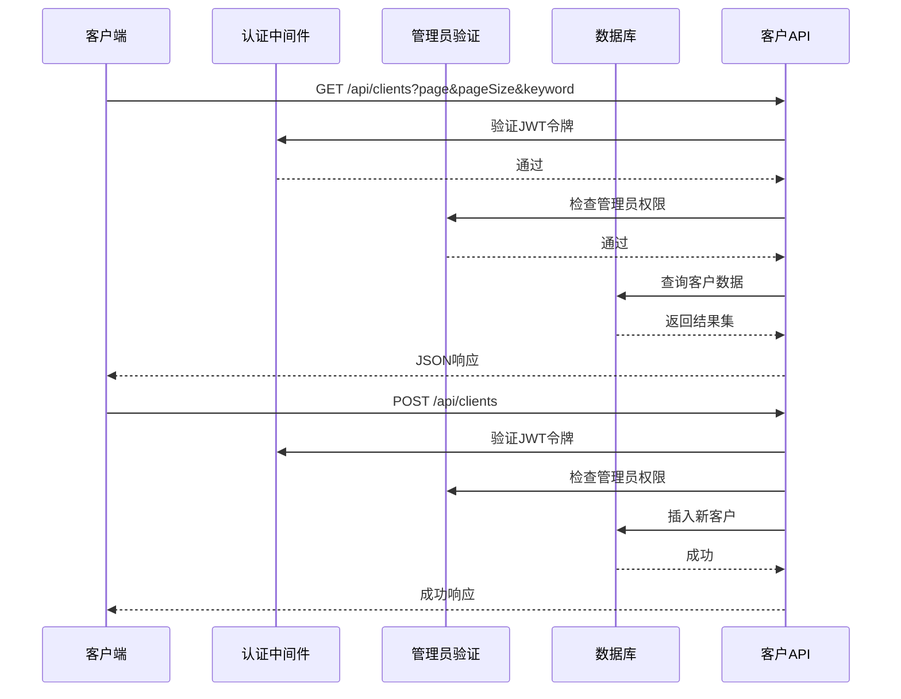
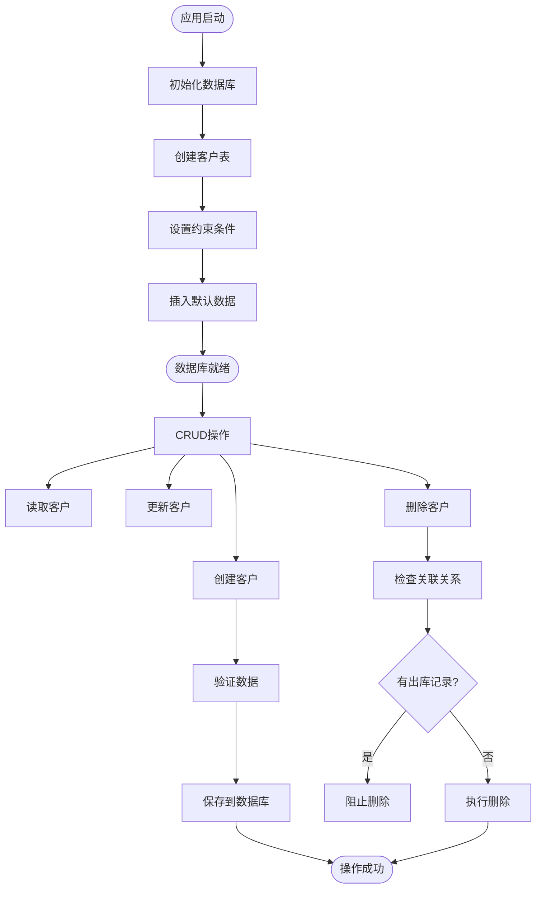
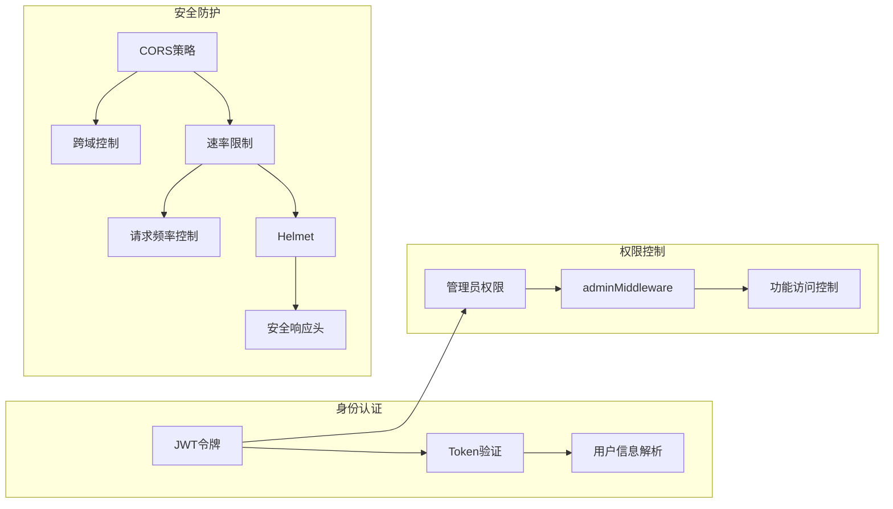
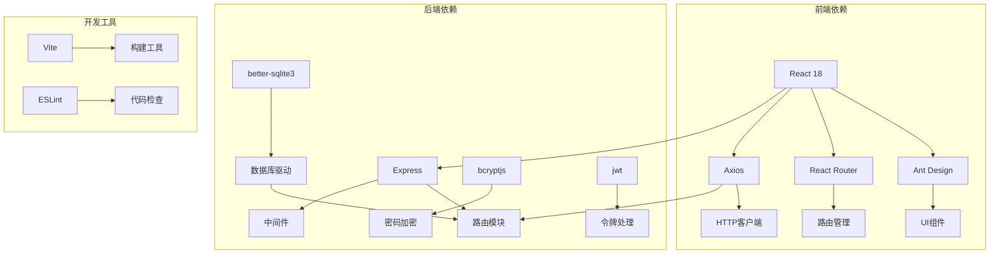

# 客户管理系统

<cite>
**本文档引用的文件**
- [client/src/pages/admin/Clients.jsx](file://client/src/pages/admin/Clients.jsx)
- [server/routes/clients.js](file://server/routes/clients.js)
- [client/src/api/index.js](file://client/src/api/index.js)
- [server/db/init.js](file://server/db/init.js)
- [server/middleware/auth.js](file://server/middleware/auth.js)
- [server/routes/auth.js](file://server/routes/auth.js)
- [server/routes/stock-out.js](file://server/routes/stock-out.js)
- [client/src/App.jsx](file://client/src/App.jsx)
- [server/index.js](file://server/index.js)
- [client/src/layouts/AdminLayout.jsx](file://client/src/layouts/AdminLayout.jsx)
- [server/routes/companies.js](file://server/routes/companies.js)
- [package.json](file://package.json)
</cite>

## 目录
1. [简介](#简介)
2. [项目结构](#项目结构)
3. [核心组件](#核心组件)
4. [架构概览](#架构概览)
5. [详细组件分析](#详细组件分析)
6. [依赖分析](#依赖分析)
7. [性能考虑](#性能考虑)
8. [故障排除指南](#故障排除指南)
9. [结论](#结论)

## 简介

客户管理系统是一个基于现代Web技术栈的企业级财务管理应用，专门用于维护和管理客户信息。该系统采用前后端分离架构，前端使用React + Ant Design构建用户界面，后端使用Node.js + Express提供RESTful API服务，数据库采用SQLite实现数据持久化。

系统主要功能包括：
- 客户信息的完整生命周期管理（增删改查）
- 客户搜索和筛选功能
- 与库存管理系统的深度集成
- 基于角色的权限控制
- 安全的身份认证机制

## 项目结构

该项目采用清晰的前后端分离架构，具有以下特点：

**图表来源**
- [client/src/App.jsx:1-67](file://client/src/App.jsx#L1-L67)
- [server/index.js:1-120](file://server/index.js#L1-L120)
- [server/db/init.js:1-217](file://server/db/init.js#L1-L217)

**章节来源**
- [client/src/App.jsx:1-67](file://client/src/App.jsx#L1-L67)
- [server/index.js:1-120](file://server/index.js#L1-L120)
- [package.json:1-13](file://package.json#L1-L13)

## 核心组件

### 数据模型设计

系统的核心数据模型围绕客户信息进行设计，以下是完整的数据结构：

**图表来源**
- [server/db/init.js:81-93](file://server/db/init.js#L81-L93)
- [server/db/init.js:143-161](file://server/db/init.js#L143-L161)

### 关键字段定义

| 字段名 | 数据类型 | 必填 | 描述 | 约束 |
|--------|----------|------|------|------|
| id | INTEGER | 是 | 客户唯一标识符 | 主键，自增 |
| name | VARCHAR | 是 | 客户单位名称 | 唯一性约束 |
| credit_code | VARCHAR | 否 | 统一社会信用代码 | 可为空 |
| address | TEXT | 否 | 客户地址 | 可为空 |
| contact | VARCHAR | 否 | 联系人姓名 | 可为空 |
| phone | VARCHAR | 否 | 联系电话 | 可为空 |
| remark | TEXT | 否 | 备注信息 | 可为空 |
| created_at | DATETIME | 否 | 创建时间 | 默认当前时间 |

**章节来源**
- [server/db/init.js:81-93](file://server/db/init.js#L81-L93)

## 架构概览

系统采用现代化的全栈架构，实现了前后端完全分离的设计理念：

**图表来源**
- [client/src/api/index.js:1-42](file://client/src/api/index.js#L1-L42)
- [server/index.js:1-120](file://server/index.js#L1-L120)
- [server/middleware/auth.js:1-29](file://server/middleware/auth.js#L1-L29)

### 技术栈特性

- **前端技术栈**: React 18 + Ant Design + Vite构建工具
- **后端技术栈**: Node.js 18+ + Express框架 + better-sqlite3
- **数据库**: SQLite轻量级数据库，支持WAL模式和外键约束
- **安全机制**: JWT令牌认证 + CORS跨域控制 + 速率限制
- **部署方式**: 支持本地开发和Render平台部署

**章节来源**
- [client/src/api/index.js:1-42](file://client/src/api/index.js#L1-L42)
- [server/index.js:1-120](file://server/index.js#L1-L120)
- [package.json:1-13](file://package.json#L1-L13)

## 详细组件分析

### 客户管理界面组件

客户管理界面是系统的核心功能模块，提供了完整的CRUD操作能力：

**图表来源**
- [client/src/pages/admin/Clients.jsx:1-77](file://client/src/pages/admin/Clients.jsx#L1-L77)
- [client/src/api/index.js:1-42](file://client/src/api/index.js#L1-L42)

#### 界面功能特性

1. **表格展示**: 支持分页显示，每页20条记录
2. **搜索功能**: 支持按客户单位、联系人、电话进行模糊搜索
3. **模态框编辑**: 提供弹窗式的新增和编辑功能
4. **批量操作**: 支持删除确认和批量数据操作
5. **响应式设计**: 支持桌面端和移动端适配

**章节来源**
- [client/src/pages/admin/Clients.jsx:1-77](file://client/src/pages/admin/Clients.jsx#L1-L77)

### 后端API接口设计

客户管理的后端API提供了完整的RESTful接口：

**图表来源**
- [server/routes/clients.js:1-81](file://server/routes/clients.js#L1-L81)
- [server/middleware/auth.js:1-29](file://server/middleware/auth.js#L1-L29)

#### API接口规范

| 接口 | 方法 | 路径 | 权限要求 | 功能描述 |
|------|------|------|----------|----------|
| 获取客户列表 | GET | /api/clients | 管理员 | 分页查询客户信息 |
| 获取所有客户 | GET | /api/clients/all | 通用 | 获取所有客户名称和ID |
| 新增客户 | POST | /api/clients | 管理员 | 创建新的客户记录 |
| 更新客户 | PUT | /api/clients/:id | 管理员 | 修改现有客户信息 |
| 删除客户 | DELETE | /api/clients/:id | 管理员 | 删除客户记录（带关联检查） |

**章节来源**
- [server/routes/clients.js:1-81](file://server/routes/clients.js#L1-L81)

### 数据库设计与关系

系统采用SQLite作为数据存储，实现了完整的客户管理功能：

**图表来源**
- [server/db/init.js:81-93](file://server/db/init.js#L81-L93)
- [server/routes/clients.js:65-78](file://server/routes/clients.js#L65-L78)

#### 数据完整性保证

系统通过多种机制确保数据完整性：

1. **外键约束**: 客户与出库记录建立外键关系
2. **唯一性约束**: 客户名称必须唯一
3. **级联删除**: 删除客户时自动清理相关记录
4. **数据验证**: 前端和后端双重验证机制

**章节来源**
- [server/db/init.js:81-93](file://server/db/init.js#L81-L93)
- [server/routes/clients.js:65-78](file://server/routes/clients.js#L65-L78)

### 安全与权限控制

系统实现了多层次的安全防护机制：

**图表来源**
- [server/middleware/auth.js:1-29](file://server/middleware/auth.js#L1-L29)
- [server/index.js:11-63](file://server/index.js#L11-L63)

#### 安全特性实现

1. **JWT认证**: 使用密钥签名的令牌进行用户身份验证
2. **管理员权限**: 严格的管理员角色控制
3. **CORS配置**: 精细的跨域访问控制策略
4. **请求限制**: 防止暴力破解和DDoS攻击
5. **安全头设置**: 防护常见的Web攻击

**章节来源**
- [server/middleware/auth.js:1-29](file://server/middleware/auth.js#L1-L29)
- [server/index.js:11-63](file://server/index.js#L11-L63)

## 依赖分析

系统依赖关系清晰，模块间耦合度低：

**图表来源**
- [client/src/api/index.js:1-42](file://client/src/api/index.js#L1-L42)
- [server/index.js:1-120](file://server/index.js#L1-L120)

### 核心依赖包

| 依赖包 | 版本 | 用途 |
|--------|------|------|
| react | 最新版本 | 前端框架 |
| antd | 最新版本 | UI组件库 |
| axios | 最新版本 | HTTP客户端 |
| express | 最新版本 | Web服务器 |
| better-sqlite3 | 最新版本 | SQLite驱动 |
| bcryptjs | 最新版本 | 密码加密 |
| jsonwebtoken | 最新版本 | JWT令牌 |

**章节来源**
- [client/src/api/index.js:1-42](file://client/src/api/index.js#L1-L42)
- [server/index.js:1-120](file://server/index.js#L1-L120)

## 性能考虑

系统在设计时充分考虑了性能优化：

### 数据库性能优化

1. **索引策略**: 在常用查询字段上建立索引
2. **连接池**: 使用SQLite的WAL模式提高并发性能
3. **查询优化**: 使用参数化查询防止SQL注入
4. **事务处理**: 对批量操作使用事务确保一致性

### 前端性能优化

1. **懒加载**: 路由级别的代码分割
2. **虚拟滚动**: 大数据量表格的性能优化
3. **缓存策略**: API响应缓存减少重复请求
4. **防抖处理**: 搜索输入的防抖机制

### 网络性能优化

1. **请求合并**: 减少HTTP请求次数
2. **压缩传输**: Gzip压缩减少传输体积
3. **CDN支持**: 静态资源的CDN加速
4. **预加载策略**: 关键资源的预加载

## 故障排除指南

### 常见问题及解决方案

#### 登录认证问题

**问题**: 登录后无法访问受保护的API
**原因**: JWT令牌过期或格式错误
**解决方案**: 
1. 检查浏览器localStorage中的token
2. 确认Authorization头格式正确
3. 重新登录获取新令牌

#### 数据库连接问题

**问题**: 客户数据无法保存
**原因**: 数据库文件权限或路径问题
**解决方案**:
1. 检查accounting.db文件权限
2. 确认数据库文件存在且可写
3. 重启应用服务

#### CORS跨域问题

**问题**: 前端无法访问后端API
**原因**: 跨域策略配置不当
**解决方案**:
1. 检查ALLOWED_ORIGINS环境变量
2. 确认请求来源在允许列表中
3. 验证CORS配置格式

#### 权限不足问题

**问题**: 访问管理员功能返回403
**原因**: 当前用户不是管理员角色
**解决方案**:
1. 使用管理员账户登录
2. 检查用户角色信息
3. 联系系统管理员提升权限

**章节来源**
- [client/src/api/index.js:17-39](file://client/src/api/index.js#L17-L39)
- [server/middleware/auth.js:5-19](file://server/middleware/auth.js#L5-L19)

### 调试技巧

1. **浏览器开发者工具**: 检查Network标签页的API响应
2. **后端日志**: 查看服务器控制台输出
3. **数据库调试**: 使用SQLite命令行工具检查数据
4. **权限验证**: 确认JWT令牌的有效性和用户角色

## 结论

客户管理系统是一个功能完整、架构清晰的企业级应用。系统采用了现代化的技术栈，实现了前后端分离的最佳实践，具备良好的扩展性和维护性。

### 主要优势

1. **技术先进**: 采用React + Node.js的现代技术栈
2. **架构清晰**: 清晰的模块划分和职责分离
3. **安全性强**: 多层次的安全防护机制
4. **用户体验好**: 响应式设计和友好的交互体验
5. **易于扩展**: 模块化的架构便于功能扩展

### 发展建议

1. **监控系统**: 添加应用性能监控和错误追踪
2. **测试覆盖**: 增加单元测试和集成测试
3. **文档完善**: 补充API文档和开发指南
4. **国际化**: 支持多语言界面
5. **备份机制**: 实现数据定期备份和恢复

该系统为企业的客户管理提供了坚实的技术基础，能够满足中小企业的日常运营需求，并为未来的业务发展预留了充足的空间。