# 库存管理系统

<cite>
**本文档引用的文件**
- [StockIn.jsx](file://client/src/pages/admin/StockIn.jsx)
- [StockOut.jsx](file://client/src/pages/admin/StockOut.jsx)
- [StockInList.jsx](file://client/src/pages/user/StockInList.jsx)
- [StockOutList.jsx](file://client/src/pages/user/StockOutList.jsx)
- [stock-in.js](file://server/routes/stock-in.js)
- [stock-out.js](file://server/routes/stock-out.js)
- [init.js](file://server/db/init.js)
- [index.js](file://client/src/api/index.js)
- [auth.js](file://server/middleware/auth.js)
</cite>

## 更新摘要
**所做更改**
- 新增库存变动跟踪功能章节，详细说明在所有库存页面中新增的库存变动列
- 更新库存管理组件分析，增加库存变动可视化表示的实现细节
- 新增库存变动列的设计和实现流程图
- 更新API接口设计，增加库存变动数据的获取和显示机制
- 完善用户交互流程，说明库存变动跟踪的用户体验设计

## 目录
1. [简介](#简介)
2. [项目结构](#项目结构)
3. [核心组件](#核心组件)
4. [架构概览](#架构概览)
5. [详细组件分析](#详细组件分析)
6. [库存变动跟踪功能](#库存变动跟踪功能)
7. [自动实体创建功能](#自动实体创建功能)
8. [依赖关系分析](#依赖关系分析)
9. [性能考虑](#性能考虑)
10. [故障排除指南](#故障排除指南)
11. [结论](#结论)

## 简介

库存管理系统是一个基于React + Express + SQLite技术栈开发的企业级库存管理解决方案。系统实现了完整的入库和出库业务流程，包括库存数量计算和实时更新机制。系统采用前后端分离架构，前端使用Ant Design组件库构建用户界面，后端使用Express框架提供RESTful API服务。

系统支持多角色用户管理，包含管理员和普通用户两种权限级别，分别提供不同的操作界面和功能权限。核心业务功能包括商品入库登记、商品出库登记、库存查询统计、库存流水记录追踪等。

**更新** 新增库存变动跟踪功能，在所有库存页面中显示每次操作前后的库存数量变化，提供直观的库存变动可视化表示。

## 项目结构

系统采用标准的前后端分离项目结构：

```mermaid
graph TB
subgraph "前端客户端 (React)"
A[client/] --> B[src/]
B --> C[pages/]
B --> D[components/]
B --> E[layouts/]
B --> F[api/]
B --> G[assets/]
C --> C1[admin/]
C --> C2[user/]
C1 --> C11[StockIn.jsx]
C1 --> C12[StockOut.jsx]
C2 --> C21[StockInList.jsx]
C2 --> C22[StockOutList.jsx]
F --> F1[index.js]
end
subgraph "后端服务器 (Express)"
H[server/] --> I[routes/]
H --> J[middleware/]
H --> K[db/]
I --> I1[stock-in.js]
I --> I2[stock-out.js]
I --> I3[products.js]
I --> I4[warehouses.js]
J --> J1[auth.js]
K --> K1[init.js]
end
subgraph "数据库 (SQLite)"
L[(accounting.db)]
end
A < --> H
H --> L
```

**图表来源**
- [StockIn.jsx:1-425](file://client/src/pages/admin/StockIn.jsx#L1-L425)
- [stock-in.js:1-173](file://server/routes/stock-in.js#L1-L173)
- [init.js:1-217](file://server/db/init.js#L1-L217)

**章节来源**
- [StockIn.jsx:1-425](file://client/src/pages/admin/StockIn.jsx#L1-L425)
- [StockOut.jsx:1-429](file://client/src/pages/admin/StockOut.jsx#L1-L429)
- [StockInList.jsx:1-368](file://client/src/pages/user/StockInList.jsx#L1-L368)
- [StockOutList.jsx:1-394](file://client/src/pages/user/StockOutList.jsx#L1-L394)
- [stock-in.js:1-173](file://server/routes/stock-in.js#L1-L173)
- [stock-out.js:1-178](file://server/routes/stock-out.js#L1-L178)
- [init.js:1-217](file://server/db/init.js#L1-L217)

## 核心组件

### 前端核心组件

系统包含四个主要的库存操作页面组件：

1. **管理员入口组件**
   - `StockIn.jsx`: 管理员专用的入库管理界面，支持公司和仓库的自动创建
   - `StockOut.jsx`: 管理员专用的出库管理界面，支持客户单位的自动创建

2. **用户入口组件**
   - `StockInList.jsx`: 普通用户的入库操作界面
   - `StockOutList.jsx`: 普通用户的出库操作界面

### 后端核心组件

1. **数据库初始化模块** (`init.js`)
   - 负责数据库连接管理和表结构初始化
   - 实现WAL模式和外键约束配置
   - 提供数据库迁移和默认数据初始化

2. **库存路由模块**
   - `stock-in.js`: 处理所有入库相关请求，包含find-or-create接口
   - `stock-out.js`: 处理所有出库相关请求，包含find-or-create接口

3. **认证中间件** (`auth.js`)
   - 实现JWT令牌验证
   - 提供用户权限控制

**章节来源**
- [StockIn.jsx:1-425](file://client/src/pages/admin/StockIn.jsx#L1-L425)
- [StockOut.jsx:1-429](file://client/src/pages/admin/StockOut.jsx#L1-L429)
- [StockInList.jsx:1-368](file://client/src/pages/user/StockInList.jsx#L1-L368)
- [StockOutList.jsx:1-394](file://client/src/pages/user/StockOutList.jsx#L1-L394)
- [init.js:1-217](file://server/db/init.js#L1-L217)
- [auth.js:1-29](file://server/middleware/auth.js#L1-L29)

## 架构概览

系统采用经典的三层架构设计：

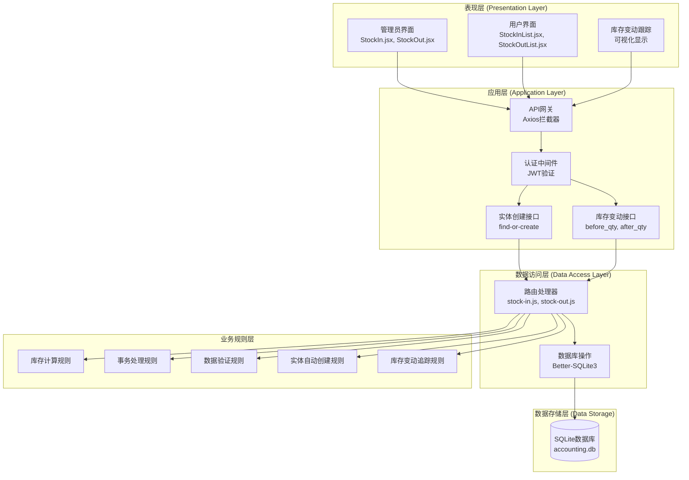

**图表来源**
- [index.js:1-42](file://client/src/api/index.js#L1-L42)
- [auth.js:1-29](file://server/middleware/auth.js#L1-L29)
- [stock-in.js:1-173](file://server/routes/stock-in.js#L1-L173)
- [stock-out.js:1-178](file://server/routes/stock-out.js#L1-L178)
- [init.js:1-217](file://server/db/init.js#L1-L217)

### 数据流架构

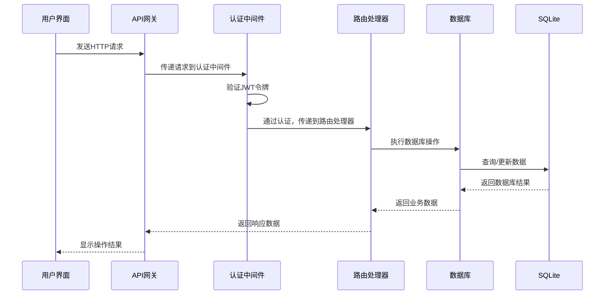

**图表来源**
- [index.js:1-42](file://client/src/api/index.js#L1-L42)
- [auth.js:1-29](file://server/middleware/auth.js#L1-L29)
- [stock-in.js:1-173](file://server/routes/stock-in.js#L1-L173)
- [stock-out.js:1-178](file://server/routes/stock-out.js#L1-L178)

## 详细组件分析

### 入库管理组件分析

#### StockIn 组件架构

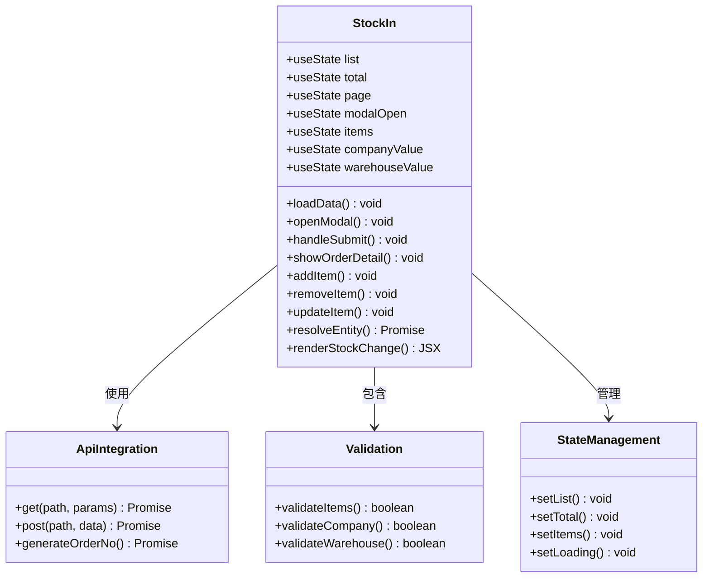

**图表来源**
- [StockIn.jsx:1-425](file://client/src/pages/admin/StockIn.jsx#L1-L425)

#### 入库业务流程

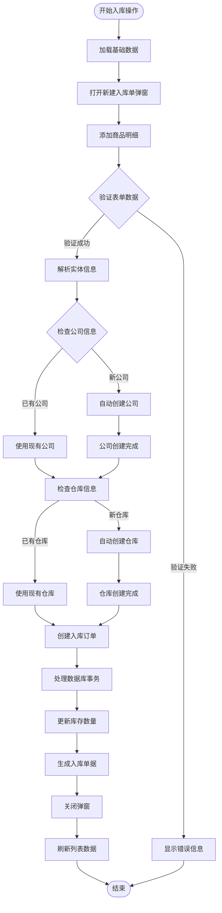

**图表来源**
- [StockIn.jsx:46-126](file://client/src/pages/admin/StockIn.jsx#L46-L126)
- [stock-in.js:110-170](file://server/routes/stock-in.js#L110-L170)

**章节来源**
- [StockIn.jsx:1-425](file://client/src/pages/admin/StockIn.jsx#L1-L425)
- [stock-in.js:1-173](file://server/routes/stock-in.js#L1-L173)

### 出库管理组件分析

#### StockOut 组件架构

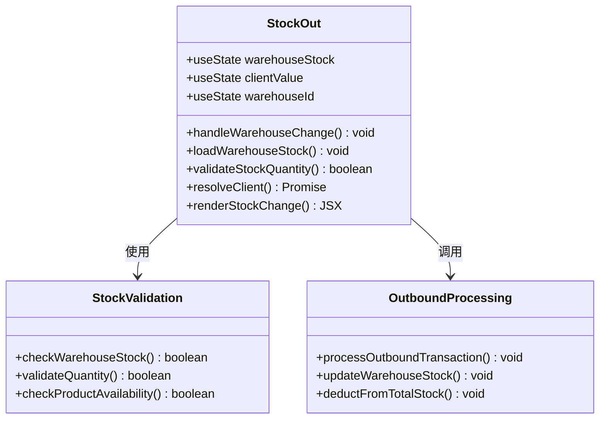

**图表来源**
- [StockOut.jsx:1-429](file://client/src/pages/admin/StockOut.jsx#L1-L429)

#### 出库业务流程

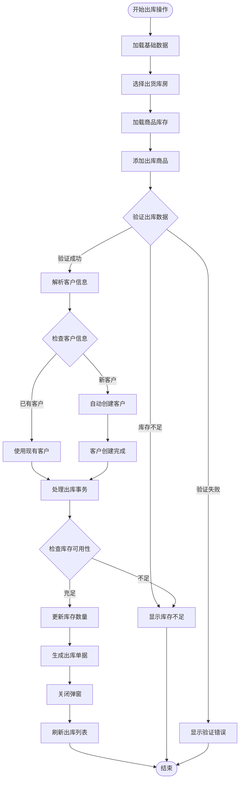

**图表来源**
- [StockOut.jsx:64-109](file://client/src/pages/admin/StockOut.jsx#L64-L109)
- [stock-out.js:110-175](file://server/routes/stock-out.js#L110-L175)

**章节来源**
- [StockOut.jsx:1-429](file://client/src/pages/admin/StockOut.jsx#L1-L429)
- [stock-out.js:1-178](file://server/routes/stock-out.js#L1-L178)

### 数据模型设计

#### 数据库表结构

```mermaid
erDiagram
PRODUCTS {
integer id PK
string name
integer company_id FK
string spec
string unit
float quantity
float price
string remark
string created_by
string created_at
}
WAREHOUSES {
integer id PK
string name
string address
string remark
string created_at
}
COMPANIES {
integer id PK
string name
string credit_code
string address
string contact
string phone
string remark
string created_at
}
CLIENTS {
integer id PK
string name
string credit_code
string address
string contact
string phone
string remark
string created_at
}
PRODUCT_WAREHOUSE_STOCK {
integer id PK
integer product_id FK
integer warehouse_id FK
float quantity
unique product_id, warehouse_id
}
STOCK_IN {
integer id PK
string order_no
integer product_id FK
integer company_id FK
string unit
float price
float quantity
float before_qty
float after_qty
float total_amount
string remark
string operator
string created_at
}
STOCK_OUT {
integer id PK
string order_no
integer product_id FK
integer client_id FK
string unit
float price
float quantity
float before_qty
float after_qty
float total_amount
string remark
string operator
string created_at
}
PRODUCTS ||--o{ PRODUCT_WAREHOUSE_STOCK : "库存关系"
WAREHOUSES ||--o{ PRODUCT_WAREHOUSE_STOCK : "库存关系"
COMPANIES ||--o{ PRODUCTS : "供应关系"
CLIENTS ||--o{ STOCK_OUT : "购买关系"
PRODUCTS ||--o{ STOCK_IN : "入库关系"
PRODUCTS ||--o{ STOCK_OUT : "出库关系"
```

**图表来源**
- [init.js:54-161](file://server/db/init.js#L54-L161)

#### 库存流水记录设计

系统通过专门的流水记录表实现完整的库存追踪：

1. **入库流水记录** (`stock_in`表)
   - 记录每次入库的详细信息
   - 包含商品、数量、单价、供应商等信息
   - 维护入库前后的库存数量对比

2. **出库流水记录** (`stock_out`表)
   - 记录每次出库的详细信息
   - 包含商品、数量、单价、客户等信息
   - 维护出库前后的库存数量对比

**章节来源**
- [init.js:112-161](file://server/db/init.js#L112-L161)

### API接口设计

#### 入库相关API

| 接口 | 方法 | 路径 | 功能描述 |
|------|------|------|----------|
| 生成入库单号 | GET | `/stock-in/generate-order-no` | 生成唯一的入库单号 |
| 入库单列表 | GET | `/stock-in` | 获取入库单分组列表 |
| 入库明细列表 | GET | `/stock-in/items` | 获取入库明细列表 |
| 入库单详情 | GET | `/stock-in/order/:orderNo` | 获取指定入库单的明细 |
| 创建入库单 | POST | `/stock-in` | 提交入库操作 |
| 查找或创建公司 | POST | `/companies/find-or-create` | 查找现有公司或创建新公司 |

#### 出库相关API

| 接口 | 方法 | 路径 | 功能描述 |
|------|------|------|----------|
| 生成出库单号 | GET | `/stock-out/generate-order-no` | 生成唯一的出库单号 |
| 出库单列表 | GET | `/stock-out` | 获取出库单分组列表 |
| 出库明细列表 | GET | `/stock-out/items` | 获取出库明细列表 |
| 出库单详情 | GET | `/stock-out/order/:orderNo` | 获取指定出库单的明细 |
| 创建出库单 | POST | `/stock-out` | 提交出库操作 |
| 查找或创建客户 | POST | `/clients/find-or-create` | 查找现有客户或创建新客户 |

**章节来源**
- [stock-in.js:25-79](file://server/routes/stock-in.js#L25-L79)
- [stock-out.js:25-79](file://server/routes/stock-out.js#L25-L79)

## 库存变动跟踪功能

### 功能概述

系统新增的库存变动跟踪功能在所有库存管理页面中显示每次入库和出库操作前后的库存数量变化。这一功能通过专门的"库存变动"列提供直观的视觉反馈，帮助用户快速理解每次操作对库存的影响。

### 核心实现机制

#### 库存变动列设计

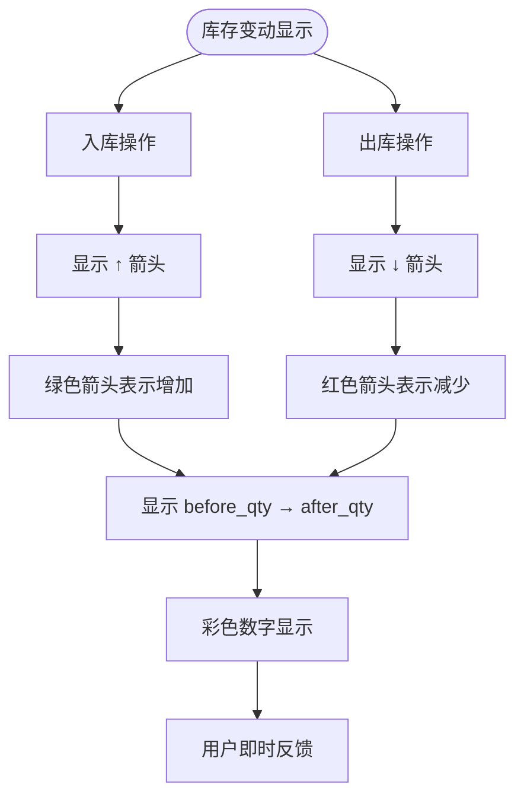

**图表来源**
- [StockIn.jsx:159-165](file://client/src/pages/admin/StockIn.jsx#L159-L165)
- [StockOut.jsx:174-180](file://client/src/pages/admin/StockOut.jsx#L174-L180)
- [StockInList.jsx:136-142](file://client/src/pages/user/StockInList.jsx#L136-L142)
- [StockOutList.jsx:153-159](file://client/src/pages/user/StockOutList.jsx#L153-L159)

#### 库存变动数据获取

1. **后端数据准备**: 后端在处理入库/出库请求时计算并存储`before_qty`和`after_qty`字段
2. **前端数据接收**: 前端从API接口获取包含库存变动数据的订单详情
3. **可视化渲染**: 前端根据数据类型显示相应的颜色和箭头符号

### 支持的页面范围

#### 管理员页面

1. **StockIn.jsx** - 管理员入库页面
   - 显示入库前后的库存数量变化
   - 使用绿色箭头表示库存增加
   - 提供详细的库存变动详情弹窗

2. **StockOut.jsx** - 管理员出库页面  
   - 显示出库前后的库存数量变化
   - 使用红色箭头表示库存减少
   - 提供详细的库存变动详情弹窗

#### 用户页面

1. **StockInList.jsx** - 普通用户入库页面
   - 显示入库前后的库存数量变化
   - 使用绿色箭头表示库存增加
   - 提供库存变动详情查看

2. **StockOutList.jsx** - 普通用户出库页面
   - 显示出库前后的库存数量变化
   - 使用红色箭头表示库存减少
   - 提供库存变动详情查看

### 可视化设计规范

#### 颜色编码系统

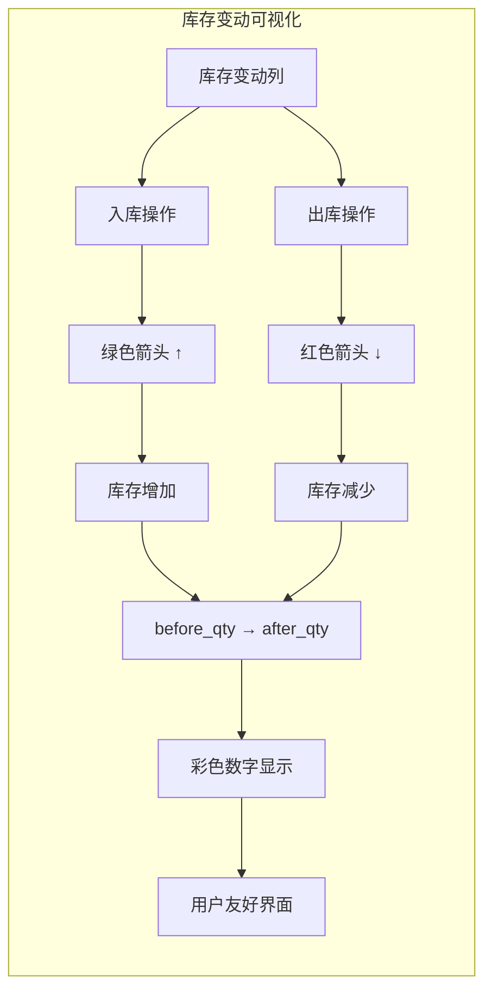

**图表来源**
- [StockIn.jsx:159-165](file://client/src/pages/admin/StockIn.jsx#L159-L165)
- [StockOut.jsx:174-180](file://client/src/pages/admin/StockOut.jsx#L174-L180)

#### 字段显示规则

1. **入库页面** (`StockIn.jsx`, `StockInList.jsx`)
   - 箭头符号: `↑` (向上箭头)
   - 颜色: `#47B881` (绿色)
   - 表示库存从`before_qty`增加到`after_qty`

2. **出库页面** (`StockOut.jsx`, `StockOutList.jsx`)
   - 箭头符号: `↓` (向下箭头)
   - 颜色: `#ff4d4f` (红色)
   - 表示库存从`before_qty`减少到`after_qty`

### 用户界面增强

#### 库存变动详情弹窗

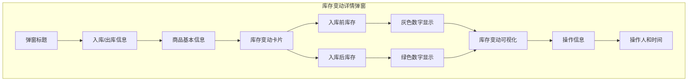

**图表来源**
- [StockIn.jsx:399-411](file://client/src/pages/admin/StockIn.jsx#L399-L411)
- [StockOut.jsx:402-414](file://client/src/pages/admin/StockOut.jsx#L402-L414)

#### 实时库存预览

1. **出库页面商品选择器** (`StockOut.jsx`, `StockOutList.jsx`)
   - 在商品选择器中显示库存预览
   - 格式: `商品名称 [库存:数量]`
   - 帮助用户在选择商品时了解当前库存状况

2. **库存变动列宽度** (140px)
   - 为库存变动信息预留足够空间
   - 确保箭头和数字能够清晰显示

### 后端支持机制

#### 库存变动数据计算

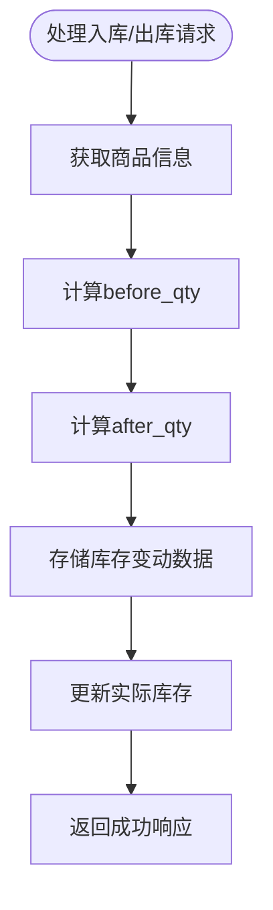

**图表来源**
- [stock-in.js:143-153](file://server/routes/stock-in.js#L143-L153)
- [stock-out.js:150-160](file://server/routes/stock-out.js#L150-L160)

#### 数据库字段设计

1. **stock_in表** (`before_qty`, `after_qty`)
   - 存储入库前后的库存数量
   - 用于库存变动追踪和可视化

2. **stock_out表** (`before_qty`, `after_qty`)
   - 存储出库前后的库存数量
   - 用于库存变动追踪和可视化

### 用户体验优化

#### 即时反馈机制

1. **库存变动预览**: 在操作过程中提供库存变动的预览
2. **颜色编码**: 使用颜色区分入库和出库操作
3. **箭头指示**: 使用箭头符号直观表示库存变化方向
4. **数字对比**: 同时显示操作前后的库存数量

#### 无障碍设计

1. **颜色对比度**: 确保绿色和红色箭头有足够的对比度
2. **文本替代**: 为图标提供文本描述
3. **键盘导航**: 支持键盘操作和焦点管理
4. **屏幕阅读器**: 为视觉障碍用户提供辅助

**章节来源**
- [StockIn.jsx:137-169](file://client/src/pages/admin/StockIn.jsx#L137-L169)
- [StockOut.jsx:152-184](file://client/src/pages/admin/StockOut.jsx#L152-L184)
- [StockInList.jsx:116-146](file://client/src/pages/user/StockInList.jsx#L116-L146)
- [StockOutList.jsx:132-163](file://client/src/pages/user/StockOutList.jsx#L132-L163)
- [stock-in.js:143-153](file://server/routes/stock-in.js#L143-L153)
- [stock-out.js:150-160](file://server/routes/stock-out.js#L150-L160)

## 自动实体创建功能

### 功能概述

系统新增的自动实体创建功能允许用户在入库和出库过程中直接输入新名称来创建公司、仓库、客户等实体。这一功能显著提升了用户体验，减少了系统维护成本。

### 核心实现机制

#### resolveEntity 函数

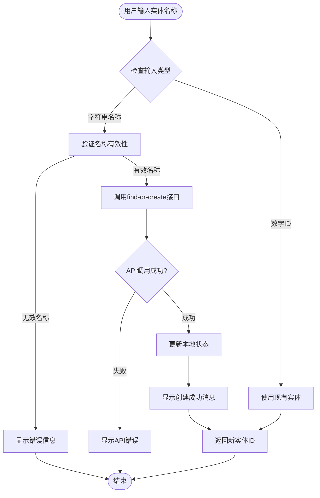

**图表来源**
- [StockIn.jsx:79-93](file://client/src/pages/admin/StockIn.jsx#L79-L93)
- [StockOut.jsx:96-111](file://client/src/pages/admin/StockOut.jsx#L96-L111)

#### 实体创建流程

1. **用户输入检测**: 系统检测用户输入是现有ID还是新名称
2. **类型判断**: 如果是数字ID，直接使用；如果是字符串，触发自动创建
3. **API调用**: 调用相应的find-or-create接口
4. **状态更新**: 成功后更新本地状态和下拉列表
5. **用户反馈**: 显示创建成功的提示信息

### 支持的实体类型

#### 入库流程中的实体

1. **公司 (Company)**
   - 通过 `/companies/find-or-create` 接口创建
   - 支持公司名称、统一社会信用代码、地址、联系人、电话等信息
   - 自动生成唯一ID并添加到公司列表

2. **仓库 (Warehouse)**
   - 通过 `/warehouses/find-or-create` 接口创建
   - 支持仓库名称、地址、备注等信息
   - 自动生成唯一ID并添加到仓库列表

#### 出库流程中的实体

1. **客户 (Client)**
   - 通过 `/clients/find-or-create` 接口创建
   - 支持客户名称、统一社会信用代码、地址、联系人、电话等信息
   - 自动生成唯一ID并添加到客户列表

### 用户界面设计

#### 下拉选择器增强

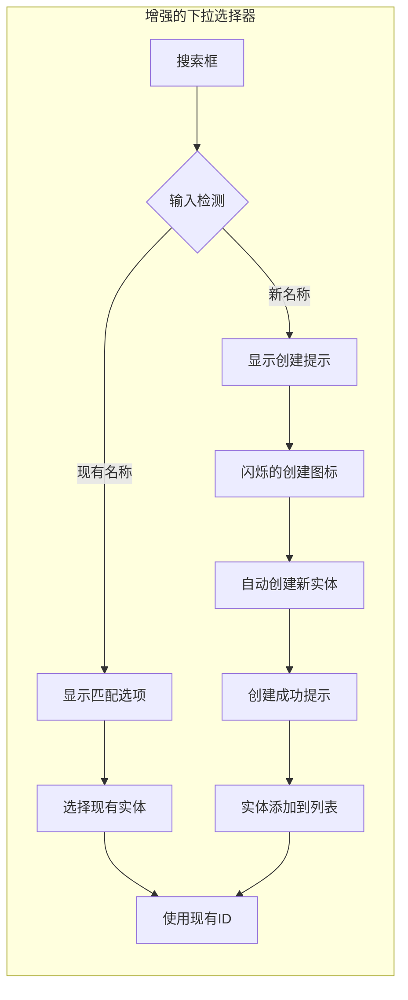

**图表来源**
- [StockIn.jsx:216-254](file://client/src/pages/admin/StockIn.jsx#L216-L254)
- [StockOut.jsx:234-251](file://client/src/pages/admin/StockOut.jsx#L234-L251)

#### 实时反馈机制

1. **输入检测**: 当用户在搜索框中输入时，系统实时检测是否为新名称
2. **创建提示**: 对于新名称，显示"将自动创建"的提示信息
3. **成功反馈**: 创建成功后显示绿色的成功消息
4. **状态同步**: 新创建的实体立即出现在所有相关下拉列表中

### 后端支持

#### find-or-create 接口

每个实体类型都支持find-or-create接口，其工作流程如下：

1. **名称查询**: 首先检查数据库中是否存在同名实体
2. **存在检查**: 如果存在，返回现有实体的ID和信息
3. **创建逻辑**: 如果不存在，创建新实体并返回新ID
4. **状态码**: 返回标准的状态码和消息

**章节来源**
- [StockIn.jsx:79-112](file://client/src/pages/admin/StockIn.jsx#L79-L112)
- [StockOut.jsx:96-127](file://client/src/pages/admin/StockOut.jsx#L96-L127)

## 依赖关系分析

### 前端依赖关系

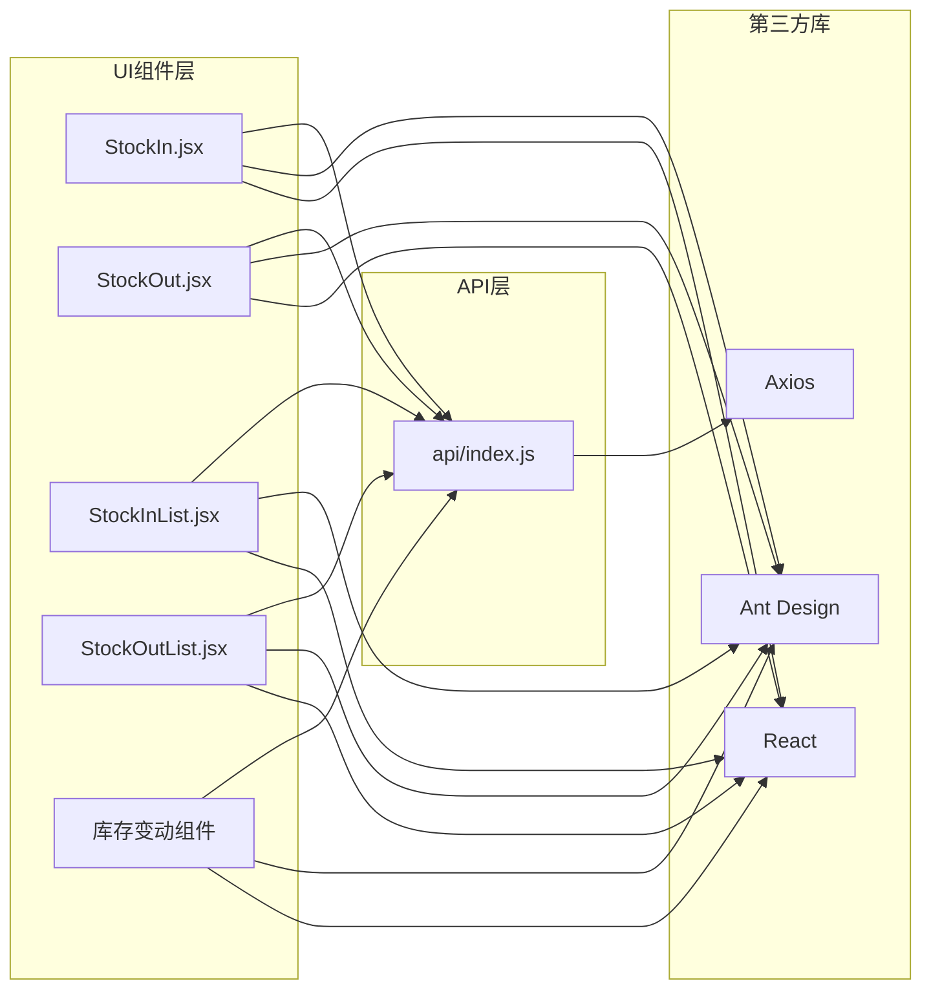

**图表来源**
- [StockIn.jsx:1-5](file://client/src/pages/admin/StockIn.jsx#L1-L5)
- [index.js:1-42](file://client/src/api/index.js#L1-L42)

### 后端依赖关系

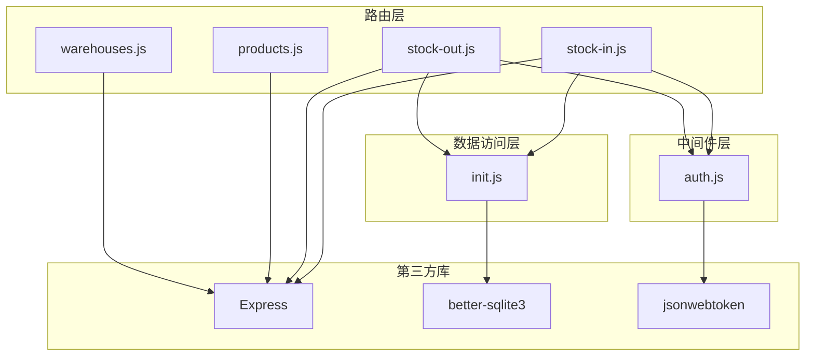

**图表来源**
- [stock-in.js:1-6](file://server/routes/stock-in.js#L1-L6)
- [auth.js:1-4](file://server/middleware/auth.js#L1-L4)
- [init.js:1-5](file://server/db/init.js#L1-L5)

**章节来源**
- [StockIn.jsx:1-5](file://client/src/pages/admin/StockIn.jsx#L1-L5)
- [StockOut.jsx:1-5](file://client/src/pages/admin/StockOut.jsx#L1-L5)
- [stock-in.js:1-6](file://server/routes/stock-in.js#L1-L6)
- [stock-out.js:1-6](file://server/routes/stock-out.js#L1-L6)
- [auth.js:1-29](file://server/middleware/auth.js#L1-L29)
- [init.js:1-217](file://server/db/init.js#L1-L217)

## 性能考虑

### 数据库性能优化

1. **WAL模式配置**
   - 使用Write-Ahead Logging模式提高并发性能
   - 支持读写操作的并行执行

2. **索引策略**
   - 在常用查询字段上建立适当的索引
   - 优化订单号、商品ID、仓库ID等高频查询

3. **事务处理**
   - 使用数据库事务确保数据一致性
   - 批量操作时减少事务提交次数

### 前端性能优化

1. **状态管理优化**
   - 合理使用React状态钩子避免不必要的重渲染
   - 使用useMemo和useCallback优化复杂计算

2. **API调用优化**
   - 实现请求去重和缓存机制
   - 使用Promise.all并行加载多个数据源

3. **虚拟滚动**
   - 对于大量数据的表格使用虚拟滚动
   - 减少DOM节点数量提升渲染性能

4. **自动创建优化**
   - 实时输入检测避免不必要的API调用
   - 本地状态同步减少重复查询

5. **库存变动渲染优化**
   - 使用条件渲染避免不必要的DOM更新
   - 优化颜色和样式计算
   - 实现防抖机制减少频繁更新

### 缓存策略

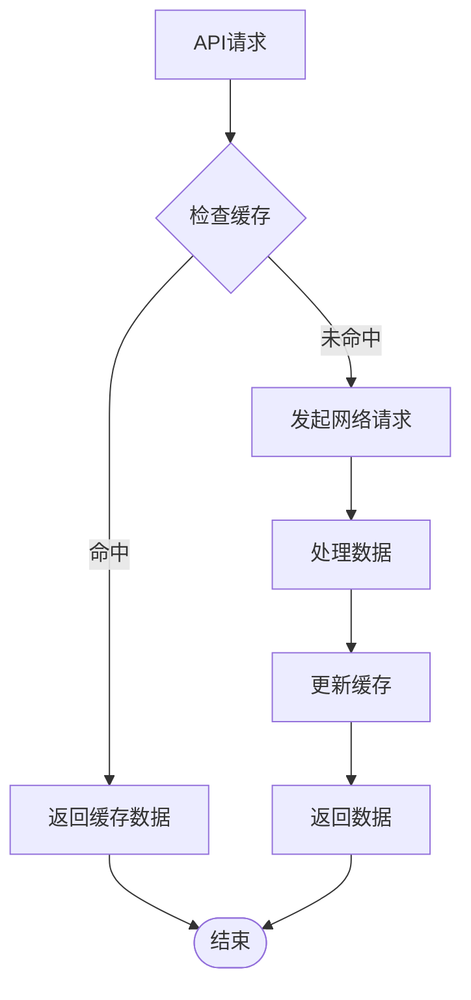

## 故障排除指南

### 常见问题及解决方案

#### 登录认证问题

**问题症状**: 用户无法登录或频繁掉线
**可能原因**:
- JWT令牌过期
- 令牌格式不正确
- 服务器时间不同步

**解决步骤**:
1. 检查浏览器本地存储中的token是否有效
2. 验证JWT_SECRET配置是否一致
3. 确认服务器时间设置正确

#### 数据库连接问题

**问题症状**: API请求超时或数据库操作失败
**可能原因**:
- 数据库文件损坏
- 文件权限问题
- 内存不足

**解决步骤**:
1. 检查accounting.db文件是否存在且可读写
2. 验证数据库文件权限设置
3. 查看系统内存使用情况

#### 库存计算错误

**问题症状**: 库存数量显示不正确
**可能原因**:
- 事务处理中断
- 并发操作冲突
- 数据迁移问题

**解决步骤**:
1. 检查事务日志确认完整性
2. 验证库存计算逻辑
3. 执行数据一致性检查

#### 库存变动显示异常

**问题症状**: 库存变动列显示不正确或空白
**可能原因**:
- 后端未正确计算库存变动数据
- 前端数据格式不匹配
- 数据库字段缺失

**解决步骤**:
1. 检查stock_in和stock_out表的before_qty和after_qty字段
2. 验证后端API响应数据格式
3. 确认前端渲染逻辑正确性
4. 查看浏览器开发者工具中的网络请求

#### 自动实体创建问题

**问题症状**: 输入新名称无法创建实体
**可能原因**:
- 网络请求失败
- 服务器端验证失败
- 数据库插入异常

**解决步骤**:
1. 检查网络连接状态
2. 查看浏览器开发者工具中的API响应
3. 验证服务器端日志
4. 确认数据库表结构和权限

**章节来源**
- [auth.js:5-19](file://server/middleware/auth.js#L5-L19)
- [init.js:9-16](file://server/db/init.js#L9-L16)
- [stock-in.js:133-170](file://server/routes/stock-in.js#L133-L170)
- [stock-out.js:133-175](file://server/routes/stock-out.js#L133-L175)

## 结论

库存管理系统是一个功能完整、架构清晰的企业级应用。系统通过合理的前后端分离设计，实现了高效的库存管理业务流程。

### 主要优势

1. **完整的业务覆盖**: 涵盖了从入库到出库的完整业务流程
2. **实时库存追踪**: 通过流水记录实现精确的库存变化追踪
3. **多角色权限管理**: 支持管理员和普通用户的差异化操作
4. **数据安全保障**: 采用JWT认证和数据库事务确保数据安全
5. **良好的扩展性**: 模块化设计便于后续功能扩展
6. **智能实体管理**: 新增的自动实体创建功能显著提升用户体验
7. **直观的库存可视化**: 新增的库存变动跟踪功能提供清晰的库存变化展示

### 技术亮点

1. **现代化技术栈**: React + Express + SQLite组合提供优秀的开发体验
2. **响应式设计**: 基于Ant Design的UI组件库提供良好的用户体验
3. **性能优化**: 采用多种性能优化策略确保系统高效运行
4. **错误处理**: 完善的错误处理机制提升系统稳定性
5. **智能交互**: 自动实体创建功能提供流畅的用户体验
6. **数据可视化**: 库存变动跟踪功能提供直观的数据展示

### 改进建议

1. **增加库存预警功能**: 实现最低库存提醒机制
2. **增强报表功能**: 提供更丰富的库存统计和分析报表
3. **移动端适配**: 优化移动端用户体验
4. **日志审计**: 增强操作日志和审计功能
5. **备份恢复**: 实现自动备份和数据恢复机制
6. **批量实体管理**: 考虑添加批量导入导出功能
7. **库存变动历史**: 提供库存变动历史查询功能

该系统为企业的库存管理提供了可靠的技术解决方案，具有良好的实用价值和推广前景。新增的库存变动跟踪功能和自动实体创建功能进一步提升了系统的易用性和实用性，是系统发展过程中的重要里程碑。