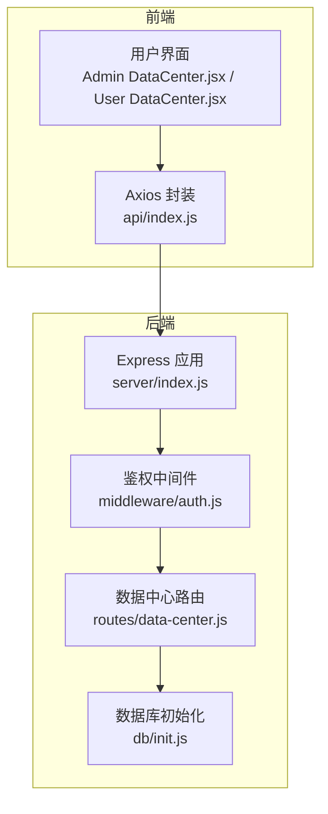
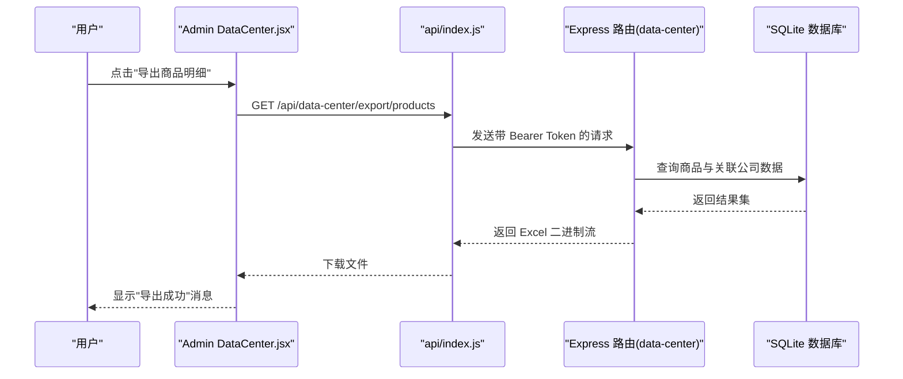
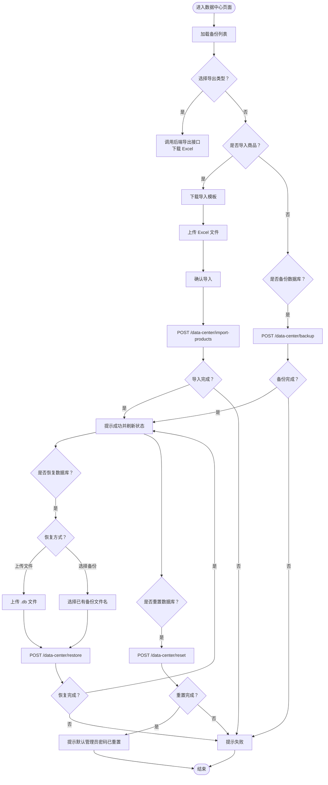
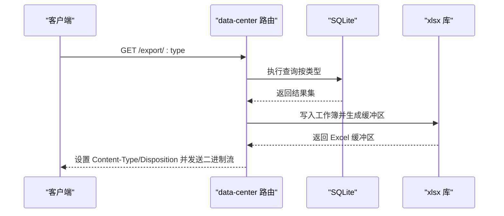
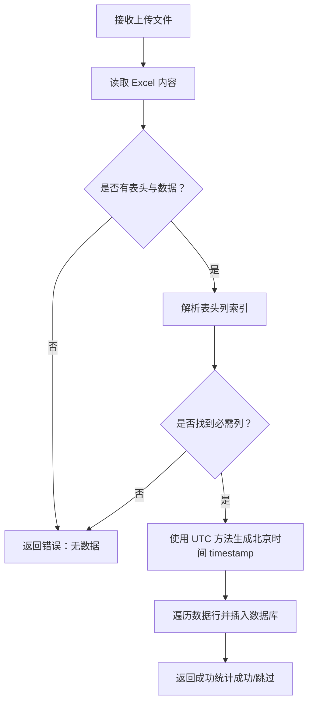
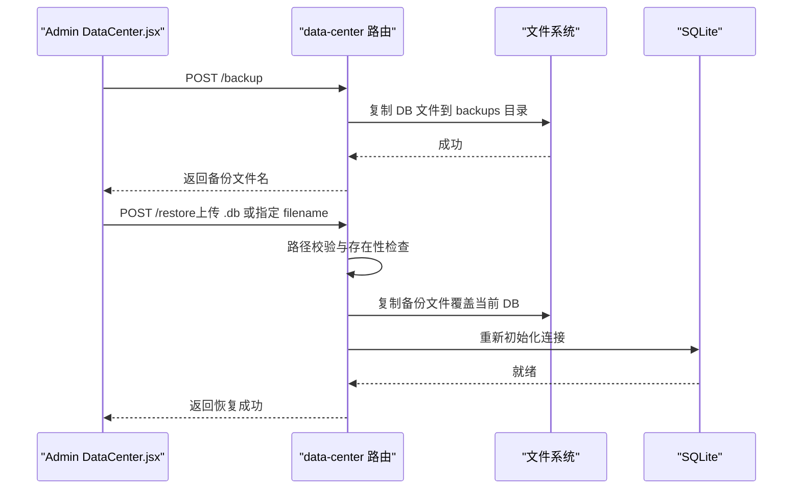
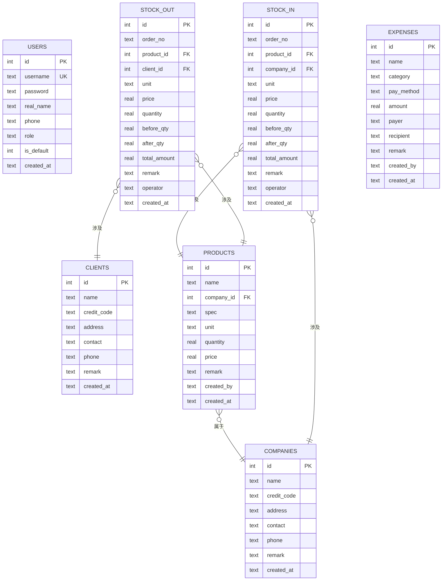
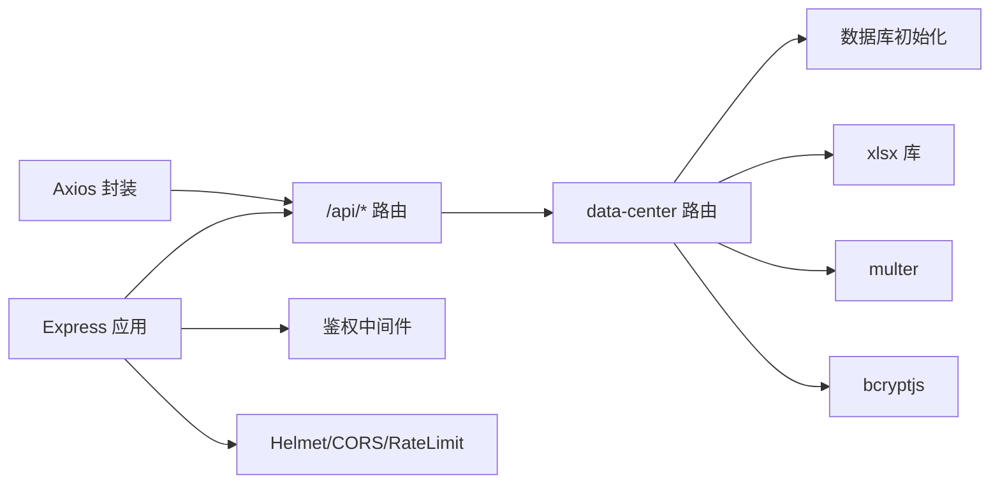

# 数据中心

<cite>
**本文引用的文件**
- [client/src/pages/admin/DataCenter.jsx](file://client/src/pages/admin/DataCenter.jsx)
- [client/src/pages/user/DataCenter.jsx](file://client/src/pages/user/DataCenter.jsx)
- [client/src/api/index.js](file://client/src/api/index.js)
- [server/routes/data-center.js](file://server/routes/data-center.js)
- [server/db/init.js](file://server/db/init.js)
- [server/middleware/auth.js](file://server/middleware/auth.js)
- [server/index.js](file://server/index.js)
- [package.json](file://package.json)
- [client/package.json](file://client/package.json)
- [server/package.json](file://server/package.json)
</cite>

## 更新摘要
**变更内容**
- 更新导入功能的时间处理机制，改进了时间戳生成的一致性和准确性
- 新增UTC方法确保导入数据的时间显示与系统时间保持一致
- 优化了导入模板中的时间处理逻辑，确保生成的timestamp符合北京时间格式

## 目录
1. [简介](#简介)
2. [项目结构](#项目结构)
3. [核心组件](#核心组件)
4. [架构总览](#架构总览)
5. [详细组件分析](#详细组件分析)
6. [依赖关系分析](#依赖关系分析)
7. [性能考虑](#性能考虑)
8. [故障排查指南](#故障排查指南)
9. [结论](#结论)
10. [附录](#附录)

## 简介
本文件面向"数据中心"模块，系统性阐述数据备份、恢复与重置等核心数据管理能力，覆盖前端界面交互、后端接口处理、数据导出格式、备份策略、数据完整性校验、安全防护与灾难恢复方案，并给出性能优化与运维最佳实践。

## 项目结构
- 前端采用 React + Ant Design，数据中心页面分为管理员版与普通用户版，分别提供导出、导入模板下载、导入、备份、恢复、重置等能力。
- 后端基于 Express，使用 better-sqlite3 作为本地嵌入式数据库，提供统一的中间件鉴权与管理员权限控制，数据中心相关接口集中在 data-center 路由中。
- 安全方面采用 Helmet、CORS 白名单、速率限制、JWT 校验与仅允许 Bearer 头传递 Token 的策略，防止常见 Web 攻击与信息泄露。

**图表来源**
- [server/index.js:68-95](file://server/index.js#L68-L95)
- [server/middleware/auth.js:1-29](file://server/middleware/auth.js#L1-L29)
- [server/routes/data-center.js:1-260](file://server/routes/data-center.js#L1-L260)
- [server/db/init.js:1-217](file://server/db/init.js#L1-L217)
- [client/src/api/index.js:1-42](file://client/src/api/index.js#L1-L42)
- [client/src/pages/admin/DataCenter.jsx:1-197](file://client/src/pages/admin/DataCenter.jsx#L1-L197)
- [client/src/pages/user/DataCenter.jsx:1-53](file://client/src/pages/user/DataCenter.jsx#L1-L53)

**章节来源**
- [server/index.js:1-120](file://server/index.js#L1-L120)
- [client/src/pages/admin/DataCenter.jsx:1-197](file://client/src/pages/admin/DataCenter.jsx#L1-L197)
- [client/src/pages/user/DataCenter.jsx:1-53](file://client/src/pages/user/DataCenter.jsx#L1-L53)
- [client/src/api/index.js:1-42](file://client/src/api/index.js#L1-L42)
- [server/routes/data-center.js:1-260](file://server/routes/data-center.js#L1-L260)
- [server/db/init.js:1-217](file://server/db/init.js#L1-L217)
- [server/middleware/auth.js:1-29](file://server/middleware/auth.js#L1-L29)

## 核心组件
- 前端数据中心页面（管理员）
  - 提供导出商品、入库、出库、开销明细为 Excel 的能力。
  - 提供商品导入模板下载与 Excel 导入（管理员）。
  - 提供数据库备份、恢复（支持上传备份文件或选择已有备份）、重置数据库（保留默认管理员）。
- 前端数据中心页面（普通用户）
  - 仅提供导出 Excel 的能力。
- 后端数据中心路由
  - 导出接口：按类型生成 Excel 并返回二进制流。
  - 导入模板与导入：校验表头、批量插入商品数据。
  - 备份：复制当前数据库文件到 backups 目录。
  - 恢复：支持上传恢复或通过备份文件名恢复；内置路径穿越防护与存在性校验。
  - 重置：清空业务表并重置默认管理员密码。
- 中间件与安全
  - JWT 鉴权：仅从 Authorization 头解析 Bearer Token。
  - 管理员权限：仅管理员可执行备份、恢复、重置、导入等敏感操作。
  - CORS 白名单：允许本地与特定域名访问。
  - 速率限制：登录与全局 API 限流。
- 数据库初始化
  - 创建核心业务表与迁移逻辑，插入默认管理员与系统名称配置。

**章节来源**
- [client/src/pages/admin/DataCenter.jsx:10-197](file://client/src/pages/admin/DataCenter.jsx#L10-L197)
- [client/src/pages/user/DataCenter.jsx:5-53](file://client/src/pages/user/DataCenter.jsx#L5-L53)
- [server/routes/data-center.js:28-257](file://server/routes/data-center.js#L28-L257)
- [server/middleware/auth.js:1-29](file://server/middleware/auth.js#L1-L29)
- [server/db/init.js:18-214](file://server/db/init.js#L18-L214)

## 架构总览
数据中心模块遵循"前端页面 + Axios 封装 + 后端路由 + 数据库"的分层设计。前端负责用户交互与提示，Axios 统一注入认证头；后端路由负责业务编排与数据持久化，数据库采用 SQLite 文件存储，便于备份与恢复。

**图表来源**
- [client/src/pages/admin/DataCenter.jsx:20-39](file://client/src/pages/admin/DataCenter.jsx#L20-L39)
- [client/src/api/index.js:9-15](file://client/src/api/index.js#L9-L15)
- [server/routes/data-center.js:29-93](file://server/routes/data-center.js#L29-L93)

## 详细组件分析

### 前端组件：数据中心页面（管理员）
- 功能要点
  - 导出：调用后端导出接口，自动下载 Excel 文件。
  - 导入模板：下载商品导入模板，指导用户填写。
  - 导入：选择 Excel 文件，确认后上传，后端解析并批量插入商品数据。
  - 备份：触发备份，后端复制当前数据库文件至 backups 目录。
  - 恢复：支持上传 .db 文件或选择已有备份文件名恢复；恢复后刷新备份列表。
  - 重置：删除非默认管理员，清空业务表并重置默认管理员密码。
- 错误处理
  - 对导出/导入/恢复失败进行统一提示；恢复后刷新备份列表。

**图表来源**
- [client/src/pages/admin/DataCenter.jsx:15-57](file://client/src/pages/admin/DataCenter.jsx#L15-L57)
- [client/src/pages/admin/DataCenter.jsx:148-193](file://client/src/pages/admin/DataCenter.jsx#L148-L193)

**章节来源**
- [client/src/pages/admin/DataCenter.jsx:10-197](file://client/src/pages/admin/DataCenter.jsx#L10-L197)

### 前端组件：数据中心页面（普通用户）
- 功能要点
  - 仅提供导出 Excel 的能力，不暴露导入、备份、恢复、重置等敏感操作。
- 错误处理
  - 导出失败时提示"权限不足"等信息。

**章节来源**
- [client/src/pages/user/DataCenter.jsx:5-53](file://client/src/pages/user/DataCenter.jsx#L5-L53)

### 后端接口：数据导出（Excel）
- 接口规范
  - 方法与路径：GET /api/data-center/export/:type
  - 认证：需要登录（鉴权中间件）
  - 权限：管理员
  - 参数：type ∈ {products, stock-in, stock-out, expenses}
  - 响应：application/vnd.openxmlformats-officedocument.spreadsheetml.sheet（Excel）
- 实现要点
  - 根据 type 查询对应表数据并拼装为二维数组。
  - 使用 xlsx 库写入工作簿并返回缓冲区。
  - 设置 Content-Disposition 以触发下载。

**图表来源**
- [server/routes/data-center.js:29-93](file://server/routes/data-center.js#L29-L93)

**章节来源**
- [server/routes/data-center.js:29-93](file://server/routes/data-center.js#L29-L93)

### 后端接口：导入模板与导入
- 导入模板
  - 方法与路径：GET /api/data-center/import-template/products
  - 响应：Excel 模板文件（含示例数据）
- 商品导入
  - 方法与路径：POST /api/data-center/import-products
  - 认证与权限：登录 + 管理员
  - 上传限制：multer 配置，限制文件大小与类型
  - 解析流程：读取 Excel 第一个 sheet，校验表头列是否存在，逐行解析并批量插入
  - 时间处理改进：使用 UTC 方法生成北京时间格式的 timestamp，确保时间显示一致性
  - 错误处理：文件缺失、表头不匹配、解析异常均返回相应错误码

**更新** 导入功能现在使用改进的时间处理机制，通过 UTC 方法生成北京时间格式的 timestamp，确保导入数据的时间戳与系统时间保持一致性和准确性。

**图表来源**
- [server/routes/data-center.js:113-171](file://server/routes/data-center.js#L113-L171)

**章节来源**
- [server/routes/data-center.js:95-110](file://server/routes/data-center.js#L95-L110)
- [server/routes/data-center.js:113-171](file://server/routes/data-center.js#L113-L171)

### 后端接口：备份、恢复、重置
- 备份
  - 方法与路径：POST /api/data-center/backup
  - 权限：管理员
  - 行为：将当前数据库文件复制到 backups 目录，文件名包含时间戳
- 恢复
  - 方法与路径：POST /api/data-center/restore
  - 权限：管理员
  - 两种方式：
    - 上传 .db 文件：直接覆盖当前数据库
    - 通过查询参数指定备份文件名：内置路径穿越防护与存在性校验
  - 行为：覆盖后重新初始化数据库连接
- 重置
  - 方法与路径：POST /api/data-center/reset
  - 权限：管理员
  - 行为：清空业务表，删除非默认管理员，重置默认管理员密码

**图表来源**
- [server/routes/data-center.js:173-235](file://server/routes/data-center.js#L173-L235)
- [client/src/pages/admin/DataCenter.jsx:41-57](file://client/src/pages/admin/DataCenter.jsx#L41-L57)

**章节来源**
- [server/routes/data-center.js:173-257](file://server/routes/data-center.js#L173-L257)
- [client/src/pages/admin/DataCenter.jsx:41-57](file://client/src/pages/admin/DataCenter.jsx#L41-L57)

### 安全与鉴权机制
- JWT 鉴权
  - 仅从 Authorization 头解析 Bearer Token，避免通过 URL 泄露
  - 失效或伪造时返回 401
- 管理员权限
  - 仅管理员可执行备份、恢复、重置、导入等敏感操作
- CORS 与速率限制
  - CORS 白名单允许本地与特定域名访问
  - 登录与全局 API 速率限制，降低暴力破解与滥用风险
- 上传安全
  - 限制文件大小与类型，仅允许 .xlsx、.xls、.db
  - 导入时严格校验表头列，避免脏数据进入数据库

**章节来源**
- [server/middleware/auth.js:1-29](file://server/middleware/auth.js#L1-L29)
- [server/index.js:17-63](file://server/index.js#L17-L63)
- [server/routes/data-center.js:13-26](file://server/routes/data-center.js#L13-L26)
- [server/routes/data-center.js:113-171](file://server/routes/data-center.js#L113-L171)

### 数据库设计与初始化
- 表结构概览
  - 用户、系统设置、库房、商品公司、客户单位、商品、入库明细、出库明细、日常开销等
  - 外键约束启用，WAL 模式提升并发读写性能
- 初始化与迁移
  - 首次运行自动建表与插入默认管理员与系统名称
  - 对旧版本数据库进行字段迁移（如入库/出库新增字段）

**图表来源**
- [server/db/init.js:21-186](file://server/db/init.js#L21-L186)

**章节来源**
- [server/db/init.js:18-214](file://server/db/init.js#L18-L214)

## 依赖关系分析
- 前端
  - React + Ant Design 提供 UI 组件与交互；Axios 统一请求封装，自动注入 Authorization 头
  - xlsx 用于导出与导入模板生成
- 后端
  - Express 提供路由与中间件；better-sqlite3 作为本地数据库引擎
  - xlsx 用于 Excel 读写；multer 用于文件上传；bcryptjs 用于密码哈希；helmet/cors/express-rate-limit 提升安全性与稳定性
- 关系图

**图表来源**
- [client/src/api/index.js:1-42](file://client/src/api/index.js#L1-L42)
- [server/index.js:68-95](file://server/index.js#L68-L95)
- [server/middleware/auth.js:1-29](file://server/middleware/auth.js#L1-L29)
- [server/routes/data-center.js:1-260](file://server/routes/data-center.js#L1-L260)
- [server/db/init.js:1-217](file://server/db/init.js#L1-L217)

**章节来源**
- [client/src/api/index.js:1-42](file://client/src/api/index.js#L1-L42)
- [server/index.js:68-95](file://server/index.js#L68-L95)
- [server/routes/data-center.js:1-260](file://server/routes/data-center.js#L1-L260)
- [server/db/init.js:1-217](file://server/db/init.js#L1-L217)

## 性能考虑
- 数据库模式
  - WAL 模式提升并发读写吞吐；外键约束保证一致性但会带来一定写入成本
- 导出性能
  - 导出为 Excel 时建议控制单次导出范围，避免一次性导出大量数据导致内存压力
- 上传与导入
  - 限制文件大小与类型，避免大体积文件占用磁盘与内存
  - 导入采用事务批量插入，减少多次往返
- 网络与缓存
  - 前端导出/导入使用浏览器原生下载/上传，减少不必要的中间层
- 速率限制
  - 登录与全局 API 限流，避免突发流量冲击

## 故障排查指南
- 导出失败
  - 检查是否登录且拥有管理员权限；确认后端导出接口可用
- 导入失败
  - 确认 Excel 表头包含必需列；检查文件格式与大小限制
- 备份/恢复失败
  - 确认 backups 目录存在且有写权限；恢复时检查备份文件名是否合法且存在于备份目录
- 重置失败
  - 确认当前用户为管理员；重置会删除非默认管理员并清空业务表
- 权限不足
  - 普通用户无法看到导入、备份、恢复、重置入口；升级为管理员后重试

**章节来源**
- [server/routes/data-center.js:173-257](file://server/routes/data-center.js#L173-L257)
- [client/src/pages/admin/DataCenter.jsx:10-197](file://client/src/pages/admin/DataCenter.jsx#L10-L197)
- [client/src/pages/user/DataCenter.jsx:5-53](file://client/src/pages/user/DataCenter.jsx#L5-L53)

## 结论
数据中心模块提供了完整的数据生命周期管理能力：从导出、导入模板、导入，到备份、恢复与重置。前端通过直观的按钮与对话框简化操作，后端通过严格的权限控制与安全中间件保障系统稳定与安全。结合 WAL 模式与合理的速率限制，系统在易用性与可靠性之间取得平衡。建议在生产环境中配合定期备份与异地存放策略，完善灾难恢复预案。

## 附录
- 技术栈
  - 前端：React + Ant Design + Axios + xlsx
  - 后端：Express + better-sqlite3 + xlsx + multer + bcryptjs + helmet + cors + express-rate-limit
- 运行与构建
  - 服务端 Node 版本要求 ≥ 18
  - 构建脚本：先构建前端，再安装后端依赖并启动

**章节来源**
- [package.json:1-13](file://package.json#L1-L13)
- [client/package.json:1-27](file://client/package.json#L1-L27)
- [server/package.json:1-26](file://server/package.json#L1-L26)