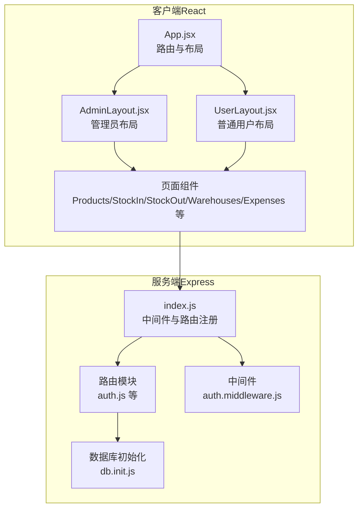
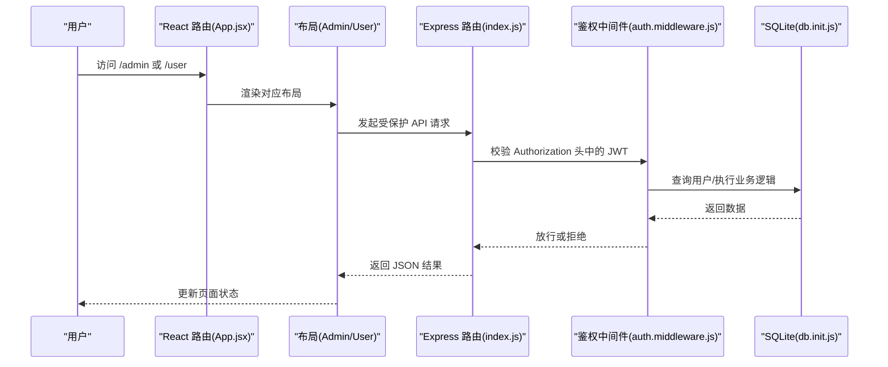
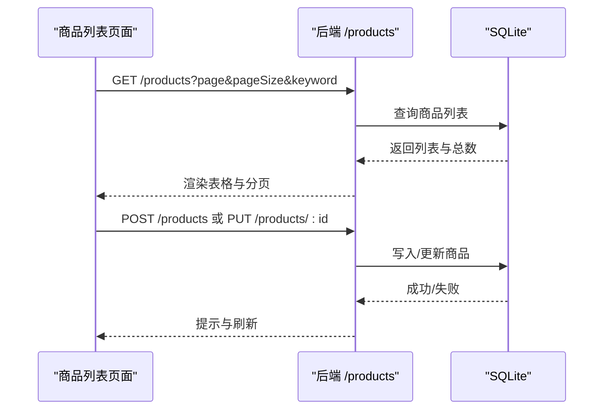
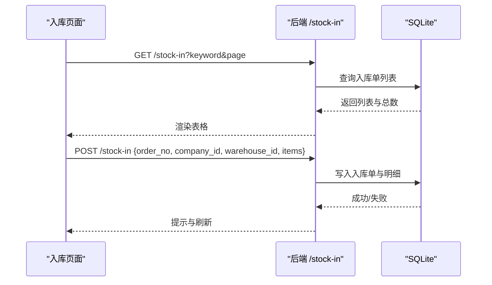
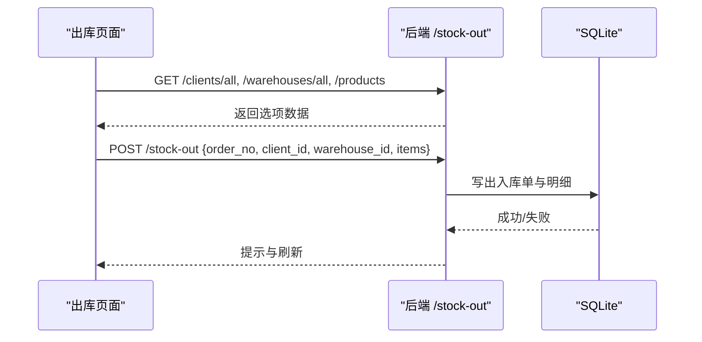
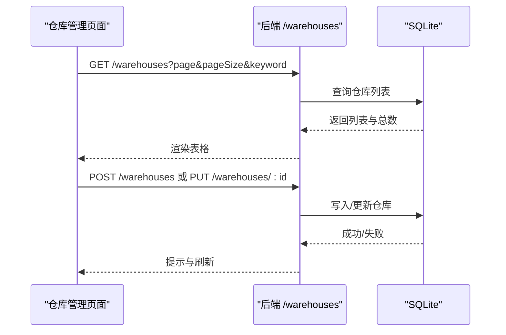
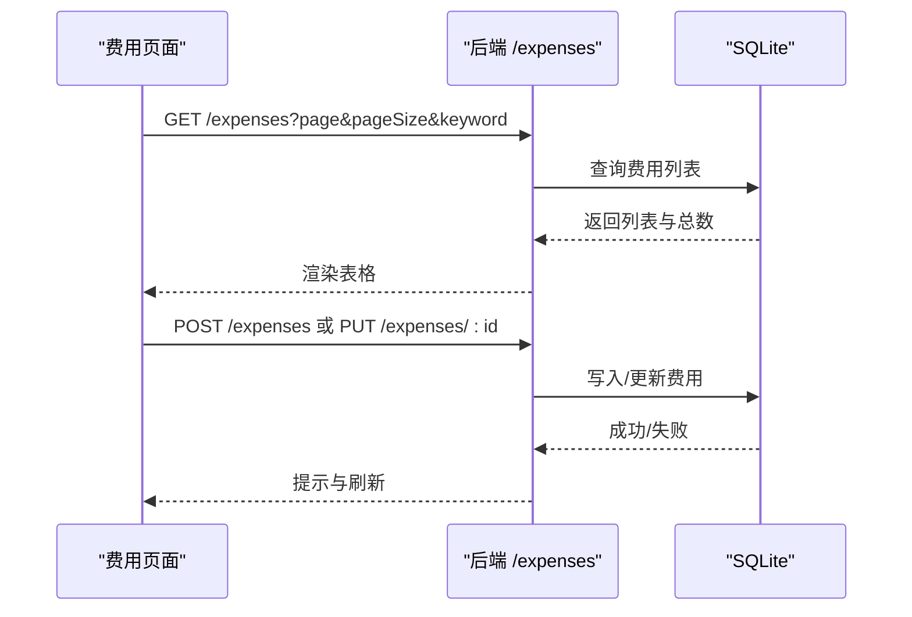
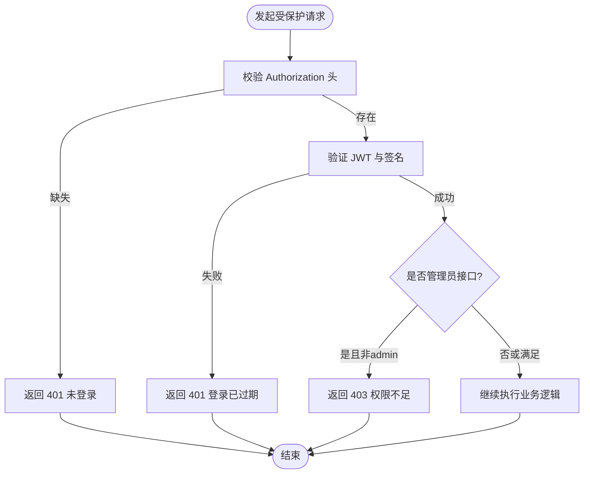
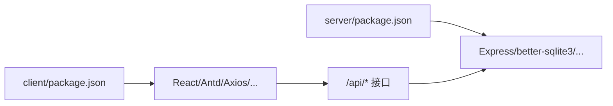
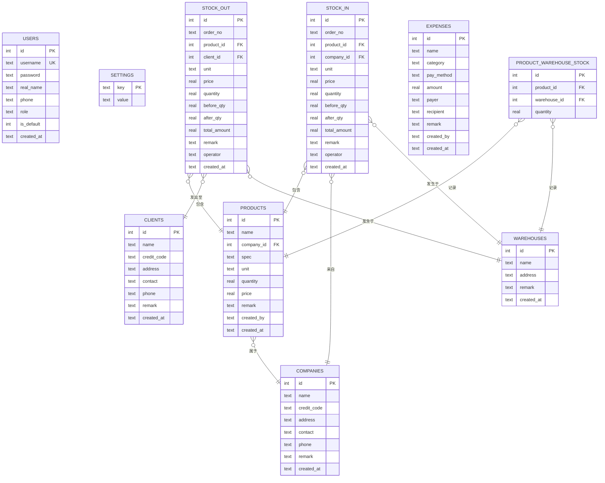

# 核心功能模块

<cite>
**本文引用的文件**
- [App.jsx](file://client/src/App.jsx)
- [main.jsx](file://client/src/main.jsx)
- [AdminLayout.jsx](file://client/src/layouts/AdminLayout.jsx)
- [UserLayout.jsx](file://client/src/layouts/UserLayout.jsx)
- [auth.js](file://server/routes/auth.js)
- [auth.middleware.js](file://server/middleware/auth.js)
- [db.init.js](file://server/db/init.js)
- [Products.jsx](file://client/src/pages/admin/Products.jsx)
- [StockIn.jsx](file://client/src/pages/admin/StockIn.jsx)
- [StockOut.jsx](file://client/src/pages/admin/StockOut.jsx)
- [Warehouses.jsx](file://client/src/pages/admin/Warehouses.jsx)
- [Expenses.jsx](file://client/src/pages/admin/Expenses.jsx)
- [index.js](file://server/index.js)
- [package.json](file://client/package.json)
- [package.json](file://server/package.json)
</cite>

## 目录
1. [引言](#引言)
2. [项目结构](#项目结构)
3. [核心组件](#核心组件)
4. [架构总览](#架构总览)
5. [详细组件分析](#详细组件分析)
6. [依赖分析](#依赖分析)
7. [性能考虑](#性能考虑)
8. [故障排查指南](#故障排查指南)
9. [结论](#结论)
10. [附录](#附录)

## 引言
本文件面向 SY-Q 系统的核心功能模块，围绕商品管理、库存管理（入库/出库）、用户与权限管理、客户管理、公司管理、费用管理、仓库管理、数据中心等主题，系统性梳理前端页面、后端路由与中间件、数据库模型之间的关系与交互流程。文档同时说明管理员与普通用户的权限差异、模块间的数据关联、最佳实践与常见问题处理方法，帮助开发者与运营人员快速理解与使用系统。

## 项目结构
系统采用前后端分离架构：
- 前端基于 React + Ant Design，通过 React Router 管理路由与布局，使用 Axios 发起 API 请求。
- 后端基于 Express，集成安全中间件（CORS、Helmet、限流），统一注册各模块路由，使用 better-sqlite3 作为本地数据库。
- 数据库初始化脚本负责创建核心表与默认数据，支持多模块数据模型演进。

图表来源
- [App.jsx:1-67](file://client/src/App.jsx#L1-L67)
- [AdminLayout.jsx:1-174](file://client/src/layouts/AdminLayout.jsx#L1-L174)
- [UserLayout.jsx:1-162](file://client/src/layouts/UserLayout.jsx#L1-L162)
- [index.js:1-120](file://server/index.js#L1-L120)
- [auth.middleware.js:1-29](file://server/middleware/auth.js#L1-L29)
- [db.init.js:1-217](file://server/db/init.js#L1-L217)

章节来源
- [App.jsx:1-67](file://client/src/App.jsx#L1-L67)
- [index.js:1-120](file://server/index.js#L1-L120)
- [package.json:1-27](file://client/package.json#L1-L27)
- [package.json:1-26](file://server/package.json#L1-L26)

## 核心组件
- 路由与布局
  - App.jsx 统一注册登录页与管理员/用户两条主路由，配合私有路由守卫确保登录态。
  - AdminLayout.jsx 与 UserLayout.jsx 提供侧边导航、移动端抽屉、标题与系统设置读取。
- 权限与认证
  - auth.js 提供登录、改密、当前用户信息接口；auth.middleware.js 实现 JWT 校验与管理员校验。
- 数据模型与初始化
  - db.init.js 定义用户、设置、仓库、商品、出入库、费用等表结构及默认数据。

章节来源
- [App.jsx:26-64](file://client/src/App.jsx#L26-L64)
- [AdminLayout.jsx:16-55](file://client/src/layouts/AdminLayout.jsx#L16-L55)
- [UserLayout.jsx:16-53](file://client/src/layouts/UserLayout.jsx#L16-L53)
- [auth.js:1-69](file://server/routes/auth.js#L1-L69)
- [auth.middleware.js:1-29](file://server/middleware/auth.js#L1-L29)
- [db.init.js:18-214](file://server/db/init.js#L18-L214)

## 架构总览
系统采用“前端 SPA + 后端 REST API”的典型架构。前端通过 Axios 调用后端 /api/* 接口，后端通过中间件进行鉴权与限流，数据库为本地 SQLite（better-sqlite3）。管理员与普通用户分别进入不同布局与可见菜单，权限通过 JWT 与角色字段控制。

图表来源
- [App.jsx:32-64](file://client/src/App.jsx#L32-L64)
- [AdminLayout.jsx:16-55](file://client/src/layouts/AdminLayout.jsx#L16-L55)
- [UserLayout.jsx:16-53](file://client/src/layouts/UserLayout.jsx#L16-L53)
- [index.js:68-95](file://server/index.js#L68-L95)
- [auth.middleware.js:5-19](file://server/middleware/auth.js#L5-L19)
- [db.init.js:9-16](file://server/db/init.js#L9-L16)

## 详细组件分析

### 商品管理（Products）
- 功能概述
  - 列表分页查询、新增/编辑/删除商品，查看商品详情与各库房库存分布。
- 前端流程
  - 使用分页参数加载数据；表单校验后调用新增/更新接口；详情弹窗展示基础信息、当前库存、记录信息与库房分布。
- 后端接口
  - GET /products：分页查询商品列表（包含关键字搜索）。
  - POST /products：新增商品。
  - PUT /products/:id：更新商品。
  - DELETE /products/:id：删除商品。
  - GET /warehouses/stock/:productId：按商品聚合库房库存。
- 数据模型关联
  - 商品表与公司表存在外键关联；商品详情中包含“记录人”“记录时间”等字段，体现创建者信息。
- 最佳实践
  - 新增商品时建议同步维护初始库存与单价；批量导入可通过扩展接口实现。
  - 库房分布展示可用于盘点与库存可视化。

图表来源
- [Products.jsx:20-38](file://client/src/pages/admin/Products.jsx#L20-L38)
- [Products.jsx:48-61](file://client/src/pages/admin/Products.jsx#L48-L61)
- [Products.jsx:40-46](file://client/src/pages/admin/Products.jsx#L40-L46)
- [db.init.js:95-110](file://server/db/init.js#L95-L110)

章节来源
- [Products.jsx:1-134](file://client/src/pages/admin/Products.jsx#L1-L134)
- [db.init.js:95-110](file://server/db/init.js#L95-L110)

### 库存管理（入库 StockIn）
- 功能概述
  - 新建入库单：选择公司、库房、商品明细（单价、数量、小计、备注），提交后生成入库记录与库存变动。
  - 查看入库单列表与订单详情，支持打印预览。
- 前端流程
  - 打开模态框时并行拉取商品、公司、库房与单号；动态计算小计与合计；提交后刷新列表。
  - 详情弹窗展示订单汇总与打印模板。
- 后端接口
  - GET /stock-in：分页查询入库单。
  - GET /stock-in/order/:orderNo：查询入库单明细。
  - GET /stock-in/generate-order-no：生成入库单号。
  - POST /stock-in：提交入库单。
  - GET /warehouses/stock/:productId：按商品聚合库房库存。
- 数据模型关联
  - 入库明细表与商品、公司、库房存在外键关联；记录包含“入库前/后数量”“操作员”“创建时间”等。
- 最佳实践
  - 入库前建议核对单价与数量；打印模板可直接用于归档。

图表来源
- [StockIn.jsx:37-42](file://client/src/pages/admin/StockIn.jsx#L37-L42)
- [StockIn.jsx:78-91](file://client/src/pages/admin/StockIn.jsx#L78-L91)
- [StockIn.jsx:93-100](file://client/src/pages/admin/StockIn.jsx#L93-L100)
- [db.init.js:112-131](file://server/db/init.js#L112-L131)

章节来源
- [StockIn.jsx:1-369](file://client/src/pages/admin/StockIn.jsx#L1-L369)
- [db.init.js:112-131](file://server/db/init.js#L112-L131)

### 库存管理（出库 StockOut）
- 功能概述
  - 新建出库单：选择客户、库房、商品明细，提交后生成出库记录与库存变动。
  - 查看出库单列表与订单详情，支持打印预览。
- 前端流程
  - 选择库房后异步加载该库房下各商品的可用库存，辅助输入数量。
  - 提交时校验必填项与明细有效性。
- 后端接口
  - GET /stock-out：分页查询出库单。
  - GET /stock-out/order/:orderNo：查询出库单明细。
  - GET /stock-out/generate-order-no：生成出库单号。
  - POST /stock-out：提交出库单。
- 数据模型关联
  - 出库明细表与商品、客户、库房存在外键关联；记录包含“出库前/后数量”“操作员”“创建时间”等。
- 最佳实践
  - 出库前应检查库房库存，避免超卖；打印模板便于交接与审计。

图表来源
- [StockOut.jsx:45-62](file://client/src/pages/admin/StockOut.jsx#L45-L62)
- [StockOut.jsx:96-109](file://client/src/pages/admin/StockOut.jsx#L96-L109)
- [StockOut.jsx:111-118](file://client/src/pages/admin/StockOut.jsx#L111-L118)
- [db.init.js:142-161](file://server/db/init.js#L142-L161)

章节来源
- [StockOut.jsx:1-390](file://client/src/pages/admin/StockOut.jsx#L1-L390)
- [db.init.js:142-161](file://server/db/init.js#L142-L161)

### 仓库管理（Warehouses）
- 功能概述
  - 列表分页查询、新增/编辑/删除仓库，支持按名称/地址搜索。
- 前端流程
  - 表单校验后调用新增/更新接口；删除前二次确认。
- 后端接口
  - GET /warehouses：分页查询仓库列表。
  - POST /warehouses：新增仓库。
  - PUT /warehouses/:id：更新仓库。
  - DELETE /warehouses/:id：删除仓库。
- 数据模型关联
  - 仓库与出入库明细存在外键关联，用于记录出入库发生的具体库房。
- 最佳实践
  - 仓库命名应清晰唯一；删除前需确认无库存占用。

图表来源
- [Warehouses.jsx:18-36](file://client/src/pages/admin/Warehouses.jsx#L18-L36)
- [Warehouses.jsx:38-51](file://client/src/pages/admin/Warehouses.jsx#L38-L51)
- [db.init.js:43-52](file://server/db/init.js#L43-L52)

章节来源
- [Warehouses.jsx:1-82](file://client/src/pages/admin/Warehouses.jsx#L1-L82)
- [db.init.js:43-52](file://server/db/init.js#L43-L52)

### 费用管理（Expenses）
- 功能概述
  - 记录日常开销：名称、分类、支付方式、金额、支付人、收款人、备注、记录人与时间。
- 前端流程
  - 下拉选择分类与支付方式；表单校验后调用新增/更新接口；删除前二次确认。
- 后端接口
  - GET /expenses：分页查询费用列表。
  - POST /expenses：新增费用。
  - PUT /expenses/:id：更新费用。
  - DELETE /expenses/:id：删除费用。
- 数据模型关联
  - 费用表包含“记录人”“记录时间”，便于审计与统计。
- 最佳实践
  - 统一支付方式与分类口径；定期导出费用报表。

图表来源
- [Expenses.jsx:38-56](file://client/src/pages/admin/Expenses.jsx#L38-L56)
- [Expenses.jsx:58-74](file://client/src/pages/admin/Expenses.jsx#L58-L74)
- [db.init.js:172-186](file://server/db/init.js#L172-L186)

章节来源
- [Expenses.jsx:1-107](file://client/src/pages/admin/Expenses.jsx#L1-L107)
- [db.init.js:172-186](file://server/db/init.js#L172-L186)

### 用户与权限管理（认证与角色）
- 登录与会话
  - 前端提交用户名与密码到后端；后端验证后签发 JWT，返回用户信息与令牌。
- 权限控制
  - 中间件从 Authorization 头解析 JWT；未携带或过期返回 401；管理员专用接口需 admin 角色。
- 布局与菜单
  - 管理员布局显示全部菜单；普通用户布局仅开放受限功能；角色变更时自动跳转至对应入口。
- 最佳实践
  - 令牌有效期 24 小时；建议前端持久化存储令牌并在每次请求头中携带；避免通过 URL 传参携带令牌。

图表来源
- [auth.js:9-40](file://server/routes/auth.js#L9-L40)
- [auth.middleware.js:5-26](file://server/middleware/auth.js#L5-L26)
- [AdminLayout.jsx:37-42](file://client/src/layouts/AdminLayout.jsx#L37-L42)
- [UserLayout.jsx:25-41](file://client/src/layouts/UserLayout.jsx#L25-L41)

章节来源
- [auth.js:1-69](file://server/routes/auth.js#L1-L69)
- [auth.middleware.js:1-29](file://server/middleware/auth.js#L1-L29)
- [AdminLayout.jsx:37-42](file://client/src/layouts/AdminLayout.jsx#L37-L42)
- [UserLayout.jsx:25-41](file://client/src/layouts/UserLayout.jsx#L25-L41)

### 数据中心（Data Center）
- 功能概述
  - 提供数据汇总与导出能力（如报表、统计、Excel 导出等），具体实现依赖后端接口与前端图表组件。
- 前端实现
  - 页面组件通过 API 获取统计数据并渲染图表；支持导出与筛选。
- 后端接口
  - /api/data-center 下挂载相关接口（具体路径以实际路由为准）。
- 最佳实践
  - 对大数据量查询进行分页与缓存；导出前进行数据清洗与格式化。

章节来源
- [App.jsx:47](file://client/src/App.jsx#L47)
- [UserLayout.jsx:63](file://client/src/layouts/UserLayout.jsx#L63)
- [AdminLayout.jsx:68](file://client/src/layouts/AdminLayout.jsx#L68)

## 依赖分析
- 前端依赖
  - React、Ant Design、Axios、Recharts、XLSX 等，支撑页面组件、UI 交互与数据可视化。
- 后端依赖
  - Express、better-sqlite3、bcryptjs、jsonwebtoken、helmet、cors、rate-limit 等，提供 Web 服务、数据库访问、安全与限流。
- 关键耦合点
  - 前端通过 /api/* 与后端通信；后端路由集中注册，中间件统一鉴权；数据库表之间通过外键建立关联。

图表来源
- [package.json:11-21](file://client/package.json#L11-L21)
- [package.json:14-24](file://server/package.json#L14-L24)

章节来源
- [package.json:1-27](file://client/package.json#L1-L27)
- [package.json:1-26](file://server/package.json#L1-L26)

## 性能考虑
- 前端
  - 使用虚拟滚动与分页减少一次性渲染压力；合理拆分组件与懒加载。
- 后端
  - 采用 WAL 模式与外键约束提升并发安全性；对登录与全局接口设置速率限制，避免滥用。
- 数据库
  - 为高频查询字段建立索引（如单号、创建时间、名称等）；对大表分页查询时尽量使用覆盖索引。
- 缓存
  - 对静态配置（如系统名称）进行内存缓存；对只读列表数据可短期缓存。

## 故障排查指南
- 登录失败
  - 检查用户名/密码是否为空；确认后端返回的错误码与消息；查看浏览器网络面板与后端日志。
- 401 未登录/403 权限不足
  - 确认 Authorization 头是否正确携带；检查令牌是否过期；管理员接口需 admin 角色。
- 接口 429 频繁请求
  - 观察速率限制策略；前端适当节流与重试；后端可调整限流阈值。
- 数据库异常
  - 检查 SQLite 文件是否存在与权限；确认迁移脚本是否执行；必要时重建数据库。

章节来源
- [auth.js:9-40](file://server/routes/auth.js#L9-L40)
- [auth.middleware.js:5-19](file://server/middleware/auth.js#L5-L19)
- [index.js:46-63](file://server/index.js#L46-L63)
- [db.init.js:18-214](file://server/db/init.js#L18-L214)

## 结论
SY-Q 系统以清晰的模块划分与严格的权限控制为基础，结合 SQLite 的轻量特性与前端现代化组件，实现了从商品、库存、仓库到费用与数据中心的完整业务闭环。通过统一的鉴权与限流机制保障了系统安全与稳定性。建议在后续迭代中完善报表与导出能力、增强审计日志与数据备份策略，并持续优化前端交互与后端性能。

## 附录
- 管理员与普通用户权限对照
  - 管理员：可访问用户管理、公司管理、客户管理、仓库管理、数据中心、系统设置等。
  - 普通用户：仅开放商品列表、出入库列表、库房列表、费用列表、数据中心等受限功能。
- 数据模型概览（ER）
  - 用户、设置、仓库、商品、出入库、费用等表通过外键形成稳定关联，支撑库存分布与流水追踪。

图表来源
- [db.init.js:21-214](file://server/db/init.js#L21-L214)