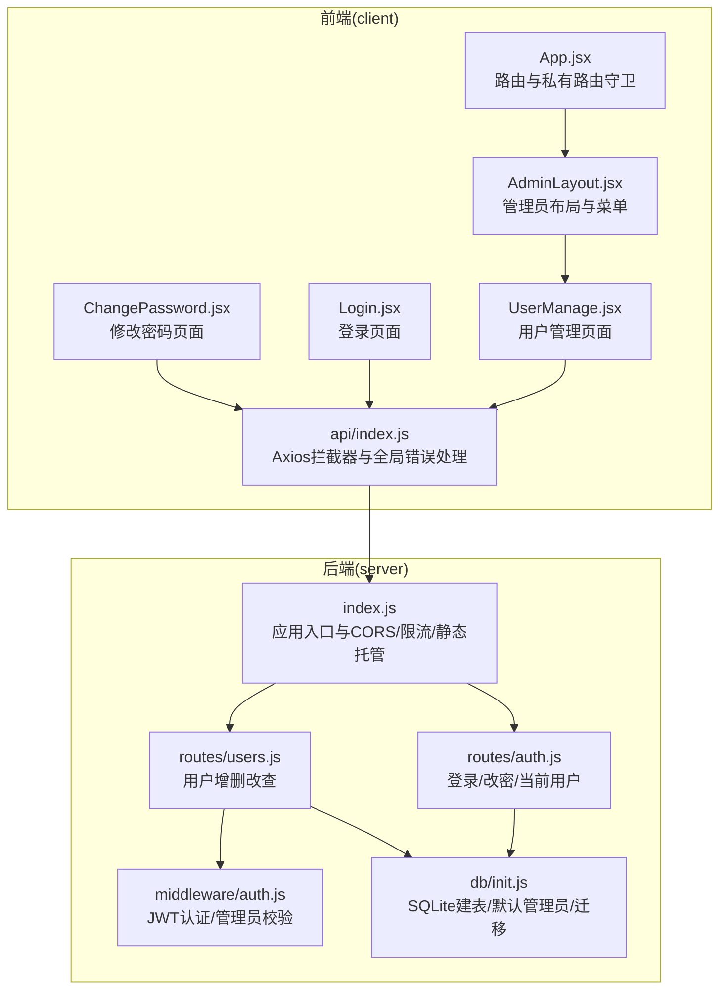
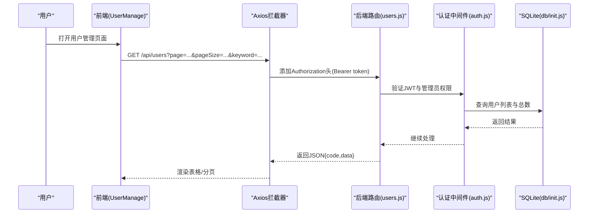
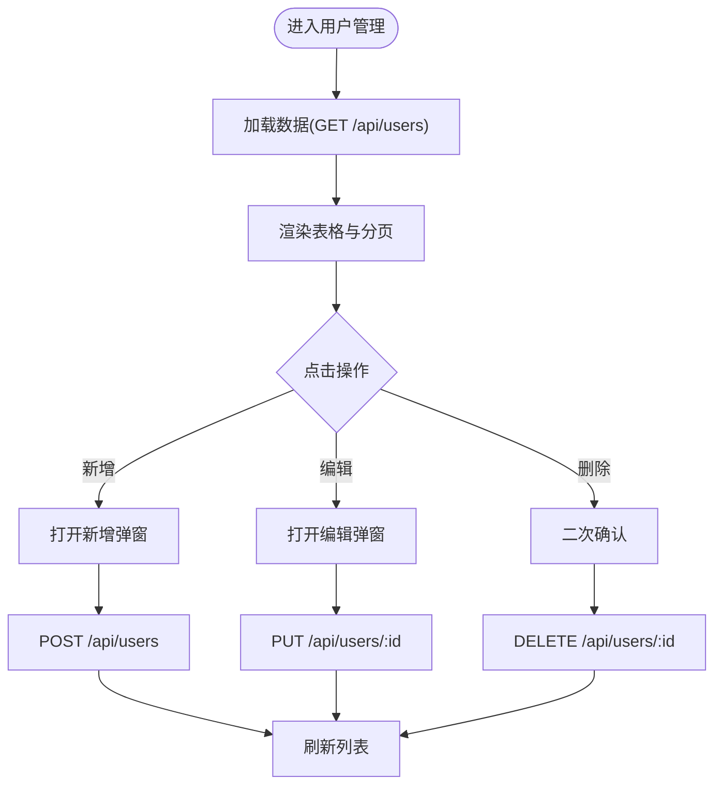
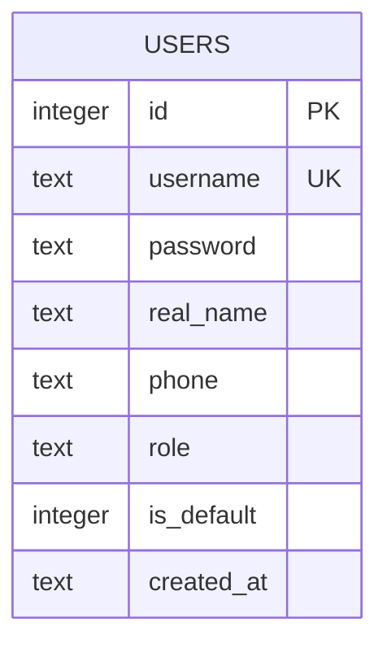
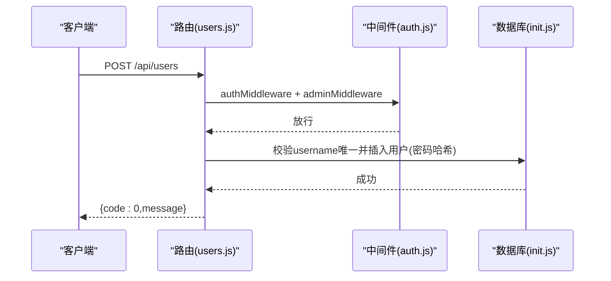
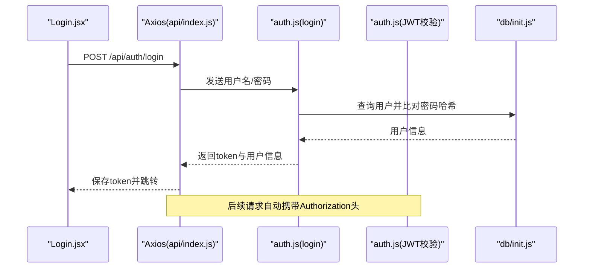
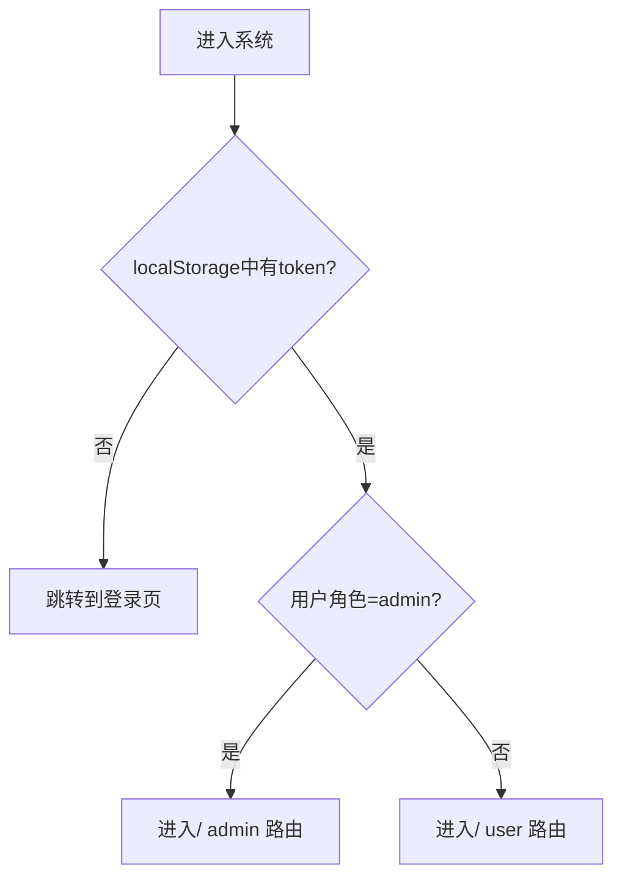
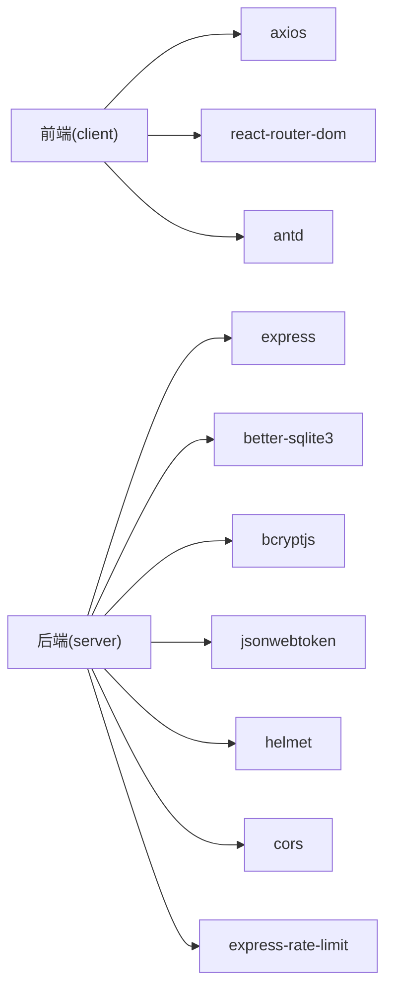

# 用户管理系统

<cite>
**本文档引用的文件**
- [client/src/pages/admin/UserManage.jsx](file://client/src/pages/admin/UserManage.jsx)
- [server/routes/users.js](file://server/routes/users.js)
- [server/middleware/auth.js](file://server/middleware/auth.js)
- [client/src/api/index.js](file://client/src/api/index.js)
- [server/db/init.js](file://server/db/init.js)
- [server/routes/auth.js](file://server/routes/auth.js)
- [client/src/App.jsx](file://client/src/App.jsx)
- [client/src/layouts/AdminLayout.jsx](file://client/src/layouts/AdminLayout.jsx)
- [server/index.js](file://server/index.js)
- [client/src/pages/Login.jsx](file://client/src/pages/Login.jsx)
- [client/src/pages/user/ChangePassword.jsx](file://client/src/pages/user/ChangePassword.jsx)
- [package.json](file://package.json)
- [client/package.json](file://client/package.json)
</cite>

## 目录
1. [简介](#简介)
2. [项目结构](#项目结构)
3. [核心组件](#核心组件)
4. [架构总览](#架构总览)
5. [详细组件分析](#详细组件分析)
6. [依赖关系分析](#依赖关系分析)
7. [性能考虑](#性能考虑)
8. [故障排除指南](#故障排除指南)
9. [结论](#结论)
10. [附录](#附录)

## 简介
本系统是一个基于 React 前端与 Express 后端的用户管理系统，提供用户账号的创建、编辑、删除与权限管理功能。系统采用 JWT 实现用户认证，使用 bcrypt 对密码进行哈希存储，数据库采用 SQLite 并通过 better-sqlite3 访问。管理员可管理用户账号、分配角色（管理员/普通用户），并支持按关键词分页查询。

## 项目结构
系统采用前后端分离架构：
- 前端（React + Ant Design）位于 client 目录，负责用户界面与交互逻辑。
- 后端（Express + better-sqlite3）位于 server 目录，提供 RESTful API 与数据库访问。
- 数据库初始化与迁移逻辑集中在数据库初始化模块中。
- 安全中间件统一处理认证与授权校验。

**图表来源**
- [client/src/App.jsx:1-67](file://client/src/App.jsx#L1-L67)
- [client/src/layouts/AdminLayout.jsx:1-174](file://client/src/layouts/AdminLayout.jsx#L1-L174)
- [client/src/pages/admin/UserManage.jsx:1-77](file://client/src/pages/admin/UserManage.jsx#L1-L77)
- [client/src/api/index.js:1-42](file://client/src/api/index.js#L1-L42)
- [client/src/pages/Login.jsx:1-68](file://client/src/pages/Login.jsx#L1-L68)
- [client/src/pages/user/ChangePassword.jsx:1-50](file://client/src/pages/user/ChangePassword.jsx#L1-L50)
- [server/index.js:1-120](file://server/index.js#L1-L120)
- [server/routes/auth.js:1-69](file://server/routes/auth.js#L1-L69)
- [server/routes/users.js:1-87](file://server/routes/users.js#L1-L87)
- [server/middleware/auth.js:1-29](file://server/middleware/auth.js#L1-L29)
- [server/db/init.js:1-217](file://server/db/init.js#L1-L217)

**章节来源**
- [client/src/App.jsx:1-67](file://client/src/App.jsx#L1-L67)
- [server/index.js:1-120](file://server/index.js#L1-L120)

## 核心组件
- 用户管理页面：提供用户列表展示、搜索、新增/编辑弹窗、删除确认与提示反馈。
- 用户数据模型：包含用户名、真实姓名、电话、角色、是否默认管理员、创建时间等字段。
- 认证与权限：JWT 令牌验证、管理员权限校验、登录/改密接口。
- 数据安全：密码哈希存储、CORS 白名单、请求频率限制、安全响应头。

**章节来源**
- [client/src/pages/admin/UserManage.jsx:1-77](file://client/src/pages/admin/UserManage.jsx#L1-L77)
- [server/db/init.js:21-33](file://server/db/init.js#L21-L33)
- [server/middleware/auth.js:1-29](file://server/middleware/auth.js#L1-L29)
- [server/routes/auth.js:1-69](file://server/routes/auth.js#L1-L69)

## 架构总览
系统采用“前端单页应用 + 后端 REST API”的典型架构。前端通过 Axios 发起请求，携带 Bearer Token；后端通过中间件进行认证与权限校验，再访问数据库执行业务逻辑。

**图表来源**
- [client/src/pages/admin/UserManage.jsx:18-23](file://client/src/pages/admin/UserManage.jsx#L18-L23)
- [client/src/api/index.js:9-15](file://client/src/api/index.js#L9-L15)
- [server/routes/users.js:7-24](file://server/routes/users.js#L7-L24)
- [server/middleware/auth.js:5-26](file://server/middleware/auth.js#L5-L26)
- [server/db/init.js:18-33](file://server/db/init.js#L18-L33)

## 详细组件分析

### 用户管理页面（UserManage）
- 功能点
  - 列表加载：分页参数与关键词搜索，调用 /api/users。
  - 新增/编辑：弹窗表单，必填项校验，提交时区分新增与更新。
  - 删除：删除前二次确认，禁止删除默认管理员账号。
  - 展示：账号、使用人、电话、角色标签、创建时间；操作列含修改与删除。
- 关键交互
  - 表单字段：username、real_name、phone、role、password（新增时必填，编辑时可留空）。
  - 角色渲染：根据 role 显示不同颜色标签。
  - 分页：每页固定条数，支持页码切换与总数显示。

**图表来源**
- [client/src/pages/admin/UserManage.jsx:18-76](file://client/src/pages/admin/UserManage.jsx#L18-L76)

**章节来源**
- [client/src/pages/admin/UserManage.jsx:1-77](file://client/src/pages/admin/UserManage.jsx#L1-L77)

### 用户数据模型与数据库设计
- 用户表字段
  - id：主键自增
  - username：唯一且非空
  - password：非空（存储为哈希）
  - real_name：非空，默认空字符串
  - phone：默认空字符串
  - role：枚举值 'admin' 或 'user'，默认 'user'
  - is_default：默认 0，标识默认管理员
  - created_at：默认当前本地时间
- 默认管理员
  - 若不存在则插入默认管理员账号，角色为 admin，标记 is_default=1。
- 迁移与兼容
  - 对部分历史表进行字段迁移以保证兼容性。

**图表来源**
- [server/db/init.js:21-33](file://server/db/init.js#L21-L33)

**章节来源**
- [server/db/init.js:197-205](file://server/db/init.js#L197-L205)
- [server/db/init.js:133-195](file://server/db/init.js#L133-L195)

### 后端 API 设计与权限控制
- 路由与中间件
  - /api/users：受 authMiddleware 与 adminMiddleware 保护，仅管理员可访问。
  - /api/auth/login：公开登录接口，返回 JWT。
  - /api/auth/change-password：需登录，校验原密码并更新新密码。
  - /api/auth/me：需登录，返回当前用户信息。
- 用户管理接口
  - GET /api/users：分页查询，支持关键词模糊匹配 username、real_name、phone。
  - POST /api/users：新增用户，检查重复用户名，密码哈希存储。
  - PUT /api/users/:id：更新用户，支持密码更新（留空则不改），检查重复用户名。
  - DELETE /api/users/:id：删除用户，禁止删除 is_default=1 的默认管理员。
- 错误码约定
  - code=0 表示成功；非 0 表示错误，包含 message 字段。

**图表来源**
- [server/routes/users.js:7-41](file://server/routes/users.js#L7-L41)
- [server/middleware/auth.js:5-26](file://server/middleware/auth.js#L5-L26)
- [server/db/init.js:197-205](file://server/db/init.js#L197-L205)

**章节来源**
- [server/routes/users.js:1-87](file://server/routes/users.js#L1-L87)
- [server/middleware/auth.js:1-29](file://server/middleware/auth.js#L1-L29)

### 认证流程与安全机制
- 登录流程
  - 客户端提交用户名与密码至 /api/auth/login。
  - 后端查询用户并比对密码哈希，签发 JWT（有效期 24 小时）。
  - 前端保存 token 与用户信息，后续请求自动附加 Authorization 头。
- 权限控制
  - authMiddleware：从 Authorization 头提取 Bearer token，验证失败返回 401。
  - adminMiddleware：校验用户角色必须为 'admin'，否则返回 403。
- 安全增强
  - Helmet 设置安全响应头。
  - CORS 白名单控制来源，支持 .onrender.com 子域名。
  - 登录与全局 API 限流，防暴力破解与滥用。
  - Axios 拦截器统一处理 401 自动跳转登录。

**图表来源**
- [client/src/pages/Login.jsx:27-43](file://client/src/pages/Login.jsx#L27-L43)
- [client/src/api/index.js:9-15](file://client/src/api/index.js#L9-L15)
- [server/routes/auth.js:8-40](file://server/routes/auth.js#L8-L40)
- [server/middleware/auth.js:5-19](file://server/middleware/auth.js#L5-L19)
- [server/db/init.js:197-205](file://server/db/init.js#L197-L205)

**章节来源**
- [client/src/pages/Login.jsx:1-68](file://client/src/pages/Login.jsx#L1-L68)
- [client/src/api/index.js:1-42](file://client/src/api/index.js#L1-L42)
- [server/routes/auth.js:1-69](file://server/routes/auth.js#L1-L69)
- [server/middleware/auth.js:1-29](file://server/middleware/auth.js#L1-L29)
- [server/index.js:11-63](file://server/index.js#L11-L63)

### 前端路由与布局
- 路由守卫
  - PrivateRoute：无 token 则重定向到 /login。
  - /admin 与 /user 路由分别挂载管理员与普通用户布局。
- 管理员布局
  - 提供侧边栏菜单与移动端抽屉导航，顶部显示当前用户信息与退出按钮。
  - 仅管理员可见用户管理菜单项。
- 登录页面
  - 支持自动检测本地 token 与用户角色，决定跳转路径。
  - 获取系统名称并设置页面标题。

**图表来源**
- [client/src/App.jsx:26-30](file://client/src/App.jsx#L26-L30)
- [client/src/App.jsx:37-59](file://client/src/App.jsx#L37-L59)
- [client/src/layouts/AdminLayout.jsx:36-42](file://client/src/layouts/AdminLayout.jsx#L36-L42)
- [client/src/pages/Login.jsx:12-25](file://client/src/pages/Login.jsx#L12-L25)

**章节来源**
- [client/src/App.jsx:1-67](file://client/src/App.jsx#L1-L67)
- [client/src/layouts/AdminLayout.jsx:1-174](file://client/src/layouts/AdminLayout.jsx#L1-L174)
- [client/src/pages/Login.jsx:1-68](file://client/src/pages/Login.jsx#L1-L68)

## 依赖关系分析
- 前端依赖
  - React 生态与 Ant Design 组件库，Axios 进行 HTTP 请求，react-router-dom 管理路由。
- 后端依赖
  - Express 提供 Web 服务，better-sqlite3 访问 SQLite，bcryptjs 哈希密码，jsonwebtoken 签发与验证 JWT，helmet/cors/rate-limit 增强安全与限流。
- 构建与运行
  - 顶层脚本负责构建前端产物并安装后端依赖，后端监听端口启动服务。

**图表来源**
- [client/package.json:11-21](file://client/package.json#L11-L21)
- [server/index.js:1-120](file://server/index.js#L1-L120)
- [package.json:5-8](file://package.json#L5-L8)

**章节来源**
- [client/package.json:1-27](file://client/package.json#L1-L27)
- [package.json:1-13](file://package.json#L1-L13)

## 性能考虑
- 数据库访问
  - 使用 WAL 模式与外键约束提升并发与一致性。
  - 分页查询使用 LIMIT/OFFSET，避免一次性加载大量数据。
- 网络与缓存
  - Axios 统一设置超时与请求头，减少无效请求。
  - 前端本地存储 token 与用户信息，避免重复登录。
- 安全与稳定性
  - 登录与全局 API 限流，降低暴力破解与滥用风险。
  - CORS 白名单与安全响应头，降低跨域与注入风险。

## 故障排除指南
- 登录失败
  - 检查用户名与密码是否为空；确认账号是否存在且密码正确。
  - 查看后端日志与 429 频率限制提示。
- 权限不足
  - 确认用户角色为 'admin'；检查中间件是否正确附加到路由。
- 删除失败
  - 确认目标用户不是默认管理员（is_default=1）。
- 前端 401
  - 检查本地 token 是否存在；确认拦截器是否正确附加 Authorization 头；刷新页面后重试。
- 数据库初始化
  - 确认数据库文件存在且具备读写权限；如需迁移，检查历史表字段是否存在。

**章节来源**
- [server/routes/auth.js:9-21](file://server/routes/auth.js#L9-L21)
- [server/middleware/auth.js:21-26](file://server/middleware/auth.js#L21-L26)
- [server/routes/users.js:71-83](file://server/routes/users.js#L71-L83)
- [client/src/api/index.js:17-39](file://client/src/api/index.js#L17-L39)
- [server/db/init.js:197-205](file://server/db/init.js#L197-L205)

## 结论
本用户管理系统通过清晰的前后端职责划分、完善的认证与权限控制、以及基础的安全加固措施，实现了用户账号的全生命周期管理。建议在生产环境中进一步强化密钥管理、审计日志与更细粒度的权限控制，并持续监控与优化数据库查询与 API 性能。

## 附录
- 接口清单
  - 登录：POST /api/auth/login
  - 修改密码：POST /api/auth/change-password
  - 当前用户：GET /api/auth/me
  - 用户列表：GET /api/users?page=&pageSize=&keyword=
  - 新增用户：POST /api/users
  - 更新用户：PUT /api/users/:id
  - 删除用户：DELETE /api/users/:id
- 前端页面
  - 管理员布局：/admin
  - 用户管理：/admin/users
  - 登录：/login
  - 修改密码：/user/password