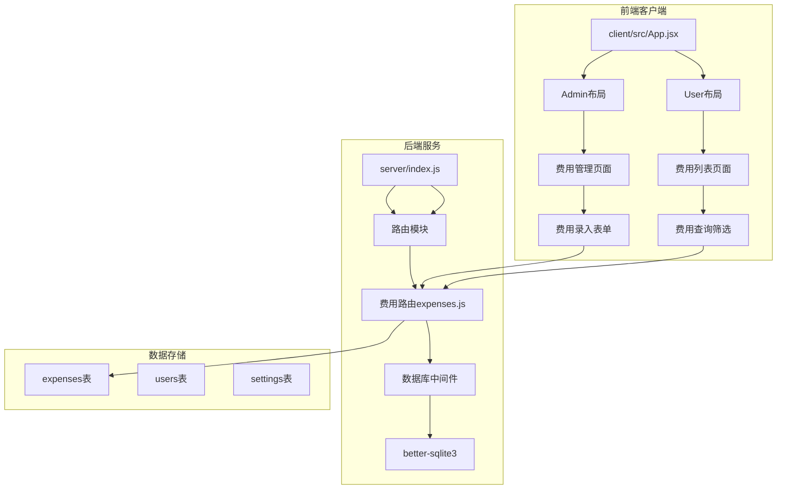
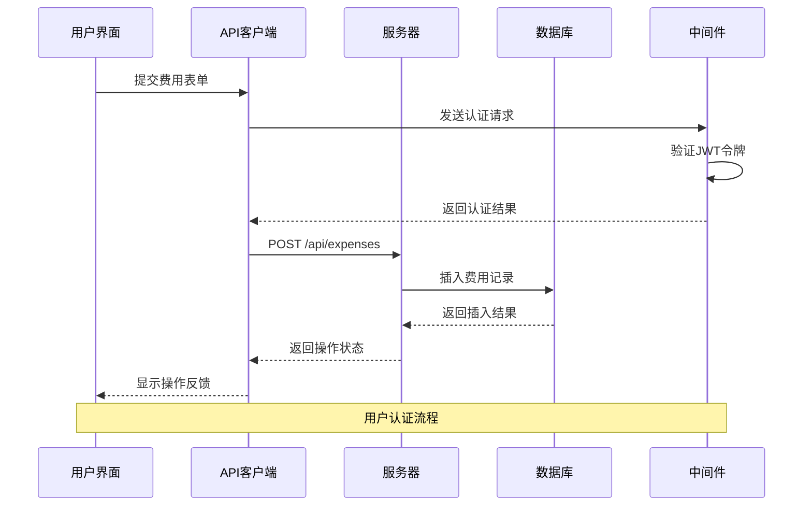
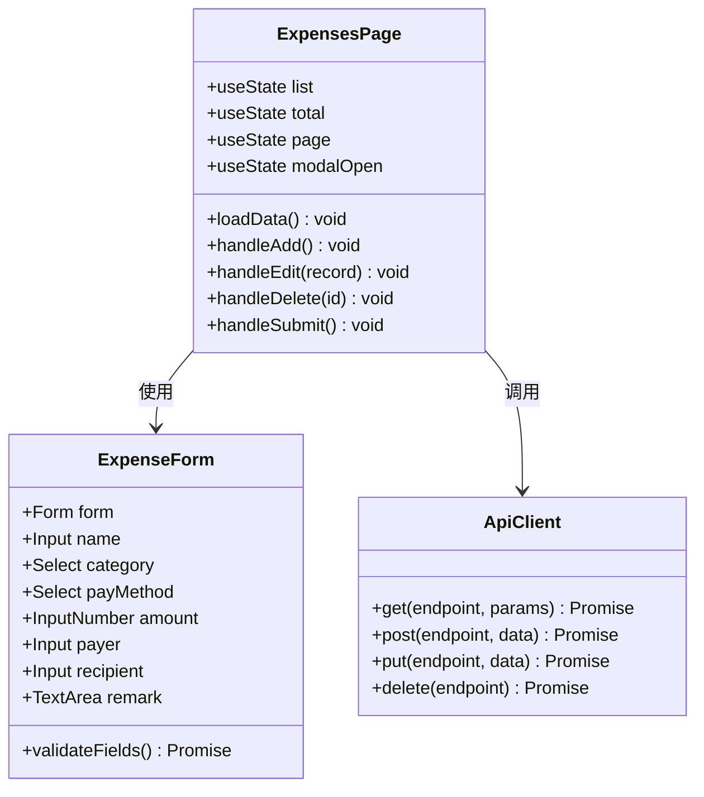
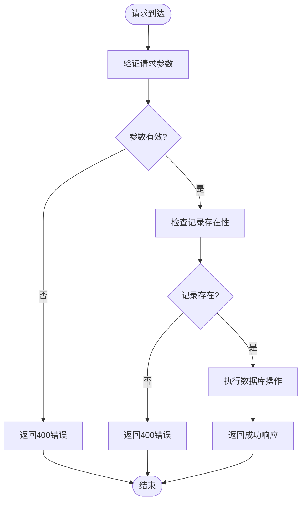
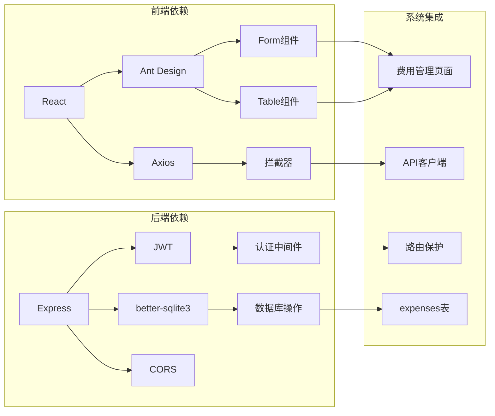

# 费用管理系统

<cite>
**本文档引用的文件**
- [client/src/pages/admin/Expenses.jsx](file://client/src/pages/admin/Expenses.jsx)
- [client/src/pages/user/ExpenseList.jsx](file://client/src/pages/user/ExpenseList.jsx)
- [client/src/api/index.js](file://client/src/api/index.js)
- [server/routes/expenses.js](file://server/routes/expenses.js)
- [server/db/init.js](file://server/db/init.js)
- [server/middleware/auth.js](file://server/middleware/auth.js)
- [server/index.js](file://server/index.js)
- [client/src/App.jsx](file://client/src/App.jsx)
</cite>

## 目录
1. [简介](#简介)
2. [项目结构](#项目结构)
3. [核心组件](#核心组件)
4. [架构总览](#架构总览)
5. [详细组件分析](#详细组件分析)
6. [依赖关系分析](#依赖关系分析)
7. [性能考虑](#性能考虑)
8. [故障排除指南](#故障排除指南)
9. [结论](#结论)
10. [附录](#附录)

## 简介
本系统是一个基于前后端分离架构的费用管理系统，专注于日常费用的记录与管理。系统提供费用类别设置、费用明细登记、费用统计分析等核心功能，并通过前后端协同实现完整的费用生命周期管理。系统采用React+Express技术栈，使用better-sqlite3作为本地数据库，配合JWT进行用户认证与授权。

## 项目结构
系统采用典型的前后端分离架构，前端使用React框架构建用户界面，后端使用Express.js提供RESTful API服务。项目结构清晰，模块化程度高，便于维护和扩展。

**图表来源**
- [client/src/App.jsx:1-67](file://client/src/App.jsx#L1-L67)
- [server/index.js:1-120](file://server/index.js#L1-L120)
- [server/routes/expenses.js:1-73](file://server/routes/expenses.js#L1-L73)

**章节来源**
- [client/src/App.jsx:1-67](file://client/src/App.jsx#L1-L67)
- [server/index.js:1-120](file://server/index.js#L1-L120)

## 核心组件
系统的核心组件围绕费用管理展开，主要包括费用管理页面、费用列表页面、API接口和数据库模型。

### 费用数据模型设计
系统采用SQLite数据库存储费用相关信息，数据模型设计简洁实用，包含以下关键字段：

| 字段名 | 数据类型 | 约束条件 | 描述 |
|--------|----------|----------|------|
| id | INTEGER | PRIMARY KEY AUTOINCREMENT | 主键标识符 |
| name | TEXT | NOT NULL | 费用名称 |
| category | TEXT | DEFAULT '' | 费用分类 |
| pay_method | TEXT | DEFAULT '' | 支付方式 |
| amount | REAL | DEFAULT 0 | 支付金额 |
| payer | TEXT | DEFAULT '' | 支付人 |
| recipient | TEXT | DEFAULT '' | 加给谁 |
| remark | TEXT | DEFAULT '' | 备注信息 |
| created_by | TEXT | DEFAULT '' | 记录人 |
| created_at | TEXT | DEFAULT (datetime('now','localtime')) | 创建时间 |

### 费用分类体系
系统预设了8个标准费用分类，涵盖了企业日常运营的主要支出类型：
- 办公用品：文具、打印耗材等办公必需品
- 餐饮：员工餐费、业务餐费等
- 交通：差旅费、油费、停车费等
- 水电：水电气费用
- 房租：办公场所租金
- 工资：员工薪酬发放
- 通讯：电话费、网络费等
- 招待：客户招待费用
- 其他：未归类的其他支出

### 支付方式定义
系统支持5种常见的支付方式：
- 对转账：银行对公转账
- 微信转账：微信支付转账
- 银行转账：银行个人转账
- 现金支付：现金交易
- 其他：其他支付方式

**章节来源**
- [server/db/init.js:172-186](file://server/db/init.js#L172-L186)
- [client/src/pages/admin/Expenses.jsx:14-24](file://client/src/pages/admin/Expenses.jsx#L14-L24)
- [client/src/pages/user/ExpenseList.jsx:14-24](file://client/src/pages/user/ExpenseList.jsx#L14-L24)

## 架构总览
系统采用分层架构设计，前后端职责明确，通过RESTful API进行通信。

**图表来源**
- [client/src/api/index.js:17-39](file://client/src/api/index.js#L17-L39)
- [server/middleware/auth.js:5-19](file://server/middleware/auth.js#L5-L19)
- [server/routes/expenses.js:25-38](file://server/routes/expenses.js#L25-L38)

## 详细组件分析

### 前端费用管理界面
费用管理界面采用Ant Design组件库构建，提供了完整的费用管理功能。

#### 界面布局与功能
- **搜索功能**：支持按名称、分类、支付人、加给人等多维度搜索
- **分页显示**：每页显示20条记录，支持翻页导航
- **表格展示**：显示费用名称、分类、支付方式、金额、支付人、加给人、备注、记录人、记录时间等字段
- **操作按钮**：支持新增、修改、删除操作

#### 表单设计
费用录入表单包含以下字段：
- 开销名称：必填项，用于标识费用用途
- 分类：下拉选择，支持8种预设分类
- 支付方式：必选项，支持4种支付方式
- 支付金额：数值输入，精度到分
- 支付人：文本输入
- 加给谁：文本输入
- 备注：多行文本输入

**图表来源**
- [client/src/pages/admin/Expenses.jsx:26-107](file://client/src/pages/admin/Expenses.jsx#L26-L107)
- [client/src/api/index.js:1-42](file://client/src/api/index.js#L1-L42)

**章节来源**
- [client/src/pages/admin/Expenses.jsx:26-107](file://client/src/pages/admin/Expenses.jsx#L26-L107)
- [client/src/pages/user/ExpenseList.jsx:26-107](file://client/src/pages/user/ExpenseList.jsx#L26-L107)

### 后端API接口设计
后端提供RESTful API接口，负责费用数据的增删改查操作。

#### 接口规范
系统实现了标准的CRUD操作：
- GET `/api/expenses`：获取费用列表（支持分页和搜索）
- POST `/api/expenses`：创建新的费用记录
- PUT `/api/expenses/:id`：更新指定费用记录
- DELETE `/api/expenses/:id`：删除指定费用记录

#### 数据验证逻辑
后端实现了严格的输入验证：
- 费用名称必须非空且去除首尾空白
- 支付金额必须为正数
- 执行操作前会检查记录是否存在
- 所有接口都经过JWT认证中间件保护

**图表来源**
- [server/routes/expenses.js:25-58](file://server/routes/expenses.js#L25-L58)

**章节来源**
- [server/routes/expenses.js:1-73](file://server/routes/expenses.js#L1-L73)

### 数据库模型设计
系统使用SQLite作为数据存储，expenses表设计简洁实用。

#### 表结构特点
- 使用INTEGER主键自增确保唯一性
- 所有文本字段都有默认值，避免NULL值
- created_at字段自动记录创建时间
- 支持全文检索的LIKE查询模式

#### 数据迁移机制
系统具备数据迁移能力，能够自动为现有数据库添加新字段：
- 自动添加category字段支持费用分类
- 自动添加recipient字段支持收款人信息

**章节来源**
- [server/db/init.js:172-195](file://server/db/init.js#L172-L195)

## 依赖关系分析

**图表来源**
- [client/src/api/index.js:1-42](file://client/src/api/index.js#L1-L42)
- [server/middleware/auth.js:1-29](file://server/middleware/auth.js#L1-L29)
- [server/db/init.js:1-217](file://server/db/init.js#L1-L217)

系统依赖关系清晰，前端通过API客户端与后端交互，后端通过数据库中间件访问SQLite数据库。认证中间件确保所有费用相关接口的安全性。

**章节来源**
- [client/src/api/index.js:1-42](file://client/src/api/index.js#L1-L42)
- [server/middleware/auth.js:1-29](file://server/middleware/auth.js#L1-L29)

## 性能考虑
系统在设计时充分考虑了性能优化和用户体验：

### 前端性能优化
- **虚拟滚动**：表格组件支持横向滚动，提升大数据量显示性能
- **懒加载**：页面按需加载，减少初始资源消耗
- **缓存策略**：合理使用状态管理，避免不必要的重渲染

### 后端性能优化
- **WAL模式**：SQLite启用WAL模式提升并发读写性能
- **索引优化**：针对常用查询字段建立索引
- **连接池**：复用数据库连接，减少连接开销

### 安全性能
- **JWT认证**：无状态认证机制，支持水平扩展
- **CORS配置**：严格的跨域访问控制
- **速率限制**：防止恶意请求和DDoS攻击

## 故障排除指南

### 常见问题及解决方案

#### 认证相关问题
- **问题**：登录后无法访问费用管理页面
- **原因**：JWT令牌过期或无效
- **解决**：重新登录获取新令牌，检查浏览器本地存储

#### 数据库连接问题
- **问题**：费用数据无法保存或查询
- **原因**：SQLite数据库文件损坏或权限不足
- **解决**：检查数据库文件完整性，确认文件权限

#### API调用错误
- **问题**：提交表单后无响应
- **原因**：网络请求超时或服务器错误
- **解决**：检查网络连接，查看浏览器开发者工具中的错误信息

**章节来源**
- [client/src/api/index.js:17-39](file://client/src/api/index.js#L17-L39)
- [server/middleware/auth.js:5-19](file://server/middleware/auth.js#L5-L19)

## 结论
费用管理系统采用现代化的技术栈和清晰的架构设计，成功实现了日常费用的完整管理流程。系统具有以下优势：

1. **功能完整**：覆盖费用管理的全生命周期，从录入到统计分析
2. **易于使用**：直观的用户界面和简化的操作流程
3. **安全可靠**：完善的认证授权机制和数据保护措施
4. **扩展性强**：模块化设计便于功能扩展和维护

系统为中小企业的费用管理提供了高效、可靠的解决方案，能够满足日常财务管理的基本需求。

## 附录

### 报表生成和财务分析建议
基于现有系统架构，建议增加以下功能以完善财务分析能力：

1. **月度统计报表**：按月份生成费用汇总报表
2. **分类分析图表**：使用饼图展示各类别费用占比
3. **趋势分析功能**：展示费用变化趋势
4. **预算对比功能**：将实际费用与预算进行对比分析

### 最佳实践建议
- 定期备份数据库文件，确保数据安全
- 建立费用审批流程，提高财务管理规范性
- 定期清理历史数据，保持数据库性能
- 培训用户正确使用系统功能，提高工作效率