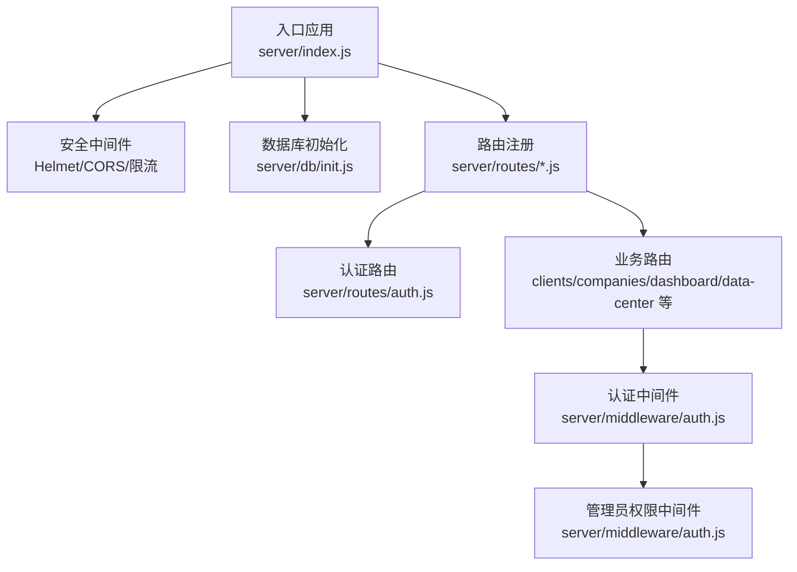
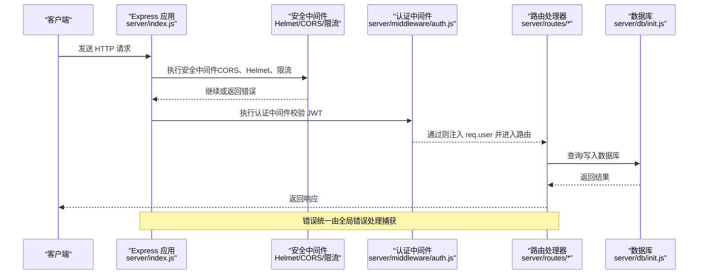
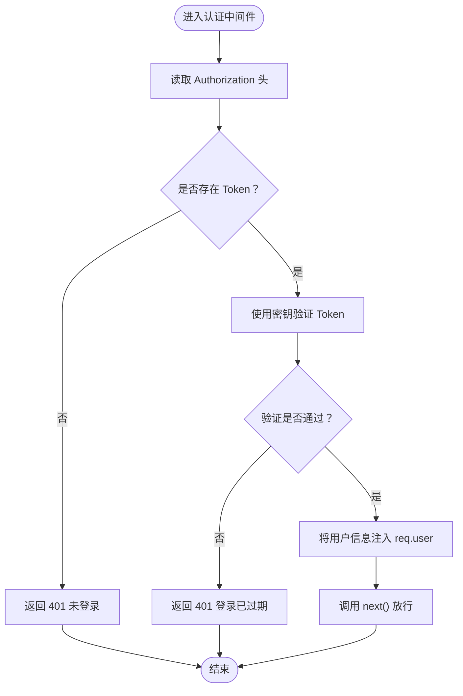
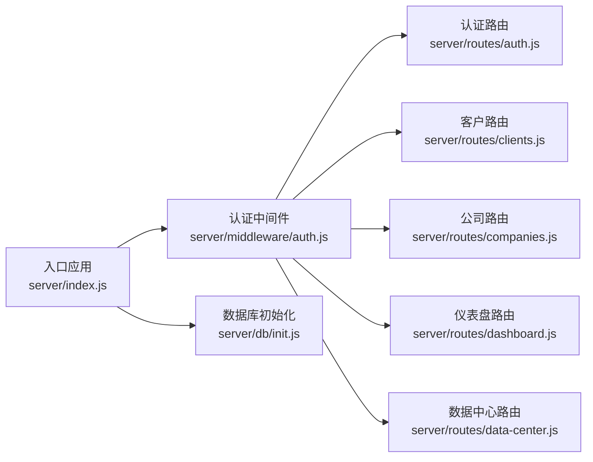

# 中间件系统

<cite>
**本文引用的文件**
- [server/index.js](file://server/index.js)
- [server/middleware/auth.js](file://server/middleware/auth.js)
- [server/routes/auth.js](file://server/routes/auth.js)
- [server/routes/clients.js](file://server/routes/clients.js)
- [server/routes/companies.js](file://server/routes/companies.js)
- [server/routes/dashboard.js](file://server/routes/dashboard.js)
- [server/routes/data-center.js](file://server/routes/data-center.js)
- [server/db/init.js](file://server/db/init.js)
- [server/package.json](file://server/package.json)
</cite>

## 目录
1. [简介](#简介)
2. [项目结构](#项目结构)
3. [核心组件](#核心组件)
4. [架构总览](#架构总览)
5. [详细组件分析](#详细组件分析)
6. [依赖关系分析](#依赖关系分析)
7. [性能考量](#性能考量)
8. [故障排查指南](#故障排查指南)
9. [结论](#结论)

## 简介
本文件系统化梳理 SY-Q 做账管理系统的中间件体系，重点覆盖：
- Express 中间件的工作原理与执行顺序
- 认证中间件、安全中间件与其他自定义中间件的实现
- JWT 认证中间件的令牌验证、用户权限检查与访问控制
- 中间件链式调用与错误传播机制
- 中间件的注册与配置方式（全局中间件与路由级中间件）
- 中间件的扩展性与可维护性设计

## 项目结构
后端采用 Express 作为 Web 框架，中间件与路由分离，认证与权限控制集中在统一的中间件模块中，路由层以“路由级中间件”的形式复用认证与权限逻辑。

图表来源
- [server/index.js:1-120](file://server/index.js#L1-L120)
- [server/db/init.js:1-217](file://server/db/init.js#L1-L217)
- [server/middleware/auth.js:1-29](file://server/middleware/auth.js#L1-L29)
- [server/routes/auth.js:1-69](file://server/routes/auth.js#L1-L69)
- [server/routes/clients.js:1-81](file://server/routes/clients.js#L1-L81)
- [server/routes/companies.js:1-104](file://server/routes/companies.js#L1-L104)
- [server/routes/dashboard.js:1-92](file://server/routes/dashboard.js#L1-L92)
- [server/routes/data-center.js:1-260](file://server/routes/data-center.js#L1-L260)

章节来源
- [server/index.js:1-120](file://server/index.js#L1-L120)
- [server/package.json:1-26](file://server/package.json#L1-L26)

## 核心组件
- 安全中间件
  - Helmet：设置安全响应头，关闭严格 CSP 以适配同源前后端部署
  - CORS：基于白名单与子域名规则进行来源校验
  - 速率限制：登录接口与通用 API 的频率限制
- 认证中间件
  - JWT 校验：从 Authorization 头提取 Bearer Token，解码并注入用户信息到请求对象
  - 管理员权限：基于用户角色进行访问控制
- 路由级中间件
  - 在路由层通过 router.use 或路由处理器参数挂载认证与权限中间件
- 数据库中间件
  - 数据库连接与初始化：懒加载、外键与 WAL 模式启用

章节来源
- [server/index.js:11-66](file://server/index.js#L11-L66)
- [server/middleware/auth.js:1-29](file://server/middleware/auth.js#L1-L29)
- [server/db/init.js:9-217](file://server/db/init.js#L9-L217)

## 架构总览
下图展示请求从进入应用到路由处理的整体流程，以及中间件的执行顺序与职责边界。

图表来源
- [server/index.js:11-115](file://server/index.js#L11-L115)
- [server/middleware/auth.js:5-26](file://server/middleware/auth.js#L5-L26)
- [server/routes/auth.js:8-66](file://server/routes/auth.js#L8-L66)
- [server/db/init.js:9-217](file://server/db/init.js#L9-L217)

## 详细组件分析

### 认证中间件（JWT）
- 功能要点
  - 从 Authorization 头读取 Bearer Token，避免通过 URL 参数泄露
  - 使用固定密钥对 Token 进行签名校验，失败即返回未授权
  - 成功后将用户信息注入到 req.user，供后续路由使用
  - 提供管理员权限中间件，基于角色进行访问控制
- 执行流程

图表来源
- [server/middleware/auth.js:5-19](file://server/middleware/auth.js#L5-L19)

- 与路由的集成
  - 登录接口无需认证，但登录请求受登录限流保护
  - 修改密码与获取当前用户信息等接口需通过认证中间件
  - 管理员专属功能（如客户、公司、数据中心）在路由层组合使用认证与管理员权限中间件

章节来源
- [server/middleware/auth.js:1-29](file://server/middleware/auth.js#L1-L29)
- [server/routes/auth.js:8-66](file://server/routes/auth.js#L8-L66)

### 安全中间件与限流
- Helmet
  - 设置安全响应头，关闭严格 CSP 与跨域嵌入策略以适配同源部署
- CORS
  - 支持本地开发与 Render 域名白名单，允许 .onrender.com 子域名
  - 对无 Origin 的请求（如 curl、Postman）直接放行
- 速率限制
  - 登录接口每 IP 每分钟最多 10 次
  - 通用 API 每 IP 每分钟最多 120 次
  - 登录接口单独注册限流器，API 路由前缀统一注册

章节来源
- [server/index.js:11-66](file://server/index.js#L11-L66)

### 路由级中间件使用模式
- 全局认证中间件
  - 在特定路由组上使用 router.use(authMiddleware)，使该组下所有路由均需认证
- 局部认证与权限
  - 在具体路由处理器参数中挂载 authMiddleware 或 adminMiddleware，实现细粒度控制
- 示例
  - 客户管理与公司管理：在路由组上挂载全局认证，在增删改查等操作上叠加管理员权限
  - 仪表盘：在路由组上挂载全局认证，区分管理员与普通用户的数据视图
  - 数据中心：在路由组上挂载全局认证，导出/导入/备份/恢复/重置等操作叠加管理员权限

章节来源
- [server/routes/clients.js:6-22](file://server/routes/clients.js#L6-L22)
- [server/routes/companies.js:6-23](file://server/routes/companies.js#L6-L23)
- [server/routes/dashboard.js:6-9](file://server/routes/dashboard.js#L6-L9)
- [server/routes/data-center.js:11-93](file://server/routes/data-center.js#L11-L93)

### 数据库中间件（连接与初始化）
- 懒加载数据库连接，启用 WAL 模式与外键约束
- 初始化时创建/迁移多张业务表，插入默认管理员与系统名称
- 提供 getDb 与 initDb 接口，供路由层查询与重建

章节来源
- [server/db/init.js:9-217](file://server/db/init.js#L9-L217)

## 依赖关系分析
- 中间件与路由的耦合
  - 认证中间件被多个路由组复用，保持高内聚低耦合
  - 路由层通过 router.use 与路由处理器参数灵活组合中间件
- 外部依赖
  - jsonwebtoken：JWT 签发与验证
  - bcryptjs：密码哈希
  - better-sqlite3：SQLite 数据库驱动
  - express-rate-limit：请求频率限制
  - helmet/cors：安全与跨域

图表来源
- [server/middleware/auth.js:1-29](file://server/middleware/auth.js#L1-L29)
- [server/routes/auth.js:1-69](file://server/routes/auth.js#L1-L69)
- [server/routes/clients.js:1-81](file://server/routes/clients.js#L1-L81)
- [server/routes/companies.js:1-104](file://server/routes/companies.js#L1-L104)
- [server/routes/dashboard.js:1-92](file://server/routes/dashboard.js#L1-L92)
- [server/routes/data-center.js:1-260](file://server/routes/data-center.js#L1-L260)
- [server/index.js:65-95](file://server/index.js#L65-L95)
- [server/db/init.js:1-217](file://server/db/init.js#L1-L217)

章节来源
- [server/package.json:14-24](file://server/package.json#L14-L24)

## 性能考量
- 中间件顺序优化
  - 将快速失败的中间件（如 CORS、限流）置于前部，减少后续处理成本
- 令牌验证成本
  - JWT 验证为 O(1)，但建议在高并发场景下考虑缓存策略（如基于 Redis 的 Token 黑名单）
- 数据库连接
  - 懒加载与 WAL 模式提升并发写入性能；外键约束带来一定开销，但保证数据一致性
- 限流策略
  - 登录限流与 API 限流分别针对不同场景，避免相互干扰

## 故障排查指南
- 认证失败
  - 未携带 Authorization 头或格式不正确：返回 401 未登录
  - Token 已过期或签名不合法：返回 401 登录已过期
  - 建议：确认前端发送的请求头格式与密钥一致
- 权限不足
  - 非管理员访问管理员接口：返回 403 权限不足
  - 建议：确认用户角色字段与中间件判断逻辑
- CORS 拒绝
  - 来源不在白名单：返回 403 不允许的来源
  - 建议：检查 ALLOWED_ORIGINS 环境变量与 .onrender.com 子域名规则
- 限流触发
  - 登录过于频繁：返回 429 登录尝试过于频繁
  - 建议：降低请求频率或调整限流阈值
- 全局错误处理
  - 未捕获异常：统一返回 500 服务器内部错误
  - 建议：在中间件与路由中显式处理错误并调用 next(err)

章节来源
- [server/middleware/auth.js:9-18](file://server/middleware/auth.js#L9-L18)
- [server/middleware/auth.js:21-26](file://server/middleware/auth.js#L21-L26)
- [server/index.js:110-115](file://server/index.js#L110-L115)
- [server/index.js:47-63](file://server/index.js#L47-L63)

## 结论
本中间件系统以“认证中间件 + 安全中间件 + 路由级中间件”为核心，实现了清晰的职责划分与可复用的权限控制模型。通过在路由组上挂载全局认证与在具体操作上叠加管理员权限，既保证了安全性，又提升了可维护性。建议在未来进一步引入：
- Token 缓存与黑名单机制
- 更细粒度的权限模型（如资源级权限）
- 中间件日志与可观测性增强