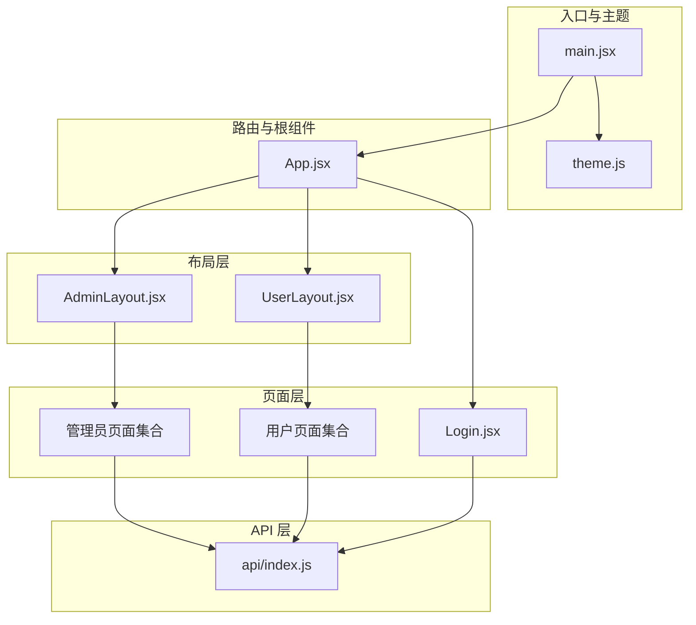
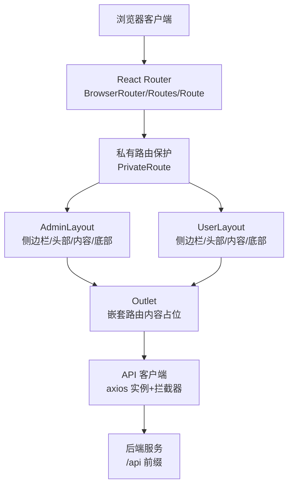
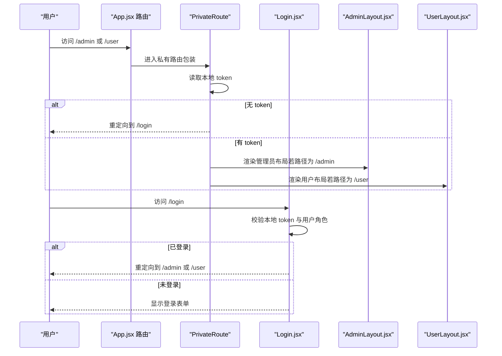
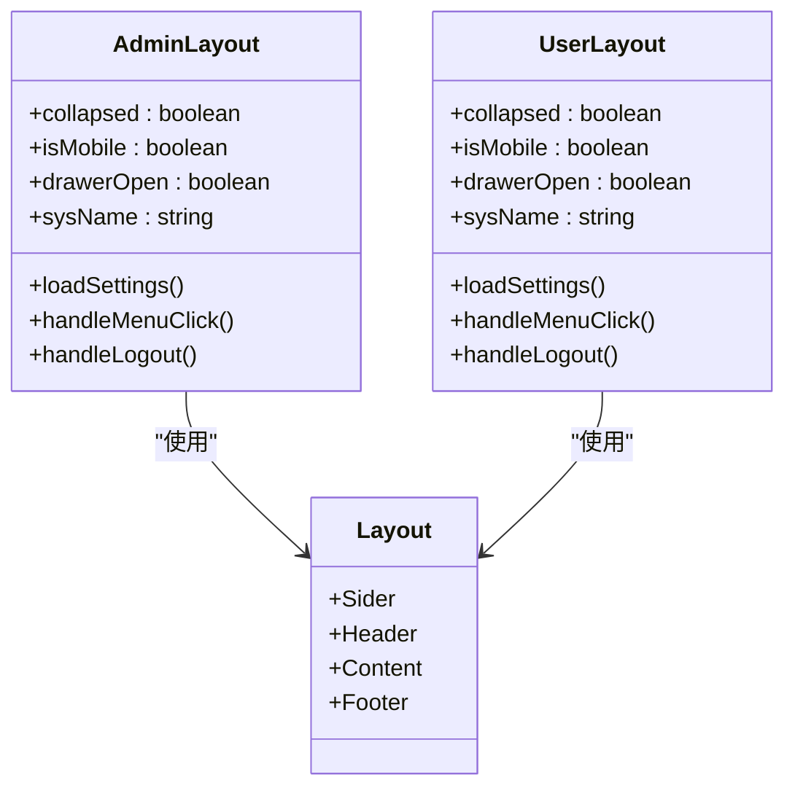
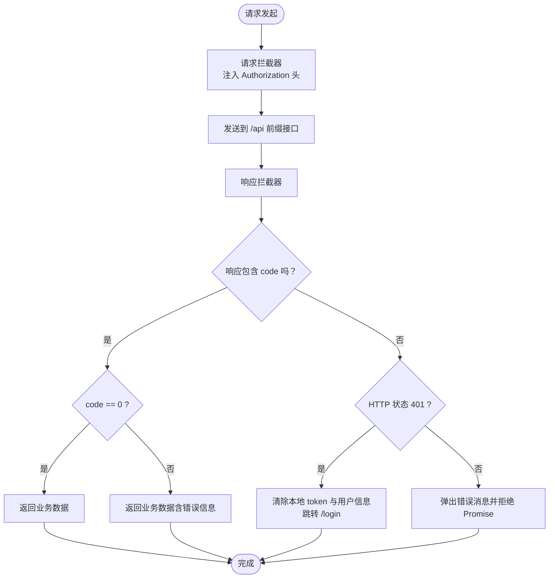
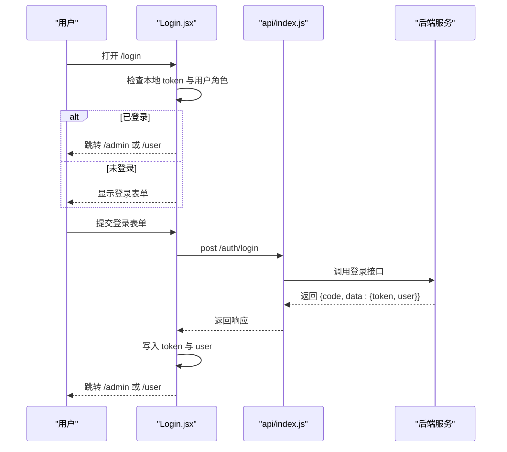
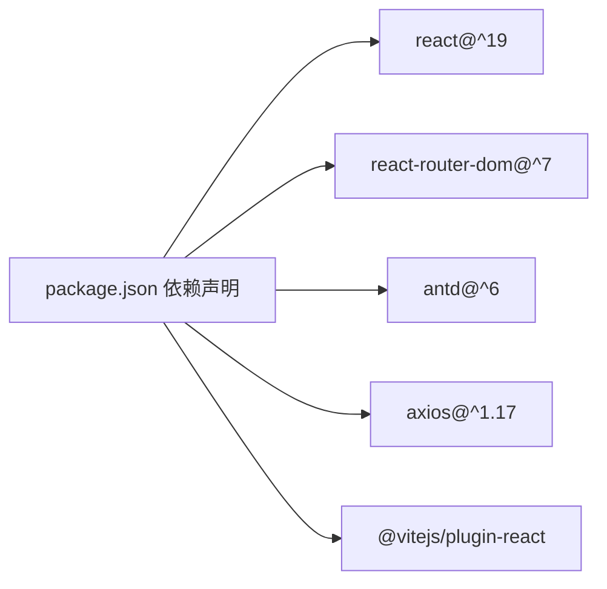

# 前端架构设计

<cite>
**本文档引用的文件**
- [App.jsx](file://client/src/App.jsx)
- [main.jsx](file://client/src/main.jsx)
- [AdminLayout.jsx](file://client/src/layouts/AdminLayout.jsx)
- [UserLayout.jsx](file://client/src/layouts/UserLayout.jsx)
- [Login.jsx](file://client/src/pages/Login.jsx)
- [api/index.js](file://client/src/api/index.js)
- [theme.js](file://client/src/theme.js)
- [package.json](file://client/package.json)
</cite>

## 目录
1. [引言](#引言)
2. [项目结构](#项目结构)
3. [核心组件](#核心组件)
4. [架构总览](#架构总览)
5. [详细组件分析](#详细组件分析)
6. [依赖关系分析](#依赖关系分析)
7. [性能考虑](#性能考虑)
8. [故障排除指南](#故障排除指南)
9. [结论](#结论)

## 引言
本文件为 SY-Q 做账管理系统的前端架构设计文档，重点阐述基于 React 的应用结构、路由体系与权限控制、管理员与用户双布局设计、API 客户端封装与拦截器机制，以及前端状态管理与组件通信策略。该系统采用 React 19、React Router 7、Ant Design 6 与 Vite 构建，提供桌面端与移动端适配的双布局体验。

## 项目结构
前端代码位于 client 目录，采用按功能分层的组织方式：
- 根入口与主题配置：main.jsx、theme.js
- 路由与根组件：App.jsx
- 布局层：AdminLayout.jsx、UserLayout.jsx
- 页面层：Login.jsx 及各业务页面（管理员与用户两类）
- API 层：api/index.js 封装 axios 实例与拦截器
- 静态资源与构建：index.html、package.json、vite.config.js

**图表来源**
- [main.jsx:1-14](file://client/src/main.jsx#L1-L14)
- [theme.js:1-61](file://client/src/theme.js#L1-L61)
- [App.jsx:1-67](file://client/src/App.jsx#L1-L67)
- [AdminLayout.jsx:1-174](file://client/src/layouts/AdminLayout.jsx#L1-L174)
- [UserLayout.jsx:1-162](file://client/src/layouts/UserLayout.jsx#L1-L162)
- [Login.jsx:1-68](file://client/src/pages/Login.jsx#L1-L68)
- [api/index.js:1-42](file://client/src/api/index.js#L1-L42)

**章节来源**
- [main.jsx:1-14](file://client/src/main.jsx#L1-L14)
- [theme.js:1-61](file://client/src/theme.js#L1-L61)
- [App.jsx:1-67](file://client/src/App.jsx#L1-L67)

## 核心组件
- 根组件与路由：App.jsx 使用 React Router 7 的 BrowserRouter、Routes、Route 组织路径映射，定义登录页、管理员与用户两条主路由，并通过私有路由包装实现基础鉴权跳转。
- 私有路由保护：App.jsx 内部定义 PrivateRoute，读取本地存储中的 token，无 token 则重定向至登录页。
- 布局组件：AdminLayout.jsx 与 UserLayout.jsx 分别承载管理员与用户的侧边导航、头部用户信息、内容区 Outlet，支持桌面端侧边栏与移动端抽屉两种交互形态。
- API 客户端：api/index.js 创建 axios 实例，统一设置 baseURL、超时时间；请求拦截器注入 Authorization 头；响应拦截器处理 401 与业务错误码，统一提示与登出逻辑。
- 主题与国际化：main.jsx 通过 Ant Design ConfigProvider 注入主题与中文语言包，theme.js 提供 token 与组件级样式覆盖。

**章节来源**
- [App.jsx:26-67](file://client/src/App.jsx#L26-L67)
- [AdminLayout.jsx:16-174](file://client/src/layouts/AdminLayout.jsx#L16-L174)
- [UserLayout.jsx:16-162](file://client/src/layouts/UserLayout.jsx#L16-L162)
- [api/index.js:1-42](file://client/src/api/index.js#L1-L42)
- [main.jsx:1-14](file://client/src/main.jsx#L1-L14)
- [theme.js:1-61](file://client/src/theme.js#L1-L61)

## 架构总览
系统采用“路由驱动 + 布局分层 + API 客户端”的三层架构：
- 路由层：集中于 App.jsx，负责路径匹配、嵌套路由与私有路由保护。
- 布局层：AdminLayout 与 UserLayout 提供各自的功能菜单与导航，共享通用头部与底部结构。
- 数据访问层：api/index.js 封装 axios，统一处理认证与错误。

**图表来源**
- [App.jsx:32-64](file://client/src/App.jsx#L32-L64)
- [AdminLayout.jsx:116-172](file://client/src/layouts/AdminLayout.jsx#L116-L172)
- [UserLayout.jsx:106-159](file://client/src/layouts/UserLayout.jsx#L106-L159)
- [api/index.js:4-39](file://client/src/api/index.js#L4-L39)

## 详细组件分析

### 路由系统与私有路由保护
- 路由组织：App.jsx 定义 /login、/admin 与 /user 三条主路由，其中 /admin 与 /user 通过 PrivateRoute 包裹，实现基础的令牌校验。
- 嵌套路由：在 /admin 与 /user 下分别嵌套多个子路由，对应不同业务页面，index 路由作为默认子页面。
- 动态路由：当前实现以静态路径为主，未见动态参数路由（如 :id）。若需扩展，可在现有结构上增加 path 参数并配合页面内的 useParams 使用。
- 权限控制：AdminLayout 与 UserLayout 在挂载时读取本地用户角色，非目标角色自动跳转至另一条主路由，形成二次校验。

**图表来源**
- [App.jsx:26-60](file://client/src/App.jsx#L26-L60)
- [Login.jsx:12-25](file://client/src/pages/Login.jsx#L12-L25)
- [AdminLayout.jsx:36-42](file://client/src/layouts/AdminLayout.jsx#L36-L42)
- [UserLayout.jsx:25-41](file://client/src/layouts/UserLayout.jsx#L25-L41)

**章节来源**
- [App.jsx:32-64](file://client/src/App.jsx#L32-L64)
- [Login.jsx:12-25](file://client/src/pages/Login.jsx#L12-L25)
- [AdminLayout.jsx:36-42](file://client/src/layouts/AdminLayout.jsx#L36-L42)
- [UserLayout.jsx:25-41](file://client/src/layouts/UserLayout.jsx#L25-L41)

### 管理员布局（AdminLayout）与用户布局（UserLayout）对比
- 共同点
  - 均包含 Layout 结构（Sider/Header/Content/Footer），支持桌面端侧边栏与移动端抽屉。
  - 均从本地存储读取用户信息，显示头像与用户名。
  - 均通过 api.get('/settings') 获取系统名称并设置页面标题。
  - 均提供下拉菜单“退出系统”，清理本地 token 与用户信息并跳转登录。
- 差异点
  - 菜单项与路由路径：AdminLayout 菜单项更丰富，覆盖公司、客户、产品、出入库、仓库、费用、数据中心等；UserLayout 菜单项聚焦用户日常操作（密码修改、商品、出入库、仓库、费用、数据中心）。
  - 角色校验：AdminLayout 在挂载时检测用户角色是否为 admin，否则跳转 /user；UserLayout 检测是否为普通用户，否则跳转 /admin。
  - 响应式行为：两者均监听窗口尺寸，小于断点时使用抽屉替代侧边栏。

**图表来源**
- [AdminLayout.jsx:16-174](file://client/src/layouts/AdminLayout.jsx#L16-L174)
- [UserLayout.jsx:16-162](file://client/src/layouts/UserLayout.jsx#L16-L162)

**章节来源**
- [AdminLayout.jsx:16-174](file://client/src/layouts/AdminLayout.jsx#L16-L174)
- [UserLayout.jsx:16-162](file://client/src/layouts/UserLayout.jsx#L16-L162)

### API 客户端配置与使用模式
- 实例化：创建 axios 实例，baseURL 设为 /api，超时 30 秒。
- 请求拦截器：从本地存储读取 token 并注入 Authorization 头。
- 响应拦截器：
  - 业务错误：当响应数据包含 code 字段且不为 0 时，统一返回数据（便于页面自行判断）。
  - 认证失效：当 code 为 401 或响应状态为 401 时，清除本地 token 与用户信息，并跳转到 /login。
  - 网络异常：弹出错误消息并拒绝 Promise。
- 使用方式：各页面通过导入 api 实例发起请求，无需关心认证与错误处理细节。

**图表来源**
- [api/index.js:9-39](file://client/src/api/index.js#L9-L39)

**章节来源**
- [api/index.js:1-42](file://client/src/api/index.js#L1-L42)

### 登录流程与系统名称加载
- 自动跳转：进入 /login 时，若本地存在 token 与用户角色，根据角色自动跳转到 /admin 或 /user。
- 系统名称：首次加载时调用公开接口 /api/settings/system-name 获取系统名称并设置 document.title。
- 登录提交：通过 api.post('/auth/login') 发起登录，成功后写入 token 与用户信息，并根据角色跳转相应主路由。

**图表来源**
- [Login.jsx:12-43](file://client/src/pages/Login.jsx#L12-L43)
- [api/index.js:4-39](file://client/src/api/index.js#L4-L39)

**章节来源**
- [Login.jsx:12-43](file://client/src/pages/Login.jsx#L12-L43)

### 主题与国际化配置
- 主题：theme.js 定义 token 与组件级样式覆盖，包括颜色、圆角、字体与各组件（Layout、Menu、Card、Button、Input、Table、Modal）的样式。
- 国际化：main.jsx 通过 ConfigProvider 注入 zhCN 语言包与自定义主题配置，确保全局 UI 一致性。

**章节来源**
- [theme.js:1-61](file://client/src/theme.js#L1-L61)
- [main.jsx:1-14](file://client/src/main.jsx#L1-L14)

## 依赖关系分析
- React 生态：React 19、React Router 7、Ant Design 6、Axios、Day.js、Recharts、XLSX。
- 构建工具：Vite，脚手架基于 @vitejs/plugin-react。
- 关键耦合点：
  - App.jsx 与布局组件之间通过 Outlet 传递上下文（仅 AdminLayout 使用），用于系统名称刷新。
  - 布局组件与 API 客户端之间存在直接依赖，用于加载系统设置。
  - 登录组件与 API 客户端直接交互，负责认证与角色跳转。

**图表来源**
- [package.json:11-25](file://client/package.json#L11-L25)

**章节来源**
- [package.json:1-27](file://client/package.json#L1-L27)

## 性能考虑
- 路由懒加载：当前所有页面在根路由中直接导入，建议对大型页面或不常用页面进行动态导入以减少首屏体积。
- 响应拦截器：已内置统一错误处理与 401 自动登出，避免重复逻辑，降低维护成本。
- 主题与国际化：通过 ConfigProvider 一次性注入，避免重复渲染与样式抖动。
- 移动端优化：布局组件已针对小屏设备使用抽屉替代侧边栏，减少布局计算复杂度。

## 故障排除指南
- 登录后无法进入后台
  - 检查本地是否存在 token 与 user；确认用户角色是否正确。
  - 若出现 401，确认响应拦截器是否执行了自动登出逻辑。
- 系统名称未显示
  - 确认 /api/settings 接口返回值与字段名一致；检查响应拦截器是否正确处理了业务数据。
- 移动端菜单不可用
  - 检查窗口尺寸是否小于断点；确认抽屉状态 drawerOpen 是否被正确控制。
- Axios 请求失败
  - 查看网络面板与拦截器日志；确认 baseURL 与代理配置是否正确。

**章节来源**
- [AdminLayout.jsx:36-42](file://client/src/layouts/AdminLayout.jsx#L36-L42)
- [UserLayout.jsx:25-41](file://client/src/layouts/UserLayout.jsx#L25-L41)
- [api/index.js:17-39](file://client/src/api/index.js#L17-L39)

## 结论
本前端架构以 React Router 7 为核心，结合 Ant Design 提供一致的 UI 体验，通过 axios 封装与拦截器实现统一的认证与错误处理。管理员与用户双布局满足不同角色的业务需求，响应式设计兼顾桌面端与移动端。建议后续引入路由懒加载与状态管理方案（如 Zustand 或 Redux Toolkit）以进一步提升性能与可维护性。