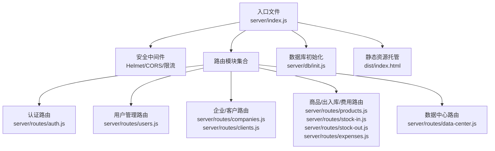
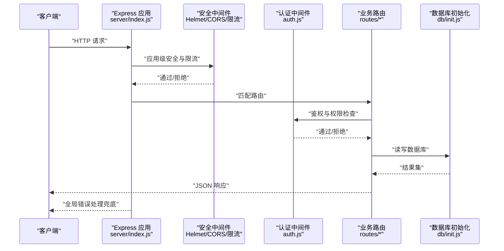
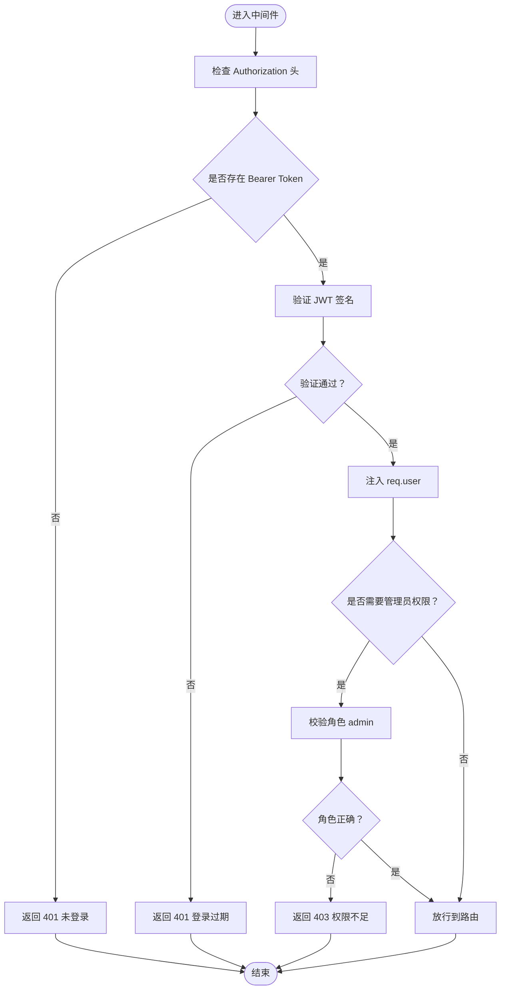
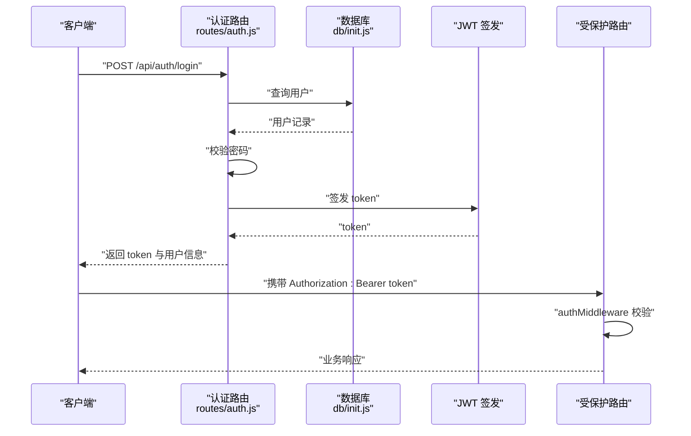
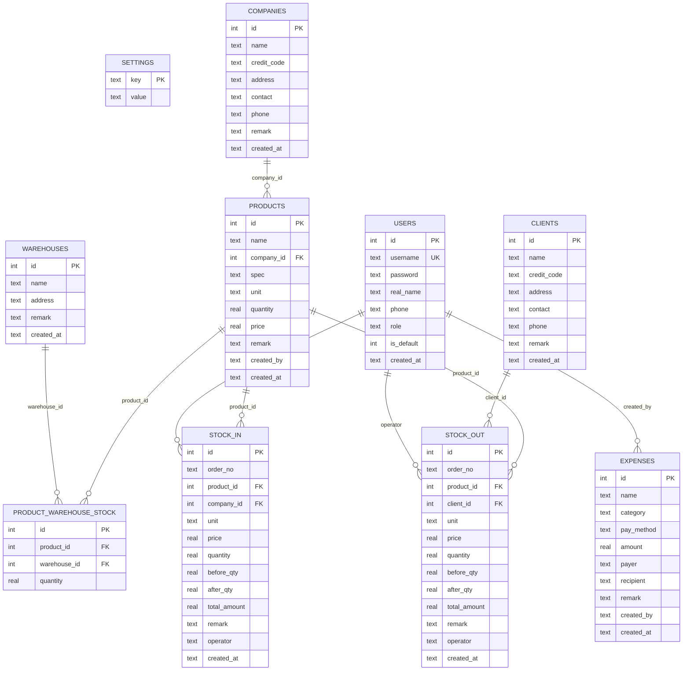
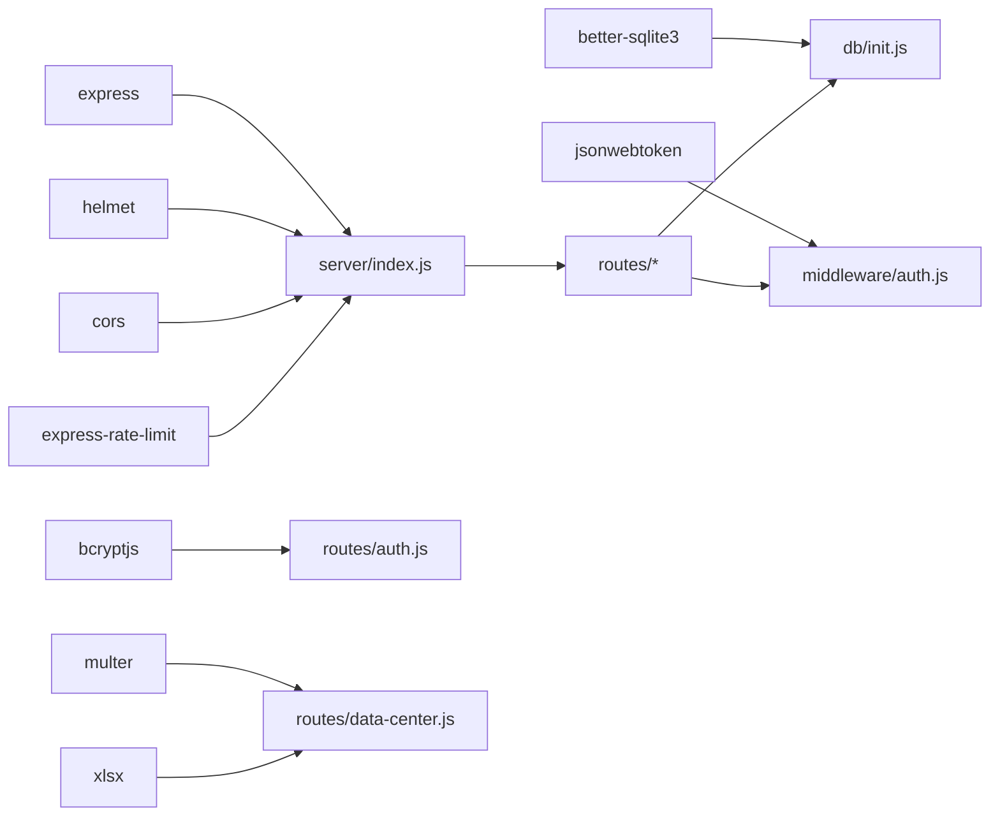

# 后端架构设计

<cite>
**本文档引用的文件**
- [server/index.js](file://server/index.js)
- [server/middleware/auth.js](file://server/middleware/auth.js)
- [server/db/init.js](file://server/db/init.js)
- [server/package.json](file://server/package.json)
- [package.json](file://package.json)
- [server/routes/auth.js](file://server/routes/auth.js)
- [server/routes/users.js](file://server/routes/users.js)
- [server/routes/companies.js](file://server/routes/companies.js)
- [server/routes/clients.js](file://server/routes/clients.js)
- [server/routes/data-center.js](file://server/routes/data-center.js)
- [server/routes/products.js](file://server/routes/products.js)
- [server/routes/stock-in.js](file://server/routes/stock-in.js)
- [server/routes/stock-out.js](file://server/routes/stock-out.js)
- [server/routes/expenses.js](file://server/routes/expenses.js)
</cite>

## 目录
1. [简介](#简介)
2. [项目结构](#项目结构)
3. [核心组件](#核心组件)
4. [架构总览](#架构总览)
5. [详细组件分析](#详细组件分析)
6. [依赖关系分析](#依赖关系分析)
7. [性能考虑](#性能考虑)
8. [故障排查指南](#故障排查指南)
9. [结论](#结论)

## 简介
本文件为 SY-Q 做账管理系统的后端架构设计文档，聚焦于 Express 应用的架构模式与实现细节，涵盖中间件体系、路由模块与控制器层设计、认证与权限控制、数据库初始化与表结构、SQLite 选型与优势、安全设计（含 Helmet、CORS、速率限制与输入校验）、以及错误处理与日志记录策略。文档旨在帮助开发者快速理解系统整体设计，并为后续扩展与维护提供参考。

## 项目结构
后端采用典型的分层架构：
- 入口文件负责应用初始化、中间件注册、路由挂载与静态资源托管
- 中间件层提供认证与权限控制
- 路由层按业务域划分模块，每个模块包含对应的控制器逻辑
- 数据访问层封装数据库初始化与表结构迁移
- 包管理器统一管理依赖

图表来源
- [server/index.js:1-120](file://server/index.js#L1-L120)
- [server/db/init.js:1-217](file://server/db/init.js#L1-L217)

章节来源
- [server/index.js:1-120](file://server/index.js#L1-L120)
- [server/package.json:1-26](file://server/package.json#L1-L26)
- [package.json:1-13](file://package.json#L1-L13)

## 核心组件
- Express 应用与中间件栈
  - 安全响应头：启用 Helmet 并关闭严格 CSP 与跨域嵌入策略，适配同源部署场景
  - CORS：基于白名单与子域名规则进行来源校验，支持 Render 域名与额外自定义域名
  - 请求体大小限制：JSON 最大 2MB
  - 速率限制：登录接口每 IP 每分钟最多 10 次；全局 API 每 IP 每分钟最多 120 次
- 路由模块化：按业务域拆分，统一使用鉴权中间件，部分管理功能附加管理员权限
- 认证中间件：基于 JWT 的 Token 验证与角色权限控制
- 数据库初始化：SQLite + better-sqlite3，WAL 模式与外键约束开启，自动建表与迁移
- 错误处理：全局错误捕获与 CORS 特殊错误码返回

章节来源
- [server/index.js:11-115](file://server/index.js#L11-L115)
- [server/middleware/auth.js:1-29](file://server/middleware/auth.js#L1-L29)
- [server/db/init.js:18-214](file://server/db/init.js#L18-L214)

## 架构总览
系统采用“入口 -> 中间件 -> 路由 -> 控制器 -> 数据库”的线性调用链路，配合速率限制与 CORS 白名单保障安全性与稳定性。

图表来源
- [server/index.js:65-95](file://server/index.js#L65-L95)
- [server/middleware/auth.js:5-26](file://server/middleware/auth.js#L5-L26)
- [server/db/init.js:9-16](file://server/db/init.js#L9-L16)

## 详细组件分析

### 中间件系统
- 安全中间件
  - Helmet：设置安全响应头，关闭严格 CSP 以适配前端同域部署
  - CORS：允许本地开发与 Render 域名，支持通配子域名，非允许来源返回 403
  - 速率限制：登录接口独立限流，全局 API 统一限流
- 认证中间件
  - 从 Authorization 头提取 Bearer Token，未提供或无效返回 401
  - 使用对称密钥验证 JWT，解码后注入 req.user，后续路由可访问用户信息
  - 管理员中间件：校验角色为 admin，否则返回 403
- 输入校验
  - 路由层对必填参数进行基础校验（如用户名/密码、商品名称、金额等）
  - 上传文件类型限制与大小限制（Excel/DB 文件）

图表来源
- [server/middleware/auth.js:5-26](file://server/middleware/auth.js#L5-L26)

章节来源
- [server/index.js:11-63](file://server/index.js#L11-L63)
- [server/middleware/auth.js:1-29](file://server/middleware/auth.js#L1-L29)

### 路由模块与控制器层
- 路由组织
  - 每个业务域一个路由文件，统一引入认证中间件，管理员功能附加管理员中间件
  - 路由前缀规范：/api/{domain}，便于前端统一管理
- 控制器职责
  - 登录：校验凭据、生成 JWT、返回用户信息
  - 修改密码：旧密码校验、新密码长度校验、哈希更新
  - 列表查询：关键词检索、分页计算、关联表查询
  - 新增/修改/删除：唯一性校验、事务处理（出入库）、删除前置条件检查
  - 数据中心：Excel 导出、模板下载、商品批量导入、数据库备份/恢复/重置

```mermaid
classDiagram
class AuthController {
+登录(loginReq) LoginResp
+修改密码(changePwdReq) BaseResp
+获取当前用户(meReq) UserInfoResp
}
class UserController {
+获取用户列表(listUsersReq) ListResp
+新增用户(createUserReq) BaseResp
+修改用户(updateUserReq) BaseResp
+删除用户(deleteUserReq) BaseResp
}
class CompanyController {
+获取公司列表(listCompaniesReq) ListResp
+获取全部公司(allReq) ListResp
+查找或创建(findOrCreateReq) FindOrCreatedResp
+新增公司(createCompanyReq) BaseResp
+修改公司(updateCompanyReq) BaseResp
+删除公司(deleteCompanyReq) BaseResp
}
class ClientController {
+获取客户列表(listClientsReq) ListResp
+获取全部客户(allReq) ListResp
+新增客户(createClientReq) BaseResp
+修改客户(updateClientReq) BaseResp
+删除客户(deleteClientReq) BaseResp
}
class ProductController {
+获取商品列表(listProductsReq) ListResp
+新增商品(createProductReq) BaseResp
+修改商品(updateProductReq) BaseResp
+删除商品(deleteProductReq) BaseResp
}
class StockInController {
+生成单号(generateOrderNoReq) OrderNoResp
+获取入库单列表(listOrdersReq) ListResp
+获取入库明细(orderNoReq) ListResp
+批量入库(batchInReq) BaseResp
}
class StockOutController {
+生成单号(generateOrderNoReq) OrderNoResp
+获取出库单列表(listOrdersReq) ListResp
+获取出库明细(orderNoReq) ListResp
+批量出库(batchOutReq) BaseResp
}
class ExpenseController {
+获取开销列表(listExpensesReq) ListResp
+新增开销(createExpenseReq) BaseResp
+修改开销(updateExpenseReq) BaseResp
+删除开销(deleteExpenseReq) BaseResp
}
class DataCenterController {
+导出Excel(type) Buffer
+下载模板(type) Buffer
+导入商品(file) BaseResp
+备份数据库() BaseResp
+获取备份列表() ListResp
+恢复数据库(fileOrName) BaseResp
+重置数据库() BaseResp
}
```

图表来源
- [server/routes/auth.js:8-66](file://server/routes/auth.js#L8-L66)
- [server/routes/users.js:9-84](file://server/routes/users.js#L9-L84)
- [server/routes/companies.js:8-101](file://server/routes/companies.js#L8-L101)
- [server/routes/clients.js:8-78](file://server/routes/clients.js#L8-L78)
- [server/routes/products.js:8-95](file://server/routes/products.js#L8-L95)
- [server/routes/stock-in.js:25-170](file://server/routes/stock-in.js#L25-L170)
- [server/routes/stock-out.js:25-175](file://server/routes/stock-out.js#L25-L175)
- [server/routes/expenses.js:8-70](file://server/routes/expenses.js#L8-L70)
- [server/routes/data-center.js:28-235](file://server/routes/data-center.js#L28-L235)

章节来源
- [server/routes/auth.js:1-69](file://server/routes/auth.js#L1-L69)
- [server/routes/users.js:1-87](file://server/routes/users.js#L1-L87)
- [server/routes/companies.js:1-104](file://server/routes/companies.js#L1-L104)
- [server/routes/clients.js:1-81](file://server/routes/clients.js#L1-L81)
- [server/routes/products.js:1-98](file://server/routes/products.js#L1-L98)
- [server/routes/stock-in.js:1-173](file://server/routes/stock-in.js#L1-L173)
- [server/routes/stock-out.js:1-178](file://server/routes/stock-out.js#L1-L178)
- [server/routes/expenses.js:1-73](file://server/routes/expenses.js#L1-L73)
- [server/routes/data-center.js:1-260](file://server/routes/data-center.js#L1-L260)

### 认证与权限控制
- 登录流程
  - 校验必填参数，查询用户并比对密码，成功后签发 JWT（有效期 24 小时），返回用户信息
- Token 解析与校验
  - 从 Authorization 头解析 Bearer Token，验证签名，失败返回 401
- 角色权限
  - 管理员中间件校验角色，非管理员访问受限接口返回 403
- 安全实践
  - 仅从头部获取 Token，避免 URL 泄露
  - 默认密钥用于开发环境，建议在生产环境使用环境变量注入

图表来源
- [server/routes/auth.js:8-40](file://server/routes/auth.js#L8-L40)
- [server/middleware/auth.js:5-19](file://server/middleware/auth.js#L5-L19)
- [server/db/init.js:197-205](file://server/db/init.js#L197-L205)

章节来源
- [server/routes/auth.js:8-66](file://server/routes/auth.js#L8-L66)
- [server/middleware/auth.js:1-29](file://server/middleware/auth.js#L1-L29)

### 数据库初始化与表结构设计
- 初始化流程
  - 单例数据库连接，WAL 模式与外键约束开启
  - 自动创建核心表：用户、系统设置、库房、商品、出入库明细、日常开销、商品库房库存映射
  - 表结构迁移：为历史版本补充新增字段（如出入库单号、库房字段、开销分类与收款人）
  - 默认数据：插入默认管理员账号与系统名称
- 表结构概览
  - 用户表：主键自增、唯一用户名、角色枚举、默认管理员标记
  - 系统设置：键值对配置
  - 库房表：名称、地址、备注
  - 商品表：名称、公司关联、规格/单位、数量/单价、记录人
  - 商品库房库存映射：产品-库房唯一约束，外键关联
  - 入库明细：单号、商品/公司/库房关联、单价/数量/前后数量/合计金额、操作人
  - 出库明细：单号、商品/客户关联、单价/数量/前后数量/合计金额、操作人
  - 日常开销：名称、分类、支付方式、金额、付款人/收款人、备注、记录人
- SQLite 选型与优势
  - 零配置、无需服务进程、文件即库，适合中小规模业务与单机部署
  - WAL 模式提升并发读写性能，外键约束保证数据一致性
  - 与 better-sqlite3 结合，提供高性能同步 API

图表来源
- [server/db/init.js:21-186](file://server/db/init.js#L21-L186)

章节来源
- [server/db/init.js:18-214](file://server/db/init.js#L18-L214)

### 安全设计
- Helmet：设置安全响应头，关闭严格 CSP 与跨域嵌入策略，适配同源部署
- CORS：允许本地与 Render 域名，支持 .onrender.com 子域名，非允许来源返回 403
- 速率限制：登录接口每 IP 每分钟最多 10 次；全局 API 每 IP 每分钟最多 120 次
- 上传安全：限制文件类型与大小，恢复接口进行路径穿越防护
- 输入校验：路由层对必填字段与业务规则进行校验，避免脏数据进入数据库

章节来源
- [server/index.js:11-63](file://server/index.js#L11-L63)
- [server/routes/data-center.js:13-26](file://server/routes/data-center.js#L13-L26)
- [server/routes/data-center.js:196-235](file://server/routes/data-center.js#L196-L235)

### 错误处理与日志记录
- 全局错误处理：捕获 CORS 与未知异常，输出统一 JSON 结构；CORS 拒绝来源返回 403
- 日志记录：服务器错误打印到控制台，便于运维定位问题
- 建议：生产环境可接入结构化日志组件（如 winston/pino）与错误追踪平台

章节来源
- [server/index.js:108-115](file://server/index.js#L108-L115)

## 依赖关系分析
- 依赖清单
  - Express：Web 框架
  - Helmet：安全响应头
  - CORS：跨域控制
  - express-rate-limit：速率限制
  - better-sqlite3：SQLite 驱动
  - bcryptjs：密码哈希
  - jsonwebtoken：JWT 签发与校验
  - multer/xlsx：文件上传与 Excel 导入导出
- 内部依赖
  - 路由依赖中间件与数据库初始化模块
  - 认证中间件依赖 JWT 与数据库模块

图表来源
- [server/package.json:14-24](file://server/package.json#L14-L24)
- [server/index.js:65-95](file://server/index.js#L65-L95)
- [server/routes/auth.js:1-6](file://server/routes/auth.js#L1-L6)
- [server/middleware/auth.js:1](file://server/middleware/auth.js#L1)
- [server/db/init.js:1-3](file://server/db/init.js#L1-L3)
- [server/routes/data-center.js:1-9](file://server/routes/data-center.js#L1-L9)

章节来源
- [server/package.json:1-26](file://server/package.json#L1-L26)
- [package.json:1-13](file://package.json#L1-L13)

## 性能考虑
- 数据库
  - WAL 模式提升并发读写吞吐
  - 外键约束保障一致性，但会增加写入成本，建议在导入/批量写入时使用事务
  - 为高频查询字段建立索引（如单号、名称、时间戳）可进一步优化
- 接口
  - 分页查询避免一次性加载大量数据
  - 批量导入/导出使用流式处理，减少内存占用
- 缓存
  - 对只读配置与字典类数据可引入内存缓存，降低数据库压力

## 故障排查指南
- 登录失败
  - 检查用户名/密码是否为空，确认用户是否存在且密码正确
  - 若提示登录过期，重新登录获取新 Token
- 权限不足
  - 确认用户角色为 admin，或移除管理员中间件装饰
- CORS 报错
  - 检查请求来源是否在白名单内，或是否携带了允许的 Origin
- 上传失败
  - 确认文件类型为 .xlsx/.xls/.db，大小不超过 50MB
  - 恢复接口需确保文件名合法且位于备份目录
- 数据库异常
  - 备份/恢复后需重新初始化数据库连接
  - 恢复前请做好数据备份，避免不可逆损失

章节来源
- [server/routes/auth.js:9-21](file://server/routes/auth.js#L9-L21)
- [server/middleware/auth.js:21-26](file://server/middleware/auth.js#L21-L26)
- [server/index.js:18-41](file://server/index.js#L18-L41)
- [server/routes/data-center.js:13-26](file://server/routes/data-center.js#L13-L26)
- [server/routes/data-center.js:196-235](file://server/routes/data-center.js#L196-L235)
- [server/db/init.js:229-230](file://server/db/init.js#L229-L230)

## 结论
本架构以 Express 为核心，结合 Helmet、CORS、速率限制与 JWT 实现安全可控的后端服务；路由按业务域模块化，控制器层承担数据校验与事务处理；SQLite 作为数据存储具备零配置与高并发读写的优点。通过合理的中间件与错误处理策略，系统在开发与生产环境中均具备良好的可维护性与扩展性。建议在生产环境增强日志与监控能力，并根据业务增长逐步引入缓存与索引优化。