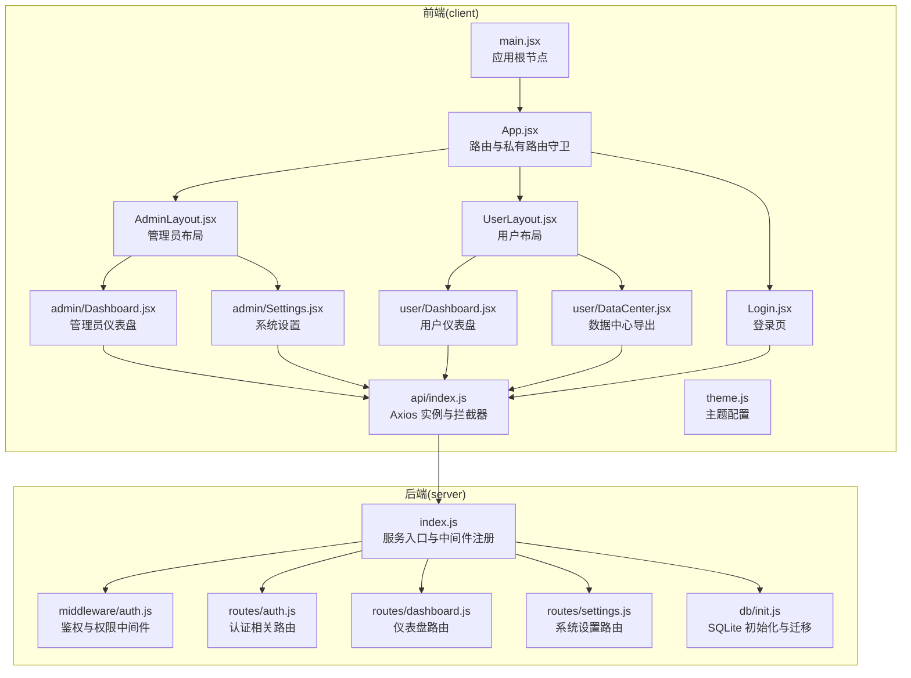
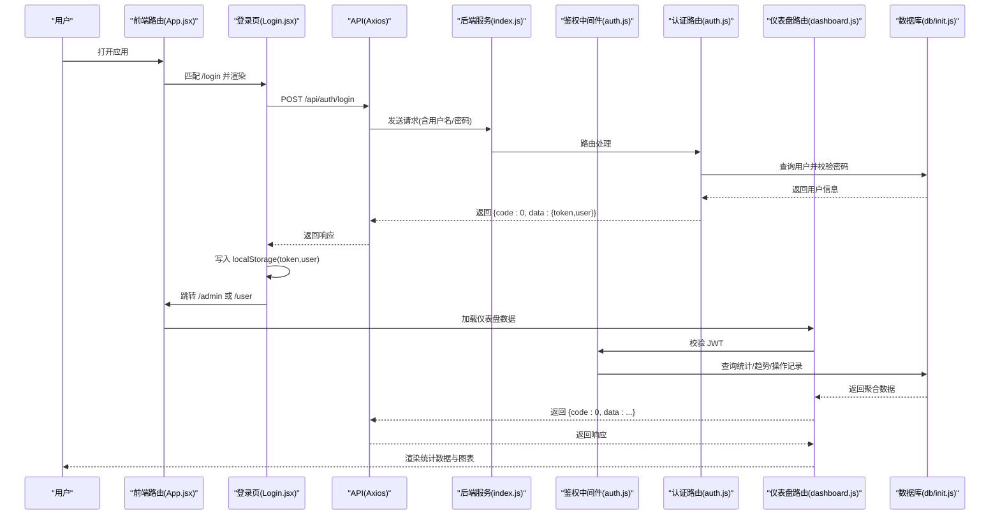
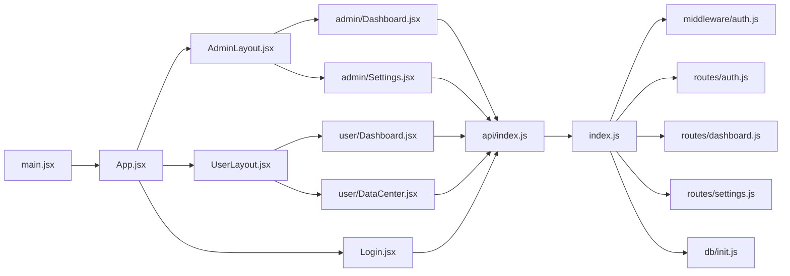

# 数据流设计

<cite>
**本文引用的文件**
- [client/src/main.jsx](file://client/src/main.jsx)
- [client/src/App.jsx](file://client/src/App.jsx)
- [client/src/api/index.js](file://client/src/api/index.js)
- [client/src/pages/Login.jsx](file://client/src/pages/Login.jsx)
- [client/src/layouts/AdminLayout.jsx](file://client/src/layouts/AdminLayout.jsx)
- [client/src/layouts/UserLayout.jsx](file://client/src/layouts/UserLayout.jsx)
- [client/src/pages/admin/Dashboard.jsx](file://client/src/pages/admin/Dashboard.jsx)
- [client/src/pages/user/Dashboard.jsx](file://client/src/pages/user/Dashboard.jsx)
- [client/src/pages/admin/Settings.jsx](file://client/src/pages/admin/Settings.jsx)
- [client/src/pages/user/DataCenter.jsx](file://client/src/pages/user/DataCenter.jsx)
- [client/src/theme.js](file://client/src/theme.js)
- [server/index.js](file://server/index.js)
- [server/middleware/auth.js](file://server/middleware/auth.js)
- [server/routes/auth.js](file://server/routes/auth.js)
- [server/routes/dashboard.js](file://server/routes/dashboard.js)
- [server/routes/settings.js](file://server/routes/settings.js)
- [server/db/init.js](file://server/db/init.js)
</cite>

## 目录
1. [引言](#引言)
2. [项目结构](#项目结构)
3. [核心组件](#核心组件)
4. [架构总览](#架构总览)
5. [详细组件分析](#详细组件分析)
6. [依赖关系分析](#依赖关系分析)
7. [性能考虑](#性能考虑)
8. [故障排查指南](#故障排查指南)
9. [结论](#结论)
10. [附录](#附录)

## 引言
本文件面向 SY-Q 做账管理系统，提供从前端用户请求到后端数据库操作的完整数据流设计文档。重点覆盖以下方面：
- 前端路由解析与导航
- API 请求发送与拦截器
- 认证中间件与权限控制
- 后端路由处理与数据库访问
- 数据在各层之间的传递方式（参数、状态、响应）
- 异步数据加载与状态更新（React Hooks、消息提示）
- 错误处理与异常数据流

## 项目结构
系统采用前后端分离架构：
- 前端基于 React + Ant Design，使用 Vite 构建，通过 Axios 发起 API 请求，并以拦截器统一注入鉴权头与错误处理。
- 后端基于 Express，内置安全中间件、CORS、限流与全局错误处理；路由按功能模块划分，数据库使用 SQLite（better-sqlite3），初始化脚本包含多张业务表及迁移逻辑。

图表来源
- [client/src/main.jsx:1-14](file://client/src/main.jsx#L1-L14)
- [client/src/App.jsx:1-67](file://client/src/App.jsx#L1-L67)
- [client/src/api/index.js:1-42](file://client/src/api/index.js#L1-L42)
- [server/index.js:1-120](file://server/index.js#L1-L120)
- [server/middleware/auth.js:1-29](file://server/middleware/auth.js#L1-L29)
- [server/routes/auth.js:1-69](file://server/routes/auth.js#L1-L69)
- [server/routes/dashboard.js:1-92](file://server/routes/dashboard.js#L1-L92)
- [server/routes/settings.js:1-34](file://server/routes/settings.js#L1-L34)
- [server/db/init.js:1-217](file://server/db/init.js#L1-L217)

章节来源
- [client/src/main.jsx:1-14](file://client/src/main.jsx#L1-L14)
- [client/src/App.jsx:1-67](file://client/src/App.jsx#L1-L67)
- [server/index.js:1-120](file://server/index.js#L1-L120)

## 核心组件
- 前端应用根节点与主题配置：负责应用初始化、国际化与主题注入。
- 路由与守卫：基于 React Router DOM 的路由表与私有路由守卫，结合本地存储令牌进行登录态判断。
- API 客户端：基于 Axios 创建实例，统一设置基础路径、超时与请求/响应拦截器，自动注入 Authorization 头并在 401 时清理本地存储并跳转登录。
- 中间件与路由：后端 Express 中间件负责安全头、CORS、限流与全局错误处理；路由模块按领域拆分，数据库初始化与迁移在启动阶段完成。
- 数据库：SQLite 表结构覆盖用户、公司、客户、商品、出入库、开销等，支持迁移与默认数据插入。

章节来源
- [client/src/theme.js:1-61](file://client/src/theme.js#L1-L61)
- [client/src/App.jsx:26-30](file://client/src/App.jsx#L26-L30)
- [client/src/api/index.js:1-42](file://client/src/api/index.js#L1-L42)
- [server/index.js:11-115](file://server/index.js#L11-L115)
- [server/db/init.js:18-214](file://server/db/init.js#L18-L214)

## 架构总览
下图展示一次典型“登录”到“获取仪表盘数据”的端到端数据流，涵盖前端路由、API 请求、鉴权中间件、后端路由与数据库访问。

图表来源
- [client/src/App.jsx:32-64](file://client/src/App.jsx#L32-L64)
- [client/src/pages/Login.jsx:27-43](file://client/src/pages/Login.jsx#L27-L43)
- [client/src/api/index.js:4-39](file://client/src/api/index.js#L4-L39)
- [server/index.js:68-95](file://server/index.js#L68-L95)
- [server/middleware/auth.js:5-19](file://server/middleware/auth.js#L5-L19)
- [server/routes/auth.js:9-40](file://server/routes/auth.js#L9-L40)
- [server/routes/dashboard.js:9-60](file://server/routes/dashboard.js#L9-L60)
- [server/db/init.js:18-214](file://server/db/init.js#L18-L214)

## 详细组件分析

### 前端路由与私有路由守卫
- 路由表集中定义在应用根组件中，支持管理员与普通用户的独立布局与页面集合。
- 私有路由守卫通过读取本地存储中的 token 判断是否放行，未登录则重定向至登录页。
- 布局组件负责移动端/桌面端菜单切换、标题与系统名称加载、登出清理本地存储并跳转登录。

章节来源
- [client/src/App.jsx:32-64](file://client/src/App.jsx#L32-L64)
- [client/src/App.jsx:26-30](file://client/src/App.jsx#L26-L30)
- [client/src/layouts/AdminLayout.jsx:36-42](file://client/src/layouts/AdminLayout.jsx#L36-L42)
- [client/src/layouts/UserLayout.jsx:25-41](file://client/src/layouts/UserLayout.jsx#L25-L41)

### API 客户端与拦截器
- Axios 实例设置基础路径与超时，请求拦截器自动从本地存储读取 token 并注入 Authorization 头。
- 响应拦截器统一处理业务 code 与 401 场景：当 code=401 或响应状态为 401 时，清理本地存储并跳转登录；同时对错误进行消息提示。

章节来源
- [client/src/api/index.js:4-39](file://client/src/api/index.js#L4-L39)

### 登录流程与状态管理
- 登录页在提交前读取系统名称（公开接口），提交后根据返回结果写入 token 与用户信息，随后根据角色跳转对应工作台。
- 登录页使用受控表单与消息提示，避免重复提交。

章节来源
- [client/src/pages/Login.jsx:12-25](file://client/src/pages/Login.jsx#L12-L25)
- [client/src/pages/Login.jsx:27-43](file://client/src/pages/Login.jsx#L27-L43)

### 仪表盘数据加载与状态更新
- 管理员与用户仪表盘均通过 GET 请求拉取数据，使用 useState/useEffect 管理加载状态与数据，加载完成后渲染统计卡片、趋势图与近期操作。
- 管理员仪表盘包含商品总数、库存总金额、月度出入库额与量、开销、近7天趋势与近期操作；用户仪表盘包含个人录入商品数与月度收支。

章节来源
- [client/src/pages/admin/Dashboard.jsx:15-23](file://client/src/pages/admin/Dashboard.jsx#L15-L23)
- [client/src/pages/user/Dashboard.jsx:10-16](file://client/src/pages/user/Dashboard.jsx#L10-L16)
- [server/routes/dashboard.js:9-60](file://server/routes/dashboard.js#L9-L60)
- [server/routes/dashboard.js:63-89](file://server/routes/dashboard.js#L63-L89)

### 系统设置与数据中心导出
- 管理员可在系统设置页查看与更新系统名称，更新成功后通过父级布局提供的刷新函数同步标题与系统名。
- 用户可在数据中心导出指定类型的 Excel 数据，导出接口需要携带 Authorization 头，失败时给出消息提示。

章节来源
- [client/src/pages/admin/Settings.jsx:11-32](file://client/src/pages/admin/Settings.jsx#L11-L32)
- [client/src/layouts/AdminLayout.jsx:49-55](file://client/src/layouts/AdminLayout.jsx#L49-L55)
- [client/src/pages/user/DataCenter.jsx:6-29](file://client/src/pages/user/DataCenter.jsx#L6-L29)

### 后端路由与数据库访问
- 服务启动时注册安全中间件、CORS、限流与全局错误处理，并加载所有路由模块。
- 认证路由处理登录、修改密码与获取当前用户信息；仪表盘路由按角色查询聚合数据；系统设置路由提供公开与受控接口；数据库初始化包含多表与迁移逻辑。

章节来源
- [server/index.js:11-115](file://server/index.js#L11-L115)
- [server/index.js:68-95](file://server/index.js#L68-L95)
- [server/routes/auth.js:9-66](file://server/routes/auth.js#L9-L66)
- [server/routes/settings.js:7-31](file://server/routes/settings.js#L7-L31)
- [server/db/init.js:18-214](file://server/db/init.js#L18-L214)

### 鉴权中间件与权限控制
- 鉴权中间件从 Authorization 头提取 Bearer Token，校验失败返回 401；管理员中间件进一步校验角色。
- 登录接口对用户名与密码进行非空校验，查询用户并比对密码，签发 24 小时有效期 JWT；修改密码接口对旧密码校验并通过 bcrypt 更新新密码。

章节来源
- [server/middleware/auth.js:5-26](file://server/middleware/auth.js#L5-L26)
- [server/routes/auth.js:9-40](file://server/routes/auth.js#L9-L40)
- [server/routes/auth.js:43-59](file://server/routes/auth.js#L43-L59)

## 依赖关系分析
- 前端依赖关系：应用根节点 -> 路由与守卫 -> 布局与页面 -> API 客户端；API 客户端依赖 Axios 与 Ant Design 消息组件。
- 后端依赖关系：服务入口 -> 中间件与路由 -> 数据库初始化；路由模块依赖中间件与数据库初始化。

图表来源
- [client/src/main.jsx:1-14](file://client/src/main.jsx#L1-L14)
- [client/src/App.jsx:1-67](file://client/src/App.jsx#L1-L67)
- [client/src/api/index.js:1-42](file://client/src/api/index.js#L1-L42)
- [server/index.js:1-120](file://server/index.js#L1-L120)
- [server/middleware/auth.js:1-29](file://server/middleware/auth.js#L1-L29)
- [server/routes/auth.js:1-69](file://server/routes/auth.js#L1-L69)
- [server/routes/dashboard.js:1-92](file://server/routes/dashboard.js#L1-L92)
- [server/routes/settings.js:1-34](file://server/routes/settings.js#L1-L34)
- [server/db/init.js:1-217](file://server/db/init.js#L1-L217)

## 性能考虑
- 前端：使用 Axios 拦截器减少重复代码；页面组件按需加载数据，避免不必要的重渲染；图表组件使用响应式容器，提升移动端体验。
- 后端：启用 Helmet 安全头、CORS 白名单与限流策略，降低攻击面与滥用风险；数据库使用 WAL 模式与外键约束，保证并发与一致性。
- 缓存策略：前端未实现专用缓存，建议在高频读取场景引入内存缓存或浏览器缓存策略（如 ETag/Last-Modified），并结合路由参数变化进行失效控制。

## 故障排查指南
- 登录失败或频繁被踢出：
  - 检查前端是否正确写入 token 与用户信息，确认拦截器是否注入 Authorization 头。
  - 检查后端登录接口是否返回 401，确认用户名/密码是否正确。
- 401 未登录或会话过期：
  - 前端拦截器会在响应或状态码为 401 时清理本地存储并跳转登录。
  - 后端中间件校验失败也会返回 401，检查 Authorization 头格式与签名。
- 权限不足：
  - 管理员接口需 admin 角色，否则返回 403；确认用户角色与路由守卫逻辑。
- 导出失败：
  - 确认导出接口携带 Authorization 头且响应为 200；若失败，检查后端权限与文件生成逻辑。
- CORS 错误：
  - 后端已配置 CORS 白名单与兜底错误处理，检查请求来源是否在允许范围内。

章节来源
- [client/src/api/index.js:17-39](file://client/src/api/index.js#L17-L39)
- [server/middleware/auth.js:9-18](file://server/middleware/auth.js#L9-L18)
- [server/index.js:109-115](file://server/index.js#L109-L115)
- [client/src/pages/user/DataCenter.jsx:6-29](file://client/src/pages/user/DataCenter.jsx#L6-L29)

## 结论
本系统通过清晰的前后端职责划分与中间件/拦截器机制，实现了从路由到 API、从鉴权到数据库的稳定数据流。前端以 React Hooks 管理状态与异步加载，后端以模块化路由与数据库初始化保障可维护性。建议后续在前端引入更完善的缓存与错误边界，在后端增加更细粒度的速率限制与审计日志，持续优化用户体验与系统稳定性。

## 附录
- 主题配置：Ant Design 主题与组件样式定制，确保界面一致性和品牌风格。
- 数据模型概览：用户、公司、客户、商品、出入库、开销等核心实体，支持迁移与默认数据初始化。

章节来源
- [client/src/theme.js:1-61](file://client/src/theme.js#L1-L61)
- [server/db/init.js:21-211](file://server/db/init.js#L21-L211)