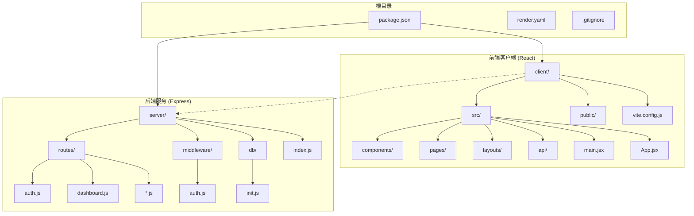
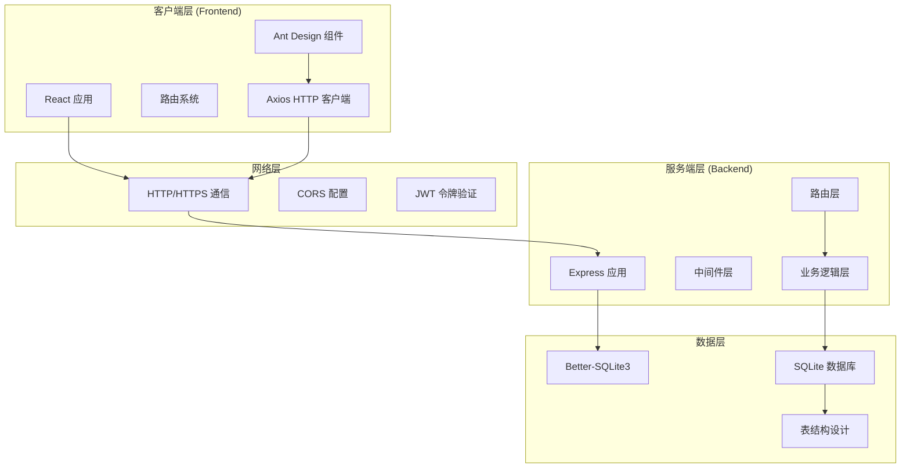
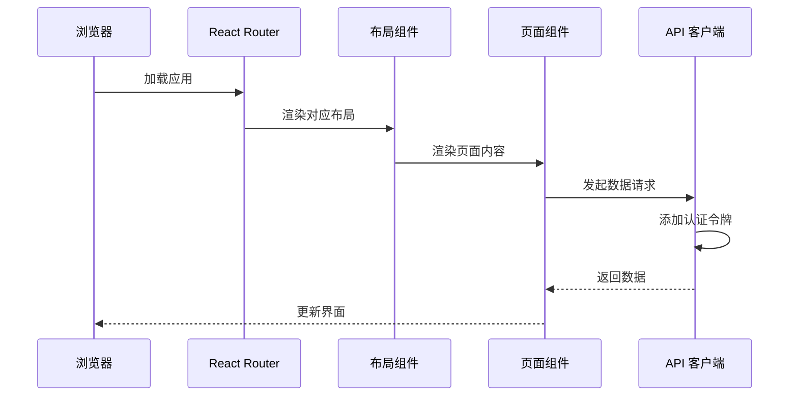
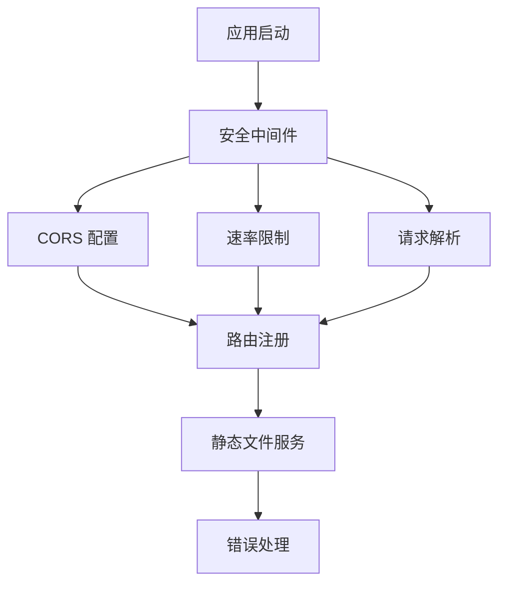
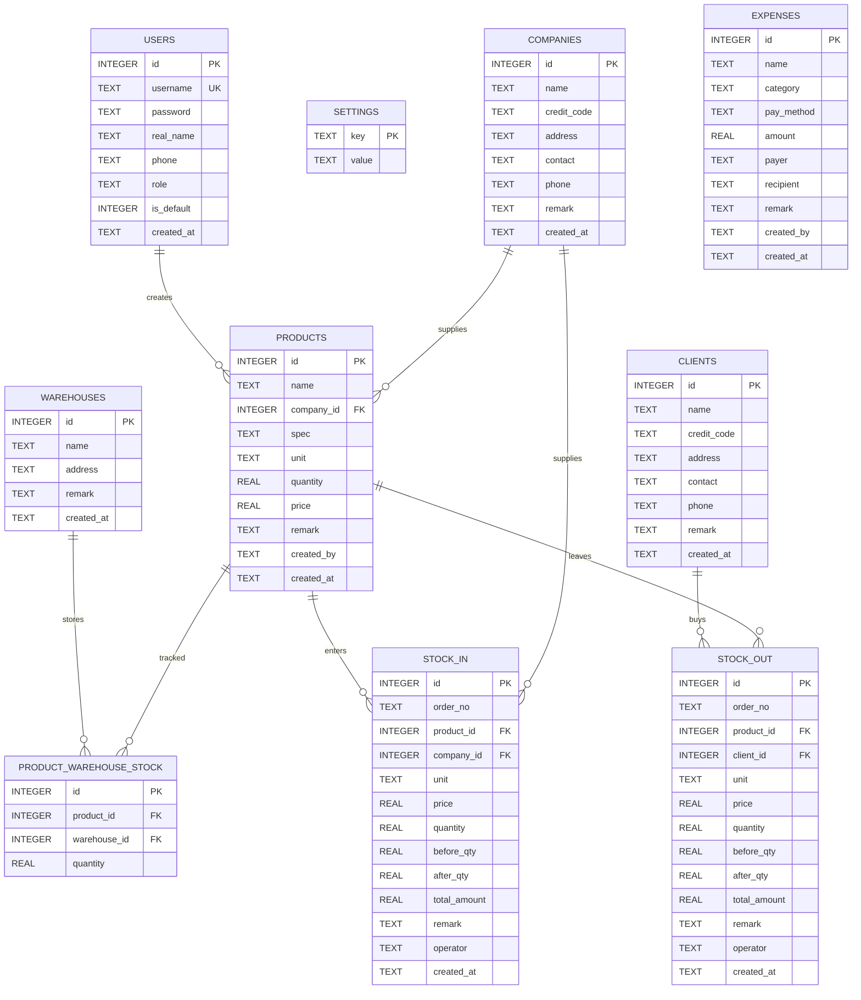
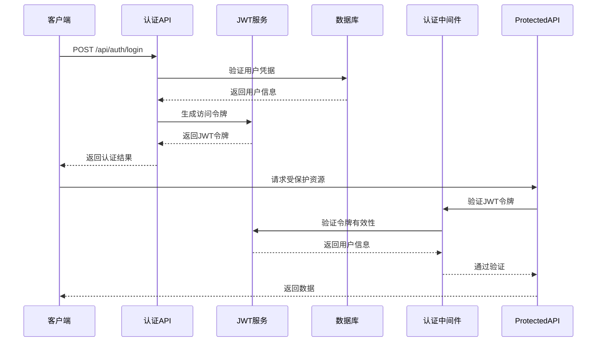
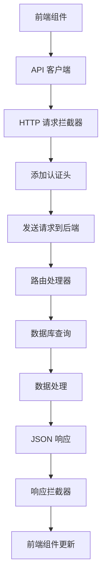
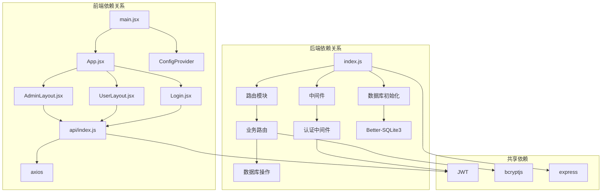

# 整体架构设计

<cite>
**本文档引用的文件**
- [client/package.json](file://client/package.json)
- [server/package.json](file://server/package.json)
- [根目录 package.json](file://package.json)
- [客户端入口 main.jsx](file://client/src/main.jsx)
- [应用路由 App.jsx](file://client/src/App.jsx)
- [API 客户端配置 api/index.js](file://client/src/api/index.js)
- [管理员布局 AdminLayout.jsx](file://client/src/layouts/AdminLayout.jsx)
- [用户布局 UserLayout.jsx](file://client/src/layouts/UserLayout.jsx)
- [登录页 Login.jsx](file://client/src/pages/Login.jsx)
- [管理员仪表盘 AdminDashboard.jsx](file://client/src/pages/admin/Dashboard.jsx)
- [用户仪表盘 UserDashboard.jsx](file://client/src/pages/user/Dashboard.jsx)
- [服务端入口 index.js](file://server/index.js)
- [认证中间件 auth.js](file://server/middleware/auth.js)
- [数据库初始化 init.js](file://server/db/init.js)
- [认证路由 auth.js](file://server/routes/auth.js)
- [仪表盘路由 dashboard.js](file://server/routes/dashboard.js)
</cite>

## 目录
1. [引言](#引言)
2. [项目结构](#项目结构)
3. [核心组件](#核心组件)
4. [架构概览](#架构概览)
5. [详细组件分析](#详细组件分析)
6. [依赖分析](#依赖分析)
7. [性能考虑](#性能考虑)
8. [故障排除指南](#故障排除指南)
9. [结论](#结论)

## 引言

SY-Q 做账管理系统采用前后端分离架构设计，旨在为企业提供高效、可靠的财务管理解决方案。本系统通过 React 前端应用与 Express 后端服务的协同工作，实现了完整的会计核算功能，包括商品管理、库存出入库、日常开销等核心业务模块。

系统采用现代化技术栈，前端基于 React 19 和 Ant Design 组件库，后端使用 Express 框架配合 Better-SQLite3 数据库引擎，确保了良好的用户体验和稳定的系统性能。通过严格的 MVC 架构模式实现，系统在表现层、业务逻辑层和数据访问层之间建立了清晰的职责边界。

## 项目结构

系统采用标准的前后端分离项目结构，前端和后端分别独立开发和部署：

**图表来源**
- [client/package.json:1-27](file://client/package.json#L1-L27)
- [server/package.json:1-26](file://server/package.json#L1-L26)
- [根目录 package.json:1-13](file://package.json#L1-L13)

**章节来源**
- [client/package.json:1-27](file://client/package.json#L1-L27)
- [server/package.json:1-26](file://server/package.json#L1-L26)
- [根目录 package.json:1-13](file://package.json#L1-L13)

## 核心组件

### 技术栈选择与架构决策

系统采用以下核心技术栈：

**前端技术栈：**
- **React 19**: 提供现代前端开发体验，支持并发特性和更好的性能优化
- **Ant Design**: 企业级 UI 组件库，提供丰富的业务组件和统一的设计规范
- **Axios**: HTTP 客户端库，支持拦截器和错误处理机制
- **React Router DOM**: 单页应用路由管理，支持嵌套路由和权限控制
- **Recharts**: 数据可视化库，用于报表和统计图表展示

**后端技术栈：**
- **Express 5.x**: 轻量级 Web 应用框架，提供灵活的路由和中间件支持
- **Better-SQLite3**: 高性能 SQLite 数据库驱动，支持原生 SQLite 功能
- **JWT**: 令牌认证机制，确保 API 接口的安全性
- **bcryptjs**: 密码加密库，保护用户敏感信息
- **Helmet**: 安全响应头中间件，提升应用安全性

**架构决策理由：**
1. **前后端分离**: 实现技术栈独立演进，提高开发效率
2. **MVC 模式**: 清晰分层架构，便于维护和扩展
3. **SQLite 数据库**: 适合中小型企业的轻量级数据存储需求
4. **JWT 认证**: 无状态认证机制，支持多设备登录管理

**章节来源**
- [client/package.json:11-25](file://client/package.json#L11-L25)
- [server/package.json:14-24](file://server/package.json#L14-L24)

## 架构概览

系统采用典型的前后端分离架构，通过 RESTful API 进行通信：

**图表来源**
- [客户端入口 main.jsx:1-14](file://client/src/main.jsx#L1-L14)
- [应用路由 App.jsx:1-67](file://client/src/App.jsx#L1-L67)
- [服务端入口 index.js:1-120](file://server/index.js#L1-L120)
- [数据库初始化 init.js:1-217](file://server/db/init.js#L1-L217)

### MVC 架构模式实现

系统严格按照 MVC 模式进行分层设计：

**表现层 (Model-View-Controller View)**
- React 组件负责用户界面渲染
- Ant Design 提供统一的 UI 体验
- 路由系统管理页面导航

**业务逻辑层 (Controller)**
- Express 路由处理 HTTP 请求
- 中间件执行权限验证和数据处理
- 业务规则在路由处理器中实现

**数据访问层 (Model)**
- Better-SQLite3 提供数据库连接
- SQL 查询封装在数据访问函数中
- 数据模型通过表结构定义

**章节来源**
- [应用路由 App.jsx:32-67](file://client/src/App.jsx#L32-L67)
- [服务端入口 index.js:68-95](file://server/index.js#L68-L95)
- [数据库初始化 init.js:9-16](file://server/db/init.js#L9-L16)

## 详细组件分析

### 前端组件架构

#### 应用入口与路由系统

React 应用通过 BrowserRouter 实现单页应用路由，支持管理员和普通用户的双角色权限体系：

**图表来源**
- [应用路由 App.jsx:32-67](file://client/src/App.jsx#L32-L67)
- [API 客户端配置 api/index.js:9-15](file://client/src/api/index.js#L9-L15)

#### 布局组件设计

系统提供两种布局组件以适应不同用户角色的需求：

**管理员布局 (AdminLayout):**
- 包含完整的业务功能菜单
- 支持侧边栏折叠和移动端抽屉式导航
- 集成系统设置和用户管理功能

**用户布局 (UserLayout):**
- 专注于日常业务操作
- 简化导航结构，提升操作效率
- 提供个人工作台和数据查看功能

**章节来源**
- [管理员布局 AdminLayout.jsx:16-174](file://client/src/layouts/AdminLayout.jsx#L16-L174)
- [用户布局 UserLayout.jsx:16-162](file://client/src/layouts/UserLayout.jsx#L16-L162)

### 后端服务架构

#### Express 应用配置

服务端采用模块化的 Express 应用架构，通过中间件实现安全防护和请求处理：

**图表来源**
- [服务端入口 index.js:11-63](file://server/index.js#L11-L63)
- [服务端入口 index.js:68-106](file://server/index.js#L68-L106)

#### 数据库设计与访问

系统使用 Better-SQLite3 实现高性能的数据持久化，采用关系型数据库设计：

**图表来源**
- [数据库初始化 init.js:21-216](file://server/db/init.js#L21-L216)

**章节来源**
- [数据库初始化 init.js:18-216](file://server/db/init.js#L18-L216)

### API 交互流程

#### 认证流程

用户认证采用 JWT 令牌机制，确保会话状态的无状态管理和跨域支持：

**图表来源**
- [认证路由 auth.js:8-40](file://server/routes/auth.js#L8-L40)
- [认证中间件 auth.js:5-19](file://server/middleware/auth.js#L5-L19)

#### 数据获取流程

前端通过 Axios 客户端发起 API 请求，后端路由处理请求并返回数据：

**图表来源**
- [API 客户端配置 api/index.js:4-42](file://client/src/api/index.js#L4-L42)
- [仪表盘路由 dashboard.js:8-60](file://server/routes/dashboard.js#L8-L60)

**章节来源**
- [认证路由 auth.js:42-69](file://server/routes/auth.js#L42-L69)
- [API 客户端配置 api/index.js:17-39](file://client/src/api/index.js#L17-L39)

## 依赖分析

系统采用模块化设计，各组件间的依赖关系清晰明确：

**图表来源**
- [客户端入口 main.jsx:1-14](file://client/src/main.jsx#L1-L14)
- [应用路由 App.jsx:1-67](file://client/src/App.jsx#L1-L67)
- [服务端入口 index.js:68-95](file://server/index.js#L68-L95)

**章节来源**
- [根目录 package.json:5-8](file://package.json#L5-L8)

### 组件耦合度分析

系统在设计上实现了良好的内聚性和低耦合性：

**高内聚特性：**
- 前端组件按功能模块组织，职责单一明确
- 后端路由按业务领域划分，逻辑清晰
- 数据库表结构规范化，减少冗余

**低耦合特性：**
- 前后端通过标准化 API 接口通信
- 中间件提供横切关注点的解耦
- 模块化设计支持独立开发和测试

## 性能考虑

### 前端性能优化

系统采用多项前端性能优化策略：

**构建优化：**
- 使用 Vite 进行快速开发和构建
- 按需加载组件和路由
- 图片和静态资源优化

**运行时优化：**
- React 19 的并发特性提升渲染性能
- Ant Design 组件的虚拟滚动支持大数据集
- 缓存策略减少重复请求

### 后端性能优化

**数据库优化：**
- SQLite 的 WAL 模式提升并发性能
- 外键约束保证数据一致性
- 合理的索引设计支持快速查询

**API 优化：**
- 速率限制防止滥用
- JWT 令牌减少数据库查询
- 错误处理优化用户体验

## 故障排除指南

### 常见问题诊断

**认证相关问题：**
- 检查本地存储中的 token 是否存在
- 验证 JWT 令牌是否过期
- 确认用户角色权限是否正确

**API 请求失败：**
- 检查网络连接和 CORS 配置
- 验证请求头中的认证信息
- 查看服务器端错误日志

**数据库连接问题：**
- 确认数据库文件路径正确
- 检查文件权限设置
- 验证数据库初始化是否完成

**章节来源**
- [API 客户端配置 api/index.js:20-39](file://client/src/api/index.js#L20-L39)
- [认证中间件 auth.js:9-18](file://server/middleware/auth.js#L9-L18)

### 错误处理机制

系统实现了多层次的错误处理机制：

**前端错误处理：**
- Axios 拦截器统一处理响应错误
- Ant Design 的消息提示系统
- 自动登出过期会话

**后端错误处理：**
- 全局错误中间件捕获异常
- CORS 错误的专门处理
- 详细的错误日志记录

**章节来源**
- [服务端入口 index.js:108-115](file://server/index.js#L108-L115)

## 结论

SY-Q 做账管理系统通过精心设计的前后端分离架构，成功实现了企业财务管理的核心需求。系统采用现代化技术栈和清晰的 MVC 架构模式，在保证功能完整性的同时，确保了良好的可维护性和扩展性。

**主要优势：**
- 清晰的分层架构便于团队协作开发
- 前后端分离提升了开发效率和部署灵活性
- SQLite 数据库适合中小企业的成本效益方案
- JWT 认证机制提供了安全可靠的用户管理

**未来改进方向：**
- 可考虑引入缓存层提升数据访问性能
- 增加单元测试和集成测试覆盖率
- 扩展监控和日志系统
- 考虑微服务架构以支持更大规模的企业需求

该架构设计为 SY-Q 做账管理系统奠定了坚实的技术基础，能够有效支撑企业的日常财务管理工作，并为未来的功能扩展和技术升级提供了良好的平台支撑。