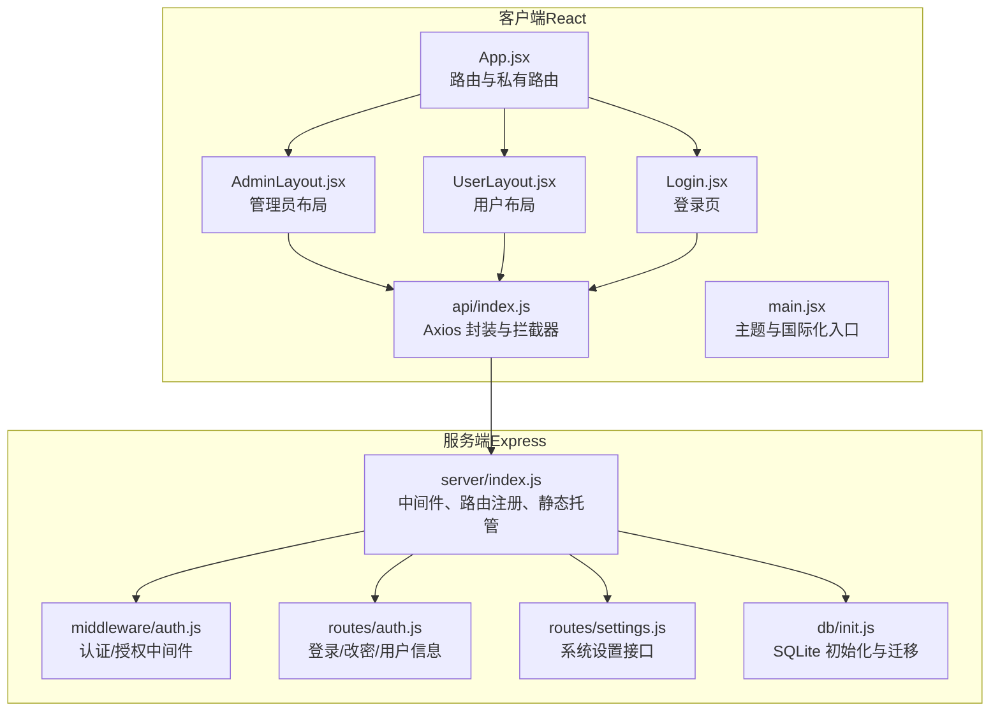
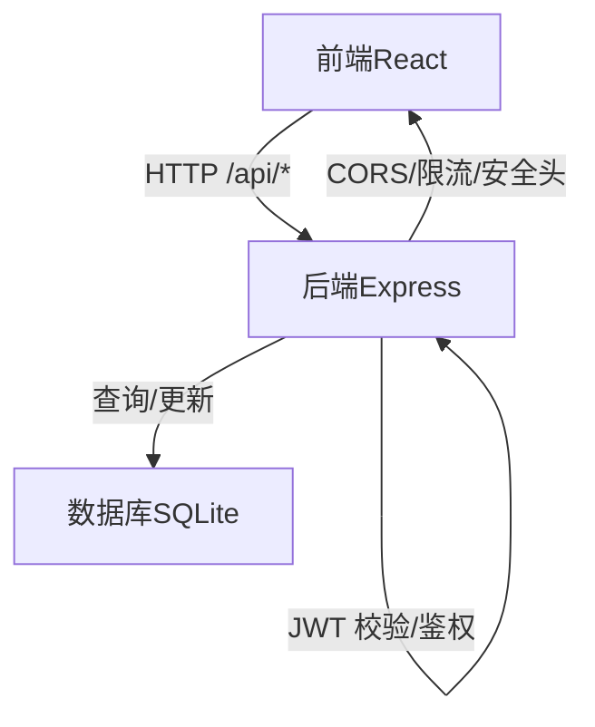
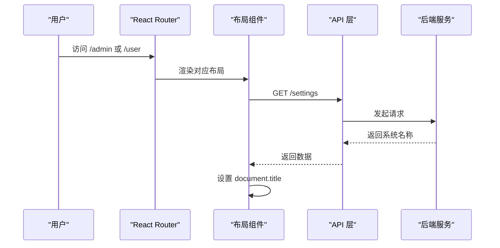
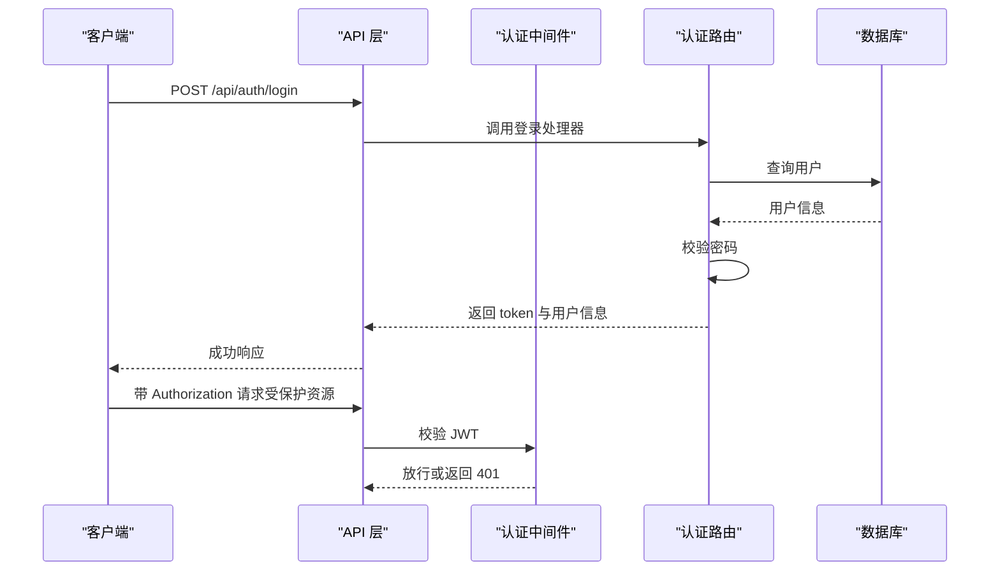
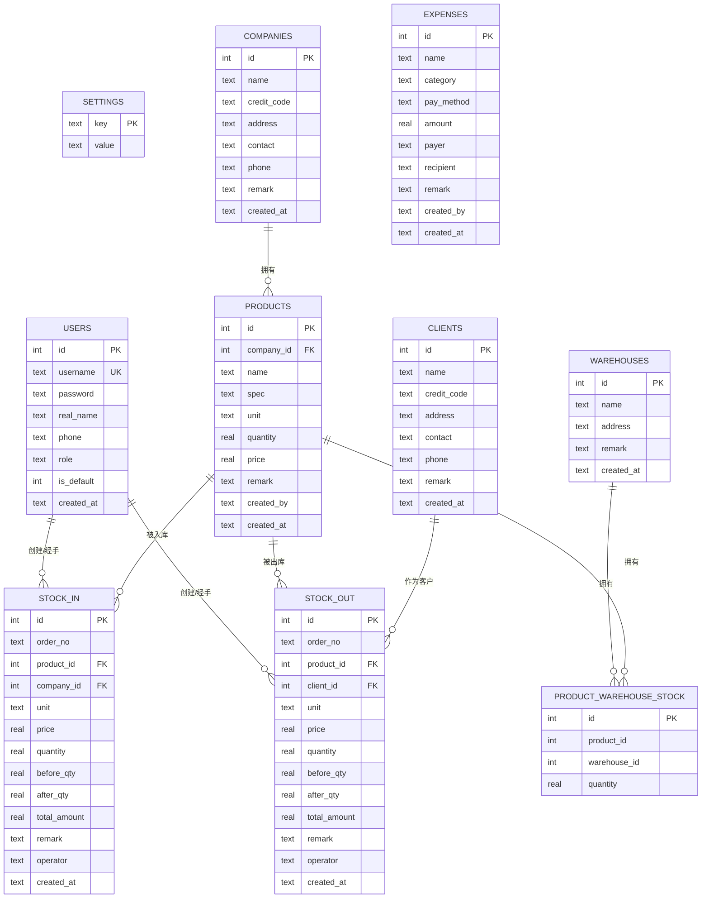
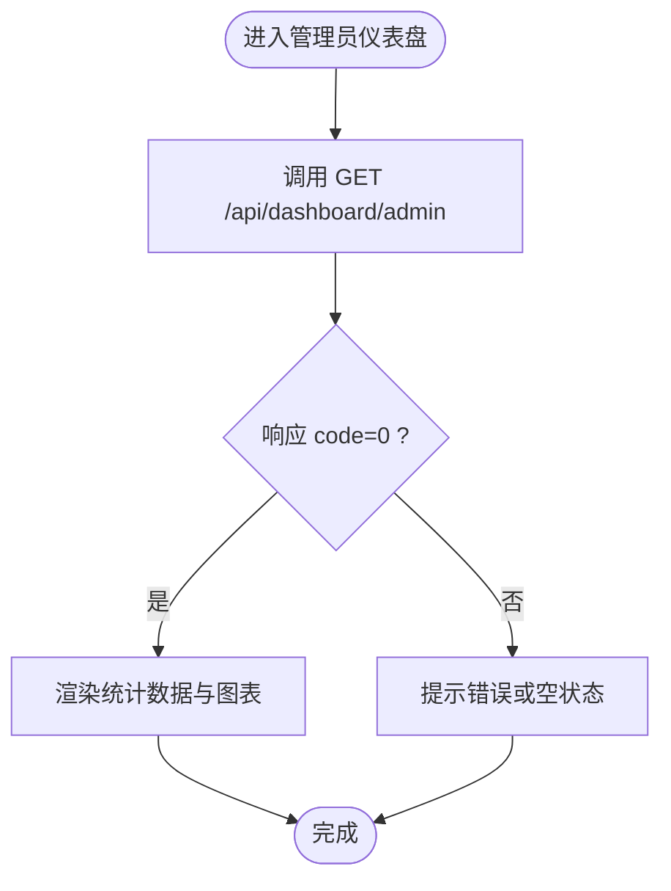
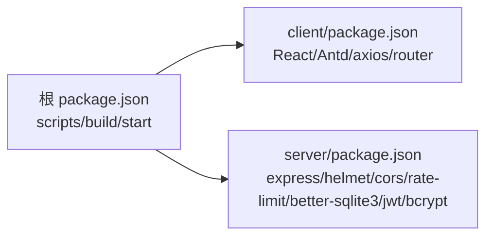

# 系统架构

<cite>
**本文引用的文件**
- [client/src/App.jsx](file://client/src/App.jsx)
- [client/src/main.jsx](file://client/src/main.jsx)
- [client/src/layouts/AdminLayout.jsx](file://client/src/layouts/AdminLayout.jsx)
- [client/src/layouts/UserLayout.jsx](file://client/src/layouts/UserLayout.jsx)
- [client/src/pages/Login.jsx](file://client/src/pages/Login.jsx)
- [client/src/pages/admin/Dashboard.jsx](file://client/src/pages/admin/Dashboard.jsx)
- [client/src/pages/user/Dashboard.jsx](file://client/src/pages/user/Dashboard.jsx)
- [client/src/api/index.js](file://client/src/api/index.js)
- [server/index.js](file://server/index.js)
- [server/middleware/auth.js](file://server/middleware/auth.js)
- [server/routes/auth.js](file://server/routes/auth.js)
- [server/routes/settings.js](file://server/routes/settings.js)
- [server/db/init.js](file://server/db/init.js)
- [client/package.json](file://client/package.json)
- [server/package.json](file://server/package.json)
- [package.json](file://package.json)
</cite>

## 目录
1. [引言](#引言)
2. [项目结构](#项目结构)
3. [核心组件](#核心组件)
4. [架构总览](#架构总览)
5. [详细组件分析](#详细组件分析)
6. [依赖分析](#依赖分析)
7. [性能考虑](#性能考虑)
8. [故障排查指南](#故障排查指南)
9. [结论](#结论)
10. [附录](#附录)

## 引言
本系统为 SY-Q 做账管理系统，采用前后端分离架构：前端使用 React + Ant Design，后端基于 Express 提供 RESTful API。系统通过 JWT 实现认证与授权，采用中间件统一处理安全与限流，数据库使用 SQLite（better-sqlite3）。路由系统支持管理员与普通用户的双布局模式，并通过私有路由与本地存储令牌实现受保护页面访问控制。

## 项目结构
- 前端（React）位于 client 目录，包含页面、布局、API 封装与主题配置。
- 后端（Express）位于 server 目录，包含中间件、路由、数据库初始化与入口文件。
- 根目录提供构建脚本与 Node 版本要求。

图表来源
- [client/src/App.jsx:1-67](file://client/src/App.jsx#L1-L67)
- [client/src/layouts/AdminLayout.jsx:1-174](file://client/src/layouts/AdminLayout.jsx#L1-L174)
- [client/src/layouts/UserLayout.jsx:1-162](file://client/src/layouts/UserLayout.jsx#L1-L162)
- [client/src/pages/Login.jsx:1-68](file://client/src/pages/Login.jsx#L1-L68)
- [client/src/api/index.js:1-42](file://client/src/api/index.js#L1-L42)
- [client/src/main.jsx:1-14](file://client/src/main.jsx#L1-L14)
- [server/index.js:1-120](file://server/index.js#L1-L120)
- [server/middleware/auth.js:1-29](file://server/middleware/auth.js#L1-L29)
- [server/routes/auth.js:1-69](file://server/routes/auth.js#L1-L69)
- [server/routes/settings.js:1-34](file://server/routes/settings.js#L1-L34)
- [server/db/init.js:1-217](file://server/db/init.js#L1-L217)

章节来源
- [client/src/App.jsx:1-67](file://client/src/App.jsx#L1-L67)
- [server/index.js:1-120](file://server/index.js#L1-L120)

## 核心组件
- 前端路由与守卫
  - 使用 React Router v6 的嵌套路由与私有路由组件，基于本地存储令牌判断是否放行。
  - 管理员与用户分别挂载到 /admin 与 /user 下，首页重定向至对应工作台。
- 布局组件
  - AdminLayout 与 UserLayout 提供侧边栏菜单、移动端抽屉、头部用户下拉与系统标题加载。
  - 两套布局均通过 api.get('/settings') 获取系统名称并设置 document.title。
- API 层
  - Axios 实例封装 baseURL 为 /api，统一注入 Authorization 头。
  - 统一处理 401 与业务错误码，自动跳转登录。
- 中间件与认证
  - Express 中间件对 /api 路由进行安全头、CORS、限流处理。
  - 认证中间件校验 JWT 并注入 req.user；管理员中间件校验角色。
- 数据库
  - better-sqlite3 初始化数据库与表结构，含外键与 WAL 模式优化。
  - 自动迁移：为历史表添加新增字段；插入默认管理员与系统名称。

章节来源
- [client/src/App.jsx:26-60](file://client/src/App.jsx#L26-L60)
- [client/src/layouts/AdminLayout.jsx:49-55](file://client/src/layouts/AdminLayout.jsx#L49-L55)
- [client/src/layouts/UserLayout.jsx:47-53](file://client/src/layouts/UserLayout.jsx#L47-L53)
- [client/src/api/index.js:4-39](file://client/src/api/index.js#L4-L39)
- [server/index.js:11-115](file://server/index.js#L11-L115)
- [server/middleware/auth.js:5-26](file://server/middleware/auth.js#L5-L26)
- [server/db/init.js:18-214](file://server/db/init.js#L18-L214)

## 架构总览
系统采用经典的前后端分离架构，前端负责视图与交互，后端提供稳定的数据服务。MVC 在本项目中体现为：
- 表现层（View）：React 组件（页面与布局）
- 业务逻辑层（Controller）：Express 路由处理器（处理请求、调用领域逻辑、返回响应）
- 数据访问层（Model）：better-sqlite3 数据库与 SQL 操作

图表来源
- [client/src/api/index.js:4-7](file://client/src/api/index.js#L4-L7)
- [server/index.js:11-115](file://server/index.js#L11-L115)
- [server/middleware/auth.js:5-26](file://server/middleware/auth.js#L5-L26)
- [server/db/init.js:9-16](file://server/db/init.js#L9-L16)

## 详细组件分析

### 路由系统与布局模式
- 路由设计
  - /login：公开登录页
  - /admin：管理员布局下的多子路由（仪表盘、设置、用户管理、公司/客户/商品/出入库/仓库/开销/数据中心）
  - /user：用户布局下的多子路由（仪表盘、修改密码、商品/出入库/仓库/开销/数据中心）
  - 通配符 *：重定向到 /login
- 私有路由守卫
  - PrivateRoute 读取本地 token，缺失则跳转登录
- 布局差异
  - AdminLayout：管理员功能菜单与权限入口
  - UserLayout：用户功能菜单与权限入口
  - 布局内均通过 api.get('/settings') 动态获取系统名称并设置标题

图表来源
- [client/src/App.jsx:32-60](file://client/src/App.jsx#L32-L60)
- [client/src/layouts/AdminLayout.jsx:49-55](file://client/src/layouts/AdminLayout.jsx#L49-L55)
- [client/src/layouts/UserLayout.jsx:47-53](file://client/src/layouts/UserLayout.jsx#L47-L53)
- [client/src/api/index.js:4-7](file://client/src/api/index.js#L4-L7)
- [server/routes/settings.js:6-11](file://server/routes/settings.js#L6-L11)

章节来源
- [client/src/App.jsx:32-60](file://client/src/App.jsx#L32-L60)
- [client/src/layouts/AdminLayout.jsx:16-42](file://client/src/layouts/AdminLayout.jsx#L16-L42)
- [client/src/layouts/UserLayout.jsx:16-41](file://client/src/layouts/UserLayout.jsx#L16-L41)

### 认证流程与中间件模式
- 登录流程
  - 前端 Login 组件提交用户名/密码到 /api/auth/login
  - 后端验证用户与密码，签发 JWT（24h），返回 token 与用户信息
  - 前端保存 token 与用户信息并跳转对应工作台
- 中间件
  - 认证中间件：从 Authorization 头提取 Bearer Token，校验失败返回 401
  - 管理员中间件：校验角色非 admin 返回 403
  - 安全中间件：Helmet 设置安全响应头；CORS 白名单与 .onrender.com 子域名放行；请求体大小限制
  - 限流中间件：登录接口每 IP 每分钟最多 10 次；通用 API 每 IP 每分钟最多 120 次
- 错误处理
  - 全局错误处理捕获 CORS 与未知异常，返回标准化错误响应

图表来源
- [client/src/pages/Login.jsx:27-43](file://client/src/pages/Login.jsx#L27-L43)
- [server/routes/auth.js:8-40](file://server/routes/auth.js#L8-L40)
- [server/middleware/auth.js:5-19](file://server/middleware/auth.js#L5-L19)
- [server/index.js:11-63](file://server/index.js#L11-L63)

章节来源
- [client/src/pages/Login.jsx:1-68](file://client/src/pages/Login.jsx#L1-L68)
- [server/routes/auth.js:1-69](file://server/routes/auth.js#L1-L69)
- [server/middleware/auth.js:1-29](file://server/middleware/auth.js#L1-L29)
- [server/index.js:11-115](file://server/index.js#L11-L115)

### 数据模型与数据库初始化
- 关键实体
  - 用户、系统设置、库房、商品、公司、客户、出入库明细、日常开销
- 初始化与迁移
  - 创建表并启用外键约束与 WAL 模式
  - 对历史表进行字段迁移（如 stock_in/stock_out 新增 order_no、warehouse_id；expenses 新增 category、recipient）
  - 插入默认管理员账号与系统名称

图表来源
- [server/db/init.js:21-186](file://server/db/init.js#L21-L186)

章节来源
- [server/db/init.js:1-217](file://server/db/init.js#L1-L217)

### 页面与数据流（管理员仪表盘）
- 管理员仪表盘
  - 加载 /api/dashboard/admin 获取统计与趋势数据
  - 展示商品数量、库存总值、出入库额与量、开销等指标
  - 提供快捷入口与近7天出入库趋势图

图表来源
- [client/src/pages/admin/Dashboard.jsx:19-23](file://client/src/pages/admin/Dashboard.jsx#L19-L23)

章节来源
- [client/src/pages/admin/Dashboard.jsx:1-123](file://client/src/pages/admin/Dashboard.jsx#L1-L123)

### 页面与数据流（用户仪表盘）
- 用户仪表盘
  - 加载 /api/dashboard/user 获取个人相关统计
  - 展示我录入的商品、本月出入库与开销总额
  - 展示近期操作记录

章节来源
- [client/src/pages/user/Dashboard.jsx:1-74](file://client/src/pages/user/Dashboard.jsx#L1-L74)

## 依赖分析
- 前端依赖
  - React 生态与 Ant Design UI 组件库
  - axios 用于统一 API 调用
  - react-router-dom 负责路由
- 后端依赖
  - express 作为 Web 框架
  - helmet、cors、express-rate-limit 提供安全与限流
  - better-sqlite3、bcryptjs、jsonwebtoken 用于数据库、加密与认证
- 根级脚本
  - build：安装 client 与 server 依赖并打包前端，再安装 server 依赖
  - start：启动后端服务

图表来源
- [package.json:5-8](file://package.json#L5-L8)
- [client/package.json:11-26](file://client/package.json#L11-L26)
- [server/package.json:14-24](file://server/package.json#L14-L24)

章节来源
- [client/package.json:1-27](file://client/package.json#L1-L27)
- [server/package.json:1-26](file://server/package.json#L1-L26)
- [package.json:1-13](file://package.json#L1-L13)

## 性能考虑
- 前端
  - 使用 Ant Design 与 Recharts，注意图表与大数据集时的渲染优化
  - 通过私有路由与本地存储减少无效请求
- 后端
  - better-sqlite3 采用 WAL 模式提升并发写入性能
  - 外键约束保证数据一致性但会增加写入成本，建议在批量导入场景使用事务
  - 限流中间件避免暴力破解与滥用
- 网络
  - Axios 超时设置为 30 秒，适中兼顾稳定性与用户体验

## 故障排查指南
- 登录失败
  - 检查 /api/auth/login 是否返回账号或密码错误
  - 确认前端是否正确保存 token 与用户信息
- 401 未授权
  - 检查请求头 Authorization 是否携带 Bearer Token
  - 确认 JWT 是否过期
- CORS 报错
  - 检查 ALLOWED_ORIGINS 环境变量与 .onrender.com 子域名放行
- 429 请求频繁
  - 观察登录与通用 API 的限流策略，降低请求频率
- 页面空白或路由跳转异常
  - 检查私有路由守卫与本地 token
  - 确认静态文件托管路径与回退逻辑

章节来源
- [client/src/api/index.js:17-39](file://client/src/api/index.js#L17-L39)
- [server/index.js:110-115](file://server/index.js#L110-L115)
- [server/middleware/auth.js:9-18](file://server/middleware/auth.js#L9-L18)

## 结论
本系统以 React 与 Express 为核心，结合 JWT 认证、中间件安全防护与 better-sqlite3 数据持久化，实现了清晰的前后端分离架构。管理员与用户双布局满足不同角色需求，路由守卫与权限中间件确保受保护资源的安全访问。整体设计简洁、可维护性强，适合中小规模企业财务数据管理场景。

## 附录
- 系统边界图
  - 前端边界：浏览器渲染、本地存储、Axios 请求
  - 后端边界：Express 服务、中间件、路由、数据库
- 组件交互关系图（代码级）
  - 前端组件通过 api/index.js 统一访问 /api/* 接口
  - 后端在 server/index.js 中集中注册中间件与路由
  - 认证中间件在路由前执行，确保受保护接口的安全性