# Nginx 反向代理配置

<cite>
**本文档引用的文件**
- [client/package.json](file://client/package.json)
- [client/vite.config.js](file://client/vite.config.js)
- [client/index.html](file://client/index.html)
- [server/index.js](file://server/index.js)
- [server/middleware/auth.js](file://server/middleware/auth.js)
- [server/db/init.js](file://server/db/init.js)
- [render.yaml](file://render.yaml)
</cite>

## 目录
1. [简介](#简介)
2. [项目架构概览](#项目架构概览)
3. [Nginx 安装与基础配置](#nginx-安装与基础配置)
4. [虚拟主机与SSL配置](#虚拟主机与ssl配置)
5. [反向代理配置详解](#反向代理配置详解)
6. [静态资源优化策略](#静态资源优化策略)
7. [安全头与防护配置](#安全头与防护配置)
8. [负载均衡与高可用部署](#负载均衡与高可用部署)
9. [故障排查指南](#故障排查指南)
10. [总结](#总结)

## 简介

SY-Q 是一个基于 React 前端和 Express 后端的会计管理系统。本指南专注于如何使用 Nginx 作为反向代理服务器，为该系统提供高性能、安全的访问入口。

系统采用前后端分离架构：
- **前端**：React + Vite 开发环境，构建后输出到 dist 目录
- **后端**：Express.js 提供 RESTful API 服务
- **部署**：支持本地开发和云端部署（Render 平台）

## 项目架构概览

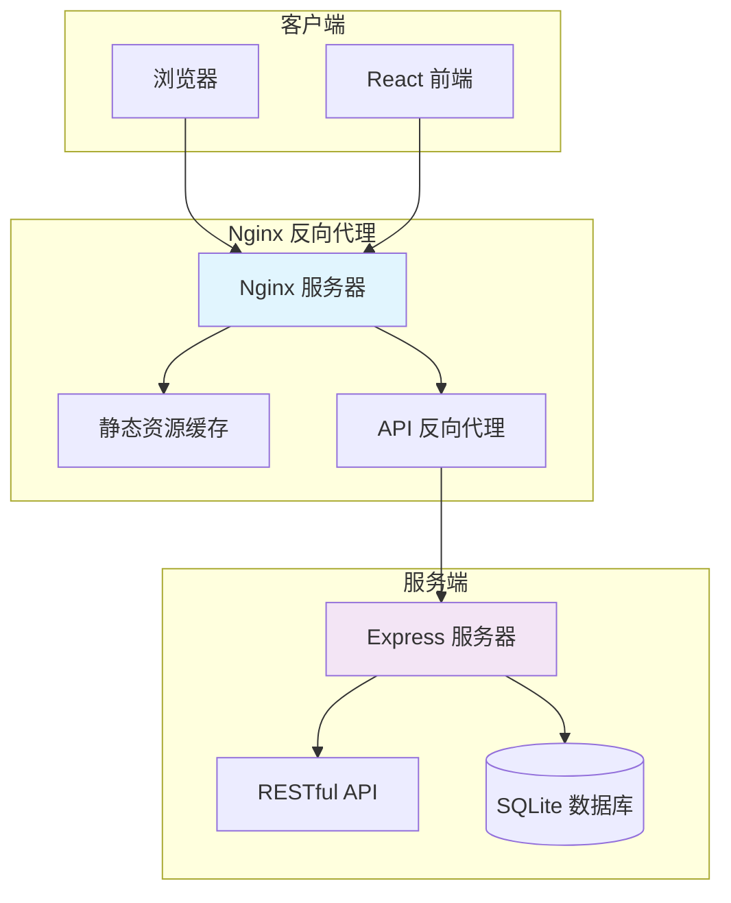

**图表来源**
- [client/vite.config.js:1-20](file://client/vite.config.js#L1-L20)
- [server/index.js:1-120](file://server/index.js#L1-L120)

## Nginx 安装与基础配置

### 系统要求
- 支持 Nginx 1.18+ 版本
- Linux/Unix 或 Windows 环境
- 至少 512MB 内存

### 安装步骤

#### Ubuntu/Debian 系统
```bash
sudo apt update
sudo apt install nginx
```

#### CentOS/RHEL 系统
```bash
sudo yum install epel-release
sudo yum install nginx
```

#### Windows 系统
下载官方安装包或使用 Chocolatey：
```powershell
choco install nginx
```

### 基础配置文件结构

创建主配置文件 `/etc/nginx/sites-available/sysq.conf`：

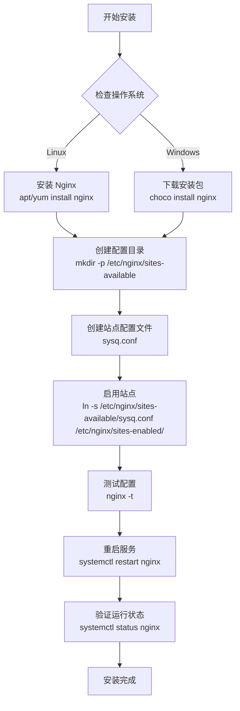

**章节来源**
- [client/vite.config.js:1-20](file://client/vite.config.js#L1-L20)
- [server/index.js:97-106](file://server/index.js#L97-L106)

## 虚拟主机与SSL配置

### 基础虚拟主机配置

创建 `/etc/nginx/sites-available/sysq.conf`：

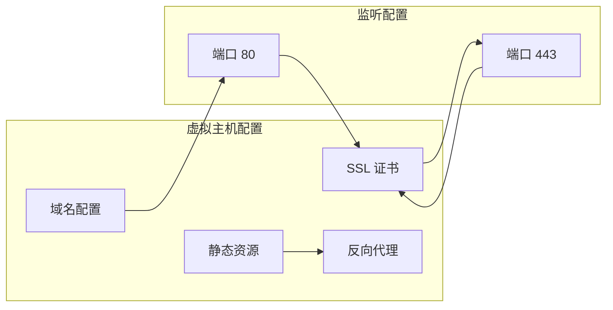

**图表来源**
- [render.yaml:1-13](file://render.yaml#L1-L13)

### SSL 证书配置

#### Let's Encrypt 自动证书
```bash
sudo apt install certbot python3-certbot-nginx
sudo certbot --nginx -d your-domain.com -d www.your-domain.com
```

#### 手动证书配置
```nginx
ssl_certificate /path/to/certificate.crt;
ssl_certificate_key /path/to/private.key;
ssl_trusted_certificate /path/to/chain.crt;
```

### 完整虚拟主机示例

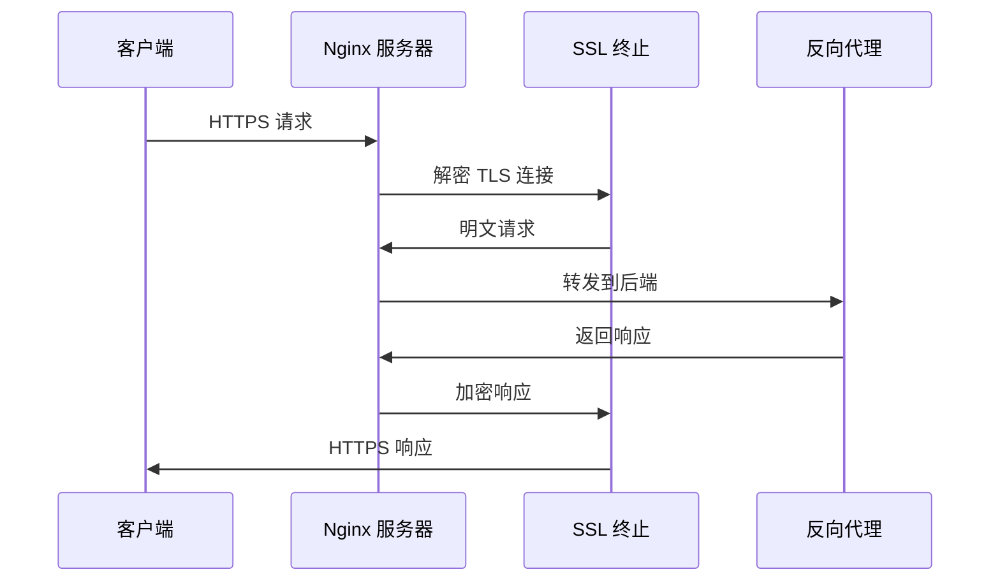

**图表来源**
- [server/index.js:11-15](file://server/index.js#L11-L15)

**章节来源**
- [render.yaml:7-12](file://render.yaml#L7-L12)

## 反向代理配置详解

### 基础反向代理设置

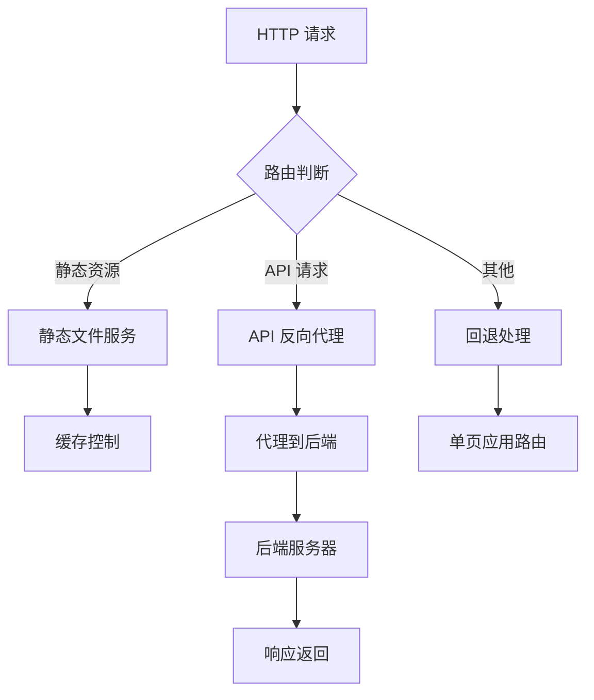

**图表来源**
- [server/index.js:97-106](file://server/index.js#L97-L106)

### 前端静态资源代理

#### 静态文件服务配置
```nginx
location / {
    root /var/www/dist;
    try_files $uri $uri/ /index.html;
    expires 1y;
    add_header Cache-Control "public, immutable";
}

location ~* \.(css|js|png|jpg|jpeg|gif|ico|svg)$ {
    expires 1y;
    add_header Cache-Control "public, immutable";
    add_header Vary Accept-Encoding;
}
```

#### 构建输出目录映射
根据 Vite 配置，静态资源输出到 `../dist` 目录：

**章节来源**
- [client/vite.config.js:15-18](file://client/vite.config.js#L15-L18)
- [server/index.js:97-106](file://server/index.js#L97-L106)

### 后端 API 反向代理

#### API 路由转发配置
```nginx
location /api/ {
    proxy_pass http://127.0.0.1:3001/;
    proxy_set_header Host $host;
    proxy_set_header X-Real-IP $remote_addr;
    proxy_set_header X-Forwarded-For $proxy_add_x_forwarded_for;
    proxy_set_header X-Forwarded-Proto $scheme;
    
    # 超时设置
    proxy_connect_timeout 300s;
    proxy_send_timeout 300s;
    proxy_read_timeout 300s;
    
    # 缓冲设置
    proxy_buffering on;
    proxy_buffer_size 128k;
    proxy_buffers 4 256k;
    proxy_busy_buffers_size 256k;
}
```

#### 开发环境代理配置
Vite 开发服务器使用 `/api` 前缀进行代理：

**章节来源**
- [client/vite.config.js:8-13](file://client/vite.config.js#L8-L13)
- [server/index.js:82-95](file://server/index.js#L82-L95)

### 单页应用路由处理

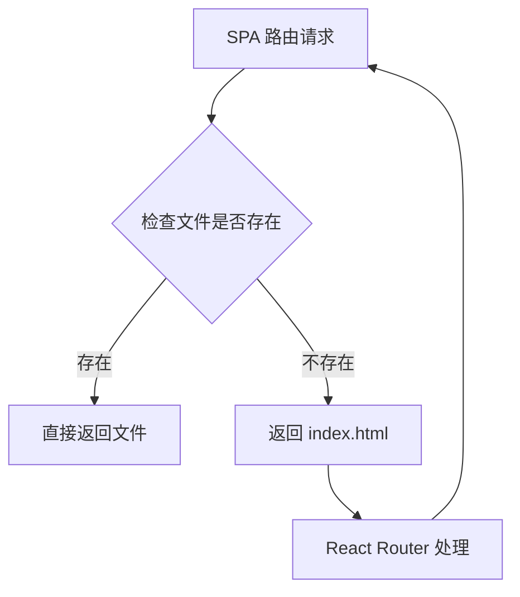

**图表来源**
- [server/index.js:99-106](file://server/index.js#L99-L106)

**章节来源**
- [client/index.html:1-14](file://client/index.html#L1-L14)

## 静态资源优化策略

### 缓存策略配置

#### 强缓存配置
```nginx
# HTML 文件
location = / {
    expires 7d;
    add_header Cache-Control "public, immutable";
}

# 静态资源文件
location ~* \.(css|js|png|jpg|jpeg|gif|ico|svg|woff|woff2|ttf|eot)$ {
    expires 1y;
    add_header Cache-Control "public, immutable";
    add_header Vary Accept-Encoding;
}

# 动态内容禁用缓存
location /api/ {
    add_header Cache-Control "no-store, no-cache, must-revalidate";
    add_header Pragma "no-cache";
    add_header Expires "0";
}
```

#### Gzip 压缩配置
```nginx
gzip on;
gzip_vary on;
gzip_min_length 1024;
gzip_types
    text/plain
    text/css
    text/xml
    text/javascript
    application/json
    application/javascript
    application/xml+rss
    application/atom+xml
    image/svg+xml;

gzip_comp_level 6;
gzip_buffers 16 8k;
gzip_http_version 1.1;
```

### 资源压缩与优化

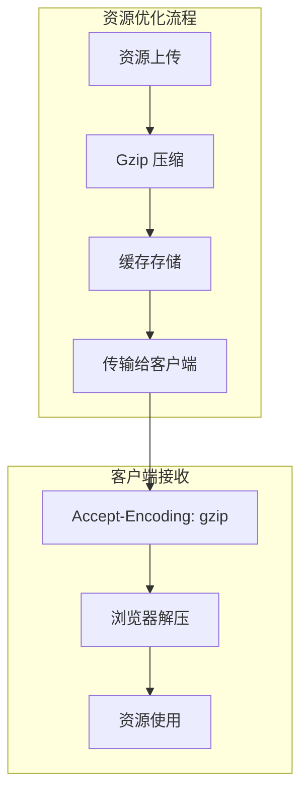

**图表来源**
- [server/index.js:11-15](file://server/index.js#L11-L15)

**章节来源**
- [server/index.js:43-44](file://server/index.js#L43-L44)

## 安全头与防护配置

### 安全响应头配置

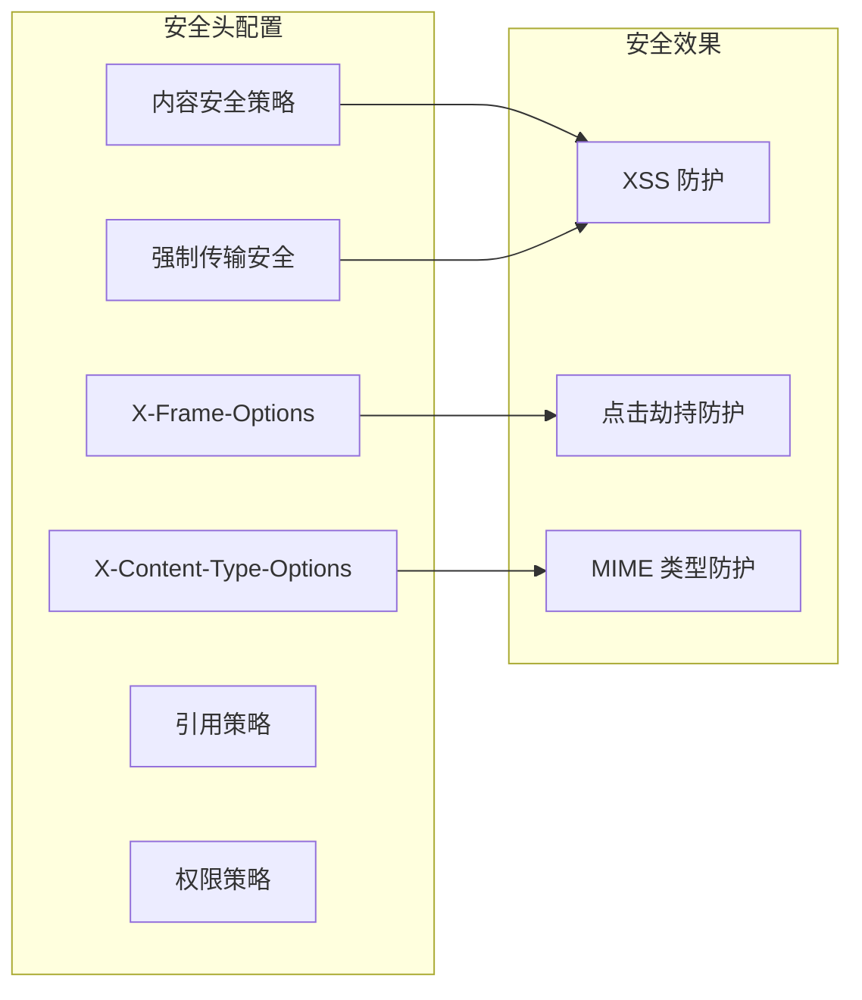

**图表来源**
- [server/index.js:11-15](file://server/index.js#L11-L15)

### CORS 配置策略

```nginx
# Nginx 层面的 CORS 配置
add_header Access-Control-Allow-Origin *;
add_header Access-Control-Allow-Methods "GET, POST, PUT, DELETE, OPTIONS";
add_header Access-Control-Allow-Headers "Content-Type, Authorization, X-Requested-With";
add_header Access-Control-Max-Age 86400;
```

### 频率限制与防护

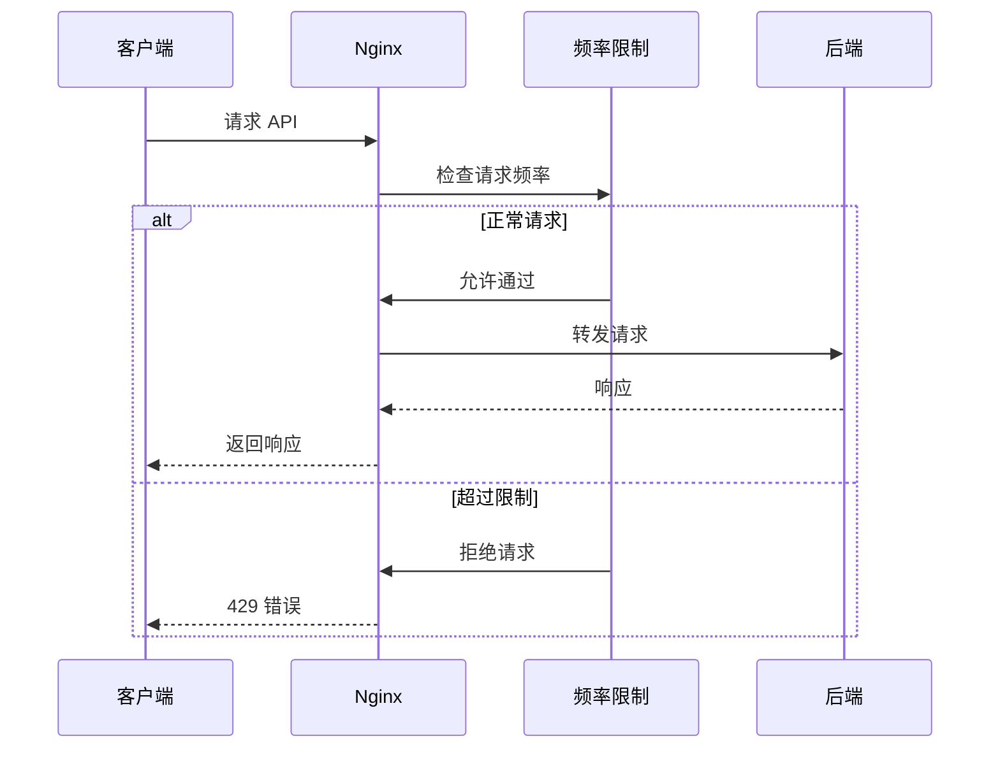

**图表来源**
- [server/index.js:46-63](file://server/index.js#L46-L63)

**章节来源**
- [server/index.js:11-15](file://server/index.js#L11-L15)
- [server/index.js:17-41](file://server/index.js#L17-L41)
- [server/index.js:46-63](file://server/index.js#L46-L63)

## 负载均衡与高可用部署

### 单机多实例部署

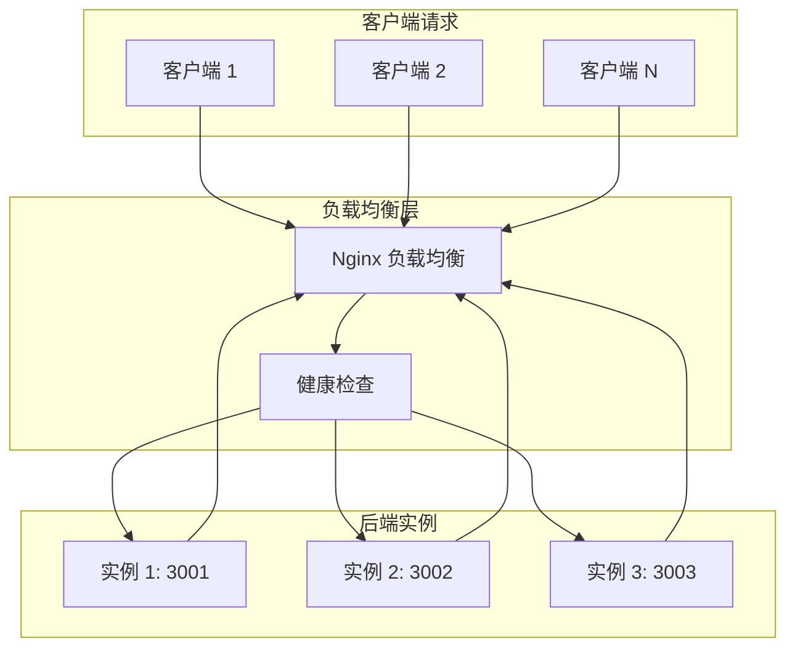

### 负载均衡配置示例

```nginx
upstream backend_servers {
    server 127.0.0.1:3001 weight=3;
    server 127.0.0.1:3002 weight=2;
    server 127.0.0.1:3003 backup;
    
    keepalive 32;
}

server {
    listen 80;
    location /api/ {
        proxy_pass http://backend_servers/;
        proxy_next_upstream on;
        proxy_next_upstream_timeout 10s;
    }
}
```

### 高可用配置要点

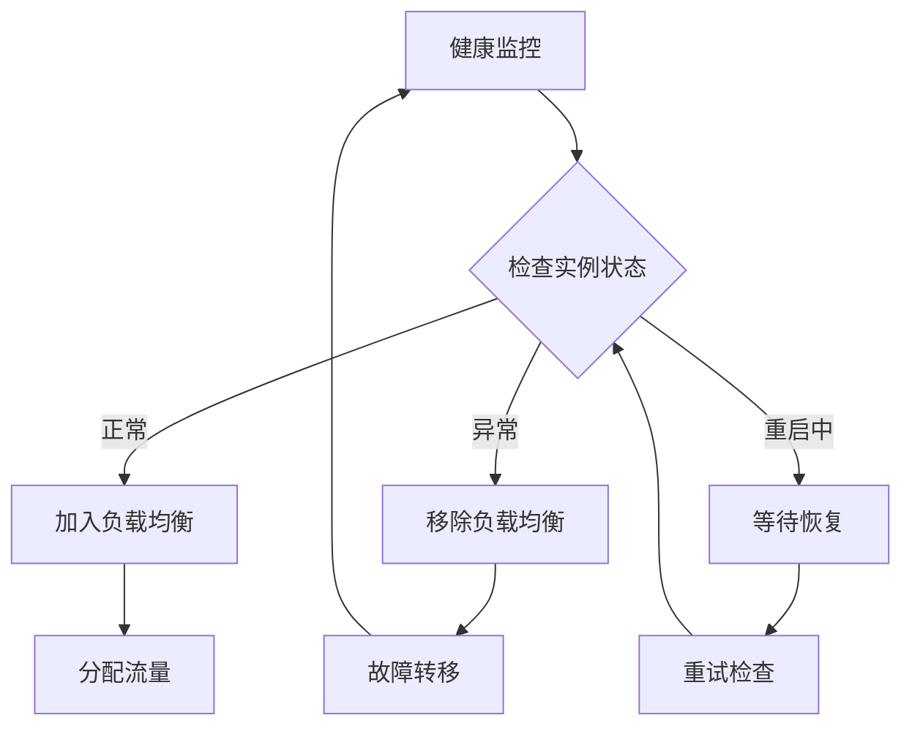

**图表来源**
- [render.yaml:1-13](file://render.yaml#L1-L13)

**章节来源**
- [render.yaml:5-6](file://render.yaml#L5-L6)

## 故障排查指南

### 常见问题诊断

#### Nginx 服务状态检查
```bash
# 检查 Nginx 进程
ps aux | grep nginx

# 查看 Nginx 进程树
pstree -p | grep nginx

# 检查配置语法
nginx -t

# 查看错误日志
tail -f /var/log/nginx/error.log
```

#### 端口占用检查
```bash
# 检查 80 端口占用
netstat -tulpn | grep :80

# 检查 443 端口占用
netstat -tulpn | grep :443

# 检查 3001 端口占用
netstat -tulpn | grep :3001
```

#### 日志分析

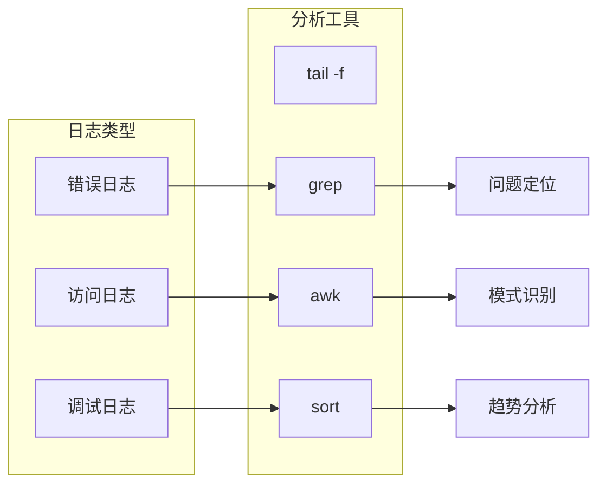

### 性能调优建议

#### 内存优化
```nginx
# 连接池配置
worker_connections 1024;
worker_processes auto;
worker_rlimit_nofile 2048;

# 缓冲区优化
client_body_buffer_size 128k;
client_max_body_size 2m;
client_body_timeout 12;
client_header_timeout 12;
send_timeout 10;
```

#### 并发处理
```nginx
# 事件模型选择
events {
    use epoll;
    worker_connections 2048;
    multi_accept on;
    accept_mutex off;
}
```

**章节来源**
- [server/index.js:8-9](file://server/index.js#L8-L9)

## 总结

SY-Q 系统的 Nginx 反向代理配置提供了完整的解决方案，包括：

### 核心特性
- **高性能代理**：支持静态资源缓存和 API 反向代理
- **安全防护**：内置安全响应头和 CORS 配置
- **负载均衡**：支持多实例部署和故障转移
- **SSL 支持**：完整的 HTTPS 配置和证书管理
- **监控告警**：完善的日志记录和性能监控

### 部署建议
1. **生产环境**：使用 SSL 证书和强加密配置
2. **性能优化**：合理配置缓存策略和压缩选项
3. **安全加固**：启用安全响应头和频率限制
4. **高可用性**：配置负载均衡和健康检查
5. **监控运维**：建立完善的日志和告警机制

### 维护要点
- 定期更新 SSL 证书
- 监控系统性能指标
- 备份重要配置文件
- 制定应急响应预案

通过遵循本指南的配置方案，可以为 SY-Q 系统提供稳定、安全、高性能的访问体验。