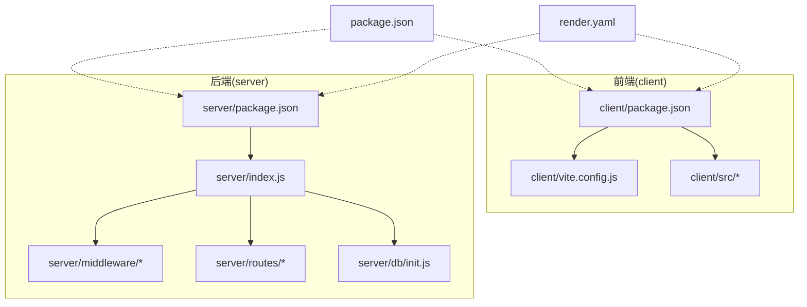
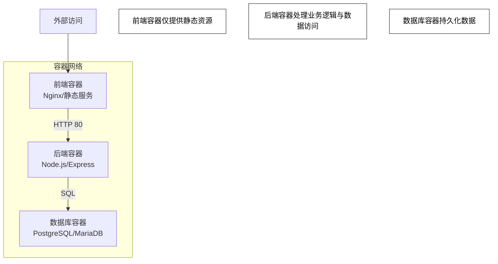
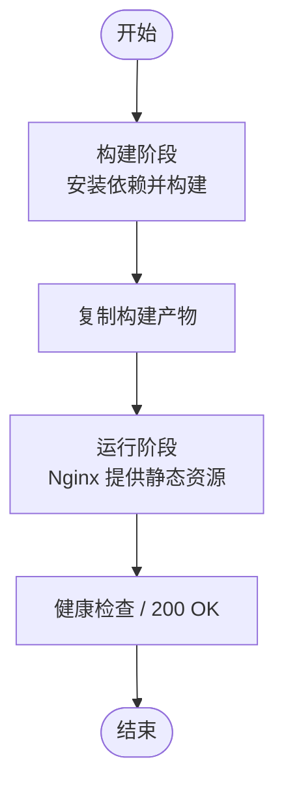
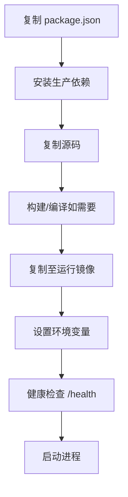
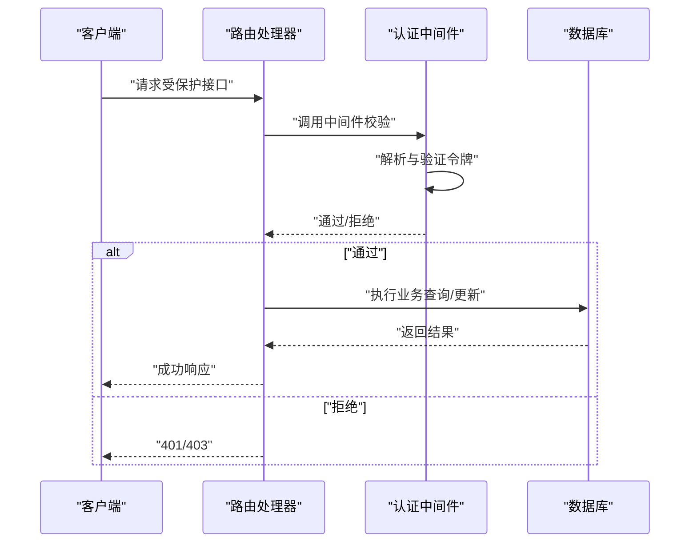
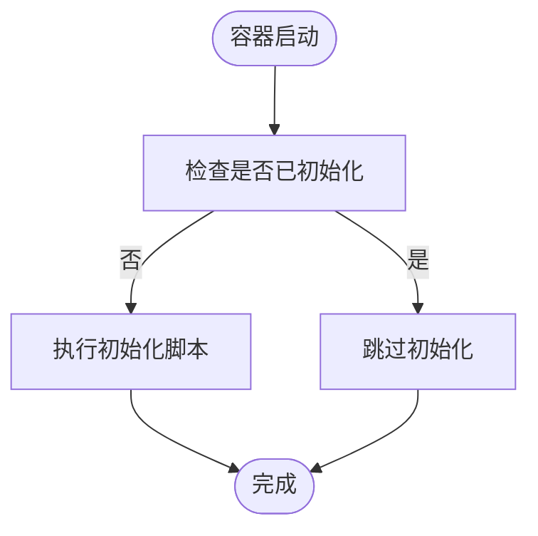
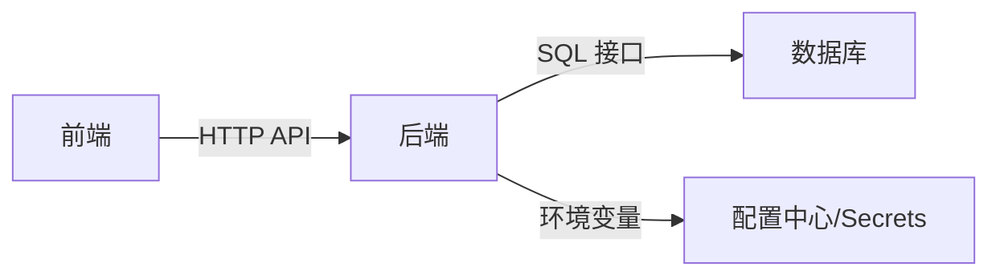

# 容器化部署

<cite>
**本文引用的文件**
- [render.yaml](file://render.yaml)
- [package.json](file://package.json)
- [client/package.json](file://client/package.json)
- [client/vite.config.js](file://client/vite.config.js)
- [server/package.json](file://server/package.json)
- [server/index.js](file://server/index.js)
- [server/middleware/auth.js](file://server/middleware/auth.js)
- [server/routes/auth.js](file://server/routes/auth.js)
- [server/db/init.js](file://server/db/init.js)
</cite>

## 目录
1. [简介](#简介)
2. [项目结构](#项目结构)
3. [核心组件](#核心组件)
4. [架构总览](#架构总览)
5. [详细组件分析](#详细组件分析)
6. [依赖关系分析](#依赖关系分析)
7. [性能考虑](#性能考虑)
8. [故障排查指南](#故障排查指南)
9. [结论](#结论)
10. [附录](#附录)

## 简介
本技术指南面向 SY-Q 系统的容器化部署，围绕前端客户端（React/Vite）与后端服务（Node.js/Express）两大模块，提供从 Dockerfile 编写规范、docker-compose.yml 配置到 Kubernetes 简化部署与监控配置的完整实践建议。文档强调镜像优化、安全加固与资源限制等最佳实践，并通过可视化图示帮助读者快速理解系统在容器环境中的运行方式。

## 项目结构
SY-Q 采用前后端分离架构：前端位于 client 目录，使用 Vite 构建；后端位于 server 目录，基于 Node.js/Express 提供 REST API。根目录包含渲染平台配置文件与工作区级包管理配置。该结构为容器化提供了清晰的边界：前端打包产物作为静态资源由反向代理或静态服务器提供；后端以无状态服务形式运行，数据库初始化脚本独立于应用层。

**图表来源**
- [client/package.json](file://client/package.json)
- [client/vite.config.js](file://client/vite.config.js)
- [server/package.json](file://server/package.json)
- [server/index.js](file://server/index.js)
- [server/middleware/auth.js](file://server/middleware/auth.js)
- [server/routes/auth.js](file://server/routes/auth.js)
- [server/db/init.js](file://server/db/init.js)
- [package.json](file://package.json)
- [render.yaml](file://render.yaml)

**章节来源**
- [client/package.json](file://client/package.json)
- [server/package.json](file://server/package.json)
- [render.yaml](file://render.yaml)

## 核心组件
- 前端构建与运行
  - 使用 Vite 进行开发与生产构建，输出静态资源。
  - 生产环境可由 Nginx 或静态 Web 服务器提供。
- 后端服务
  - Node.js 应用入口负责启动 HTTP 服务、加载中间件与路由。
  - 认证中间件用于保护受控接口。
  - 数据中心初始化脚本负责数据库初始化流程。
- 渲染平台集成
  - render.yaml 描述了前端与后端的服务定义、环境变量与资源分配策略。

**章节来源**
- [client/vite.config.js](file://client/vite.config.js)
- [server/index.js](file://server/index.js)
- [server/middleware/auth.js](file://server/middleware/auth.js)
- [server/db/init.js](file://server/db/init.js)
- [render.yaml](file://render.yaml)

## 架构总览
下图展示了 SY-Q 在容器环境中的典型拓扑：前端服务对外暴露静态页面，后端服务提供 API 并连接数据库；两者通过网络隔离并在同一子网内通信。

**图表来源**
- [server/index.js](file://server/index.js)
- [server/db/init.js](file://server/db/init.js)

## 详细组件分析

### 前端容器化组件
- 构建阶段
  - 基础镜像：使用官方 Node.js LTS 作为构建基础，安装构建依赖后执行构建命令生成静态产物。
  - 多阶段构建：第一阶段安装依赖并构建，第二阶段仅复制构建产物至轻量 Nginx 镜像，实现最小化运行时。
- 运行阶段
  - 使用 Nginx 提供静态资源，配置 gzip、缓存头与安全响应头。
  - 挂载卷建议：仅挂载需要热更新的开发配置，生产环境不建议挂载源码。
- 端口与健康检查
  - 对外暴露 80 端口；健康检查可通过 GET / 200 判断。
- 安全与优化
  - 移除构建期依赖，避免泄露；启用 HTTPS（如需）；限制并发连接数与请求大小。

**图表来源**
- [client/package.json](file://client/package.json)
- [client/vite.config.js](file://client/vite.config.js)

**章节来源**
- [client/package.json](file://client/package.json)
- [client/vite.config.js](file://client/vite.config.js)

### 后端容器化组件
- 基础镜像与依赖安装
  - 基础镜像：使用官方 Node.js LTS slim 版本，减少镜像体积。
  - 安装顺序：先复制 package 文件以利用层缓存，再安装生产依赖，最后复制源码。
- 多阶段构建
  - 第一阶段：安装依赖与编译（如需），生成可运行工件。
  - 第二阶段：仅复制运行时所需文件至最小运行镜像，禁用 devDependencies。
- 运行参数与环境变量
  - 设置 NODE_ENV=production；通过环境变量注入数据库连接、密钥与日志级别。
  - 挂载卷：仅挂载需要热更新的配置文件，避免污染镜像层。
- 健康检查与重启策略
  - 健康检查：GET /health 或 /api/health；失败则重启。
  - 重启策略：unless-stopped 或 on-failure，避免无限重启。

**图表来源**
- [server/package.json](file://server/package.json)
- [server/index.js](file://server/index.js)

**章节来源**
- [server/package.json](file://server/package.json)
- [server/index.js](file://server/index.js)

### 认证中间件与路由
- 中间件职责
  - 校验请求头中的认证令牌，解析用户信息并注入上下文。
- 路由保护
  - 受保护的路由在进入控制器前必须通过中间件校验。
- 数据库初始化
  - 初始化脚本负责创建表结构与默认数据，可在容器启动后首次运行。

**图表来源**
- [server/middleware/auth.js](file://server/middleware/auth.js)
- [server/routes/auth.js](file://server/routes/auth.js)
- [server/db/init.js](file://server/db/init.js)

**章节来源**
- [server/middleware/auth.js](file://server/middleware/auth.js)
- [server/routes/auth.js](file://server/routes/auth.js)
- [server/db/init.js](file://server/db/init.js)

### 数据库初始化流程
- 初始化时机
  - 首次启动或迁移脚本执行时运行，确保表结构与种子数据可用。
- 执行方式
  - 可在容器启动脚本中调用初始化脚本，或通过 Sidecar 容器按需触发。
- 注意事项
  - 避免重复初始化；使用幂等操作；记录初始化状态。

**图表来源**
- [server/db/init.js](file://server/db/init.js)

**章节来源**
- [server/db/init.js](file://server/db/init.js)

## 依赖关系分析
- 前后端解耦
  - 前端仅依赖后端提供的 API；后端通过环境变量与数据库交互。
- 组件耦合度
  - 认证中间件与路由存在直接耦合，但职责清晰；数据库初始化与后端主进程松耦合。
- 外部依赖
  - Node.js 运行时、数据库驱动与第三方中间件；建议锁定版本并定期审计。

**图表来源**
- [server/index.js](file://server/index.js)
- [server/package.json](file://server/package.json)

**章节来源**
- [server/index.js](file://server/index.js)
- [server/package.json](file://server/package.json)

## 性能考虑
- 镜像优化
  - 使用多阶段构建，移除构建依赖；分层缓存优先复制依赖文件；使用 .dockerignore 过滤无关文件。
- 运行时优化
  - 前端静态资源启用压缩与缓存；后端设置合理的并发与内存上限；数据库连接池参数与超时控制。
- 资源限制
  - 为容器设置 CPU/内存限额与请求值，避免资源争抢；对数据库容器单独配额。
- 日志与可观测性
  - 统一输出 JSON 日志；采集容器标准输出；结合指标与追踪进行性能分析。

## 故障排查指南
- 健康检查失败
  - 检查 /health 是否可达；确认端口映射与防火墙规则；查看容器日志。
- 认证失败
  - 核对令牌格式与有效期；确认中间件是否正确注入用户信息；检查密钥与签名算法。
- 数据库连接异常
  - 校验连接字符串与凭据；确认网络连通性与防火墙；查看数据库容器状态。
- 构建失败
  - 检查依赖安装日志；确认 Node.js 版本兼容性；清理缓存后重试。

**章节来源**
- [server/middleware/auth.js](file://server/middleware/auth.js)
- [server/index.js](file://server/index.js)

## 结论
通过多阶段构建与最小化运行时镜像，SY-Q 的前端与后端均可实现高效、安全的容器化部署。配合合理的网络与存储配置、资源限制与健康检查策略，系统可在容器环境中稳定运行。Kubernetes 简化部署与监控配置可进一步提升运维效率与可观测性。

## 附录

### docker-compose.yml 配置要点
- 服务编排
  - 定义前端、后端与数据库三个服务；设置依赖关系与启动顺序。
- 网络配置
  - 自定义桥接网络，使服务间通过服务名互通；开放前端端口至宿主机。
- 卷挂载
  - 数据库使用命名卷持久化；后端挂载配置文件（生产慎用）；前端不建议挂载源码。
- 环境变量
  - 通过 env 文件集中管理数据库连接、密钥与日志级别；避免硬编码。
- 健康检查与重启
  - 为每个服务配置健康检查；设置合适的重启策略。

### Kubernetes 部署简化方案
- Deployment
  - 为前端与后端分别创建 Deployment，设置副本数与滚动更新策略。
- Service
  - 前端使用 LoadBalancer 暴露；后端使用 ClusterIP 内部访问。
- ConfigMap/Secret
  - 将环境变量与敏感信息放入 Secret 与 ConfigMap。
- PersistentVolumeClaim
  - 为数据库绑定 PVC，确保数据持久化。
- HPA
  - 根据 CPU/内存或自定义指标自动扩缩容。

### 容器监控配置
- 指标采集
  - 使用 Prometheus 抓取 /metrics（若后端暴露）；采集容器 CPU/内存/磁盘 IO。
- 日志采集
  - 将容器日志输出到 stdout/stderr，使用 Fluent Bit/Fluentd 收集并转发。
- 链路追踪
  - 为请求添加 Trace ID，统一上报至分布式追踪系统。
- 告警策略
  - 基于健康检查失败率、错误码占比与延迟阈值设置告警。