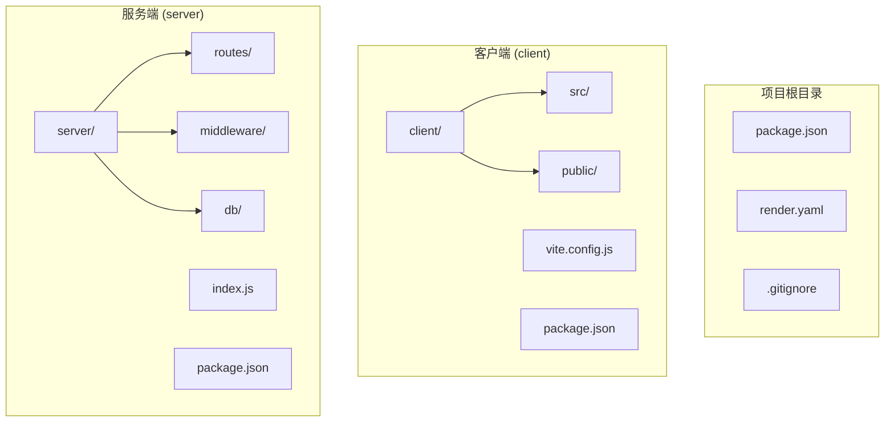
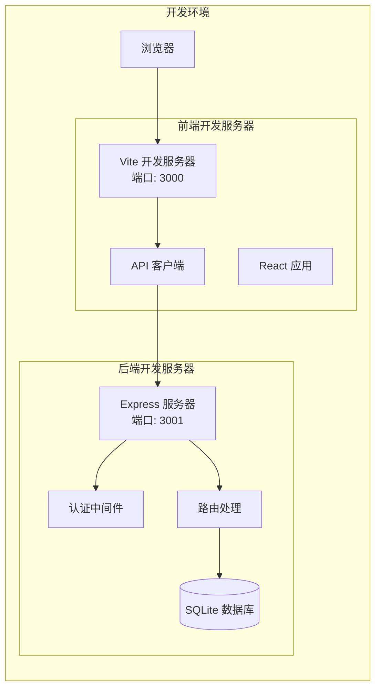
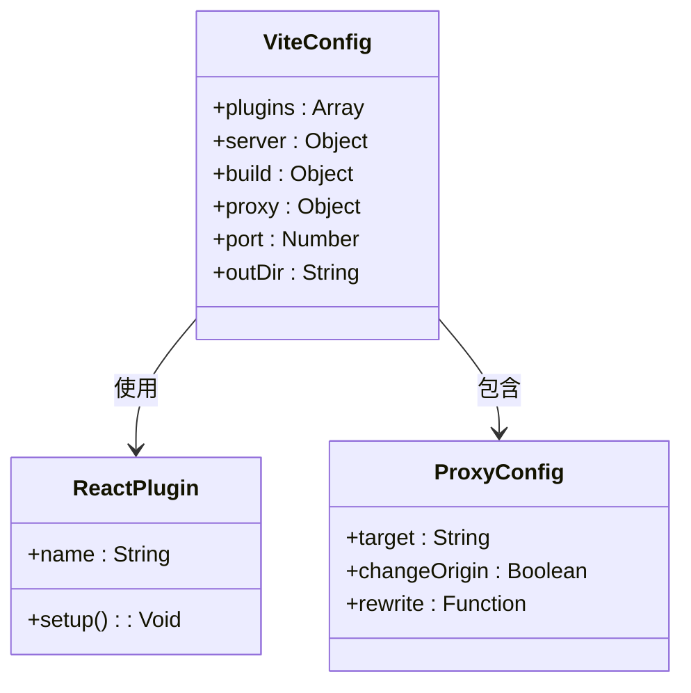
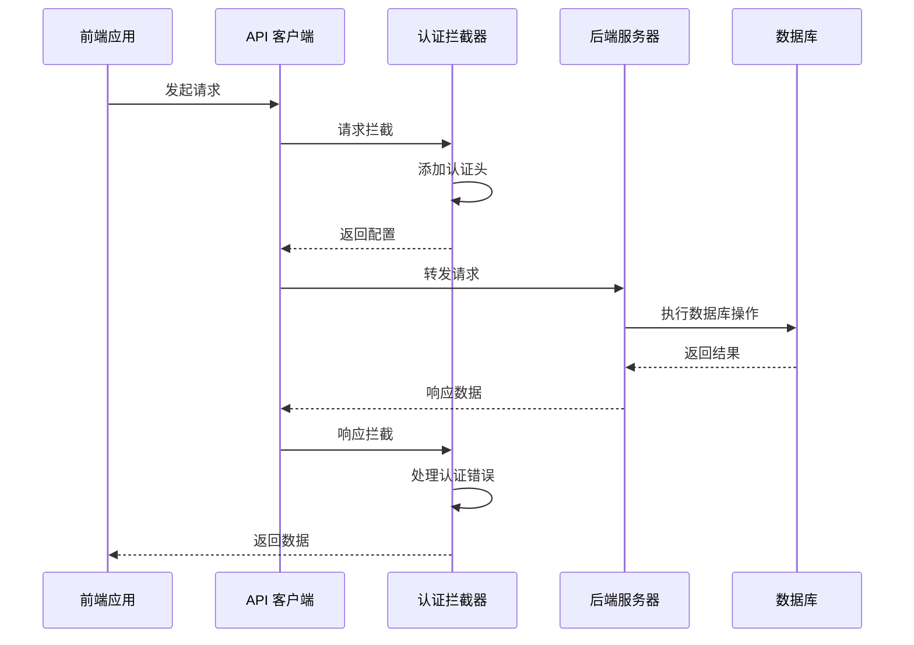
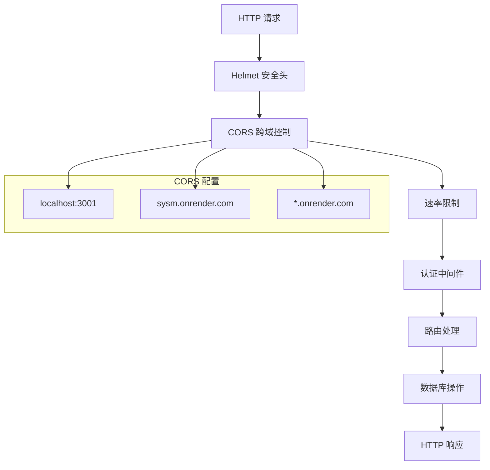
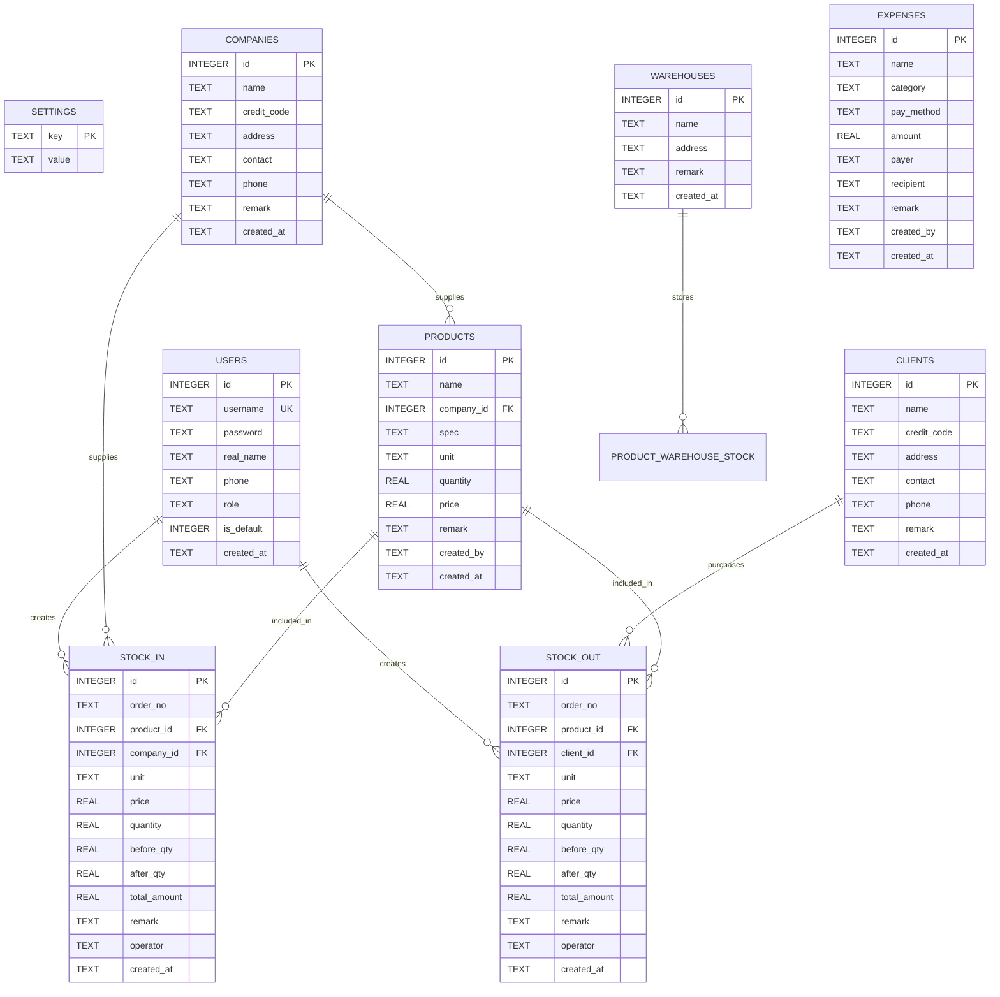
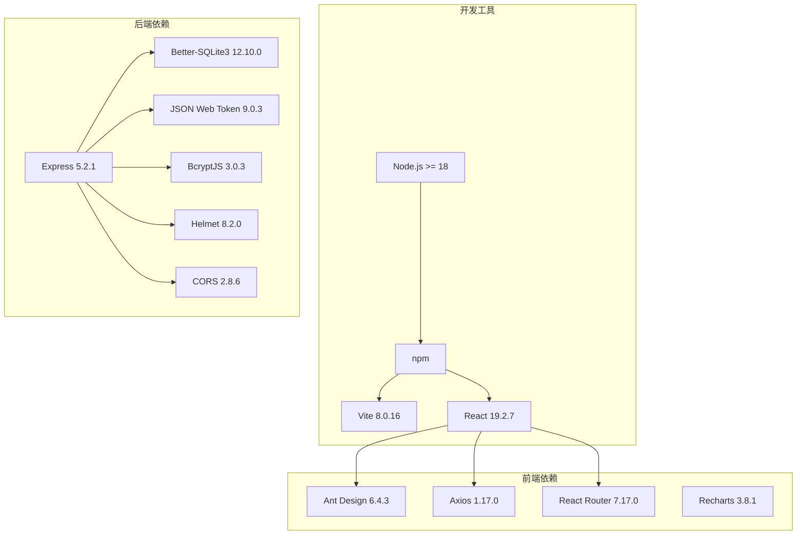
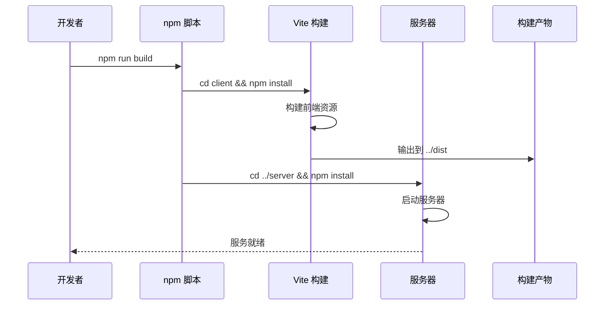

# 开发环境部署

<cite>
**本文档引用的文件**
- [client/package.json](file://client/package.json)
- [client/vite.config.js](file://client/vite.config.js)
- [client/src/api/index.js](file://client/src/api/index.js)
- [client/src/main.jsx](file://client/src/main.jsx)
- [client/src/App.jsx](file://client/src/App.jsx)
- [client/src/theme.js](file://client/src/theme.js)
- [server/package.json](file://server/package.json)
- [server/index.js](file://server/index.js)
- [server/middleware/auth.js](file://server/middleware/auth.js)
- [server/routes/auth.js](file://server/routes/auth.js)
- [server/db/init.js](file://server/db/init.js)
- [package.json](file://package.json)
- [render.yaml](file://render.yaml)
</cite>

## 目录
1. [简介](#简介)
2. [项目结构](#项目结构)
3. [核心组件](#核心组件)
4. [架构概览](#架构概览)
5. [详细组件分析](#详细组件分析)
6. [依赖关系分析](#依赖关系分析)
7. [性能考虑](#性能考虑)
8. [故障排除指南](#故障排除指南)
9. [结论](#结论)

## 简介

SY-Q 是一个基于 React + Express 的做账管理系统，采用前后端分离架构。本指南将详细介绍如何搭建本地开发环境，包括 Node.js 环境要求、依赖安装、开发服务器启动流程，以及 Vite 开发服务器的配置选项和前后端联调配置。

## 项目结构

该项目采用模块化组织方式，主要包含以下目录结构：

**图表来源**
- [client/package.json:1-27](file://client/package.json#L1-L27)
- [server/package.json:1-26](file://server/package.json#L1-L26)
- [package.json:1-13](file://package.json#L1-L13)

**章节来源**
- [client/package.json:1-27](file://client/package.json#L1-L27)
- [server/package.json:1-26](file://server/package.json#L1-L26)
- [package.json:1-13](file://package.json#L1-L13)

## 核心组件

### 技术栈概览

系统采用现代化的技术栈构建：

- **前端框架**: React 19.2.7 + Ant Design 6.4.3
- **构建工具**: Vite 8.0.16
- **后端框架**: Express 5.2.1
- **数据库**: Better-SQLite3 12.10.0
- **状态管理**: React Router 7.17.0
- **HTTP 客户端**: Axios 1.17.0

### 环境要求

- **Node.js 版本**: >= 18 (由 engines 字段指定)
- **包管理器**: npm (推荐使用 npm 8+)
- **操作系统**: Windows/Linux/macOS

**章节来源**
- [package.json:9-11](file://package.json#L9-L11)
- [client/package.json:11-25](file://client/package.json#L11-L25)
- [server/package.json:14-24](file://server/package.json#L14-L24)

## 架构概览

系统采用前后端分离架构，通过 API 代理实现跨域通信：

**图表来源**
- [client/vite.config.js:6-14](file://client/vite.config.js#L6-L14)
- [server/index.js:8-15](file://server/index.js#L8-L15)
- [client/src/api/index.js:4-7](file://client/src/api/index.js#L4-L7)

## 详细组件分析

### Vite 开发服务器配置

Vite 作为前端构建工具和开发服务器，提供了快速的热重载和优化的开发体验：

#### 核心配置选项

**图表来源**
- [client/vite.config.js:4-19](file://client/vite.config.js#L4-L19)

#### 开发服务器配置详解

- **端口配置**: 默认监听 3000 端口
- **插件系统**: 集成 React 插件支持 JSX 和现代 JavaScript
- **代理设置**: 将 `/api` 前缀的请求转发到后端服务器
- **构建输出**: 生产环境构建输出到 `../dist` 目录

**章节来源**
- [client/vite.config.js:4-19](file://client/vite.config.js#L4-L19)

### API 客户端配置

前端通过 Axios 创建统一的 API 客户端，实现了请求拦截和响应处理：

**图表来源**
- [client/src/api/index.js:9-39](file://client/src/api/index.js#L9-L39)
- [server/middleware/auth.js:5-19](file://server/middleware/auth.js#L5-L19)

#### API 客户端特性

- **基础配置**: 使用 `/api` 作为 API 基础路径
- **超时设置**: 30 秒请求超时
- **认证拦截**: 自动添加 Bearer Token 到请求头
- **错误处理**: 统一处理 401 未授权错误
- **消息提示**: 使用 Ant Design 的消息组件显示错误信息

**章节来源**
- [client/src/api/index.js:1-42](file://client/src/api/index.js#L1-L42)

### Express 服务器配置

后端服务器采用 Express 框架，集成了多项安全和性能特性：

**图表来源**
- [server/index.js:17-41](file://server/index.js#L17-L41)
- [server/middleware/auth.js:1-29](file://server/middleware/auth.js#L1-L29)

#### 安全配置详解

- **CORS 设置**: 支持本地开发和生产环境部署
- **安全头**: 使用 Helmet 提供安全响应头
- **请求限制**: 全局 API 限流和登录专用限流
- **数据库初始化**: Better-SQLite3 数据库连接和表结构

**章节来源**
- [server/index.js:17-63](file://server/index.js#L17-L63)
- [server/middleware/auth.js:1-29](file://server/middleware/auth.js#L1-L29)

### 数据库初始化

系统使用 Better-SQLite3 作为数据库引擎，自动初始化必要的数据表：

**图表来源**
- [server/db/init.js:21-214](file://server/db/init.js#L21-L214)

**章节来源**
- [server/db/init.js:18-214](file://server/db/init.js#L18-L214)

## 依赖关系分析

### 开发环境依赖图

**图表来源**
- [client/package.json:11-25](file://client/package.json#L11-L25)
- [server/package.json:14-24](file://server/package.json#L14-L24)

### 构建流程依赖

**图表来源**
- [package.json:6-6](file://package.json#L6-L6)

**章节来源**
- [client/package.json:11-25](file://client/package.json#L11-L25)
- [server/package.json:14-24](file://server/package.json#L14-L24)
- [package.json:6-6](file://package.json#L6-L6)

## 性能考虑

### 开发服务器性能优化

- **热重载机制**: Vite 使用 ES 模块原生支持，提供快速的热更新
- **按需编译**: 只编译当前页面使用的模块
- **预构建依赖**: 第三方依赖预先构建以提高启动速度

### 生产环境优化

- **代码分割**: 自动生成代码分割，减少初始加载时间
- **静态资源优化**: 自动压缩和优化静态资源
- **缓存策略**: 合理的缓存头设置，提升重复访问性能

## 故障排除指南

### 常见启动问题

#### 1. 端口占用问题

**症状**: 启动时出现端口被占用错误
**解决方案**: 
- 检查端口 3000 和 3001 是否被其他进程占用
- 修改 Vite 配置中的端口号
- 使用任务管理器结束相关进程

#### 2. 依赖安装失败

**症状**: npm install 报错
**解决方案**:
- 清理 npm 缓存: `npm cache clean --force`
- 删除 node_modules 和 package-lock.json 重新安装
- 检查网络连接和 npm 镜像配置

#### 3. CORS 跨域错误

**症状**: 浏览器控制台出现 CORS 错误
**解决方案**:
- 确认前端代理配置正确指向后端服务器
- 检查后端 CORS 配置是否允许前端来源
- 在开发环境中确保使用正确的端口号

#### 4. 数据库连接问题

**症状**: 启动时数据库初始化失败
**解决方案**:
- 检查 SQLite 文件权限
- 确认数据库文件路径正确
- 验证 Better-SQLite3 版本兼容性

#### 5. 认证失败问题

**症状**: 登录后无法访问受保护的路由
**解决方案**:
- 检查 JWT 密钥配置一致性
- 验证 token 存储和传递机制
- 确认认证中间件正确配置

**章节来源**
- [server/index.js:17-41](file://server/index.js#L17-L41)
- [client/src/api/index.js:9-39](file://client/src/api/index.js#L9-L39)
- [server/middleware/auth.js:1-29](file://server/middleware/auth.js#L1-L29)

## 结论

SY-Q 系统提供了完整的开发环境配置，具有以下特点：

1. **现代化技术栈**: 采用 React + Express + SQLite 的组合，适合中小型项目
2. **完善的开发体验**: Vite 提供快速的热重载和优化的开发体验
3. **安全可靠的架构**: 集成多种安全措施，包括 CORS、速率限制和认证保护
4. **易于部署**: 支持本地开发和云端部署，配置简单

建议开发者按照本文档的步骤进行环境搭建，并根据实际需求调整配置参数。如遇问题，可参考故障排除指南或检查相关配置文件。