# 生产环境部署

<cite>
**本文档引用的文件**
- [render.yaml](file://render.yaml)
- [package.json](file://package.json)
- [client/package.json](file://client/package.json)
- [server/package.json](file://server/package.json)
- [client/vite.config.js](file://client/vite.config.js)
- [server/index.js](file://server/index.js)
- [server/db/init.js](file://server/db/init.js)
- [server/middleware/auth.js](file://server/middleware/auth.js)
- [client/src/api/index.js](file://client/src/api/index.js)
- [.gitignore](file://.gitignore)
</cite>

## 更新摘要
**所做更改**
- 更新了构建系统兼容性章节，反映Vite版本降级和npx使用
- 修改了Render部署配置，增加清理步骤防止构建冲突
- 更新了前端构建配置以反映新的Vite版本和构建流程
- 增强了跨平台兼容性说明

## 目录
1. [简介](#简介)
2. [项目结构](#项目结构)
3. [核心组件](#核心组件)
4. [架构概览](#架构概览)
5. [详细组件分析](#详细组件分析)
6. [构建系统兼容性改进](#构建系统兼容性改进)
7. [依赖关系分析](#依赖关系分析)
8. [性能考虑](#性能考虑)
9. [故障排除指南](#故障排除指南)
10. [结论](#结论)
11. [附录](#附录)

## 简介

SY-Q 是一个基于 React 和 Express 的做账管理系统，采用前后端同域部署模式。本指南专注于在 Render 平台上进行生产环境部署，涵盖完整的部署配置、环境准备、性能优化和监控建议。系统经过构建兼容性优化，确保在现代Node.js环境中稳定运行。

## 项目结构

SY-Q 采用前后端分离的单仓库管理模式，具有清晰的模块化结构：

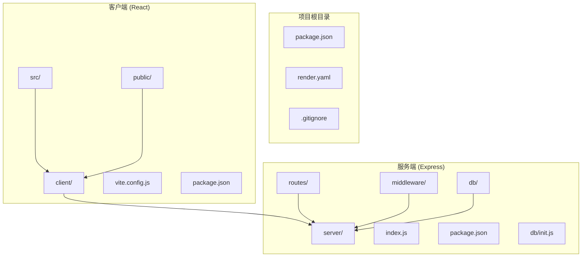

**图表来源**
- [render.yaml:1-13](file://render.yaml#L1-L13)
- [package.json:1-13](file://package.json#L1-L13)
- [client/package.json:1-27](file://client/package.json#L1-L27)
- [server/package.json:1-26](file://server/package.json#L1-L26)

**章节来源**
- [render.yaml:1-13](file://render.yaml#L1-L13)
- [package.json:1-13](file://package.json#L1-L13)
- [client/package.json:1-27](file://client/package.json#L1-L27)
- [server/package.json:1-26](file://server/package.json#L1-L26)

## 核心组件

### Render 平台配置

Render.yaml 文件定义了完整的部署配置，支持一键部署到 Render 平台：

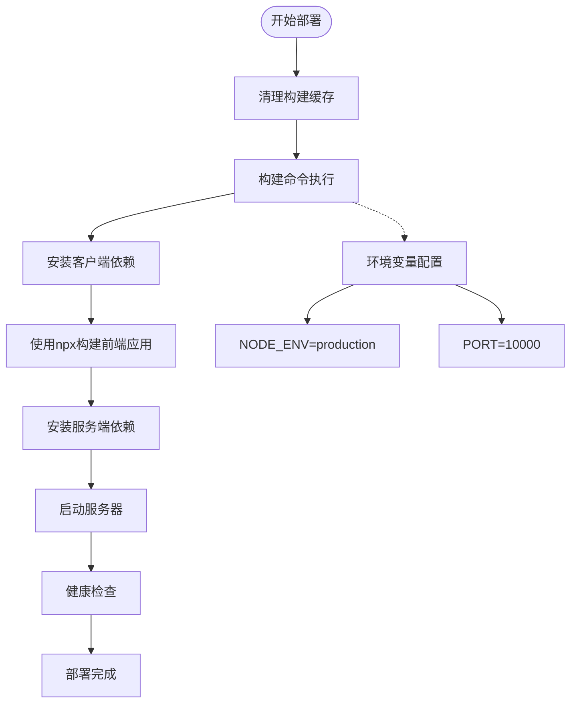

**图表来源**
- [render.yaml:5](file://render.yaml#L5)

### Node.js 版本要求

项目对 Node.js 版本有明确要求：
- 最低版本：18.x 或更高
- 推荐使用：LTS 版本以获得最佳稳定性
- 兼容性：已针对Node v26环境优化

**章节来源**
- [package.json:9-11](file://package.json#L9-L11)
- [render.yaml:4](file://render.yaml#L4)

## 架构概览

SY-Q 采用前后端同域部署架构，实现了高效的单页应用(SPA)体验：

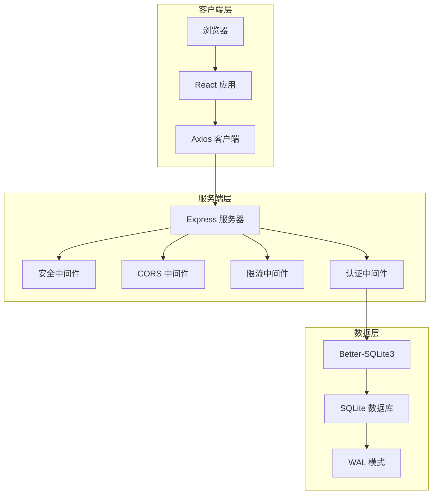

**图表来源**
- [server/index.js:1-120](file://server/index.js#L1-L120)
- [server/db/init.js:1-217](file://server/db/init.js#L1-L217)

## 详细组件分析

### 服务器配置分析

#### 安全中间件配置

服务器采用了多层安全防护机制：

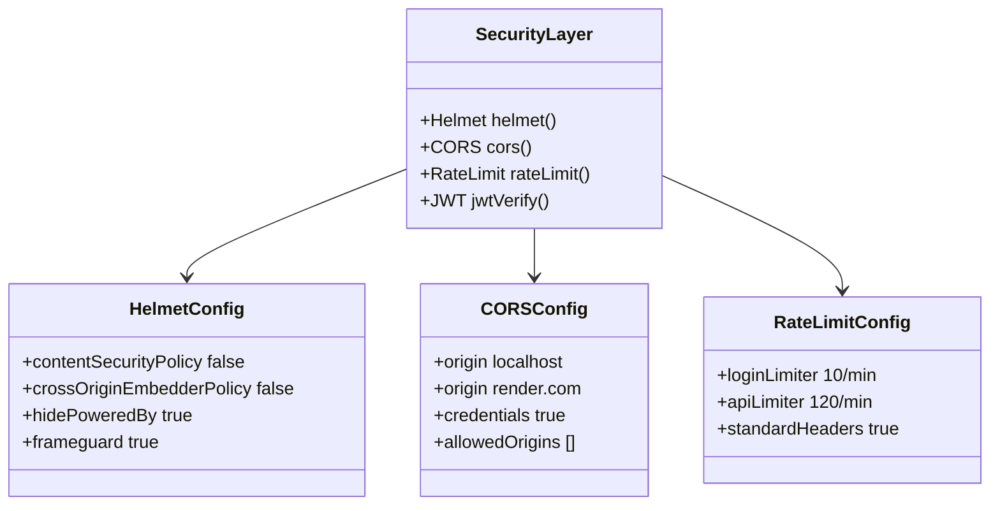

**图表来源**
- [server/index.js:12-63](file://server/index.js#L12-L63)

#### 数据库初始化

系统使用 Better-SQLite3 作为主要数据库存储：

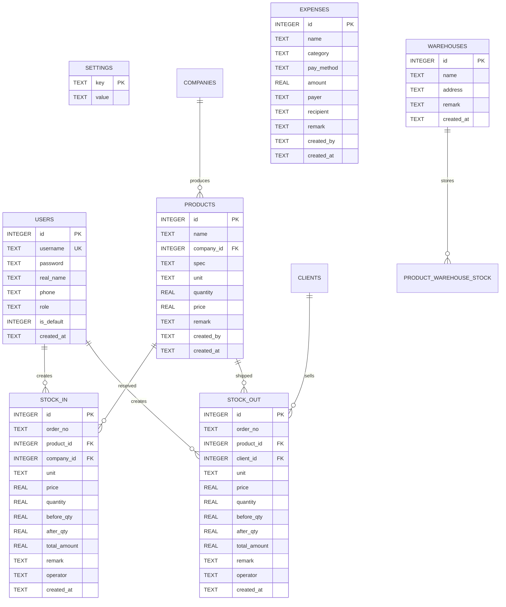

**图表来源**
- [server/db/init.js:21-186](file://server/db/init.js#L21-L186)

**章节来源**
- [server/index.js:12-119](file://server/index.js#L12-L119)
- [server/db/init.js:18-214](file://server/db/init.js#L18-L214)

### 前端构建配置

#### Vite 构建优化

前端使用 Vite 进行快速构建和开发，现已降级到兼容Node v26的版本：

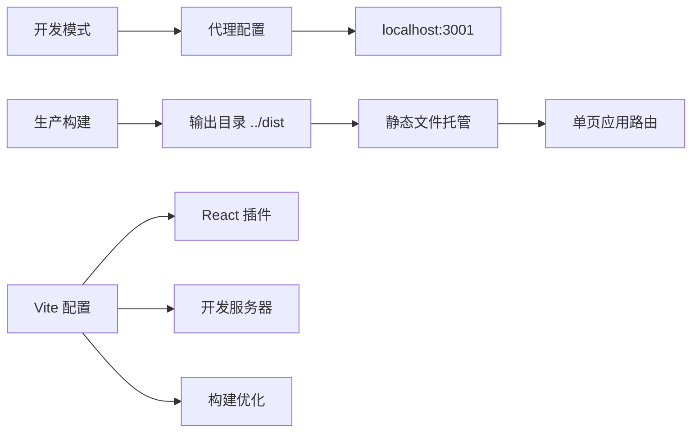

**图表来源**
- [client/vite.config.js:4-19](file://client/vite.config.js#L4-L19)

#### API 客户端配置

Axios 客户端配置了统一的请求拦截器：

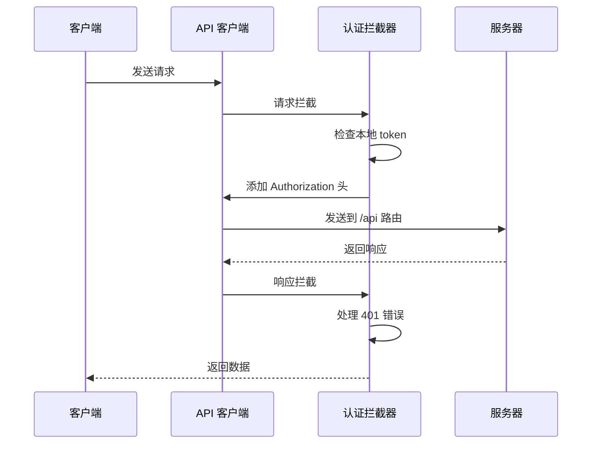

**图表来源**
- [client/src/api/index.js:9-39](file://client/src/api/index.js#L9-L39)

**章节来源**
- [client/vite.config.js:1-20](file://client/vite.config.js#L1-L20)
- [client/src/api/index.js:1-42](file://client/src/api/index.js#L1-L42)

## 构建系统兼容性改进

### Vite 版本降级

为了确保与 Render 平台的 Node v26 环境兼容，Vite 版本已从 8.0.16 降级到 5.4.19：

- **新版本**：vite@^5.4.19
- **旧版本**：vite@^8.0.16
- **兼容性**：确保在 Node v26 环境中的稳定运行

### npx 构建命令

构建命令已从直接调用 Vite 二进制文件改为使用 npx，提高了跨平台兼容性：

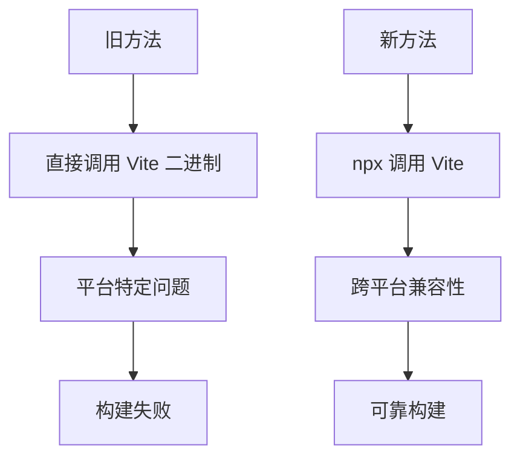

**图表来源**
- [render.yaml:5](file://render.yaml#L5)

### 清理步骤增强

Render 部署配置增加了清理步骤，防止构建冲突：

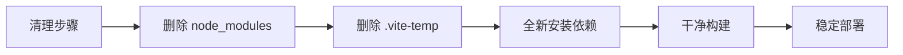

**图表来源**
- [render.yaml:5](file://render.yaml#L5)

**章节来源**
- [client/package.json:24](file://client/package.json#L24)
- [render.yaml:5](file://render.yaml#L5)

## 依赖关系分析

### 服务器依赖层次

```mermaid
graph TB
subgraph "核心框架"
Express[express@^5.2.1]
BetterSQLite3[better-sqlite3@^12.10.0]
end
subgraph "安全中间件"
Helmet[helmet@^8.2.0]
CORS[cors@^2.8.6]
RateLimit[express-rate-limit@^8.5.2]
end
subgraph "认证相关"
JWT[jsonwebtoken@^9.0.3]
Bcrypt[bcryptjs@^3.0.3]
end
subgraph "文件处理"
Multer[multer@^2.1.1]
XLSX[xlsx@^0.18.5]
end
Express --> Helmet
Express --> CORS
Express --> RateLimit
Express --> BetterSQLite3
Express --> JWT
Express --> Bcrypt
Express --> Multer
Express --> XLSX
```

**图表来源**
- [server/package.json:14-24](file://server/package.json#L14-L24)

### 客户端依赖分析

```mermaid
graph LR
subgraph "UI 框架"
AntD[antd@^6.4.3]
React[react@^19.2.7]
ReactDOM[react-dom@^19.2.7]
end
subgraph "工具库"
Axios[axios@^1.17.0]
DayJS[dayjs@^1.11.21]
Recharts[recharts@^3.8.1]
end
subgraph "开发工具"
Vite[vite@^5.4.19]
ReactPlugin[@vitejs/plugin-react@^4.3.4]
end
AntD --> React
React --> ReactDOM
Axios --> React
DayJS --> React
Recharts --> AntD
```

**图表来源**
- [client/package.json:11-25](file://client/package.json#L11-L25)

**章节来源**
- [server/package.json:1-26](file://server/package.json#L1-L26)
- [client/package.json:1-27](file://client/package.json#L1-L27)

## 性能考虑

### 缓存策略

系统采用多层缓存机制：

1. **数据库缓存**：WAL 模式提升并发读写性能
2. **静态资源缓存**：Vite 构建生成优化的静态文件
3. **会话缓存**：JWT 令牌存储在客户端本地存储中

### 压缩配置

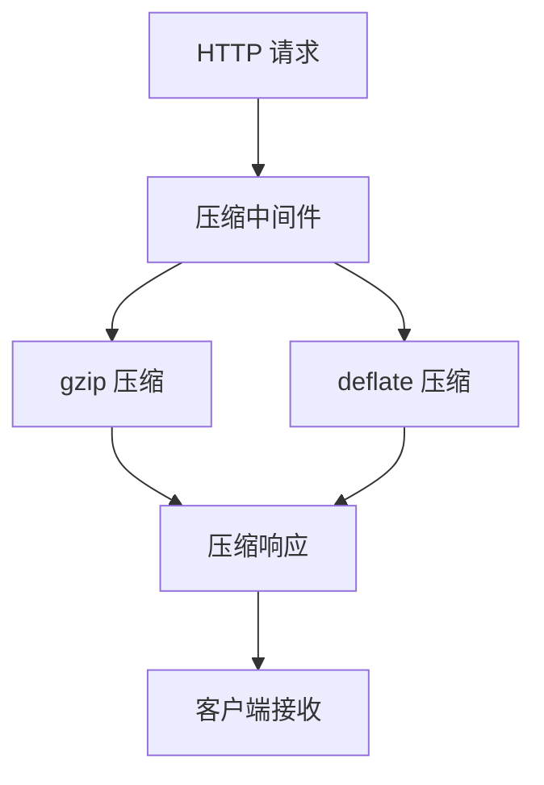

### 安全设置

系统实施了全面的安全措施：

1. **CORS 配置**：严格的来源控制
2. **速率限制**：防止暴力破解和 DDoS 攻击
3. **安全头部**：Helmet 提供多种安全保护
4. **认证机制**：JWT 令牌认证

**章节来源**
- [server/index.js:12-63](file://server/index.js#L12-L63)
- [server/db/init.js:12](file://server/db/init.js#L12)

## 故障排除指南

### 常见部署问题

#### 数据库连接问题

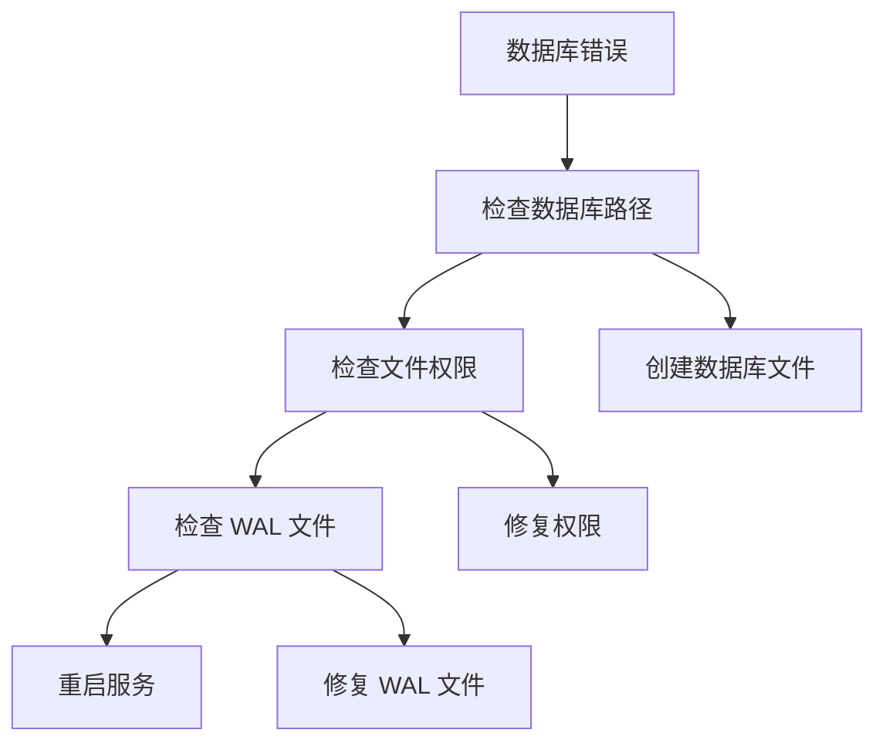

#### CORS 配置问题

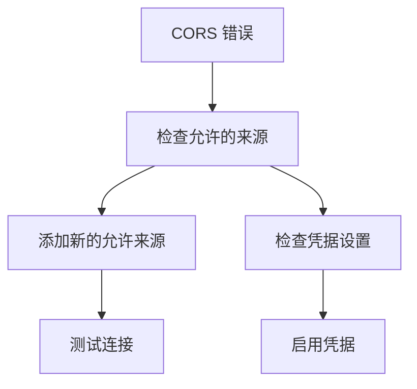

#### 环境变量问题

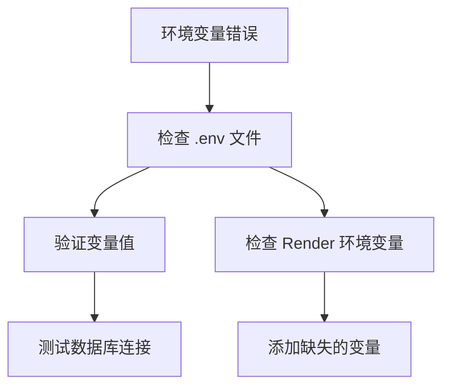

#### 构建兼容性问题

**新增**：针对Vite版本降级和npx使用的问题排查：

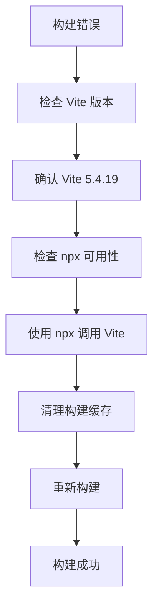

**章节来源**
- [server/index.js:18-41](file://server/index.js#L18-L41)
- [server/db/init.js:5](file://server/db/init.js#L5)
- [client/package.json:24](file://client/package.json#L24)
- [render.yaml:5](file://render.yaml#L5)

### 监控配置建议

#### 健康检查端点

建议实现以下监控端点：

1. **数据库健康检查**：验证数据库连接状态
2. **文件系统检查**：确认数据库文件可访问
3. **API 健康检查**：测试核心 API 功能

#### 日志记录

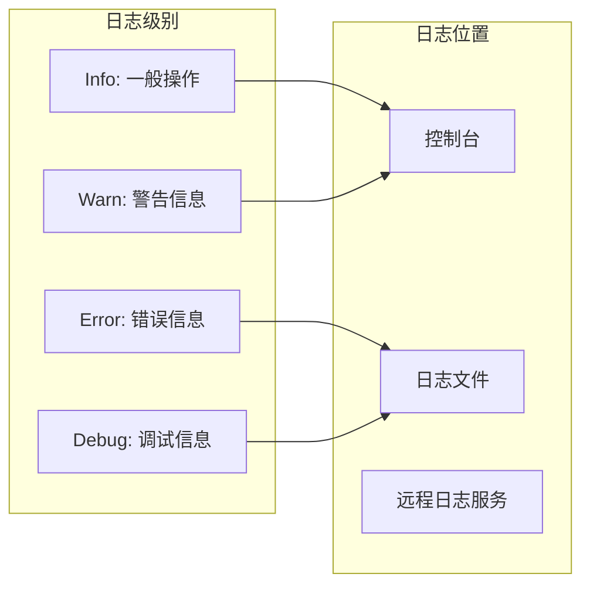

## 结论

SY-Q 系统在 Render 平台上的部署配置经过优化，确保了更好的兼容性和稳定性。关键改进包括：

1. **Vite版本降级**：从8.0.16降至5.4.19，确保与Node v26环境兼容
2. **npx构建命令**：提高跨平台构建可靠性
3. **清理步骤增强**：防止构建冲突，确保稳定部署
4. **正确的 Node.js 版本**：确保满足最低版本要求
5. **环境变量配置**：正确设置生产环境变量
6. **数据库配置**：合理配置 SQLite 数据库
7. **安全设置**：实施多层次的安全防护
8. **性能优化**：利用缓存和压缩提升性能

这些改进使得系统在现代部署环境中更加稳定可靠。

## 附录

### 部署前检查清单

- [ ] Node.js 版本满足要求 (>= 18)
- [ ] Vite 版本为 5.4.19（兼容Node v26）
- [ ] npx 工具可用
- [ ] 数据库文件权限正确
- [ ] 环境变量配置完整
- [ ] 防火墙规则允许 10000 端口
- [ ] SSL 证书配置（如需要）

### 生产环境最佳实践

1. **定期备份**：建立自动备份策略
2. **监控告警**：设置关键指标监控
3. **安全更新**：定期更新依赖包
4. **性能监控**：持续监控应用性能
5. **日志管理**：建立完善的日志体系
6. **构建优化**：使用npx确保跨平台兼容性
7. **缓存清理**：定期清理构建缓存避免冲突