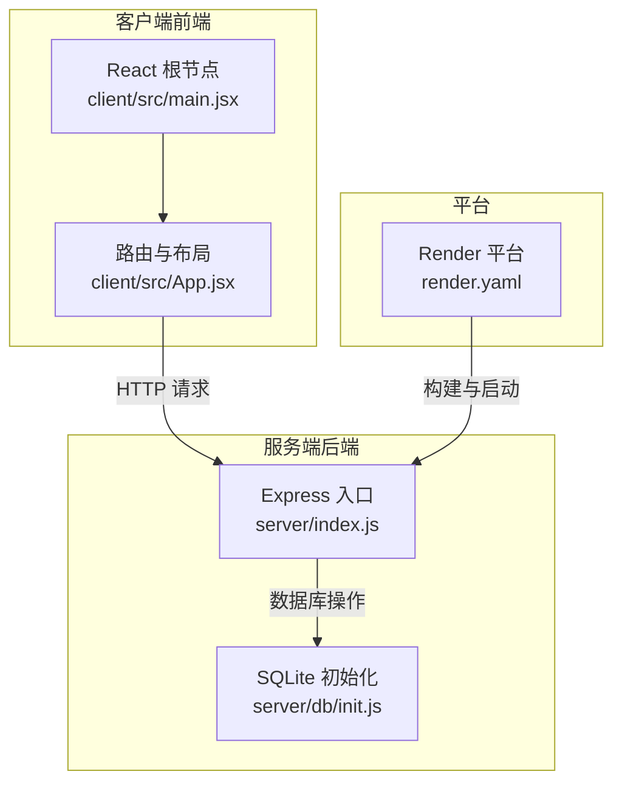
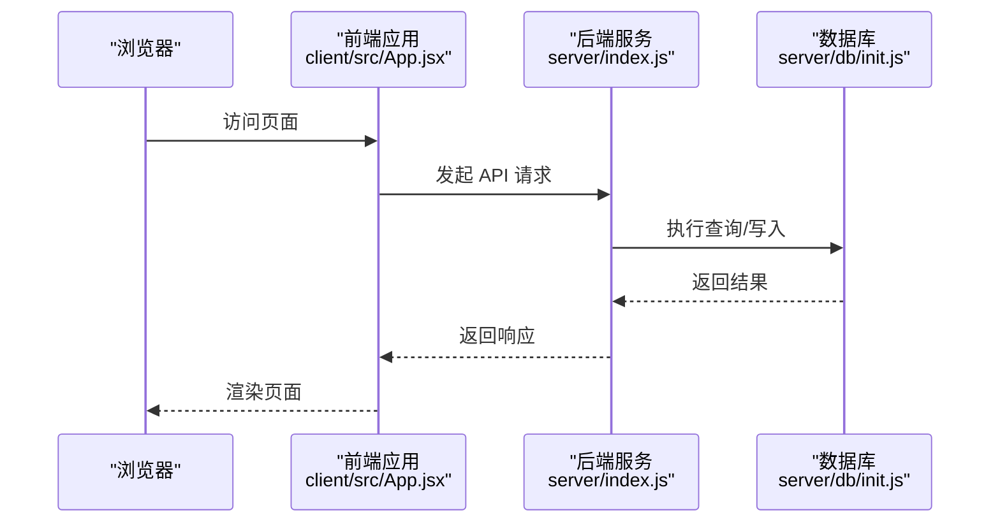
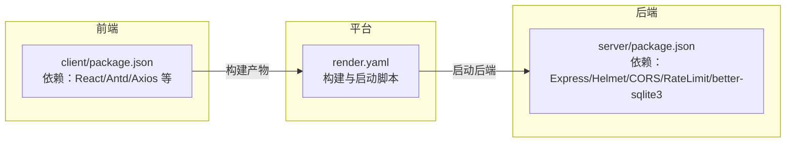

# 监控与日志

<cite>
**本文引用的文件**
- [server/index.js](file://server/index.js)
- [server/db/init.js](file://server/db/init.js)
- [server/package.json](file://server/package.json)
- [client/src/main.jsx](file://client/src/main.jsx)
- [client/src/App.jsx](file://client/src/App.jsx)
- [client/package.json](file://client/package.json)
- [render.yaml](file://render.yaml)
- [package.json](file://package.json)
</cite>

## 目录
1. [简介](#简介)
2. [项目结构](#项目结构)
3. [核心组件](#核心组件)
4. [架构总览](#架构总览)
5. [详细组件分析](#详细组件分析)
6. [依赖关系分析](#依赖关系分析)
7. [性能考虑](#性能考虑)
8. [故障排查指南](#故障排查指南)
9. [结论](#结论)
10. [附录](#附录)

## 简介
本指南面向 SY-Q 系统部署后的运维与开发团队，提供一套可落地的监控与日志管理方案。内容涵盖：
- 应用性能监控（APM）的配置思路与关键指标采集建议
- 健康检查与自动重启策略
- 前后端日志的收集、存储与分析路径
- 错误追踪与性能分析工具的集成建议
- 部署后常见问题的排查流程

## 项目结构
SY-Q 采用前后端分离架构：前端为 React 应用，通过 Vite 构建；后端为 Node.js + Express 服务，使用 better-sqlite3 作为本地数据库。部署于 Render 平台，通过单一入口启动后端服务。

图表来源
- [client/src/main.jsx:1-14](file://client/src/main.jsx#L1-L14)
- [client/src/App.jsx:1-67](file://client/src/App.jsx#L1-L67)
- [server/index.js:1-120](file://server/index.js#L1-L120)
- [server/db/init.js:1-217](file://server/db/init.js#L1-L217)
- [render.yaml:1-13](file://render.yaml#L1-L13)

章节来源
- [client/src/main.jsx:1-14](file://client/src/main.jsx#L1-L14)
- [client/src/App.jsx:1-67](file://client/src/App.jsx#L1-L67)
- [server/index.js:1-120](file://server/index.js#L1-L120)
- [server/db/init.js:1-217](file://server/db/init.js#L1-L217)
- [render.yaml:1-13](file://render.yaml#L1-L13)

## 核心组件
- 后端服务（Express）：负责路由注册、CORS/Helmet 安全中间件、速率限制、静态资源托管与全局错误处理。
- 数据库层（better-sqlite3）：负责本地 SQLite 数据初始化与迁移。
- 前端应用（React + Ant Design）：负责用户界面与路由跳转。
- 平台编排（Render）：负责构建命令、启动命令、环境变量与运行计划。

章节来源
- [server/index.js:1-120](file://server/index.js#L1-L120)
- [server/db/init.js:1-217](file://server/db/init.js#L1-L217)
- [client/src/main.jsx:1-14](file://client/src/main.jsx#L1-L14)
- [client/src/App.jsx:1-67](file://client/src/App.jsx#L1-L67)
- [render.yaml:1-13](file://render.yaml#L1-L13)

## 架构总览
下图展示了从浏览器到后端服务与数据库的整体交互路径，以及部署平台的角色。

图表来源
- [client/src/App.jsx:1-67](file://client/src/App.jsx#L1-L67)
- [server/index.js:1-120](file://server/index.js#L1-L120)
- [server/db/init.js:1-217](file://server/db/init.js#L1-L217)

## 详细组件分析

### 后端服务（Express）监控要点
- 安全与防护
  - 使用 Helmet 设置安全响应头，降低常见 Web 攻击面。
  - 使用 CORS 中间件对来源进行白名单校验，支持 Render 子域名与自定义域名。
- 限流与稳定性
  - 登录接口每 IP 每分钟最多 10 次，避免暴力破解。
  - 全局 API 接口每 IP 每分钟最多 120 次，防止滥用。
- 资源与静态托管
  - 限制请求体大小为 2MB，避免异常体积请求导致内存压力。
  - 生产环境托管 dist 目录下的静态资源，并回退到单页应用路由。
- 错误处理
  - 统一捕获 CORS 拒绝与未捕获异常，输出结构化错误信息。

建议补充的监控指标（基于现有实现扩展）：
- 指标类型：请求数、成功率、平均/95 分位响应时间、错误码分布、速率限制触发次数、CPU/内存占用、数据库连接数与慢查询计数。
- 采集方式：结合平台日志与 APM 工具（见“性能考虑”与“故障排查指南”）。

章节来源
- [server/index.js:1-120](file://server/index.js#L1-L120)

### 数据库层（SQLite）监控要点
- 初始化与迁移：确保表结构与必要字段存在，插入默认数据。
- WAL 模式与外键约束：提升并发写入与数据一致性。
- 建议监控：慢查询统计、表大小增长趋势、索引使用情况、备份完整性校验。

章节来源
- [server/db/init.js:1-217](file://server/db/init.js#L1-L217)

### 前端应用（React）监控要点
- 路由与渲染：通过 BrowserRouter 管理路由，私有路由鉴权基于本地 Token。
- 建议监控：首屏加载时间、路由切换耗时、错误边界捕获的前端异常、网络请求失败率。

章节来源
- [client/src/main.jsx:1-14](file://client/src/main.jsx#L1-L14)
- [client/src/App.jsx:1-67](file://client/src/App.jsx#L1-L67)

### 平台编排（Render）要点
- 构建命令：先安装前端依赖并执行 Vite 构建，再安装后端依赖。
- 启动命令：直接启动后端入口。
- 环境变量：NODE_ENV=production，PORT=10000。
- 运行计划：free。

章节来源
- [render.yaml:1-13](file://render.yaml#L1-L13)
- [package.json:1-13](file://package.json#L1-L13)

## 依赖关系分析
- 前端依赖：Ant Design、Axios、React 生态等，用于界面与网络请求。
- 后端依赖：Express、Helmet、CORS、express-rate-limit、better-sqlite3 等，用于服务框架、安全、限流与数据库访问。
- 平台依赖：Render 提供容器化运行与环境变量注入。

图表来源
- [client/package.json:1-27](file://client/package.json#L1-L27)
- [server/package.json:1-26](file://server/package.json#L1-L26)
- [render.yaml:1-13](file://render.yaml#L1-L13)

章节来源
- [client/package.json:1-27](file://client/package.json#L1-L27)
- [server/package.json:1-26](file://server/package.json#L1-L26)
- [render.yaml:1-13](file://render.yaml#L1-L13)

## 性能考虑
- 限流与安全
  - 当前已启用登录与全局 API 的速率限制，建议结合平台日志观察触发频率，按需调整阈值。
- 数据库性能
  - 使用 WAL 模式与外键约束，建议定期检查慢查询与索引缺失情况。
- 前端性能
  - 关注首屏与路由切换性能，结合浏览器性能面板与 APM 工具定位瓶颈。
- APM 工具集成建议
  - 后端：可引入 APM 工具（如 Node.js 自带探针或第三方 APM），开启 HTTP 请求追踪、数据库调用追踪与错误采样。
  - 前端：可引入前端 APM SDK，采集性能指标与错误事件。
- 日志与指标
  - 将后端控制台日志输出到标准输出，交由平台统一收集；同时在关键业务点埋点，形成结构化指标。

[本节为通用指导，不直接分析具体文件]

## 故障排查指南
- 健康检查
  - 在 Render 上配置健康检查端点（例如 GET /health），返回 200 表示存活。
  - 结合平台日志查看启动阶段错误（如端口占用、依赖缺失）。
- 自动重启策略
  - Render 的免费计划可能在空闲时休眠，建议配合健康检查与外部监控服务（如 Uptime Kuma 或平台自带监控）进行告警与自动恢复。
- 常见问题定位
  - CORS 拒绝：检查 ALLOWED_ORIGINS 环境变量与请求来源是否在白名单内。
  - 429 频率限制：确认登录与全局 API 的限流阈值是否合理，必要时临时放宽或分地域限流。
  - 500 内部错误：查看后端控制台日志，定位具体路由与数据库操作。
  - 静态资源 404：确认构建产物是否生成至 dist，且服务正确托管静态目录。
- 错误追踪与性能分析
  - 后端：启用 APM 的错误追踪与事务采样，结合数据库慢查询日志定位热点接口。
  - 前端：启用前端 APM 的错误与性能采集，关注路由切换与大列表渲染。

章节来源
- [server/index.js:108-115](file://server/index.js#L108-L115)
- [server/index.js:18-41](file://server/index.js#L18-L41)
- [server/index.js:46-63](file://server/index.js#L46-L63)
- [render.yaml:1-13](file://render.yaml#L1-13)

## 结论
- SY-Q 当前具备基础的安全与限流能力，建议在此基础上补充 APM 工具与结构化日志体系。
- 通过平台健康检查与外部监控，可实现自动重启与告警联动。
- 前后端均应增加关键指标采集与错误追踪，以支撑持续优化与快速定位问题。

[本节为总结性内容，不直接分析具体文件]

## 附录

### 健康检查与自动重启配置建议
- 健康检查端点：GET /health，返回 200。
- 自动重启：结合平台日志与外部监控服务，当连续失败超过阈值时触发重建或重启。
- 告警：针对 5xx 错误率、响应时间 P95、速率限制触发次数、数据库慢查询等设置阈值告警。

[本节为通用指导，不直接分析具体文件]

### 日志收集与分析建议
- 后端日志
  - 输出到标准输出，由平台统一收集。
  - 在关键路由与数据库操作处增加结构化日志（包含请求 ID、用户标识、耗时、状态码）。
- 前端日志
  - 使用前端 APM SDK 采集错误与性能事件。
  - 对关键交互（登录、报表导出、批量操作）埋点。
- 存储与分析
  - 平台侧：使用 Render 日志面板进行实时查看与过滤。
  - 外部分析：将日志导出至集中式日志平台（如 ELK/Cloud Logging）进行聚合与可视化。

[本节为通用指导，不直接分析具体文件]